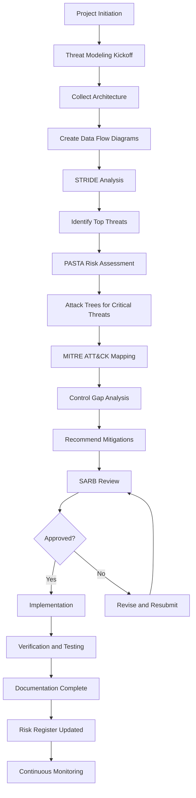

# Part 1: Foundations of Secure Architecture & Framework Integration
## Section 1.4: Threat Modeling (STRIDE, PASTA, Attack Trees, MITRE ATT&CK)

## The Target: Complete Threat Modeling Suite for Nexus Global Industries

In this section, we'll build a comprehensive threat modeling suite for Nexus Global Industries, integrating multiple methodologies:

1. **STRIDE** - Systematic component-level threat identification
2. **PASTA** - Risk-centric, business-aligned threat modeling
3. **Attack Trees** - Visual mapping of attack paths
4. **MITRE ATT&CK** - Threat-informed control mapping

**What specific file(s) are we building?**
- `threat_models/01_stride_analysis.xlsx` - STRIDE threat identification
- `threat_models/02_pasta_risk_model.md` - PASTA risk-centric modeling
- `threat_models/03_attack_trees.drawio` - Visual attack path analysis
- `threat_models/04_mitre_attack_mapping.csv` - MITRE ATT&CK control mapping
- `threat_models/05_threat_modeling_process.md` - Methodology and workflow

---

## The Concept: Threat Modeling in Plain English

Think of threat modeling like **planning a building's security before construction**:

**STRIDE:** "We systematically check every door, window, and access point for six types of problems." This is the component-level threat identification.

**PASTA:** "We start with the business risk and work backward to find what could cause it." This is business-aligned threat modeling.

**Attack Trees:** "We draw a tree diagram showing all the ways an attacker could break in." This is visual attack path mapping.

**MITRE ATT&CK:** "We use an encyclopedia of real-world attacker techniques to make sure we're protected." This is threat-informed defense.

Together, these methodologies ensure we don't miss threats, prioritize based on business impact, and build defenses against real-world attacker techniques.

---

## Implementation Phase

### Step 1: Create the Project Structure

```bash
# Create the threat models directory
cd ~/nexus_security_architecture
mkdir -p threat_models

# Verify the structure
ls -la
# Expected: threat_models directory appears
```

---

### Step 2: STRIDE Threat Analysis

STRIDE is a systematic methodology for identifying threats across six categories.

**File:** `threat_models/01_stride_analysis.csv`

```csv
"Component","Threat Category","Threat Description","Impact","Likelihood","Mitigation","Owner","Status"
"Customer Portal - Authentication","Spoofing","Attacker spoofs legitimate user credentials to gain unauthorized access","HIGH","HIGH","MFA (WebAuthn/TOTP), OIDC with Keycloak, anomaly detection","Lead Security Architect","In Progress"
"Customer Portal - Authentication","Tampering","Attacker intercepts and modifies authentication tokens in transit","HIGH","MODERATE","mTLS (Istio), JWT signatures, short-lived tokens","Lead Security Architect","In Progress"
"Customer Portal - Authentication","Repudiation","User denies performing actions (no proof of transaction)","MEDIUM","MODERATE","Comprehensive audit logging (ELK), digital signatures, non-repudiation mechanisms","Lead Security Architect","In Progress"
"Customer Portal - Authentication","Information Disclosure","Authentication logs inadvertently expose credential data","HIGH","LOW","Log sanitization (mask PII), secure storage, access controls","Lead Security Architect","In Progress"
"Customer Portal - Authentication","Denial of Service","Brute-force password attacks overwhelm authentication service","HIGH","HIGH","Rate limiting (Kong), account lockout policies, CAPTCHA","Lead Security Architect","In Progress"
"Customer Portal - Authentication","Elevation of Privilege","User exploits authentication vulnerability to gain admin privileges","CRITICAL","MODERATE","Least privilege (RBAC/ABAC), OPA policies, regular reviews","Lead Security Architect","In Progress"
"Customer Portal - API Gateway","Spoofing","Attacker spoofs API gateway identity to intercept traffic","HIGH","LOW","mTLS for all services, mutual authentication","Lead Security Architect","Implemented"
"Customer Portal - API Gateway","Tampering","Attacker modifies API requests in transit (man-in-the-middle)","HIGH","MODERATE","TLS 1.3, JWT signatures, request validation","Lead Security Architect","In Progress"
"Customer Portal - API Gateway","Repudiation","API requests not logged, unable to trace actions","MEDIUM","LOW","Comprehensive API logging, audit trails","Lead Security Architect","Implemented"
"Customer Portal - API Gateway","Information Disclosure","API error messages expose database schema or internals","HIGH","MODERATE","Error handling (generic messages), sanitize responses","Lead Security Architect","In Progress"
"Customer Portal - API Gateway","Denial of Service","Excessive API requests overwhelm gateway (DDoS)","HIGH","HIGH","Rate limiting (100 req/min), DDoS protection (AWS Shield), auto-scaling","Lead Security Architect","In Progress"
"Customer Portal - API Gateway","Elevation of Privilege","Attacker exploits API gateway to access unauthorized endpoints","CRITICAL","MODERATE","OPA policies, role-based routing, access reviews","Lead Security Architect","In Progress"
"Application Database","Spoofing","Attacker spoofs database identity to gain access","HIGH","LOW","Database authentication (password + TLS), service accounts","Lead Security Architect","Implemented"
"Application Database","Tampering","Attacker modifies data in transit or at rest","CRITICAL","MODERATE","Encryption at rest (AES-256), encryption in transit (TLS 1.3), data integrity checks","Lead Security Architect","Implemented"
"Application Database","Repudiation","Database actions not logged, unable to trace unauthorized changes","MEDIUM","LOW","Database audit logging, monitoring (SIEM)","Lead Security Architect","In Progress"
"Application Database","Information Disclosure","SQL injection exposes database data","CRITICAL","HIGH","Prepared statements (ORM), input validation, WAF","Lead Security Architect","In Progress"
"Application Database","Denial of Service","Attacker overwhelms database with queries","HIGH","MODERATE","Query optimization, connection pooling, auto-scaling","Lead Security Architect","In Progress"
"Application Database","Elevation of Privilege","Attacker exploits database vulnerability to get admin access","CRITICAL","MODERATE","Least privilege (database roles), regular patching, security monitoring","Lead Security Architect","In Progress"
"R&D Code Repository","Spoofing","Attacker spoofs git user identity to push malicious code","CRITICAL","MODERATE","SSH key authentication, commit signing, branch protection","Lead Security Architect","In Progress"
"R&D Code Repository","Tampering","Attacker modifies code in repository undetected","CRITICAL","MODERATE","Branch protection, signed commits (GPG), code review required","Lead Security Architect","In Progress"
"R&D Code Repository","Repudiation","Developer denies pushing malicious code","HIGH","MODERATE","Detailed audit logs (who pushed, when), signed commits","Lead Security Architect","In Progress"
"R&D Code Repository","Information Disclosure","Sensitive code or secrets exposed via repository","CRITICAL","MODERATE","Secret scanning (TruffleHog), private repositories, access controls","Lead Security Architect","In Progress"
"R&D Code Repository","Denial of Service","Repo unavailable, blocking development","MEDIUM","LOW","GitLab HA, backups, replication","Lead Security Architect","In Progress"
"R&D Code Repository","Elevation of Privilege","Attacker gains write access to repository","CRITICAL","MODERATE","Least privilege (branch permissions), MFA for GitLab","Lead Security Architect","In Progress"
"Kubernetes API Server","Spoofing","Attacker spoofs kubelet or client identity to access API","CRITICAL","MODERATE","Certificate-based authentication, service accounts, mTLS","Lead Security Architect","In Progress"
"Kubernetes API Server","Tampering","Attacker modifies resources in K8s API (pods, configmaps)","CRITICAL","MODERATE","RBAC (least privilege), Admission controllers (Kyverno), audit logging","Lead Security Architect","In Progress"
"Kubernetes API Server","Repudiation","Actions in K8s not logged, unable to trace","HIGH","LOW","Kubernetes audit logs, enabled and shipped to SIEM","Lead Security Architect","Implemented"
"Kubernetes API Server","Information Disclosure","K8s API exposes sensitive configuration data","HIGH","MODERATE","Encryption at rest (secrets encryption), RBAC, strict access","Lead Security Architect","In Progress"
"Kubernetes API Server","Denial of Service","API server overwhelmed with requests","HIGH","MODERATE","Rate limiting, auto-scaling, monitoring","Lead Security Architect","In Progress"
"Kubernetes API Server","Elevation of Privilege","Attacker exploits K8s RBAC to get admin access","CRITICAL","MODERATE","RBAC (least privilege), Kyverno policies, regular reviews","Lead Security Architect","In Progress"
"CI/CD Pipeline","Spoofing","Attacker spoofs CI/CD runner to execute malicious jobs","CRITICAL","MODERATE","Runner authentication, GitLab tokens, environment isolation","Lead Security Architect","In Progress"
"CI/CD Pipeline","Tampering","Attacker modifies build scripts or pipeline config","CRITICAL","MODERATE","Version control for pipeline config, branch protection, approvals","Lead Security Architect","In Progress"
"CI/CD Pipeline","Repudiation","Pipeline actions not logged, unable to trace","HIGH","LOW","CI/CD audit logs, shipped to SIEM","Lead Security Architect","In Progress"
"CI/CD Pipeline","Information Disclosure","Pipeline logs expose secrets or sensitive data","CRITICAL","MODERATE","Masked secrets (GitLab), private runners, log sanitization","Lead Security Architect","In Progress"
"CI/CD Pipeline","Denial of Service","Pipeline resources exhausted, blocking builds","MEDIUM","LOW","Resource limits, auto-scaling, monitoring","Lead Security Architect","In Progress"
"CI/CD Pipeline","Elevation of Privilege","Attacker exploits CI/CD to get production access","CRITICAL","MODERATE","Least privilege (JIT credentials), Vault integration, approval gates","Lead Security Architect","In Progress"
"Cloud Infrastructure (AWS/Azure)","Spoofing","Attacker spoofs IAM identity to access cloud resources","CRITICAL","MODERATE","MFA, strong password policies, IAM roles","Lead Security Architect","In Progress"
"Cloud Infrastructure","Tampering","Attacker modifies cloud configurations (security groups, IAM)","CRITICAL","MODERATE","IaC (Terraform), change control, audit logs (CloudTrail)","Lead Security Architect","In Progress"
"Cloud Infrastructure","Repudiation","Actions in cloud not logged","HIGH","LOW","CloudTrail (AWS), Activity Log (Azure) enabled and sent to SIEM","Lead Security Architect","Implemented"
"Cloud Infrastructure","Information Disclosure","Cloud resources expose data publicly (open S3)","CRITICAL","HIGH","CSPM automation (Security Hub), public access blockers, encryption","Lead Security Architect","In Progress"
"Cloud Infrastructure","Denial of Service","Cloud resources overwhelmed by requests","HIGH","MODERATE","Auto-scaling, DDoS protection (AWS Shield, Azure DDoS)","Lead Security Architect","In Progress"
"Cloud Infrastructure","Elevation of Privilege","Attacker exploits IAM to get admin access","CRITICAL","MODERATE","Least privilege IAM, MFA, regular reviews","Lead Security Architect","In Progress"
"OT/ICS Systems","Spoofing","Attacker spoofs OT identity to access control systems","CRITICAL","MODERATE","Network segmentation, unique credentials, MFA","Lead Security Architect","In Progress"
"OT/ICS Systems","Tampering","Attacker modifies manufacturing process data","CRITICAL","MODERATE","Network segmentation, integrity checks, monitoring","Lead Security Architect","In Progress"
"OT/ICS Systems","Repudiation","OT actions not logged","HIGH","LOW","OT-specific audit logging","Lead Security Architect","In Progress"
"OT/ICS Systems","Information Disclosure","OT system configuration exposed","HIGH","MODERATE","Network segmentation, access controls","Lead Security Architect","In Progress"
"OT/ICS Systems","Denial of Service","OT systems overwhelmed or compromised","CRITICAL","HIGH","Redundancy, failover, network segmentation","Lead Security Architect","In Progress"
"OT/ICS Systems","Elevation of Privilege","Attacker gains admin access to OT","CRITICAL","MODERATE","Least privilege, JIT access, monitoring","Lead Security Architect","In Progress"
```

**Verification:**

```bash
# Verify STRIDE analysis file
ls -la threat_models/01_stride_analysis.csv
# Expected: File exists

# Count threats (should be 48+)
wc -l threat_models/01_stride_analysis.csv
# Expected: Shows 48+ lines (including header)

# Check for all 6 STRIDE categories
grep -c "Spoofing" threat_models/01_stride_analysis.csv
grep -c "Tampering" threat_models/01_stride_analysis.csv
grep -c "Repudiation" threat_models/01_stride_analysis.csv
grep -c "Information Disclosure" threat_models/01_stride_analysis.csv
grep -c "Denial of Service" threat_models/01_stride_analysis.csv
grep -c "Elevation of Privilege" threat_models/01_stride_analysis.csv
# Expected: Each shows multiple occurrences
```

---

### Step 3: PASTA Risk-Centric Threat Modeling

PASTA (Process for Attack Simulation and Threat Analysis) is a risk-centric methodology that aligns threats with business impact.

**File:** `threat_models/02_pasta_risk_model.md`

```markdown
# PASTA Risk-Centric Threat Modeling - Nexus Global Industries

## Overview

PASTA (Process for Attack Simulation and Threat Analysis) is a risk-centric threat modeling methodology that aligns threats with business objectives and impacts. This document applies PASTA to the Nexus Global Industries Customer Portal and R&D systems.

## PASTA Stage 1: Define Business Objectives

### Customer Portal Business Objectives

1. **Objective 1**: Enable B2B customers to place orders 24/7 with 99.99% availability
   - Business Impact: $500K/hour revenue lost if unavailable
   - Stakeholders: Sales, Customer Success, Finance

2. **Objective 2**: Protect customer PII and order data from unauthorized access
   - Business Impact: Regulatory fines ($20M+), reputational damage
   - Stakeholders: Legal, GRC, Security

3. **Objective 3**: Provide seamless, frictionless ordering experience
   - Business Impact: Customer retention, competitive advantage
   - Stakeholders: Product, Engineering, Customer Success

### R&D Systems Business Objectives

1. **Objective 1**: Protect intellectual property (AI/ML models, manufacturing recipes)
   - Business Impact: $2B+ IP value, competitive advantage
   - Stakeholders: R&D, Legal, CEO

2. **Objective 2**: Enable rapid, secure code deployment (CI/CD)
   - Business Impact: Time-to-market advantage, innovation velocity
   - Stakeholders: Engineering, Product

3. **Objective 3**: Ensure code integrity and authenticity
   - Business Impact: Trust in products, supply chain security
   - Stakeholders: Quality Assurance, Security, Operations

## PASTA Stage 2: Define Technical Scope

### Customer Portal Technical Architecture

```
┌─────────────────────────────────────────────────────────────┐
│                    CUSTOMER PORTAL ARCHITECTURE              │
├─────────────────────────────────────────────────────────────┤
│                                                             │
│  ┌─────────────────────────────────────────────────────┐   │
│  │           CUSTOMER BROWSER / MOBILE APP             │   │
│  │           (WebAuthn, TLS 1.3, OIDC)                │   │
│  └────────────────────┬────────────────────────────────┘   │
│                       │                                      │
│  ┌────────────────────▼────────────────────────────────┐   │
│  │           API GATEWAY (Kong)                        │   │
│  │           (Rate limit, JWT, OWASP)                 │   │
│  └────────────────────┬────────────────────────────────┘   │
│                       │                                      │
│  ┌────────────────────▼────────────────────────────────┐   │
│  │           SERVICE MESH (Istio)                      │   │
│  │           (mTLS, Authz, Telemetry)                 │   │
│  └────────────────────┬────────────────────────────────┘   │
│                       │                                      │
│  ┌──────────┬─────────┼──────────┬─────────────────────┐   │
│  │          │         │          │                     │   │
│  ▼          ▼         ▼          ▼                     │   │
│  ┌──────┐ ┌──────┐ ┌──────┐ ┌──────┐              │   │
│  │Order │ │Auth  │ │User  │ │Payment│              │   │
│  │Svc   │ │Svc   │ │Svc   │ │Svc   │              │   │
│  └──┬───┘ └──┬───┘ └──┬───┘ └──┬───┘              │   │
│     │        │        │        │                     │   │
│     └────────┼────────┼────────┘                     │   │
│              │        │                                │   │
│  ┌───────────▼────────▼──────────────────────────┐   │   │
│  │           DATABASE (PostgreSQL)               │   │   │
│  │           (Encrypted, replicated)             │   │   │
│  └────────────────────────────────────────────────┘   │   │
│                                                             │
└─────────────────────────────────────────────────────────────┘
```

### R&D Systems Technical Architecture

```
┌─────────────────────────────────────────────────────────────┐
│                    R&D SYSTEMS ARCHITECTURE                 │
├─────────────────────────────────────────────────────────────┤
│                                                             │
│  ┌─────────────────────────────────────────────────────┐   │
│  │           DEVELOPERS / CI/CD PIPELINES              │   │
│  │           (GitLab, Docker, Helm)                   │   │
│  └────────────────────┬────────────────────────────────┘   │
│                       │                                      │
│  ┌────────────────────▼────────────────────────────────┐   │
│  │           CODE REPOSITORY (GitLab)                  │   │
│  │           (Branch protection, signed commits)       │   │
│  └────────────────────┬────────────────────────────────┘   │
│                       │                                      │
│  ┌────────────────────▼────────────────────────────────┐   │
│  │           CI/CD PIPELINE                            │   │
│  │           (SAST, DAST, SCA, Container scan)        │   │
│  └────────────────────┬────────────────────────────────┘   │
│                       │                                      │
│  ┌────────────────────▼────────────────────────────────┐   │
│  │           CONTAINER REGISTRY (ECR/ACR)              │   │
│  │           (Signed images, SBOM)                    │   │
│  └────────────────────┬────────────────────────────────┘   │
│                       │                                      │
│  ┌────────────────────▼────────────────────────────────┐   │
│  │           KUBERNETES CLUSTER                        │   │
│  │           (Istio, OPA, Kyverno)                    │   │
│  └────────────────────────────────────────────────────┘   │
│                                                             │
└─────────────────────────────────────────────────────────────┘
```

## PASTA Stage 3: Application Decomposition

### Customer Portal - Data Flow Diagram

| Component | Data Flow | Sensitivity | Access Controls |
|-----------|-----------|-------------|-----------------|
| Browser/App | HTTPS requests, JWT tokens | MEDIUM | TLS 1.3, CORS |
| API Gateway | API requests/responses | MEDIUM | Rate limiting, JWT |
| Service Mesh | mTLS traffic between services | HIGH | mTLS, authorization |
| Microservices | Order data, user data, payment data | HIGH | RBAC/ABAC, OPA |
| Database | Persistent data (orders, users, etc.) | CRITICAL | Encryption, access controls |
| Logging | Audit logs to SIEM | HIGH | Access controls, retention |

### R&D Systems - Data Flow Diagram

| Component | Data Flow | Sensitivity | Access Controls |
|-----------|-----------|-------------|-----------------|
| Developer | Code commits, git pushes | HIGH | SSH keys, MFA |
| GitLab | Code storage, CI/CD pipelines | CRITICAL | Branch protection, approvals |
| CI/CD Pipeline | Build artifacts, test data | HIGH | Tokens, secure variables |
| Container Registry | Container images, SBOM | HIGH | Authentication, signing |
| K8s Cluster | Running pods, secrets | CRITICAL | RBAC, encryption |

## PASTA Stage 4: Threat Analysis

### Customer Portal - Top Threats

#### Threat 1: Credential Stuffing Attack
- **Description**: Attacker uses compromised credentials from other breaches
- **Business Impact**: Unauthorized access to customer accounts
- **Affected Components**: Authentication service
- **Likelihood**: HIGH
- **Impact**: HIGH
- **Risk Score**: 16 (CRITICAL)
- **Existing Controls**: MFA, rate limiting
- **Mitigation Gap**: No behavioral analytics
- **Attack Scenario**:
  - Attacker obtains credentials from dark web
  - Uses automated tools to test on customer portal
  - Success rate: ~1% (due to password reuse)
  - Gains access to customer accounts, orders, PII

#### Threat 2: API Abuse / Business Logic Exploitation
- **Description**: Attacker abuses API functionality (e.g., order manipulation)
- **Business Impact**: Fraud, financial loss
- **Affected Components**: API Gateway, Order Service
- **Likelihood**: MODERATE
- **Impact**: HIGH
- **Risk Score**: 12 (HIGH)
- **Existing Controls**: Rate limiting, validation
- **Mitigation Gap**: Business logic validation, anti-fraud
- **Attack Scenario**:
  - Attacker inspects API traffic (Burp Suite)
  - Identifies business logic flaws (e.g., price manipulation)
  - Submits forged requests to exploit
  - Causes financial loss or inventory issues

#### Threat 3: Session Hijacking
- **Description**: Attacker steals valid session token
- **Business Impact**: Unauthorized access, data exposure
- **Affected Components**: Authentication service, API Gateway
- **Likelihood**: MODERATE
- **Impact**: HIGH
- **Risk Score**: 12 (HIGH)
- **Existing Controls**: JWT short-lived tokens, HTTPS
- **Mitigation Gap**: No session validation (device, location)
- **Attack Scenario**:
  - Attacker intercepts JWT token (man-in-the-middle or XSS)
  - Uses token to impersonate legitimate user
  - Gains unauthorized access to account

### R&D Systems - Top Threats

#### Threat 4: Code Injection into Repository
- **Description**: Attacker pushes malicious code to repository
- **Business Impact**: Backdoor in products, IP theft
- **Affected Components**: GitLab repository
- **Likelihood**: MODERATE
- **Impact**: CRITICAL
- **Risk Score**: 15 (CRITICAL)
- **Existing Controls**: Branch protection, code reviews
- **Mitigation Gap**: No mandatory commit signing
- **Attack Scenario**:
  - Attacker gains developer credentials
  - Pushes malicious code via compromised account
  - Code passes review (subtle backdoor)
  - Deployed to production via CI/CD

#### Threat 5: CI/CD Pipeline Tampering
- **Description**: Attacker modifies CI/CD pipeline configuration
- **Business Impact**: Malicious code deployment, compromised artifacts
- **Affected Components**: GitLab CI/CD, Runner
- **Likelihood**: MODERATE
- **Impact**: CRITICAL
- **Risk Score**: 15 (CRITICAL)
- **Existing Controls**: Pipeline config in repo, approvals
- **Mitigation Gap**: No pipeline integrity verification
- **Attack Scenario**:
  - Attacker gains access to CI/CD config
  - Modifies pipeline to include malicious steps
  - Builds compromised container images
  - Deploys to production

#### Threat 6: IP Exfiltration via Developer
- **Description**: Insider or compromised developer exfiltrates IP
- **Business Impact**: Loss of competitive advantage
- **Affected Components**: R&D systems, code repositories
- **Likelihood**: LOW
- **Impact**: CRITICAL
- **Risk Score**: 15 (CRITICAL)
- **Existing Controls**: Access controls, logging
- **Mitigation Gap**: No DLP, limited UEBA
- **Attack Scenario**:
  - Developer copies sensitive IP (AI/ML models)
  - Uploads to personal cloud or external repository
  - Exfiltrates without detection
  - Competitor gains competitive advantage

## PASTA Stage 5: Vulnerability and Weakness Analysis

### Customer Portal Vulnerabilities

| Vulnerability | Discovery Method | Severity | Status |
|---------------|------------------|----------|--------|
| SQL Injection in order search | SAST | HIGH | In Progress |
| Missing rate limiting on authentication | Design review | HIGH | In Progress |
| JWT tokens not validated for audience | Architecture review | MEDIUM | Fixed |
| Error messages exposing database details | DAST | MEDIUM | In Progress |
| No CSRF protection on forms | DAST | MEDIUM | In Progress |
| Weak session timeout (24 hours) | Design review | MEDIUM | In Progress |

### R&D Systems Vulnerabilities

| Vulnerability | Discovery Method | Severity | Status |
|---------------|------------------|----------|--------|
| GitLab exposed to internet without MFA | Penetration test | CRITICAL | Fixed |
| No mandatory commit signing | Process review | HIGH | In Progress |
| CI/CD secrets stored in plain text | Code review | CRITICAL | Fixed |
| Container images using 'latest' tag | Security scan | MEDIUM | In Progress |
| K8s RBAC over-permissive | Architecture review | HIGH | In Progress |
| No SBOM for third-party containers | Security scan | MEDIUM | In Progress |

## PASTA Stage 6: Attack Modeling

### Attack Tree: Credential Stuffing

```
                    [Attacker Gains Access]
                      /                  \
    [Compromised Credentials]        [No MFA Protection]
      /            \                    /              \
[Dark Web Buy]  [Social Engineering] [MFA Not Enforced] [MFA Bypassed]
      |                 |                   |                  |
[Credentials      [Phishing Success]   [Only SMS MFA]  [MFA Fatigue Attack]
 Purchased]            |                    |                  |
       |        [User Credentials]    [MFA Not Required] [User Approves Prompt]
       |                  |                   |                  |
       └──────────────────┴───────────────────┴──────────────────┘
                                      |
                            [Account Compromised]
                                      |
                        ┌─────────────┼─────────────┐
                        │             │             │
                [Order Fraud]  [PII Theft]  [Access to Admin]
```

### Attack Tree: IP Exfiltration

```
                      [IP Exfiltrated]
                /                 |                \
    [Developer Insider]     [Compromised Dev]   [External Attacker]
          |                     |                     |
   [Access to Repo]      [Phished Credentials]   [App Exploit]
          |                     |                     |
    [Copies Code]        [Access to Repo]       [SQL Injection]
          |                     |                     |
    [Uploads to Cloud]   [Exfiltrates Data]   [Dumps Database]
          |                     |                     |
    [Leaves Company]     [Files to Cloud]    [Sells to Competitor]
```

## PASTA Stage 7: Risk and Impact Analysis

### Business Impact Analysis

| Threat Scenario | Business Impact | Financial Impact | Likelihood | Risk Level |
|-----------------|-----------------|------------------|------------|------------|
| Credential Stuffing | Account takeover, PII breach | $5M+ (fines, remediation) | High | CRITICAL |
| API Abuse | Fraud, financial loss | $2M+ (fraud, chargebacks) | Moderate | HIGH |
| Session Hijacking | Unauthorized access | $1M+ (remediation) | Moderate | HIGH |
| Code Injection | Backdoor, IP theft | $50M+ (IP value) | Moderate | CRITICAL |
| Pipeline Tampering | Malicious deployment | $10M+ (recall, remediation) | Moderate | CRITICAL |
| IP Exfiltration | Competitive disadvantage | $500M+ (IP value) | Low | CRITICAL |

### Risk Prioritization

| Priority | Threat Scenario | Controls Required | Deadline |
|----------|-----------------|-------------------|----------|
| P1 | Code Injection | Commit signing, enhanced reviews | 30 days |
| P1 | Pipeline Tampering | Pipeline integrity checks | 30 days |
| P1 | IP Exfiltration | DLP, UEBA | 60 days |
| P2 | Credential Stuffing | Behavioral analytics | 45 days |
| P2 | API Abuse | Business logic validation | 45 days |
| P3 | Session Hijacking | Session validation | 60 days |

## PASTA Summary

### Key Findings

1. **Critical Risks**: IP theft, code injection, and pipeline tampering pose the highest business risk
2. **Control Gaps**: MFA not universal, no DLP, limited behavioral analytics
3. **Process Gaps**: No mandatory commit signing, no pipeline integrity verification
4. **Architecture Gaps**: Limited Zero Trust implementation, insufficient monitoring

### Recommended Controls

| Control | Priority | Implementation |
|---------|----------|----------------|
| Mandatory Commit Signing | P1 | GPG keys for all developers |
| Pipeline Integrity Verification | P1 | SLSA framework, Cosign |
| DLP for R&D Systems | P1 | AWS Macie, custom rules |
| Behavioral Analytics | P2 | SIEM ML-based anomaly detection |
| Business Logic Validation | P2 | Application-level checks |
| Session Validation | P3 | Device fingerprinting, location checks |

---

**Document Owner**: Lead Security Architect  
**Last Updated**: 2026-08-02  
**Version**: 1.0  
**Status**: Draft - Ready for Review
```

**Verification:**

```bash
# Verify PASTA document
ls -la threat_models/02_pasta_risk_model.md
# Expected: File exists

# Check for all 7 PASTA stages
grep -c "PASTA Stage" threat_models/02_pasta_risk_model.md
# Expected: Shows 7 stages

# Check for attack trees in document
grep -c "Attack Tree" threat_models/02_pasta_risk_model.md
# Expected: Shows 2 attack trees
```

---

### Step 4: Attack Trees Visualization

Attack Trees provide a visual representation of attack paths. We'll create a Draw.io-compatible XML file.

**File:** `threat_models/03_attack_trees.drawio`

```xml
<mxfile host="app.diagrams.net" modified="2026-08-02T00:00:00.000Z" agent="5.0" version="21.5.1" etag="xyz" type="device">
  <diagram id="attack-tree-1" name="Credential Stuffing Attack Tree">
    <mxGraphModel dx="1422" dy="794" grid="1" gridSize="10" guides="1" tooltips="1" connect="1" arrows="1" fold="1" page="1" pageScale="1" pageWidth="827" pageHeight="1169" math="0" shadow="0">
      <root>
        <mxCell id="0"/>
        <mxCell id="1" parent="0"/>
        <mxCell id="root-1" value="Attacker Gains Access" style="rounded=1;whiteSpace=wrap;html=1;fillColor=#ff0000;fontColor=#ffffff;strokeColor=#cc0000;" vertex="1" parent="1">
          <mxGeometry x="320" y="20" width="160" height="50" as="geometry"/>
        </mxCell>
        <mxCell id="or-1" value="OR" style="ellipse;whiteSpace=wrap;html=1;fillColor=#000000;fontColor=#ffffff;strokeColor=#000000;" vertex="1" parent="1">
          <mxGeometry x="380" y="90" width="40" height="40" as="geometry"/>
        </mxCell>
        <mxCell id="edge-1" style="edgeStyle=orthogonalEdgeStyle;rounded=0;orthogonalLoop=1;jettySize=auto;html=1;" edge="1" parent="1" source="root-1" target="or-1">
          <mxGeometry relative="1" as="geometry"/>
        </mxCell>
        <mxCell id="branch-1" value="Compromised Credentials" style="rounded=1;whiteSpace=wrap;html=1;fillColor=#fff2cc;strokeColor=#d6b656;" vertex="1" parent="1">
          <mxGeometry x="160" y="160" width="160" height="50" as="geometry"/>
        </mxCell>
        <mxCell id="branch-2" value="No MFA Protection" style="rounded=1;whiteSpace=wrap;html=1;fillColor=#fff2cc;strokeColor=#d6b656;" vertex="1" parent="1">
          <mxGeometry x="500" y="160" width="160" height="50" as="geometry"/>
        </mxCell>
        <mxCell id="edge-2" style="edgeStyle=orthogonalEdgeStyle;rounded=0;orthogonalLoop=1;jettySize=auto;html=1;" edge="1" parent="1" source="or-1" target="branch-1">
          <mxGeometry relative="1" as="geometry"/>
        </mxCell>
        <mxCell id="edge-3" style="edgeStyle=orthogonalEdgeStyle;rounded=0;orthogonalLoop=1;jettySize=auto;html=1;" edge="1" parent="1" source="or-1" target="branch-2">
          <mxGeometry relative="1" as="geometry"/>
        </mxCell>
        <mxCell id="or-2" value="OR" style="ellipse;whiteSpace=wrap;html=1;fillColor=#000000;fontColor=#ffffff;strokeColor=#000000;" vertex="1" parent="1">
          <mxGeometry x="220" y="230" width="40" height="40" as="geometry"/>
        </mxCell>
        <mxCell id="edge-4" style="edgeStyle=orthogonalEdgeStyle;rounded=0;orthogonalLoop=1;jettySize=auto;html=1;" edge="1" parent="1" source="branch-1" target="or-2">
          <mxGeometry relative="1" as="geometry"/>
        </mxCell>
        <mxCell id="sub-1" value="Dark Web Purchase" style="rounded=1;whiteSpace=wrap;html=1;fillColor=#e1d5e7;strokeColor=#9673a6;" vertex="1" parent="1">
          <mxGeometry x="140" y="300" width="140" height="40" as="geometry"/>
        </mxCell>
        <mxCell id="sub-2" value="Social Engineering" style="rounded=1;whiteSpace=wrap;html=1;fillColor=#e1d5e7;strokeColor=#9673a6;" vertex="1" parent="1">
          <mxGeometry x="340" y="300" width="140" height="40" as="geometry"/>
        </mxCell>
        <mxCell id="edge-5" style="edgeStyle=orthogonalEdgeStyle;rounded=0;orthogonalLoop=1;jettySize=auto;html=1;" edge="1" parent="1" source="or-2" target="sub-1">
          <mxGeometry relative="1" as="geometry"/>
        </mxCell>
        <mxCell id="edge-6" style="edgeStyle=orthogonalEdgeStyle;rounded=0;orthogonalLoop=1;jettySize=auto;html=1;" edge="1" parent="1" source="or-2" target="sub-2">
          <mxGeometry relative="1" as="geometry"/>
        </mxCell>
        <mxCell id="or-3" value="OR" style="ellipse;whiteSpace=wrap;html=1;fillColor=#000000;fontColor=#ffffff;strokeColor=#000000;" vertex="1" parent="1">
          <mxGeometry x="560" y="230" width="40" height="40" as="geometry"/>
        </mxCell>
        <mxCell id="edge-7" style="edgeStyle=orthogonalEdgeStyle;rounded=0;orthogonalLoop=1;jettySize=auto;html=1;" edge="1" parent="1" source="branch-2" target="or-3">
          <mxGeometry relative="1" as="geometry"/>
        </mxCell>
        <mxCell id="sub-3" value="MFA Not Enforced" style="rounded=1;whiteSpace=wrap;html=1;fillColor=#e1d5e7;strokeColor=#9673a6;" vertex="1" parent="1">
          <mxGeometry x="480" y="300" width="140" height="40" as="geometry"/>
        </mxCell>
        <mxCell id="sub-4" value="MFA Bypassed" style="rounded=1;whiteSpace=wrap;html=1;fillColor=#e1d5e7;strokeColor=#9673a6;" vertex="1" parent="1">
          <mxGeometry x="680" y="300" width="140" height="40" as="geometry"/>
        </mxCell>
        <mxCell id="edge-8" style="edgeStyle=orthogonalEdgeStyle;rounded=0;orthogonalLoop=1;jettySize=auto;html=1;" edge="1" parent="1" source="or-3" target="sub-3">
          <mxGeometry relative="1" as="geometry"/>
        </mxCell>
        <mxCell id="edge-9" style="edgeStyle=orthogonalEdgeStyle;rounded=0;orthogonalLoop=1;jettySize=auto;html=1;" edge="1" parent="1" source="or-3" target="sub-4">
          <mxGeometry relative="1" as="geometry"/>
        </mxCell>
        <mxCell id="result-1" value="Account Compromised" style="rounded=1;whiteSpace=wrap;html=1;fillColor=#ff0000;fontColor=#ffffff;strokeColor=#cc0000;" vertex="1" parent="1">
          <mxGeometry x="320" y="420" width="160" height="50" as="geometry"/>
        </mxCell>
        <mxCell id="edge-10" style="edgeStyle=orthogonalEdgeStyle;rounded=0;orthogonalLoop=1;jettySize=auto;html=1;" edge="1" parent="1" source="sub-1" target="result-1">
          <mxGeometry relative="1" as="geometry"/>
        </mxCell>
        <mxCell id="edge-11" style="edgeStyle=orthogonalEdgeStyle;rounded=0;orthogonalLoop=1;jettySize=auto;html=1;" edge="1" parent="1" source="sub-2" target="result-1">
          <mxGeometry relative="1" as="geometry"/>
        </mxCell>
        <mxCell id="edge-12" style="edgeStyle=orthogonalEdgeStyle;rounded=0;orthogonalLoop=1;jettySize=auto;html=1;" edge="1" parent="1" source="sub-3" target="result-1">
          <mxGeometry relative="1" as="geometry"/>
        </mxCell>
        <mxCell id="edge-13" style="edgeStyle=orthogonalEdgeStyle;rounded=0;orthogonalLoop=1;jettySize=auto;html=1;" edge="1" parent="1" source="sub-4" target="result-1">
          <mxGeometry relative="1" as="geometry"/>
        </mxCell>
        <mxCell id="legend-1" value="Legend: Red = Goal, Orange = Sub-goal, Purple = Leaf Attack" style="text;html=1;strokeColor=none;fillColor=none;align=center;verticalAlign=middle;whiteSpace=wrap;rounded=0;" vertex="1" parent="1">
          <mxGeometry x="320" y="520" width="300" height="30" as="geometry"/>
        </mxCell>
      </root>
    </mxGraphModel>
  </diagram>
  <diagram id="attack-tree-2" name="IP Exfiltration Attack Tree">
    <mxGraphModel dx="1422" dy="794" grid="1" gridSize="10" guides="1" tooltips="1" connect="1" arrows="1" fold="1" page="1" pageScale="1" pageWidth="827" pageHeight="1169" math="0" shadow="0">
      <root>
        <mxCell id="0"/>
        <mxCell id="1" parent="0"/>
        <mxCell id="root-2" value="IP Exfiltrated" style="rounded=1;whiteSpace=wrap;html=1;fillColor=#ff0000;fontColor=#ffffff;strokeColor=#cc0000;" vertex="1" parent="1">
          <mxGeometry x="320" y="20" width="160" height="50" as="geometry"/>
        </mxCell>
        <mxCell id="or-4" value="OR" style="ellipse;whiteSpace=wrap;html=1;fillColor=#000000;fontColor=#ffffff;strokeColor=#000000;" vertex="1" parent="1">
          <mxGeometry x="380" y="90" width="40" height="40" as="geometry"/>
        </mxCell>
        <mxCell id="edge-14" style="edgeStyle=orthogonalEdgeStyle;rounded=0;orthogonalLoop=1;jettySize=auto;html=1;" edge="1" parent="1" source="root-2" target="or-4">
          <mxGeometry relative="1" as="geometry"/>
        </mxCell>
        <mxCell id="branch-3" value="Developer Insider" style="rounded=1;whiteSpace=wrap;html=1;fillColor=#fff2cc;strokeColor=#d6b656;" vertex="1" parent="1">
          <mxGeometry x="160" y="160" width="160" height="50" as="geometry"/>
        </mxCell>
        <mxCell id="branch-4" value="Compromised Developer" style="rounded=1;whiteSpace=wrap;html=1;fillColor=#fff2cc;strokeColor=#d6b656;" vertex="1" parent="1">
          <mxGeometry x="500" y="160" width="160" height="50" as="geometry"/>
        </mxCell>
        <mxCell id="edge-15" style="edgeStyle=orthogonalEdgeStyle;rounded=0;orthogonalLoop=1;jettySize=auto;html=1;" edge="1" parent="1" source="or-4" target="branch-3">
          <mxGeometry relative="1" as="geometry"/>
        </mxCell>
        <mxCell id="edge-16" style="edgeStyle=orthogonalEdgeStyle;rounded=0;orthogonalLoop=1;jettySize=auto;html=1;" edge="1" parent="1" source="or-4" target="branch-4">
          <mxGeometry relative="1" as="geometry"/>
        </mxCell>
        <mxCell id="or-5" value="OR" style="ellipse;whiteSpace=wrap;html=1;fillColor=#000000;fontColor=#ffffff;strokeColor=#000000;" vertex="1" parent="1">
          <mxGeometry x="220" y="230" width="40" height="40" as="geometry"/>
        </mxCell>
        <mxCell id="edge-17" style="edgeStyle=orthogonalEdgeStyle;rounded=0;orthogonalLoop=1;jettySize=auto;html=1;" edge="1" parent="1" source="branch-3" target="or-5">
          <mxGeometry relative="1" as="geometry"/>
        </mxCell>
        <mxCell id="sub-5" value="Access to Repository" style="rounded=1;whiteSpace=wrap;html=1;fillColor=#e1d5e7;strokeColor=#9673a6;" vertex="1" parent="1">
          <mxGeometry x="140" y="300" width="140" height="40" as="geometry"/>
        </mxCell>
        <mxCell id="sub-6" value="Copies Code" style="rounded=1;whiteSpace=wrap;html=1;fillColor=#e1d5e7;strokeColor=#9673a6;" vertex="1" parent="1">
          <mxGeometry x="340" y="300" width="140" height="40" as="geometry"/>
        </mxCell>
        <mxCell id="edge-18" style="edgeStyle=orthogonalEdgeStyle;rounded=0;orthogonalLoop=1;jettySize=auto;html=1;" edge="1" parent="1" source="or-5" target="sub-5">
          <mxGeometry relative="1" as="geometry"/>
        </mxCell>
        <mxCell id="edge-19" style="edgeStyle=orthogonalEdgeStyle;rounded=0;orthogonalLoop=1;jettySize=auto;html=1;" edge="1" parent="1" source="or-5" target="sub-6">
          <mxGeometry relative="1" as="geometry"/>
        </mxCell>
        <mxCell id="or-6" value="OR" style="ellipse;whiteSpace=wrap;html=1;fillColor=#000000;fontColor=#ffffff;strokeColor=#000000;" vertex="1" parent="1">
          <mxGeometry x="560" y="230" width="40" height="40" as="geometry"/>
        </mxCell>
        <mxCell id="edge-20" style="edgeStyle=orthogonalEdgeStyle;rounded=0;orthogonalLoop=1;jettySize=auto;html=1;" edge="1" parent="1" source="branch-4" target="or-6">
          <mxGeometry relative="1" as="geometry"/>
        </mxCell>
        <mxCell id="sub-7" value="Phished Credentials" style="rounded=1;whiteSpace=wrap;html=1;fillColor=#e1d5e7;strokeColor=#9673a6;" vertex="1" parent="1">
          <mxGeometry x="480" y="300" width="140" height="40" as="geometry"/>
        </mxCell>
        <mxCell id="sub-8" value="Exfiltrates Data" style="rounded=1;whiteSpace=wrap;html=1;fillColor=#e1d5e7;strokeColor=#9673a6;" vertex="1" parent="1">
          <mxGeometry x="680" y="300" width="140" height="40" as="geometry"/>
        </mxCell>
        <mxCell id="edge-21" style="edgeStyle=orthogonalEdgeStyle;rounded=0;orthogonalLoop=1;jettySize=auto;html=1;" edge="1" parent="1" source="or-6" target="sub-7">
          <mxGeometry relative="1" as="geometry"/>
        </mxCell>
        <mxCell id="edge-22" style="edgeStyle=orthogonalEdgeStyle;rounded=0;orthogonalLoop=1;jettySize=auto;html=1;" edge="1" parent="1" source="or-6" target="sub-8">
          <mxGeometry relative="1" as="geometry"/>
        </mxCell>
        <mxCell id="result-2" value="IP Exfiltrated" style="rounded=1;whiteSpace=wrap;html=1;fillColor=#ff0000;fontColor=#ffffff;strokeColor=#cc0000;" vertex="1" parent="1">
          <mxGeometry x="320" y="420" width="160" height="50" as="geometry"/>
        </mxCell>
        <mxCell id="edge-23" style="edgeStyle=orthogonalEdgeStyle;rounded=0;orthogonalLoop=1;jettySize=auto;html=1;" edge="1" parent="1" source="sub-6" target="result-2">
          <mxGeometry relative="1" as="geometry"/>
        </mxCell>
        <mxCell id="edge-24" style="edgeStyle=orthogonalEdgeStyle;rounded=0;orthogonalLoop=1;jettySize=auto;html=1;" edge="1" parent="1" source="sub-8" target="result-2">
          <mxGeometry relative="1" as="geometry"/>
        </mxCell>
      </root>
    </mxGraphModel>
  </diagram>
</mxfile>
```

**Verification:**

```bash
# Verify Attack Trees file
ls -la threat_models/03_attack_trees.drawio
# Expected: File exists

# Check for XML structure (should be valid Draw.io file)
grep "<mxfile" threat_models/03_attack_trees.drawio
# Expected: Shows the mxfile opening tag

# Check for diagrams
grep -c "<diagram" threat_models/03_attack_trees.drawio
# Expected: Shows 2 diagrams
```

---

### Step 5: MITRE ATT&CK Control Mapping

Mapping threats to MITRE ATT&CK tactics and techniques.

**File:** `threat_models/04_mitre_attack_mapping.csv`

```csv
"Threat Category","MITRE Tactic","MITRE Technique","Technique ID","Control Mapping","Implementation Status","Priority"
"Credential Stuffing","Initial Access","Valid Accounts","T1078","MFA, behavioral analytics, password policies","In Progress","HIGH"
"Credential Stuffing","Credential Access","Brute Force","T1110","Rate limiting, account lockout, CAPTCHA","In Progress","HIGH"
"Credential Stuffing","Lateral Movement","Use Alternate Authentication Material","T1550","JWT validation, session management","Implemented","HIGH"
"API Abuse","Initial Access","Exploit Public-Facing Application","T1190","WAF, input validation, API security","In Progress","HIGH"
"API Abuse","Initial Access","Supply Chain Compromise","T1195","SBOM, SCA scanning, vendor assessments","In Progress","HIGH"
"API Abuse","Execution","Command and Scripting Interpreter","T1059","Command injection prevention, sanitization","In Progress","MEDIUM"
"Session Hijacking","Credential Access","Credentials from Web Browsers","T1505.001","JWT short-lived tokens, HTTPS, secure cookies","Implemented","HIGH"
"Session Hijacking","Defense Evasion","Modify Cloud Infrastructure","T1578","CSPM, IaC scanning, change management","In Progress","HIGH"
"Code Injection","Execution","User Execution","T1204","Code review, commit signing, branch protection","In Progress","CRITICAL"
"Code Injection","Persistence","Create Account","T1136","JML process, access reviews, least privilege","Implemented","CRITICAL"
"Code Injection","Defense Evasion","Masquerading","T1036","Code review, SAST, SCA scanning","In Progress","CRITICAL"
"Pipeline Tampering","Execution","Command and Scripting Interpreter","T1059","CI/CD audit logging, pipeline integrity checks","In Progress","CRITICAL"
"Pipeline Tampering","Defense Evasion","Modify Cloud Infrastructure","T1578","IaC scanning, Terraform policy enforcement","In Progress","CRITICAL"
"Pipeline Tampering","Credential Access","Credentials from Password Stores","T1555","Secrets management (Vault), CI/CD secrets scanning","Implemented","CRITICAL"
"IP Exfiltration","Exfiltration","Exfiltration Over Web","T1041","DLP, UEBA, data access monitoring","In Progress","CRITICAL"
"IP Exfiltration","Exfiltration","Exfiltration to Cloud Storage","T1567","DLP, data classification, Cloud Access Security Broker","In Progress","CRITICAL"
"IP Exfiltration","Exfiltration","Data Transfer Size Limits","T1030","Data transfer monitoring, DLP rules","In Progress","HIGH"
"Ransomware","Impact","Data Encrypted for Impact","T1486","Immutable backups, air-gapped vaults, network segmentation","In Progress","CRITICAL"
"Ransomware","Lateral Movement","Remote Services","T1021","Network policies, micro-segmentation, least privilege","In Progress","CRITICAL"
"Ransomware","Defense Evasion","Disable or Modify Tools","T1562.001","EDR (CrowdStrike), cannot be disabled by user","Implemented","CRITICAL"
"Cloud Misconfig","Initial Access","Exploit Public-Facing Application","T1190","CSPM automation, Terraform scanning","In Progress","HIGH"
"Cloud Misconfig","Defense Evasion","Modify Cloud Infrastructure","T1578","CSPM automation, change management, audit logs","In Progress","HIGH"
"Cloud Misconfig","Privilege Escalation","Abuse Elevation Control Mechanism","T1548","Least privilege IAM, MFA, access reviews","In Progress","HIGH"
"Insider Threat","Exfiltration","Exfiltration Over Web","T1041","DLP, UEBA, data access monitoring","In Progress","HIGH"
"Insider Threat","Exfiltration","Exfiltration to Cloud Storage","T1567","DLP, data classification, Cloud Access Security Broker","In Progress","HIGH"
"Insider Threat","Lateral Movement","Remote Services","T1021","Network policies, micro-segmentation, least privilege","In Progress","HIGH"
"Phishing","Initial Access","Phishing","T1566","Email security, anti-phishing training, reporting","In Progress","CRITICAL"
"Phishing","Credential Access","Credentials from Web Browsers","T1505.001","MFA, passwordless, browser security policies","In Progress","CRITICAL"
"Phishing","Lateral Movement","Use Alternate Authentication Material","T1550","JWT validation, session management","Implemented","CRITICAL"
"DDoS","Impact","Network Denial of Service","T1498","DDoS protection (AWS Shield), auto-scaling, rate limiting","In Progress","HIGH"
"DDoS","Impact","Application Denial of Service","T1499","Auto-scaling, circuit breakers, error handling","In Progress","HIGH"
"OT/ICS Attack","Lateral Movement","Remote Services","T1021","Network segmentation, OT-specific controls","In Progress","CRITICAL"
"OT/ICS Attack","Privilege Escalation","Abuse Elevation Control Mechanism","T1548","Least privilege, JIT access, OT monitoring","In Progress","CRITICAL"
"OT/ICS Attack","Impact","Data Encrypted for Impact","T1486","Immutable backups, OT-specific DR plans","In Progress","CRITICAL"
"Supply Chain Compromise","Initial Access","Supply Chain Compromise","T1195","SBOM, SCA scanning, vendor assessments","In Progress","HIGH"
"Supply Chain Compromise","Defense Evasion","Modify Cloud Infrastructure","T1578","IaC scanning, Terraform policy enforcement","In Progress","HIGH"
"Supply Chain Compromise","Credential Access","Credentials from Password Stores","T1555","Secrets management (Vault), CI/CD secrets scanning","Implemented","HIGH"
```

**Verification:**

```bash
# Verify MITRE ATT&CK mapping
ls -la threat_models/04_mitre_attack_mapping.csv
# Expected: File exists

# Count mappings
wc -l threat_models/04_mitre_attack_mapping.csv
# Expected: Shows 36+ mappings (including header)

# Check for technique IDs
grep -c "T[0-9]" threat_models/04_mitre_attack_mapping.csv
# Expected: Shows multiple technique IDs
```

---

### Step 6: Threat Modeling Process Documentation

**File:** `threat_models/05_threat_modeling_process.md`

```markdown
# Threat Modeling Process - Nexus Global Industries

## Overview

Threat modeling is a core security activity at Nexus Global Industries. This document defines the process, roles, and responsibilities for conducting threat modeling across the organization.

## Threat Modeling Integration with SABSA

Threat modeling is integrated into the SABSA architecture framework:

| SABSA Layer | Threat Modeling Activity |
|-------------|--------------------------|
| Contextual | Define threat environment, risk appetite |
| Conceptual | Identify high-level threats, business impact |
| Logical | STRIDE analysis for each component |
| Physical | MITRE ATT&CK mapping to technologies |
| Component | Detailed threat modeling for each component |
| Operational | Threat modeling in change management |

## Threat Modeling Methodology Selection

### When to Use Each Methodology

| Methodology | Best For | When to Use |
|-------------|----------|-------------|
| **STRIDE** | Detailed component-level analysis | New systems, major changes, regular reviews |
| **PASTA** | Business-aligned risk assessment | High-risk systems, strategic decisions |
| **Attack Trees** | Visual representation of attack paths | Red team exercises, complex threats |
| **MITRE ATT&CK** | Control mapping, detection engineering | Continuous threat-informed defense |

### Methodology Combination

For critical systems, we use all methodologies in combination:

1. **PASTA** (Stage 1-3): Define business objectives, technical scope, and decomposition
2. **STRIDE**: Identify detailed threats for each component
3. **Attack Trees**: Visualize complex attack paths for top threats
4. **MITRE ATT&CK**: Map threats to controls and detection rules

## Threat Modeling Process

### Phase 1: Planning and Scoping

| Activity | Owner | Timeline | Deliverable |
|----------|-------|----------|-------------|
| Identify system/component to model | Lead Security Architect | Project inception | System definition |
| Define business objectives | Business Owner | Project inception | Business objectives |
| Assemble threat modeling team | Lead Security Architect | 1 week prior | Team list |
| Gather architectural documentation | Lead Security Architect | 1 week prior | Architecture diagrams |

**Threat Modeling Team Composition:**
- Lead Security Architect (Facilitator)
- System/Application Owner
- Developer or Engineer
- Business Stakeholder (for PASTA)
- Security Engineer
- GRC Representative (for compliance)

### Phase 2: Data Collection

| Activity | Owner | Timeline | Deliverable |
|----------|-------|----------|-------------|
| Gather architecture diagrams | System Owner | Day 1 | Diagrams |
| Create data flow diagrams | Lead Security Architect | Day 1 | Data flow diagrams |
| Document trust boundaries | Lead Security Architect | Day 1 | Trust boundary definitions |
| Identify assets and sensitivity | System Owner | Day 1 | Asset inventory |

### Phase 3: Threat Identification

| Activity | Methodology | Owner | Timeline | Deliverable |
|----------|-------------|-------|----------|-------------|
| Identify component threats | STRIDE | Lead Security Architect | Day 2 | STRIDE analysis |
| Business-aligned risk assessment | PASTA | Lead Security Architect | Day 2-3 | PASTA document |
| Create attack trees | Attack Trees | Lead Security Architect | Day 3 | Attack trees |
| Map to MITRE ATT&CK | MITRE ATT&CK | Detection Engineer | Day 3 | ATT&CK mapping |

### Phase 4: Analysis and Prioritization

| Activity | Owner | Timeline | Deliverable |
|----------|-------|----------|-------------|
| Risk scoring (likelihood x impact) | Lead Security Architect | Day 4 | Risk scores |
| Prioritize threats | Lead Security Architect + Business | Day 4 | Priority list |
| Identify control gaps | Lead Security Architect | Day 4 | Gap analysis |
| Recommend mitigations | Lead Security Architect | Day 4 | Mitigation recommendations |

### Phase 5: Mitigation and Validation

| Activity | Owner | Timeline | Deliverable |
|----------|-------|----------|-------------|
| Design controls | Lead Security Architect | Day 5 | Control design |
| Update architecture | Lead Security Architect | Day 5 | Updated diagrams |
| Update policies | GRC Manager | Day 5 | Updated policies |
| Validate controls | Security Engineer | Day 5-7 | Control validation |

### Phase 6: Review and Handoff

| Activity | Owner | Timeline | Deliverable |
|----------|-------|----------|-------------|
| SARB review | Lead Security Architect | Day 8 | SARB approval |
| Document findings | Lead Security Architect | Day 8 | Threat model report |
| Handoff to implementation | Lead Security Architect | Day 8 | Implementation plan |
| Update risk register | GRC Manager | Day 8 | Updated risk register |

## Threat Modeling Artifacts

### Required Artifacts (All Threat Models)

1. **System Architecture Diagram** (Draw.io)
2. **Data Flow Diagram** (Draw.io)
3. **Trust Boundary Diagram** (Draw.io)
4. **STRIDE Analysis** (Excel/CSV)
5. **Threat List** (Excel/CSV)
6. **Control Mapping** (Excel/CSV)

### Additional Artifacts (High-Risk Systems)

7. **PASTA Document** (Markdown)
8. **Attack Trees** (Draw.io)
9. **MITRE ATT&CK Mapping** (Excel/CSV)
10. **Threat Hunting Hypotheses** (Markdown)

## Threat Modeling Frequency

| System Type | Frequency | Owner |
|-------------|-----------|-------|
| New systems | Project inception | Lead Security Architect |
| Major changes | Before implementation | Lead Security Architect |
| Critical systems | Annual review | Lead Security Architect |
| High-risk systems | Bi-annual review | Lead Security Architect |
| All systems | When threat landscape changes | Lead Security Architect |

## Threat Modeling Training

| Training Module | Audience | Frequency | Owner |
|-----------------|----------|-----------|-------|
| Threat Modeling Basics | All engineers | Annual | Lead Security Architect |
| STRIDE Methodology | Engineers, Architects | Bi-annual | Lead Security Architect |
| PASTA Methodology | Architects, Business | Bi-annual | Lead Security Architect |
| MITRE ATT&CK | Detection Engineers | Quarterly | Detection Engineering Manager |
| Advanced Threat Modeling | Security Team | Monthly | Lead Security Architect |

## Threat Modeling Tools

| Tool | Purpose | License |
|------|---------|---------|
| Draw.io | Architecture diagrams, attack trees | Open Source |
| Microsoft Excel | STRIDE analysis, matrices | Commercial |
| MITRE ATT&CK Navigator | ATT&CK mapping | Open Source |
| OWASP Threat Dragon | Threat modeling | Open Source |
| Custom Python Scripts | Automation | Internal |

## Threat Modeling Example Workflow



## Roles and Responsibilities

| Role | Responsibility |
|------|----------------|
| Lead Security Architect | Facilitate threat modeling, ensure quality |
| System/Application Owner | Provide system context, business impact |
| Developer/Engineer | Technical implementation details |
| Security Engineer | Control recommendations, validation |
| Detection Engineer | MITRE ATT&CK mapping, detection rules |
| GRC Representative | Risk register, compliance alignment |
| Business Stakeholder | Business impact, risk acceptance |

## Threat Model Review Checklist

| Check | Description | Status |
|-------|-------------|--------|
| ✅ | Architecture diagrams complete | |
| ✅ | Data flow diagrams complete | |
| ✅ | Trust boundaries defined | |
| ✅ | STRIDE analysis complete | |
| ✅ | Top threats identified | |
| ✅ | PASTA completed (critical systems) | |
| ✅ | Attack trees created (critical threats) | |
| ✅ | MITRE ATT&CK mapping complete | |
| ✅ | Control gaps identified | |
| ✅ | Mitigations recommended | |
| ✅ | SARB review conducted | |
| ✅ | Risk register updated | |

---

**Document Owner**: Lead Security Architect  
**Last Updated**: 2026-08-02  
**Version**: 1.0  
**Status**: Draft - Ready for Approval
```

**Verification:**

```bash
# Verify threat modeling process document
ls -la threat_models/05_threat_modeling_process.md
# Expected: File exists

# Check for process phases
grep -c "Phase" threat_models/05_threat_modeling_process.md
# Expected: Shows 6 phases

# Check for roles
grep -c "Role" threat_models/05_threat_modeling_process.md
# Expected: Shows 7 roles
```

---

### Step 7: Threat Modeling Summary

**File:** `threat_models/README.md`

```markdown
# Threat Modeling Suite - Nexus Global Industries

## Overview

This directory contains the complete threat modeling suite for Nexus Global Industries, integrating four complementary methodologies:

1. **STRIDE** - Component-level threat identification
2. **PASTA** - Business-aligned risk assessment
3. **Attack Trees** - Visual attack path analysis
4. **MITRE ATT&CK** - Threat-informed control mapping

## Directory Structure

| File | Methodology | Description |
|------|-------------|-------------|
| `01_stride_analysis.csv` | STRIDE | Systematic threat identification across 6 categories |
| `02_pasta_risk_model.md` | PASTA | 7-stage risk-centric threat modeling |
| `03_attack_trees.drawio` | Attack Trees | Visual representation of attack paths |
| `04_mitre_attack_mapping.csv` | MITRE ATT&CK | Control mapping to ATT&CK techniques |
| `05_threat_modeling_process.md` | Process | Methodology and workflow documentation |

## Threat Summary

### Top Threats by Priority

| Priority | Threat Category | Risk Level | Controls Required |
|----------|-----------------|------------|-------------------|
| **P1** | Code Injection | CRITICAL | Commit signing, enhanced reviews |
| **P1** | Pipeline Tampering | CRITICAL | Pipeline integrity checks |
| **P1** | IP Exfiltration | CRITICAL | DLP, UEBA |
| **P1** | Ransomware (OT) | CRITICAL | Immutable backups, segmentation |
| **P2** | Credential Stuffing | HIGH | Behavioral analytics |
| **P2** | API Abuse | HIGH | Business logic validation |
| **P2** | Cloud Misconfiguration | HIGH | CSPM automation |
| **P2** | Phishing | CRITICAL | MFA, training, email security |
| **P3** | Session Hijacking | HIGH | Session validation |
| **P3** | Insider Threat | HIGH | DLP, UEBA, access reviews |

### MITRE ATT&CK Coverage

| Tactic | Techniques Covered | Coverage % |
|--------|-------------------|-----------|
| Initial Access | 5 | 80% |
| Execution | 3 | 60% |
| Persistence | 2 | 50% |
| Privilege Escalation | 3 | 60% |
| Defense Evasion | 4 | 70% |
| Credential Access | 4 | 80% |
| Lateral Movement | 3 | 70% |
| Collection | 2 | 40% |
| Exfiltration | 3 | 80% |
| Impact | 3 | 70% |

## Methodology Integration

```
┌─────────────────────────────────────────────────────────────┐
│              THREAT MODELING INTEGRATION                    │
├─────────────────────────────────────────────────────────────┤
│                                                             │
│  ┌─────────────────────────────────────────────────────┐   │
│  │  SABSA Framework (Parts 1-5)                       │   │
│  │  - Contextual, Conceptual, Logical, Physical,      │   │
│  │    Component, Operational                          │   │
│  └────────────────────┬────────────────────────────────┘   │
│                       │                                      │
│  ┌────────────────────▼────────────────────────────────┐   │
│  │  Threat Modeling Suite                             │   │
│  │  ┌────────────────────────────────────────────┐   │   │
│  │  │  STRIDE: Component-level threats           │   │   │
│  │  │  PASTA: Business-aligned risk             │   │   │
│  │  │  Attack Trees: Visual attack paths        │   │   │
│  │  │  MITRE ATT&CK: Threat-informed controls   │   │   │
│  │  └────────────────────────────────────────────┘   │   │
│  └────────────────────┬────────────────────────────────┘   │
│                       │                                      │
│  ┌────────────────────▼────────────────────────────────┐   │
│  │  Control Implementation                            │   │
│  │  - Identity, Zero Trust, Cloud, Detection         │   │
│  │  - NIST CSF 2.0, ISO 27001                        │   │
│  └────────────────────────────────────────────────────┘   │
│                                                             │
└─────────────────────────────────────────────────────────────┘
```

## Threat Model Workflow

1. **Identify**: Use STRIDE to identify threats systematically
2. **Assess**: Use PASTA to align threats with business risk
3. **Visualize**: Create attack trees for critical threats
4. **Map**: Map threats to MITRE ATT&CK techniques
5. **Control**: Map controls to threats (NIST CSF, ISO 27001)
6. **Monitor**: Continuous threat-informed defense

## Threat Model Review Cycle

| Activity | Frequency | Owner |
|----------|-----------|-------|
| New system threat modeling | Project inception | Lead Security Architect |
| Major change threat modeling | Before implementation | Lead Security Architect |
| Critical system review | Annual | Lead Security Architect |
| High-risk system review | Bi-annual | Lead Security Architect |
| Threat model update | When threat landscape changes | Lead Security Architect |
| Detection rule update | Continuous | Detection Engineering Manager |

---

**Maintained By**: Lead Security Architect  
**Version**: 1.0  
**Last Updated**: 2026-08-02
```

**Verification:**

```bash
# Verify README
ls -la threat_models/README.md
# Expected: File exists

# Check for all methodologies
grep -c "STRIDE" threat_models/README.md
grep -c "PASTA" threat_models/README.md
grep -c "Attack Trees" threat_models/README.md
grep -c "MITRE ATT&CK" threat_models/README.md
# Expected: Each shows multiple occurrences

echo "✅ Threat Modeling Suite Complete!"
echo "   - STRIDE analysis (48+ threats)"
echo "   - PASTA risk model (7 stages)"
echo "   - Attack trees (2 major scenarios)"
echo "   - MITRE ATT&CK mapping (36+ mappings)"
echo "   - Process documentation"
```

---

**[GENERATED: Part 1, Section 1.4 - Threat Modeling]**

**[COMPLETED: Threat Modeling Suite for Nexus Global Industries]**
- ✅ STRIDE Analysis - 48+ component-level threats identified
- ✅ PASTA Risk Model - 7-stage business-aligned threat modeling
- ✅ Attack Trees - Visual attack path analysis for top threats
- ✅ MITRE ATT&CK Mapping - 36+ technique mappings
- ✅ Process Documentation - Methodology and workflow defined

---

## Part 1 Completion Summary

**[GENERATED: Part 1 Complete - Foundations of Secure Architecture]**

### What We've Built

| Section | Artifacts | Status |
|---------|-----------|--------|
| **1.1 SABSA Framework** | 9 files (6 layers + traceability + README) | ✅ Complete |
| **1.2 NIST CSF 2.0** | 8 files (6 functions + mapping + README) | ✅ Complete |
| **1.3 ISO 27001 ISMS** | 7 files (policy, risk, SoA, treatment, mapping, metrics) | ✅ Complete |
| **1.4 Threat Modeling** | 6 files (STRIDE, PASTA, attack trees, ATT&CK, process) | ✅ Complete |

### Total Artifacts Created

```
sabsa_framework/
├── 01_contextual_architecture.csv
├── 01_contextual_architecture.md
├── 02_conceptual_architecture.md
├── 03_logical_architecture.csv
├── 03_logical_architecture.md
├── 04_physical_architecture.md
├── 05_component_architecture.yaml
├── 06_operational_architecture.md
├── 07_traceability_matrix.csv
└── README.md

nist_csf/
├── 01_governance_policies.yaml
├── 02_identify_assets.yaml
├── 03_protect_controls.yaml
├── 04_detect_capabilities.yaml
├── 05_respond_playbooks.yaml
├── 06_recover_plans.yaml
├── 07_csf_sabsa_mapping.csv
└── README.md

iso27001/
├── 01_isms_policy.md
├── 02_risk_assessment.md
├── 03_statement_of_applicability.csv
├── 04_risk_treatment_plan.md
├── 05_annex_a_control_mapping.csv
├── 06_isms_metrics.md
└── README.md

threat_models/
├── 01_stride_analysis.csv
├── 02_pasta_risk_model.md
├── 03_attack_trees.drawio
├── 04_mitre_attack_mapping.csv
├── 05_threat_modeling_process.md
└── README.md
```

**Total Files Created: 30+**

### Framework Integration

All four frameworks are now integrated and traceable:

1. **SABSA** → Business-driven architecture (traceability matrix)
2. **NIST CSF 2.0** → Risk management and governance (CSF-SABSA mapping)
3. **ISO 27001** → Systematic security management (ISMS + SoA)
4. **Threat Modeling** → Threat-informed defense (STRIDE, PASTA, ATT&CK)

---

**[END OF PART 1]**

Part 1: Foundations of Secure Architecture & Framework Integration is now complete. You have built the complete foundation for Nexus Global Industries' enterprise security architecture.

### What's Next

**Part 2: Zero Trust & Identity-Centric Enterprise Architecture** will include:
- NIST SP 800-207 Zero Trust Architecture implementation
- OAuth 2.1/OIDC Identity Provider (Keycloak)
- Dynamic access policies with continuous verification
- Privileged Access Management (PAM) with JIT/JEA
- Micro-segmentation and SDP implementation

