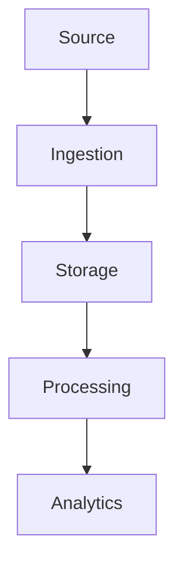

# Mastering Modern Data Architecture: Complete Trainer Guide

Welcome to the **Mastering Modern Data Architecture Trainer Guide**! This comprehensive guide is designed for instructors, trainers, and educators delivering the 15-part data architecture series. It provides everything you need to teach effectively - from lesson plans and presentation tips to hands-on lab guides and assessment strategies.

---

## How to Use This Trainer Guide

### Guide Structure

| Section | Purpose |
|---------|---------|
| **Trainer Overview** | Course philosophy and approach |
| **Part-by-Part Teaching Guide** | Detailed lesson plans for each part |
| **Presentation Tips** | How to deliver engaging content |
| **Lab Setup Guide** | Hands-on environment configuration |
| **Assessment Guide** | Testing and evaluation strategies |
| **Time Management** | Schedules and pacing guides |
| **Common Questions** | FAQ and troubleshooting |
| **Supplemental Materials** | Additional resources |

### Trainer Preparation Checklist

- [ ] Review all 15 parts thoroughly
- [ ] Set up your lab environment
- [ ] Prepare presentation slides
- [ ] Create student workbooks/notes
- [ ] Set up your demo environment
- [ ] Prepare assessment materials
- [ ] Review common questions
- [ ] Set up communication channels

---

# SECTION 1: TRAINER OVERVIEW

## Course Philosophy

### Learning by Doing
This course is built on the principle of **hands-on, practical learning**. Students learn best when they:

1. **See** the concept in action
2. **Code** the implementation themselves
3. **Verify** their work with tests
4. **Apply** to real-world scenarios

### Architecture-First Approach
We teach **principles and trade-offs**, not just technology:

- **Why** before **how**
- **Patterns** before **tools**
- **Trade-offs** before **solutions**

### Progressive Complexity
Each part builds on the previous:
- **Parts 1-3:** Foundations
- **Parts 4-6:** Storage and formats
- **Parts 7-9:** Integration and performance
- **Parts 10-12:** Analytics and governance
- **Parts 13-15:** Enterprise and ML

---

## Target Audience Profiles

### Profile A: Software Engineers
**Background:** Backend developers, API engineers
**Goals:** Understand data systems, optimize performance
**Teaching Focus:** Storage engines, caching, transactions

### Profile B: Data Engineers
**Background:** ETL, pipelines, data warehousing
**Goals:** Build scalable data platforms
**Teaching Focus:** Data integration, lakehouse, orchestration

### Profile C: Architects
**Background:** Solution architects, enterprise architects
**Goals:** Design complete data platforms
**Teaching Focus:** Reference architecture, trade-offs, governance

### Profile D: ML Engineers
**Background:** ML models, data science
**Goals:** Scale ML data pipelines
**Teaching Focus:** Feature stores, vector DBs, RAG

---

## Course Learning Objectives

By the end of this course, students will be able to:

| Category | Capability |
|----------|------------|
| **Design** | Complete enterprise data architectures |
| **Build** | Production-grade data pipelines |
| **Scale** | Distributed systems with high availability |
| **Optimize** | Storage, indexing, and query performance |
| **Govern** | Data quality, lineage, and compliance |
| **Enable** | ML and AI data infrastructure |

---

# SECTION 2: PART-BY-PART TEACHING GUIDE

## Part 1: Foundations of Data Architecture and Data Modeling

### 🎯 Learning Objectives
- Understand OLTP vs. OLAP
- Design entity-relationship diagrams
- Normalize database schemas
- Apply modeling patterns

### 📋 Lesson Plan (90 minutes)

| Time | Activity | Description |
|------|----------|-------------|
| 0-5 | **Introduction** | Course overview, learning objectives |
| 5-15 | **Lecture: Architecture Evolution** | Mainframes → Data Warehouse → Lakehouse |
| 15-25 | **Lecture: OLTP vs. OLAP** | Key differences, use cases |
| 25-35 | **Lecture: Data Types** | Structured, semi-structured, unstructured |
| 35-45 | **Live Demo: ERD Creation** | Build a library management ERD |
| 45-55 | **Hands-On: Normalization Exercise** | Students normalize denormalized tables |
| 55-65 | **Lecture: Star vs. Snowflake** | Dimensional modeling patterns |
| 65-75 | **Hands-On: Schema Creation** | Students write SQL DDL |
| 75-80 | **Q&A** | Address student questions |
| 80-90 | **Lab Time** | Students complete exercises |

### 🖥️ Demo Setup

```sql
-- Demo: Normalization from denormalized to 3NF

-- Denormalized (starting point)
CREATE TABLE orders_denormalized (
    order_id INT,
    customer_name VARCHAR,
    customer_email VARCHAR,
    product_name VARCHAR,
    product_price DECIMAL,
    quantity INT,
    order_date DATE
);

-- Normalized to 3NF
CREATE TABLE customers (
    customer_id SERIAL PRIMARY KEY,
    name VARCHAR,
    email VARCHAR
);

CREATE TABLE products (
    product_id SERIAL PRIMARY KEY,
    name VARCHAR,
    price DECIMAL
);

CREATE TABLE orders (
    order_id SERIAL PRIMARY KEY,
    customer_id INT REFERENCES customers(customer_id),
    order_date DATE
);

CREATE TABLE order_items (
    order_item_id SERIAL PRIMARY KEY,
    order_id INT REFERENCES orders(order_id),
    product_id INT REFERENCES products(product_id),
    quantity INT
);
```

### 💡 Teaching Tips

**Emphasize:**
- Real-world business impact
- Trade-offs between normalization levels
- When to denormalize for performance

**Common Pitfalls:**
- Students over-normalize all tables
- Confusing OLTP and OLAP
- Forgetting foreign key relationships

---

## Part 2: Storage Engines and Database Internals

### 🎯 Learning Objectives
- Understand B-Tree and LSM Tree architecture
- Explain MVCC and concurrency control
- Implement basic indexing strategies

### 📋 Lesson Plan (90 minutes)

| Time | Activity | Description |
|------|----------|-------------|
| 0-5 | **Review** | Recap Part 1, connect to storage |
| 5-15 | **Lecture: Storage Hierarchy** | Memory → Cache → Disk |
| 15-25 | **Lecture: B-Trees** | Structure, operations, use cases |
| 25-35 | **Live Demo: B-Tree Insertion** | Visual step-by-step |
| 35-45 | **Lecture: LSM Trees** | Write optimization, compaction |
| 45-55 | **Lecture: MVCC** | Concurrency control, isolation |
| 55-65 | **Live Demo: MVCC** | Show versions, snapshot isolation |
| 65-75 | **Hands-On: Index Selection** | Students choose indexes for queries |
| 75-85 | **Lecture: Query Optimization** | Cost-based planning |
| 85-90 | **Q&A** | Address student questions |

### 🖥️ Demo Setup

```python
# Demo: B-Tree insertion visualization

class BTreeNode:
    def __init__(self, is_leaf=True):
        self.keys = []
        self.children = []
        self.is_leaf = is_leaf
    
    def print_tree(self, level=0):
        indent = "  " * level
        print(f"{indent}Keys: {self.keys}")
        for child in self.children:
            child.print_tree(level + 1)

# Demonstrate insertion sequence
btree = BTree()
for key in [5, 3, 8, 1, 7, 4, 9, 2, 6]:
    print(f"\nInserting {key}:")
    btree.insert(key)
    btree.root.print_tree()
```

### 💡 Teaching Tips

**Emphasize:**
- Why different engines for different workloads
- The write/read trade-off
- Real-world examples (Cassandra uses LSM, Postgres uses B-Tree)

**Common Pitfalls:**
- Understanding B-Tree vs. B+Tree differences
- MVCC implementation details
- Query optimization complexity

---

## Part 3: Enterprise Storage Architecture

### 🎯 Learning Objectives
- Distinguish DAS, NAS, and SAN
- Understand RAID configurations
- Explain distributed file systems

### 📋 Lesson Plan (90 minutes)

| Time | Activity | Description |
|------|----------|-------------|
| 0-5 | **Review** | Recap storage engines |
| 5-15 | **Lecture: Storage Types** | DAS, NAS, SAN comparison |
| 15-25 | **Lecture: RAID Levels** | 0, 1, 5, 6, 10 trade-offs |
| 25-35 | **Hands-On: RAID Calculation** | Students calculate capacity/performance |
| 35-45 | **Lecture: HDFS Architecture** | NameNode, DataNodes, replication |
| 45-55 | **Live Demo: HDFS Simulation** | Show file creation, replication |
| 55-65 | **Lecture: Backup Strategies** | 3-2-1 rule, RPO/RTO |
| 65-75 | **Case Study: Backup Design** | Students design backup strategy |
| 75-85 | **Hands-On: MinIO Setup** | Configure MinIO buckets |
| 85-90 | **Q&A** | Address student questions |

### 🖥️ Demo Setup

```bash
# Demo: MinIO bucket setup
docker run -it --rm minio/mc

# Show MinIO operations
mc mb myminio/backup
mc cp file.txt myminio/backup/
mc ls myminio/backup/
mc rm myminio/backup/file.txt
```

### 💡 Teaching Tips

**Emphasize:**
- Real-world storage costs
- Performance vs. redundancy trade-offs
- Cloud storage economics

**Common Pitfalls:**
- Confusing RAID with backup
- Underestimating RPO/RTO importance
- Not considering cost implications

---

## Part 4: Cloud Object Storage and Data Lake Foundations

### 🎯 Learning Objectives
- Understand object storage architecture
- Design effective partitioning
- Implement lifecycle management

### 📋 Lesson Plan (90 minutes)

| Time | Activity | Description |
|------|----------|-------------|
| 0-5 | **Review** | Recap storage types |
| 5-15 | **Lecture: Object Storage** | S3, buckets, objects, metadata |
| 15-25 | **Lecture: Partitioning Strategies** | Prefix optimization |
| 25-35 | **Hands-On: Prefix Design** | Students optimize prefix structures |
| 35-45 | **Lecture: Lifecycle Management** | Tiers, transitions, expiration |
| 45-55 | **Live Demo: Lifecycle Rules** | Create and apply lifecycle policies |
| 55-65 | **Lecture: Data Lake Layers** | Raw, staging, curated, gold |
| 65-75 | **Hands-On: Data Lake Design** | Students design lake structure |
| 75-85 | **Lecture: Versioning** | Data protection, recovery |
| 85-90 | **Q&A** | Address student questions |

### 🖥️ Demo Setup

```yaml
# Demo: MinIO lifecycle configuration

<LifecycleConfiguration>
  <Rule>
    <ID>archive-logs</ID>
    <Status>Enabled</Status>
    <Filter>
      <Prefix>logs/</Prefix>
    </Filter>
    <Transition>
      <Days>30</Days>
      <StorageClass>GLACIER</StorageClass>
    </Transition>
    <Expiration>
      <Days>365</Days>
    </Expiration>
  </Rule>
</LifecycleConfiguration>
```

### 💡 Teaching Tips

**Emphasize:**
- Partition pruning performance gains
- Cost optimization through tiering
- Data lake vs. data warehouse

**Common Pitfalls:**
- Poor prefix design
- Not using lifecycle rules
- Underestimating small file problems

---

## Part 5: Modern Data Formats and Storage Optimization

### 🎯 Learning Objectives
- Compare row-based and columnar storage
- Implement Parquet, ORC, Avro
- Apply compression and optimization techniques

### 📋 Lesson Plan (90 minutes)

| Time | Activity | Description |
|------|----------|-------------|
| 0-5 | **Review** | Recap data lake concepts |
| 5-15 | **Lecture: Row vs. Columnar** | Storage models, use cases |
| 15-25 | **Lecture: Parquet Deep Dive** | Structure, compression |
| 25-35 | **Live Demo: Parquet** | Show file structure, stats |
| 35-45 | **Lecture: ORC and Avro** | Comparison, schema evolution |
| 45-55 | **Lecture: Predicate Pushdown** | Filtering at storage layer |
| 55-65 | **Live Demo: Predicate Pushdown** | Show I/O reduction |
| 65-75 | **Lecture: Small File Problem** | Causes, solutions (compaction) |
| 75-85 | **Hands-On: Format Selection** | Choose formats for use cases |
| 85-90 | **Q&A** | Address student questions |

### 🖥️ Demo Setup

```python
# Demo: Predicate pushdown effect

import pandas as pd

# Create test data
df = pd.DataFrame({
    'age': [20, 25, 30, 35, 40, 45, 50],
    'name': ['A', 'B', 'C', 'D', 'E', 'F', 'G'],
    'salary': [50000, 60000, 70000, 80000, 90000, 100000, 110000]
})

# Without pushdown: read all, filter later
# With pushdown: filter at storage layer

print("Storage statistics:")
print(f"  Row groups: 2")
print(f"  Min age in group 1: 20, Max: 35")
print(f"  Min age in group 2: 36, Max: 50")
print("\nQuery: SELECT * WHERE age > 30")
print(f"  Group 1: Skipped (max=35 > 30, but needs check)")
print(f"  Group 2: Read (min=36 > 30)")
print(f"  I/O reduced by 50%")
```

### 💡 Teaching Tips

**Emphasize:**
- When to use each format
- Compression trade-offs
- Real-world performance gains

**Common Pitfalls:**
- Using Parquet for OLTP workloads
- Not using predicate pushdown
- Ignoring small file compaction

---

## Part 6: Transaction Processing and Distributed Consistency

### 🎯 Learning Objectives
- Explain ACID properties
- Understand isolation levels
- Implement distributed transaction patterns

### 📋 Lesson Plan (90 minutes)

| Time | Activity | Description |
|------|----------|-------------|
| 0-5 | **Review** | Recap storage optimization |
| 5-15 | **Lecture: ACID Properties** | Atomicity, Consistency, Isolation, Durability |
| 15-25 | **Lecture: Isolation Levels** | Read Uncommitted → Serializable |
| 25-35 | **Live Demo: Isolation Levels** | Show anomalies in action |
| 35-45 | **Lecture: 2PC** | Distributed transaction protocol |
| 45-55 | **Lecture: Saga Pattern** | Compensating actions |
| 55-65 | **Case Study: Saga Design** | Design saga for order processing |
| 65-75 | **Lecture: CAP Theorem** | Distributed system trade-offs |
| 75-85 | **Lecture: Consistency Models** | Strong vs. Eventual |
| 85-90 | **Q&A** | Address student questions |

### 🖥️ Demo Setup

```sql
-- Demo: Isolation level anomalies

-- Session 1
BEGIN TRANSACTION ISOLATION LEVEL READ UNCOMMITTED;
UPDATE accounts SET balance = balance - 100 WHERE id = 1;

-- Session 2 (running concurrently)
-- With READ UNCOMMITTED, sees uncommitted balance
SELECT balance FROM accounts WHERE id = 1;  -- Shows updated balance

-- With READ COMMITTED, sees original balance
-- With REPEATABLE READ, sees original balance throughout
-- With SERIALIZABLE, waits or errors on conflict
```

### 💡 Teaching Tips

**Emphasize:**
- Why distributed transactions are hard
- Consistency vs. availability trade-offs
- When to use Saga vs. 2PC

**Common Pitfalls:**
- Confusing isolation levels
- Not understanding CAP theorem implications
- Choosing wrong transaction pattern

---

## Part 7: Data Integration and Modern Data Pipelines

### 🎯 Learning Objectives
- Distinguish ETL, ELT, Reverse ETL
- Implement Change Data Capture
- Work with Kafka and orchestration

### 📋 Lesson Plan (90 minutes)

| Time | Activity | Description |
|------|----------|-------------|
| 0-5 | **Review** | Recap transactions |
| 5-15 | **Lecture: ETL vs. ELT vs. Reverse ETL** | Patterns and use cases |
| 15-25 | **Lecture: CDC** | Change Data Capture patterns |
| 25-35 | **Live Demo: CDC** | Show Debezium capturing changes |
| 35-45 | **Lecture: Kafka Architecture** | Topics, partitions, consumer groups |
| 45-55 | **Live Demo: Kafka** | Produce/consume messages |
| 55-65 | **Lecture: Airflow** | DAGs, operators, dependencies |
| 65-75 | **Hands-On: DAG Design** | Students design a pipeline DAG |
| 75-85 | **Lecture: Stream Processing** | Real-time data processing |
| 85-90 | **Q&A** | Address student questions |

### 🖥️ Demo Setup

```python
# Demo: Airflow DAG definition

from airflow import DAG
from airflow.operators.python_operator import PythonOperator
from datetime import datetime

def extract():
    print("Extracting data from source...")

def transform():
    print("Transforming data...")

def load():
    print("Loading data to warehouse...")

dag = DAG(
    'data_pipeline',
    description='Simple ETL pipeline',
    schedule_interval='@daily',
    start_date=datetime(2024, 1, 1),
    catchup=False
)

task_extract = PythonOperator(
    task_id='extract',
    python_callable=extract,
    dag=dag
)

task_transform = PythonOperator(
    task_id='transform',
    python_callable=transform,
    dag=dag
)

task_load = PythonOperator(
    task_id='load',
    python_callable=load,
    dag=dag
)

task_extract >> task_transform >> task_load
```

### 💡 Teaching Tips

**Emphasize:**
- Real-time vs. batch trade-offs
- When to use each integration pattern
- Modern data stack evolution

**Common Pitfalls:**
- Choosing wrong integration pattern
- Not handling failures properly
- CDC setup complexity

---

## Part 8: Scalability, Distribution, and High Availability

### 🎯 Learning Objectives
- Compare scaling strategies
- Implement partitioning and sharding
- Design replication models

### 📋 Lesson Plan (90 minutes)

| Time | Activity | Description |
|------|----------|-------------|
| 0-5 | **Review** | Recap data integration |
| 5-15 | **Lecture: Scaling Strategies** | Vertical, horizontal, elastic |
| 15-25 | **Lecture: Partitioning** | Range, hash, list, composite |
| 25-35 | **Hands-On: Partition Design** | Students partition a system |
| 35-45 | **Lecture: Consistent Hashing** | Data distribution, rebalancing |
| 45-55 | **Lecture: Replication Models** | Leader-follower, multi-leader, leaderless |
| 55-65 | **Case Study: HA Design** | Design for 99.99% availability |
| 65-75 | **Lecture: Disaster Recovery** | RPO, RTO, DR strategies |
| 75-85 | **Hands-On: DR Planning** | Students plan disaster recovery |
| 85-90 | **Q&A** | Address student questions |

### 🖥️ Demo Setup

```python
# Demo: Consistent hashing visualization

def consistent_hash(key, nodes):
    """Map key to node using consistent hashing"""
    hash_val = hash(key)
    for node in sorted(nodes):
        if hash_val <= node.hash:
            return node
    return nodes[0]  # Wrap around

# Simulation
nodes = create_nodes(['A', 'B', 'C'])
keys = ['key1', 'key2', 'key3', 'key4', 'key5']

for key in keys:
    print(f"{key} → {consistent_hash(key, nodes)}")

# Add a node
nodes.add('D')
print("\nAfter adding node D:")
for key in keys:
    print(f"{key} → {consistent_hash(key, nodes)}")

# Only a fraction of keys move (consistent hashing benefit)
```

### 💡 Teaching Tips

**Emphasize:**
- Trade-offs in distributed systems
- Real-world scaling challenges
- Cost implications of availability

**Common Pitfalls:**
- Over-engineering HA
- Not testing disaster recovery
- Misunderstanding CAP theorem

---

## Part 9: Caching and Performance Engineering

### 🎯 Learning Objectives
- Implement caching patterns
- Use Redis for session management
- Optimize queries with materialized views

### 📋 Lesson Plan (90 minutes)

| Time | Activity | Description |
|------|----------|-------------|
| 0-5 | **Review** | Recap scalability concepts |
| 5-15 | **Lecture: Caching Fundamentals** | Cache hit/miss, TTL |
| 15-25 | **Lecture: Caching Patterns** | Cache-aside, read-through, write-through, write-behind |
| 25-35 | **Live Demo: Redis** | Basic operations, data structures |
| 35-45 | **Lecture: Eviction Policies** | LRU, LFU, FIFO, TTL |
| 45-55 | **Hands-On: Cache Selection** | Choose cache for scenarios |
| 55-65 | **Lecture: Session Management** | Redis for sessions |
| 65-75 | **Lecture: Query Caching** | Materialized views |
| 75-85 | **Live Demo: Materialized Views** | Create and refresh |
| 85-90 | **Q&A** | Address student questions |

### 🖥️ Demo Setup

```python
# Demo: Redis session management

import redis

# Connect to Redis
r = redis.Redis(host='localhost', port=6379, db=0)

# Session management
def create_session(user_id, data):
    session_id = f"session:{user_id}"
    r.hset(session_id, mapping=data)
    r.expire(session_id, 3600)  # 1 hour TTL

def get_session(user_id):
    session_id = f"session:{user_id}"
    return r.hgetall(session_id)

def update_session(user_id, key, value):
    session_id = f"session:{user_id}"
    r.hset(session_id, key, value)
    r.expire(session_id, 3600)  # Reset TTL

# Usage
create_session(1, {"name": "Alice", "cart": "[]"})
print(get_session(1))
```

### 💡 Teaching Tips

**Emphasize:**
- Cache hit ratio importance
- When to use each caching pattern
- Performance monitoring

**Common Pitfalls:**
- Cache stampede on misses
- TTL too short/long
- Not invalidating properly

---

## Part 10: Data Lakes, Lakehouses, and Modern Analytics Platforms

### 🎯 Learning Objectives
- Compare data architectures
- Implement Medallion Architecture
- Use Delta Lake features

### 📋 Lesson Plan (90 minutes)

| Time | Activity | Description |
|------|----------|-------------|
| 0-5 | **Review** | Recap caching and performance |
| 5-15 | **Lecture: Architecture Evolution** | Warehouse → Lake → Lakehouse |
| 15-25 | **Lecture: Medallion Architecture** | Bronze, Silver, Gold |
| 25-35 | **Hands-On: Layer Design** | Students design Medallion layers |
| 35-45 | **Lecture: Delta Lake** | ACID, time travel, schema enforcement |
| 45-55 | **Live Demo: Delta Lake** | Show time travel, schema evolution |
| 55-65 | **Lecture: Open Table Formats** | Delta Lake vs. Iceberg vs. Hudi |
| 65-75 | **Case Study: Lakehouse Migration** | Warehouse → Lakehouse |
| 75-85 | **Hands-On: Delta Operations** | Students work with Delta tables |
| 85-90 | **Q&A** | Address student questions |

### 🖥️ Demo Setup

```python
# Demo: Delta Lake time travel

from delta.tables import DeltaTable

# Create Delta table
df = spark.createDataFrame([
    (1, "Alice", 30),
    (2, "Bob", 25),
    (3, "Charlie", 35)
], ["id", "name", "age"])

df.write.format("delta").save("/delta/people")

# Version 1: Update data
df2 = spark.createDataFrame([
    (1, "Alice", 31),  # Updated age
    (2, "Bob", 26)     # Updated age
], ["id", "name", "age"])

df2.write.format("delta").mode("overwrite").save("/delta/people")

# Time travel: Query version 0
df_v0 = spark.read.format("delta") \
    .option("versionAsOf", 0) \
    .load("/delta/people")

# Time travel: Query timestamp
df_v1 = spark.read.format("delta") \
    .option("timestampAsOf", "2024-01-15 10:00:00") \
    .load("/delta/people")
```

### 💡 Teaching Tips

**Emphasize:**
- Lakehouse as evolution
- Open format benefits
- Time travel for auditing

**Common Pitfalls:**
- Confusing Delta with Spark
- Not understanding time travel
- Ignoring compaction

---

## Part 11: Enterprise Data Hubs and Data Mesh

### 🎯 Learning Objectives
- Design enterprise data hubs
- Implement data contracts
- Understand Data Mesh principles

### 📋 Lesson Plan (90 minutes)

| Time | Activity | Description |
|------|----------|-------------|
| 0-5 | **Review** | Recap lakehouse concepts |
| 5-15 | **Lecture: Enterprise Data Hub** | Centralized data sharing |
| 15-25 | **Lecture: Data Contracts** | Format, SLA, usage |
| 25-35 | **Hands-On: Contract Creation** | Students write data contracts |
| 35-45 | **Lecture: Data Mesh** | Four principles of Data Mesh |
| 45-55 | **Lecture: Data Products** | What makes a data product |
| 55-65 | **Case Study: Mesh Design** | Design for large enterprise |
| 65-75 | **Lecture: Event-Driven Integration** | Loose coupling |
| 75-85 | **Hands-On: Event Design** | Students design events |
| 85-90 | **Q&A** | Address student questions |

### 🖥️ Demo Setup

```yaml
# Demo: Data contract example

contract:
  name: "Customer 360"
  version: "1.0.0"
  domain: "Sales"
  owner: "sales-team@company.com"

  schema:
    customer_id:
      type: string
      required: true
    name:
      type: string
      required: true
    email:
      type: string
      required: true
    segment:
      type: string
      enum: ["Enterprise", "SMB", "Consumer"]

  sla:
    availability: "99.9%"
    latency: "< 500ms"
    freshness: "15 minutes"

  access:
    method: "API"
    authentication: "OAuth2"
    rate_limit: "100/min"
```

### 💡 Teaching Tips

**Emphasize:**
- Data Mesh as organizational shift
- Data products mindset
- Federated governance balance

**Common Pitfalls:**
- Thinking Data Mesh is technology-only
- Underestimating cultural change
- Not defining data products clearly

---

## Part 12: Metadata Management and Data Governance

### 🎯 Learning Objectives
- Manage technical, business, operational metadata
- Implement data lineage
- Ensure regulatory compliance

### 📋 Lesson Plan (90 minutes)

| Time | Activity | Description |
|------|----------|-------------|
| 0-5 | **Review** | Recap data mesh concepts |
| 5-15 | **Lecture: Metadata Types** | Technical, business, operational |
| 15-25 | **Lecture: Data Catalogs** | Discovery, search, governance |
| 25-35 | **Live Demo: Data Catalog** | Show Amundsen or similar |
| 35-45 | **Lecture: Data Lineage** | Tracking data flow |
| 45-55 | **Lecture: Data Quality** | Dimensions, rules, monitoring |
| 55-65 | **Lecture: Compliance** | GDPR, CCPA, HIPAA |
| 65-75 | **Case Study: Compliance Design** | Design for GDPR compliance |
| 75-85 | **Hands-On: Lineage Tracking** | Students implement lineage |
| 85-90 | **Q&A** | Address student questions |

### 🖥️ Demo Setup

```python
# Demo: Lineage tracking implementation

class LineageTracker:
    def __init__(self):
        self.lineage = {}
    
    def add_source(self, dataset, source, operation):
        if dataset not in self.lineage:
            self.lineage[dataset] = {
                'sources': [],
                'operations': []
            }
        self.lineage[dataset]['sources'].append(source)
        self.lineage[dataset]['operations'].append(operation)
    
    def get_lineage(self, dataset):
        return self.lineage.get(dataset, {})
    
    def get_upstream(self, dataset):
        return self.lineage.get(dataset, {}).get('sources', [])
    
    def get_downstream(self, source):
        downstream = []
        for dataset, info in self.lineage.items():
            if source in info['sources']:
                downstream.append(dataset)
        return downstream

# Usage
tracker = LineageTracker()
tracker.add_source('customer_report', 'customers', 'JOIN')
tracker.add_source('customer_report', 'orders', 'AGGREGATE')
tracker.add_source('sales_summary', 'customer_report', 'FILTER')

print(tracker.get_lineage('customer_report'))
```

### 💡 Teaching Tips

**Emphasize:**
- Governance as enabler, not blocker
- Compliance as non-negotiable
- Quality = trust

**Common Pitfalls:**
- Governance as afterthought
- Not automating quality checks
- Ignoring data lineage

---

## Part 13: Business Intelligence and Analytical Architecture

### 🎯 Learning Objectives
- Design dimensional models
- Build fact and dimension tables
- Create BI dashboards

### 📋 Lesson Plan (90 minutes)

| Time | Activity | Description |
|------|----------|-------------|
| 0-5 | **Review** | Recap governance concepts |
| 5-15 | **Lecture: Dimensional Modeling** | Fact vs. Dimension |
| 15-25 | **Lecture: Star vs. Snowflake** | Schema comparison |
| 25-35 | **Hands-On: Star Schema Design** | Students design star schema |
| 35-45 | **Lecture: Semantic Layer** | Business abstraction |
| 45-55 | **Lecture: KPI Design** | Business metrics |
| 55-65 | **Case Study: Dashboard Design** | Design for retail executives |
| 65-75 | **Live Demo: Superset** | Create a BI dashboard |
| 75-85 | **Hands-On: Dashboard Creation** | Students build their own |
| 85-90 | **Q&A** | Address student questions |

### 🖥️ Demo Setup

```sql
-- Demo: Star schema design

-- Fact table: Sales
CREATE TABLE sales_fact (
    sale_id INT PRIMARY KEY,
    sales_amount DECIMAL(10,2),
    quantity INT,
    discount DECIMAL(5,2),
    time_key INT,
    product_key INT,
    customer_key INT,
    store_key INT
);

-- Dimension tables (denormalized)
CREATE TABLE time_dim (
    time_key INT PRIMARY KEY,
    year INT,
    quarter INT,
    month INT,
    day INT,
    weekday VARCHAR(10)
);

CREATE TABLE product_dim (
    product_key INT PRIMARY KEY,
    product_name VARCHAR(255),
    category VARCHAR(100),
    brand VARCHAR(100),
    price DECIMAL(10,2)
);

CREATE TABLE customer_dim (
    customer_key INT PRIMARY KEY,
    customer_name VARCHAR(255),
    segment VARCHAR(50),
    country VARCHAR(50),
    city VARCHAR(50)
);

CREATE TABLE store_dim (
    store_key INT PRIMARY KEY,
    store_name VARCHAR(255),
    region VARCHAR(50),
    country VARCHAR(50)
);

-- Query example
SELECT 
    p.category,
    t.quarter,
    SUM(s.sales_amount) AS revenue
FROM sales_fact s
JOIN product_dim p ON s.product_key = p.product_key
JOIN time_dim t ON s.time_key = t.time_key
WHERE t.year = 2024
GROUP BY p.category, t.quarter;
```

### 💡 Teaching Tips

**Emphasize:**
- Self-service analytics value
- Semantic layer importance
- KPI alignment with business

**Common Pitfalls:**
- Over-complicated schemas
- Not understanding business needs
- Ignoring performance

---

## Part 14: Machine Learning Data Architecture

### 🎯 Learning Objectives
- Design feature stores
- Work with vector databases
- Implement RAG systems

### 📋 Lesson Plan (90 minutes)

| Time | Activity | Description |
|------|----------|-------------|
| 0-5 | **Review** | Recap BI concepts |
| 5-15 | **Lecture: Feature Store** | Online/offline, registry |
| 15-25 | **Lecture: Feature Engineering** | Feature definitions, transformations |
| 25-35 | **Hands-On: Feature Design** | Students design features |
| 35-45 | **Lecture: Vector Databases** | Embeddings, similarity search |
| 45-55 | **Live Demo: Vector DB** | Show vector search |
| 55-65 | **Lecture: RAG** | Retrieval-Augmented Generation |
| 65-75 | **Case Study: RAG Design** | Design for customer support |
| 75-85 | **Hands-On: RAG System** | Students build a simple RAG |
| 85-90 | **Q&A** | Address student questions |

### 🖥️ Demo Setup

```python
# Demo: Feature store usage

class FeatureStore:
    def __init__(self):
        self.features = {}
        self.registry = {}
    
    def register_feature(self, name, feature_type, source):
        self.registry[name] = {
            'type': feature_type,
            'source': source
        }
    
    def get_feature(self, entity_id, feature_name):
        # Check online store (cache)
        key = f"{entity_id}:{feature_name}"
        if key in self.features:
            return self.features[key]
        
        # Compute from offline store
        value = self._compute_from_offline(entity_id, feature_name)
        self.features[key] = value
        return value
    
    def _compute_from_offline(self, entity_id, feature_name):
        # Simulate feature computation
        return f"{feature_name}_{entity_id}"

# Usage
store = FeatureStore()
store.register_feature('total_spend', 'float', 'transactions')
store.register_feature('order_count', 'int', 'transactions')

# Training: use offline store
# Inference: use online store (cached)
value = store.get_feature('user_123', 'total_spend')
```

### 💡 Teaching Tips

**Emphasize:**
- Training-serving consistency
- Feature reuse across models
- RAG for factual LLM responses

**Common Pitfalls:**
- Training-serving skew
- Not using feature stores
- Underestimating embedding costs

---

## Part 15: Enterprise Data Platform Architecture

### 🎯 Learning Objectives
- Design reference architectures
- Create Architectural Decision Records
- Assess production readiness

### 📋 Lesson Plan (90 minutes)

| Time | Activity | Description |
|------|----------|-------------|
| 0-5 | **Review** | Recap ML architecture |
| 5-15 | **Lecture: Reference Architecture** | Complete platform blueprint |
| 15-25 | **Lecture: End-to-End Data Flow** | Complete data journey |
| 25-35 | **Lecture: ADRs** | Architectural Decision Records |
| 35-45 | **Hands-On: ADR Creation** | Students write an ADR |
| 45-55 | **Lecture: Zero Trust** | Security architecture |
| 55-65 | **Lecture: Data Observability** | Quality, freshness, volume |
| 65-75 | **Case Study: Platform Design** | Design for enterprise |
| 75-85 | **Lecture: Future Trends** | AI-native, real-time, open formats |
| 85-90 | **Q&A** | Address student questions |

### 🖥️ Demo Setup

```markdown
# Demo: ADR template

# ADR-001: [Decision Title]

## Status
[Proposed | Accepted | Deprecated | Superseded]

## Context
[Describe the context and forces that led to this decision]

## Decision
[What is the decision?]

## Alternatives
1. [Alternative 1]
   - Pros: ...
   - Cons: ...

2. [Alternative 2]
   - Pros: ...
   - Cons: ...

## Consequences
- [Positive consequences]
- [Negative consequences]

## Date
[YYYY-MM-DD]

## Author
[Name]

## Reviewers
- [Name 1]
- [Name 2]
```

### 💡 Teaching Tips

**Emphasize:**
- Complete picture of enterprise platform
- Documentation importance (ADRs)
- Production readiness as checklist

**Common Pitfalls:**
- Not documenting decisions
- Ignoring security
- Underestimating operations

---

# SECTION 3: PRESENTATION TIPS

## Engaging Delivery

### Opening the Session
- **Hook**: Start with a real-world story or problem
- **Context**: Show why the topic matters
- **Objectives**: Clearly state what students will learn

### During the Session
- **Interactive**: Ask questions, encourage participation
- **Demo-heavy**: Show concepts in action
- **Pacing**: Vary activities (lecture, demo, hands-on)

### Closing the Session
- **Summary**: Recap key points
- **Check Understanding**: Quick quiz or poll
- **Preview**: What's coming next

---

## Slide Design Tips

### Keep It Simple
- **6x6 Rule**: Max 6 bullets, 6 words each
- **Visual**: Include diagrams, screenshots
- **Consistent**: Use same template throughout

### Effective Diagrams


### Code Slides
- **Complete**: Show full code blocks
- **Annotated**: Highlight key parts
- **Runable**: Students can copy and run

---

## Demo Best Practices

### Prepare Your Demo
1. **Test beforehand**: Ensure everything works
2. **Have a fallback**: Screenshots if demo fails
3. **Keep it focused**: One concept at a time

### During the Demo
- **Explain before you type**: What are you going to show?
- **Talk through it**: What does each line do?
- **Show the output**: What should they expect?

### Common Demo Topics

| Part | Demo Topic |
|------|------------|
| 1 | ERD creation, SQL DDL |
| 2 | B-Tree insertion, MVCC |
| 3 | RAID calculation, MinIO setup |
| 4 | Lifecycle rules, data lake structure |
| 5 | Parquet file, predicate pushdown |
| 6 | Isolation levels, 2PC simulation |
| 7 | CDC capture, Kafka producer/consumer |
| 8 | Consistent hashing, replication |
| 9 | Redis operations, materialized views |
| 10 | Delta Lake time travel |
| 11 | Data contract creation |
| 12 | Catalog search, lineage tracking |
| 13 | Star schema, Superset dashboard |
| 14 | Feature store, vector search |
| 15 | ADR creation, platform diagram |

---

# SECTION 4: LAB SETUP GUIDE

## Required Infrastructure

### Minimum Requirements
- 16GB RAM (32GB recommended)
- 4 CPU cores (8 recommended)
- 50GB free disk space
- Docker Desktop or equivalent
- Python 3.9+

### Services to Pre-configure
| Service | Purpose | Resource |
|---------|---------|----------|
| PostgreSQL | Transactional DB | 2GB RAM |
| MySQL | Alternative DB | 1GB RAM |
| MongoDB | NoSQL DB | 1GB RAM |
| MinIO | Object Storage | 2GB RAM |
| Redis | Caching | 1GB RAM |
| Kafka | Streaming | 2GB RAM |
| Airflow | Orchestration | 2GB RAM |
| Superset | BI | 2GB RAM |

---

## Setup Script

```bash
#!/bin/bash
# Complete lab environment setup

echo "Setting up Data Architecture Lab Environment..."

# Check prerequisites
command -v docker >/dev/null 2>&1 || { echo "Docker required"; exit 1; }
command -v docker-compose >/dev/null 2>&1 || { echo "Docker Compose required"; exit 1; }

# Clone the repository
git clone https://github.com/yourusername/data-architecture-tutorial.git
cd data-architecture-tutorial

# Copy environment file
cp .env.example .env

# Start all services
docker-compose up -d

# Wait for services to be ready
echo "Waiting for services to be ready..."
sleep 30

# Verify setup
python scripts/verify_environment.py

echo "Lab environment ready!"
```

---

## Student Environment Checklist

| Step | Task | Status |
|------|------|--------|
| 1 | Docker installed | ☐ |
| 2 | Git installed | ☐ |
| 3 | Python 3.9+ installed | ☐ |
| 4 | Clone repository | ☐ |
| 5 | Run setup script | ☐ |
| 6 | Verify services | ☐ |
| 7 | Access MinIO (port 9000) | ☐ |
| 8 | Access Airflow (port 8081) | ☐ |
| 9 | Access Superset (port 8088) | ☐ |
| 10 | Run first demo | ☐ |

---

# SECTION 5: ASSESSMENT GUIDE

## Assessment Types

### Formative Assessment
- **In-class**: Quick quizzes, polls, Q&A
- **Hands-on**: Lab exercises, code verification
- **Peer review**: Share and discuss solutions

### Summative Assessment
- **Quizzes**: Multiple choice, short answer
- **Projects**: Data platform design
- **Final exam**: Comprehensive assessment

---

## Quiz Template

```markdown
# Data Architecture Quiz

## Question 1
[Question text]

A) Option A
B) Option B
C) Option C
D) Option D

**Answer:** B
**Explanation:** [Why B is correct]

## Question 2
[Question text]

**Answer:** [Answer]
**Explanation:** [Explanation]

## Question 3
[Question text]

**Answer:** [Answer]
**Explanation:** [Explanation]
```

---

## Project Assessment Rubric

| Criteria | Excellent (4) | Good (3) | Satisfactory (2) | Needs Work (1) |
|----------|---------------|----------|------------------|----------------|
| **Architecture Design** | Complete, well-justified | Most components | Some components | Missing/incomplete |
| **Data Model** | Normalized, appropriate | Mostly normalized | Some normalization | Poor design |
| **Technology Selection** | Well-justified | Good choices | Acceptable | Poor choices |
| **Documentation** | Comprehensive | Good | Basic | Missing |
| **Trade-off Analysis** | Deep, insightful | Good analysis | Basic | None |

---

## Grading Guidelines

### Weight Distribution
- **Labs/Exercises**: 40%
- **Quizzes**: 20%
- **Project**: 30%
- **Participation**: 10%

### Passing Criteria
- Overall ≥70%
- Labs ≥60% completion
- Project ≥60% quality

---

# SECTION 6: TIME MANAGEMENT

## Course Schedule Options

### 5-Week Intensive
| Week | Parts | Focus |
|------|-------|-------|
| 1 | 1-3 | Foundations |
| 2 | 4-6 | Storage |
| 3 | 7-9 | Integration |
| 4 | 10-12 | Analytics & Governance |
| 5 | 13-15 | Enterprise & ML |

### 10-Week Standard
| Week | Parts | Focus |
|------|-------|-------|
| 1 | 0-1 | Introduction & Foundations |
| 2 | 2-3 | Storage Engines |
| 3 | 4 | Object Storage |
| 4 | 5 | Data Formats |
| 5 | 6 | Transactions |
| 6 | 7 | Integration |
| 7 | 8-9 | Scalability & Caching |
| 8 | 10-11 | Lakehouses & Data Mesh |
| 9 | 12-13 | Governance & BI |
| 10 | 14-15 | ML & Enterprise |

### 15-Week Deep Dive
- One part per week
- Deep hands-on labs
- Project throughout

---

## Daily Schedule (90-minute session)

| Time | Activity | Duration |
|------|----------|----------|
| 0-5 | **Opening** | 5 min |
| 5-15 | **Review/Connect** | 10 min |
| 15-40 | **Lecture** | 25 min |
| 40-50 | **Live Demo** | 10 min |
| 50-70 | **Hands-On Lab** | 20 min |
| 70-80 | **Review/Work** | 10 min |
| 80-90 | **Q&A/Wrap-up** | 10 min |

---

# SECTION 7: COMMON QUESTIONS AND TROUBLESHOOTING

## Student FAQs

### Q: "What technology should I choose?"
**A:** There's no single answer. Consider:
- Your requirements (workload, scale, consistency)
- Your team's expertise
- Total cost of ownership
- Vendor lock-in risk

### Q: "Why can't I just use one database for everything?"
**A:** One-size-fits-all rarely works. Different workloads need different optimizations. OLTP needs ACID, analytics need columnar, caching needs low latency.

### Q: "Is Data Lake replacing Data Warehouse?"
**A:** No. They serve different purposes. Data Lakes are for raw data and exploration. Data Warehouses are for curated, high-performance analytics. Lakehouses combine both.

### Q: "What's the most important skill for a data architect?"
**A:** Understanding trade-offs and business requirements. Technology changes, but architectural principles remain.

---

## Troubleshooting Guide

### Environment Issues

| Issue | Solution |
|-------|----------|
| Docker won't start | Check resources (RAM/CPU) |
| Port conflicts | Change ports in docker-compose.yml |
| Database connection | Wait for initialization, check logs |
| MinIO access denied | Check credentials in .env |
| Kafka not working | Check Zookeeper, broker logs |

### Code Issues

| Issue | Solution |
|-------|----------|
| Import errors | Check virtual environment |
| Database errors | Verify connection string |
| Syntax errors | Check Python version |
| Missing modules | Install requirements.txt |

### Student Issues

| Issue | Solution |
|-------|----------|
| Behind in labs | Pair programming, extended time |
| Confused by concepts | Different explanation, examples |
| Technical issues | Help desk, documentation reference |
| Motivation | Connect to real-world impact |

---

# SECTION 8: SUPPLEMENTAL MATERIALS

## Additional Resources

### Reference Cards
- Architecture pattern cards
- Technology stack cards
- Common commands cards

### Cheat Sheets
- SQL cheatsheet
- Kafka commands
- Docker commands
- Python data utilities

### Templates
- ADR template
- Architecture diagram template
- Project proposal template
- Data contract template

---

## Recommended Reading

### For Instructors
- "Designing Data-Intensive Applications" - Martin Kleppmann
- "The Data Warehouse Toolkit" - Ralph Kimball
- "Building the Data Lakehouse" - Bill Inmon

### For Students
- "Data Modeling Made Simple" - Steve Hoberman
- "SQL for Data Analysis" - Cathy Tanimura
- "Data Engineering with Python" - Paul Crickard

---

## Glossary Flashcards

### Set 1: Core Concepts
- ACID
- BASE
- CAP Theorem
- OLTP/OLAP
- ETL/ELT

### Set 2: Storage
- B-Tree
- LSM Tree
- MVCC
- WAL
- Parquet/ORC/Avro

### Set 3: Architecture
- Data Lake
- Data Warehouse
- Lakehouse
- Data Mesh
- Medallion

### Set 4: Integration
- CDC
- Kafka
- Airflow
- DAG
- Stream Processing

---

# APPENDIX A: COMPLETE SCHEDULE

## 5-Week Intensive Schedule

| Week | Day | Part | Topics |
|------|-----|------|--------|
| 1 | Mon | 0 | Introduction, Setup |
| 1 | Tue | 1 | Data Modeling |
| 1 | Wed | 1 | Lab: ERD, SQL |
| 1 | Thu | 2 | Storage Engines |
| 1 | Fri | 2 | Lab: B-Tree, MVCC |
| 2 | Mon | 3 | Enterprise Storage |
| 2 | Tue | 3 | Lab: RAID, HDFS |
| 2 | Wed | 4 | Object Storage |
| 2 | Thu | 4 | Lab: MinIO, Data Lake |
| 2 | Fri | 5 | Data Formats |
| 3 | Mon | 5 | Lab: Parquet, ORC |
| 3 | Tue | 6 | Transactions |
| 3 | Wed | 6 | Lab: 2PC, Saga |
| 3 | Thu | 7 | Integration |
| 3 | Fri | 7 | Lab: Kafka, CDC |
| 4 | Mon | 8 | Scalability |
| 4 | Tue | 8 | Lab: Partitioning |
| 4 | Wed | 9 | Caching |
| 4 | Thu | 9 | Lab: Redis |
| 4 | Fri | 10 | Lakehouse |
| 5 | Mon | 10 | Lab: Delta Lake |
| 5 | Tue | 11 | Data Mesh |
| 5 | Wed | 12 | Governance |
| 5 | Thu | 13 | BI |
| 5 | Fri | 14-15 | ML & Enterprise |

---

# APPENDIX B: LAB CHECKLIST

## Student Lab Completion

| Part | Lab | Completed |
|------|-----|-----------|
| 1 | Normalization, SQL DDL | ☐ |
| 2 | B-Tree, MVCC demo | ☐ |
| 3 | RAID calculation, MinIO | ☐ |
| 4 | Lifecycle policies, data lake | ☐ |
| 5 | Parquet, predicate pushdown | ☐ |
| 6 | Isolation levels, Saga | ☐ |
| 7 | Kafka, CDC, Airflow | ☐ |
| 8 | Partitioning, replication | ☐ |
| 9 | Redis, materialized views | ☐ |
| 10 | Delta Lake, time travel | ☐ |
| 11 | Data contracts, events | ☐ |
| 12 | Catalog, lineage, quality | ☐ |
| 13 | Star schema, dashboard | ☐ |
| 14 | Feature store, RAG | ☐ |
| 15 | ADR, platform design | ☐ |

---

*This Trainer Guide is designed to help you deliver the Mastering Modern Data Architecture series effectively. Adapt it to your teaching style and audience needs.*
