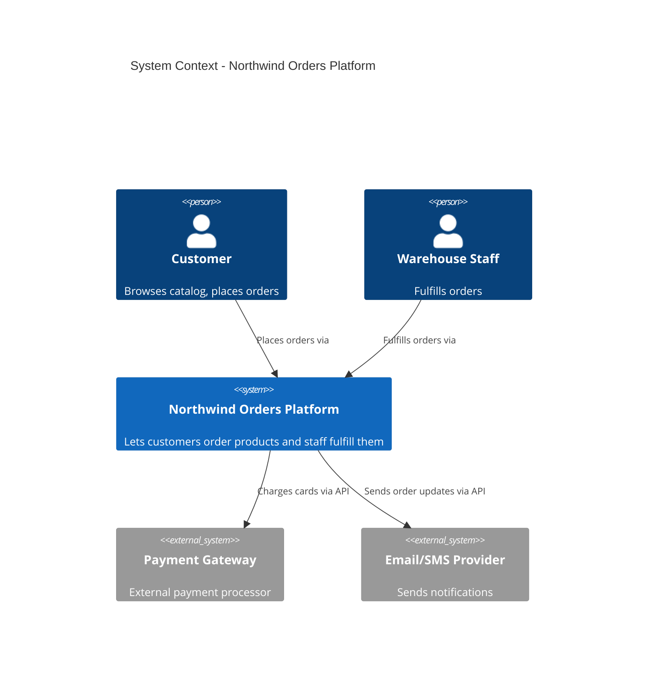

# Part 0 - Series Introduction 
## Architecting Modern Systems: From Monolith to Evolvable Systems

Welcome to **Architecting Modern Systems**. This eight-part engineering guide is built from the ground up to take you from core system design fundamentals to constructing a production-grade, modular monolith using modern patterns.

---

### The Vision: Evolution Over Rewrite

Many engineering teams fall into one of two extremes:

1. **The Big Ball of Mud:** A quick-and-dirty monolith where business rules are entangled directly inside database queries, UI components, and framework handlers. Refactoring becomes terrifying, testing requires spinning up real infrastructure, and changing a single feature risks breaking unrelated parts of the app.

2. **Premature Distribution:** Jumping straight to full microservices or distributed serverless architectures before the domain boundaries are well understood. The team ends up paying a massive "scalability tax"—distributed tracing, network partition handling, complex sagas, and eventual consistency debugging—long before proving a real scaling need.

This series demonstrates a pragmatic middle path: **The Modular Monolith with pre-cut seams**. You will learn how to design software where the cost of evolving from a single deployable unit to a distributed system is paid upfront in *design discipline*, not in a frantic, high-risk rewrite down the road.

---

### What We Are Building: *Northwind Orders*

Throughout this series, we build and assemble **Northwind Orders**—a complete, runnable platform handling e-commerce orders, inventory reservations, payments, and client notifications.

Instead of abstract or trivial examples, every pattern—Clean Architecture, Domain-Driven Design (DDD), Dependency Injection (IoC), the Outbox Pattern, Resilience Decorators, API evolution, and Architecture Decision Records (ADRs)—is demonstrated as concrete TypeScript code inside a clean Next.js 16 App Router foundation.

---

### Series Roadmap

The series is organized into eight progressive parts, capped by three reference appendices:

* **Part 1: System Architecture vs. System Design (The Architect's Mindset)** — Learn the "Cost of Change" lens, Clean Architecture's concentric layering, Locality of Behavior (LoB), and documenting architecture using the C4 Model and Diagrams-as-Code.

* **Part 2: Designing the Core (Domain-Driven Design Basics)** — Build pure, framework-agnostic TypeScript domain models (`Order`, `Money`, `OrderLineItem`) using Bounded Contexts, Entities, Value Objects, Aggregates, and Context Maps.

* **Part 3: Decoupling Components (Inversion of Control & Dependency Injection)** — Decouple your business logic from external frameworks using Ports (interfaces), Adapters, and a centralized Composition Root.

* **Part 4: Data Orchestration** — Solve the dual-write problem across bounded contexts using atomic transactions, logical schema isolation, and the Outbox Pattern.

* **Part 5: Resilience & Scalability** — Harden external interactions using pure resilience decorators (exponential backoff with jitter, circuit breakers, caching, and graceful degradation).

* **Part 6: API Evolution** — Contract design for longevity: REST vs. RPC choices, DTO mapping boundaries, and additive-only schema evolution strategies.

* **Part 7: Architectural Decision Records (ADRs)** — Preserve the *why* behind your choices using Michael Nygard's ADR format integrated directly into version control.

* **Part 8: The Full System — Northwind Orders, Assembled** — Assemble every layer into a runnable modular monolith and execute an end-to-end trace from UI to database.

* **Appendices A–C** — Complete architect’s toolkit setup guide, reusable ADR template, and the Architectural Pattern Matrix.

---

### Core Guiding Principle: The Cost of Change

Every decision made in this series is evaluated through a single question:

> *"When the business changes its mind next quarter, how much of this system do we have to rewrite, and have we deferred that cost until we have maximum information?"*
> 

By strictly enforcing the **Dependency Rule**—ensuring source dependencies only point inward toward stable business rules—your core domain logic remains fully untangled from UI frameworks, database drivers, and third-party vendors.

Let's dive in!
