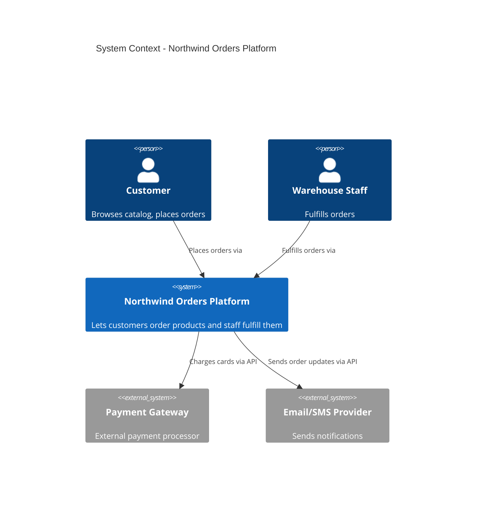
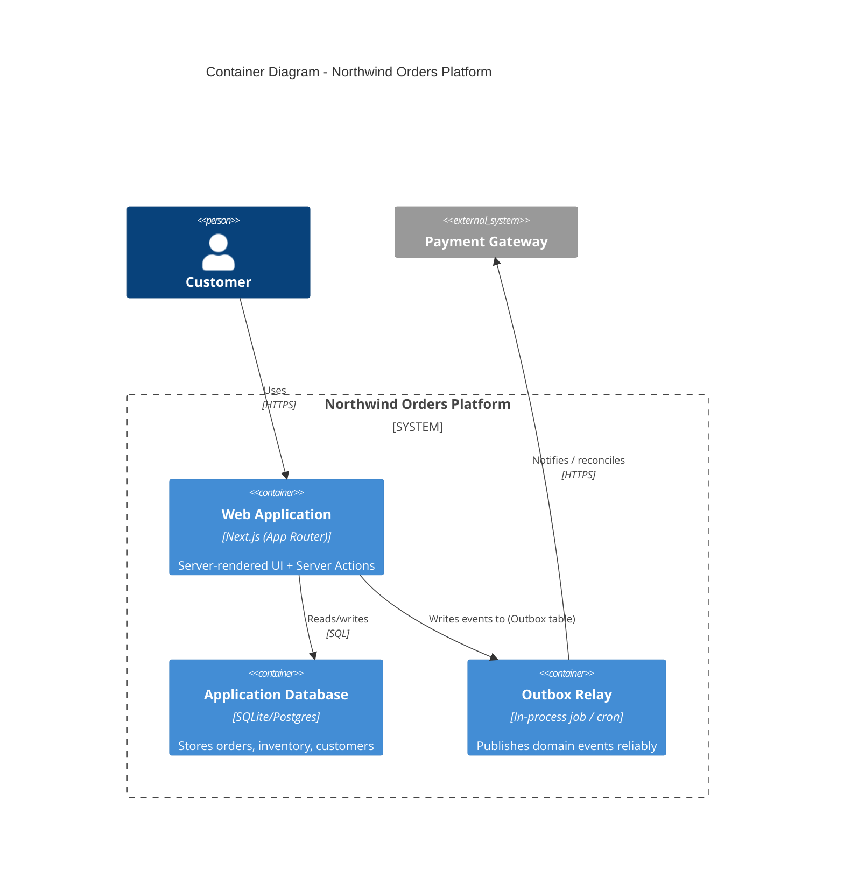

# Part 1: System Architecture vs. System Design (The Architect's Mindset)

Before writing a single line of production code, every senior engineer must reconcile two distinct levels of software abstraction: **System Architecture** and **System Design**.

Think of building a skyscraper:

* **System Architecture** is the structural blueprint for the entire building—where the load-bearing columns go, how electricity flows across floors, and how the building interfaces with the city grid.
* **System Design** is the interior engineering—how a specific room’s wiring is routed, which plumbing fixtures are selected, or how a single door frame is constructed.

---

## 1. At a Glance: Architecture vs. Design

| Aspect | System Architecture | System Design |
| --- | --- | --- |
| **Level of Zoom** | **Macro** (The big picture) | **Micro** (The implementation) |
| **Primary Focus** | High-level structure, boundaries, and trade-offs | Component internals, algorithms, and data models |
| **Core Lens** | **Cost of Change** & Non-Functional Requirements | **Correctness** & Functional Requirements |
| **Key Question** | *"What are the main pieces and how do they communicate?"* | *"How do we build this specific piece to meet requirements?"* |
| **Decisions Made** | Monolith vs. Microservices, DB choices (SQL vs. NoSQL), Clean/Hexagonal boundaries | API contracts, class hierarchies, DB table schemas, caching strategies |
| **Reversibility** | Hard/expensive to change later | Easier to refactor or rewrite |
| **Target Audience** | Stakeholders, Tech Leads, Engineering Directors | Software Engineers, Code Reviewers |

---

## 2. Architecture vs. Code: The Core Distinction

* **Code** answers: *"Does this function produce the correct output for this input?"*
* **Design** answers: *"How should this module structure its interfaces and algorithms?"*
* **Architecture** answers: *"When the business changes its mind next quarter, how much of this system do we have to rewrite?"*

This is the **Cost of Change** lens, and it is the single most important mental model in software architecture. A junior engineer optimizes for *"does it work."* A senior engineer optimizes for *"is it correct."* A **principal architect** optimizes for *"what does it cost us to change this in 6 months, and have we deferred that cost until we have maximum information?"*

Every architectural pattern—layering, DDD, DI, event-driven consistency, circuit breakers, API versioning, ADRs—is a tool for **deferring or reducing the cost of change**, not a tool for making code "more elegant."

### The Three Questions an Architect Asks Before Writing Code

1. **What varies, and what is stable?**
*(Business rules are usually stable. UI frameworks, databases, and third-party APIs change often.)*
2. **What depends on what?**
*(Dependencies must point from volatile things toward stable things—never the reverse.)*
3. **What is the blast radius of a mistake here?**
*(A bad decision in a leaf utility function costs an hour. A bad decision in the data model costs months.)*

---

## 3. Clean Architecture (and Why "Clean" Doesn't Mean "Pretty")

Robert C. Martin's Clean Architecture (a descendant of Hexagonal Architecture / Ports & Adapters, and Onion Architecture) organizes code into concentric layers where **dependencies only point inward**:

```
┌─────────────────────────────────────────────┐
│  Frameworks & Drivers (Next.js, React, DB)   │  ← Outermost (Most Volatile)
│  ┌─────────────────────────────────────────┐ │
│  │  Interface Adapters (Controllers, DTOs)  │ │
│  │  ┌───────────────────────────────────┐   │ │
│  │  │  Application (Use Cases)          │   │ │
│  │  │  ┌─────────────────────────────┐  │   │ │
│  │  │  │  Domain (Entities, Rules)    │  │   │ │  ← Innermost (Most Stable)
│  │  │  └─────────────────────────────┘  │   │ │
│  │  └───────────────────────────────────┘   │ │
│  └─────────────────────────────────────────┘ │
└─────────────────────────────────────────────┘

```

**The Dependency Rule:** Source code dependencies can only point inward. The **Domain** layer knows nothing about Next.js, React, Postgres, or `fetch`. Next.js knows about the Domain—never the other way around.

**Why this matters for Cost of Change:** Next.js or React versions will eventually evolve or be replaced. Your database or ORM will eventually be swapped. Your core business rule (*"an order cannot ship without a successful payment"*) will outlive all of them.

If your business rule is entangled inside a Server Action or a database query, replacing the framework means re-deriving the business rule from scattered code. If the business rule lives in a pure, framework-agnostic `domain/` module, replacing the framework is a weekend project, not a system rewrite.

---

### Locality of Behavior (LoB) — The Counterweight

Clean Architecture's layering can be taken too far, producing "onion soup": a change to one feature requires touching 6 files across 4 layers ("shotgun surgery"). **Locality of Behavior (LoB)** is the counter-principle:

> *Code that changes together should live together, and the behavior of a unit of code should be evident from looking at it, not from tracing it through five indirections.*

The synthesis: **Layer by dependency direction (domain vs. framework), but colocate by feature, not by technical role.**

We organize as `modules/ordering/` and `modules/inventory/` (feature-first) rather than `controllers/`, `services/`, and `repositories/` (role-first) at the top level. Each module internally respects the Dependency Rule, but you never hunt across the entire repo to understand one feature.

```
src/
  modules/
    ordering/
      domain/          # Entities, value objects, domain rules (Pure TS, zero framework imports)
      application/     # Use cases / application services (Orchestrates domain + ports)
      infrastructure/  # Adapters: Server Actions, DB repositories, external API clients
      ui/              # Server/Client UI Components specific to ordering
    inventory/
      domain/
      application/
      infrastructure/
      ui/
    shared-kernel/     # Truly shared types/utilities used by 2+ modules (Keep minimal!)

```

---

## 4. The C4 Model: Documenting Architecture Without Paid Tools

The **C4 Model** (Simon Brown) gives four levels of zoom, each answering a specific audience's question:

| Level | Diagram | Primary Audience | Question Answered |
| --- | --- | --- | --- |
| **1. Context** | System Context | Anyone (Non-technical) | What is this system, and what does it talk to? |
| **2. Container** | Container Diagram | Technical Stakeholders | What are the deployable/runnable units (app, DB, queue)? |
| **3. Component** | Component Diagram | Developers / Engineers | What are the major building blocks inside one container? |
| **4. Code** | Class / ERD | Developers (Rarely drawn) | Class/module details — usually better read in the code |

---

### Level 1: System Context Diagram (Mermaid)



---

### Level 2: Container Diagram (Mermaid)



> **Why Diagrams-as-Code?**
> Standardizing on Mermaid or PlantUML keeps diagrams in version control directly alongside code. They get reviewed in pull requests and never go stale silently inside an external wiki. This applies **Locality of Behavior** directly to documentation.

---

## 5. Architectural Design Exercise

**Scenario:** You are the architect for **Northwind Orders**—a platform where customers order products, staff fulfill them, payments are processed externally, and customers receive notifications.

### Step 1: Context Analysis

Identify all human actors and external systems. Determine: Is the notification provider a dependency of the *domain*, or of the *infrastructure*?

* *Insight:* The requirement that *"a notification must be sent when an order ships"* is a business (domain) rule. The choice of using Twilio or SendGrid is an infrastructure detail.

### Step 2: Container Design

Sketch a Level 2 Container diagram. Identify: How many independently deployable units does this need on Day 1?

* *Insight:* For an MVP, one web container and one database are sufficient. Introducing message queues, Redis caches, or microservices upfront pays a **scalability tax** before proving the scale requirement.

### Step 3: Cost-of-Change Assessment

Evaluate how future changes impact architectural layers:

| Likely Change | Affected Layer | Impact Analysis |
| --- | --- | --- |
| **Swap payment provider** | **Infrastructure** | Zero domain changes if abstracted behind an interface/port. |
| **Add a mobile app** | **Interface Adapters / UI** | Exposes new controllers/API routes; domain remains intact. |
| **Migrate SQLite to Postgres** | **Infrastructure** | Swaps repository implementations only. |
| **Add loyalty points program** | **Domain** | Changes business rules (correctly forces a domain update). |
| **Multi-warehouse fulfillment** | **Domain** | Expands inventory & order aggregates (correctly forces domain update). |

---

> **Key Architectural Takeaway**
> **Infrastructure changes should never ripple into the Domain layer.** If swapping a database or third-party service forces changes to core business logic, it reveals a **leaky abstraction**—the primary failure mode that strong architectural boundaries are designed to prevent.

---

## Up Next

**Part 2: Designing the Core** takes the `domain/` folder established here and builds out the business logic using Domain-Driven Design (DDD)—implementing Bounded Contexts, Entities, Value Objects, and Aggregates for the Northwind Orders platform.
