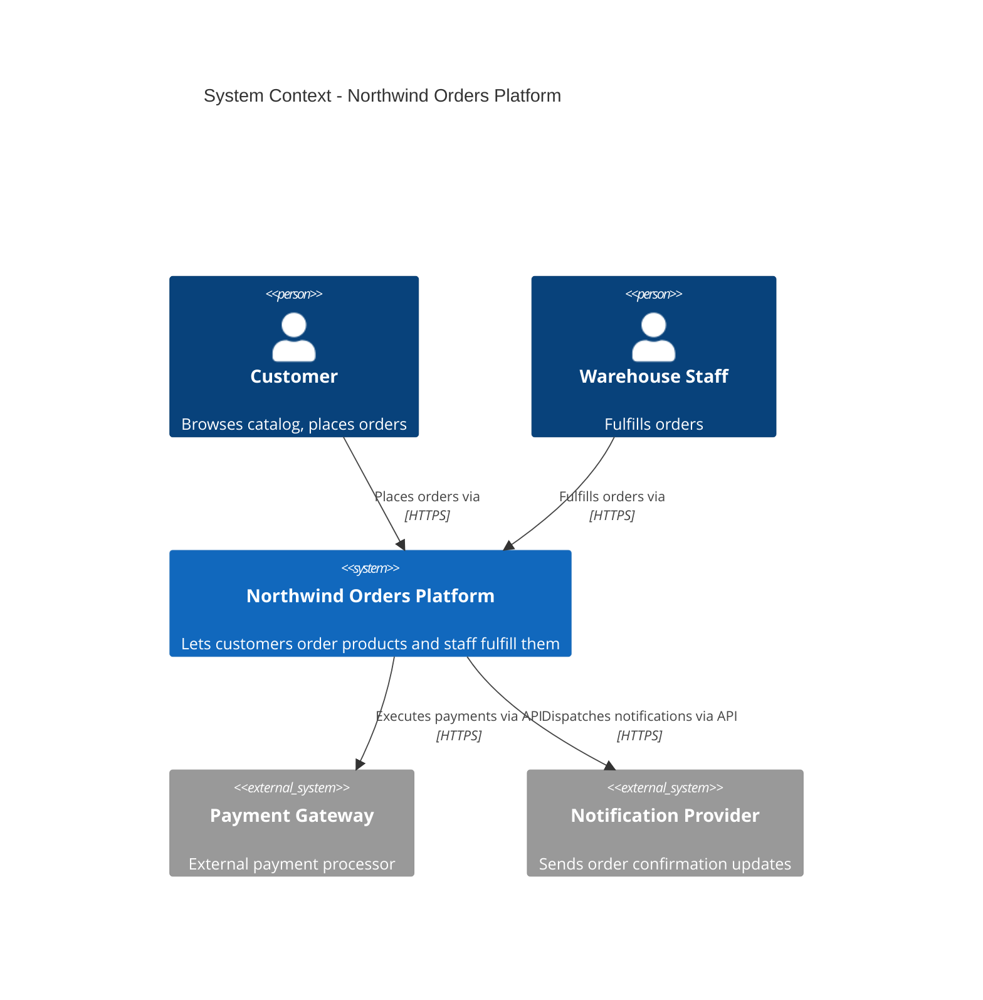
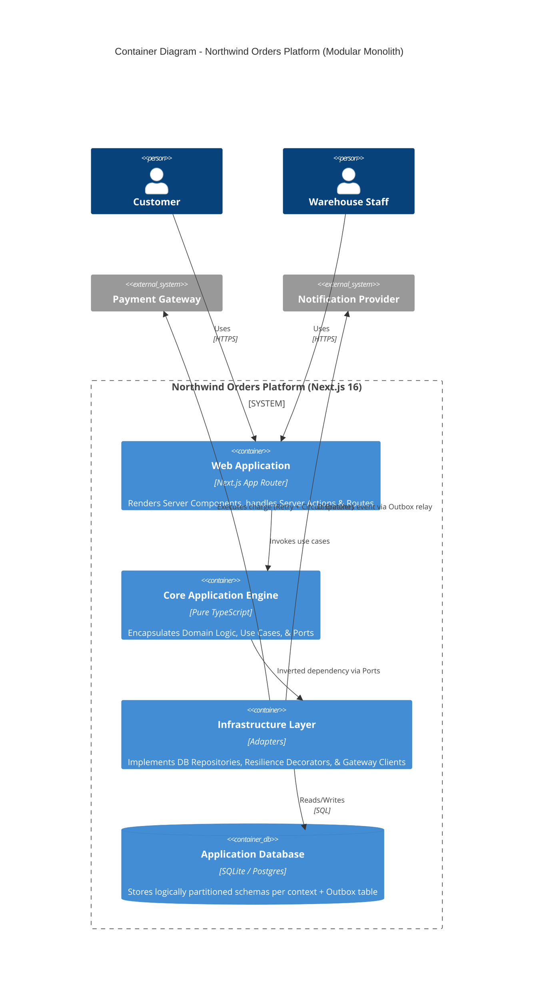
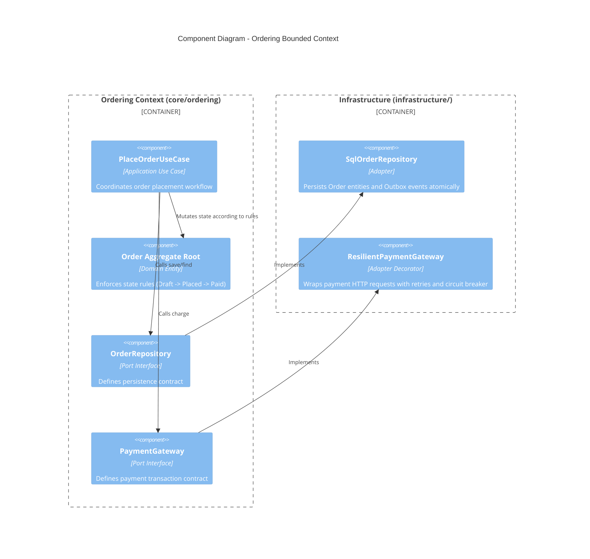

# Part 1: System Architecture vs. System Design (The Architect's Mindset)

Before writing a single line of production code, every senior software engineer must reconcile two distinct levels of software abstraction: **System Architecture** and **System Design**.

Think of building a skyscraper:

* **System Architecture** is the structural blueprint for the entire building—where the load-bearing columns go, how electricity flows across floors, and how the building interfaces with the city grid.


* **System Design** is the interior engineering—how a specific room’s wiring is routed, which plumbing fixtures are selected, or how a single door frame is constructed.


---

## 1. At a Glance: Architecture vs. Design

| Aspect | System Architecture | System Design |
| --- | --- | --- |
| **Level of Zoom** | **Macro** (The big picture)

 | **Micro** (The implementation)

 |
| **Primary Focus** | High-level structure, boundaries, and non-functional trade-offs

 | Component internals, algorithms, and data models

 |
| **Core Lens** | **Cost of Change** & Quality Attributes (Performance, Resilience, Security)

 | **Correctness** & Functional Requirements fulfillment

 |
| **Key Question** | *"What are the main pieces and how do they communicate?"*<br> | *"How do we build this specific piece to meet specifications?"*<br> |
| **Decisions Made** | Monolith vs. Microservices, DB paradigms (SQL/NoSQL), Clean/Hexagonal boundaries, Event persistence strategies

 | API contracts, class hierarchies, schema indexes, caching decorators

 |
| **Reversibility** | **Irreversible / High Cost** (Architectural One-Way Doors)

 | **Reversible / Low Cost** (Refactorable in a PR)

 |
| **Target Audience** | Stakeholders, Tech Leads, Engineering Directors

 | Software Engineers, Code Reviewers

 |

---

## 2. Architecture vs. Code: The Core Distinction

* **Code** answers: *"Does this function produce the correct output for this input?"*

* **Design** answers: *"How should this module structure its interfaces and algorithms?"*

* **Architecture** answers: *"When the business changes its mind next quarter, how much of this system do we have to rewrite?"*


This is the **Cost of Change** lens—the foundational mental model in software engineering:

$$\text{Cost of Change} = \text{Blast Radius} \times \text{Coupling Severity}$$

A junior engineer optimizes for *"does it work."* A senior engineer optimizes for *"is it correct."* A **principal architect** optimizes for *"what does it cost us to change this in 6 months, and have we deferred that cost until we have maximum information?"*

Every pattern explored across this platform—Clean Architecture layering, DDD bounded contexts, Inversion of Control via Ports & Adapters, Outbox event consistency, circuit breakers, additive API versioning, and ADR logs—is a deliberate tool for **deferring or reducing the cost of change**.

---

### The Three Questions an Architect Asks Before Writing Code

1. **What varies, and what is stable?**


(Business rules are usually stable. UI frameworks, database drivers, and third-party SaaS vendors change often.)


2. **What depends on what?**


(Source code dependencies must point exclusively from volatile details toward stable abstractions—never the reverse.)


3. **What is the blast radius of a mistake here?**


(A bad implementation inside a leaf utility function costs an hour to fix. A leaked database dependency in core domain logic costs months during a framework or database migration.)


---

## 3. Clean Architecture (and Why "Clean" Doesn't Mean "Pretty")

Clean Architecture (Uncle Bob Martin), derived from Hexagonal Architecture (Alistair Cockburn) and Onion Architecture (Jeffrey Palermo), organizes code into concentric rings where **source dependencies only point inward**:

```
┌─────────────────────────────────────────────────────────┐
│  Frameworks & Drivers (Next.js 16, React, Postgres, ORM)│  ← Outermost (Most Volatile)[cite: 1, 8]
│  ┌───────────────────────────────────────────────────┐  │
│  │  Interface Adapters (Controllers, DTOs, Handlers) │  │[cite: 1, 8]
│  │  ┌─────────────────────────────────────────────┐  │  │
│  │  │  Application (Use Cases, Ports/Interfaces)  │  │  │[cite: 1, 6, 8]
│  │  │  ┌───────────────────────────────────────┐  │  │  │
│  │  │  │  Domain (Entities, Rules, Values)    │  │  │  │  │  ← Innermost (Most Stable)[cite: 1, 8]
│  │  │  └───────────────────────────────────────┘  │  │  │
│  │  └─────────────────────────────────────────────┘  │  │
│  └───────────────────────────────────────────────────┘  │
└─────────────────────────────────────────────────────────┘

```

### The Dependency Rule

> Source code dependencies can only point inward. The `Domain` ring knows nothing about Next.js, React, Postgres, or HTTP clients. Next.js knows about the Domain—never the reverse.
> 
> 

#### Why This Governs Cost of Change

Frameworks, databases, and third-party APIs inevitably change. Core business rules—such as *"an order cannot ship without a successful payment"*—outlive technical infrastructure.

If business logic is embedded inside Next.js Server Actions or direct SQL queries, swapping the UI framework or database forces a risky rewrite to re-extract hidden domain rules. When business rules reside in a framework-agnostic `core/` module, replacing infrastructure becomes a localized integration task.

---

### Locality of Behavior (LoB) — The Structural Counterweight

Strict layering can be over-engineered into "onion soup," where modifying a single feature requires "shotgun surgery" across multiple disjoint folders (`controllers/`, `services/`, `repositories/`).

**Locality of Behavior (LoB)** provides the counterweight:

> Code that changes together should live together, and the behavior of a unit of code should be evident from looking at it, rather than tracing it through excessive indirections.
> 
> 

#### The Architectural Synthesis: Modular Monolith Topology

Layer by dependency direction (Domain vs. Framework), but partition top-level code by feature context.

```
src/
  core/                               # Zero framework imports in this directory[cite: 1]
    ordering/                         # Bounded Context: Ordering[cite: 1, 7]
      domain/                         # Pure TypeScript entities, value objects, domain rules[cite: 1, 8]
        entities/ Order.ts[cite: 1]
        value-objects/ Money.ts[cite: 1]
      application/                    # Application services / Use cases[cite: 1, 8]
        ports/ OrderRepository.ts[cite: 1, 6]
        use-cases/ PlaceOrder.ts[cite: 1, 6]
    inventory/                        # Bounded Context: Inventory[cite: 1, 7]
      domain/ ...[cite: 1]
      application/ ...[cite: 1]
    shared-kernel/                    # Minimal shared domain primitive types[cite: 1, 8]

  infrastructure/                     # Concrete implementations of Application Ports[cite: 1, 6]
    persistence/ SqlOrderRepository.ts[cite: 1, 5]
    payments/ ResilientPaymentGateway.ts[cite: 1, 4]
    events/ OutboxRelay.ts[cite: 1, 5]
    container.ts                      # Composition Root wiring Ports to Adapters[cite: 1, 6]

  interface-adapters/                 # Translation boundaries[cite: 1]
    dtos/ OrderDTOv1.ts[cite: 1, 3]

  app/                                # Next.js 16 Framework & Drivers layer[cite: 1]
    api/v1/orders/route.ts[cite: 1]
    actions/place-order.ts[cite: 1, 6]

```

---

## 4. The C4 Model: Documenting Architecture as Code

The **C4 Model** (Simon Brown) standardizes software architecture diagrams into four levels of abstraction. Using **Diagrams-as-Code (Mermaid)** ensures documentation lives in version control directly alongside code.

---

### Level 1: System Context Diagram



---

### Level 2: Container Diagram



---

### Level 3: Component Diagram (Inside Web Application / Core)



---

## 5. Architectural Design Exercise

**Scenario:** You are the architect for **Northwind Orders**—a platform where customers order products, warehouse staff fulfill them, payments are processed externally, and notifications are sent asynchronously.

### Step 1: Context Analysis

Identify human actors, external boundaries, and dependency directions.

* **Question:** Is the Notification Provider a dependency of the *Domain* or of the *Infrastructure*?


* **Architectural Decision:** The rule *"a customer must be notified when an order ships"* is a core domain rule. The choice to execute delivery using Twilio, SendGrid, or AWS SES is an infrastructure adapter detail. The domain layer defines a `NotificationSender` port; infrastructure supplies the concrete HTTP client adapter.


### Step 2: Container Design & Scalability Tax Evaluation

Evaluate deployment container choices for Day 1.

* **Decision:** Start as a **Modular Monolith** running inside a unified web container with an isolated database schema per context.


* **Trade-off Justification:** Adopting distributed microservices on Day 1 imposes a **scalability tax** (network partitioning handling, distributed tracing, complex cross-service sagas) before proving scaling requirements. Pre-cut modular seams allow extracting a context (e.g., Inventory) into a standalone service later without modifying core domain rules.


### Step 3: Cost-of-Change Assessment

| Anticipated Change | Impacted Layer | Architectural Cost Analysis |
| --- | --- | --- |
| **Swap Payment Provider (e.g., Stripe $\rightarrow$ Adyen)** | **Infrastructure**<br> | **Zero core changes.** Create a new `AdyenPaymentGateway` adapter implementing the existing `PaymentGateway` port and update `container.ts`.

 |
| **Add a Mobile Client App** | **Interface Adapters**<br> | **Zero core changes.** Expose new API routes returning DTOs; existing use cases remain unchanged.

 |
| **Migrate Database (e.g., SQLite $\rightarrow$ Postgres)** | **Infrastructure**<br> | **Zero core changes.** Swap SQL repository adapter implementations.

 |
| **Introduce Loyalty Program Rules** | **Domain**<br> | **Intended domain update.** Changes business rules; requires explicit domain entity modifications.

 |
| **Extract Inventory into a Microservice** | **Infrastructure Container Root**<br> | **Zero core changes.** Swap in-process event buses for a broker adapter (e.g., RabbitMQ); domain logic remains intact.

 |

---

> **Key Architectural Takeaway**
> Infrastructure changes must never ripple inward into the Domain layer. When changing a database driver, API framework, or third-party vendor forces modifications to business logic, it reveals a **leaky abstraction**—the primary failure mode that clear architectural boundaries are designed to prevent.
> 
> 

---

## Up Next

**Part 2: Designing the Core** applies these concepts directly to the `core/` domain. We will model the Northwind Orders domain using **Domain-Driven Design (DDD)**—building pure, framework-agnostic Bounded Contexts, Aggregates, Entities, and Value Objects.
