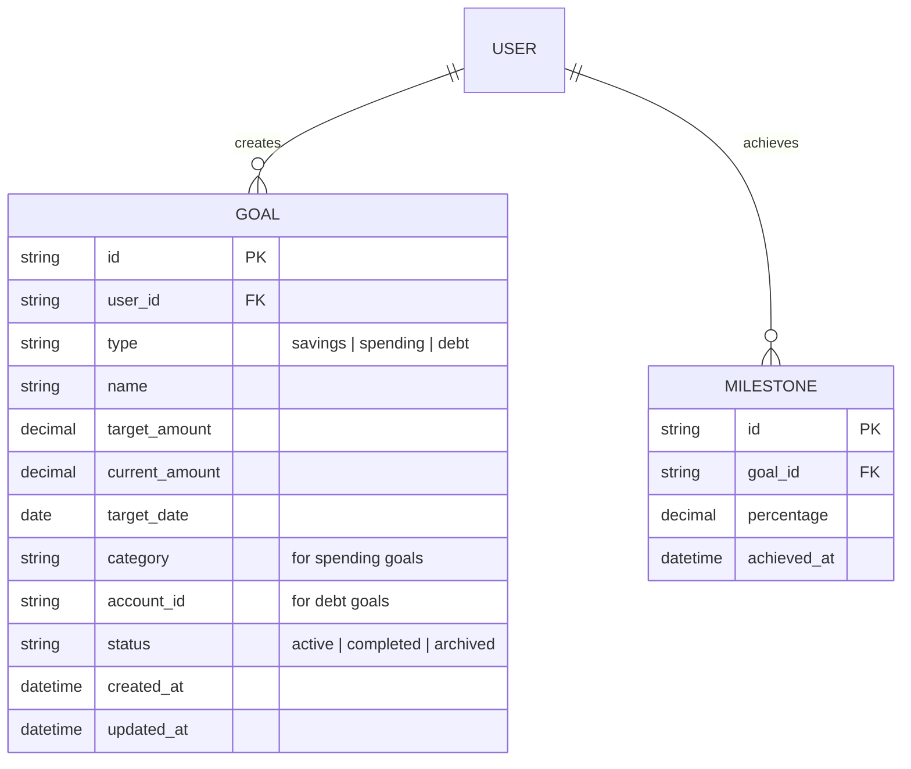

# Part 7: Writing PRDs

## Core Concept: The Blueprint for Building

You've identified what to build (Goal Setting) and why (retention, engagement, user success). Now you need to document *exactly* what you're building, so your engineering and design teams can execute flawlessly.

This is where the **Product Requirements Document (PRD)** comes in.

### What Is a PRD?

A PRD is a single source of truth that answers one question:

> *"What exactly are we building, and how will we know it's done?"*

It's not a design specification, a technical architecture document, or a marketing brief. It's the bridge between strategy and execution.

### The PRD Philosophy

Here's what makes a great PRD:

```
┌─────────────────────────────────────────────────────────────────────────┐
│                     WHAT MAKES A GREAT PRD                             │
│                                                                         │
│  ┌─────────────────────────────────────────────────────────────────┐   │
│  │  IT ANSWERS "WHAT," NOT "HOW"                                  │   │
│  │  ───────────────────────────────────────────────────────────── │   │
│  │  Bad: "Use React to build a settings page"                    │   │
│  │  Good: "Users can edit their goal amount on the dashboard"    │   │
│  │                                                                 │   │
│  │  The "how" is for engineers to decide.                       │   │
│  └─────────────────────────────────────────────────────────────────┘   │
│                                                                         │
│  ┌─────────────────────────────────────────────────────────────────┐   │
│  │  IT'S TESTABLE                                                │   │
│  │  ───────────────────────────────────────────────────────────── │   │
│  │  Bad: "The onboarding should be good"                         │   │
│  │  Good: "90% of users complete onboarding within 3 minutes"    │   │
│  │                                                                 │   │
│  │  Every requirement should have a way to verify success.       │   │
│  └─────────────────────────────────────────────────────────────────┘   │
│                                                                         │
│  ┌─────────────────────────────────────────────────────────────────┐   │
│  │  IT'S COMPLETE                                                 │   │
│  │  ───────────────────────────────────────────────────────────── │   │
│  │  Bad: "Users can set goals" (what about editing? deleting?    │   │
│  │        progress tracking? error states?)                       │   │
│  │  Good: Covers the entire user journey, edge cases, and        │   │
│  │        error states.                                          │   │
│  └─────────────────────────────────────────────────────────────────┘   │
│                                                                         │
│  ┌─────────────────────────────────────────────────────────────────┐   │
│  │  IT'S ALIGNED                                                   │   │
│  │  ───────────────────────────────────────────────────────────── │   │
│  │  Bad: Requirements that contradict other features             │   │
│  │  Good: Requirements are consistent with the overall strategy  │   │
│  │                                                                 │   │
│  │  Every requirement should reinforce the product vision.       │   │
│  └─────────────────────────────────────────────────────────────────┘   │
└─────────────────────────────────────────────────────────────────────────┘
```

### PRD vs. Other Artifacts

| Artifact | Purpose | Audience | Format |
|----------|---------|----------|--------|
| **PRD** | What to build and why | Engineering, Design, QA | Document with sections |
| **User Stories** | Specific user needs | Engineering, QA | As a/I want/So that |
| **Design Specs** | Visual and interaction design | Design, Engineering | Wireframes, mockups |
| **Technical Specs** | Architecture and implementation | Engineering | Technical documents |
| **Roadmap** | When to build what | Stakeholders, Leadership | Timeline/visual |

---

## The Ledgerly Scenario: Writing a PRD

We've prioritized Goal Setting as our top feature. Now we need to write a complete PRD for it.

### Step 1: Define the PRD Structure

A PRD should be organized and comprehensive. Here's the structure we'll use for Ledgerly:

```
┌─────────────────────────────────────────────────────────────────────────┐
│                    PRD STRUCTURE                                        │
│                                                                         │
│  1. Executive Summary                                                   │
│     ────────────────────────────────────────────────────────────────   │
│     One-paragraph overview of what we're building and why.             │
│                                                                         │
│  2. Problem Statement                                                   │
│     ────────────────────────────────────────────────────────────────   │
│     What problem are we solving? (From discovery work)                 │
│                                                                         │
│  3. User Stories                                                        │
│     ────────────────────────────────────────────────────────────────   │
│     The features from a user's perspective.                            │
│                                                                         │
│  4. Success Metrics                                                     │
│     ────────────────────────────────────────────────────────────────   │
│     How we'll measure whether this feature is successful.              │
│                                                                         │
│  5. Detailed Requirements                                               │
│     ────────────────────────────────────────────────────────────────   │
│     Functional requirements for each feature.                          │
│                                                                         │
│  6. Technical Considerations                                            │
│     ────────────────────────────────────────────────────────────────   │
│     Technical trade-offs and constraints.                              │
│                                                                         │
│  7. Design Considerations                                               │
│     ────────────────────────────────────────────────────────────────   │
│     UX/UI guidelines and constraints.                                  │
│                                                                         │
│  8. Dependencies & Assumptions                                          │
│     ────────────────────────────────────────────────────────────────   │
│     What needs to be true for this to work.                            │
│                                                                         │
│  9. Out of Scope                                                        │
│     ────────────────────────────────────────────────────────────────   │
│     What we're NOT building in this version.                          │
│                                                                         │
│  10. Appendix                                                           │
│      ────────────────────────────────────────────────────────────────  │
│      Wireframes, user flows, and research references.                  │
└─────────────────────────────────────────────────────────────────────────┘
```

### Step 2: Write the PRD

Create a document called `prd-goal-setting.md` in your `03-execution/` folder:

```markdown
# Ledgerly: PRD - Goal Setting

**Version:** 1.0
**Date:** [Current Date]
**Status:** Draft
**Author:** [Your Name]
**Reviewers:** Engineering, Design, Product

---

## 1. Executive Summary

Goal Setting is Ledgerly's flagship feature to drive user retention and engagement. Users who set financial goals are 3x more likely to remain active after 30 days (from our discovery research). This feature allows users to create, track, and achieve savings, spending, and debt reduction goals—turning Ledgerly from a passive spending tracker into an active tool for financial progress.

**Key Outcomes:**
- 50% of users set at least one goal within 30 days of onboarding
- Goal-setting users retain at 3x the rate of non-goal users
- Users report feeling more "in control" of their finances

---

## 2. Problem Statement

Young professionals (25-40) who use Ledgerly want to improve their financial health, but they don't know where to start. They can see their spending history, but they have no guidance on what to do differently. Without a clear goal to work toward, they lose motivation and stop using the app within 30 days.

**The core problems:**
- Users don't know how to set financial goals
- Users don't see progress and lose motivation
- Users don't have a reason to return to Ledgerly regularly
- Users who set goals (in external tools) are 3x more likely to retain—we need to bring this capability in-app

---

## 3. User Stories

### Epic 1: Create and Manage Goals

**Story 1: Create a Savings Goal**
> As a user who wants to save money,
> I want to create a savings goal with a target amount and deadline,
> So that I have a clear target to work toward.

**Story 2: Create a Spending Goal**
> As a user who wants to manage my spending,
> I want to create a spending goal for a specific category (e.g., dining out),
> So that I can stay within my budget.

**Story 3: Create a Debt Reduction Goal**
> As a user who has debt,
> I want to create a goal to pay off a specific debt,
> So that I can become debt-free.

**Story 4: Edit Goals**
> As a user who's tracking goals,
> I want to edit my goal amount, deadline, or category,
> So that my goals stay relevant as my situation changes.

**Story 5: Delete Goals**
> As a user who no longer needs a goal,
> I want to delete the goal from my dashboard,
> So that my dashboard stays clean and focused.

### Epic 2: Track Goal Progress

**Story 6: View Goal Progress**
> As a user with active goals,
> I want to see my progress toward each goal on my dashboard,
> So that I stay motivated and know if I'm on track.

**Story 7: See Goal Details**
> As a user who wants to understand my progress,
> I want to view detailed information about my goal (progress chart, projected completion date, amount remaining),
> So that I know exactly what to do next.

**Story 8: Get Progress Notifications**
> As a user who wants to stay on track,
> I want to receive notifications when I hit milestones or fall behind,
> So that I can take corrective action.

### Epic 3: Get Recommendations

**Story 9: Get Goal Suggestions**
> As a user who doesn't know what goal to set,
> I want to see suggested goals based on my spending patterns,
> So that I have a starting point.

**Story 10: Get Actionable Tips**
> As a user who wants to achieve my goals,
> I want to receive personalized tips on how to save more or spend less,
> So that I have a clear path forward.

---

## 4. Success Metrics

### North Star Metric
- **Retention at 30 days:** Increase from 20% to 40%
- **Goal-setting adoption:** 50% of users set at least one goal within 30 days

### Secondary Metrics
- **Weekly active users:** Increase from 10% to 30%
- **Goal completion rate:** 20% of goals are completed within 3 months
- **User satisfaction:** 4.5+/5 rating from goal-setting users
- **Session depth:** Goal-setting users view 5+ screens per session

### Counter-Metrics (Things We Should NOT Hurt)
- **User churn:** Should not increase for non-goal-setting users
- **Performance:** App should not slow down with added features
- **Onboarding completion:** Should not decrease due to added complexity

---

## 5. Detailed Requirements

### Feature 1: Create Goal

**Functional Requirements:**

1. **Goal Types:**
   - Savings Goal: "Save $X by [date]"
   - Spending Goal: "Spend less than $X on [category] per month"
   - Debt Goal: "Pay off [account] by [date]"

2. **Goal Creation Flow:**
   - User clicks "Set a Goal" button on dashboard
   - User selects goal type (Savings, Spending, Debt)
   - User enters goal parameters:
     - **Savings:** Target amount, target date, optional note
     - **Spending:** Category, monthly limit
     - **Debt:** Account name, total balance, target date
   - User confirms and saves goal
   - Goal appears on dashboard with initial progress

3. **Validation Rules:**
   - Target amount must be > $0
   - Target date must be in the future
   - Goal name cannot be empty
   - Duplicate goals are allowed (user can have multiple goals)

4. **Error Handling:**
   - Display clear error messages for invalid inputs
   - Auto-save progress so users don't lose work
   - Allow users to save as draft (not activate yet)

**Non-Functional Requirements:**
- Goal creation should take < 2 minutes for 90% of users
- Goal should appear on dashboard within 5 seconds of saving
- Mobile-responsive: works seamlessly on mobile and desktop

---

### Feature 2: Track Goal Progress

**Functional Requirements:**

1. **Dashboard Widget:**
   - Display each goal with progress bar and percentage
   - Show "On Track" or "Behind" indicator
   - Clicking goal opens detail view

2. **Goal Detail View:**
   - Show progress chart (line chart over time)
   - Show target amount, current amount, and amount remaining
   - Show projected completion date
   - Show key milestones (e.g., "50% completed!")
   - Show transaction history related to the goal

3. **Progress Calculation:**
   - **Savings Goal:** Progress = (current savings) / (target amount)
   - **Spending Goal:** Progress = 1 - (monthly spending) / (monthly limit)
   - **Debt Goal:** Progress = (amount paid off) / (total debt)

4. **Milestones:**
   - Show notification at 25%, 50%, 75%, and 100% completion
   - Celebrate completion with confetti/celebration message

**Non-Functional Requirements:**
- Dashboard should load in < 2 seconds
- Charts should be responsive and accessible
- Progress should update within 1 hour of new transactions

---

### Feature 3: Edit and Delete Goals

**Functional Requirements:**

1. **Edit Goal:**
   - Allow users to modify target amount, target date, and description
   - Show current values as default
   - Validate inputs before saving
   - Show confirmation after successful update

2. **Delete Goal:**
   - Display confirmation dialog before deletion
   - Explain that this action cannot be undone (unless we add archive feature later)
   - Remove goal from dashboard after deletion

3. **Archive Goals:**
   - Allow users to archive completed goals (instead of deleting)
   - Archived goals are visible in "Archived Goals" section
   - Users can unarchive goals if needed

**Non-Functional Requirements:**
- Changes should take effect within 30 seconds
- Users should receive confirmation of changes

---

### Feature 4: Goal Suggestions

**Functional Requirements:**

1. **Suggested Goals:**
   - Based on user's spending patterns, suggest goals
   - Example: "Based on your spending, you could save $50/month by reducing dining out"
   - Show 3-5 suggested goals on creation screen

2. **Personalization:**
   - Analyze user's transaction history for patterns
   - Identify categories with high spending
   - Recommend realistic targets (not too high, not too low)

3. **Opt-out:**
   - Allow users to dismiss suggestions they don't want

**Non-Functional Requirements:**
- Suggestions should be generated in < 1 second
- Suggestions should be privacy-preserving (use anonymized data)

---

### Feature 5: Notifications

**Functional Requirements:**

1. **Milestone Notifications:**
   - Send push notification at 25%, 50%, 75%, 100% completion
   - Send email summary of progress (weekly)

2. **Alert Notifications:**
   - Send notification if user is falling behind on a goal
   - Send notification if user is making exceptional progress

3. **Notification Preferences:**
   - Users can opt-in/out of notifications
   - Users can customize frequency (daily, weekly, monthly)

**Non-Functional Requirements:**
- Notifications should arrive within 1 minute of milestone being reached
- Unsubscribe should be easy (one-click)

---

## 6. Technical Considerations

### Data Model



### Technical Trade-offs

1. **Real-time vs. Batch Updates:**
   - *Decision:* Batch update progress every 6 hours
   - *Rationale:* Users don't need real-time updates; this reduces API calls

2. **Caching Strategy:**
   - *Decision:* Cache goal progress in Redis for 15 minutes
   - *Rationale:* Dashboard loads quickly; progress is updated frequently

3. **Notification Delivery:**
   - *Decision:* Use a queue-based notification system (AWS SQS)
   - *Rationale:* Guarantees delivery; scalable

### Performance Requirements

- Goal creation: < 500ms response time
- Dashboard load: < 2 seconds (including all widgets)
- Progress updates: < 1 hour latency
- Notification delivery: < 1 minute latency

### Security Requirements

- Goal data should be encrypted at rest
- Goal data should be accessible only to the owning user
- No goal data should be exposed in logs

---

## 7. Design Considerations

### Design Principles

1. **Simplicity:** Goal creation should feel effortless. No jargon, no complexity.
2. **Clarity:** Progress should be immediately visible and understandable.
3. **Motivation:** Celebrate wins, encourage when behind, never shame users.
4. **Consistency:** Follow Ledgerly's existing design language.

### Key Screens

1. **Goal Creation Flow:**
   - Step 1: Select goal type (Savings, Spending, Debt)
   - Step 2: Enter goal parameters
   - Step 3: Review and confirm

2. **Dashboard:**
   - Show 3-5 goals with progress bars
   - Show "Add Goal" button
   - Show "You're on track" or "You're behind" indicator

3. **Goal Detail View:**
   - Progress chart (line)
   - Key metrics (target, current, remaining)
   - Actionable insights ("To stay on track, save $X more per week")
   - Transaction history related to the goal

### Accessibility Requirements

- WCAG 2.1 AA compliant
- Screen-reader compatible
- Color-contrast requirements (4.5:1 for text)
- Keyboard-navigable

---

## 8. Dependencies & Assumptions

### Dependencies

- **Plaid Integration:** Needs to provide transaction data for progress tracking
- **User Authentication:** Requires users to be logged in
- **Notification Service:** Requires push notification setup
- **Analytics:** Requires event tracking for metrics

### Assumptions

- Users have at least one bank account connected
- Users have transaction history (at least 1 month)
- Users have given permission for notifications (opt-in)
- App is responsive and works on mobile

### Risks

1. **Low adoption:** Users may not set goals
   - *Mitigation:* Guide users during onboarding; send nudges
2. **Inaccurate progress:** Transactions may be miscategorized
   - *Mitigation:* Allow manual category editing; improve categorization
3. **Technical complexity:** Real-time updates may be challenging
   - *Mitigation:* Batch updates with eventual consistency

---

## 9. Out of Scope

**Not in this version:**
- Shared goals (multiple users on one goal)
- Automatic goal suggestion based on AI
- Goal templates (pre-set goals)
- Linking goals to specific accounts
- Investment goals
- Goal sharing on social media
- Goal gamification (achievements, challenges)

**Future Versions:**
- Goal templates for common financial goals
- Automatic goal adjustment based on spending patterns
- Goal recommendations using machine learning
- Shared goals for couples/families

---

## 10. Appendix

### User Flow: Goal Creation

```
[Start] → [User clicks "Set a Goal"] → [Select goal type]
                                        │
                                        ▼
                                [Enter goal parameters]
                                        │
                                        ▼
                                [Review and confirm]
                                        │
                                        ▼
                                [Goal added to dashboard]
                                        │
                                        ▼
                                  [End]
```

### User Flow: Goal Progress Tracking

```
[Start] → [User opens dashboard] → [View goal progress bars]
                                    │
                                    ▼
                            [Click a goal for detail view]
                                    │
                                    ▼
                            [View progress chart]
                                    │
                                    ▼
                            [View milestones and insights]
                                    │
                                    ▼
                                  [End]
```

### Wireframe References

[Include wireframe images or links here]

### Research References

- User research: Ledgerly discovery phase (Parts 1-3)
- Competitive analysis: Goal features in Mint, YNAB, and Personal Capital
- Retention analysis: Users who set goals are 3x more likely to retain

---

## 11. Review Checklist

- [ ] Problem statement is clear and grounded in research
- [ ] User stories cover all key user journeys
- [ ] Success metrics are measurable and meaningful
- [ ] Requirements are complete and testable
- [ ] Technical constraints are considered
- [ ] Design guidelines are established
- [ ] Out of scope is clearly defined
- [ ] Dependencies and risks are identified

---

## 12. Change Log

| Version | Date | Author | Changes |
|---------|------|--------|---------|
| 1.0 | [Date] | [Your Name] | Initial version |
```

---

## Framework Deep Dive: Writing Effective User Stories

User stories are the atomic units of a PRD. Each story is a small, testable piece of functionality.

### The User Story Formula

```
┌─────────────────────────────────────────────────────────────────────────┐
│                     USER STORY TEMPLATE                                 │
│                                                                         │
│  As a [type of user],                                                   │
│  I want [some goal],                                                    │
│  So that [some reason].                                                │
│                                                                         │
│  ─────────────────────────────────────────────────────────────────────  │
│                                                                         │
│  Example:                                                               │
│  As a user who wants to save money,                                    │
│  I want to set a savings goal with a target amount and deadline,       │
│  So that I have a clear target to work toward.                        │
└─────────────────────────────────────────────────────────────────────────┘
```

### Acceptance Criteria

Acceptance criteria define when a user story is "done." They should be:

1. **Specific:** "Users can set a goal amount between $1 and $1,000,000"
2. **Testable:** "When user sets a goal, it appears on their dashboard within 5 seconds"
3. **Unambiguous:** "Goal progress updates automatically when transactions occur"

### Writing Acceptance Criteria

```markdown
## Example: Goal Creation Acceptance Criteria

### Given:
- User is logged into Ledgerly
- User has at least one bank account connected
- User has not already created this goal

### When:
- User clicks "Set a Goal"
- User selects "Savings Goal"
- User enters target amount: $1,000
- User enters target date: 12/31/2024
- User clicks "Save"

### Then:
- Goal is created with status "Active"
- Goal appears on dashboard with progress bar at 0%
- Goal detail view shows target amount and date
- User receives confirmation message: "Goal saved!"
- Goal is visible in user's goals list
- Milestone at 25% is scheduled for when progress reaches $250

### Edge Cases:
- If target amount is 0, show error: "Please enter a valid amount"
- If target date is in the past, show error: "Please select a future date"
- If goal name is empty, show error: "Please enter a goal name"
```

---

## Hands-On Exercise: Write Your Own PRD

### Step 1: Create Your PRD

Create the PRD document `prd-goal-setting.md` in your `03-execution/` folder using the template above. Customize it for Ledgerly.

### Step 2: Create User Stories

Create a separate document called `user-stories-goal-setting.md` in your `03-execution/` folder with all user stories and acceptance criteria:

```markdown
# Ledgerly: User Stories - Goal Setting

## Epic 1: Create and Manage Goals

### Story 1: Create a Savings Goal

**User Story:**
As a user who wants to save money,
I want to create a savings goal with a target amount and deadline,
So that I have a clear target to work toward.

**Acceptance Criteria:**
- [ ] User can access "Set a Goal" from dashboard
- [ ] User can select "Savings Goal" from goal types
- [ ] User can enter target amount (minimum $1)
- [ ] User can enter target date (must be future date)
- [ ] User can enter optional description
- [ ] User can save goal after entering required fields
- [ ] Goal appears on dashboard with progress bar at 0%
- [ ] Goal detail view shows target amount, date, and current progress
- [ ] User receives confirmation message on successful save

**Edge Cases:**
- [ ] Invalid amount (0 or negative): show error message
- [ ] Past target date: show error message
- [ ] Missing required fields: show error message
- [ ] User cancels goal creation: no goal is saved

**Story 2: Create a Spending Goal**
[Continue with all stories...]

## Epic 2: Track Goal Progress

### Story 6: View Goal Progress

**User Story:**
As a user with active goals,
I want to see my progress toward each goal on my dashboard,
So that I stay motivated and know if I'm on track.

**Acceptance Criteria:**
- [ ] Each goal on dashboard shows a progress bar
- [ ] Progress bar displays percentage (0-100%)
- [ ] Progress bar displays "On Track" or "Behind" status
- [ ] Clicking goal opens detail view
- [ ] Progress updates automatically within 1 hour of new transactions

[Continue with all stories...]
```

### Step 3: Write a Brief User Flow

Create a document called `user-flow-goal-setting.md` in your `03-execution/` folder:

```markdown
# Ledgerly: User Flow - Goal Setting

## Flow 1: Create a Goal

[Start] → [Dashboard] → [Click "Set a Goal"]

           [Goal Type Selection]
           ├── Savings → [Enter amount, date] → [Review & Confirm] → [Goal Added]
           ├── Spending → [Enter category, limit] → [Review & Confirm] → [Goal Added]
           └── Debt → [Enter account, total] → [Review & Confirm] → [Goal Added]

## Flow 2: Track Goal Progress

[Start] → [Dashboard] → [View Goals]
           │
           ├── [Click Goal] → [Goal Detail View]
           │                    ├── [View Progress Chart]
           │                    ├── [View Milestones]
           │                    └── [View Insights]
           │
           └── [Hover Progress] → [Tooltip: "You're 45% of the way there"]

## Flow 3: Edit/Delete a Goal

[Start] → [Goal Detail View] → [Click "Edit"] → [Modify Fields] → [Save]
           │
           └── [Click "Delete"] → [Confirm Dialog] → [Yes] → [Goal Removed]
                                                                 [No] → [Cancel]
```

---

## Expert Pro Tips: PRDs Done Right

### Tip 1: Write for Your Audience

Your PRD is for engineering, design, and QA. Write clearly. Avoid jargon. Be specific.

**Bad:** "Goal setting should be user-friendly."  
**Good:** "Users can set a goal in 5 steps, and 90% of users should complete it within 2 minutes."

### Tip 2: Validate Requirements with Engineering Early

Don't write a PRD in isolation. Validate requirements with your engineering team before finalizing. They'll catch complexity, dependencies, and trade-offs you might miss.

### Tip 3: Use Visuals

A PRD is text-heavy. Use wireframes, flowcharts, and diagrams to communicate complex ideas.

- **Wireframes:** Show what the UI looks like
- **Flowcharts:** Show the user journey
- **Diagrams:** Show data flows and systems

### Tip 4: Be Specific About Success Metrics

Vague success metrics are worthless. Be specific.

**Bad:** "Users will like the feature."  
**Good:** "Goal-setting users will have a 4.5+/5 satisfaction rating."

### Tip 5: Include "Out of Scope"

Explicitly state what you're NOT building. This prevents scope creep and manages expectations.

---

## The Bigger Picture: Where Part 7 Fits in Your Portfolio

You've now completed the first part of Phase 3: Execution & Delivery.

### What You've Accomplished:

✅ **You've written a complete PRD:** You have a comprehensive document for Goal Setting  
✅ **You've created user stories:** You have testable requirements  
✅ **You've defined success metrics:** You know how to measure success  

### What's Coming Next:

In **Part 8: Working with Engineering**, you'll learn how to translate your PRD into a working product. You'll learn about agile development, sprint planning, and how to work effectively with engineering teams.

### How This Connects:

Your PRD from Part 7 will be handed off to the engineering team in Part 8. You'll learn how to communicate requirements, manage scope, and ensure the feature ships successfully.

---

## Verification: Part 7 Completion Checklist

Before moving to Part 8, ensure you've completed the following:

- [ ] Written the complete PRD for Goal Setting
- [ ] Created all user stories with acceptance criteria
- [ ] Written user flows for key journeys
- [ ] Created all documents in your `03-execution/` folder
- [ ] Committed your work to your portfolio repository

---

## Part 7 Summary: Key Takeaways

| Concept | Key Insight |
|---------|-------------|
| **PRD** | The blueprint for what to build and why |
| **User Stories** | As a/I want/So that format |
| **Acceptance Criteria** | Testable conditions for "done" |
| **Success Metrics** | How to measure if the feature worked |
| **Out of Scope** | What we're NOT building (prevents scope creep) |

---

## Self-Check: Quick Knowledge Test

**1. What is the primary purpose of a PRD?**

<details>
<summary>Click to reveal answer</summary>

To answer "what exactly are we building and how will we know it's done?" It's the bridge between strategy and execution.
</details>

**2. What are the three components of a user story?**

<details>
<summary>Click to reveal answer</summary>

As a [type of user], I want [some goal], So that [some reason].
</details>

**3. Why is "Out of Scope" important in a PRD?**

<details>
<summary>Click to reveal answer</summary>

It prevents scope creep, manages stakeholder expectations, and clarifies what we're NOT building in this version.
</details>

**4. What makes a good acceptance criterion?**

<details>
<summary>Click to reveal answer</summary>

It's specific ("Users can set a goal between $1 and $1,000,000"), testable, and unambiguous.
</details>

---

## Looking Ahead: Prepare for Part 8

Before the next part, take a moment to consider:

- How do agile teams work?
- What is a sprint?
- What's the difference between Scrum and Kanban?

In Part 8, we'll explore these questions as we learn how to work effectively with engineering teams.
