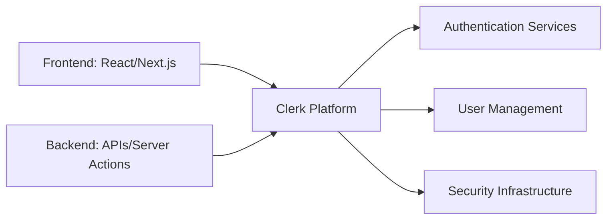

# Student Notes: Mastering Clerk Authentication for Modern Web Applications

## A Comprehensive Reference Guide for the Complete Series

---

## About These Notes

These student notes are designed to be your companion throughout the "Mastering Clerk Authentication for Modern Web Applications" series. They provide:
- 📝 **Key concepts** summarized from each part
- 💡 **Code snippets** for quick reference
- 🔑 **Important commands** and configurations
- ❓ **Common pitfalls** to avoid
- 📋 **Checklists** to track your progress

**How to Use These Notes:**
- Review before starting each part to preview key concepts
- Use as a reference during hands-on coding
- Review after completing each part to reinforce learning
- Keep handy for quick syntax lookups

---

## Table of Contents

1. [Part 1: Foundations of Modern Authentication](#part-1-foundations-of-modern-authentication)
2. [Part 2: Server-Side Security](#part-2-server-side-security)
3. [Part 3: Multi-Tenant SaaS Architecture](#part-3-multi-tenant-saas-architecture)
4. [Part 4: Extending Clerk](#part-4-extending-clerk)
5. [Part 5: React 19 & Next.js 16](#part-5-react-19--nextjs-16)
6. [Appendices](#appendices)
7. [Quick Reference](#quick-reference)

---

## Part 1: Foundations of Modern Authentication

### Key Concepts

#### Authentication vs Authorization
| Term | Definition | Example |
|------|------------|---------|
| **Authentication** | Verifying who someone is | Signing in with email/password |
| **Authorization** | Determining what someone can do | Checking if user is an admin |

#### The Authentication Paradigm Shift

**Traditional (Session-Based):**
```
Browser → Server → Session Store (Database/Redis)
Cookie with Session ID → Look up session → Process request
```
- ❌ Every request needs database lookup
- ❌ Hard to scale horizontally
- ❌ Single point of failure

**Modern (Token-Based - JWT):**
```
Browser → Clerk → Issues Signed JWT → Validates signature
```
- ✅ Stateless, no server-side storage
- ✅ Self-contained identity
- ✅ Performance, no database lookups
- ✅ Cryptographic signatures

#### Clerk's Architecture



### Key Commands

#### Installation
```bash
# Create Next.js project
npx create-next-app@latest my-app --typescript --tailwind --app

# Install Clerk
npm install @clerk/nextjs

# Install with specific versions
npm install @clerk/nextjs@latest next@latest react@latest
```

#### Environment Variables
```env
# .env.local - NEVER commit this file!
NEXT_PUBLIC_CLERK_PUBLISHABLE_KEY=pk_test_xxxxxx
CLERK_SECRET_KEY=sk_test_xxxxxx
```

#### ClerkProvider Setup
```tsx
// app/layout.tsx
import { ClerkProvider } from "@clerk/nextjs";

export default function RootLayout({ children }) {
  return (
    <ClerkProvider>
      <html lang="en">
        <body>{children}</body>
      </html>
    </ClerkProvider>
  );
}
```

#### Middleware
```tsx
// middleware.ts
import { clerkMiddleware, createRouteMatcher } from "@clerk/nextjs/server";

const isProtectedRoute = createRouteMatcher([
  "/dashboard(.*)",
  "/profile(.*)",
]);

export default clerkMiddleware((auth, req) => {
  if (isProtectedRoute(req)) {
    auth().protect();
  }
});

export const config = {
  matcher: ["/((?!_next|[^?]*\\.(?:html?|css|js(?!on))).*)"],
};
```

#### Authentication Pages
```tsx
// app/sign-in/[[...sign-in]]/page.tsx
import { SignIn } from "@clerk/nextjs";

export default function SignInPage() {
  return <SignIn afterSignInUrl="/dashboard" />;
}

// app/sign-up/[[...sign-up]]/page.tsx
import { SignUp } from "@clerk/nextjs";

export default function SignUpPage() {
  return <SignUp afterSignUpUrl="/dashboard" />;
}
```

#### Conditional Rendering
```tsx
import { SignedIn, SignedOut, UserButton } from "@clerk/nextjs";

export function Navigation() {
  return (
    <nav>
      <SignedOut>
        <SignInButton />
      </SignedOut>
      <SignedIn>
        <UserButton afterSignOutUrl="/" />
        <Link href="/dashboard">Dashboard</Link>
      </SignedIn>
    </nav>
  );
}
```

#### Protected Server Component
```tsx
// app/dashboard/page.tsx
import { auth, currentUser } from "@clerk/nextjs/server";
import { redirect } from "next/navigation";

export default async function DashboardPage() {
  const { userId, sessionId, orgId } = await auth();
  
  if (!userId) {
    redirect("/sign-in");
  }

  const user = await currentUser();
  
  return (
    <div>
      <h1>Welcome, {user?.fullName}!</h1>
      <p>User ID: {userId}</p>
      <p>Session ID: {sessionId}</p>
      {orgId && <p>Organization ID: {orgId}</p>}
    </div>
  );
}
```

### Common Pitfalls

| Pitfall | Solution |
|---------|----------|
| ❌ `auth()` returns null in Server Components | Use `await auth()` (don't forget `await`) |
| ❌ Secret key exposed in client code | Never use `NEXT_PUBLIC_` with `CLERK_SECRET_KEY` |
| ❌ Redirect loops | Check `afterSignInUrl` and middleware configuration |
| ❌ Social login not working | Verify OAuth credentials and redirect URIs |

### 📋 Part 1 Checklist

- [ ] Create Clerk account and application
- [ ] Configure authentication providers (Google, GitHub)
- [ ] Set up environment variables
- [ ] Install `@clerk/nextjs`
- [ ] Wrap app with `ClerkProvider`
- [ ] Create middleware for route protection
- [ ] Build sign-in and sign-up pages
- [ ] Create protected dashboard
- [ ] Build user profile page
- [ ] Customize Clerk component appearance

---

## Part 2: Server-Side Security

### Key Concepts

#### The Auth Object
```typescript
interface AuthObject {
  userId: string;
  sessionId: string;
  orgId?: string;
  orgRole?: string;
  orgPermissions?: string[];
  has(params: { role?: string; permission?: string }): boolean;
  protect(params?: { role?: string; permission?: string }): void;
  getToken(): Promise<string | null>;
}
```

#### Server Helpers
| Helper | Purpose | Use Case |
|--------|---------|----------|
| `auth()` | Get authentication context | `{ userId, sessionId, orgId }` |
| `currentUser()` | Fetch full user profile | User data, metadata, preferences |
| `getAuth()` | Auth data in middleware | Request-level auth |
| `verifyToken()` | Manual token validation | Custom auth logic |

#### JWT Structure
```
Header.Payload.Signature
```
**Payload Example:**
```json
{
  "sub": "user_456def",     // User ID
  "sid": "sess_123abc",     // Session ID
  "org": "org_789ghi",      // Organization ID
  "iat": 1700000000,        // Issued At
  "exp": 1700003600,        // Expiration
  "roles": ["admin"],       // User roles
  "permissions": ["read", "write"]  // Permissions
}
```

### Key Code Snippets

#### Custom Auth Helpers
```tsx
// lib/auth-helpers.ts
import { auth, currentUser } from "@clerk/nextjs/server";

export type AuthContext = {
  userId: string;
  sessionId: string;
  orgId: string | null;
  role: string | null;
  permissions: string[];
  isAuthenticated: boolean;
};

export async function getAuthContext(): Promise<AuthContext> {
  const { userId, sessionId, orgId } = await auth();
  
  if (!userId) {
    throw new Error("User not authenticated");
  }

  const user = await currentUser();
  const role = user?.publicMetadata?.role as string || "guest";
  const permissions = user?.publicMetadata?.permissions as string[] || [];
  
  return {
    userId,
    sessionId: sessionId || "",
    orgId: orgId || null,
    role,
    permissions,
    isAuthenticated: true,
  };
}

export async function requireRole(
  requiredRole: string,
  request: NextRequest
): Promise<AuthContext> {
  const authContext = await getAuthContext();
  
  if (authContext.role !== requiredRole) {
    throw new Error("Insufficient permissions");
  }
  
  return authContext;
}
```

#### Permission System
```tsx
// lib/permissions.ts
export const PERMISSIONS = {
  USER_READ: "user:read",
  USER_WRITE: "user:write",
  USER_DELETE: "user:delete",
  USER_LIST: "user:list",
  ADMIN_ACCESS: "admin:access",
};

export const ROLE_PERMISSIONS = {
  guest: [PERMISSIONS.USER_READ],
  user: [PERMISSIONS.USER_READ, PERMISSIONS.USER_WRITE],
  moderator: [PERMISSIONS.USER_READ, PERMISSIONS.USER_WRITE, PERMISSIONS.USER_LIST],
  admin: Object.values(PERMISSIONS),
};

export function hasPermission(userRole: string, permission: string): boolean {
  const userPermissions = ROLE_PERMISSIONS[userRole as keyof typeof ROLE_PERMISSIONS] || [];
  return userPermissions.includes(permission);
}
```

#### Protected API Route
```tsx
// app/api/auth/me/route.ts
import { NextResponse } from "next/server";
import { auth, currentUser } from "@clerk/nextjs/server";

export async function GET() {
  const { userId } = await auth();
  
  if (!userId) {
    return NextResponse.json(
      { error: "Not authenticated" },
      { status: 401 }
    );
  }
  
  const user = await currentUser();
  
  return NextResponse.json({
    id: user.id,
    email: user.emailAddresses[0]?.emailAddress,
    role: user.publicMetadata?.role || "guest",
  });
}
```

#### Server Action with Auth
```tsx
// app/actions/auth-actions.ts
"use server";

import { auth } from "@clerk/nextjs/server";
import { revalidatePath } from "next/cache";

export async function updateProfile(formData: FormData) {
  const { userId } = await auth();
  
  if (!userId) {
    return { error: "Unauthorized" };
  }
  
  // Update profile...
  revalidatePath("/profile");
  return { success: true };
}
```

### Common Pitfalls

| Pitfall | Solution |
|---------|----------|
| ❌ `auth()` returning null | Ensure middleware is running and user is signed in |
| ❌ Server Actions not working | Add `"use server"` directive and import correctly |
| ❌ API routes returning 401 | Check middleware configuration and cookie handling |
| ❌ Permission checks failing | Verify metadata is set correctly in Clerk Dashboard |

### 📋 Part 2 Checklist

- [ ] Create custom auth helpers (`getAuthContext`, `requireRole`)
- [ ] Build permission system (`PERMISSIONS`, `ROLE_PERMISSIONS`)
- [ ] Create protected API routes
- [ ] Build admin-only API endpoints
- [ ] Create Server Actions with authentication
- [ ] Build client component that uses Server Actions
- [ ] Implement error handling with proper status codes
- [ ] Add audit logging

---

## Part 3: Multi-Tenant SaaS Architecture

### Key Concepts

#### Organization Concepts

| Concept | Description |
|---------|-------------|
| **Organization** | A tenant/workspace for grouping users and resources |
| **Member** | A user who belongs to an organization |
| **Role** | Defines permissions within an organization |
| **Permission** | Specific actions a member can perform |
| **Invitation** | Pending request to join an organization |
| **Active Organization** | Currently selected organization |

#### Role Hierarchy
```
┌───────────┐
│  Admin    │  → Full access (manage members, settings)
└─────┬─────┘
      │
┌─────┴─────┐
│ Moderator │  → Content management (create, edit, delete)
└─────┬─────┘
      │
┌─────┴─────┐
│  Member   │  → Standard access (read, create content)
└─────┬─────┘
      │
┌─────┴─────┐
│  Guest    │  → Read-only access
└───────────┘
```

### Key Code Snippets

#### Organization Helpers
```tsx
// lib/org-helpers.ts
import { clerkClient } from "@clerk/nextjs/server";

export async function createOrganization(
  userId: string,
  name: string,
  slug: string,
  metadata?: Record<string, unknown>
) {
  return await clerkClient().organizations.createOrganization({
    name,
    slug,
    createdBy: userId,
    publicMetadata: metadata || {},
  });
}

export async function inviteUserToOrganization(
  orgId: string,
  email: string,
  role: string,
  inviterUserId: string
) {
  return await clerkClient().organizations.createOrganizationInvitation({
    organizationId: orgId,
    emailAddress: email,
    role,
    inviterUserId,
  });
}

export async function updateMemberRole(
  orgId: string,
  userId: string,
  role: string
) {
  return await clerkClient().organizations.updateOrganizationMembership({
    organizationId: orgId,
    userId,
    role,
  });
}
```

#### Organization Selection
```tsx
// app/organization/select/page.tsx
import { auth, clerkClient } from "@clerk/nextjs/server";

export default async function OrganizationSelectPage() {
  const { userId } = await auth();
  
  const memberships = await clerkClient().organizations.getOrganizationMembershipList({
    userId,
  });
  
  const organizations = memberships.data.map(m => ({
    id: m.organization.id,
    name: m.organization.name,
    slug: m.organization.slug,
    role: m.role,
  }));
  
  // Auto-redirect if only one organization
  if (organizations.length === 1) {
    redirect(`/organization/${organizations[0].id}`);
  }
  
  return (
    <div>
      {organizations.map((org) => (
        <Link key={org.id} href={`/organization/${org.id}`}>
          {org.name} ({org.role})
        </Link>
      ))}
    </div>
  );
}
```

#### Organization Layout
```tsx
// app/organization/[orgId]/layout.tsx
import { OrganizationSwitcher, UserButton } from "@clerk/nextjs";

export default async function OrganizationLayout({ children, params }) {
  const { userId } = await auth();
  
  // Check membership
  const memberships = await clerkClient().organizations.getOrganizationMembershipList({
    organizationId: params.orgId,
    userId,
  });
  
  if (memberships.data.length === 0) {
    redirect("/organization/select");
  }
  
  return (
    <div>
      <header>
        <OrganizationSwitcher afterSelectOrganizationUrl="/organization/select" />
        <UserButton afterSignOutUrl="/" />
      </header>
      <nav>
        <Link href={`/organization/${params.orgId}`}>Dashboard</Link>
        <Link href={`/organization/${params.orgId}/members`}>Members</Link>
        <Link href={`/organization/${params.orgId}/settings`}>Settings</Link>
      </nav>
      <main>{children}</main>
    </div>
  );
}
```

### Data Isolation - The `orgId` Filter
```tsx
// ✅ Secure - filters by organization
const projects = await prisma.project.findMany({
  where: {
    organizationId: orgId,  // Only return projects for active org
  },
});

// ❌ Insecure - could leak data across tenants
const projects = await prisma.project.findMany(); // Returns ALL projects
```

### Common Pitfalls

| Pitfall | Solution |
|---------|----------|
| ❌ Organization not showing in switcher | Verify membership in Clerk Dashboard |
| ❌ Invitation emails not sending | Check email configuration in Clerk Dashboard |
| ❌ Cross-tenant data leakage | Always filter queries by `orgId` |
| ❌ User can't create org | Check "Allow Users to Create Organizations" setting |

### 📋 Part 3 Checklist

- [ ] Enable Organizations in Clerk Dashboard
- [ ] Create custom roles (Admin, Moderator, Member, Guest)
- [ ] Build organization helpers (`createOrganization`, `inviteUserToOrganization`)
- [ ] Create organization selection page
- [ ] Build organization creation page
- [ ] Create organization layout with switcher
- [ ] Build member management page
- [ ] Create invite member form
- [ ] Build member list with role management
- [ ] Implement data isolation with `orgId` filtering

---

## Part 4: Extending Clerk

### Key Concepts

#### Metadata Types

| Type | Accessibility | Use Case | Example |
|------|---------------|----------|---------|
| **Public** | Readable by anyone | User preferences, public profile | `{ "theme": "dark" }` |
| **Private** | Server-side only | Payment IDs, internal notes | `{ "stripe_id": "cus_123" }` |
| **Unsafe** | Readable/writable by client | Temporary UI state | `{ "last_action": "viewed" }` |

#### Webhook Event Types

| Event | When It Fires |
|-------|---------------|
| `user.created` | After successful sign-up |
| `user.updated` | Profile updates, metadata changes |
| `user.deleted` | Account deletion |
| `session.created` | After successful authentication |
| `session.ended` | Sign-out, session expiry |
| `user.organization.created` | Organization creation |
| `user.organization.updated` | Role changes, membership updates |
| `user.organization.deleted` | Membership removal |

### Key Code Snippets

#### Prisma Schema
```prisma
// prisma/schema.prisma
model User {
  id            String   @id @default(cuid())
  clerkId       String   @unique @map("clerk_id")
  email         String   @unique
  name          String?
  role          String   @default("guest")
  publicMetadata  Json?    @map("public_metadata")
  privateMetadata Json?    @map("private_metadata")
  preferences    Json?    @default("{}")
  organizationId String?  @map("organization_id")
  syncedAt       DateTime @default(now()) @map("synced_at")
  createdAt      DateTime @default(now()) @map("created_at")
  updatedAt      DateTime @updatedAt @map("updated_at")
  
  @@map("users")
  @@index([clerkId])
  @@index([organizationId])
}
```

#### User Synchronization
```tsx
// lib/sync.ts
import prisma from "@/lib/db";

export async function syncUserWithDatabase(clerkUser: User) {
  const email = clerkUser.emailAddresses[0]?.emailAddress || "";
  const name = clerkUser.fullName || clerkUser.username || email;
  
  return await prisma.user.upsert({
    where: { clerkId: clerkUser.id },
    update: {
      email,
      name,
      role: (clerkUser.publicMetadata?.role as string) || "guest",
      publicMetadata: clerkUser.publicMetadata as any,
      syncedAt: new Date(),
    },
    create: {
      clerkId: clerkUser.id,
      email,
      name,
      role: (clerkUser.publicMetadata?.role as string) || "guest",
      publicMetadata: clerkUser.publicMetadata as any,
      syncedAt: new Date(),
    },
  });
}
```

#### Webhook Verification
```tsx
// lib/webhook-verify.ts
import { Webhook } from "svix";

export async function verifyWebhookRequest(
  request: NextRequest,
  secret: string
): Promise<unknown> {
  const payload = await request.text();
  
  const headers = {
    "svix-id": request.headers.get("svix-id") || "",
    "svix-timestamp": request.headers.get("svix-timestamp") || "",
    "svix-signature": request.headers.get("svix-signature") || "",
  };
  
  const wh = new Webhook(secret);
  return wh.verify(payload, headers);
}
```

#### Webhook Endpoint
```tsx
// app/api/webhooks/clerk/route.ts
export async function POST(request: NextRequest) {
  try {
    const payload = await verifyWebhookRequest(
      request,
      process.env.CLERK_WEBHOOK_SECRET!
    );
    
    const { type, data } = payload as any;
    
    switch (type) {
      case "user.created":
      case "user.updated":
        await syncUserWithDatabase(data);
        break;
      case "user.deleted":
        await deleteUserFromDatabase(data.id);
        break;
    }
    
    return NextResponse.json({ success: true });
  } catch (error) {
    return NextResponse.json(
      { error: "Webhook processing failed" },
      { status: 500 }
    );
  }
}
```

### Headless Authentication
```tsx
// app/components/HeadlessSignIn.tsx
"use client";

import { useSignIn } from "@clerk/nextjs";

export function HeadlessSignIn() {
  const { signIn, setActive } = useSignIn();
  const [email, setEmail] = useState("");
  const [password, setPassword] = useState("");
  
  const handleSubmit = async (e: React.FormEvent) => {
    e.preventDefault();
    
    const result = await signIn.create({
      identifier: email,
      password,
    });
    
    if (result.status === "complete") {
      await setActive({ session: result.createdSessionId });
    }
  };
  
  return (
    <form onSubmit={handleSubmit}>
      <input
        type="email"
        value={email}
        onChange={(e) => setEmail(e.target.value)}
        placeholder="Email"
      />
      <input
        type="password"
        value={password}
        onChange={(e) => setPassword(e.target.value)}
        placeholder="Password"
      />
      <button type="submit">Sign In</button>
    </form>
  );
}
```

### Common Pitfalls

| Pitfall | Solution |
|---------|----------|
| ❌ Webhook signature verification fails | Check webhook secret matches Clerk Dashboard |
| ❌ Webhooks not firing | Verify endpoint URL is accessible (ngrok for local) |
| ❌ Duplicate webhook processing | Implement idempotency with event IDs |
| ❌ Database sync failing | Check connection pooling and transaction handling |

### 📋 Part 4 Checklist

- [ ] Set up Prisma with PostgreSQL
- [ ] Create database schema (User, Project, AuditLog, Session)
- [ ] Build user synchronization utilities
- [ ] Create webhook signature verification
- [ ] Build webhook endpoint
- [ ] Process webhook events (user.created, user.updated, user.deleted)
- [ ] Create metadata management API
- [ ] Build user preferences form
- [ ] Create headless authentication interface

---

## Part 5: React 19 & Next.js 16

### Key Concepts

#### React 19 Features

| Feature | Description | Authentication Impact |
|---------|-------------|----------------------|
| **React Compiler** | Automatic memoization | Reduces re-renders of auth components |
| **Server Components** | Server-only components | Auth checks before HTML |
| **Server Actions** | Server mutations | Secure database operations |
| **`cache()`** | Deduplicate async calls | Prevents duplicate auth checks |
| **`use` Hook** | Promise unwrapping | Clean async auth state |

#### Next.js 16 Features
- `clerkMiddleware()` - Dedicated Clerk middleware
- Parallel Routes - Render auth states simultaneously
- Intercepting Routes - Modal-based auth flows
- Server Components Streaming - Progressive rendering
- Server Actions Integration - Type-safe mutations

### Key Code Snippets

#### Cached Auth Helpers
```tsx
// lib/auth-helpers.ts
import { cache } from "react";
import { auth, currentUser } from "@clerk/nextjs/server";

// ✅ Cached - prevents duplicate calls
export const getAuth = cache(async () => {
  const { userId, sessionId, orgId } = await auth();
  return { userId, sessionId, orgId };
});

// ✅ Cached - prevents duplicate API calls
export const getCurrentUser = cache(async () => {
  const user = await currentUser();
  return user;
});

// ✅ Protect - redirects to sign-in
export async function protect() {
  const { userId } = await getAuth();
  if (!userId) redirect("/sign-in");
  return userId;
}
```

#### Server Action with Zod Validation
```tsx
// app/actions/projects.ts
"use server";

import { z } from "zod";
import { revalidatePath } from "next/cache";
import { protect, getOrgId } from "@/lib/auth-helpers";

const CreateProjectSchema = z.object({
  name: z.string().min(1).max(100),
  description: z.string().max(500).optional(),
  status: z.enum(["active", "archived", "draft"]).default("active"),
});

export async function createProject(data: CreateProjectData) {
  try {
    const userId = await protect();
    const validatedData = CreateProjectSchema.parse(data);
    const orgId = await getOrgId();
    
    const project = await prisma.project.create({
      data: {
        name: validatedData.name,
        description: validatedData.description || "",
        status: validatedData.status,
        organizationId: orgId || "default",
        ownerId: userId,
      },
    });
    
    revalidatePath("/dashboard");
    return { success: true, data: project };
  } catch (error) {
    if (error instanceof z.ZodError) {
      return { success: false, error: "Validation failed", details: error.errors };
    }
    return { success: false, error: "Failed to create project" };
  }
}
```

#### Server Component with Suspense
```tsx
// app/dashboard/page.tsx
import { Suspense } from "react";
import { getProjects } from "@/app/actions/projects";
import { getEnhancedUser, protect } from "@/lib/auth-helpers";

export default async function DashboardPage() {
  const userId = await protect();
  const user = await getEnhancedUser();
  const projectsResult = await getProjects();
  
  return (
    <div>
      <h1>Welcome, {user.name}!</h1>
      
      <Suspense fallback={<div>Loading...</div>}>
        {projectsResult.success ? (
          <ProjectList projects={projectsResult.data} />
        ) : (
          <p>No projects yet</p>
        )}
      </Suspense>
    </div>
  );
}
```

#### Client Component with useTransition
```tsx
// app/components/ProjectList.tsx
"use client";

import { useState, useTransition } from "react";
import { deleteProject } from "@/app/actions/projects";

export function ProjectList({ projects }) {
  const [isPending, startTransition] = useTransition();
  const [localProjects, setLocalProjects] = useState(projects);
  
  const handleDelete = (projectId: string) => {
    startTransition(async () => {
      const result = await deleteProject(projectId);
      if (result.success) {
        setLocalProjects(prev => prev.filter(p => p.id !== projectId));
      }
    });
  };
  
  return (
    <div>
      {localProjects.map((project) => (
        <div key={project.id}>
          <h3>{project.name}</h3>
          <button
            onClick={() => handleDelete(project.id)}
            disabled={isPending}
          >
            Delete
          </button>
        </div>
      ))}
      {isPending && <p>Updating...</p>}
    </div>
  );
}
```

### Performance Optimization

#### Cache Strategies
```tsx
// ✅ Use cache() for auth checks
export const getAuth = cache(async () => {
  return await auth();
});

// ✅ Use unstable_cache for database queries
export const getCachedProjects = unstable_cache(
  async (orgId: string) => {
    return await prisma.project.findMany({
      where: { organizationId: orgId },
    });
  },
  ["projects"],
  { revalidate: 60 }
);
```

#### Edge Runtime
```tsx
// middleware.ts - Deployed to Edge Network
export const runtime = "edge";
```

### Common Pitfalls

| Pitfall | Solution |
|---------|----------|
| ❌ `auth()` not cached | Use `cache()` to prevent duplicate calls |
| ❌ Server Actions not working | Add `"use server"` directive |
| ❌ Suspense not showing loading states | Add `fallback` prop to Suspense |
| ❌ useTransition causing UI lag | Use startTransition for async operations |

### 📋 Part 5 Checklist

- [ ] Update to React 19 and Next.js 16
- [ ] Create enhanced middleware with Clerk
- [ ] Build cached auth helpers with `cache()`
- [ ] Create Server Actions with Zod validation
- [ ] Build Server Components with authentication
- [ ] Create client components with `useTransition`
- [ ] Implement Suspense and streaming patterns
- [ ] Add error boundaries
- [ ] Build optimized API routes with caching
- [ ] Configure Next.js for performance

---

## Appendices

### Appendix A: Authentication Deep Dive

#### JWT Structure
```
Header.Payload.Signature
```

**Header:**
```json
{
  "alg": "RS256",
  "typ": "JWT",
  "kid": "key_123abc"
}
```

**Payload:**
```json
{
  "sub": "user_456def",     // User ID
  "sid": "sess_789ghi",     // Session ID
  "org": "org_012jkl",      // Organization ID
  "iat": 1700000000,        // Issued At
  "exp": 1700000600,        // Expiration (60 seconds)
  "roles": ["admin"],       // User roles
  "permissions": ["read", "write"]  // Permissions
}
```

**Signature:**
```
HMACSHA256(
  base64UrlEncode(header) + "." + base64UrlEncode(payload),
  secret
)
```

#### Security Headers
```tsx
// In middleware.ts
Content-Security-Policy: default-src 'self'; script-src 'self' https://clerk.accounts.dev;
X-Content-Type-Options: nosniff
X-Frame-Options: DENY
X-XSS-Protection: 1; mode=block
Strict-Transport-Security: max-age=31536000; includeSubDomains; preload
```

### Appendix B: Production Deployment

#### Environment Variables
```bash
# Development
NEXT_PUBLIC_CLERK_PUBLISHABLE_KEY=pk_test_xxxxxx
CLERK_SECRET_KEY=sk_test_xxxxxx
CLERK_WEBHOOK_SECRET=whsec_test_xxxxxx
DATABASE_URL=postgresql://localhost:5432/dev_db

# Production
NEXT_PUBLIC_CLERK_PUBLISHABLE_KEY=pk_live_xxxxxx
CLERK_SECRET_KEY=sk_live_xxxxxx
CLERK_WEBHOOK_SECRET=whsec_xxxxxx
DATABASE_URL=postgresql://production:5432/prod_db
```

#### Vercel Deployment
```bash
# Install Vercel CLI
npm i -g vercel

# Deploy
vercel --prod

# Environment variables set in Vercel Dashboard
```

### Appendix C: Quick Reference

#### Common Commands
```bash
# Install Clerk
npm install @clerk/nextjs

# Run Prisma migrations
npx prisma migrate dev --name init

# Generate Prisma client
npx prisma generate

# Start development server
npm run dev

# Build for production
npm run build
```

#### Error Codes

| Error Code | Description | Solution |
|------------|-------------|----------|
| `UNAUTHORIZED` | Authentication required | Ensure user is signed in |
| `FORBIDDEN` | Insufficient permissions | Check user role/permissions |
| `INVALID_TOKEN` | Invalid JWT token | Refresh the token |
| `EXPIRED_TOKEN` | Token has expired | Refresh the token |
| `SESSION_REVOKED` | Session was revoked | User must sign in again |
| `INVALID_PUBLISHABLE_KEY` | Invalid publishable key | Verify environment variable |
| `MISSING_SECRET_KEY` | Secret key not set | Set CLERK_SECRET_KEY |

#### Useful Snippets

**Check Authentication in Server Component:**
```tsx
const { userId } = await auth();
if (!userId) redirect("/sign-in");
```

**Check Role in Server Action:**
```tsx
const { userId } = await auth();
if (!userId) return { error: "Unauthorized" };
const user = await currentUser();
const role = user.publicMetadata?.role;
if (role !== "admin") return { error: "Insufficient permissions" };
```

**Get Organization ID:**
```tsx
const { orgId } = await auth();
```

**Update User Metadata:**
```tsx
await clerkClient().users.updateUser(userId, {
  publicMetadata: { theme: "dark" },
});
```

---

## Quick Reference Cards

### Authentication Flow
```
1. User visits app → ClerkJS loads → Checks cookie
2. If cookie exists → User authenticated → Show app
3. If no cookie → User unauthenticated → Show sign-in
4. User signs in → Clerk creates session → Sets cookie
5. User navigates → Middleware checks cookie → Protects routes
6. Token expires → Clerk auto-refreshes → Seamless session
```

### Clerk Component Hierarchy
```
ClerkProvider
  ├── SignedIn
  │   ├── UserButton
  │   └── [Authenticated Content]
  ├── SignedOut
  │   ├── SignInButton
  │   └── [Public Content]
  └── [Content]
```

### Database Sync Flow
```
Clerk Event (user.created) → Webhook → Your Server → Database
```

### Server Action Pattern
```
Client → Server Action → auth() check → Business Logic → revalidatePath → Return
```

---

## Final Notes

### Remember These Key Principles

1. **Always verify authentication** on the server side
2. **Filter queries by `orgId`** for multi-tenant isolation
3. **Use `cache()`** to prevent duplicate auth checks
4. **Validate input** with Zod or similar
5. **Log security events** for audit compliance
6. **Keep secrets secure** — never expose secret keys
7. **Test all authentication flows** thoroughly

### Helpful Resources

- [Clerk Documentation](https://clerk.com/docs)
- [Clerk API Reference](https://clerk.com/docs/reference/backend-api)
- [Next.js Documentation](https://nextjs.org/docs)
- [React Documentation](https://react.dev/)
- [Clerk Discord](https://discord.com/invite/clerk)

---

*Keep these notes handy as you build with Clerk!* 🚀
