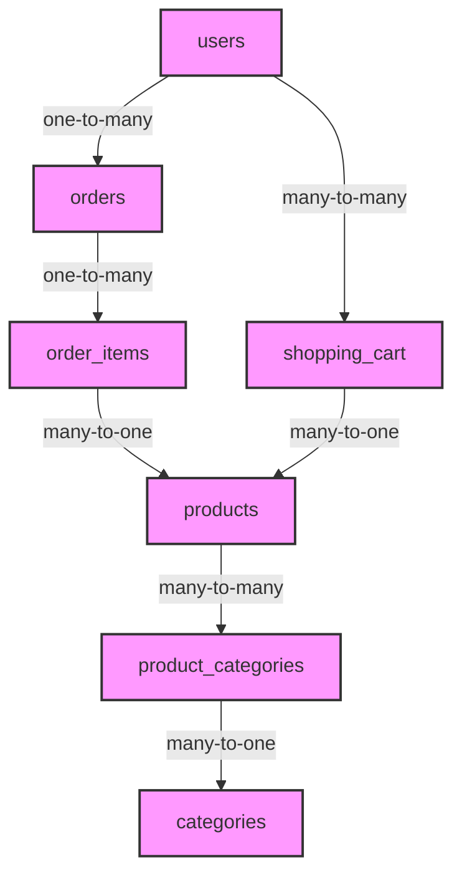

# Part 0: Introduction – Your Journey from SQL Beginner to Schema Hero

Welcome to **Hands-On PostgreSQL: From Zero to Schema Hero**. Before we write a single line of SQL, let's map out exactly where we're going, what we're building, and why this approach will transform you from a database dabbler into a confident PostgreSQL practitioner.

## What This Series Is (And Isn't)

**This is a hands-on, code-first tutorial series.** We believe the best way to learn database development is by building something real, making mistakes, and seeing results immediately. Every concept we cover will be immediately applied to our growing e-commerce database.

**This is not a theoretical database textbook.** While we'll explain core concepts thoroughly, we won't get bogged down in academic discussions about normalization forms or database theory. Our focus is on practical, working SQL that you can use in real applications today.

## Our Ultimate Architecture: The E-Commerce Database

Throughout this six-part series, we'll build a production-ready e-commerce database step by step. Here's what our final architecture will look like:



### Tables We'll Build

| Table | Description | Key Features |
|-------|-------------|--------------|
| **users** | Customer accounts | UUID primary keys, email validation, timestamps |
| **products** | Product catalog | JSONB metadata, price validation, inventory tracking |
| **categories** | Product categorization | Hierarchical structure, many-to-many relationships |
| **product_categories** | Junction table | Connects products to multiple categories |
| **orders** | Purchase orders | Status tracking, timestamps, total calculations |
| **order_items** | Line items within orders | Quantity, price snapshot, product references |
| **shopping_cart** | Active carts | Many-to-many relationship with products |

### What You'll Be Able to Do by the End

By the time you complete this series, you'll have built a fully functional e-commerce database that can:

- **Handle customer data** with strict validation and security constraints
- **Manage product inventory** with real-time stock tracking
- **Process complex orders** with atomic transactions (ensuring inventory and orders stay in sync)
- **Generate business intelligence** with advanced aggregations and window functions
- **Optimize performance** with strategic indexing
- **Store semi-structured data** using JSONB for flexible product attributes

## Who This Series Is For

### Ideal Readers

- **Junior developers** who've written basic `SELECT` queries but want to understand the full power of PostgreSQL
- **Full-stack developers** who want to master the database layer of their applications
- **Data analysts** who need to write more sophisticated queries and understand database design
- **Self-taught programmers** looking to fill knowledge gaps about relational databases
- **Students** who've taken database theory courses but want practical, hands-on experience

### Prerequisites

- **Basic SQL knowledge**: You should understand what `SELECT * FROM table` does
- **Terminal/command line familiarity**: You'll need to run `psql` commands
- **Python or Node.js experience** (optional): We'll use a simple Python script for testing, but you can use any language
- **A computer with admin rights**: For installing PostgreSQL

## Our Teaching Philosophy: Learn by Building

### The Four-Step Method

Every technical step in this series follows this proven pattern:

1. **The Target**: We state exactly what we're building right now
2. **The Concept**: We explain the underlying idea with simple analogies
3. **The Implementation**: You write complete, working SQL code
4. **The Verification**: You test that it works before moving on

### Why This Works

Imagine learning to cook. You could read a book about knife techniques, or you could chop vegetables while someone guides you. We choose the second approach. Every concept we introduce is immediately applied to our growing e-commerce database, so you see the practical impact of every decision.

### Code-Heavy, Never Abstract

This series contains **zero placeholders**. When we say "write the `users` table," we provide the complete `CREATE TABLE` statement. When we show a query, it's the exact query you need to run. Every `-- implement the rest here` or `// TODO` you might see elsewhere is absent here.

## Series Roadmap

### Part 1: First Steps & The SQL Foundation
**What We Build**: The `products` table with basic CRUD operations
**Key Concepts**: Installation, `INSERT`, `SELECT`, `UPDATE`, `DELETE`, filtering with `WHERE`
**Project Milestone**: You can create, read, update, and delete products from your catalog

### Part 2: Data Types & Constraints (Building Bulletproof Tables)
**What We Build**: The `users` table with strict validation
**Key Concepts**: PostgreSQL data types, constraints (`NOT NULL`, `UNIQUE`, `CHECK`), primary keys
**Project Milestone**: You have a validated user system that rejects bad data

### Part 3: Relationships & Relational Queries (Joins & Keys)
**What We Build**: `orders` and `order_items` with foreign keys
**Key Concepts**: Foreign keys, joins (`INNER`, `LEFT`, `RIGHT`, `FULL`), cascade actions
**Project Milestone**: You can query complete customer order histories

### Part 4: Aggregations, Grouping, & Subqueries
**What We Build**: Sales reports and business analytics
**Key Concepts**: Aggregate functions, `GROUP BY`, `HAVING`, subqueries, `CASE WHEN`
**Project Milestone**: You can generate revenue reports and identify top customers

### Part 5: Modern Postgres Power Tools (JSONB & Window Functions)
**What We Build**: Product metadata and customer rankings
**Key Concepts**: JSONB storage and queries, window functions, ranking calculations
**Project Milestone**: You have flexible product attributes and customer leaderboards

### Part 6: Performance, Indexes, & Transactions
**What We Build**: Optimized queries and atomic checkout
**Key Concepts**: `EXPLAIN ANALYZE`, indexes, transactions (`BEGIN`, `COMMIT`, `ROLLBACK`)
**Project Milestone**: Your database is production-ready with optimized performance

## Your Development Environment

### Installation Overview

We'll install PostgreSQL and set up a dedicated database for our e-commerce application. Here's what you need:

- **PostgreSQL 14+** (or 16+ recommended)
- **psql** (the PostgreSQL command-line client)
- **Optional**: pgAdmin, DBeaver, or another GUI for visual exploration

### Directory Structure

We'll keep all our SQL files organized like this:

```
postgres-ecommerce/
├── migrations/
│   ├── 01_products.sql
│   ├── 02_users.sql
│   ├── 03_orders.sql
│   └── ...
├── queries/
│   ├── analysis/
│   ├── reports/
│   └── tests/
├── seed_data/
│   ├── products.csv
│   └── users.csv
└── README.md
```

### How We'll Test

Each step includes verification instructions. You'll run commands like:

```bash
# Example: After creating a table, we'll confirm it exists
psql -d ecommerce -c "\dt"

# Example: After inserting data, we'll query it
psql -d ecommerce -c "SELECT * FROM products;"
```

## Getting Started Checklist

Before we begin Part 1, please ensure you have:

- [ ] A computer with internet access
- [ ] Admin/installer permissions for your system
- [ ] 15-30 minutes per section (total series time: ~6-8 hours)
- [ ] A text editor or IDE (VS Code recommended with SQL extensions)

## What Makes This Series Different

### 1. We Build the Same Project Throughout

Instead of throwing away your work after each lesson, you'll build on top of your existing database. By Part 6, you'll have a complete, cohesive application.

### 2. We Show You Complete Code

No shortcuts, no cop-outs. Every `CREATE TABLE` is complete. Every `SELECT` is complete. You can copy and paste everything (but we encourage you to type it out for muscle memory).

### 3. We Test Every Step

You'll never be left wondering, "Did that work?" Each step includes clear verification instructions so you know exactly when you've succeeded.

### 4. We Explain the "Why"

We don't just show you how to write SQL; we explain why certain approaches work better than others. You'll understand the reasoning behind every decision.

## A Note About the Real-World Analogy

Throughout this series, we'll use the e-commerce domain as our teaching vehicle because it's familiar, relatable, and contains all the complexity you need to learn PostgreSQL. Every concept we cover—from basic CRUD to complex window functions—has a direct application in an online store.

Here's how our analogy maps to database concepts:

| E-Commerce Concept | Database Concept |
|--------------------|------------------|
| Product catalog | Tables with `SELECT` queries |
| Inventory tracking | `UPDATE` with transaction safety |
| Customer validation | Constraints (`CHECK`, `UNIQUE`) |
| Order processing | Multi-table joins |
| Sales reports | Aggregations and `GROUP BY` |
| Customer rankings | Window functions |
| Performance optimization | Indexes and `EXPLAIN` |

## Let's Get Started!

You're now ready to begin your journey from SQL beginner to Schema Hero. The database we'll build is waiting, and every concept you learn will be immediately applicable to real-world projects.

**In Part 1**, we'll:
1. Install PostgreSQL
2. Create our first database
3. Build the `products` table
4. Write our first CRUD operations

No more theory—let's write some SQL!
