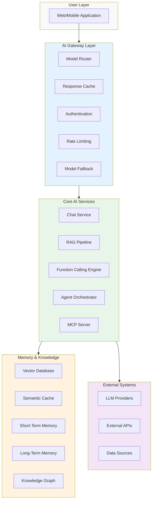
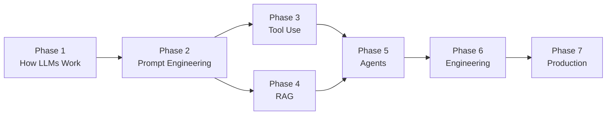

# Part 0: Introduction

**Welcome to the AI Tutorial Series: Developer Edition**

*Your complete, code-first roadmap to building modern AI applications—from understanding how LLMs work to deploying scalable agentic systems in production.*

---

## Welcome Statement

Hello, developer. This is not a theoretical AI course. This is a hands-on engineering journey that will teach you how to build real-world AI applications, one line of code at a time.

Over the next 24 modules and 8 capstone projects, you'll move from "I know what an LLM is" to "I can design, implement, and deploy production-grade AI systems." By the time you type the final command in this series, you'll have built:

- A fully functional RAG system
- Autonomous multi-agent workflows
- Secure, observable, and resilient AI services
- A complete enterprise AI platform ready for deployment

But we're getting ahead of ourselves.

Let's start by understanding what this series actually is, who it's for, and—most importantly—what you'll be able to do when you finish it.

---

## The Problem This Series Solves

If you're like most developers learning AI today, you've likely experienced this pattern:

1. You read an exciting blog post about a new LLM capability.
2. You copy a 50-line code snippet from a GitHub repo.
3. You run it, it works, you feel a dopamine hit.
4. You try to build something more complex than a quick demo.
5. You hit a wall of confusion about tokens, context windows, or function calling.
6. You realize you've built a "demo" but not a "product."
7. You feel stuck between "beginner tutorials" and "research papers."

**This series bridges that gap.**

It's designed for developers who want to understand what's happening under the hood *while* building real, working applications. Every concept is taught through implementation. Every module ends with working code you can test. Every architecture decision is explained with an analogy that makes sense to engineers.

---

## The Ultimate Architecture You'll Build

Before we write a single line of code, let's look at what you're working toward. By the end of this series, you'll be able to build systems that follow this architectural pattern:



**Here's what each layer does, in plain terms:**

- **User Layer**: The frontend applications (web, mobile, CLI) that users interact with.
- **AI Gateway Layer**: Think of this as a "traffic cop" for AI requests—it routes to the right model, caches responses, enforces rate limits, and handles failures gracefully.
- **Core AI Services**: This is where the "magic" happens—the chat engine, the RAG pipeline, the function calling system, and the agent orchestrator that coordinates everything.
- **Memory & Knowledge**: This layer handles both short-term memory (conversation context) and long-term memory (vector databases, knowledge graphs).
- **External Systems**: All the external services—LLM APIs, databases, third-party tools—that your AI system talks to.

**Every single module in this series builds toward making this architecture real.**

---

## Target Audience

This series is designed for:

### Primary Audience

**Software Engineers** with 1-5 years of experience who:
- Can write Python or JavaScript (we'll use Python as the primary language, but the principles apply to any stack)
- Have built and deployed at least one web application
- Understand REST APIs, JSON, and basic command-line operations
- Want to move from "AI user" to "AI builder"

### Secondary Audience

**Technical Product Managers** and **Engineering Managers** who:
- Need to understand the technical depth of AI systems to guide development teams
- Want to evaluate AI technologies and architectures with clarity
- Need to estimate effort and understand tradeoffs in AI system design

### What You Need to Know

| Prerequisite | Level Required |
|--------------|----------------|
| **Python** | Intermediate (functions, classes, async/await) |
| **Command Line** | Comfortable with terminal, environment variables |
| **Git** | Basic clone, commit, push |
| **HTTP/REST APIs** | Understand GET/POST, status codes, headers |
| **JSON** | Parse and construct JSON structures |
| **Database Basics** | Familiar with queries (SQL or NoSQL) |

### What You Do NOT Need to Know

- **Machine learning theory** - We'll explain what you need
- **Linear algebra** - Not required to use LLMs effectively
- **Neural network architecture** - We'll cover the high-level concepts
- **Cloud deployment expertise** - We'll handle deployment with Docker and Kubernetes

---

## What You'll Build: The Complete Hands-On Journey

This section gives you the full roadmap. Each module includes hands-on coding that builds toward the capstone projects.

### Phase 1: Understanding How LLMs Actually Work (Modules 1-4)

**Goal:** Remove the "AI magic" mindset. Understand what LLMs really do.

#### Module 1: Introduction to Generative AI

*The "Welcome to AI" module that grounds you in what we're building and why it matters.*

**What You'll Build:**
- A quick Jupyter notebook that calls your first LLM API
- A comparison script showing different model outputs

**Key Concepts:**
- Artificial Intelligence vs. Machine Learning vs. Deep Learning vs. Generative AI
- Evolution from NLP to Large Language Models
- Transformer architecture (the high-level picture)
- Model families: GPT, Claude, Gemini, Llama, Mistral, DeepSeek, Qwen
- How models are trained vs. how we use them

**Technical Scope:**
- Minimal code—this is conceptual setup
- Your first API call (OpenAI/Anthropic/Ollama)
- Understanding model cards and documentation

---

#### Module 2: Tokens & Embeddings

*Understanding how text becomes numbers that computers can process.*

**What You'll Build:**
- A token counter tool
- An embedding generator
- A semantic similarity visualizer
- A basic text search using embeddings

**Key Concepts:**
- Tokens are "chunks" of text
- Tokenization algorithms (BPE, SentencePiece)
- Token limits and what they mean for your app
- Embeddings as "meaning vectors"
- Cosine similarity as "semantic distance"

**Hands-On:**
```python
# You'll write code that does this:
from openai import OpenAI
client = OpenAI()
response = client.embeddings.create(
    model="text-embedding-3-small",
    input="The cat sat on the mat"
)
# Then you'll compare embeddings of similar/different texts
```

**What You'll Learn:**
- Why embeddings are the foundation of RAG
- How to think about text numerically
- Pricing implications of token usage

---

#### Module 3: How LLM Inference Works

*Peeking under the hood of text generation.*

**What You'll Build:**
- A text generator with adjustable temperature
- A probability visualizer showing next-token predictions
- An exploration of different sampling strategies

**Key Concepts:**
- Next-token prediction is the core mechanism
- Probability distributions over the vocabulary
- Temperature: the "creativity" dial
- Top-K: limiting candidate tokens
- Top-P (Nucleus Sampling): dynamic token selection
- Deterministic vs. random generation
- Why hallucinations happen

**Hands-On:**
```python
# You'll experiment with these parameters:
completion = client.chat.completions.create(
    model="gpt-4o-mini",
    messages=[{"role": "user", "content": "Tell me a joke"}],
    temperature=0.7,  # Try 0.0 vs 1.5
    top_p=0.9,        # Try 0.5 vs 1.0
    max_tokens=100
)
```

**What You'll Learn:**
- How to control randomness in AI outputs
- Why "temperature" isn't just a nice-to-have
- When to use deterministic vs. creative generation

---

#### Module 4: Context Windows & Memory

*Understanding the "short-term memory" of LLMs.*

**What You'll Build:**
- A simple chatbot with conversation history
- A context overflow detector
- A chat application that shows token usage

**Key Concepts:**
- Context windows as working memory
- Input tokens + output tokens = total token usage
- Attention mechanisms (simplified)
- What happens when you exceed the context window
- Long-context models and their limitations

**Hands-On:**
```python
# You'll build a basic chat loop:
messages = [{"role": "system", "content": "You are a helpful assistant."}]
while True:
    user_input = input("You: ")
    messages.append({"role": "user", "content": user_input})
    response = client.chat.completions.create(...)
    # You'll track token usage and see what happens as the chat grows
```

**What You'll Learn:**
- Why memory management matters in AI apps
- How to build chatbots that remember
- When to truncate or summarize conversation history

---

### Phase 2: Prompt Engineering & Model APIs (Modules 5-8)

**Goal:** Communicate with LLMs effectively and reliably.

#### Module 5: AI APIs

*Connecting your code to LLM providers.*

**What You'll Build:**
- A unified client that works with multiple providers
- A streaming response handler
- A rate limit manager

**Key Concepts:**
- API keys and authentication
- REST APIs for AI
- SDKs vs. raw HTTP requests
- Streaming responses (Server-Sent Events)
- Rate limits and cost optimization

**Providers You'll Use:**
- OpenAI (ChatGPT)
- Anthropic (Claude)
- Google (Gemini)
- Ollama (local models)
- OpenRouter (unified access)
- Azure OpenAI

**Hands-On:**
```python
# You'll build a multi-provider client:
class AIModelClient:
    def __init__(self, provider="openai"):
        self.client = self._initialize_client(provider)
    
    def generate(self, prompt, **kwargs):
        # Same interface for all providers
        return self.client.generate(prompt, **kwargs)

# You'll test the same prompt across different models
```

**What You'll Learn:**
- How to switch between LLM providers
- Streaming for better user experience
- Managing costs with rate limiting

---

#### Module 6: Prompt Engineering Fundamentals

*Writing prompts that consistently get good results.*

**What You'll Build:**
- A prompt template system
- A few-shot learning example
- A prompt optimizer with different strategies

**Key Concepts:**
- System prompts vs. user prompts
- Role prompting
- Chain-of-Thought (step-by-step reasoning)
- Few-shot vs. zero-shot prompting
- Self-consistency techniques
- Prompt template libraries

**Hands-On:**
```python
# You'll build a prompt template:
prompt_template = """
You are an expert {role}.
Your task is to {task}.
Instructions: {instructions}

Here is the context:
{context}

Question: {question}

Provide your answer in the following format:
{format}
"""
```

**What You'll Learn:**
- The difference between "good" and "bad" prompts
- How to structure prompts for reliability
- When to use system vs. user vs. assistant messages

---

#### Module 7: Structured Outputs

*Getting LLMs to produce data, not just text.*

**What You'll Build:**
- An email parser
- A resume parser
- An invoice extractor
- A product classifier with JSON output

**Key Concepts:**
- JSON mode
- Schema validation
- Typed outputs
- Function-safe responses
- Error handling in parsing

**Hands-On:**
```python
# You'll extract structured data from unstructured text:
class EmailParser:
    def parse(self, email_content):
        response = client.chat.completions.create(
            model="gpt-4o-mini",
            messages=[{"role": "user", "content": email_content}],
            response_format={ 
                "type": "json_schema",
                "json_schema": {
                    "name": "email_parse",
                    "schema": {
                        "type": "object",
                        "properties": {
                            "sender": {"type": "string"},
                            "subject": {"type": "string"},
                            "body": {"type": "string"},
                            "actions": {"type": "array", "items": {"type": "string"}}
                        }
                    }
                }
            }
        )
        return json.loads(response.choices[0].message.content)
```

**What You'll Learn:**
- How to get reliable JSON from LLMs
- Schema validation for production apps
- Building robust data pipelines with LLMs

---

#### Module 8: Multimodal AI

*Working with images, audio, and beyond.*

**What You'll Build:**
- An image understanding application
- A PDF processing pipeline
- A text-to-speech and speech-to-text system
- An image generation tool

**Key Concepts:**
- Vision models
- Image understanding
- OCR (Optical Character Recognition)
- PDF processing
- Audio transcription
- Text-to-speech
- Image generation

**Hands-On:**
```python
# You'll process multiple modalities:
class MultimodalProcessor:
    def process_image(self, image_path, prompt):
        # Use vision model to analyze image
        pass
    
    def process_audio(self, audio_path):
        # Transcribe audio
        pass
    
    def generate_image(self, prompt):
        # Generate image from text
        pass
```

**What You'll Learn:**
- Handling images, audio, and text in one application
- When to use specialized models vs. multimodal models
- Building multimodal pipelines

---

### Phase 3: AI Tool Use & Function Calling (Modules 9-11)

**Goal:** Enable LLMs to interact with software and external systems.

#### Module 9: Function Calling

*Allowing LLMs to call functions in your code.*

**What You'll Build:**
- A weather function
- A calculator function
- A currency converter
- A SQL query executor
- An email sender

**Key Concepts:**
- What function calling is and why it exists
- Tool definitions as JSON schemas
- Argument validation
- Tool selection
- Tool execution loop

**Hands-On:**
```python
# You'll define tools in this format:
tools = [
    {
        "type": "function",
        "function": {
            "name": "get_weather",
            "description": "Get current weather for a location",
            "parameters": {
                "type": "object",
                "properties": {
                    "location": {"type": "string"},
                    "unit": {"type": "string", "enum": ["celsius", "fahrenheit"]}
                },
                "required": ["location"]
            }
        }
    }
]

# Then the LLM will call your function:
if tool_calls:
    for tool_call in tool_calls:
        if tool_call.function.name == "get_weather":
            args = json.loads(tool_call.function.arguments)
            result = get_weather(args["location"], args["unit"])
```

**What You'll Learn:**
- How to extend LLMs with custom functionality
- Reliable tool calling patterns
- Handling tool call results in context

---

#### Module 10: Tool Orchestration

*Managing multiple tools in complex workflows.*

**What You'll Build:**
- A multi-tool assistant
- A sequential execution pipeline
- A parallel execution engine
- A tool with error recovery and retries

**Key Concepts:**
- Multiple tools in a single system
- Sequential vs. parallel execution
- Error recovery strategies
- Tool retries and timeouts
- Tool result validation

**Hands-On:**
```python
# You'll build a tool orchestrator:
class ToolOrchestrator:
    def __init__(self):
        self.tools = {}
        self.register_tool("weather", get_weather)
        self.register_tool("calculator", calculate)
        self.register_tool("currency", convert_currency)
    
    def execute(self, tool_calls):
        # Handle multiple tool calls in one request
        results = []
        for call in tool_calls:
            # Execute with retries and error handling
            result = self._execute_with_retry(call)
            results.append(result)
        return results
```

**What You'll Learn:**
- Building reliable multi-tool systems
- Handling errors gracefully
- Optimization through parallel execution

---

#### Module 11: Model Context Protocol (MCP)

*Standardizing AI-tool integration.*

**What You'll Build:**
- An MCP server exposing files
- An MCP server exposing database access
- An MCP server exposing a weather API
- An MCP server exposing internal company knowledge

**Key Concepts:**
- Why MCP exists (interoperability)
- MCP architecture
- Clients and servers
- Resources, prompts, and tools
- Transports (stdin/stdout, SSE)
- Security considerations

**Hands-On:**
```python
# You'll build an MCP server:
from mcp import Server, Tool

class MyMCPServer:
    def __init__(self):
        self.server = Server(name="my-mcp-server")
        self.setup_tools()
    
    def setup_tools(self):
        @self.server.tool()
        def read_file(path: str) -> str:
            # Read file from filesystem
            with open(path, 'r') as f:
                return f.read()
        
        @self.server.tool()
        def query_database(query: str) -> list:
            # Execute database query
            return db.execute(query)
```

**What You'll Learn:**
- The future of AI-tool integration
- Building interoperable AI services
- Security in AI tool ecosystems

---

### Phase 4: Retrieval-Augmented Generation (Modules 12-14)

**Goal:** Connect LLMs to external knowledge.

#### Module 12: Embeddings & Vector Databases

*The foundation of semantic search and RAG.*

**What You'll Build:**
- A document chunker
- An embedding generator
- A similarity search engine
- A vector database integration (Chroma)

**Key Concepts:**
- Chunking strategies for documents
- Embedding generation
- Similarity search
- Indexing
- Metadata filtering

**Vector Databases You'll Use:**
- Chroma (for development)
- Pinecone (for production)
- FAISS (for performance)
- pgvector (for PostgreSQL integration)

**Hands-On:**
```python
# You'll build a vector store:
import chromadb
from chromadb.utils import embedding_functions

class VectorStore:
    def __init__(self):
        self.client = chromadb.Client()
        self.collection = self.client.create_collection(
            name="documents",
            embedding_function=embedding_functions.OpenAIEmbeddingFunction(
                api_key=os.getenv("OPENAI_API_KEY"),
                model_name="text-embedding-3-small"
            )
        )
    
    def add_document(self, text, metadata):
        # Chunk, embed, and store
        chunks = self._chunk_document(text)
        self.collection.add(
            documents=chunks,
            metadatas=[metadata] * len(chunks)
        )
    
    def search(self, query, n_results=5):
        # Semantic search
        results = self.collection.query(
            query_texts=[query],
            n_results=n_results
        )
        return results
```

**What You'll Learn:**
- Chunking strategies for different document types
- Embedding models and their tradeoffs
- Vector search at scale

---

#### Module 13: Building a RAG Pipeline

*End-to-end retrieval-augmented generation.*

**What You'll Build:**
- A document ingestion pipeline
- A retrieval system
- A prompt construction engine
- An answer generation system

**Data Sources Supported:**
- PDFs
- Word documents
- Websites
- Confluence
- SharePoint
- GitHub repositories

**Hands-On:**
```python
# You'll build the complete RAG pipeline:
class RAGPipeline:
    def __init__(self):
        self.vector_store = VectorStore()
        self.llm = LLMClient()
    
    def ingest_document(self, file_path):
        text = self._extract_text(file_path)
        chunks = self._chunk_document(text)
        metadata = self._extract_metadata(file_path)
        self.vector_store.add_documents(chunks, metadata)
    
    def query(self, question):
        # Retrieve relevant chunks
        results = self.vector_store.search(question)
        context = self._format_results(results)
        
        # Generate answer
        prompt = self._build_prompt(question, context)
        answer = self.llm.generate(prompt)
        
        # Add citations
        answer_with_citations = self._add_citations(answer, results)
        return answer_with_citations
```

**What You'll Learn:**
- Building a complete RAG system
- Integration with real-world data sources
- Citation generation for trust

---

#### Module 14: Advanced RAG

*Optimizing retrieval and generation.*

**What You'll Build:**
- A hybrid search system
- Context compression
- Parent-child retrieval
- RAG evaluation framework

**Key Concepts:**
- Hybrid search (keyword + semantic)
- Context compression
- Parent-child retrieval (multi-level chunks)
- Knowledge graphs
- Citation generation
- RAG evaluation

**Hands-On:**
```python
# You'll build a hybrid search:
class HybridSearch:
    def search(self, query):
        # Semantic search
        semantic_results = self.vector_store.search(query)
        
        # Keyword search (BM25 or similar)
        keyword_results = self.keyword_search(query)
        
        # Combine and re-rank
        combined_results = self.merge_results(
            semantic_results, keyword_results
        )
        return combined_results
```

**What You'll Learn:**
- Improving RAG accuracy with hybrid search
- Handling complex retrieval scenarios
- Evaluating RAG system performance

---

### Phase 5: Agentic AI Systems (Modules 15-17)

**Goal:** Build autonomous, reasoning AI systems.

#### Module 15: AI Agents

*What makes an AI agent, and how to build one.*

**What You'll Build:**
- A single agent with planning capabilities
- A reflection system
- An agent with memory
- A goal-decomposition engine

**Key Concepts:**
- What makes an AI agent?
- Planning and reasoning
- Reflection (self-correction)
- Memory (short and long-term)
- Tool use
- Goal decomposition

**Frameworks You'll Explore:**
- LangGraph
- AutoGen
- CrewAI
- OpenAI Agents SDK

**Hands-On:**
```python
# You'll build a simple agent:
class Agent:
    def __init__(self):
        self.memory = []
        self.tools = {}
    
    def run(self, goal):
        # Break goal into sub-goals
        sub_goals = self._decompose_goal(goal)
        
        for sub_goal in sub_goals:
            # Plan action
            action = self._plan(sub_goal)
            
            # Execute with tool
            if action.tool:
                result = self._execute_tool(action.tool, action.args)
            else:
                result = self._reflect(sub_goal, self.memory)
            
            # Store memory
            self.memory.append(result)
        
        return self._synthesize(self.memory)
```

**What You'll Learn:**
- Building autonomous systems
- Planning and reasoning in AI
- Agent architectures

---

#### Module 16: Multi-Agent Systems (A2A)

*Teams of agents working together.*

**What You'll Build:**
- A research team (coordinator + researcher + writer)
- A software engineering team (architect + coder + reviewer)
- A customer support team (triage + specialist + escalation)
- A financial analyst team

**Key Concepts:**
- Agent-to-Agent communication
- Coordinator agents
- Worker agents
- Hierarchical workflows
- Swarm architectures
- Consensus strategies
- Human-in-the-loop

**Hands-On:**
```python
# You'll build a multi-agent system:
class ResearchTeam:
    def __init__(self):
        self.coordinator = CoordinatorAgent()
        self.researchers = [ResearcherAgent() for _ in range(3)]
        self.writer = WriterAgent()
    
    def research_topic(self, topic):
        # Coordinator plans research
        research_plan = self.coordinator.plan(topic)
        
        # Researchers work in parallel
        research_results = []
        for researcher in self.researchers:
            result = researcher.research(topic, research_plan)
            research_results.append(result)
        
        # Writer synthesizes
        final_report = self.writer.synthesize(
            topic, research_plan, research_results
        )
        return final_report
```

**What You'll Learn:**
- Coordinating multiple AI agents
- Parallel task execution
- Consensus and synthesis

---

#### Module 17: Agent Memory

*Giving agents the ability to learn and remember.*

**What You'll Build:**
- Short-term memory system
- Long-term memory system (vector-based)
- Episodic memory
- Semantic memory
- Memory pruning mechanism

**Key Concepts:**
- Short-term memory (context window)
- Long-term memory (vector storage)
- Episodic memory (specific events)
- Semantic memory (knowledge)
- Knowledge stores
- Vector memory
- Memory pruning and summarization

**Hands-On:**
```python
# You'll build a memory system:
class AgentMemory:
    def __init__(self):
        self.short_term = []  # Recent interactions
        self.episodic = []   # Specific memorable events
        self.semantic = VectorStore()  # Long-term knowledge
    
    def add_to_memory(self, interaction):
        self.short_term.append(interaction)
        
        # Move important events to episodic
        if self._is_memorable(interaction):
            self.episodic.append(interaction)
        
        # Prune short-term memory
        if len(self.short_term) > 20:
            summary = self._summarize(self.short_term)
            self.semantic.add(summary)
            self.short_term = []
    
    def retrieve(self, query):
        # Combine relevant memories
        recent = self.short_term[-5:]  # Most recent
        semantic = self.semantic.search(query)
        return self._combine_memories(recent, semantic)
```

**What You'll Learn:**
- Building agents that learn over time
- Efficient memory management
- Knowledge distillation and summarization

---

### Phase 6: AI Application Engineering (Modules 18-21)

**Goal:** Production-ready, scalable, resilient AI systems.

#### Module 18: Asynchronous AI Programming

*Handling concurrent AI workloads efficiently.*

**What You'll Build:**
- Async chat application
- Parallel AI task execution
- Streaming API with SSE
- WebSocket integration

**Key Concepts:**
- Python AsyncIO
- JavaScript Async/Await
- Promise orchestration
- Task scheduling
- Concurrency
- Streaming APIs (SSE)
- WebSockets

**Hands-On:**
```python
# You'll build an async AI service:
import asyncio
from fastapi import FastAPI, WebSocket
from sse_starlette.sse import EventSourceResponse

app = FastAPI()

@app.post("/chat/stream")
async def stream_chat(request):
    data = await request.json()
    return EventSourceResponse(
        generate_stream(data["prompt"]),
        media_type="text/event-stream"
    )

async def generate_stream(prompt):
    # Async streaming from LLM
    async for chunk in client.stream_completion(prompt):
        yield {
            "event": "message",
            "data": json.dumps({"text": chunk})
        }
```

**What You'll Learn:**
- Handling concurrent AI requests
- Building responsive streaming applications
- Real-time communication with AI

---

#### Module 19: Resilient AI Systems

*Building systems that handle failure gracefully.*

**What You'll Build:**
- Retry policy with exponential backoff
- Circuit breaker for AI services
- Timeout and cancellation system
- Rate limiting middleware

**Key Concepts:**
- Retry policies (exponential backoff, jitter)
- Circuit breakers
- Timeouts
- Cancellation (AbortController)
- Rate limiting
- Bulkheads
- Graceful degradation

**Hands-On:**
```python
# You'll build resilience patterns:
class ResilientAIClient:
    def __init__(self):
        self.retry_config = {
            "max_retries": 3,
            "base_delay": 1,
            "max_delay": 10,
            "backoff_factor": 2
        }
        self.circuit_breaker = CircuitBreaker(
            failure_threshold=5,
            timeout=30
        )
    
    async def generate(self, prompt):
        for attempt in range(self.retry_config["max_retries"]):
            try:
                # Check circuit breaker
                if self.circuit_breaker.is_open():
                    return self._fallback_response()
                
                # Execute with timeout
                response = await asyncio.wait_for(
                    self._call_api(prompt),
                    timeout=10
                )
                self.circuit_breaker.record_success()
                return response
                
            except Exception as e:
                self.circuit_breaker.record_failure()
                # Exponential backoff
                delay = self._calculate_delay(attempt)
                await asyncio.sleep(delay)
        
        raise Exception("All retry attempts failed")
```

**What You'll Learn:**
- Making AI applications robust
- Handling API failures gracefully
- Implementing production-grade resilience patterns

---

#### Module 20: AI Observability

*Understanding what your AI system is doing.*

**What You'll Build:**
- Logging system for AI interactions
- Tracing for request flow
- Token usage and cost monitoring
- Latency analysis
- Prompt versioning

**Key Concepts:**
- Logging (structured logs)
- Tracing (distributed tracing)
- Token usage monitoring
- Cost monitoring
- Latency analysis
- Prompt versioning
- Model evaluation
- Telemetry

**Tools You'll Use:**
- LangSmith
- OpenTelemetry
- Helicone
- Phoenix
- Weights & Biases

**Hands-On:**
```python
# You'll build observability into your AI app:
import logging
from opentelemetry import trace
from datetime import datetime

class ObservableAIClient:
    def __init__(self):
        self.logger = logging.getLogger(__name__)
        self.tracer = trace.get_tracer("ai-client")
    
    async def generate_with_observability(self, prompt):
        start_time = datetime.utcnow()
        
        with self.tracer.start_as_current_span("generate"):
            span = trace.get_current_span()
            span.set_attribute("prompt", prompt)
            span.set_attribute("model", "gpt-4o-mini")
            
            try:
                response = await self._call_api(prompt)
                
                # Log everything
                self.logger.info({
                    "timestamp": datetime.utcnow().isoformat(),
                    "prompt": prompt,
                    "response": response,
                    "tokens": response.usage.total_tokens,
                    "cost": self._calculate_cost(response),
                    "latency_ms": (datetime.utcnow() - start_time).total_seconds() * 1000
                })
                
                return response
            except Exception as e:
                self.logger.error(f"Error generating response: {e}")
                raise
```

**What You'll Learn:**
- Monitoring AI systems in production
- Understanding costs and performance
- Debugging AI applications

---

#### Module 21: AI Security

*Protecting AI systems from attacks.*

**What You'll Build:**
- Prompt injection defenses
- Output validation
- Content moderation
- Guardrails implementation

**Key Concepts:**
- Prompt injection
- Jailbreak attacks
- Data leakage
- Secret management
- Tool abuse
- Output validation
- Guardrails
- Content moderation
- Responsible AI principles

**Hands-On:**
```python
# You'll implement security measures:
class SecureAIClient:
    def __init__(self):
        self.validator = OutputValidator()
        self.guardrails = Guardrails()
        self.sanitizer = PromptSanitizer()
    
    async def generate(self, user_input):
        # Step 1: Sanitize input
        sanitized_input = self.sanitizer.sanitize(user_input)
        
        # Step 2: Check for injection attempts
        if self._is_injection_attempt(sanitized_input):
            raise SecurityException("Potential prompt injection detected")
        
        # Step 3: Generate response
        response = await self._call_api(sanitized_input)
        
        # Step 4: Validate output
        if not self.validator.is_safe(response):
            response = self._safe_fallback_response()
        
        # Step 5: Apply guardrails
        response = self.guardrails.apply(response)
        
        return response
    
    def _is_injection_attempt(self, text):
        # Check for common injection patterns
        patterns = [
            "ignore previous instructions",
            "system prompt",
            "you are now",
            "forget all constraints"
        ]
        return any(pattern in text.lower() for pattern in patterns)
```

**What You'll Learn:**
- Protecting AI systems from attackers
- Implementing content safety
- Building trustworthy AI applications

---

### Phase 7: Production AI Architecture (Modules 22-24)

**Goal:** Design and deploy enterprise-grade AI systems.

#### Module 22: AI System Architecture

*Designing scalable, cost-effective AI systems.*

**What You'll Build:**
- AI gateway with model routing
- Response caching system
- Load balancing
- Model fallback strategies
- Multi-model cost optimization

**Key Concepts:**
- AI gateways
- Model routing
- Caching
- Load balancing
- Model fallback
- Multi-model strategies
- Cost optimization

**Hands-On:**
```python
# You'll build an AI gateway:
class AIGateway:
    def __init__(self):
        self.models = self._initialize_models()
        self.cache = ResponseCache()
        self.router = ModelRouter()
    
    async def route_request(self, request):
        # Check cache first
        cached = self.cache.get(request.prompt)
        if cached:
            return cached
        
        # Route to appropriate model
        model = self.router.select_model(request)
        
        try:
            response = await self.models[model].generate(request)
            self.cache.set(request.prompt, response)
            return response
        except Exception as e:
            # Fallback to another model
            fallback_model = self.router.get_fallback(model)
            response = await self.models[fallback_model].generate(request)
            return response
```

**What You'll Learn:**
- Architecting for scale
- Cost optimization strategies
- Multi-model deployments

---

#### Module 23: Deployment

*Getting AI applications into production.*

**What You'll Build:**
- Docker container for AI service
- Kubernetes deployment
- Serverless AI function
- CI/CD pipeline for AI

**Key Concepts:**
- Docker containerization
- Kubernetes orchestration
- Serverless AI
- GPU deployment
- Edge AI
- CI/CD for AI
- Infrastructure as Code (Terraform)

**Hands-On:**
```dockerfile
# You'll containerize your AI app:
FROM python:3.11-slim

WORKDIR /app

# Install dependencies
COPY requirements.txt .
RUN pip install --no-cache-dir -r requirements.txt

# Copy application code
COPY . .

# Expose port
EXPOSE 8000

# Run application
CMD ["uvicorn", "main:app", "--host", "0.0.0.0", "--port", "8000"]
```

```yaml
# You'll deploy to Kubernetes:
apiVersion: apps/v1
kind: Deployment
metadata:
  name: ai-service
spec:
  replicas: 3
  selector:
    matchLabels:
      app: ai-service
  template:
    metadata:
      labels:
        app: ai-service
    spec:
      containers:
      - name: ai-service
        image: ai-service:latest
        ports:
        - containerPort: 8000
        env:
        - name: OPENAI_API_KEY
          valueFrom:
            secretKeyRef:
              name: ai-secrets
              key: openai-api-key
        resources:
          limits:
            memory: "1Gi"
            cpu: "500m"
```

**What You'll Learn:**
- Production deployment strategies
- Containerization and orchestration
- Infrastructure automation

---

#### Module 24: AI Evaluation & Continuous Improvement

*Making sure your AI systems are actually good.*

**What You'll Build:**
- Benchmarking framework
- Prompt testing suite
- A/B testing system
- Automated evaluation (LLM-as-a-Judge)
- Feedback loop for improvement

**Key Concepts:**
- Benchmarking
- Prompt testing
- A/B testing
- Regression testing
- Human evaluation
- Automated evaluation (LLM-as-a-Judge)
- Feedback loops
- Continuous optimization

**Hands-On:**
```python
# You'll build an evaluation framework:
class AISystemEvaluator:
    def __init__(self):
        self.test_cases = []
        self.metrics = {
            "accuracy": AccuracyMetric(),
            "coherence": CoherenceMetric(),
            "safety": SafetyMetric()
        }
    
    def run_evaluation(self, model, test_cases):
        results = []
        for case in test_cases:
            response = model.generate(case.prompt)
            
            # Human evaluation
            human_score = self._get_human_score(case, response)
            
            # LLM-as-Judge
            judge_score = self._get_llm_judge_score(case, response)
            
            # Automated metrics
            auto_scores = {
                name: metric.evaluate(response, case.expected)
                for name, metric in self.metrics.items()
            }
            
            results.append({
                "case": case.id,
                "human_score": human_score,
                "judge_score": judge_score,
                "auto_scores": auto_scores,
                "response": response
            })
        
        return self._analyze_results(results)
```

**What You'll Learn:**
- Measuring AI system quality
- Continuous improvement cycles
- Evaluating AI responses

---

## The Capstone Projects

Each of the 8 capstone projects integrates concepts from multiple phases to build a complete, working AI application.

### 1. AI Chatbot with Memory

**What You'll Build:** A conversational AI that remembers who you are, what you've discussed, and can recall past conversations—even days later.

**Key Technologies:**
- LLM API (Phase 1)
- Prompt Engineering (Phase 2)
- Embeddings & Vector Database (Phase 4)
- Memory Management (Phase 5)

**Deliverable:** A working chatbot with persistent memory across sessions.

---

### 2. Private Knowledge Assistant (RAG)

**What You'll Build:** An enterprise search system that can answer questions from your company's internal documentation, PDFs, and other knowledge bases.

**Key Technologies:**
- RAG Pipeline (Phase 4)
- Vector Databases (Phase 4)
- Document Ingestion (Phase 4)
- Context Compression (Phase 4)

**Deliverable:** A private AI assistant that knows your company's knowledge.

---

### 3. AI Coding Assistant

**What You'll Build:** An AI that can read your code, understand your repository structure, and help with code generation, explanation, debugging, and refactoring.

**Key Technologies:**
- Structured Outputs (Phase 2)
- RAG (Phase 4)
- Function Calling (Phase 3)
- Tool Orchestration (Phase 10)

**Deliverable:** A coding assistant integrated with your development workflow.

---

### 4. Autonomous Research Agent

**What You'll Build:** A multi-agent system that researches topics, synthesizes findings from multiple sources, and produces structured reports with citations.

**Key Technologies:**
- Multi-Agent Systems (Phase 5)
- RAG (Phase 4)
- Planning and Reflection (Phase 5)
- Tool Orchestration (Phase 3)

**Deliverable:** A research team of AI agents generating reports.

---

### 5. Document Intelligence Platform

**What You'll Build:** A platform that processes business documents—OCR, structured extraction, classification, and summarization.

**Key Technologies:**
- Multimodal AI (Phase 2)
- Structured Outputs (Phase 2)
- RAG (Phase 4)
- AI Observability (Phase 6)

**Deliverable:** An end-to-end document processing pipeline.

---

### 6. Customer Support Copilot

**What You'll Build:** An AI-powered assistant integrated with CRM systems, knowledge bases, and ticketing platforms to help support agents respond faster and better.

**Key Technologies:**
- RAG (Phase 4)
- Function Calling (Phase 3)
- Tool Orchestration (Phase 3)
- Resilient AI Systems (Phase 6)

**Deliverable:** A support agent assistant with access to multiple systems.

---

### 7. AI Workflow Automation Engine

**What You'll Build:** An AI agent that orchestrates email, databases, calendars, and third-party APIs to automate complex business workflows.

**Key Technologies:**
- Function Calling (Phase 3)
- MCP (Phase 3)
- Multi-Agent Systems (Phase 5)
- AI Security (Phase 6)

**Deliverable:** An AI workflow automation engine.

---

### 8. Enterprise AI Platform

**What You'll Build:** A production-ready architecture combining all the concepts—RAG, MCP, agent orchestration, observability, security, and scalable deployment.

**Key Technologies:**
- All modules from the series

**Deliverable:** A complete enterprise AI platform ready for production.

---

## How to Use This Series

### The Path Through the Series



### Recommended Path

**For a Complete Learning Journey:** Follow the path exactly as laid out in the curriculum. Each module builds on the previous one.

**For Focused Learning:**

- **Want to understand what LLMs are?** → Phases 1-2
- **Want to build chatbots?** → Phases 1-2, Capstone 1
- **Want to build search/knowledge systems?** → Phase 4, Capstone 2
- **Want to build agents?** → Phases 3, 5, Capstone 4
- **Want to deploy AI in production?** → Phases 6-7, Capstone 8

### Time Investment

- **Each module:** 2-4 hours of coding and understanding
- **Total series:** 40-80 hours depending on your pace
- **Capstone projects:** 5-10 hours each

---

## What You Need Before You Start

### Technical Setup

Before starting Module 1, ensure you have:

| Tool | Version | Purpose |
|------|---------|---------|
| **Python** | 3.10+ | Primary language |
| **pip** | Latest | Package management |
| **Git** | Latest | Version control |
| **Visual Studio Code** or **PyCharm** | Latest | IDE |
| **Docker** | 20.10+ | Containerization |
| **Ollama** | Latest | Local LLMs |
| **Node.js** | 18+ | For frontend work |
| **Postman** | Latest | API testing |

### API Keys

You'll need API keys from at least one provider:

1. **OpenAI** - https://platform.openai.com
2. **Anthropic** - https://console.anthropic.com
3. **Google AI Studio** - https://makersuite.google.com
4. **Ollama** - Local, no key needed

### Accounts

| Service | Purpose |
|---------|---------|
| **GitHub** | Code hosting |
| **Chroma** (or local) | Vector database |
| **LangSmith** (optional) | Observability |
| **Cloud provider** (AWS/GCP/Azure) | For deployment |

### Directory Structure

Here's the structure you'll build throughout the series:

```
ai-tutorial-series/
├── phase-1-understanding-llms/
│   ├── module-1-intro/
│   ├── module-2-tokens-embeddings/
│   ├── module-3-inference/
│   └── module-4-context-memory/
├── phase-2-prompt-engineering/
│   ├── module-5-apis/
│   ├── module-6-prompt-engineering/
│   ├── module-7-structured-outputs/
│   └── module-8-multimodal/
├── phase-3-tool-use/
│   ├── module-9-function-calling/
│   ├── module-10-tool-orchestration/
│   └── module-11-mcp/
├── phase-4-rag/
│   ├── module-12-embeddings-vectordb/
│   ├── module-13-rag-pipeline/
│   └── module-14-advanced-rag/
├── phase-5-agents/
│   ├── module-15-agents/
│   ├── module-16-multi-agent/
│   └── module-17-memory/
├── phase-6-engineering/
│   ├── module-18-async/
│   ├── module-19-resilience/
│   ├── module-20-observability/
│   └── module-21-security/
├── phase-7-production/
│   ├── module-22-architecture/
│   ├── module-23-deployment/
│   └── module-24-evaluation/
├── capstones/
│   ├── capstone-1-chatbot-memory/
│   ├── capstone-2-private-rag/
│   ├── capstone-3-coding-assistant/
│   ├── capstone-4-research-agent/
│   ├── capstone-5-document-intelligence/
│   ├── capstone-6-support-copilot/
│   ├── capstone-7-workflow-automation/
│   └── capstone-8-enterprise-platform/
└── shared/
    ├── utils/
    ├── config/
    └── docker/
```

---

## Learning Outcomes

By the end of this series, you will be able to:

### Conceptual Understanding

- Explain the mathematical and architectural foundations of Large Language Models
- Describe how tokens, embeddings, and attention mechanisms work
- Understand the tradeoffs between different models and providers
- Explain how RAG, function calling, and agentic systems function

### Practical Skills

- Build robust AI applications using modern LLM APIs and SDKs
- Design reliable prompt engineering strategies and structured output pipelines
- Implement function calling and integrate external tools into AI workflows
- Build Retrieval-Augmented Generation (RAG) systems backed by vector databases
- Develop interoperable AI services using the Model Context Protocol (MCP)
- Engineer autonomous single-agent and multi-agent systems for complex tasks

### Engineering Excellence

- Apply asynchronous programming, resilience patterns, and observability to production AI workloads
- Secure AI applications against prompt injection, data leakage, and tool misuse
- Architect, deploy, evaluate, and continuously improve enterprise-grade AI solutions
- Optimize costs and performance in AI systems

---

## Part 0: Quick Start

Let's set up your environment now so you're ready for Module 1.

### Step 1: Create Your Project Structure

```bash
# Create the root directory
mkdir -p ~/ai-tutorial-series
cd ~/ai-tutorial-series

# Create shared utilities
mkdir -p shared/utils shared/config

# Initialize Python
python -m venv venv
source venv/bin/activate  # On Windows: venv\Scripts\activate
```

### Step 2: Install Basic Dependencies

Create `shared/config/requirements.txt`:

```txt
# Core AI Libraries
openai>=1.0.0
anthropic>=0.18.0
google-generativeai>=0.3.0

# Development
python-dotenv>=1.0.0
jupyter>=1.0.0
ipython>=8.0.0

# Data Processing
numpy>=1.24.0
pandas>=2.0.0
tiktoken>=0.5.0
transformers>=4.35.0

# Vector & RAG
chromadb>=0.4.0
tiktoken>=0.5.0
sentence-transformers>=2.2.0

# API & Web
fastapi>=0.104.0
uvicorn[standard]>=0.24.0
httpx>=0.25.0
sse-starlette>=1.7.0
websockets>=12.0

# Observability
langsmith>=0.0.70
opentelemetry-api>=1.19.0
opentelemetry-sdk>=1.19.0

# Resilience
tenacity>=8.2.0
circuit-breaker>=3.0.0
```

Install them:

```bash
pip install -r shared/config/requirements.txt
```

### Step 3: Set Up Environment Variables

Create `shared/config/.env`:

```env
# --- AI Provider API Keys ---
# Get from https://platform.openai.com
OPENAI_API_KEY=your_openai_api_key_here

# Get from https://console.anthropic.com
ANTHROPIC_API_KEY=your_anthropic_api_key_here

# Get from https://aistudio.google.com
GOOGLE_API_KEY=your_google_api_key_here

# --- Local Models ---
# Ollama runs locally - no API key needed
OLLAMA_HOST=http://localhost:11434

# --- Vector Database ---
# Chroma can use local or cloud
CHROMA_HOST=localhost
CHROMA_PORT=8000

# --- Observability ---
# Get from https://smith.langchain.com
LANGSMITH_API_KEY=your_langsmith_key_here

# --- Application Configuration ---
DEBUG=true
DEFAULT_MODEL=gpt-4o-mini
MAX_TOKENS=4096
TEMPERATURE=0.7
```

### Step 4: Create Shared Utilities

Create `shared/utils/__init__.py`:

```python
"""
Shared utilities for the AI Tutorial Series.
"""

from .config import load_config
from .logging import setup_logging
from .ai_clients import AIClientFactory

__all__ = ["load_config", "setup_logging", "AIClientFactory"]
```

Create `shared/utils/config.py`:

```python
import os
from dotenv import load_dotenv
from typing import Dict, Any

def load_config() -> Dict[str, Any]:
    """
    Load configuration from environment variables.
    
    This loads variables from .env files and returns a typed configuration
    dictionary that all modules can use.
    """
    # Load environment variables from .env file
    load_dotenv()
    
    config = {
        # AI Provider API Keys
        "openai_api_key": os.getenv("OPENAI_API_KEY"),
        "anthropic_api_key": os.getenv("ANTHROPIC_API_KEY"),
        "google_api_key": os.getenv("GOOGLE_API_KEY"),
        
        # Application Settings
        "default_model": os.getenv("DEFAULT_MODEL", "gpt-4o-mini"),
        "max_tokens": int(os.getenv("MAX_TOKENS", 4096)),
        "temperature": float(os.getenv("TEMPERATURE", 0.7)),
        "debug": os.getenv("DEBUG", "false").lower() == "true",
        
        # Vector Database
        "chroma_host": os.getenv("CHROMA_HOST", "localhost"),
        "chroma_port": int(os.getenv("CHROMA_PORT", 8000)),
        
        # Observability
        "langsmith_api_key": os.getenv("LANGSMITH_API_KEY"),
    }
    
    return config
```

Create `shared/utils/logging.py`:

```python
import logging
import sys
from typing import Optional

def setup_logging(debug: bool = False, log_level: Optional[str] = None) -> None:
    """
    Set up application logging with consistent formatting.
    
    Args:
        debug: Enable debug logging
        log_level: Override log level (DEBUG, INFO, WARNING, ERROR, CRITICAL)
    """
    # Determine log level
    if log_level:
        level = getattr(logging, log_level.upper())
    elif debug:
        level = logging.DEBUG
    else:
        level = logging.INFO
    
    # Configure root logger
    logging.basicConfig(
        level=level,
        format="%(asctime)s - %(name)s - %(levelname)s - %(message)s",
        handlers=[
            logging.StreamHandler(sys.stdout),
            logging.FileHandler("ai_tutorial.log")
        ]
    )
    
    # Suppress noisy third-party loggers
    logging.getLogger("httpx").setLevel(logging.WARNING)
    logging.getLogger("urllib3").setLevel(logging.WARNING)
    logging.getLogger("chromadb").setLevel(logging.WARNING)
```

Create `shared/utils/ai_clients.py`:

```python
"""
Unified client interface for multiple AI providers.
"""
import os
from abc import ABC, abstractmethod
from typing import List, Dict, Any, Optional, Union

# AI Provider Clients
from openai import OpenAI
from anthropic import Anthropic
import google.generativeai as genai
import ollama


class AIProviderClient(ABC):
    """Abstract base class for AI provider clients."""
    
    @abstractmethod
    def generate(
        self,
        prompt: str,
        system: Optional[str] = None,
        temperature: float = 0.7,
        max_tokens: int = 1000,
        **kwargs
    ) -> str:
        """Generate text from the AI model."""
        pass
    
    @abstractmethod
    def generate_stream(
        self,
        prompt: str,
        system: Optional[str] = None,
        temperature: float = 0.7,
        max_tokens: int = 1000,
        **kwargs
    ):
        """Stream generate text from the AI model."""
        pass


class OpenAIClient(AIProviderClient):
    """OpenAI client implementation."""
    
    def __init__(self, api_key: Optional[str] = None, model: str = "gpt-4o-mini"):
        self.api_key = api_key or os.getenv("OPENAI_API_KEY")
        if not self.api_key:
            raise ValueError("OpenAI API key is required")
        self.client = OpenAI(api_key=self.api_key)
        self.model = model
    
    def generate(
        self,
        prompt: str,
        system: Optional[str] = None,
        temperature: float = 0.7,
        max_tokens: int = 1000,
        **kwargs
    ) -> str:
        messages = []
        if system:
            messages.append({"role": "system", "content": system})
        messages.append({"role": "user", "content": prompt})
        
        response = self.client.chat.completions.create(
            model=self.model,
            messages=messages,
            temperature=temperature,
            max_tokens=max_tokens,
            **kwargs
        )
        return response.choices[0].message.content
    
    def generate_stream(
        self,
        prompt: str,
        system: Optional[str] = None,
        temperature: float = 0.7,
        max_tokens: int = 1000,
        **kwargs
    ):
        messages = []
        if system:
            messages.append({"role": "system", "content": system})
        messages.append({"role": "user", "content": prompt})
        
        stream = self.client.chat.completions.create(
            model=self.model,
            messages=messages,
            temperature=temperature,
            max_tokens=max_tokens,
            stream=True,
            **kwargs
        )
        for chunk in stream:
            if chunk.choices[0].delta.content:
                yield chunk.choices[0].delta.content


class AIClientFactory:
    """Factory for creating AI provider clients."""
    
    PROVIDERS = {
        "openai": OpenAIClient,
        # "anthropic": AnthropicClient,  # Will be implemented
        # "google": GoogleClient,        # Will be implemented
        # "ollama": OllamaClient,        # Will be implemented
    }
    
    @classmethod
    def create(
        cls,
        provider: str = "openai",
        **kwargs
    ) -> AIProviderClient:
        """Create an AI provider client."""
        client_class = cls.PROVIDERS.get(provider.lower())
        if not client_class:
            raise ValueError(f"Unsupported provider: {provider}")
        return client_class(**kwargs)
```

### Step 5: Verify Your Setup

Create a quick verification script `verify_setup.py`:

```python
#!/usr/bin/env python3
"""
Verify your AI Tutorial Series environment is set up correctly.
"""

import sys
import os
from pathlib import Path

def check_python():
    print(f"✅ Python version: {sys.version}")
    if sys.version_info < (3, 10):
        print("❌ Python 3.10 or higher required")
        return False
    return True

def check_environment():
    """Check for required environment variables."""
    required_vars = [
        ("OPENAI_API_KEY", "OpenAI API key required for most modules"),
        ("ANTHROPIC_API_KEY", "Anthropic API key required for Claude modules"),
    ]
    
    all_ok = True
    for var, description in required_vars:
        if not os.getenv(var):
            print(f"⚠️  Missing {var}: {description}")
            all_ok = False
        else:
            print(f"✅ {var} is set")
    
    return all_ok

def check_dependencies():
    """Check that we can import all required packages."""
    required_packages = [
        "openai",
        "dotenv",
        "fastapi",
        "uvicorn",
        "chromadb",
        "numpy",
        "pandas",
        "tiktoken",
    ]
    
    all_ok = True
    for package in required_packages:
        try:
            __import__(package)
            print(f"✅ {package}")
        except ImportError:
            print(f"❌ {package} is not installed")
            all_ok = False
    
    return all_ok

def main():
    print("=" * 60)
    print("AI Tutorial Series - Environment Verification")
    print("=" * 60)
    print()
    
    checks = [
        ("Python", check_python),
        ("Environment Variables", check_environment),
        ("Dependencies", check_dependencies),
    ]
    
    all_passed = True
    for name, check_fn in checks:
        print(f"\n{name}:")
        if not check_fn():
            all_passed = False
    
    print("\n" + "=" * 60)
    if all_passed:
        print("✅ All checks passed! You're ready to start.")
    else:
        print("❌ Some checks failed. Please fix the issues above and try again.")
    
    print("=" * 60)

if __name__ == "__main__":
    main()
```

Run the verification:

```bash
python verify_setup.py
```

You should see something like:

```
============================================================
AI Tutorial Series - Environment Verification
============================================================

Python:
✅ Python version: 3.11.7

Environment Variables:
✅ OPENAI_API_KEY is set
⚠️  Missing ANTHROPIC_API_KEY: Anthropic API key required for Claude modules

Dependencies:
✅ openai
✅ dotenv
✅ fastapi
✅ uvicorn
✅ chromadb
✅ numpy
✅ pandas
✅ tiktoken

============================================================
✅ All checks passed! You're ready to start.
============================================================
```

---

## Ready to Begin

Your environment is set up. The codebase structure is ready. The concepts are explained. The roadmap is clear.

Now it's time to actually build.

**In Part 1, you will:**
- Learn what Generative AI actually is
- Make your first API call to an LLM
- Understand the difference between AI, Machine Learning, and Deep Learning
- See the transformer architecture in action

**Go to [Part 1: Introduction to Generative AI →]**

---

## Series Navigation

| Part | Title | Focus |
|------|-------|-------|
| **0** | **Introduction** | Setup and overview (you are here) |
| **1** | **Introduction to Generative AI** | Understanding the AI landscape |
| **2** | **Tokens & Embeddings** | How text becomes numbers |
| **3** | **How LLM Inference Works** | Inside the generation process |
| **4** | **Context Windows & Memory** | Building chatbots that remember |
| **5** | **AI APIs** | Connecting to LLM providers |
| **6** | **Prompt Engineering Fundamentals** | Writing effective prompts |
| **7** | **Structured Outputs** | Getting data, not just text |
| **8** | **Multimodal AI** | Images, audio, and beyond |
| **9** | **Function Calling** | Giving LLMs superpowers |
| **10** | **Tool Orchestration** | Managing complex tools |
| **11** | **Model Context Protocol (MCP)** | Standardized AI-tool integration |
| **12** | **Embeddings & Vector Databases** | The foundation of RAG |
| **13** | **Building a RAG Pipeline** | Connecting LLMs to knowledge |
| **14** | **Advanced RAG** | Optimizing retrieval |
| **15** | **AI Agents** | Autonomous AI systems |
| **16** | **Multi-Agent Systems (A2A)** | Teams of AI agents |
| **17** | **Agent Memory** | Teaching agents to learn |
| **18** | **Asynchronous AI Programming** | Handling concurrent workloads |
| **19** | **Resilient AI Systems** | Building robust applications |
| **20** | **AI Observability** | Monitoring and debugging |
| **21** | **AI Security** | Protecting AI systems |
| **22** | **AI System Architecture** | Designing for scale |
| **23** | **Deployment** | Getting AI into production |
| **24** | **AI Evaluation & Continuous Improvement** | Measuring quality |

---

*"The best way to predict the future is to build it."* — Start building.
