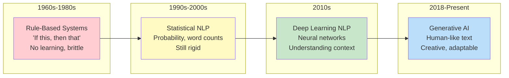
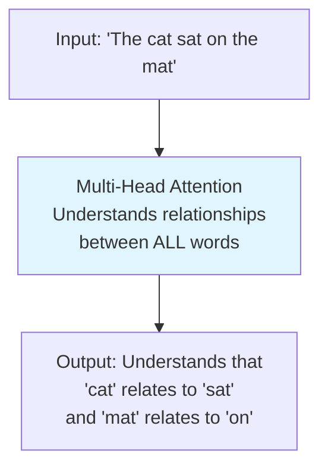

# Phase 1: Understanding How LLMs Actually Work

> **Objective:** Build the correct mental model. Remove the "AI magic" mindset and understand what an LLM really does.

---

# Part 1: Introduction to Generative AI

**Your first step into the world of Large Language Models—understanding what they are, how they evolved, and making your very first API call.**

---

## The Target: What We're Building Right Now

In this part, we're building three things:

1. **A mental model** of what Generative AI actually is and how we got here
2. **A working Jupyter notebook** that makes your first LLM API call
3. **A comparison script** that shows how different models respond to the same prompt

**Why this matters:** Before you can build with AI, you need to understand what it is and isn't. This part removes the "magic" and replaces it with a clear, engineering-friendly mental model.

---

## The Concept: What is Generative AI?

Let's start with a simple analogy that will stick with you throughout this series.

### The Library Analogy

Imagine you're a librarian in the world's largest library. You've read every book, article, and document in existence. When someone asks you a question:

- You don't "think" in the human sense
- Instead, you search your memory for patterns that match the question
- You then recite the most statistically likely sequence of words that would answer it

**This is what an LLM does.** It's not "thinking" or "understanding" in the human sense. It's a sophisticated pattern-matching machine that has been trained on vast amounts of text and predicts what words should come next.

### The Evolution: From NLP to Generative AI

Let's trace the lineage:



**What changed at each stage:**

| Era | Technology | What it Could Do | Limitation |
|-----|------------|------------------|------------|
| **1960s-1980s** | Rule-based systems | Follow explicit rules (if X, then Y) | Couldn't handle ambiguity |
| **1990s-2000s** | Statistical NLP | Count words, calculate probabilities | No understanding of meaning |
| **2010s** | Deep Learning NLP | Neural networks learned patterns | Task-specific, not general |
| **2018-Present** | Generative AI | Create new text, understand context | Hallucinations, cost |

### The Key Breakthrough: The Transformer

In 2017, researchers at Google published a paper called "Attention Is All You Need." This introduced the **Transformer architecture**, which is the foundation of every major LLM today.

**Why Transformers were a breakthrough:**

Before Transformers, AI models processed text sequentially—one word at a time, in order. This was slow and made it hard for models to understand relationships between words that were far apart in a sentence.

**The Transformer solution:** Process all words simultaneously and use "attention" to understand how each word relates to every other word.

Here's a visual of how attention works:



**In plain English:** The Transformer looks at the whole sentence at once and figures out which words are related. This is why modern LLMs understand context so much better than earlier systems.

### Popular Model Families

You'll encounter many model names throughout this series. Here's a quick reference:

| Family | Created By | Key Models | Best For |
|--------|------------|------------|----------|
| **GPT** | OpenAI | GPT-3.5, GPT-4, GPT-4o | General purpose, chat, reasoning |
| **Claude** | Anthropic | Claude 3, Claude 3.5 | Safety, reasoning, analysis |
| **Gemini** | Google | Gemini Pro, Gemini Ultra | Multimodal, integration |
| **Llama** | Meta | Llama 2, Llama 3 | Open-source, custom deployment |
| **Mistral** | Mistral AI | Mistral 7B, Mixtral | Open-source, efficiency |
| **DeepSeek** | DeepSeek | DeepSeek-V3 | Open-source, Chinese language |
| **Qwen** | Alibaba | Qwen 2.5 | Open-source, multilingual |

**Here's the important mental model:** All these models use the same fundamental Transformer architecture. They differ in:
- **Size** (how many parameters—we'll explain this later)
- **Training data** (what they learned from)
- **Training techniques** (how they were optimized)
- **Cost and speed** (performance tradeoffs)

**You don't need to pick one.** In this series, we'll use multiple providers and learn when to use each.

---

## The Implementation: Making Your First API Call

Now let's actually build something. This is your first step from theory to practice.

### Target File: `phase-1-understanding-llms/module-1-intro/01_first_api_call.py`

First, let's create the directory structure:

```bash
# Create the phase and module directories
mkdir -p ~/ai-tutorial-series/phase-1-understanding-llms/module-1-intro
cd ~/ai-tutorial-series/phase-1-understanding-llms/module-1-intro
```

### Step 1: Setting Up the Python Environment

Create `requirements.txt` in the module directory:

```txt
# Specific dependencies for Module 1
openai>=1.0.0
python-dotenv>=1.0.0
jupyter>=1.0.0
ipython>=8.0.0
```

Install them:

```bash
pip install -r requirements.txt
```

### Step 2: Making Your First API Call

Create `01_first_api_call.py`:

```python
#!/usr/bin/env python3
"""
Module 1: Your First LLM API Call

This script demonstrates how to make your first API call to OpenAI's GPT models.
We'll walk through every line of code and explain what's happening.

Before running: Ensure OPENAI_API_KEY is set in ~/ai-tutorial-series/shared/config/.env
"""

import os
import sys
from pathlib import Path

# Add the shared directory to Python path so we can import utilities
sys.path.insert(0, str(Path(__file__).parent.parent.parent.parent))

from shared.utils.config import load_config
from shared.utils.logging import setup_logging
from openai import OpenAI

# Set up logging
setup_logging(debug=True)

# Load configuration
config = load_config()

# Get API key from config
api_key = config.get("openai_api_key")
if not api_key:
    print("❌ Error: OPENAI_API_KEY not found in environment variables.")
    print("   Please add it to ~/ai-tutorial-series/shared/config/.env")
    sys.exit(1)

# Initialize the OpenAI client
# The client handles authentication, retries, and connection management
# It's the main interface for all OpenAI API calls
client = OpenAI(api_key=api_key)

# --- Simple Completion ---
# This is the most basic API call: send a prompt, get a response
def simple_completion():
    """
    Make a simple completion request to the API.
    This is the "hello world" of AI development.
    """
    print("\n" + "="*60)
    print("SIMPLE COMPLETION")
    print("="*60)
    
    # The prompt is the text we send to the model
    # Think of it as: "Here's what I want you to respond to"
    prompt = "Explain what an LLM is in exactly three sentences."
    
    print(f"\n📝 Prompt: {prompt}")
    print("\n⏳ Generating response...\n")
    
    try:
        # This is the actual API call
        # The chat.completions.create method is the primary interface
        # for interacting with OpenAI's chat models
        response = client.chat.completions.create(
            model="gpt-4o-mini",  # The model to use (cheaper, fast, good for simple tasks)
            messages=[
                # Each message has a role and content
                # "system": Instructions for how the model should behave
                # "user": The actual question or prompt
                # "assistant": The model's response (used in conversations)
                {"role": "system", "content": "You are a helpful AI assistant that explains concepts clearly and concisely."},
                {"role": "user", "content": prompt}
            ],
            temperature=0.7,  # Controls randomness (0.0 = deterministic, 1.0 = more creative)
            max_tokens=150    # Maximum length of the response (in tokens, not characters)
        )
        
        # Extract the response text
        # The response object has a complex structure, but we only need the content
        response_text = response.choices[0].message.content
        
        # Print the response
        print("🤖 Response:")
        print("-"*40)
        print(response_text)
        print("-"*40)
        
        # Print usage information (tokens used, cost implications)
        print(f"\n📊 Token Usage:")
        print(f"   Prompt tokens: {response.usage.prompt_tokens}")
        print(f"   Completion tokens: {response.usage.completion_tokens}")
        print(f"   Total tokens: {response.usage.total_tokens}")
        
    except Exception as e:
        print(f"❌ Error: {e}")
        print("\n   Troubleshooting:")
        print("   1. Check your API key is correct")
        print("   2. Ensure you have credits in your OpenAI account")
        print("   3. Check your internet connection")

# --- Streaming Response ---
# This is the same as above but sends the response in chunks
# It's better for user experience because you can show the response as it's generated
def streaming_completion():
    """
    Make a streaming completion request.
    The response comes in chunks, allowing for real-time display.
    """
    print("\n" + "="*60)
    print("STREAMING COMPLETION")
    print("="*60)
    
    prompt = "Write a haiku about artificial intelligence."
    
    print(f"\n📝 Prompt: {prompt}")
    print("\n⏳ Generating response (streaming):\n")
    
    try:
        # The only difference here is stream=True
        stream = client.chat.completions.create(
            model="gpt-4o-mini",
            messages=[
                {"role": "system", "content": "You are a poet who writes beautiful haikus."},
                {"role": "user", "content": prompt}
            ],
            temperature=0.8,
            max_tokens=100,
            stream=True  # This enables streaming
        )
        
        # Collect the full response for display
        full_response = ""
        print("🤖 Response (streaming):")
        print("-"*40)
        
        # Each chunk contains a small part of the response
        # We loop through and print each one as it arrives
        for chunk in stream:
            if chunk.choices[0].delta.content is not None:
                content = chunk.choices[0].delta.content
                print(content, end="", flush=True)  # flush=True ensures real-time output
                full_response += content
        
        print("\n" + "-"*40)
        
    except Exception as e:
        print(f"\n❌ Error: {e}")

# --- System Prompt Demonstration ---
# System prompts are crucial for controlling how the model behaves
# They're like giving the AI a character to play
def system_prompt_demo():
    """
    Demonstrates how different system prompts change the AI's behavior.
    """
    print("\n" + "="*60)
    print("SYSTEM PROMPT DEMONSTRATION")
    print("="*60)
    
    user_question = "What is the capital of France?"
    
    # We'll ask the same question but with different system prompts
    system_prompts = [
        {
            "name": "Helpful Assistant",
            "content": "You are a helpful assistant that gives accurate, factual answers."
        },
        {
            "name": "Sarcastic AI",
            "content": "You are a sarcastic AI that gives humorous, slightly snarky answers."
        },
        {
            "name": "Historian",
            "content": "You are a historian who provides detailed historical context."
        },
        {
            "name": "Child-Friendly",
            "content": "You are a friendly assistant who explains things simply, as if to a child."
        }
    ]
    
    for system in system_prompts:
        print(f"\n📋 System Prompt: '{system['name']}'")
        print(f"📝 User Question: {user_question}")
        print("-"*40)
        
        try:
            response = client.chat.completions.create(
                model="gpt-4o-mini",
                messages=[
                    {"role": "system", "content": system["content"]},
                    {"role": "user", "content": user_question}
                ],
                temperature=0.7,
                max_tokens=100
            )
            
            print(f"🤖 {response.choices[0].message.content}")
            
        except Exception as e:
            print(f"❌ Error: {e}")
        
        print("-"*40)

# --- Main Execution ---
# This is the entry point of the script
def main():
    """
    Run all demonstrations in order.
    """
    print("\n" + "="*60)
    print("AI TUTORIAL SERIES - PART 1: INTRODUCTION TO GENERATIVE AI")
    print("="*60)
    
    print("\n🚀 Starting your first AI API calls...")
    
    # Run each demonstration
    simple_completion()
    streaming_completion()
    system_prompt_demo()
    
    print("\n" + "="*60)
    print("✅ All demonstrations complete!")
    print("="*60)
    
    print("\n📚 Key Takeaways:")
    print("1. LLMs predict the next word based on patterns they learned during training")
    print("2. System prompts change how the AI behaves")
    print("3. Temperature controls creativity/randomness")
    print("4. Streaming improves user experience by showing responses in real-time")
    print("5. Every API call costs money based on token usage")

if __name__ == "__main__":
    main()
```

### Step 3: Creating a Model Comparison Script

Now let's compare how different models respond to the same prompt. This will help you understand that models are different tools for different jobs.

Create `02_model_comparison.py`:

```python
#!/usr/bin/env python3
"""
Module 1: Comparing Different AI Models

This script demonstrates how different models respond to the same prompt.
Understanding model differences is crucial for choosing the right tool.

We'll compare:
- OpenAI GPT-4o-mini (fast, cheap, good for simple tasks)
- OpenAI GPT-4o (more capable, more expensive)
- Claude 3.5 Sonnet (strong reasoning)
- Gemini Pro (good all-around)
- Ollama Llama 3 (local, free)
"""

import os
import sys
from pathlib import Path

sys.path.insert(0, str(Path(__file__).parent.parent.parent.parent))

from shared.utils.config import load_config
from shared.utils.logging import setup_logging

import json
import time
from typing import Dict, List, Any

# Set up logging
setup_logging(debug=False)

# Load configuration
config = load_config()

# --- Provider Clients ---
# We'll initialize clients for each provider
# This demonstrates how to use multiple providers

def test_openai_models():
    """Test different OpenAI models."""
    from openai import OpenAI
    
    api_key = config.get("openai_api_key")
    if not api_key:
        print("⚠️  OpenAI API key not found, skipping OpenAI tests")
        return []
    
    client = OpenAI(api_key=api_key)
    models = ["gpt-4o-mini", "gpt-4o", "gpt-3.5-turbo"]
    results = []
    
    for model in models:
        try:
            start_time = time.time()
            
            response = client.chat.completions.create(
                model=model,
                messages=[
                    {"role": "system", "content": "You are a helpful assistant."},
                    {"role": "user", "content": "Explain quantum computing in simple terms."}
                ],
                temperature=0.7,
                max_tokens=200
            )
            
            elapsed = time.time() - start_time
            
            results.append({
                "provider": "OpenAI",
                "model": model,
                "response": response.choices[0].message.content[:200] + "...",  # Truncate for display
                "tokens": response.usage.total_tokens,
                "time": f"{elapsed:.2f}s"
            })
            
        except Exception as e:
            print(f"❌ Error with OpenAI {model}: {e}")
    
    return results

def test_anthropic_models():
    """Test Anthropic Claude models."""
    from anthropic import Anthropic
    
    api_key = config.get("anthropic_api_key")
    if not api_key:
        print("⚠️  Anthropic API key not found, skipping Anthropic tests")
        return []
    
    client = Anthropic(api_key=api_key)
    models = ["claude-3-5-sonnet-20241022", "claude-3-opus-20240229"]
    results = []
    
    for model in models:
        try:
            start_time = time.time()
            
            response = client.messages.create(
                model=model,
                system="You are a helpful assistant.",
                messages=[
                    {"role": "user", "content": "Explain quantum computing in simple terms."}
                ],
                temperature=0.7,
                max_tokens=200
            )
            
            elapsed = time.time() - start_time
            
            results.append({
                "provider": "Anthropic",
                "model": model,
                "response": response.content[0].text[:200] + "...",
                "tokens": response.usage.input_tokens + response.usage.output_tokens,
                "time": f"{elapsed:.2f}s"
            })
            
        except Exception as e:
            print(f"❌ Error with Anthropic {model}: {e}")
    
    return results

def test_google_models():
    """Test Google Gemini models."""
    import google.generativeai as genai
    
    api_key = config.get("google_api_key")
    if not api_key:
        print("⚠️  Google API key not found, skipping Google tests")
        return []
    
    genai.configure(api_key=api_key)
    models = ["gemini-1.5-pro", "gemini-1.5-flash"]
    results = []
    
    for model_name in models:
        try:
            start_time = time.time()
            
            model = genai.GenerativeModel(model_name)
            response = model.generate_content(
                "Explain quantum computing in simple terms.",
                generation_config=genai.types.GenerationConfig(
                    temperature=0.7,
                    max_output_tokens=200
                )
            )
            
            elapsed = time.time() - start_time
            
            results.append({
                "provider": "Google",
                "model": model_name,
                "response": response.text[:200] + "...",
                "tokens": response.usage_metadata.prompt_token_count + response.usage_metadata.candidates_token_count,
                "time": f"{elapsed:.2f}s"
            })
            
        except Exception as e:
            print(f"❌ Error with Google {model_name}: {e}")
    
    return results

def test_ollama_models():
    """Test local Ollama models."""
    try:
        import ollama
    except ImportError:
        print("⚠️  Ollama not installed, skipping local tests")
        return []
    
    # Check if Ollama is running
    try:
        ollama.list()
    except:
        print("⚠️  Ollama not running, skipping local tests")
        return []
    
    # List of models to test
    models = ["llama3.2", "mistral"]
    results = []
    
    for model in models:
        try:
            start_time = time.time()
            
            response = ollama.chat(
                model=model,
                messages=[
                    {"role": "system", "content": "You are a helpful assistant."},
                    {"role": "user", "content": "Explain quantum computing in simple terms."}
                ],
                options={
                    "temperature": 0.7,
                    "num_predict": 200
                }
            )
            
            elapsed = time.time() - start_time
            
            # Ollama doesn't provide token counts directly
            # We'll estimate based on the response
            token_estimate = len(response["message"]["content"]) / 4  # Rough estimate
            
            results.append({
                "provider": "Ollama (Local)",
                "model": model,
                "response": response["message"]["content"][:200] + "...",
                "tokens": int(token_estimate),
                "time": f"{elapsed:.2f}s"
            })
            
        except Exception as e:
            print(f"❌ Error with Ollama {model}: {e}")
    
    return results

def format_results(results: List[Dict[str, Any]]) -> None:
    """
    Display results in a clean, readable format.
    """
    if not results:
        print("No results to display")
        return
    
    print("\n" + "="*80)
    print("MODEL COMPARISON RESULTS")
    print("="*80)
    
    print("\n📊 Quick Comparison Table:")
    print("-"*80)
    print(f"{'Provider':<20} {'Model':<25} {'Time':<10} {'Tokens':<10}")
    print("-"*80)
    
    for result in results:
        print(f"{result['provider']:<20} {result['model']:<25} {result['time']:<10} {result['tokens']:<10}")
    
    print("-"*80)
    
    # Show a sample response from each
    print("\n📝 Sample Responses:")
    print("-"*80)
    
    for i, result in enumerate(results, 1):
        print(f"\n{i}. {result['provider']} - {result['model']}")
        print("   " + "-"*76)
        print(f"   {result['response']}")
        print("   " + "-"*76)

def main():
    """Run all model comparisons."""
    print("\n" + "="*80)
    print("AI TUTORIAL SERIES - MODEL COMPARISON")
    print("="*80)
    
    print("\n🔍 Testing different AI models with the same prompt...")
    print("   Prompt: 'Explain quantum computing in simple terms.'")
    
    # Run all tests
    all_results = []
    
    print("\n📡 Testing OpenAI models...")
    all_results.extend(test_openai_models())
    
    print("\n📡 Testing Anthropic models...")
    all_results.extend(test_anthropic_models())
    
    print("\n📡 Testing Google models...")
    all_results.extend(test_google_models())
    
    print("\n📡 Testing local Ollama models...")
    all_results.extend(test_ollama_models())
    
    # Display results
    if all_results:
        format_results(all_results)
        
        print("\n" + "="*80)
        print("💡 Key Observations:")
        print("="*80)
        print("1. Different models produce different responses to the same prompt")
        print("2. Larger models generally produce more detailed responses but cost more")
        print("3. Local models (Ollama) are free but may be slower or less capable")
        print("4. Response time varies significantly between providers")
        print("5. Token usage directly affects cost - choose the right model for each task")
    else:
        print("\n❌ No models could be tested. Please check your API keys.")
        print("\n   To test specific providers:")
        print("   - OpenAI: Set OPENAI_API_KEY in .env")
        print("   - Anthropic: Set ANTHROPIC_API_KEY in .env")
        print("   - Google: Set GOOGLE_API_KEY in .env")
        print("   - Ollama: Install and start Ollama locally")

if __name__ == "__main__":
    main()
```

### Step 4: Creating the Jupyter Notebook for Interactive Learning

Create `03_interactive_learning.ipynb` - this is a Jupyter notebook for hands-on experimentation. Since this is a text-based tutorial, I'll provide the notebook content as a Python script with markdown comments:

Create `03_interactive_notebook.py`:

```python
"""
# AI Tutorial Series - Part 1: Interactive Learning

Welcome to your first AI coding experience! This notebook is designed to be run
interactively, letting you experiment with different parameters and see the
results immediately.

## How to Use This Notebook

1. Each cell is a block of code that you can run independently
2. Modify the prompts, parameters, and models to see how the behavior changes
3. Use this to build intuition about how LLMs work

## The Setup

We'll use the same pattern as before:
1. Import dependencies
2. Initialize the client
3. Make API calls
4. Analyze the results
"""

# --- Cell 1: Setup ---
# Run this cell first to import everything you need

import os
import sys
from pathlib import Path
import json

# Add shared directory to path
sys.path.insert(0, str(Path.cwd().parent.parent.parent))

from shared.utils.config import load_config
from shared.utils.logging import setup_logging
from openai import OpenAI

setup_logging(debug=True)
config = load_config()

# Initialize the OpenAI client
api_key = config.get("openai_api_key")
if not api_key:
    print("❌ Please set OPENAI_API_KEY in .env")
else:
    client = OpenAI(api_key=api_key)
    print("✅ OpenAI client initialized successfully")

"""
# --- Cell 2: Experiment with Temperature ---

Temperature controls how random/creative the AI is:

- temperature = 0.0: Always picks the most likely word (deterministic, boring)
- temperature = 0.5: Some randomness (balanced)
- temperature = 1.0: More creative (can be unpredictable)
- temperature = 1.5: Very creative (often nonsensical)

Let's see how temperature affects the same prompt.
"""

def experiment_temperature():
    """Show how different temperatures affect the output."""
    prompt = "Write a short story about a robot learning to paint."
    
    temperatures = [0.0, 0.5, 1.0, 1.5]
    
    print("="*60)
    print("TEMPERATURE EXPERIMENT")
    print("="*60)
    
    for temp in temperatures:
        print(f"\n🌡️ Temperature: {temp}")
        print("-"*40)
        
        response = client.chat.completions.create(
            model="gpt-4o-mini",
            messages=[
                {"role": "system", "content": "You are a creative storyteller."},
                {"role": "user", "content": prompt}
            ],
            temperature=temp,
            max_tokens=100
        )
        
        print(response.choices[0].message.content)
        print("-"*40)

# Run this to see the effect:
# experiment_temperature()

"""
# --- Cell 3: Experiment with Max Tokens ---

Max tokens controls how long the response can be:

- Low max_tokens: Short responses (cheaper, faster)
- High max_tokens: Long responses (more expensive, slower)

Let's see how different max_tokens values affect the output.
"""

def experiment_max_tokens():
    """Show how different max_tokens values affect the output."""
    prompt = "Explain the water cycle in detail."
    
    max_tokens_values = [50, 100, 200, 500]
    
    print("="*60)
    print("MAX TOKENS EXPERIMENT")
    print("="*60)
    
    for max_tokens in max_tokens_values:
        print(f"\n📏 Max Tokens: {max_tokens}")
        print("-"*40)
        
        response = client.chat.completions.create(
            model="gpt-4o-mini",
            messages=[
                {"role": "system", "content": "You are a science teacher."},
                {"role": "user", "content": prompt}
            ],
            temperature=0.7,
            max_tokens=max_tokens
        )
        
        print(response.choices[0].message.content)
        print(f"\n   (Response length: {len(response.choices[0].message.content)} characters)")
        print("-"*40)

# experiment_max_tokens()

"""
# --- Cell 4: Experiment with Different System Prompts ---

System prompts control the AI's persona. This is one of the most powerful 
techniques in prompt engineering.
"""

def experiment_system_prompts():
    """Show how different system prompts change the AI's behavior."""
    prompt = "How can I learn Python programming?"
    
    system_prompts = [
        "You are a strict, no-nonsense teacher who gives short, direct answers.",
        "You are an enthusiastic, encouraging mentor who gets excited about learning.",
        "You are a sarcastic expert who thinks everyone should already know this.",
        "You are a beginner-friendly guide who explains everything in simple terms."
    ]
    
    print("="*60)
    print("SYSTEM PROMPT EXPERIMENT")
    print("="*60)
    
    for system_prompt in system_prompts:
        print(f"\n🎭 System Prompt: '{system_prompt}'")
        print("-"*40)
        
        response = client.chat.completions.create(
            model="gpt-4o-mini",
            messages=[
                {"role": "system", "content": system_prompt},
                {"role": "user", "content": prompt}
            ],
            temperature=0.7,
            max_tokens=150
        )
        
        print(response.choices[0].message.content)
        print("-"*40)

# experiment_system_prompts()

"""
# --- Cell 5: Experiment with Few-Shot Examples ---

Few-shot learning means giving examples in the prompt before asking the question.
This helps the AI understand the format and style you want.
"""

def experiment_few_shot():
    """Show how examples in the prompt improve the AI's response."""
    
    # Without examples (zero-shot)
    print("="*60)
    print("ZERO-SHOT (No Examples)")
    print("="*60)
    
    prompt_zero_shot = """Extract the key information from this sentence and format it as a JSON object.

Sentence: "John Smith, age 32, works as a software engineer at Google in Mountain View."

Return as JSON with fields: name, age, job_title, company, location
"""
    
    response = client.chat.completions.create(
        model="gpt-4o-mini",
        messages=[
            {"role": "user", "content": prompt_zero_shot}
        ],
        temperature=0.3,
        max_tokens=150
    )
    
    print(response.choices[0].message.content)
    
    # With examples (few-shot)
    print("\n" + "="*60)
    print("FEW-SHOT (With Examples)")
    print("="*60)
    
    prompt_few_shot = """Extract the key information from sentences and format as JSON.

Example 1:
Sentence: "Sarah Johnson, 28, is a data scientist at Amazon in Seattle."
Output: {"name": "Sarah Johnson", "age": 28, "job_title": "data scientist", "company": "Amazon", "location": "Seattle"}

Example 2:
Sentence: "Mike Chen, 45, works as a product manager at Microsoft in Redmond."
Output: {"name": "Mike Chen", "age": 45, "job_title": "product manager", "company": "Microsoft", "location": "Redmond"}

Now extract:
Sentence: "John Smith, age 32, works as a software engineer at Google in Mountain View."

Return as JSON with fields: name, age, job_title, company, location
"""
    
    response = client.chat.completions.create(
        model="gpt-4o-mini",
        messages=[
            {"role": "user", "content": prompt_few_shot}
        ],
        temperature=0.3,
        max_tokens=150
    )
    
    print(response.choices[0].message.content)

# experiment_few_shot()

"""
# --- Cell 6: Understanding Token Usage ---

Let's explore how token usage affects cost.
"""

def experiment_token_usage():
    """Show how different prompts affect token usage and cost."""
    
    # Different length prompts
    prompts = [
        "Hello",  # Short
        "Tell me about the history of artificial intelligence and its impact on society.",  # Medium
        """Write a comprehensive essay about the history of artificial intelligence, 
        covering major milestones from Alan Turing's work in the 1950s through to modern 
        deep learning and transformer architectures. Include key figures like John McCarthy, 
        Marvin Minsky, Geoffrey Hinton, and Yann LeCun. Discuss the AI winters and the 
        factors that led to the current AI renaissance. Provide examples of how AI is 
        being used today in healthcare, finance, and transportation."""  # Long
    ]
    
    print("="*60)
    print("TOKEN USAGE EXPERIMENT")
    print("="*60)
    
    # Use tiktoken to count tokens without making API calls
    import tiktoken
    
    encoding = tiktoken.encoding_for_model("gpt-4o-mini")
    
    for i, prompt in enumerate(prompts, 1):
        token_count = len(encoding.encode(prompt))
        
        # Approximate cost (gpt-4o-mini pricing)
        # Input: $0.150 / 1M tokens, Output: $0.600 / 1M tokens
        # We'll estimate with a small completion
        estimated_cost_input = (token_count / 1_000_000) * 0.150
        estimated_cost_output = (50 / 1_000_000) * 0.600  # Assume 50 output tokens
        total_estimated = estimated_cost_input + estimated_cost_output
        
        print(f"\n📝 Prompt {i}:")
        print(f"   Character count: {len(prompt)}")
        print(f"   Token count: {token_count}")
        print(f"   Estimated cost: ${total_estimated:.6f}")
        print(f"   (Preview: {prompt[:100]}...)")

# experiment_token_usage()

"""
# --- Cell 7: Your Turn! ---

Now it's your turn to experiment. Modify the parameters below and see what happens.
"""
    
def your_experiment():
    """This is where you get to experiment freely."""
    
    print("="*60)
    print("YOUR EXPERIMENT")
    print("="*60)
    
    # TODO: Modify these parameters
    prompt = "Write a limerick about a database engineer."  # Change this!
    temperature = 0.7  # Try 0.0, 0.5, 1.0, 1.5
    max_tokens = 100   # Try 50, 100, 200, 500
    model = "gpt-4o-mini"
    system_prompt = "You are a creative poet."  # Try different personas
    
    print(f"\n📝 Prompt: {prompt}")
    print(f"🌡️ Temperature: {temperature}")
    print(f"📏 Max Tokens: {max_tokens}")
    print(f"🎭 System Prompt: {system_prompt}")
    print("-"*40)
    
    response = client.chat.completions.create(
        model=model,
        messages=[
            {"role": "system", "content": system_prompt},
            {"role": "user", "content": prompt}
        ],
        temperature=temperature,
        max_tokens=max_tokens
    )
    
    print("🤖 Response:")
    print("-"*40)
    print(response.choices[0].message.content)
    print("-"*40)
    print(f"\n📊 Token Usage: {response.usage.total_tokens} tokens")

# Uncomment to run your experiment:
# your_experiment()

"""
# --- Cell 8: Challenge Questions ---

Try to answer these by experimenting:

1. What happens when temperature is 0.0? Does the output always stay the same?
2. How does max_tokens affect the completeness of the response?
3. How does a system prompt change the tone of the response?
4. What's the relationship between token count and cost?
5. Can you get the AI to write in a specific style using only prompts?
"""

# This is the end of the notebook. Run each cell to see the results!
print("\n🎯 Interactive notebook loaded!")
print("   - Run experiment_temperature() to see temperature effects")
print("   - Run experiment_max_tokens() to see length effects")
print("   - Run experiment_system_prompts() to see persona effects")
print("   - Run your_experiment() to try your own prompts")
```

---

## The Verification: Testing Your Setup

Now let's verify everything works before moving on.

### Step 1: Test the Environment

```bash
# Navigate to the module directory
cd ~/ai-tutorial-series/phase-1-understanding-llms/module-1-intro

# Run the verification script (from Part 0)
python ~/ai-tutorial-series/verify_setup.py
```

### Step 2: Test the First API Call

```bash
# Run the first API call script
python 01_first_api_call.py
```

**Expected output:**
- You should see the "Simple Completion" section with a 3-sentence explanation
- You should see the "Streaming Completion" section with a haiku appearing word by word
- You should see the "System Prompt Demonstration" showing the same question answered differently

**If you get an error:**
```
❌ Error: OPENAI_API_KEY not found...
```

**Fix:**
1. Open `~/ai-tutorial-series/shared/config/.env`
2. Add: `OPENAI_API_KEY=your_actual_api_key_here`
3. Save and try again

### Step 3: Test the Model Comparison

```bash
# Run the model comparison
python 02_model_comparison.py
```

**Expected output:**
- A table showing different models with their response times and token usage
- Sample responses from each model

**Note:** This script will only test providers where you have API keys. It's okay if some are skipped.

### Step 4: Quick Test in Python

To verify everything is working at a basic level:

```bash
python -c "
from shared.utils.config import load_config
config = load_config()
print('✅ Config loaded')
print(f'OPENAI_API_KEY: {config.get(\"openai_api_key\", \"NOT SET\")[:10]}...')
"
```

---

## Key Takeaways

By completing this module, you've:

✅ **Made your first LLM API call** - You're officially an AI developer now
✅ **Understood the transformer architecture** at a high level
✅ **Learned about different model families** and their use cases
✅ **Experimented with temperature**, max tokens, and system prompts
✅ **Compared different models** and saw how they differ
✅ **Understood token usage and cost** implications

### The Mental Model to Carry Forward

```
┌─────────────────────────────────────────────────────────────┐
│                     THE LLM MENTAL MODEL                    │
├─────────────────────────────────────────────────────────────┤
│                                                             │
│  1. LLMs are pattern-matching machines trained on text     │
│  2. They predict the next token (word part) in a sequence  │
│  3. Temperature controls how creative/deterministic they   │
│  4. System prompts set the "persona"                       │
│  5. Every API call has a cost (tokens = money)             │
│  6. Different models are different tools                   │
│  7. The transformer makes it all possible                  │
│                                                             │
└─────────────────────────────────────────────────────────────┘
```

---

## What's Next

**In Part 2: Tokens & Embeddings**, you'll learn:

- What tokens actually are and how they're created
- How tokenization algorithms work (BPE, SentencePiece)
- What embeddings are and why they're the foundation of RAG
- How to generate embeddings and measure semantic similarity
- How to visualize the semantic space

**You'll build:**
- A token counter tool
- An embedding generator
- A semantic similarity visualizer
- A basic semantic search

**[Continue to Part 2: Tokens & Embeddings →]**

---

## Reference Section: Deep Dive

### The Transformer Architecture in More Detail

While we'll keep things practical throughout this series, understanding the transformer at a slightly deeper level will help you reason about what's happening.

#### The Key Components

```
                     ┌─────────────────────────┐
                     │   OUTPUT PROBABILITIES   │
                     │   (Which token comes     │
                     │    next in the sequence) │
                     └────────────┬────────────┘
                                  │
                     ┌────────────▼────────────┐
                     │   SOFTMAX LAYER         │
                     │   (Convert to            │
                     │    probabilities)        │
                     └────────────┬────────────┘
                                  │
                     ┌────────────▼────────────┐
                     │   FEED-FORWARD NETWORK  │
                     │   (Further processing)   │
                     └────────────┬────────────┘
                                  │
                     ┌────────────▼────────────┐
                     │   MULTI-HEAD ATTENTION  │
                     │   (How each word        │
                     │    relates to others)   │
                     └────────────┬────────────┘
                                  │
                     ┌────────────▼────────────┐
                     │   INPUT EMBEDDINGS      │
                     │   (Words → Numbers)     │
                     └────────────┬────────────┘
                                  │
                     ┌────────────▼────────────┐
                     │   INPUT TEXT            │
                     └─────────────────────────┘
```

**What each component does:**

1. **Input Embeddings**: Convert words to numbers (vectors)
2. **Multi-Head Attention**: Figure out which words relate to each other
3. **Feed-Forward Network**: Process the attention output further
4. **Softmax Layer**: Convert scores to probabilities
5. **Output Probabilities**: Which token is most likely next?

#### Why This Matters for Developers

Understanding this architecture helps you:

- **Debug unexpected outputs**: If a model gives weird results, you know it's just pattern-matching
- **Choose the right model**: Different models have different attention mechanisms
- **Understand context windows**: Attention has memory limits (context windows)
- **Appreciate why models hallucinate**: When the pattern doesn't exist, the model makes one up

### Common Terms You'll Encounter

| Term | Definition | Analogy |
|------|------------|---------|
| **Token** | Smallest unit of text a model processes | Like letters in a word, but not always words |
| **Embedding** | A vector (list of numbers) representing meaning | Like a coordinate on a map of concepts |
| **Parameter** | A number the model learned during training | Like a knob the model adjusts to get better |
| **Context Window** | How much text the model can "see" at once | Like how many books you can hold in your hands |
| **Temperature** | Controls randomness in generation | Like a creativity dial |
| **Top-K** | Only consider the K most likely tokens | Like only looking at the top 5 job candidates |
| **Top-P** | Only consider tokens that make up P% of probability mass | Like dynamic filtering of candidates |
| **Hallucination** | When the model makes things up | Like a confident person who's wrong |

### Glossary: Key Terms from This Module

**Artificial Intelligence (AI):** A broad field of computer science focused on creating systems that can perform tasks typically requiring human intelligence.

**Machine Learning (ML):** A subset of AI where systems learn from data rather than being explicitly programmed.

**Deep Learning:** A subset of ML that uses neural networks with many layers (hence "deep") to learn patterns.

**Generative AI:** AI systems that create new content (text, images, audio) rather than just analyzing existing data.

**NLP (Natural Language Processing):** The branch of AI focused on understanding and generating human language.

**LLM (Large Language Model):** A deep learning model trained on vast amounts of text to understand and generate language.

**Transformer:** The neural network architecture introduced in 2017 that powers modern LLMs.

**Attention:** The mechanism in transformers that allows the model to weigh the importance of different words in a sequence.

**Zero-shot Learning:** When a model performs a task without specific training examples.

**Few-shot Learning:** When a model performs a task after seeing a few examples in the prompt.

**System Prompt:** Instructions given to the model at the start of a conversation to set its behavior.

**User Prompt:** The question or task you give to the model.

**API Key:** A unique identifier used to authenticate API requests and track usage.

**Token:** A unit of text that the model processes (roughly 4 characters or 0.75 words in English).

**Temperature:** A parameter controlling randomness (0.0 = deterministic, higher = more creative).

**Max Tokens:** The maximum number of tokens the model can generate in a response.

**Streaming:** Receiving a response in chunks as it's being generated, rather than all at once.

**Context Window:** The maximum number of tokens the model can consider at once.

**Hallucination:** When an AI generates information that's incorrect or fabricated but presented as factual.

---

## Common Errors and Solutions

| Error | Likely Cause | Solution |
|-------|--------------|----------|
| `OPENAI_API_KEY not found` | Missing API key in environment | Add key to `.env` file |
| `Rate limit exceeded` | Too many requests too fast | Wait a few seconds, add delay between requests |
| `Authentication error` | Invalid API key | Check key is correct, no extra spaces |
| `Connection timeout` | Network issue or OpenAI is down | Check internet, try again later |
| `Model not found` | Invalid model name | Use correct model name (gpt-4o-mini, etc.) |
| `Insufficient credits` | No credits in OpenAI account | Add credits to your account |

---

## Resources for Further Learning

- [OpenAI API Documentation](https://platform.openai.com/docs)
- [Anthropic Claude Documentation](https://docs.anthropic.com)
- [Google Gemini Documentation](https://ai.google.dev/gemini-api/docs)
- [Ollama Documentation](https://ollama.ai)
- [The Illustrated Transformer](http://jalammar.github.io/illustrated-transformer/)
- [Attention Is All You Need (Original Paper)](https://arxiv.org/abs/1706.03762)
