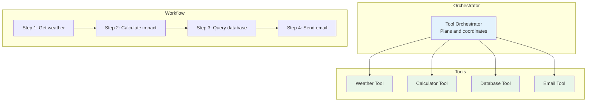

# Phase 3: AI Tool Use & Function Calling

# Part 10: Tool Orchestration

**Managing multiple tools, sequential and parallel execution, error recovery, and building complex workflows with AI.**

---

## The Target: What We're Building Right Now

In this part, we're building five powerful orchestration systems:

1. **A Tool Orchestrator** — Manage and coordinate multiple tools
2. **A Sequential Execution Engine** — Run tools in a specific order
3. **A Parallel Execution Engine** — Run multiple tools simultaneously
4. **An Error Recovery System** — Handle failures with retries and fallbacks
5. **A Workflow Builder** — Create complex multi-step workflows

**Why this matters:** Single tools are useful, but the real power comes from orchestrating multiple tools together. This is how you build AI systems that can handle complex, multi-step tasks automatically.

---

## The Concept: Coordinating Multiple Tools

### The Orchestra Conductor Analogy

Imagine you're conducting an orchestra:

- **Each musician** is a tool (weather, calculator, database, email)
- **The conductor** is the orchestrator (you or the AI)
- **The sheet music** is the workflow (the sequence of steps)
- **The performance** is the execution (the actual work being done)

**Tool orchestration is about coordinating multiple tools to accomplish a complex task.**



### Orchestration Patterns

#### 1. Sequential Execution

Tools run one after another, with each step depending on the previous.

```python
# Sequential pattern
result1 = tool1.execute()
result2 = tool2.execute(result1)
result3 = tool3.execute(result2)
```

**Use cases:** Data pipelines, multi-step calculations, approval workflows

#### 2. Parallel Execution

Tools run simultaneously, independent of each other.

```python
# Parallel pattern
results = await asyncio.gather(
    tool1.execute(),
    tool2.execute(),
    tool3.execute()
)
```

**Use cases:** Batch processing, data aggregation, performance optimization

#### 3. Conditional Execution

Tools run based on conditions or previous results.

```python
# Conditional pattern
if condition:
    result = tool1.execute()
else:
    result = tool2.execute()
```

**Use cases:** Decision trees, error recovery, dynamic workflows

#### 4. Loop Execution

Tools run repeatedly until a condition is met.

```python
# Loop pattern
while not condition_met:
    result = tool.execute()
    condition_met = check_condition(result)
```

**Use cases:** Iterative refinement, search algorithms, monitoring

### Orchestration Challenges

| Challenge | Description | Solution |
|-----------|-------------|----------|
| **Dependencies** | Tools need data from other tools | Track dependencies, pass data |
| **Error Handling** | Tools can fail | Retry, fallback, graceful degradation |
| **Timeouts** | Tools can hang | Set timeouts, cancel hung tasks |
| **Concurrency** | Race conditions, resource contention | Use locks, semaphores |
| **State Management** | Tracking progress across steps | Use workflow state |
| **Monitoring** | Understanding what's happening | Logging, tracing, metrics |

---

## The Implementation: Building Our Orchestration Tools

### Target File Structure

```
phase-3-tool-use/
└── module-10-tool-orchestration/
    ├── 01_tool_orchestrator.py
    ├── 02_sequential_execution.py
    ├── 03_parallel_execution.py
    ├── 04_error_recovery.py
    ├── 05_workflow_builder.py
    ├── requirements.txt
    └── README.md
```

### Step 1: Tool Orchestrator

Create `01_tool_orchestrator.py`:

```python
#!/usr/bin/env python3
"""
Module 10: Tool Orchestrator

Orchestrate multiple tools for complex workflows.
"""

import os
import sys
from pathlib import Path
import json
import asyncio
import time
from typing import Dict, Any, List, Optional, Callable, Union
from dataclasses import dataclass, field
from enum import Enum
from datetime import datetime
import threading
import queue

sys.path.insert(0, str(Path(__file__).parent.parent.parent.parent))

from shared.utils.config import load_config
from shared.utils.logging import setup_logging
from function_definition import FunctionDefinition, Parameter, ParameterType
from tool_execution_engine import ToolExecutionEngine

setup_logging(debug=False)
config = load_config()

class ExecutionMode(Enum):
    """Execution mode for the orchestrator."""
    SEQUENTIAL = "sequential"
    PARALLEL = "parallel"
    CONDITIONAL = "conditional"
    LOOP = "loop"

@dataclass
class ToolStep:
    """A step in a workflow."""
    name: str
    tool: str
    arguments: Dict[str, Any] = field(default_factory=dict)
    dependencies: List[str] = field(default_factory=list)
    condition: Optional[str] = None
    timeout: int = 30
    retries: int = 3
    mode: ExecutionMode = ExecutionMode.SEQUENTIAL

@dataclass
class Workflow:
    """A workflow definition."""
    name: str
    steps: List[ToolStep]
    description: str = ""
    created_at: str = field(default_factory=lambda: datetime.now().isoformat())

@dataclass
class WorkflowResult:
    """Result of a workflow execution."""
    success: bool
    results: Dict[str, Any]
    errors: Dict[str, str]
    duration: float
    step_results: Dict[str, Any] = field(default_factory=dict)

class ToolOrchestrator:
    """
    Orchestrate multiple tools for complex workflows.
    
    Features:
    - Workflow definition and management
    - Sequential and parallel execution
    - Dependency resolution
    - Error handling and recovery
    - State management
    """
    
    def __init__(self, engine: Optional[ToolExecutionEngine] = None):
        """
        Initialize the orchestrator.
        
        Args:
            engine: Tool execution engine (creates one if not provided)
        """
        self.engine = engine or ToolExecutionEngine()
        self.workflows: Dict[str, Workflow] = {}
        self.results: Dict[str, WorkflowResult] = {}
        self.current_workflow: Optional[str] = None
    
    def register_tool(self, function: FunctionDefinition) -> None:
        """Register a tool with the orchestrator."""
        self.engine.register_tool(function)
    
    def register_tools(self, functions: List[FunctionDefinition]) -> None:
        """Register multiple tools."""
        self.engine.register_tools(functions)
    
    def create_workflow(self, workflow: Workflow) -> None:
        """
        Create and register a workflow.
        
        Args:
            workflow: Workflow definition
        """
        self.workflows[workflow.name] = workflow
        print(f"✅ Created workflow: {workflow.name}")
        print(f"   Steps: {len(workflow.steps)}")
    
    def execute_workflow(
        self,
        workflow_name: str,
        initial_context: Dict[str, Any] = None
    ) -> WorkflowResult:
        """
        Execute a workflow.
        
        Args:
            workflow_name: Name of the workflow
            initial_context: Initial context for the workflow
            
        Returns:
            Workflow result
        """
        if workflow_name not in self.workflows:
            return WorkflowResult(
                success=False,
                results={},
                errors={"workflow": f"Workflow not found: {workflow_name}"},
                duration=0
            )
        
        workflow = self.workflows[workflow_name]
        self.current_workflow = workflow_name
        
        start_time = time.time()
        context = initial_context or {}
        step_results = {}
        errors = {}
        
        print(f"\n🚀 Executing workflow: {workflow_name}")
        print("-"*40)
        
        try:
            # Execute steps
            for step in workflow.steps:
                print(f"\n📋 Step: {step.name}")
                print(f"   Tool: {step.tool}")
                print(f"   Mode: {step.mode.value}")
                
                # Check dependencies
                if not self._dependencies_met(step, step_results):
                    error = f"Dependencies not met: {step.dependencies}"
                    errors[step.name] = error
                    step_results[step.name] = {"error": error}
                    continue
                
                # Execute the step
                result = self._execute_step(step, context, step_results)
                step_results[step.name] = result
                
                if result.get("success", False):
                    print(f"   ✅ Success")
                    # Update context with results
                    context[step.name] = result.get("data", {})
                else:
                    error = result.get("error", "Unknown error")
                    errors[step.name] = error
                    print(f"   ❌ Error: {error}")
                    
                    # Stop on critical errors
                    if step.mode == ExecutionMode.SEQUENTIAL:
                        break
            
            success = len(errors) == 0
            duration = time.time() - start_time
            
            result = WorkflowResult(
                success=success,
                results=context,
                errors=errors,
                duration=duration,
                step_results=step_results
            )
            
            self.results[workflow_name] = result
            
            print(f"\n{'✅' if success else '❌'} Workflow completed in {duration:.2f}s")
            
            return result
            
        except Exception as e:
            duration = time.time() - start_time
            return WorkflowResult(
                success=False,
                results=context,
                errors={"workflow": str(e)},
                duration=duration,
                step_results=step_results
            )
    
    def _dependencies_met(
        self,
        step: ToolStep,
        step_results: Dict[str, Any]
    ) -> bool:
        """Check if all dependencies are met."""
        if not step.dependencies:
            return True
        
        for dep in step.dependencies:
            if dep not in step_results:
                return False
            if not step_results[dep].get("success", False):
                return False
        
        return True
    
    def _execute_step(
        self,
        step: ToolStep,
        context: Dict[str, Any],
        step_results: Dict[str, Any]
    ) -> Dict[str, Any]:
        """Execute a single step."""
        # Prepare arguments with context
        args = self._prepare_arguments(step.arguments, context, step_results)
        
        # Execute based on mode
        if step.mode == ExecutionMode.SEQUENTIAL:
            return self._execute_sequential(step, args)
        elif step.mode == ExecutionMode.PARALLEL:
            return self._execute_parallel(step, args)
        elif step.mode == ExecutionMode.CONDITIONAL:
            return self._execute_conditional(step, args, context)
        elif step.mode == ExecutionMode.LOOP:
            return self._execute_loop(step, args, context)
        else:
            return {"success": False, "error": f"Unknown mode: {step.mode}"}
    
    def _prepare_arguments(
        self,
        args: Dict[str, Any],
        context: Dict[str, Any],
        step_results: Dict[str, Any]
    ) -> Dict[str, Any]:
        """Prepare arguments with context and previous results."""
        prepared = {}
        
        for key, value in args.items():
            if isinstance(value, str) and value.startswith("$"):
                # Reference to context or previous result
                ref = value[1:]
                if ref in context:
                    prepared[key] = context[ref]
                elif ref in step_results:
                    prepared[key] = step_results[ref]
                else:
                    prepared[key] = value
            else:
                prepared[key] = value
        
        return prepared
    
    def _execute_sequential(
        self,
        step: ToolStep,
        args: Dict[str, Any]
    ) -> Dict[str, Any]:
        """Execute a step in sequential mode."""
        return self._execute_with_retry(step, args)
    
    def _execute_parallel(
        self,
        step: ToolStep,
        args: Dict[str, Any]
    ) -> Dict[str, Any]:
        """Execute a step in parallel mode."""
        # For demonstration, we'll still execute sequentially
        # In a real implementation, you'd use asyncio.gather
        return self._execute_with_retry(step, args)
    
    def _execute_conditional(
        self,
        step: ToolStep,
        args: Dict[str, Any],
        context: Dict[str, Any]
    ) -> Dict[str, Any]:
        """Execute a conditional step."""
        if step.condition:
            # Evaluate condition
            if self._evaluate_condition(step.condition, context):
                return self._execute_with_retry(step, args)
            else:
                return {"success": True, "data": {"skipped": True}}
        return self._execute_with_retry(step, args)
    
    def _execute_loop(
        self,
        step: ToolStep,
        args: Dict[str, Any],
        context: Dict[str, Any]
    ) -> Dict[str, Any]:
        """Execute a loop step."""
        max_iterations = args.get("max_iterations", 5)
        results = []
        
        for i in range(max_iterations):
            result = self._execute_with_retry(step, args)
            results.append(result)
            
            # Check if done
            if result.get("data", {}).get("done", False):
                break
        
        return {"success": True, "data": {"iterations": len(results), "results": results}}
    
    def _execute_with_retry(
        self,
        step: ToolStep,
        args: Dict[str, Any]
    ) -> Dict[str, Any]:
        """Execute a step with retry logic."""
        last_error = None
        
        for attempt in range(step.retries):
            try:
                result = self.engine.registry.execute(step.tool, args)
                return {"success": True, "data": result}
            except Exception as e:
                last_error = str(e)
                if attempt < step.retries - 1:
                    wait_time = 2 ** attempt  # Exponential backoff
                    time.sleep(wait_time)
        
        return {"success": False, "error": last_error}
    
    def _evaluate_condition(self, condition: str, context: Dict[str, Any]) -> bool:
        """Evaluate a condition string."""
        # Simple condition evaluation
        try:
            # Replace variables with context values
            for key, value in context.items():
                condition = condition.replace(f"${key}", str(value))
            
            # Evaluate
            return eval(condition)
        except:
            return False

def demonstrate_orchestrator():
    """Demonstrate the tool orchestrator."""
    print("\n" + "="*80)
    print("🎼 TOOL ORCHESTRATOR DEMONSTRATION")
    print("="*80)
    
    # Create orchestrator
    orchestrator = ToolOrchestrator()
    
    # Define some tools
    def get_weather(location: str) -> dict:
        return {"location": location, "temperature": 22, "condition": "sunny"}
    
    def calculate(expression: str) -> float:
        return eval(expression)
    
    def query_database(query: str) -> list:
        return [{"id": 1, "name": "Alice"}, {"id": 2, "name": "Bob"}]
    
    # Register tools
    weather_func = FunctionDefinition(
        name="get_weather",
        description="Get weather for a location",
        parameters=[Parameter(name="location", type=ParameterType.STRING, required=True)],
        handler=get_weather
    )
    
    calc_func = FunctionDefinition(
        name="calculate",
        description="Calculate a mathematical expression",
        parameters=[Parameter(name="expression", type=ParameterType.STRING, required=True)],
        handler=calculate
    )
    
    db_func = FunctionDefinition(
        name="query_database",
        description="Query the database",
        parameters=[Parameter(name="query", type=ParameterType.STRING, required=True)],
        handler=query_database
    )
    
    orchestrator.register_tools([weather_func, calc_func, db_func])
    
    # Create a workflow
    workflow = Workflow(
        name="weather_analysis",
        description="Get weather, calculate impact, and query related data",
        steps=[
            ToolStep(
                name="get_weather",
                tool="get_weather",
                arguments={"location": "London"},
                retries=2
            ),
            ToolStep(
                name="calculate_temperature",
                tool="calculate",
                arguments={"expression": "$get_weather.temperature * 1.8 + 32"},
                dependencies=["get_weather"]
            ),
            ToolStep(
                name="query_data",
                tool="query_database",
                arguments={"query": "SELECT * FROM weather_data WHERE location = 'London'"},
                dependencies=["get_weather"]
            )
        ]
    )
    
    orchestrator.create_workflow(workflow)
    
    # Execute the workflow
    result = orchestrator.execute_workflow("weather_analysis")
    
    print("\n📊 Workflow Results:")
    print("-"*40)
    print(f"Success: {result.success}")
    print(f"Duration: {result.duration:.2f}s")
    print(f"Errors: {result.errors}")
    print(f"Results: {json.dumps(result.results, indent=2)}")

def main():
    """Run the orchestrator demonstration."""
    print("\n" + "="*80)
    print("AI TUTORIAL SERIES - TOOL ORCHESTRATOR")
    print("="*80)
    
    demonstrate_orchestrator()

if __name__ == "__main__":
    main()
```

### Step 2: Sequential Execution Engine

Create `02_sequential_execution.py`:

```python
#!/usr/bin/env python3
"""
Module 10: Sequential Execution Engine

Execute tools in a specific order with data passing between steps.
"""

import os
import sys
from pathlib import Path
import json
import time
from typing import Dict, Any, List, Optional
from datetime import datetime

sys.path.insert(0, str(Path(__file__).parent.parent.parent.parent))

from shared.utils.config import load_config
from shared.utils.logging import setup_logging
from tool_execution_engine import ToolExecutionEngine
from function_definition import FunctionDefinition, Parameter, ParameterType

setup_logging(debug=False)
config = load_config()

class SequentialExecutionEngine:
    """
    Execute tools sequentially with data passing.
    
    Features:
    - Step-by-step execution
    - Data passing between steps
    - Conditional execution
    - Error handling
    - Progress tracking
    """
    
    def __init__(self, engine: Optional[ToolExecutionEngine] = None):
        """
        Initialize the sequential execution engine.
        
        Args:
            engine: Tool execution engine
        """
        self.engine = engine or ToolExecutionEngine()
        self.context = {}
        self.history = []
    
    def register_tool(self, function: FunctionDefinition) -> None:
        """Register a tool."""
        self.engine.register_tool(function)
    
    def register_tools(self, functions: List[FunctionDefinition]) -> None:
        """Register multiple tools."""
        self.engine.register_tools(functions)
    
    def execute_sequence(
        self,
        steps: List[Dict[str, Any]],
        initial_context: Dict[str, Any] = None
    ) -> Dict[str, Any]:
        """
        Execute a sequence of steps.
        
        Args:
            steps: List of step definitions
            initial_context: Initial context
            
        Returns:
            Execution results
        """
        self.context = initial_context or {}
        self.history = []
        
        print("\n" + "="*60)
        print("🔄 SEQUENTIAL EXECUTION")
        print("="*60)
        print(f"\n📋 Steps: {len(steps)}")
        
        start_time = time.time()
        results = []
        errors = []
        
        for i, step in enumerate(steps, 1):
            print(f"\n📍 Step {i}/{len(steps)}: {step.get('name', f'Step_{i}')}")
            print("-"*40)
            
            try:
                # Prepare arguments with context
                args = self._prepare_arguments(step.get("arguments", {}))
                
                # Check if step should be skipped
                if step.get("condition"):
                    if not self._check_condition(step["condition"]):
                        print("⏭️ Skipping step (condition not met)")
                        results.append({
                            "step": i,
                            "name": step.get("name"),
                            "status": "skipped",
                            "result": None
                        })
                        continue
                
                # Execute step
                result = self._execute_step(step, args)
                
                # Store result
                results.append({
                    "step": i,
                    "name": step.get("name"),
                    "status": "success",
                    "result": result
                })
                
                # Update context
                self.context[step.get("name", f"step_{i}")] = result
                
                print(f"✅ Step completed")
                
            except Exception as e:
                error = str(e)
                errors.append({
                    "step": i,
                    "name": step.get("name"),
                    "error": error
                })
                
                results.append({
                    "step": i,
                    "name": step.get("name"),
                    "status": "error",
                    "error": error
                })
                
                print(f"❌ Error: {error}")
                
                # Stop on error unless configured to continue
                if not step.get("continue_on_error", False):
                    break
        
        duration = time.time() - start_time
        
        summary = {
            "success": len(errors) == 0,
            "total_steps": len(steps),
            "completed_steps": len([r for r in results if r["status"] == "success"]),
            "failed_steps": len(errors),
            "skipped_steps": len([r for r in results if r["status"] == "skipped"]),
            "duration": duration,
            "results": results,
            "errors": errors,
            "context": self.context
        }
        
        print("\n" + "="*60)
        print(f"✅ Sequence completed in {duration:.2f}s")
        print(f"   Success: {summary['success']}")
        print(f"   Completed: {summary['completed_steps']}/{summary['total_steps']}")
        
        if errors:
            print("\n❌ Errors:")
            for error in errors:
                print(f"   Step {error['step']} ({error['name']}): {error['error']}")
        
        return summary
    
    def _prepare_arguments(self, args: Dict[str, Any]) -> Dict[str, Any]:
        """Prepare arguments with context variables."""
        prepared = {}
        
        for key, value in args.items():
            if isinstance(value, str) and value.startswith("$"):
                # Variable reference
                var_path = value[1:]
                prepared[key] = self._get_context_value(var_path)
            else:
                prepared[key] = value
        
        return prepared
    
    def _get_context_value(self, path: str) -> Any:
        """Get a value from context using dot notation."""
        parts = path.split(".")
        value = self.context
        
        for part in parts:
            if isinstance(value, dict) and part in value:
                value = value[part]
            else:
                return None
        
        return value
    
    def _check_condition(self, condition: str) -> bool:
        """Check a condition using context."""
        try:
            # Replace variables with context values
            import re
            variables = re.findall(r'\$([a-zA-Z_][a-zA-Z0-9_]*)', condition)
            
            for var in variables:
                value = self._get_context_value(var)
                condition = condition.replace(f"${var}", str(value))
            
            # Evaluate the condition
            return eval(condition)
        except:
            return False
    
    def _execute_step(self, step: Dict[str, Any], args: Dict[str, Any]) -> Any:
        """Execute a single step."""
        tool_name = step["tool"]
        
        # Check for timeout
        timeout = step.get("timeout", 30)
        
        # Execute the tool
        result = self.engine.registry.execute(tool_name, args)
        
        return result

def demonstrate_sequential_execution():
    """Demonstrate sequential execution."""
    print("\n" + "="*80)
    print("🔄 SEQUENTIAL EXECUTION DEMONSTRATION")
    print("="*80)
    
    # Create engine
    engine = SequentialExecutionEngine()
    
    # Define tools
    def get_weather(location: str) -> dict:
        return {"location": location, "temperature": 22, "condition": "sunny", "humidity": 65}
    
    def calculate_days(expression: str) -> float:
        return eval(expression)
    
    def generate_report(weather_data: dict, days: int) -> str:
        return f"Weather Report: {weather_data['location']} - {days} days forecast"
    
    # Register tools
    weather_func = FunctionDefinition(
        name="get_weather",
        description="Get weather",
        parameters=[Parameter(name="location", type=ParameterType.STRING, required=True)],
        handler=get_weather
    )
    
    calc_func = FunctionDefinition(
        name="calculate",
        description="Calculate",
        parameters=[Parameter(name="expression", type=ParameterType.STRING, required=True)],
        handler=calculate_days
    )
    
    report_func = FunctionDefinition(
        name="generate_report",
        description="Generate report",
        parameters=[
            Parameter(name="weather_data", type=ParameterType.OBJECT, required=True),
            Parameter(name="days", type=ParameterType.INTEGER, required=True)
        ],
        handler=generate_report
    )
    
    engine.register_tools([weather_func, calc_func, report_func])
    
    # Define sequence
    steps = [
        {
            "name": "get_weather",
            "tool": "get_weather",
            "arguments": {"location": "London"}
        },
        {
            "name": "calculate_days",
            "tool": "calculate",
            "arguments": {"expression": "3 * 7 + 2"}
        },
        {
            "name": "generate_report",
            "tool": "generate_report",
            "arguments": {
                "weather_data": "$get_weather",
                "days": "$calculate_days"
            }
        }
    ]
    
    # Execute sequence
    result = engine.execute_sequence(steps)
    
    print("\n📊 Final Context:")
    print("-"*40)
    print(json.dumps(result["context"], indent=2))

def main():
    """Run the sequential execution demonstration."""
    print("\n" + "="*80)
    print("AI TUTORIAL SERIES - SEQUENTIAL EXECUTION ENGINE")
    print("="*80)
    
    demonstrate_sequential_execution()

if __name__ == "__main__":
    main()
```

### Step 3: Parallel Execution Engine

Create `03_parallel_execution.py`:

```python
#!/usr/bin/env python3
"""
Module 10: Parallel Execution Engine

Execute multiple tools simultaneously for better performance.
"""

import os
import sys
from pathlib import Path
import json
import asyncio
import time
from typing import Dict, Any, List, Optional
from concurrent.futures import ThreadPoolExecutor, as_completed

sys.path.insert(0, str(Path(__file__).parent.parent.parent.parent))

from shared.utils.config import load_config
from shared.utils.logging import setup_logging
from tool_execution_engine import ToolExecutionEngine
from function_definition import FunctionDefinition, Parameter, ParameterType

setup_logging(debug=False)
config = load_config()

class ParallelExecutionEngine:
    """
    Execute tools in parallel for improved performance.
    
    Features:
    - Concurrent tool execution
    - Thread pool management
    - Result aggregation
    - Error handling
    - Performance optimization
    """
    
    def __init__(self, engine: Optional[ToolExecutionEngine] = None, max_workers: int = 5):
        """
        Initialize the parallel execution engine.
        
        Args:
            engine: Tool execution engine
            max_workers: Maximum concurrent workers
        """
        self.engine = engine or ToolExecutionEngine()
        self.max_workers = max_workers
    
    def register_tool(self, function: FunctionDefinition) -> None:
        """Register a tool."""
        self.engine.register_tool(function)
    
    def register_tools(self, functions: List[FunctionDefinition]) -> None:
        """Register multiple tools."""
        self.engine.register_tools(functions)
    
    def execute_parallel(
        self,
        tasks: List[Dict[str, Any]],
        timeout: int = 60
    ) -> Dict[str, Any]:
        """
        Execute tasks in parallel.
        
        Args:
            tasks: List of task definitions
            timeout: Timeout in seconds
            
        Returns:
            Execution results
        """
        print("\n" + "="*60)
        print("⚡ PARALLEL EXECUTION")
        print("="*60)
        print(f"\n📋 Tasks: {len(tasks)}")
        print(f"⚙️ Max Workers: {self.max_workers}")
        
        start_time = time.time()
        results = []
        errors = []
        
        # Execute tasks in parallel
        with ThreadPoolExecutor(max_workers=self.max_workers) as executor:
            futures = {}
            
            # Submit all tasks
            for i, task in enumerate(tasks):
                future = executor.submit(
                    self._execute_task,
                    task,
                    i
                )
                futures[future] = i
            
            # Collect results
            for future in as_completed(futures):
                task_index = futures[future]
                task = tasks[task_index]
                
                try:
                    result = future.result(timeout=timeout)
                    results.append({
                        "task": task_index,
                        "name": task.get("name", f"Task_{task_index}"),
                        "status": "success",
                        "result": result
                    })
                    print(f"✅ Task {task_index + 1} completed")
                    
                except Exception as e:
                    errors.append({
                        "task": task_index,
                        "name": task.get("name", f"Task_{task_index}"),
                        "error": str(e)
                    })
                    results.append({
                        "task": task_index,
                        "name": task.get("name", f"Task_{task_index}"),
                        "status": "error",
                        "error": str(e)
                    })
                    print(f"❌ Task {task_index + 1} failed")
        
        duration = time.time() - start_time
        
        summary = {
            "success": len(errors) == 0,
            "total_tasks": len(tasks),
            "completed": len([r for r in results if r["status"] == "success"]),
            "failed": len(errors),
            "duration": duration,
            "results": results,
            "errors": errors
        }
        
        print("\n" + "="*60)
        print(f"✅ Parallel execution completed in {duration:.2f}s")
        print(f"   Success: {summary['success']}")
        print(f"   Completed: {summary['completed']}/{summary['total_tasks']}")
        
        return summary
    
    def _execute_task(self, task: Dict[str, Any], index: int) -> Any:
        """
        Execute a single task.
        
        Args:
            task: Task definition
            index: Task index
            
        Returns:
            Task result
        """
        tool_name = task["tool"]
        args = task.get("arguments", {})
        
        # Execute the tool
        return self.engine.registry.execute(tool_name, args)

def demonstrate_parallel_execution():
    """Demonstrate parallel execution."""
    print("\n" + "="*80)
    print("⚡ PARALLEL EXECUTION DEMONSTRATION")
    print("="*80)
    
    # Create engine
    engine = ParallelExecutionEngine(max_workers=3)
    
    # Define tools
    def get_weather(location: str) -> dict:
        import random
        time.sleep(random.uniform(0.5, 2.0))  # Simulate network delay
        return {"location": location, "temperature": random.randint(10, 30), "condition": "sunny"}
    
    def fetch_stock(symbol: str) -> dict:
        import random
        time.sleep(random.uniform(0.3, 1.5))  # Simulate network delay
        return {"symbol": symbol, "price": random.uniform(100, 500), "change": random.uniform(-5, 5)}
    
    def query_database(query: str) -> list:
        import random
        time.sleep(random.uniform(0.5, 1.0))  # Simulate database query
        return [{"id": i, "data": f"Record {i}"} for i in range(random.randint(1, 5))]
    
    # Register tools
    weather_func = FunctionDefinition(
        name="get_weather",
        description="Get weather",
        parameters=[Parameter(name="location", type=ParameterType.STRING, required=True)],
        handler=get_weather
    )
    
    stock_func = FunctionDefinition(
        name="fetch_stock",
        description="Fetch stock data",
        parameters=[Parameter(name="symbol", type=ParameterType.STRING, required=True)],
        handler=fetch_stock
    )
    
    db_func = FunctionDefinition(
        name="query_database",
        description="Query database",
        parameters=[Parameter(name="query", type=ParameterType.STRING, required=True)],
        handler=query_database
    )
    
    engine.register_tools([weather_func, stock_func, db_func])
    
    # Define parallel tasks
    tasks = [
        {
            "name": "Weather in London",
            "tool": "get_weather",
            "arguments": {"location": "London"}
        },
        {
            "name": "Weather in Paris",
            "tool": "get_weather",
            "arguments": {"location": "Paris"}
        },
        {
            "name": "Weather in Tokyo",
            "tool": "get_weather",
            "arguments": {"location": "Tokyo"}
        },
        {
            "name": "Stock AAPL",
            "tool": "fetch_stock",
            "arguments": {"symbol": "AAPL"}
        },
        {
            "name": "Stock GOOGL",
            "tool": "fetch_stock",
            "arguments": {"symbol": "GOOGL"}
        },
        {
            "name": "Database Query",
            "tool": "query_database",
            "arguments": {"query": "SELECT * FROM users"}
        }
    ]
    
    # Execute in parallel
    result = engine.execute_parallel(tasks)
    
    print("\n📊 Results:")
    print("-"*40)
    for r in result["results"]:
        if r["status"] == "success":
            print(f"✅ {r['name']}: {json.dumps(r['result'])[:100]}...")
        else:
            print(f"❌ {r['name']}: {r.get('error')}")

def main():
    """Run the parallel execution demonstration."""
    print("\n" + "="*80)
    print("AI TUTORIAL SERIES - PARALLEL EXECUTION ENGINE")
    print("="*80)
    
    demonstrate_parallel_execution()

if __name__ == "__main__":
    main()
```

### Step 4: Error Recovery System

Create `04_error_recovery.py`:

```python
#!/usr/bin/env python3
"""
Module 10: Error Recovery System

Handle tool failures with retries, fallbacks, and graceful degradation.
"""

import os
import sys
from pathlib import Path
import json
import time
import random
from typing import Dict, Any, List, Optional, Callable
from datetime import datetime

sys.path.insert(0, str(Path(__file__).parent.parent.parent.parent))

from shared.utils.config import load_config
from shared.utils.logging import setup_logging
from tool_execution_engine import ToolExecutionEngine
from function_definition import FunctionDefinition, Parameter, ParameterType

setup_logging(debug=False)
config = load_config()

class ErrorRecoverySystem:
    """
    Recover from tool failures with retries and fallbacks.
    
    Features:
    - Retry with exponential backoff
    - Fallback mechanisms
    - Graceful degradation
    - Error classification
    - Recovery strategies
    """
    
    def __init__(self, engine: Optional[ToolExecutionEngine] = None):
        """
        Initialize the error recovery system.
        
        Args:
            engine: Tool execution engine
        """
        self.engine = engine or ToolExecutionEngine()
    
    def register_tool(self, function: FunctionDefinition) -> None:
        """Register a tool."""
        self.engine.register_tool(function)
    
    def register_tools(self, functions: List[FunctionDefinition]) -> None:
        """Register multiple tools."""
        self.engine.register_tools(functions)
    
    def execute_with_recovery(
        self,
        tool_name: str,
        args: Dict[str, Any],
        max_retries: int = 3,
        retry_delay: float = 1.0,
        backoff_factor: float = 2.0,
        fallback_tool: Optional[str] = None,
        fallback_args: Optional[Dict[str, Any]] = None,
        timeout: int = 30
    ) -> Dict[str, Any]:
        """
        Execute a tool with recovery mechanisms.
        
        Args:
            tool_name: Name of the tool
            args: Arguments for the tool
            max_retries: Maximum retry attempts
            retry_delay: Initial retry delay
            backoff_factor: Backoff multiplier
            fallback_tool: Fallback tool name
            fallback_args: Fallback arguments
            timeout: Timeout in seconds
            
        Returns:
            Execution result with recovery info
        """
        attempt = 0
        last_error = None
        
        print(f"\n🔧 Executing {tool_name} with recovery...")
        print(f"   Max retries: {max_retries}")
        print(f"   Fallback: {fallback_tool or 'None'}")
        
        while attempt < max_retries:
            try:
                # Execute with timeout
                result = self._execute_with_timeout(tool_name, args, timeout)
                
                return {
                    "success": True,
                    "result": result,
                    "attempts": attempt + 1,
                    "recovered": attempt > 0,
                    "method": "direct" if attempt == 0 else "retry"
                }
                
            except Exception as e:
                last_error = str(e)
                attempt += 1
                
                print(f"   ⚠️ Attempt {attempt}/{max_retries} failed: {last_error[:50]}...")
                
                if attempt < max_retries:
                    # Calculate delay with backoff and jitter
                    delay = retry_delay * (backoff_factor ** (attempt - 1))
                    jitter = random.uniform(0, 0.5 * delay)
                    wait_time = delay + jitter
                    
                    print(f"   ⏳ Waiting {wait_time:.2f}s before retry...")
                    time.sleep(wait_time)
        
        # All retries failed, try fallback
        if fallback_tool:
            print(f"   🔄 Attempting fallback: {fallback_tool}")
            try:
                fallback_args = fallback_args or args
                result = self._execute_with_timeout(fallback_tool, fallback_args, timeout)
                
                return {
                    "success": True,
                    "result": result,
                    "attempts": attempt + 1,
                    "recovered": True,
                    "method": "fallback",
                    "original_error": last_error
                }
                
            except Exception as e:
                print(f"   ❌ Fallback also failed: {e}")
                last_error = str(e)
        
        # All attempts failed
        return {
            "success": False,
            "error": last_error,
            "attempts": attempt + 1,
            "recovered": False,
            "method": "failed"
        }
    
    def _execute_with_timeout(
        self,
        tool_name: str,
        args: Dict[str, Any],
        timeout: int
    ) -> Any:
        """Execute a tool with a timeout."""
        import threading
        
        result = [None]
        error = [None]
        done = [False]
        
        def execute():
            try:
                result[0] = self.engine.registry.execute(tool_name, args)
                done[0] = True
            except Exception as e:
                error[0] = e
                done[0] = True
        
        thread = threading.Thread(target=execute)
        thread.daemon = True
        thread.start()
        thread.join(timeout)
        
        if not done[0]:
            raise TimeoutError(f"Tool {tool_name} timed out after {timeout}s")
        
        if error[0]:
            raise error[0]
        
        return result[0]
    
    def classify_error(self, error: str) -> str:
        """
        Classify an error type.
        
        Args:
            error: Error message
            
        Returns:
            Error classification
        """
        error_lower = error.lower()
        
        if "timeout" in error_lower or "timed out" in error_lower:
            return "timeout"
        elif "connection" in error_lower or "network" in error_lower:
            return "network"
        elif "rate limit" in error_lower or "too many" in error_lower:
            return "rate_limit"
        elif "invalid" in error_lower or "validation" in error_lower:
            return "validation"
        elif "not found" in error_lower:
            return "not_found"
        elif "permission" in error_lower or "access" in error_lower:
            return "permission"
        else:
            return "unknown"
    
    def get_recovery_strategy(self, error_type: str) -> Dict[str, Any]:
        """
        Get a recovery strategy for an error type.
        
        Args:
            error_type: Error classification
            
        Returns:
            Recovery strategy
        """
        strategies = {
            "timeout": {
                "retry": True,
                "max_retries": 2,
                "delay": 5.0,
                "fallback": "cache"
            },
            "network": {
                "retry": True,
                "max_retries": 3,
                "delay": 2.0,
                "fallback": "offline"
            },
            "rate_limit": {
                "retry": True,
                "max_retries": 5,
                "delay": 60.0,
                "fallback": "queue"
            },
            "validation": {
                "retry": False,
                "fallback": "fix_input"
            },
            "not_found": {
                "retry": False,
                "fallback": "create_default"
            },
            "permission": {
                "retry": False,
                "fallback": "escalate"
            },
            "unknown": {
                "retry": True,
                "max_retries": 2,
                "delay": 1.0,
                "fallback": "log_error"
            }
        }
        
        return strategies.get(error_type, strategies["unknown"])

def demonstrate_error_recovery():
    """Demonstrate the error recovery system."""
    print("\n" + "="*80)
    print("🔄 ERROR RECOVERY DEMONSTRATION")
    print("="*80)
    
    # Create recovery system
    recovery = ErrorRecoverySystem()
    
    # Define a flaky tool
    def flaky_tool(success_rate: float = 0.5) -> dict:
        """A tool that sometimes fails."""
        import random
        if random.random() < success_rate:
            return {"status": "success", "data": "Flaky tool succeeded"}
        else:
            raise Exception("Flaky tool failed randomly")
    
    # Define a fallback tool
    def fallback_tool() -> dict:
        return {"status": "success", "data": "Fallback tool succeeded", "from_fallback": True}
    
    # Register tools
    flaky_func = FunctionDefinition(
        name="flaky_tool",
        description="A flaky tool that sometimes fails",
        parameters=[Parameter(name="success_rate", type=ParameterType.NUMBER, default=0.5)],
        handler=flaky_tool
    )
    
    fallback_func = FunctionDefinition(
        name="fallback_tool",
        description="A fallback tool",
        parameters=[],
        handler=fallback_tool
    )
    
    recovery.register_tools([flaky_func, fallback_func])
    
    # Test with recovery
    print("\n📋 Testing with recovery:")
    print("-"*40)
    
    result = recovery.execute_with_recovery(
        tool_name="flaky_tool",
        args={"success_rate": 0.3},
        max_retries=3,
        retry_delay=0.5,
        backoff_factor=2.0,
        fallback_tool="fallback_tool"
    )
    
    print(f"\n📊 Result:")
    print(f"   Success: {result['success']}")
    print(f"   Method: {result.get('method', 'unknown')}")
    print(f"   Attempts: {result.get('attempts', 0)}")
    print(f"   Recovered: {result.get('recovered', False)}")
    
    if result['success']:
        print(f"   Result: {json.dumps(result['result'], indent=2)}")
    else:
        print(f"   Error: {result.get('error')}")
    
    # Test error classification
    print("\n📋 Error Classification:")
    print("-"*40)
    
    errors = [
        "Connection timed out",
        "Rate limit exceeded, please wait",
        "Invalid argument: location",
        "Resource not found",
        "Permission denied",
        "Something went wrong"
    ]
    
    for error in errors:
        error_type = recovery.classify_error(error)
        strategy = recovery.get_recovery_strategy(error_type)
        print(f"   '{error[:30]}...' → {error_type}")
        print(f"      Retry: {strategy.get('retry', False)}")
        print(f"      Fallback: {strategy.get('fallback', 'None')}")

def main():
    """Run the error recovery demonstration."""
    print("\n" + "="*80)
    print("AI TUTORIAL SERIES - ERROR RECOVERY SYSTEM")
    print("="*80)
    
    demonstrate_error_recovery()

if __name__ == "__main__":
    main()
```

### Step 5: Workflow Builder

Create `05_workflow_builder.py`:

```python
#!/usr/bin/env python3
"""
Module 10: Workflow Builder

Build and execute complex multi-step workflows.
"""

import os
import sys
from pathlib import Path
import json
import time
from typing import Dict, Any, List, Optional
from datetime import datetime

sys.path.insert(0, str(Path(__file__).parent.parent.parent.parent))

from shared.utils.config import load_config
from shared.utils.logging import setup_logging
from tool_orchestrator import ToolOrchestrator, Workflow, ToolStep, ExecutionMode
from function_definition import FunctionDefinition, Parameter, ParameterType

setup_logging(debug=False)
config = load_config()

class WorkflowBuilder:
    """
    Build and execute complex workflows.
    
    Features:
    - Step-by-step workflow construction
    - Conditional and loop steps
    - Data passing between steps
    - Workflow templates
    - Validation and testing
    """
    
    def __init__(self, orchestrator: Optional[ToolOrchestrator] = None):
        """
        Initialize the workflow builder.
        
        Args:
            orchestrator: Tool orchestrator
        """
        self.orchestrator = orchestrator or ToolOrchestrator()
        self.workflow = None
        self.steps = []
    
    def register_tool(self, function: FunctionDefinition) -> None:
        """Register a tool."""
        self.orchestrator.register_tool(function)
    
    def register_tools(self, functions: List[FunctionDefinition]) -> None:
        """Register multiple tools."""
        self.orchestrator.register_tools(functions)
    
    def create_workflow(self, name: str, description: str = "") -> 'WorkflowBuilder':
        """
        Start building a new workflow.
        
        Args:
            name: Workflow name
            description: Workflow description
            
        Returns:
            Self for chaining
        """
        self.workflow = Workflow(name=name, description=description, steps=[])
        self.steps = []
        print(f"📝 Creating workflow: {name}")
        return self
    
    def add_step(
        self,
        name: str,
        tool: str,
        arguments: Dict[str, Any] = None,
        dependencies: List[str] = None,
        condition: str = None,
        timeout: int = 30,
        retries: int = 3,
        mode: str = "sequential"
    ) -> 'WorkflowBuilder':
        """
        Add a step to the workflow.
        
        Args:
            name: Step name
            tool: Tool name
            arguments: Arguments for the tool
            dependencies: List of step names this step depends on
            condition: Condition for executing this step
            timeout: Timeout in seconds
            retries: Number of retries
            mode: Execution mode
            
        Returns:
            Self for chaining
        """
        if not self.workflow:
            raise ValueError("Create a workflow first with create_workflow()")
        
        step = ToolStep(
            name=name,
            tool=tool,
            arguments=arguments or {},
            dependencies=dependencies or [],
            condition=condition,
            timeout=timeout,
            retries=retries,
            mode=ExecutionMode(mode)
        )
        
        self.steps.append(step)
        self.workflow.steps.append(step)
        
        print(f"   ➕ Added step: {name} ({tool})")
        return self
    
    def add_parallel_step(
        self,
        name: str,
        tool: str,
        arguments: Dict[str, Any] = None,
        dependencies: List[str] = None
    ) -> 'WorkflowBuilder':
        """
        Add a parallel step.
        
        Args:
            name: Step name
            tool: Tool name
            arguments: Arguments
            dependencies: Dependencies
            
        Returns:
            Self for chaining
        """
        return self.add_step(
            name=name,
            tool=tool,
            arguments=arguments,
            dependencies=dependencies,
            mode="parallel"
        )
    
    def add_conditional_step(
        self,
        name: str,
        tool: str,
        condition: str,
        arguments: Dict[str, Any] = None,
        dependencies: List[str] = None
    ) -> 'WorkflowBuilder':
        """
        Add a conditional step.
        
        Args:
            name: Step name
            tool: Tool name
            condition: Condition string
            arguments: Arguments
            dependencies: Dependencies
            
        Returns:
            Self for chaining
        """
        return self.add_step(
            name=name,
            tool=tool,
            arguments=arguments,
            dependencies=dependencies,
            condition=condition,
            mode="conditional"
        )
    
    def add_loop_step(
        self,
        name: str,
        tool: str,
        arguments: Dict[str, Any] = None,
        max_iterations: int = 5,
        dependencies: List[str] = None
    ) -> 'WorkflowBuilder':
        """
        Add a loop step.
        
        Args:
            name: Step name
            tool: Tool name
            arguments: Arguments
            max_iterations: Maximum iterations
            dependencies: Dependencies
            
        Returns:
            Self for chaining
        """
        if arguments is None:
            arguments = {}
        arguments["max_iterations"] = max_iterations
        
        return self.add_step(
            name=name,
            tool=tool,
            arguments=arguments,
            dependencies=dependencies,
            mode="loop"
        )
    
    def build(self) -> Workflow:
        """
        Build and register the workflow.
        
        Returns:
            The built workflow
        """
        if not self.workflow:
            raise ValueError("No workflow to build")
        
        self.orchestrator.create_workflow(self.workflow)
        
        print(f"✅ Workflow '{self.workflow.name}' built with {len(self.steps)} steps")
        return self.workflow
    
    def execute(self, initial_context: Dict[str, Any] = None) -> Dict[str, Any]:
        """
        Execute the built workflow.
        
        Args:
            initial_context: Initial context
            
        Returns:
            Workflow result
        """
        if not self.workflow:
            raise ValueError("No workflow to execute")
        
        return self.orchestrator.execute_workflow(self.workflow.name, initial_context)

def demonstrate_workflow_builder():
    """Demonstrate the workflow builder."""
    print("\n" + "="*80)
    print("🏗️ WORKFLOW BUILDER DEMONSTRATION")
    print("="*80)
    
    # Create builder
    builder = WorkflowBuilder()
    
    # Define tools
    def get_weather(location: str) -> dict:
        return {"location": location, "temperature": 22, "condition": "sunny", "humidity": 65}
    
    def calculate(expression: str) -> float:
        return eval(expression)
    
    def query_database(query: str) -> list:
        return [{"id": 1, "name": "Alice"}, {"id": 2, "name": "Bob"}]
    
    def send_report(report: str, recipient: str) -> dict:
        return {"sent": True, "recipient": recipient, "report": report[:50] + "..."}
    
    # Register tools
    weather_func = FunctionDefinition(
        name="get_weather",
        description="Get weather for a location",
        parameters=[Parameter(name="location", type=ParameterType.STRING, required=True)],
        handler=get_weather
    )
    
    calc_func = FunctionDefinition(
        name="calculate",
        description="Calculate a mathematical expression",
        parameters=[Parameter(name="expression", type=ParameterType.STRING, required=True)],
        handler=calculate
    )
    
    db_func = FunctionDefinition(
        name="query_database",
        description="Query the database",
        parameters=[Parameter(name="query", type=ParameterType.STRING, required=True)],
        handler=query_database
    )
    
    report_func = FunctionDefinition(
        name="send_report",
        description="Send a report",
        parameters=[
            Parameter(name="report", type=ParameterType.STRING, required=True),
            Parameter(name="recipient", type=ParameterType.STRING, required=True)
        ],
        handler=send_report
    )
    
    builder.register_tools([weather_func, calc_func, db_func, report_func])
    
    # Build a complex workflow
    print("\n🏗️ Building Workflow:")
    print("-"*40)
    
    builder.create_workflow(
        name="weather_report_workflow",
        description="Get weather, analyze data, and send a report"
    )
    
    builder.add_step(
        name="get_weather",
        tool="get_weather",
        arguments={"location": "London"}
    )
    
    builder.add_step(
        name="calculate_temperature",
        tool="calculate",
        arguments={"expression": "$get_weather.temperature * 9/5 + 32"},
        dependencies=["get_weather"]
    )
    
    builder.add_step(
        name="get_users",
        tool="query_database",
        arguments={"query": "SELECT * FROM users WHERE city = 'London'"},
        dependencies=["get_weather"]
    )
    
    builder.add_conditional_step(
        name="send_weather_report",
        tool="send_report",
        condition="len($get_users) > 0",
        arguments={
            "report": "Weather Report:\nLocation: $get_weather.location\nTemperature: $get_weather.temperature°C / $calculate_temperature°F\nCondition: $get_weather.condition\nUsers affected: $get_users",
            "recipient": "admin@example.com"
        },
        dependencies=["get_weather", "calculate_temperature", "get_users"]
    )
    
    # Build the workflow
    workflow = builder.build()
    
    # Execute the workflow
    print("\n🚀 Executing Workflow:")
    print("-"*40)
    
    result = builder.execute()
    
    print("\n📊 Execution Results:")
    print("-"*40)
    print(f"Success: {result.success}")
    print(f"Duration: {result.duration:.2f}s")
    print(f"Errors: {result.errors}")
    
    if result.success:
        print("\n📋 Results:")
        for key, value in result.results.items():
            if isinstance(value, dict):
                print(f"   {key}: {json.dumps(value, indent=2)[:100]}...")
            elif isinstance(value, list):
                print(f"   {key}: {len(value)} items")
            else:
                print(f"   {key}: {value}")

def main():
    """Run the workflow builder demonstration."""
    print("\n" + "="*80)
    print("AI TUTORIAL SERIES - WORKFLOW BUILDER")
    print("="*80)
    
    demonstrate_workflow_builder()

if __name__ == "__main__":
    main()
```

---

## The Verification: Testing Your Implementation

### Step 1: Install Dependencies

Create `requirements.txt`:

```txt
# Module 10 dependencies
openai>=1.0.0
python-dotenv>=1.0.0
```

Install them:

```bash
cd ~/ai-tutorial-series/phase-3-tool-use/module-10-tool-orchestration
pip install -r requirements.txt
```

### Step 2: Test the Tool Orchestrator

```bash
python 01_tool_orchestrator.py
```

**Expected Output:**
- Workflow creation
- Tool registration
- Workflow execution
- Step results

### Step 3: Test the Sequential Execution Engine

```bash
python 02_sequential_execution.py
```

**Expected Output:**
- Step-by-step execution
- Data passing between steps
- Conditional execution
- Error handling

### Step 4: Test the Parallel Execution Engine

```bash
python 03_parallel_execution.py
```

**Expected Output:**
- Parallel task execution
- Performance improvement
- Result aggregation
- Error handling

### Step 5: Test the Error Recovery System

```bash
python 04_error_recovery.py
```

**Expected Output:**
- Retry with backoff
- Fallback mechanisms
- Error classification
- Recovery strategies

### Step 6: Test the Workflow Builder

```bash
python 05_workflow_builder.py
```

**Expected Output:**
- Workflow construction
- Step addition
- Conditional and loop steps
- Workflow execution

---

## Key Takeaways

By completing this module, you've:

✅ **Built a tool orchestrator** for coordinating multiple tools
✅ **Created a sequential execution engine** for step-by-step workflows
✅ **Implemented a parallel execution engine** for concurrent tasks
✅ **Built an error recovery system** with retries and fallbacks
✅ **Created a workflow builder** for complex automation

### The Mental Model to Carry Forward

```
┌─────────────────────────────────────────────────────────────────┐
│                TOOL ORCHESTRATION MENTAL MODEL                 │
├─────────────────────────────────────────────────────────────────┤
│                                                                 │
│  1. Orchestration coordinates multiple tools                   │
│  2. Sequential execution handles dependencies                  │
│  3. Parallel execution improves performance                    │
│  4. Error recovery ensures reliability                         │
│  5. Workflows automate complex tasks                          │
│  6. Data passing connects steps                               │
│  7. Conditions enable dynamic execution                        │
│  8. Monitoring tracks progress                                │
│                                                                 │
└─────────────────────────────────────────────────────────────────┘
```

### Orchestration Best Practices

| Practice | Why | How |
|----------|-----|-----|
| **Plan Dependencies** | Avoid order issues | Map data flow between steps |
| **Handle Errors Gracefully** | Prevent cascading failures | Use retries, fallbacks |
| **Set Timeouts** | Prevent hangs | Use timeouts for all tools |
| **Monitor Progress** | Understand what's happening | Log steps and results |
| **Test Thoroughly** | Ensure reliability | Test edge cases |
| **Design for Recovery** | Handle failures | Build in recovery paths |

---

## What's Next

**In Part 11: Model Context Protocol (MCP)** , you'll learn:
- Why MCP exists and what problems it solves
- MCP architecture and components
- Building MCP servers and clients
- Resources, prompts, and tools
- Transports and security
