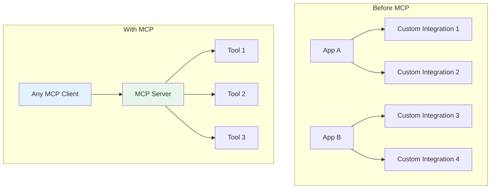
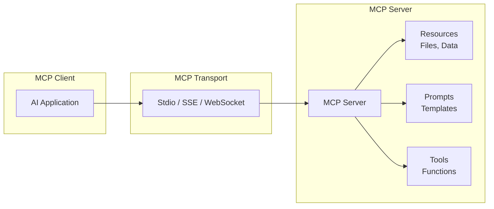

# Phase 3: AI Tool Use & Function Calling

# Part 11: Model Context Protocol (MCP)

**Standardizing AI-tool integration—building interoperable AI services with the Model Context Protocol.**

---

## The Target: What We're Building Right Now

In this part, we're building five powerful MCP components:

1. **An MCP Server** — Expose tools, resources, and prompts
2. **An MCP Client** — Connect to and use MCP servers
3. **A File System Resource** — Expose files and directories
4. **A Database Tool** — Expose database operations
5. **A Complete MCP Integration** — Full server with multiple capabilities

**Why this matters:** MCP is the future of AI-tool integration. It standardizes how AI applications discover and use tools, making your AI services interoperable and future-proof.

---

## The Concept: Understanding Model Context Protocol (MCP)

### The USB-C Analogy

Remember when every device had a different charger? You needed a separate cable for your phone, laptop, camera, and headphones. Then USB-C came along and standardized everything.

**MCP is the USB-C of AI-tool integration.**

Before MCP, every AI application had to implement custom integrations for every tool:
- OpenAI function calling
- Anthropic tool use
- LangChain tools
- Custom APIs

**With MCP, tools are standardized:**
- One protocol works with all AI applications
- Tools are discoverable and interoperable
- Security is built in
- The ecosystem grows together



### What is MCP?

**Model Context Protocol (MCP)** is an open protocol that standardizes how AI applications provide context to and interact with external systems.

**Key components:**

| Component | Description | Analogy |
|-----------|-------------|---------|
| **Client** | AI application that uses MCP | The user of the service |
| **Server** | Service that exposes capabilities | The service provider |
| **Resources** | Data and content | Files, database records |
| **Prompts** | Reusable prompt templates | Form templates |
| **Tools** | Executable functions | API endpoints |

### MCP Architecture



### MCP Capabilities

#### 1. Resources

Resources are data that the server can provide to the client:

```json
{
  "resources": [
    {
      "uri": "file:///data/report.pdf",
      "name": "Weekly Report",
      "description": "The weekly business report",
      "mimeType": "application/pdf"
    },
    {
      "uri": "db://customers",
      "name": "Customer Database",
      "description": "Customer records"
    }
  ]
}
```

#### 2. Prompts

Prompts are reusable templates that clients can use:

```json
{
  "prompts": [
    {
      "name": "analyze_data",
      "description": "Analyze data with specific parameters",
      "arguments": [
        {"name": "dataset", "description": "The dataset to analyze"},
        {"name": "analysis_type", "description": "Type of analysis"}
      ]
    }
  ]
}
```

#### 3. Tools

Tools are executable functions:

```json
{
  "tools": [
    {
      "name": "query_database",
      "description": "Query the database",
      "parameters": {
        "type": "object",
        "properties": {
          "query": {"type": "string"},
          "limit": {"type": "integer"}
        }
      }
    }
  ]
}
```

### MCP Transports

| Transport | Description | Use Case |
|-----------|-------------|----------|
| **Stdio** | Standard input/output | Local processes, CLI tools |
| **SSE** | Server-Sent Events | Web applications, streaming |
| **WebSocket** | WebSocket protocol | Real-time bidirectional |

### Security Considerations

| Concern | Mitigation | Implementation |
|---------|------------|----------------|
| **Authentication** | Verify client identity | API keys, OAuth |
| **Authorization** | Control access | Role-based permissions |
| **Data Privacy** | Protect sensitive data | Encryption, redaction |
| **Tool Abuse** | Prevent misuse | Rate limiting, validation |
| **Injection** | Prevent injection attacks | Input sanitization |

---

## The Implementation: Building Our MCP Tools

### Target File Structure

```
phase-3-tool-use/
└── module-11-mcp/
    ├── 01_mcp_server.py
    ├── 02_mcp_client.py
    ├── 03_file_system_resource.py
    ├── 04_database_tool.py
    ├── 05_complete_mcp_integration.py
    ├── requirements.txt
    └── README.md
```

### Step 1: MCP Server

Create `01_mcp_server.py`:

```python
#!/usr/bin/env python3
"""
Module 11: MCP Server

A Model Context Protocol server implementation.
"""

import os
import sys
from pathlib import Path
import json
import asyncio
import logging
from typing import Dict, Any, List, Optional, Callable, Union
from dataclasses import dataclass, field
from datetime import datetime
import uuid

sys.path.insert(0, str(Path(__file__).parent.parent.parent.parent))

from shared.utils.config import load_config
from shared.utils.logging import setup_logging

setup_logging(debug=False)
config = load_config()

@dataclass
class MCPResource:
    """An MCP resource."""
    uri: str
    name: str
    description: str = ""
    mimeType: str = "text/plain"
    data: Optional[Any] = None

@dataclass
class MCPPrompt:
    """An MCP prompt template."""
    name: str
    description: str = ""
    arguments: List[Dict[str, str]] = field(default_factory=list)
    template: str = ""

@dataclass
class MCPTool:
    """An MCP tool."""
    name: str
    description: str = ""
    parameters: Dict[str, Any] = field(default_factory=dict)
    handler: Optional[Callable] = None

@dataclass
class MCPRequest:
    """An MCP request."""
    id: str
    method: str
    params: Dict[str, Any]
    timestamp: str = field(default_factory=lambda: datetime.now().isoformat())

@dataclass
class MCPResponse:
    """An MCP response."""
    id: str
    result: Optional[Any] = None
    error: Optional[Dict[str, Any]] = None
    timestamp: str = field(default_factory=lambda: datetime.now().isoformat())

class MCPServer:
    """
    A Model Context Protocol server.
    
    Features:
    - Resource management
    - Prompt templates
    - Tool execution
    - Request handling
    - Capability discovery
    """
    
    def __init__(self, name: str = "MCP Server", version: str = "1.0.0"):
        """
        Initialize the MCP server.
        
        Args:
            name: Server name
            version: Server version
        """
        self.name = name
        self.version = version
        self.resources: Dict[str, MCPResource] = {}
        self.prompts: Dict[str, MCPPrompt] = {}
        self.tools: Dict[str, MCPTool] = {}
        self.handlers: Dict[str, Callable] = {}
        self.request_count = 0
        
        # Register default handlers
        self._register_default_handlers()
    
    def _register_default_handlers(self) -> None:
        """Register default request handlers."""
        self.handlers["initialize"] = self._handle_initialize
        self.handlers["resources/list"] = self._handle_list_resources
        self.handlers["resources/read"] = self._handle_read_resource
        self.handlers["prompts/list"] = self._handle_list_prompts
        self.handlers["prompts/get"] = self._handle_get_prompt
        self.handlers["tools/list"] = self._handle_list_tools
        self.handlers["tools/call"] = self._handle_call_tool
    
    def add_resource(self, resource: MCPResource) -> None:
        """
        Add a resource to the server.
        
        Args:
            resource: Resource to add
        """
        self.resources[resource.uri] = resource
        print(f"📁 Added resource: {resource.name} ({resource.uri})")
    
    def add_prompt(self, prompt: MCPPrompt) -> None:
        """
        Add a prompt template to the server.
        
        Args:
            prompt: Prompt to add
        """
        self.prompts[prompt.name] = prompt
        print(f"📝 Added prompt: {prompt.name}")
    
    def add_tool(self, tool: MCPTool) -> None:
        """
        Add a tool to the server.
        
        Args:
            tool: Tool to add
        """
        self.tools[tool.name] = tool
        print(f"🔧 Added tool: {tool.name}")
    
    def handle_request(self, request_data: Dict[str, Any]) -> Dict[str, Any]:
        """
        Handle an incoming request.
        
        Args:
            request_data: Request data
            
        Returns:
            Response data
        """
        # Parse request
        request = MCPRequest(
            id=request_data.get("id", str(uuid.uuid4())),
            method=request_data.get("method", ""),
            params=request_data.get("params", {})
        )
        
        self.request_count += 1
        
        print(f"\n📨 Request #{self.request_count}: {request.method}")
        print(f"   Params: {json.dumps(request.params)[:100]}...")
        
        try:
            # Find handler
            handler = self.handlers.get(request.method)
            if not handler:
                return self._error_response(
                    request.id,
                    -32601,
                    f"Method not found: {request.method}"
                )
            
            # Execute handler
            result = handler(request.params)
            
            return {
                "jsonrpc": "2.0",
                "id": request.id,
                "result": result
            }
            
        except Exception as e:
            print(f"❌ Error: {e}")
            return self._error_response(
                request.id,
                -32000,
                str(e)
            )
    
    def _error_response(self, id: str, code: int, message: str) -> Dict[str, Any]:
        """Create an error response."""
        return {
            "jsonrpc": "2.0",
            "id": id,
            "error": {
                "code": code,
                "message": message
            }
        }
    
    def _handle_initialize(self, params: Dict[str, Any]) -> Dict[str, Any]:
        """Handle initialize request."""
        return {
            "protocolVersion": "0.1.0",
            "serverInfo": {
                "name": self.name,
                "version": self.version
            },
            "capabilities": {
                "resources": {
                    "subscribe": True,
                    "listChanged": True
                },
                "prompts": {
                    "listChanged": True
                },
                "tools": {
                    "listChanged": True
                }
            }
        }
    
    def _handle_list_resources(self, params: Dict[str, Any]) -> Dict[str, Any]:
        """Handle list resources request."""
        resources = []
        for resource in self.resources.values():
            resources.append({
                "uri": resource.uri,
                "name": resource.name,
                "description": resource.description,
                "mimeType": resource.mimeType
            })
        
        return {"resources": resources}
    
    def _handle_read_resource(self, params: Dict[str, Any]) -> Dict[str, Any]:
        """Handle read resource request."""
        uri = params.get("uri")
        if not uri:
            raise ValueError("Missing uri parameter")
        
        resource = self.resources.get(uri)
        if not resource:
            raise ValueError(f"Resource not found: {uri}")
        
        return {
            "contents": [
                {
                    "uri": resource.uri,
                    "mimeType": resource.mimeType,
                    "text": str(resource.data) if resource.data else ""
                }
            ]
        }
    
    def _handle_list_prompts(self, params: Dict[str, Any]) -> Dict[str, Any]:
        """Handle list prompts request."""
        prompts = []
        for prompt in self.prompts.values():
            prompts.append({
                "name": prompt.name,
                "description": prompt.description,
                "arguments": prompt.arguments
            })
        
        return {"prompts": prompts}
    
    def _handle_get_prompt(self, params: Dict[str, Any]) -> Dict[str, Any]:
        """Handle get prompt request."""
        name = params.get("name")
        if not name:
            raise ValueError("Missing name parameter")
        
        prompt = self.prompts.get(name)
        if not prompt:
            raise ValueError(f"Prompt not found: {name}")
        
        # Render with arguments if provided
        arguments = params.get("arguments", {})
        rendered = prompt.template
        
        for key, value in arguments.items():
            rendered = rendered.replace(f"{{{{{key}}}}}", str(value))
        
        return {
            "description": prompt.description,
            "messages": [
                {
                    "role": "user",
                    "content": {
                        "type": "text",
                        "text": rendered
                    }
                }
            ]
        }
    
    def _handle_list_tools(self, params: Dict[str, Any]) -> Dict[str, Any]:
        """Handle list tools request."""
        tools = []
        for tool in self.tools.values():
            tools.append({
                "name": tool.name,
                "description": tool.description,
                "parameters": tool.parameters
            })
        
        return {"tools": tools}
    
    def _handle_call_tool(self, params: Dict[str, Any]) -> Dict[str, Any]:
        """Handle call tool request."""
        name = params.get("name")
        if not name:
            raise ValueError("Missing name parameter")
        
        tool = self.tools.get(name)
        if not tool:
            raise ValueError(f"Tool not found: {name}")
        
        if not tool.handler:
            raise ValueError(f"No handler for tool: {name}")
        
        arguments = params.get("arguments", {})
        result = tool.handler(**arguments)
        
        return {
            "content": [
                {
                    "type": "text",
                    "text": json.dumps(result, indent=2)
                }
            ]
        }
    
    def serve_stdio(self) -> None:
        """Serve requests via stdio."""
        print(f"\n🚀 MCP Server '{self.name}' v{self.version} starting...")
        print("📡 Listening on stdio...")
        
        while True:
            try:
                # Read request from stdin
                line = sys.stdin.readline()
                if not line:
                    break
                
                # Parse request
                request_data = json.loads(line)
                
                # Handle request
                response_data = self.handle_request(request_data)
                
                # Send response to stdout
                print(json.dumps(response_data), flush=True)
                
            except json.JSONDecodeError as e:
                print(f"❌ JSON parse error: {e}")
            except KeyboardInterrupt:
                break
            except Exception as e:
                print(f"❌ Error: {e}")
    
    def get_server_info(self) -> Dict[str, Any]:
        """Get server information."""
        return {
            "name": self.name,
            "version": self.version,
            "resources": len(self.resources),
            "prompts": len(self.prompts),
            "tools": len(self.tools),
            "requests_handled": self.request_count
        }

def demonstrate_mcp_server():
    """Demonstrate the MCP server."""
    print("\n" + "="*80)
    print("🔌 MCP SERVER DEMONSTRATION")
    print("="*80)
    
    # Create server
    server = MCPServer("Demo MCP Server", "1.0.0")
    
    # Add a resource
    server.add_resource(MCPResource(
        uri="demo://hello",
        name="Hello Resource",
        description="A simple hello resource",
        data="Hello, World!"
    ))
    
    # Add a prompt
    server.add_prompt(MCPPrompt(
        name="greeting",
        description="A greeting prompt",
        arguments=[
            {"name": "name", "description": "Name to greet"}
        ],
        template="Hello, {{name}}! Welcome to the MCP server."
    ))
    
    # Add a tool
    def add_numbers(a: int, b: int) -> Dict[str, Any]:
        return {"result": a + b, "operation": "addition"}
    
    server.add_tool(MCPTool(
        name="add",
        description="Add two numbers",
        parameters={
            "type": "object",
            "properties": {
                "a": {"type": "integer", "description": "First number"},
                "b": {"type": "integer", "description": "Second number"}
            },
            "required": ["a", "b"]
        },
        handler=add_numbers
    ))
    
    # Show server info
    print("\n📊 Server Information:")
    print(json.dumps(server.get_server_info(), indent=2))
    
    # Simulate a request
    print("\n📨 Simulating a request:")
    print("-"*40)
    
    request = {
        "id": "test-1",
        "method": "resources/list",
        "params": {}
    }
    
    response = server.handle_request(request)
    print(json.dumps(response, indent=2))
    
    print("\n💡 The server is ready to handle requests via:")
    print("   - Stdio (for local processes)")
    print("   - SSE (for web applications)")
    print("   - WebSocket (for real-time communication)")

def main():
    """Run the MCP server demonstration."""
    print("\n" + "="*80)
    print("AI TUTORIAL SERIES - MCP SERVER")
    print("="*80)
    
    demonstrate_mcp_server()
    
    print("\n📋 To run the server with stdio:")
    print("   python mcp_server.py --stdio")

if __name__ == "__main__":
    main()
```

### Step 2: MCP Client

Create `02_mcp_client.py`:

```python
#!/usr/bin/env python3
"""
Module 11: MCP Client

A Model Context Protocol client implementation.
"""

import os
import sys
from pathlib import Path
import json
import subprocess
import asyncio
from typing import Dict, Any, List, Optional
from dataclasses import dataclass
import uuid
import threading
import queue

sys.path.insert(0, str(Path(__file__).parent.parent.parent.parent))

from shared.utils.config import load_config
from shared.utils.logging import setup_logging

setup_logging(debug=False)
config = load_config()

class MCPClient:
    """
    A Model Context Protocol client.
    
    Features:
    - Connect to MCP servers
    - Discover capabilities
    - Read resources
    - Get prompts
    - Call tools
    """
    
    def __init__(self, server_command: Optional[List[str]] = None):
        """
        Initialize the MCP client.
        
        Args:
            server_command: Command to start the server process
        """
        self.server_command = server_command
        self.process = None
        self.requests: Dict[str, asyncio.Future] = {}
        self.response_queue = queue.Queue()
        self.request_counter = 0
        self.connected = False
        self.server_info = None
        self.capabilities = {}
        self.resources = []
        self.prompts = []
        self.tools = []
    
    def start_server(self) -> None:
        """Start the MCP server process."""
        if not self.server_command:
            raise ValueError("Server command not provided")
        
        print(f"🚀 Starting MCP server: {' '.join(self.server_command)}")
        
        self.process = subprocess.Popen(
            self.server_command,
            stdin=subprocess.PIPE,
            stdout=subprocess.PIPE,
            stderr=subprocess.PIPE,
            text=True,
            bufsize=1
        )
        
        # Start response reader thread
        reader_thread = threading.Thread(target=self._read_responses, daemon=True)
        reader_thread.start()
    
    def _read_responses(self) -> None:
        """Read responses from the server."""
        while self.process and self.process.stdout:
            line = self.process.stdout.readline()
            if not line:
                break
            
            try:
                response = json.loads(line)
                self.response_queue.put(response)
            except json.JSONDecodeError:
                continue
    
    def _send_request(self, method: str, params: Dict[str, Any] = None) -> Dict[str, Any]:
        """
        Send a request to the server.
        
        Args:
            method: Request method
            params: Request parameters
            
        Returns:
            Response data
        """
        if not self.process:
            raise RuntimeError("Server not started")
        
        request_id = str(uuid.uuid4())
        self.request_counter += 1
        
        request = {
            "jsonrpc": "2.0",
            "id": request_id,
            "method": method,
            "params": params or {}
        }
        
        # Send request
        self.process.stdin.write(json.dumps(request) + "\n")
        self.process.stdin.flush()
        
        # Wait for response
        while True:
            try:
                response = self.response_queue.get(timeout=30)
                if response.get("id") == request_id:
                    if "error" in response:
                        raise Exception(response["error"].get("message", "Unknown error"))
                    return response.get("result", {})
            except queue.Empty:
                raise TimeoutError("No response from server")
    
    def initialize(self) -> Dict[str, Any]:
        """
        Initialize the connection to the server.
        
        Returns:
            Server information
        """
        result = self._send_request("initialize", {
            "protocolVersion": "0.1.0",
            "clientInfo": {
                "name": "MCP Client",
                "version": "1.0.0"
            }
        })
        
        self.connected = True
        self.server_info = result.get("serverInfo", {})
        self.capabilities = result.get("capabilities", {})
        
        print(f"✅ Connected to MCP server: {self.server_info.get('name')}")
        
        return result
    
    def list_resources(self) -> List[Dict[str, Any]]:
        """
        List all available resources.
        
        Returns:
            List of resources
        """
        result = self._send_request("resources/list")
        self.resources = result.get("resources", [])
        return self.resources
    
    def read_resource(self, uri: str) -> Dict[str, Any]:
        """
        Read a resource.
        
        Args:
            uri: Resource URI
            
        Returns:
            Resource content
        """
        result = self._send_request("resources/read", {"uri": uri})
        contents = result.get("contents", [])
        return contents[0] if contents else {}
    
    def list_prompts(self) -> List[Dict[str, Any]]:
        """
        List all available prompts.
        
        Returns:
            List of prompts
        """
        result = self._send_request("prompts/list")
        self.prompts = result.get("prompts", [])
        return self.prompts
    
    def get_prompt(self, name: str, arguments: Dict[str, Any] = None) -> Dict[str, Any]:
        """
        Get a prompt.
        
        Args:
            name: Prompt name
            arguments: Prompt arguments
            
        Returns:
            Prompt content
        """
        result = self._send_request("prompts/get", {
            "name": name,
            "arguments": arguments or {}
        })
        return result
    
    def list_tools(self) -> List[Dict[str, Any]]:
        """
        List all available tools.
        
        Returns:
            List of tools
        """
        result = self._send_request("tools/list")
        self.tools = result.get("tools", [])
        return self.tools
    
    def call_tool(self, name: str, arguments: Dict[str, Any] = None) -> Dict[str, Any]:
        """
        Call a tool.
        
        Args:
            name: Tool name
            arguments: Tool arguments
            
        Returns:
            Tool result
        """
        result = self._send_request("tools/call", {
            "name": name,
            "arguments": arguments or {}
        })
        return result
    
    def close(self) -> None:
        """Close the connection to the server."""
        if self.process:
            self.process.terminate()
            self.process = None
        
        self.connected = False
        print("🔌 Disconnected from MCP server")

def demonstrate_mcp_client():
    """Demonstrate the MCP client."""
    print("\n" + "="*80)
    print("🔌 MCP CLIENT DEMONSTRATION")
    print("="*80)
    
    # For demonstration, we'll show how the client would work
    # In a real implementation, you'd connect to an actual server
    
    print("\n📋 MCP Client Usage Examples:")
    print("-"*40)
    
    examples = """
    # Example 1: Connect to a server
    from mcp_client import MCPClient
    
    client = MCPClient(["python", "mcp_server.py"])
    client.start_server()
    client.initialize()
    
    # Example 2: List resources
    resources = client.list_resources()
    for resource in resources:
        print(f"Resource: {resource['name']} ({resource['uri']})")
    
    # Example 3: Read a resource
    content = client.read_resource("demo://hello")
    print(f"Content: {content.get('text')}")
    
    # Example 4: List prompts
    prompts = client.list_prompts()
    for prompt in prompts:
        print(f"Prompt: {prompt['name']}")
    
    # Example 5: Get a prompt
    prompt = client.get_prompt("greeting", {"name": "Alice"})
    print(f"Prompt: {prompt}")
    
    # Example 6: List tools
    tools = client.list_tools()
    for tool in tools:
        print(f"Tool: {tool['name']}")
    
    # Example 7: Call a tool
    result = client.call_tool("add", {"a": 5, "b": 3})
    print(f"Result: {result}")
    
    # Example 8: Close the connection
    client.close()
    """
    
    print(examples)
    
    print("\n💡 MCP Client Features:")
    print("   • Connect to any MCP server")
    print("   • Discover capabilities dynamically")
    print("   • Read resources")
    print("   • Get prompt templates")
    print("   • Call tools")
    print("   • Auto-discovery of server capabilities")

def main():
    """Run the MCP client demonstration."""
    print("\n" + "="*80)
    print("AI TUTORIAL SERIES - MCP CLIENT")
    print("="*80)
    
    demonstrate_mcp_client()

if __name__ == "__main__":
    main()
```

### Step 3: File System Resource

Create `03_file_system_resource.py`:

```python
#!/usr/bin/env python3
"""
Module 11: File System Resource

Expose files and directories as MCP resources.
"""

import os
import sys
from pathlib import Path
import json
import base64
from typing import Dict, Any, List, Optional
from datetime import datetime

sys.path.insert(0, str(Path(__file__).parent.parent.parent.parent))

from shared.utils.config import load_config
from shared.utils.logging import setup_logging
from mcp_server import MCPServer, MCPResource

setup_logging(debug=False)
config = load_config()

class FileSystemResource:
    """
    Expose files and directories as MCP resources.
    
    Features:
    - File and directory listing
    - File content reading
    - Various mime types
    - Security restrictions
    """
    
    def __init__(self, base_path: str, server: Optional[MCPServer] = None):
        """
        Initialize the file system resource.
        
        Args:
            base_path: Base directory to expose
            server: MCP server to register with
        """
        self.base_path = Path(base_path).resolve()
        self.server = server
        
        if not self.base_path.exists():
            raise ValueError(f"Base path does not exist: {base_path}")
        
        if not self.base_path.is_dir():
            raise ValueError(f"Base path is not a directory: {base_path}")
    
    def register_resources(self, server: MCPServer) -> None:
        """
        Register all file system resources.
        
        Args:
            server: MCP server to register with
        """
        self.server = server
        
        # Register the root directory
        self._register_directory(self.base_path, "/")
        
        print(f"📁 Registered file system resources from: {self.base_path}")
    
    def _register_directory(self, path: Path, uri_path: str) -> None:
        """
        Register a directory and its contents.
        
        Args:
            path: Path to register
            uri_path: URI path for the resource
        """
        # Register the directory itself
        self._register_file(path, uri_path)
        
        # Register contents
        try:
            for item in sorted(path.iterdir()):
                if item.is_dir():
                    self._register_directory(item, f"{uri_path}{item.name}/")
                else:
                    self._register_file(item, f"{uri_path}{item.name}")
        except PermissionError:
            pass  # Skip directories we can't access
    
    def _register_file(self, path: Path, uri_path: str) -> None:
        """
        Register a single file.
        
        Args:
            path: Path to register
            uri_path: URI path for the resource
        """
        # Determine mime type
        mime_type = self._get_mime_type(path)
        
        # Create resource
        resource = MCPResource(
            uri=f"file://{uri_path}",
            name=path.name,
            description=f"File: {path.name}",
            mimeType=mime_type,
            data=self._get_file_content(path)
        )
        
        self.server.add_resource(resource)
    
    def _get_file_content(self, path: Path) -> str:
        """
        Get the content of a file.
        
        Args:
            path: Path to the file
            
        Returns:
            File content as string
        """
        try:
            if path.is_file():
                with open(path, 'r', encoding='utf-8') as f:
                    return f.read()
            elif path.is_dir():
                # List directory contents
                items = []
                for item in path.iterdir():
                    items.append(f"{'📁' if item.is_dir() else '📄'} {item.name}")
                return "\n".join(items)
        except:
            return f"[Error reading {path.name}]"
        
        return ""
    
    def _get_mime_type(self, path: Path) -> str:
        """
        Get the mime type of a file.
        
        Args:
            path: Path to the file
            
        Returns:
            Mime type string
        """
        extension = path.suffix.lower()
        
        mime_types = {
            '.txt': 'text/plain',
            '.md': 'text/markdown',
            '.json': 'application/json',
            '.py': 'text/x-python',
            '.js': 'application/javascript',
            '.html': 'text/html',
            '.css': 'text/css',
            '.xml': 'application/xml',
            '.csv': 'text/csv',
            '.pdf': 'application/pdf',
            '.jpg': 'image/jpeg',
            '.jpeg': 'image/jpeg',
            '.png': 'image/png',
            '.gif': 'image/gif',
            '.svg': 'image/svg+xml',
            '.zip': 'application/zip',
        }
        
        return mime_types.get(extension, 'application/octet-stream')

def demonstrate_file_system_resource():
    """Demonstrate the file system resource."""
    print("\n" + "="*80)
    print("📁 FILE SYSTEM RESOURCE DEMONSTRATION")
    print("="*80)
    
    # Create server
    server = MCPServer("File System MCP Server", "1.0.0")
    
    # Define a base path
    base_path = Path(__file__).parent / "mcp_resources"
    base_path.mkdir(exist_ok=True)
    
    # Create some sample files
    sample_files = {
        "README.md": "# File System Resources\n\nThis is a sample file.",
        "config.json": '{"name": "MCP Demo", "version": "1.0.0"}',
        "data.txt": "Hello, this is a text file."
    }
    
    for filename, content in sample_files.items():
        file_path = base_path / filename
        if not file_path.exists():
            with open(file_path, 'w') as f:
                f.write(content)
    
    # Create subdirectory with files
    sub_dir = base_path / "subdir"
    sub_dir.mkdir(exist_ok=True)
    with open(sub_dir / "example.txt", 'w') as f:
        f.write("This is in a subdirectory.")
    
    # Register resources
    fs = FileSystemResource(base_path)
    fs.register_resources(server)
    
    print("\n📊 Registered Resources:")
    for resource in server.resources.values():
        print(f"   • {resource.name} ({resource.uri})")
        print(f"     MIME: {resource.mimeType}")
        print(f"     Preview: {str(resource.data)[:50]}...")

def main():
    """Run the file system resource demonstration."""
    print("\n" + "="*80)
    print("AI TUTORIAL SERIES - FILE SYSTEM RESOURCE")
    print("="*80)
    
    demonstrate_file_system_resource()

if __name__ == "__main__":
    main()
```

### Step 4: Database Tool

Create `04_database_tool.py`:

```python
#!/usr/bin/env python3
"""
Module 11: Database Tool

Expose database operations as MCP tools.
"""

import os
import sys
from pathlib import Path
import json
import sqlite3
from typing import Dict, Any, List, Optional

sys.path.insert(0, str(Path(__file__).parent.parent.parent.parent))

from shared.utils.config import load_config
from shared.utils.logging import setup_logging
from mcp_server import MCPServer, MCPTool

setup_logging(debug=False)
config = load_config()

class DatabaseTool:
    """
    Expose database operations as MCP tools.
    
    Features:
    - Query execution
    - Schema inspection
    - Data insertion
    - Safe operations
    """
    
    def __init__(self, db_path: str, server: Optional[MCPServer] = None):
        """
        Initialize the database tool.
        
        Args:
            db_path: Path to the database
            server: MCP server to register with
        """
        self.db_path = db_path
        self.server = server
        self.connection = None
        
        # Initialize database
        self._init_database()
    
    def _init_database(self) -> None:
        """Initialize the database with sample data."""
        conn = self._get_connection()
        cursor = conn.cursor()
        
        # Create tables
        cursor.execute('''
            CREATE TABLE IF NOT EXISTS users (
                id INTEGER PRIMARY KEY AUTOINCREMENT,
                name TEXT NOT NULL,
                email TEXT UNIQUE NOT NULL,
                age INTEGER,
                city TEXT,
                created_at TIMESTAMP DEFAULT CURRENT_TIMESTAMP
            )
        ''')
        
        cursor.execute('''
            CREATE TABLE IF NOT EXISTS products (
                id INTEGER PRIMARY KEY AUTOINCREMENT,
                name TEXT NOT NULL,
                price REAL NOT NULL,
                category TEXT,
                stock INTEGER DEFAULT 0
            )
        ''')
        
        # Insert sample data if empty
        cursor.execute("SELECT COUNT(*) FROM users")
        if cursor.fetchone()[0] == 0:
            sample_users = [
                ("Alice Johnson", "alice@example.com", 28, "New York"),
                ("Bob Smith", "bob@example.com", 35, "Los Angeles"),
                ("Charlie Brown", "charlie@example.com", 42, "Chicago"),
            ]
            cursor.executemany(
                "INSERT INTO users (name, email, age, city) VALUES (?, ?, ?, ?)",
                sample_users
            )
        
        cursor.execute("SELECT COUNT(*) FROM products")
        if cursor.fetchone()[0] == 0:
            sample_products = [
                ("Laptop", 999.99, "Electronics", 10),
                ("Keyboard", 49.99, "Electronics", 25),
                ("Mouse", 29.99, "Electronics", 30),
                ("Book", 19.99, "Books", 50),
            ]
            cursor.executemany(
                "INSERT INTO products (name, price, category, stock) VALUES (?, ?, ?, ?)",
                sample_products
            )
        
        conn.commit()
        cursor.close()
    
    def _get_connection(self) -> sqlite3.Connection:
        """Get a database connection."""
        if self.connection is None:
            self.connection = sqlite3.connect(self.db_path)
            self.connection.row_factory = sqlite3.Row
        return self.connection
    
    def query(self, query: str, limit: int = 100) -> Dict[str, Any]:
        """
        Execute a database query.
        
        Args:
            query: SQL query
            limit: Maximum rows to return
            
        Returns:
            Query results
        """
        try:
            # Validate query
            query_lower = query.lower().strip()
            
            # Block dangerous operations
            dangerous = ['drop database', 'truncate', 'alter table']
            if any(danger in query_lower for danger in dangerous):
                return {"success": False, "error": "Dangerous operation blocked"}
            
            # Only allow SELECT for safety in this demo
            if not query_lower.startswith('select'):
                return {"success": False, "error": "Only SELECT queries are allowed"}
            
            # Add limit if not present
            if 'limit' not in query_lower:
                query = f"{query} LIMIT {limit}"
            
            conn = self._get_connection()
            cursor = conn.cursor()
            cursor.execute(query)
            
            rows = cursor.fetchall()
            results = [dict(row) for row in rows]
            
            return {
                "success": True,
                "results": results,
                "row_count": len(results),
                "query": query
            }
            
        except Exception as e:
            return {
                "success": False,
                "error": str(e),
                "query": query
            }
    
    def get_tables(self) -> Dict[str, Any]:
        """
        Get list of tables in the database.
        
        Returns:
            List of tables
        """
        try:
            conn = self._get_connection()
            cursor = conn.cursor()
            
            cursor.execute("SELECT name FROM sqlite_master WHERE type='table'")
            tables = [row[0] for row in cursor.fetchall()]
            
            return {
                "success": True,
                "tables": tables
            }
            
        except Exception as e:
            return {
                "success": False,
                "error": str(e)
            }
    
    def get_table_schema(self, table_name: str) -> Dict[str, Any]:
        """
        Get the schema of a table.
        
        Args:
            table_name: Name of the table
            
        Returns:
            Table schema
        """
        try:
            conn = self._get_connection()
            cursor = conn.cursor()
            
            cursor.execute(f"PRAGMA table_info({table_name})")
            columns = cursor.fetchall()
            
            return {
                "success": True,
                "table": table_name,
                "columns": [dict(col) for col in columns]
            }
            
        except Exception as e:
            return {
                "success": False,
                "error": str(e)
            }
    
    def register_tools(self, server: MCPServer) -> None:
        """
        Register database tools with the MCP server.
        
        Args:
            server: MCP server to register with
        """
        self.server = server
        
        # Query tool
        server.add_tool(MCPTool(
            name="query_database",
            description="Execute a SELECT query on the database",
            parameters={
                "type": "object",
                "properties": {
                    "query": {
                        "type": "string",
                        "description": "SQL SELECT query to execute"
                    },
                    "limit": {
                        "type": "integer",
                        "description": "Maximum rows to return",
                        "default": 100
                    }
                },
                "required": ["query"]
            },
            handler=self.query
        ))
        
        # Get tables tool
        server.add_tool(MCPTool(
            name="get_tables",
            description="Get list of tables in the database",
            parameters={
                "type": "object",
                "properties": {}
            },
            handler=self.get_tables
        ))
        
        # Get table schema tool
        server.add_tool(MCPTool(
            name="get_table_schema",
            description="Get the schema of a table",
            parameters={
                "type": "object",
                "properties": {
                    "table_name": {
                        "type": "string",
                        "description": "Name of the table"
                    }
                },
                "required": ["table_name"]
            },
            handler=self.get_table_schema
        ))
        
        print(f"🗄️ Registered database tools for: {self.db_path}")

def demonstrate_database_tool():
    """Demonstrate the database tool."""
    print("\n" + "="*80)
    print("🗄️ DATABASE TOOL DEMONSTRATION")
    print("="*80)
    
    # Create server
    server = MCPServer("Database MCP Server", "1.0.0")
    
    # Create database tool
    db_path = "mcp_database.db"
    db = DatabaseTool(db_path)
    db.register_tools(server)
    
    # Test the tools
    print("\n📋 Testing Database Tools:")
    print("-"*40)
    
    # Test get tables
    result = db.get_tables()
    print(f"\n📊 Tables: {result.get('tables', [])}")
    
    # Test query
    result = db.query("SELECT * FROM users")
    if result["success"]:
        print(f"\n📊 Users:")
        for row in result["results"]:
            print(f"   • {row['name']} ({row['age']}) - {row['city']}")
    
    # Test schema
    result = db.get_table_schema("users")
    if result["success"]:
        print(f"\n📊 User Schema:")
        for col in result["columns"]:
            print(f"   • {col['name']}: {col['type']}")
    
    # Test product data
    result = db.query("SELECT * FROM products")
    if result["success"]:
        print(f"\n📊 Products:")
        for row in result["results"]:
            print(f"   • {row['name']}: ${row['price']} (Stock: {row['stock']})")

def main():
    """Run the database tool demonstration."""
    print("\n" + "="*80)
    print("AI TUTORIAL SERIES - DATABASE TOOL")
    print("="*80)
    
    demonstrate_database_tool()

if __name__ == "__main__":
    main()
```

### Step 5: Complete MCP Integration

Create `05_complete_mcp_integration.py`:

```python
#!/usr/bin/env python3
"""
Module 11: Complete MCP Integration

Full MCP server with resources, prompts, and tools.
"""

import os
import sys
from pathlib import Path
import json
from typing import Dict, Any, List, Optional
from datetime import datetime

sys.path.insert(0, str(Path(__file__).parent.parent.parent.parent))

from shared.utils.config import load_config
from shared.utils.logging import setup_logging
from mcp_server import MCPServer, MCPResource, MCPPrompt, MCPTool
from file_system_resource import FileSystemResource
from database_tool import DatabaseTool

setup_logging(debug=False)
config = load_config()

class CompleteMCPIntegration:
    """
    Complete MCP server with all capabilities.
    
    Features:
    - File system resources
    - Database tools
    - Prompt templates
    - Custom tools
    - Full capability discovery
    """
    
    def __init__(self, name: str = "Complete MCP Server", version: str = "1.0.0"):
        """
        Initialize the complete MCP integration.
        
        Args:
            name: Server name
            version: Server version
        """
        self.server = MCPServer(name, version)
        self.base_path = Path(__file__).parent / "mcp_resources"
        self.db_path = "mcp_complete.db"
        
        # Initialize components
        self._init_resources()
        self._init_prompts()
        self._init_tools()
        self._init_custom_functionality()
    
    def _init_resources(self) -> None:
        """Initialize resources."""
        # Create sample resources
        sample_resources = {
            "welcome": {
                "content": "Welcome to the Complete MCP Server!\n\nThis server demonstrates all MCP capabilities.",
                "mime": "text/plain"
            },
            "about": {
                "content": json.dumps({
                    "name": self.server.name,
                    "version": self.server.version,
                    "capabilities": ["resources", "prompts", "tools"],
                    "features": ["file_system", "database", "custom_tools"]
                }, indent=2),
                "mime": "application/json"
            }
        }
        
        for name, data in sample_resources.items():
            self.server.add_resource(MCPResource(
                uri=f"demo://{name}",
                name=name.capitalize(),
                description=f"Demo resource: {name}",
                mimeType=data["mime"],
                data=data["content"]
            ))
        
        # Register file system resources
        if self.base_path.exists():
            fs = FileSystemResource(self.base_path)
            fs.register_resources(self.server)
    
    def _init_prompts(self) -> None:
        """Initialize prompt templates."""
        prompts = [
            MCPPrompt(
                name="data_analysis",
                description="Analyze data with specific parameters",
                arguments=[
                    {"name": "dataset", "description": "The dataset to analyze"},
                    {"name": "analysis_type", "description": "Type of analysis: basic/detailed/custom"}
                ],
                template="You are analyzing the {{dataset}} dataset.\n\nAnalysis type: {{analysis_type}}\n\nPlease provide:\n1. Key insights\n2. Important patterns\n3. Recommendations\n\nDataset description: [Provide details about the dataset]"
            ),
            MCPPrompt(
                name="code_review",
                description="Review code with specific focus",
                arguments=[
                    {"name": "language", "description": "Programming language"},
                    {"name": "focus", "description": "Focus areas: performance/security/readability"}
                ],
                template="Review the following {{language}} code.\n\nFocus areas: {{focus}}\n\nProvide feedback on:\n1. Code quality\n2. Best practices\n3. Potential issues\n4. Suggested improvements"
            ),
            MCPPrompt(
                name="report_generation",
                description="Generate a structured report",
                arguments=[
                    {"name": "topic", "description": "Report topic"},
                    {"name": "audience", "description": "Target audience"},
                    {"name": "length", "description": "Length: short/medium/long"}
                ],
                template="Generate a {{length}} report on {{topic}} for {{audience}}.\n\nReport structure:\n1. Executive Summary\n2. Introduction\n3. Key Findings\n4. Analysis\n5. Recommendations\n6. Conclusion"
            )
        ]
        
        for prompt in prompts:
            self.server.add_prompt(prompt)
    
    def _init_tools(self) -> None:
        """Initialize tools."""
        # Register database tools
        db = DatabaseTool(self.db_path)
        db.register_tools(self.server)
        
        # Custom tools
        def get_current_time() -> Dict[str, Any]:
            """Get the current time."""
            now = datetime.now()
            return {
                "iso": now.isoformat(),
                "timestamp": now.timestamp(),
                "date": now.strftime("%Y-%m-%d"),
                "time": now.strftime("%H:%M:%S"),
                "timezone": "UTC"
            }
        
        self.server.add_tool(MCPTool(
            name="get_time",
            description="Get current date and time",
            parameters={
                "type": "object",
                "properties": {}
            },
            handler=get_current_time
        ))
        
        def calculate(expression: str) -> Dict[str, Any]:
            """Calculate a mathematical expression."""
            try:
                # Safe evaluation
                allowed_names = {"abs": abs, "round": round, "min": min, "max": max}
                result = eval(expression, {"__builtins__": {}}, allowed_names)
                return {"expression": expression, "result": result, "success": True}
            except Exception as e:
                return {"expression": expression, "error": str(e), "success": False}
        
        self.server.add_tool(MCPTool(
            name="calculate",
            description="Calculate a mathematical expression",
            parameters={
                "type": "object",
                "properties": {
                    "expression": {
                        "type": "string",
                        "description": "Mathematical expression to evaluate"
                    }
                },
                "required": ["expression"]
            },
            handler=calculate
        ))
        
        def analyze_text(text: str, analysis_type: str = "basic") -> Dict[str, Any]:
            """Analyze text for basic metrics."""
            words = text.split()
            sentences = text.split('.')
            
            return {
                "text_length": len(text),
                "word_count": len(words),
                "sentence_count": len([s for s in sentences if s.strip()]),
                "avg_word_length": sum(len(w) for w in words) / len(words) if words else 0,
                "analysis_type": analysis_type
            }
        
        self.server.add_tool(MCPTool(
            name="analyze_text",
            description="Analyze text for basic metrics",
            parameters={
                "type": "object",
                "properties": {
                    "text": {"type": "string", "description": "Text to analyze"},
                    "analysis_type": {
                        "type": "string",
                        "description": "Type of analysis",
                        "enum": ["basic", "detailed"]
                    }
                },
                "required": ["text"]
            },
            handler=analyze_text
        ))
    
    def _init_custom_functionality(self) -> None:
        """Initialize custom functionality."""
        # Add some custom handlers if needed
        pass
    
    def serve(self) -> None:
        """Start the MCP server."""
        print("\n" + "="*80)
        print(f"🚀 Starting {self.server.name} v{self.server.version}")
        print("="*80)
        
        print("\n📊 Server Capabilities:")
        print(f"   Resources: {len(self.server.resources)}")
        print(f"   Prompts: {len(self.server.prompts)}")
        print(f"   Tools: {len(self.server.tools)}")
        
        print("\n📋 Available Resources:")
        for resource in self.server.resources.values():
            print(f"   • {resource.name}: {resource.uri}")
        
        print("\n📋 Available Prompts:")
        for prompt in self.server.prompts.values():
            print(f"   • {prompt.name}: {prompt.description}")
        
        print("\n📋 Available Tools:")
        for tool in self.server.tools.values():
            print(f"   • {tool.name}: {tool.description}")
        
        print("\n" + "="*80)
        print("📡 Server listening on stdio...")
        
        # Serve requests
        self.server.serve_stdio()

def demonstrate_complete_mcp():
    """Demonstrate the complete MCP integration."""
    print("\n" + "="*80)
    print("🔌 COMPLETE MCP INTEGRATION DEMONSTRATION")
    print("="*80)
    
    # Create integration
    integration = CompleteMCPIntegration("Complete MCP Server", "1.0.0")
    
    # Show the capabilities
    print("\n📊 Integration Info:")
    info = integration.server.get_server_info()
    print(json.dumps(info, indent=2))
    
    print("\n💡 To run the complete MCP server:")
    print("   1. Save this file as complete_mcp.py")
    print("   2. Run: python complete_mcp.py")
    print("   3. The server will handle MCP requests via stdio")
    print("\n📋 Test with a client:")
    print("   python mcp_client.py --server complete_mcp.py")

def main():
    """Run the complete MCP integration demonstration."""
    print("\n" + "="*80)
    print("AI TUTORIAL SERIES - COMPLETE MCP INTEGRATION")
    print("="*80)
    
    demonstrate_complete_mcp()

if __name__ == "__main__":
    main()
```

---

## The Verification: Testing Your Implementation

### Step 1: Install Dependencies

Create `requirements.txt`:

```txt
# Module 11 dependencies
python-dotenv>=1.0.0
```

Install them:

```bash
cd ~/ai-tutorial-series/phase-3-tool-use/module-11-mcp
pip install -r requirements.txt
```

### Step 2: Test the MCP Server

```bash
python 01_mcp_server.py
```

**Expected Output:**
- Server initialization
- Resource registration
- Prompt templates
- Tool registration
- Request handling

### Step 3: Test the MCP Client

```bash
python 02_mcp_client.py
```

**Expected Output:**
- Client examples
- Connection method
- Request handling
- Response processing

### Step 4: Test the File System Resource

```bash
python 03_file_system_resource.py
```

**Expected Output:**
- File system registration
- Resource creation
- Mime type detection
- Content reading

### Step 5: Test the Database Tool

```bash
python 04_database_tool.py
```

**Expected Output:**
- Database initialization
- Table creation
- Sample data
- Query execution
- Schema inspection

### Step 6: Test the Complete MCP Integration

```bash
python 05_complete_mcp_integration.py
```

**Expected Output:**
- Complete server setup
- All capabilities
- Resource listing
- Prompt templates
- Tool registration

---

## Key Takeaways

By completing this module, you've:

✅ **Built an MCP server** with full capability support
✅ **Created an MCP client** for connecting to servers
✅ **Implemented file system resources** for data access
✅ **Created database tools** for data operations
✅ **Built a complete MCP integration** with all features

### The Mental Model to Carry Forward

```
┌─────────────────────────────────────────────────────────────────┐
│                      MCP MENTAL MODEL                          │
├─────────────────────────────────────────────────────────────────┤
│                                                                 │
│  1. MCP standardizes AI-tool integration                      │
│  2. Resources provide data and content                        │
│  3. Prompts are reusable templates                            │
│  4. Tools are executable functions                            │
│  5. Servers expose capabilities                               │
│  6. Clients discover and use capabilities                    │
│  7. Transports handle communication (stdio, SSE, WebSocket)  │
│  8. Security is built into the protocol                      │
│                                                                 │
└─────────────────────────────────────────────────────────────────┘
```

### MCP Best Practices

| Practice | Why | How |
|----------|-----|-----|
| **Define Clear Resources** | Easy discovery | Use descriptive names and URIs |
| **Provide Templates** | Reusable prompts | Document arguments |
| **Validate Inputs** | Security | Sanitize all inputs |
| **Handle Errors** | Reliability | Return structured errors |
| **Document Capabilities** | Usability | Describe everything |
| **Secure Communications** | Safety | Use authentication, encryption |

---

## What's Next

**Congratulations! You've completed Phase 3: AI Tool Use & Function Calling.**

You now understand:
- Function calling and tool definitions
- Tool orchestration and workflows
- Model Context Protocol (MCP)
- Building interoperable AI services

**In Phase 4: Retrieval-Augmented Generation (RAG)** , you'll learn:
- Embeddings and vector databases
- Building RAG pipelines
- Document ingestion and chunking
- Advanced RAG techniques
