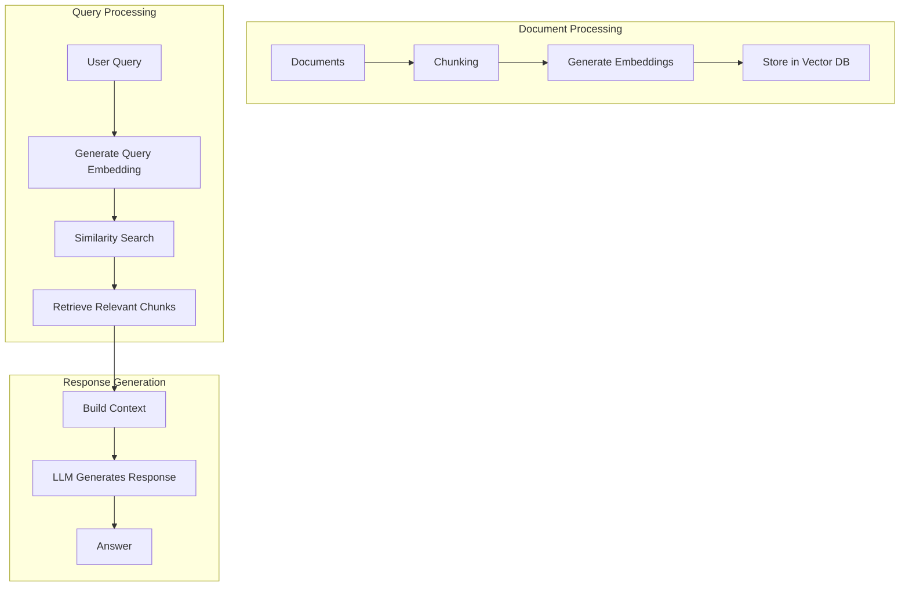

# Phase 4: Retrieval-Augmented Generation (RAG)

> **Objective:** Connect LLMs to external knowledge instead of relying solely on model memory.

---

# Part 12: Embeddings & Vector Databases

**The foundation of semantic search and RAG—understanding embeddings, vector databases, and similarity search.**

---

## The Target: What We're Building Right Now

In this part, we're building six powerful tools:

1. **A Document Chunker** — Split documents into optimal chunks for embedding
2. **An Embedding Generator** — Generate embeddings for text chunks
3. **A Vector Store** — Store and retrieve embeddings efficiently
4. **A Similarity Search Engine** — Find similar content using embeddings
5. **A Metadata Filter** — Filter search results by metadata
6. **A Vector Database Manager** — Manage vector collections with persistence

**Why this matters:** RAG is one of the most powerful techniques in modern AI. It allows LLMs to access external knowledge, reducing hallucinations and enabling domain-specific applications. Understanding embeddings and vector databases is the foundation of all RAG systems.

---

## The Concept: Understanding Embeddings and Vector Databases

### The Library Analogy

Imagine you're building a massive library with an intelligent search system:

- **Books** = Your documents (PDFs, websites, emails)
- **Chapters** = Document chunks (pieces of text)
- **Card Catalog** = Vector database (stores embeddings)
- **Librarian** = The retrieval system
- **Search Query** = User question

When someone asks a question:

1. The librarian converts the question into a "concept fingerprint" (embedding)
2. The librarian looks through the card catalog for similar fingerprints
3. The librarian finds the most relevant chapters
4. The librarian presents those chapters to the reader

**This is exactly how RAG works.**



### What Are Vector Databases?

**Vector databases** are specialized databases designed to store and search high-dimensional vectors (embeddings).

| Feature | Traditional DB | Vector DB |
|---------|---------------|-----------|
| **Data Type** | Structured data | Vectors (arrays of numbers) |
| **Search** | Exact matches | Similarity search |
| **Indexing** | B-trees, hash tables | Approximate Nearest Neighbor (ANN) |
| **Query** | SQL, key-value | Vector similarity |
| **Use Case** | CRUD operations | Semantic search, recommendation |

### Popular Vector Databases

| Database | Type | Key Features | Best For |
|----------|------|--------------|----------|
| **Chroma** | Embedded | Simple, Python-native | Development, prototyping |
| **Pinecone** | Cloud | Managed, scalable | Production, enterprise |
| **FAISS** | Library | Fast, efficient | Research, custom solutions |
| **Weaviate** | Hybrid | Graph + vector | Complex data relationships |
| **Milvus** | Distributed | Scalable, GPU support | Large-scale deployments |
| **pgvector** | PostgreSQL extension | SQL integration | PostgreSQL users |

### Chunking Strategies

Chunking is the process of splitting documents into smaller pieces for embedding.

| Strategy | Description | Pros | Cons |
|----------|-------------|------|------|
| **Fixed Size** | Split by token count | Simple, predictable | May break semantic units |
| **Sentence** | Split by sentences | Preserves meaning | Inconsistent sizes |
| **Paragraph** | Split by paragraphs | Natural units | May be too large |
| **Semantic** | Split by meaning | Best semantic coherence | Complex to implement |
| **Recursive** | Try different separators | Flexible, robust | Can be slow |

### Embedding Models Comparison

| Model | Dimensions | Use Case | Cost |
|-------|------------|----------|------|
| **text-embedding-3-small** | 1536 | General purpose | $0.02/1M tokens |
| **text-embedding-3-large** | 3072 | High accuracy | $0.13/1M tokens |
| **text-embedding-ada-002** | 1536 | Legacy | $0.02/1M tokens |
| **BAAI/bge-large-en-v1.5** | 1024 | Open source | Free (local) |
| **sentence-transformers/all-MiniLM-L6-v2** | 384 | Lightweight | Free (local) |

---

## The Implementation: Building Our Vector Tools

### Target File Structure

```
phase-4-rag/
└── module-12-embeddings-vectordb/
    ├── 01_document_chunker.py
    ├── 02_embedding_generator.py
    ├── 03_vector_store.py
    ├── 04_similarity_search.py
    ├── 05_metadata_filter.py
    ├── 06_vector_db_manager.py
    ├── requirements.txt
    └── README.md
```

### Step 1: Document Chunker

Create `01_document_chunker.py`:

```python
#!/usr/bin/env python3
"""
Module 12: Document Chunker

Split documents into optimal chunks for embedding and retrieval.
"""

import os
import sys
from pathlib import Path
import re
from typing import List, Dict, Any, Optional, Tuple
from dataclasses import dataclass
import tiktoken

sys.path.insert(0, str(Path(__file__).parent.parent.parent.parent))

from shared.utils.config import load_config
from shared.utils.logging import setup_logging

setup_logging(debug=False)
config = load_config()

@dataclass
class DocumentChunk:
    """A chunk of a document with metadata."""
    text: str
    metadata: Dict[str, Any]
    chunk_index: int
    token_count: int
    start_char: int
    end_char: int

class DocumentChunker:
    """
    Split documents into chunks for embedding.
    
    Features:
    - Multiple chunking strategies
    - Token counting
    - Metadata preservation
    - Overlap support
    """
    
    def __init__(
        self,
        chunk_size: int = 500,
        chunk_overlap: int = 50,
        strategy: str = "recursive",
        model_name: str = "gpt-4o-mini"
    ):
        """
        Initialize the document chunker.
        
        Args:
            chunk_size: Target chunk size in tokens
            chunk_overlap: Overlap between chunks in tokens
            strategy: Chunking strategy
            model_name: Model for token counting
        """
        self.chunk_size = chunk_size
        self.chunk_overlap = chunk_overlap
        self.strategy = strategy
        self.model_name = model_name
        
        # Initialize tokenizer
        try:
            self.encoding = tiktoken.encoding_for_model(model_name)
        except:
            self.encoding = tiktoken.get_encoding("cl100k_base")
        
        # Separators for recursive chunking
        self.separators = [
            "\n\n",  # Paragraphs
            "\n",    # Lines
            ". ",    # Sentences
            " ",     # Words
            ""       # Characters
        ]
    
    def count_tokens(self, text: str) -> int:
        """Count tokens in text."""
        try:
            return len(self.encoding.encode(text))
        except:
            return len(text) // 4  # Rough estimate
    
    def chunk_document(
        self,
        text: str,
        metadata: Optional[Dict[str, Any]] = None,
        chunk_size: Optional[int] = None
    ) -> List[DocumentChunk]:
        """
        Chunk a document using the configured strategy.
        
        Args:
            text: Document text
            metadata: Document metadata
            chunk_size: Override chunk size
            
        Returns:
            List of document chunks
        """
        if chunk_size is None:
            chunk_size = self.chunk_size
        
        metadata = metadata or {}
        chunks = []
        
        if self.strategy == "recursive":
            chunks = self._chunk_recursive(text, metadata, chunk_size)
        elif self.strategy == "fixed":
            chunks = self._chunk_fixed(text, metadata, chunk_size)
        elif self.strategy == "sentence":
            chunks = self._chunk_sentence(text, metadata, chunk_size)
        elif self.strategy == "paragraph":
            chunks = self._chunk_paragraph(text, metadata, chunk_size)
        elif self.strategy == "semantic":
            chunks = self._chunk_semantic(text, metadata, chunk_size)
        else:
            raise ValueError(f"Unknown strategy: {self.strategy}")
        
        # Add chunk indices
        for i, chunk in enumerate(chunks):
            chunk.chunk_index = i
        
        return chunks
    
    def _chunk_recursive(
        self,
        text: str,
        metadata: Dict[str, Any],
        chunk_size: int
    ) -> List[DocumentChunk]:
        """
        Recursive chunking using separators.
        
        This tries increasingly smaller separators to create chunks
        that are close to the target size.
        """
        chunks = []
        
        def split_by_separator(text: str, separators: List[str]) -> List[str]:
            """Split text by the first separator that works."""
            if not separators or not text:
                return [text]
            
            separator = separators[0]
            remaining_separators = separators[1:]
            
            if not separator:
                return [text]
            
            # Split by the separator
            parts = text.split(separator)
            
            # If we have multiple parts, keep the separator
            if len(parts) > 1 and separator:
                parts = [p + separator for p in parts[:-1]] + [parts[-1]]
            
            # If splitting didn't help or we're at the end, return
            if len(parts) <= 1 or not remaining_separators:
                # Use the current separator even if too large
                return [text]
            
            # Try to split each part further
            result = []
            for part in parts:
                if self.count_tokens(part) > chunk_size:
                    result.extend(split_by_separator(part, remaining_separators))
                else:
                    result.append(part)
            
            return result
        
        # Split the text
        parts = split_by_separator(text, self.separators)
        
        # Merge parts into chunks
        current_chunk = ""
        current_start = 0
        char_position = 0
        
        for part in parts:
            part_tokens = self.count_tokens(part)
            
            # Check if adding this part would exceed the chunk size
            if self.count_tokens(current_chunk + part) > chunk_size and current_chunk:
                # Save the current chunk
                end_char = char_position
                chunks.append(DocumentChunk(
                    text=current_chunk.strip(),
                    metadata=metadata.copy(),
                    chunk_index=len(chunks),
                    token_count=self.count_tokens(current_chunk),
                    start_char=current_start,
                    end_char=end_char
                ))
                
                # Start a new chunk with overlap
                overlap_text = self._get_overlap(current_chunk)
                current_chunk = overlap_text + part
                current_start = char_position - len(overlap_text)
            else:
                current_chunk += part
            
            char_position += len(part)
        
        # Add the final chunk
        if current_chunk.strip():
            chunks.append(DocumentChunk(
                text=current_chunk.strip(),
                metadata=metadata.copy(),
                chunk_index=len(chunks),
                token_count=self.count_tokens(current_chunk),
                start_char=current_start,
                end_char=char_position
            ))
        
        return chunks
    
    def _get_overlap(self, text: str) -> str:
        """Get the overlapping text for the next chunk."""
        if self.chunk_overlap <= 0:
            return ""
        
        tokens = self.encoding.encode(text)
        if len(tokens) <= self.chunk_overlap:
            return text
        
        overlap_tokens = tokens[-self.chunk_overlap:]
        return self.encoding.decode(overlap_tokens)
    
    def _chunk_fixed(
        self,
        text: str,
        metadata: Dict[str, Any],
        chunk_size: int
    ) -> List[DocumentChunk]:
        """Fixed-size chunking by tokens."""
        tokens = self.encoding.encode(text)
        chunks = []
        
        for i in range(0, len(tokens), chunk_size - self.chunk_overlap):
            chunk_tokens = tokens[i:i + chunk_size]
            chunk_text = self.encoding.decode(chunk_tokens)
            
            start_char = len(self.encoding.decode(tokens[:i]))
            end_char = start_char + len(chunk_text)
            
            chunks.append(DocumentChunk(
                text=chunk_text.strip(),
                metadata=metadata.copy(),
                chunk_index=len(chunks),
                token_count=len(chunk_tokens),
                start_char=start_char,
                end_char=end_char
            ))
        
        return chunks
    
    def _chunk_sentence(
        self,
        text: str,
        metadata: Dict[str, Any],
        chunk_size: int
    ) -> List[DocumentChunk]:
        """Chunk by sentences."""
        # Split into sentences
        sentences = re.split(r'(?<=[.!?])\s+', text)
        
        chunks = []
        current_chunk = ""
        
        for sentence in sentences:
            # Check if adding this sentence would exceed the chunk size
            if self.count_tokens(current_chunk + sentence) > chunk_size and current_chunk:
                # Save the current chunk
                chunks.append(DocumentChunk(
                    text=current_chunk.strip(),
                    metadata=metadata.copy(),
                    chunk_index=len(chunks),
                    token_count=self.count_tokens(current_chunk),
                    start_char=0,  # Would need to track positions
                    end_char=0
                ))
                
                # Start a new chunk with overlap
                overlap_text = self._get_overlap(current_chunk)
                current_chunk = overlap_text + sentence
            else:
                current_chunk += sentence
        
        # Add the final chunk
        if current_chunk.strip():
            chunks.append(DocumentChunk(
                text=current_chunk.strip(),
                metadata=metadata.copy(),
                chunk_index=len(chunks),
                token_count=self.count_tokens(current_chunk),
                start_char=0,
                end_char=0
            ))
        
        return chunks
    
    def _chunk_paragraph(
        self,
        text: str,
        metadata: Dict[str, Any],
        chunk_size: int
    ) -> List[DocumentChunk]:
        """Chunk by paragraphs."""
        paragraphs = text.split('\n\n')
        
        chunks = []
        current_chunk = ""
        
        for paragraph in paragraphs:
            if not paragraph.strip():
                continue
            
            # Check if adding this paragraph would exceed chunk size
            if self.count_tokens(current_chunk + paragraph) > chunk_size and current_chunk:
                chunks.append(DocumentChunk(
                    text=current_chunk.strip(),
                    metadata=metadata.copy(),
                    chunk_index=len(chunks),
                    token_count=self.count_tokens(current_chunk),
                    start_char=0,
                    end_char=0
                ))
                
                overlap_text = self._get_overlap(current_chunk)
                current_chunk = overlap_text + paragraph
            else:
                current_chunk += '\n\n' + paragraph if current_chunk else paragraph
        
        if current_chunk.strip():
            chunks.append(DocumentChunk(
                text=current_chunk.strip(),
                metadata=metadata.copy(),
                chunk_index=len(chunks),
                token_count=self.count_tokens(current_chunk),
                start_char=0,
                end_char=0
            ))
        
        return chunks
    
    def _chunk_semantic(
        self,
        text: str,
        metadata: Dict[str, Any],
        chunk_size: int
    ) -> List[DocumentChunk]:
        """
        Semantic chunking based on meaning.
        
        Note: This is a simplified version. In production, you'd use
        embeddings to determine semantic boundaries.
        """
        # For simplicity, use paragraph chunking with semantic awareness
        return self._chunk_paragraph(text, metadata, chunk_size)

def demonstrate_chunker():
    """Demonstrate the document chunker."""
    print("\n" + "="*80)
    print("📄 DOCUMENT CHUNKER DEMONSTRATION")
    print("="*80)
    
    # Sample text
    sample_text = """
    Artificial Intelligence (AI) is the simulation of human intelligence in machines.
    
    The core of AI is machine learning, where algorithms learn from data.
    Deep learning, a subset of machine learning, uses neural networks with multiple layers.
    
    Large Language Models (LLMs) like GPT-4 and Claude are trained on vast amounts of text.
    These models can understand and generate human-like text with remarkable accuracy.
    
    One of the most powerful applications of LLMs is Retrieval-Augmented Generation (RAG).
    RAG combines the knowledge of LLMs with external data sources for more accurate responses.
    """
    
    # Test different chunking strategies
    strategies = ["recursive", "fixed", "sentence", "paragraph"]
    
    for strategy in strategies:
        print(f"\n📋 Strategy: {strategy}")
        print("-"*40)
        
        chunker = DocumentChunker(
            chunk_size=100,
            chunk_overlap=20,
            strategy=strategy
        )
        
        chunks = chunker.chunk_document(sample_text)
        
        print(f"   Created {len(chunks)} chunks")
        for i, chunk in enumerate(chunks):
            print(f"   Chunk {i+1}: {chunk.token_count} tokens - {chunk.text[:50]}...")
            print(f"      Metadata: {chunk.metadata}")

def main():
    """Run the document chunker demonstration."""
    print("\n" + "="*80)
    print("AI TUTORIAL SERIES - DOCUMENT CHUNKER")
    print("="*80)
    
    demonstrate_chunker()

if __name__ == "__main__":
    main()
```

### Step 2: Embedding Generator

Create `02_embedding_generator.py`:

```python
#!/usr/bin/env python3
"""
Module 12: Embedding Generator

Generate embeddings for text chunks using various models.
"""

import os
import sys
from pathlib import Path
import json
import numpy as np
from typing import List, Dict, Any, Optional, Union
import time
from openai import OpenAI

sys.path.insert(0, str(Path(__file__).parent.parent.parent.parent))

from shared.utils.config import load_config
from shared.utils.logging import setup_logging
from document_chunker import DocumentChunk

setup_logging(debug=False)
config = load_config()

class EmbeddingGenerator:
    """
    Generate embeddings for text using various models.
    
    Features:
    - Multiple embedding models
    - Batch processing
    - Cost tracking
    - Embedding caching
    """
    
    def __init__(
        self,
        model: str = "text-embedding-3-small",
        provider: str = "openai"
    ):
        """
        Initialize the embedding generator.
        
        Args:
            model: Embedding model to use
            provider: Provider to use
        """
        self.model = model
        self.provider = provider
        
        # Initialize provider client
        if provider == "openai":
            api_key = config.get("openai_api_key")
            if not api_key:
                raise ValueError("OpenAI API key not found")
            self.client = OpenAI(api_key=api_key)
        else:
            raise ValueError(f"Provider {provider} not supported")
        
        # Model dimensions
        self.dimensions = {
            "text-embedding-3-small": 1536,
            "text-embedding-3-large": 3072,
            "text-embedding-ada-002": 1536
        }
        
        # Cost tracking
        self.cost_per_1m_tokens = {
            "text-embedding-3-small": 0.02,
            "text-embedding-3-large": 0.13,
            "text-embedding-ada-002": 0.02
        }
        
        self.total_tokens = 0
        self.total_cost = 0.0
        self.requests = 0
    
    def generate_embedding(self, text: str) -> np.ndarray:
        """
        Generate an embedding for a single text.
        
        Args:
            text: Text to embed
            
        Returns:
            Embedding vector
        """
        if self.provider == "openai":
            response = self.client.embeddings.create(
                model=self.model,
                input=text
            )
            
            # Track usage
            tokens = response.usage.total_tokens
            self.total_tokens += tokens
            self.requests += 1
            
            # Calculate cost
            cost_per_token = self.cost_per_1m_tokens.get(self.model, 0) / 1_000_000
            self.total_cost += tokens * cost_per_token
            
            return np.array(response.data[0].embedding)
        else:
            raise ValueError(f"Provider {self.provider} not supported")
    
    def generate_embeddings(
        self,
        texts: List[str],
        batch_size: int = 100,
        show_progress: bool = True
    ) -> List[np.ndarray]:
        """
        Generate embeddings for multiple texts.
        
        Args:
            texts: List of texts to embed
            batch_size: Number of texts per batch
            show_progress: Show progress bar
            
        Returns:
            List of embedding vectors
        """
        embeddings = []
        total_texts = len(texts)
        
        for i in range(0, total_texts, batch_size):
            batch = texts[i:i + batch_size]
            
            if show_progress:
                print(f"\r📊 Processing batch {i//batch_size + 1}/{(total_texts + batch_size - 1)//batch_size}...", end="")
            
            batch_embeddings = self._generate_batch(batch)
            embeddings.extend(batch_embeddings)
        
        if show_progress:
            print("\n")
        
        return embeddings
    
    def _generate_batch(self, texts: List[str]) -> List[np.ndarray]:
        """
        Generate embeddings for a batch of texts.
        
        Args:
            texts: List of texts to embed
            
        Returns:
            List of embeddings
        """
        if self.provider == "openai":
            response = self.client.embeddings.create(
                model=self.model,
                input=texts
            )
            
            # Track usage
            tokens = response.usage.total_tokens
            self.total_tokens += tokens
            self.requests += 1
            
            # Calculate cost
            cost_per_token = self.cost_per_1m_tokens.get(self.model, 0) / 1_000_000
            self.total_cost += tokens * cost_per_token
            
            return [np.array(data.embedding) for data in response.data]
        else:
            raise ValueError(f"Provider {self.provider} not supported")
    
    def generate_for_chunks(
        self,
        chunks: List[DocumentChunk],
        show_progress: bool = True
    ) -> List[Dict[str, Any]]:
        """
        Generate embeddings for document chunks.
        
        Args:
            chunks: List of document chunks
            show_progress: Show progress
            
        Returns:
            List of chunks with embeddings
        """
        texts = [chunk.text for chunk in chunks]
        embeddings = self.generate_embeddings(texts, show_progress=show_progress)
        
        results = []
        for chunk, embedding in zip(chunks, embeddings):
            results.append({
                "chunk": chunk,
                "embedding": embedding
            })
        
        return results
    
    def get_usage_summary(self) -> Dict[str, Any]:
        """
        Get usage summary.
        
        Returns:
            Usage statistics
        """
        return {
            "model": self.model,
            "requests": self.requests,
            "total_tokens": self.total_tokens,
            "total_cost_usd": self.total_cost,
            "dimensions": self.dimensions.get(self.model, "unknown")
        }

def demonstrate_embedding_generator():
    """Demonstrate the embedding generator."""
    print("\n" + "="*80)
    print("🔢 EMBEDDING GENERATOR DEMONSTRATION")
    print("="*80)
    
    if not config.get("openai_api_key"):
        print("❌ OpenAI API key not available")
        return
    
    # Create generator
    generator = EmbeddingGenerator(model="text-embedding-3-small")
    
    # Sample texts
    texts = [
        "The quick brown fox jumps over the lazy dog.",
        "Machine learning is a subset of artificial intelligence.",
        "The weather today is sunny and warm.",
        "Python is a programming language used for data science."
    ]
    
    # Generate embeddings
    print("\n📋 Generating embeddings:")
    print("-"*40)
    
    embeddings = generator.generate_embeddings(texts, show_progress=True)
    
    for i, (text, embedding) in enumerate(zip(texts, embeddings)):
        print(f"Text {i+1}: '{text[:30]}...'")
        print(f"  Embedding shape: {embedding.shape}")
        print(f"  First 5 values: {embedding[:5]}")
    
    # Show usage
    print("\n📊 Usage Summary:")
    print(json.dumps(generator.get_usage_summary(), indent=2))

def main():
    """Run the embedding generator demonstration."""
    print("\n" + "="*80)
    print("AI TUTORIAL SERIES - EMBEDDING GENERATOR")
    print("="*80)
    
    demonstrate_embedding_generator()

if __name__ == "__main__":
    main()
```

### Step 3: Vector Store

Create `03_vector_store.py`:

```python
#!/usr/bin/env python3
"""
Module 12: Vector Store

Store and retrieve embeddings with metadata.
"""

import os
import sys
from pathlib import Path
import json
import numpy as np
from typing import List, Dict, Any, Optional, Tuple
import pickle
import uuid
from datetime import datetime

sys.path.insert(0, str(Path(__file__).parent.parent.parent.parent))

from shared.utils.config import load_config
from shared.utils.logging import setup_logging

setup_logging(debug=False)
config = load_config()

class VectorStore:
    """
    Store and retrieve vectors with metadata.
    
    Features:
    - Add vectors with metadata
    - Similarity search
    - Metadata filtering
    - Persistence to disk
    - Vector deletion
    """
    
    def __init__(self, dimension: int = 1536):
        """
        Initialize the vector store.
        
        Args:
            dimension: Vector dimension
        """
        self.dimension = dimension
        self.vectors = {}  # id -> vector
        self.metadata = {}  # id -> metadata
        self.ids = []
        self.index = None  # For future FAISS integration
        
        self.stats = {
            "total_vectors": 0,
            "added_at": datetime.now().isoformat(),
            "last_search": None
        }
    
    def add_vector(
        self,
        vector: np.ndarray,
        metadata: Optional[Dict[str, Any]] = None
    ) -> str:
        """
        Add a vector to the store.
        
        Args:
            vector: Vector to add
            metadata: Metadata for the vector
            
        Returns:
            Vector ID
        """
        if len(vector) != self.dimension:
            raise ValueError(f"Vector dimension {len(vector)} does not match store dimension {self.dimension}")
        
        vector_id = str(uuid.uuid4())
        
        self.vectors[vector_id] = vector.copy()
        self.metadata[vector_id] = metadata or {}
        self.ids.append(vector_id)
        self.stats["total_vectors"] += 1
        
        return vector_id
    
    def add_vectors(
        self,
        vectors: List[np.ndarray],
        metadatas: Optional[List[Dict[str, Any]]] = None
    ) -> List[str]:
        """
        Add multiple vectors.
        
        Args:
            vectors: List of vectors
            metadatas: List of metadata dictionaries
            
        Returns:
            List of vector IDs
        """
        if metadatas and len(metadatas) != len(vectors):
            raise ValueError("Number of metadatas must match number of vectors")
        
        metadatas = metadatas or [{} for _ in vectors]
        
        ids = []
        for vector, metadata in zip(vectors, metadatas):
            vector_id = self.add_vector(vector, metadata)
            ids.append(vector_id)
        
        return ids
    
    def search(
        self,
        query_vector: np.ndarray,
        top_k: int = 10,
        filter_metadata: Optional[Dict[str, Any]] = None
    ) -> List[Dict[str, Any]]:
        """
        Search for similar vectors.
        
        Args:
            query_vector: Query vector
            top_k: Number of results to return
            filter_metadata: Metadata filter
            
        Returns:
            List of search results with scores
        """
        if not self.ids:
            return []
        
        # Build list of vectors to search
        ids_to_search = self.ids
        if filter_metadata:
            ids_to_search = []
            for vector_id in self.ids:
                meta = self.metadata[vector_id]
                matches = all(
                    meta.get(key) == value
                    for key, value in filter_metadata.items()
                )
                if matches:
                    ids_to_search.append(vector_id)
        
        if not ids_to_search:
            return []
        
        # Calculate similarities
        results = []
        for vector_id in ids_to_search:
            vector = self.vectors[vector_id]
            similarity = self._cosine_similarity(query_vector, vector)
            
            results.append({
                "id": vector_id,
                "similarity": float(similarity),
                "metadata": self.metadata[vector_id],
                "vector": vector
            })
        
        # Sort by similarity
        results.sort(key=lambda x: x["similarity"], reverse=True)
        
        self.stats["last_search"] = datetime.now().isoformat()
        
        return results[:top_k]
    
    def _cosine_similarity(self, a: np.ndarray, b: np.ndarray) -> float:
        """Calculate cosine similarity between two vectors."""
        return np.dot(a, b) / (np.linalg.norm(a) * np.linalg.norm(b))
    
    def delete_vector(self, vector_id: str) -> bool:
        """
        Delete a vector from the store.
        
        Args:
            vector_id: ID of the vector to delete
            
        Returns:
            True if deleted, False if not found
        """
        if vector_id in self.vectors:
            del self.vectors[vector_id]
            del self.metadata[vector_id]
            self.ids.remove(vector_id)
            self.stats["total_vectors"] -= 1
            return True
        return False
    
    def clear(self) -> None:
        """Clear all vectors from the store."""
        self.vectors = {}
        self.metadata = {}
        self.ids = []
        self.stats["total_vectors"] = 0
        self.stats["last_search"] = None
    
    def save(self, filepath: str) -> None:
        """
        Save the vector store to disk.
        
        Args:
            filepath: Path to save the store
        """
        data = {
            "dimension": self.dimension,
            "vectors": {id: vec.tolist() for id, vec in self.vectors.items()},
            "metadata": self.metadata,
            "ids": self.ids,
            "stats": self.stats
        }
        
        with open(filepath, 'wb') as f:
            pickle.dump(data, f)
        
        print(f"💾 Vector store saved to: {filepath}")
    
    def load(self, filepath: str) -> None:
        """
        Load the vector store from disk.
        
        Args:
            filepath: Path to load the store from
        """
        with open(filepath, 'rb') as f:
            data = pickle.load(f)
        
        self.dimension = data["dimension"]
        self.vectors = {id: np.array(vec) for id, vec in data["vectors"].items()}
        self.metadata = data["metadata"]
        self.ids = data["ids"]
        self.stats = data["stats"]
        
        print(f"📂 Vector store loaded from: {filepath}")
        print(f"   {len(self.ids)} vectors loaded")
    
    def get_stats(self) -> Dict[str, Any]:
        """
        Get store statistics.
        
        Returns:
            Store statistics
        """
        return {
            **self.stats,
            "dimension": self.dimension,
            "total_vectors": len(self.ids)
        }

def demonstrate_vector_store():
    """Demonstrate the vector store."""
    print("\n" + "="*80)
    print("🗄️ VECTOR STORE DEMONSTRATION")
    print("="*80)
    
    # Create store
    store = VectorStore(dimension=1536)
    
    # Create sample vectors
    np.random.seed(42)
    vectors = []
    metadatas = []
    
    topics = ["AI", "ML", "NLP", "Cloud", "Database", "Programming"]
    
    for i in range(20):
        # Create vectors with some structure
        vector = np.random.randn(1536)
        vector = vector / np.linalg.norm(vector)  # Normalize
        
        topic = topics[i % len(topics)]
        
        vectors.append(vector)
        metadatas.append({
            "id": i,
            "topic": topic,
            "content": f"This is document {i} about {topic}",
            "timestamp": datetime.now().isoformat()
        })
    
    # Add vectors
    ids = store.add_vectors(vectors, metadatas)
    print(f"✅ Added {len(ids)} vectors")
    
    # Create a query vector
    query_vector = vectors[0]
    
    # Search
    results = store.search(query_vector, top_k=5)
    
    print("\n🔍 Search Results:")
    print("-"*40)
    for result in results:
        similarity = result["similarity"]
        metadata = result["metadata"]
        print(f"   Similarity: {similarity:.4f}")
        print(f"   Topic: {metadata.get('topic')}")
        print(f"   Content: {metadata.get('content')[:50]}...")
        print()
    
    # Show stats
    print("📊 Store Stats:")
    print(json.dumps(store.get_stats(), indent=2))

def main():
    """Run the vector store demonstration."""
    print("\n" + "="*80)
    print("AI TUTORIAL SERIES - VECTOR STORE")
    print("="*80)
    
    demonstrate_vector_store()

if __name__ == "__main__":
    main()
```

### Step 4: Similarity Search

Create `04_similarity_search.py`:

```python
#!/usr/bin/env python3
"""
Module 12: Similarity Search

Perform similarity search using embeddings with different metrics.
"""

import os
import sys
from pathlib import Path
import json
import numpy as np
from typing import List, Dict, Any, Optional
from sklearn.metrics.pairwise import cosine_similarity, euclidean_distances

sys.path.insert(0, str(Path(__file__).parent.parent.parent.parent))

from shared.utils.config import load_config
from shared.utils.logging import setup_logging
from vector_store import VectorStore
from embedding_generator import EmbeddingGenerator

setup_logging(debug=False)
config = load_config()

class SimilaritySearch:
    """
    Perform similarity search with multiple metrics.
    
    Features:
    - Cosine similarity
    - Euclidean distance
    - Dot product
    - Hybrid search
    """
    
    def __init__(self, vector_store: VectorStore):
        """
        Initialize the similarity search engine.
        
        Args:
            vector_store: Vector store to search
        """
        self.vector_store = vector_store
        self.generator = EmbeddingGenerator()
    
    def search_by_text(
        self,
        query_text: str,
        top_k: int = 10,
        metric: str = "cosine",
        filter_metadata: Optional[Dict[str, Any]] = None
    ) -> List[Dict[str, Any]]:
        """
        Search by text query.
        
        Args:
            query_text: Text query
            top_k: Number of results
            metric: Similarity metric
            filter_metadata: Metadata filter
            
        Returns:
            Search results
        """
        # Generate query embedding
        query_vector = self.generator.generate_embedding(query_text)
        
        return self.search_by_vector(
            query_vector,
            top_k,
            metric,
            filter_metadata
        )
    
    def search_by_vector(
        self,
        query_vector: np.ndarray,
        top_k: int = 10,
        metric: str = "cosine",
        filter_metadata: Optional[Dict[str, Any]] = None
    ) -> List[Dict[str, Any]]:
        """
        Search by vector.
        
        Args:
            query_vector: Query vector
            top_k: Number of results
            metric: Similarity metric
            filter_metadata: Metadata filter
            
        Returns:
            Search results
        """
        # Get vectors to search
        ids = self.vector_store.ids
        if filter_metadata:
            ids = []
            for vector_id in self.vector_store.ids:
                meta = self.vector_store.metadata[vector_id]
                matches = all(
                    meta.get(key) == value
                    for key, value in filter_metadata.items()
                )
                if matches:
                    ids.append(vector_id)
        
        if not ids:
            return []
        
        # Build matrix
        vectors = np.array([self.vector_store.vectors[id] for id in ids])
        query = query_vector.reshape(1, -1)
        
        # Calculate similarities
        if metric == "cosine":
            similarities = cosine_similarity(query, vectors)[0]
        elif metric == "euclidean":
            distances = euclidean_distances(query, vectors)[0]
            # Convert to similarity (1 / (1 + distance))
            similarities = 1 / (1 + distances)
        elif metric == "dot":
            similarities = np.dot(query, vectors.T)[0]
        else:
            raise ValueError(f"Unknown metric: {metric}")
        
        # Create results
        results = []
        for id, similarity in zip(ids, similarities):
            results.append({
                "id": id,
                "similarity": float(similarity),
                "metadata": self.vector_store.metadata[id],
                "metric": metric
            })
        
        # Sort by similarity
        results.sort(key=lambda x: x["similarity"], reverse=True)
        
        return results[:top_k]
    
    def hybrid_search(
        self,
        query_text: str,
        top_k: int = 10,
        weight_semantic: float = 0.7,
        weight_keyword: float = 0.3
    ) -> List[Dict[str, Any]]:
        """
        Hybrid search combining semantic and keyword search.
        
        Args:
            query_text: Query text
            top_k: Number of results
            weight_semantic: Weight for semantic search
            weight_keyword: Weight for keyword search
            
        Returns:
            Search results
        """
        # Semantic search
        semantic_results = self.search_by_text(query_text, top_k * 2)
        
        # Keyword search (simple implementation)
        keyword_scores = {}
        for vector_id in self.vector_store.ids:
            metadata = self.vector_store.metadata[vector_id]
            content = metadata.get("content", "")
            
            # Simple keyword matching
            score = 0
            for word in query_text.lower().split():
                if word in content.lower():
                    score += 1
            
            keyword_scores[vector_id] = score / max(1, len(query_text.split()))
        
        # Combine scores
        combined_scores = {}
        for result in semantic_results:
            vector_id = result["id"]
            semantic_score = result["similarity"]
            keyword_score = keyword_scores.get(vector_id, 0)
            
            combined = (semantic_score * weight_semantic) + (keyword_score * weight_keyword)
            combined_scores[vector_id] = combined
        
        # Sort by combined score
        results = []
        for vector_id in sorted(combined_scores, key=combined_scores.get, reverse=True)[:top_k]:
            results.append({
                "id": vector_id,
                "combined_score": combined_scores[vector_id],
                "semantic_score": next(
                    (r["similarity"] for r in semantic_results if r["id"] == vector_id),
                    0
                ),
                "keyword_score": keyword_scores.get(vector_id, 0),
                "metadata": self.vector_store.metadata[vector_id]
            })
        
        return results

def demonstrate_similarity_search():
    """Demonstrate similarity search."""
    print("\n" + "="*80)
    print("🔍 SIMILARITY SEARCH DEMONSTRATION")
    print("="*80)
    
    if not config.get("openai_api_key"):
        print("❌ OpenAI API key not available")
        return
    
    # Create vector store with sample data
    store = VectorStore(dimension=1536)
    generator = EmbeddingGenerator()
    
    # Sample documents
    documents = [
        {"content": "Python is a programming language used for AI and data science.", "topic": "Programming"},
        {"content": "Machine learning uses algorithms to learn from data.", "topic": "AI"},
        {"content": "Deep learning uses neural networks with multiple layers.", "topic": "AI"},
        {"content": "Natural language processing deals with text and language.", "topic": "NLP"},
        {"content": "Cloud computing provides on-demand computing resources.", "topic": "Cloud"},
        {"content": "Databases store and manage structured data efficiently.", "topic": "Database"},
        {"content": "React is a JavaScript library for building user interfaces.", "topic": "Web"},
        {"content": "Django is a Python web framework for building applications.", "topic": "Web"}
    ]
    
    # Generate embeddings
    texts = [doc["content"] for doc in documents]
    embeddings = generator.generate_embeddings(texts)
    
    # Add to store
    ids = store.add_vectors(embeddings, documents)
    print(f"✅ Added {len(ids)} documents to vector store")
    
    # Create search engine
    search = SimilaritySearch(store)
    
    # Test queries
    queries = [
        "What is programming?",
        "Tell me about artificial intelligence",
        "How do databases work?",
        "What web frameworks are there?"
    ]
    
    for query in queries:
        print(f"\n🔎 Query: '{query}'")
        print("-"*40)
        
        results = search.search_by_text(query, top_k=3)
        
        for i, result in enumerate(results, 1):
            similarity = result["similarity"]
            content = result["metadata"]["content"]
            topic = result["metadata"]["topic"]
            print(f"   {i}. [{topic}] Similarity: {similarity:.4f}")
            print(f"      {content}")
        
        # Show hybrid search for first query
        if query == queries[0]:
            print("\n🎯 Hybrid Search Results:")
            print("-"*40)
            hybrid_results = search.hybrid_search(query, top_k=3)
            
            for i, result in enumerate(hybrid_results, 1):
                combined = result["combined_score"]
                semantic = result["semantic_score"]
                keyword = result["keyword_score"]
                content = result["metadata"]["content"]
                print(f"   {i}. Combined: {combined:.4f} (Semantic: {semantic:.4f}, Keyword: {keyword:.4f})")
                print(f"      {content}")

def main():
    """Run the similarity search demonstration."""
    print("\n" + "="*80)
    print("AI TUTORIAL SERIES - SIMILARITY SEARCH")
    print("="*80)
    
    demonstrate_similarity_search()

if __name__ == "__main__":
    main()
```

### Step 5: Metadata Filter

Create `05_metadata_filter.py`:

```python
#!/usr/bin/env python3
"""
Module 12: Metadata Filter

Filter vector search results by metadata.
"""

import os
import sys
from pathlib import Path
import json
from typing import List, Dict, Any, Optional
from datetime import datetime

sys.path.insert(0, str(Path(__file__).parent.parent.parent.parent))

from shared.utils.config import load_config
from shared.utils.logging import setup_logging
from vector_store import VectorStore
from similarity_search import SimilaritySearch
from embedding_generator import EmbeddingGenerator

setup_logging(debug=False)
config = load_config()

class MetadataFilter:
    """
    Filter vector search results by metadata.
    
    Features:
    - Multiple filter types
    - Boolean filters
    - Range filters
    - Text filters
    - Nested filters
    """
    
    def __init__(self, vector_store: VectorStore):
        """
        Initialize the metadata filter.
        
        Args:
            vector_store: Vector store to filter
        """
        self.vector_store = vector_store
        self.generator = EmbeddingGenerator()
    
    def filter_by_metadata(
        self,
        filters: Dict[str, Any],
        top_k: Optional[int] = None
    ) -> List[Dict[str, Any]]:
        """
        Filter vectors by metadata.
        
        Args:
            filters: Metadata filters
            top_k: Number of results to return
            
        Returns:
            Filtered vectors with metadata
        """
        results = []
        
        for vector_id in self.vector_store.ids:
            metadata = self.vector_store.metadata[vector_id]
            
            if self._matches_filters(metadata, filters):
                results.append({
                    "id": vector_id,
                    "metadata": metadata,
                    "vector": self.vector_store.vectors[vector_id]
                })
        
        if top_k:
            results = results[:top_k]
        
        return results
    
    def _matches_filters(
        self,
        metadata: Dict[str, Any],
        filters: Dict[str, Any]
    ) -> bool:
        """
        Check if metadata matches filters.
        
        Args:
            metadata: Metadata to check
            filters: Filters to apply
            
        Returns:
            True if matches
        """
        for key, value in filters.items():
            # Handle nested filters
            if '.' in key:
                parts = key.split('.')
                current = metadata
                for part in parts:
                    if isinstance(current, dict):
                        current = current.get(part)
                    else:
                        current = None
                        break
                if not self._value_matches(current, value):
                    return False
            else:
                if not self._value_matches(metadata.get(key), value):
                    return False
        
        return True
    
    def _value_matches(self, value: Any, filter_value: Any) -> bool:
        """
        Check if a value matches a filter.
        
        Args:
            value: Value to check
            filter_value: Filter value
            
        Returns:
            True if matches
        """
        # Exact match
        if value == filter_value:
            return True
        
        # List contains
        if isinstance(filter_value, list):
            if isinstance(value, list):
                return any(v in filter_value for v in value)
            return value in filter_value
        
        # Range filter
        if isinstance(filter_value, dict):
            if "min" in filter_value and value < filter_value["min"]:
                return False
            if "max" in filter_value and value > filter_value["max"]:
                return False
            if "in" in filter_value and value not in filter_value["in"]:
                return False
            if "contains" in filter_value:
                if isinstance(value, str):
                    return filter_value["contains"] in value
                if isinstance(value, list):
                    return any(filter_value["contains"] in v for v in value)
                return False
            return True
        
        # Text contains
        if isinstance(value, str) and isinstance(filter_value, str):
            return filter_value.lower() in value.lower()
        
        return False
    
    def search_with_filter(
        self,
        query_text: str,
        metadata_filters: Dict[str, Any],
        top_k: int = 10
    ) -> List[Dict[str, Any]]:
        """
        Search with metadata filters.
        
        Args:
            query_text: Query text
            metadata_filters: Metadata filters
            top_k: Number of results
            
        Returns:
            Search results with metadata
        """
        # First, filter by metadata
        filtered = self.filter_by_metadata(metadata_filters)
        
        if not filtered:
            return []
        
        # Generate query embedding
        query_vector = self.generator.generate_embedding(query_text)
        
        # Search only within filtered vectors
        results = []
        for item in filtered:
            vector = item["vector"]
            similarity = np.dot(query_vector, vector) / (
                np.linalg.norm(query_vector) * np.linalg.norm(vector)
            )
            results.append({
                "id": item["id"],
                "similarity": float(similarity),
                "metadata": item["metadata"]
            })
        
        # Sort by similarity
        results.sort(key=lambda x: x["similarity"], reverse=True)
        
        return results[:top_k]

def demonstrate_metadata_filter():
    """Demonstrate the metadata filter."""
    print("\n" + "="*80)
    print("🔍 METADATA FILTER DEMONSTRATION")
    print("="*80)
    
    if not config.get("openai_api_key"):
        print("❌ OpenAI API key not available")
        return
    
    # Create vector store with sample data
    store = VectorStore(dimension=1536)
    generator = EmbeddingGenerator()
    
    # Sample documents with rich metadata
    documents = [
        {
            "content": "Python is a versatile programming language used for AI.",
            "topic": "Programming",
            "language": "Python",
            "difficulty": 3,
            "year": 2023,
            "tags": ["backend", "data-science"]
        },
        {
            "content": "JavaScript is the language of the web with React and Vue.",
            "topic": "Programming",
            "language": "JavaScript",
            "difficulty": 2,
            "year": 2022,
            "tags": ["frontend", "web"]
        },
        {
            "content": "Machine learning uses algorithms to find patterns in data.",
            "topic": "AI",
            "language": "Python",
            "difficulty": 4,
            "year": 2023,
            "tags": ["ml", "algorithms"]
        },
        {
            "content": "React is a popular frontend library for building UIs.",
            "topic": "Web",
            "language": "JavaScript",
            "difficulty": 3,
            "year": 2022,
            "tags": ["frontend", "ui"]
        },
        {
            "content": "SQL databases like PostgreSQL are used for data storage.",
            "topic": "Database",
            "language": "SQL",
            "difficulty": 3,
            "year": 2021,
            "tags": ["database", "sql"]
        }
    ]
    
    # Generate embeddings
    texts = [doc["content"] for doc in documents]
    embeddings = generator.generate_embeddings(texts)
    
    # Add to store
    store.add_vectors(embeddings, documents)
    
    # Create filter
    filterer = MetadataFilter(store)
    
    # Test different filters
    print("\n📋 Filter: Python documents")
    print("-"*40)
    results = filterer.filter_by_metadata({"language": "Python"})
    for result in results:
        print(f"   {result['metadata']['content']}")
    
    print("\n📋 Filter: AI or ML topics")
    print("-"*40)
    results = filterer.filter_by_metadata({"topic": "AI"})
    for result in results:
        print(f"   {result['metadata']['content']}")
    
    print("\n📋 Filter: Documents from 2022 or newer")
    print("-"*40)
    results = filterer.filter_by_metadata({"year": {"min": 2022}})
    for result in results:
        print(f"   {result['metadata']['content']} ({result['metadata']['year']})")
    
    print("\n📋 Filter: Frontend tags")
    print("-"*40)
    results = filterer.filter_by_metadata({"tags": {"contains": "frontend"}})
    for result in results:
        print(f"   {result['metadata']['content']} ({result['metadata']['tags']})")
    
    # Search with filter
    print("\n🔎 Search: 'programming languages' with Python filter")
    print("-"*40)
    results = filterer.search_with_filter(
        "programming languages",
        {"language": "Python"},
        top_k=3
    )
    for result in results:
        print(f"   Similarity: {result['similarity']:.4f}")
        print(f"   {result['metadata']['content']}")

def main():
    """Run the metadata filter demonstration."""
    print("\n" + "="*80)
    print("AI TUTORIAL SERIES - METADATA FILTER")
    print("="*80)
    
    demonstrate_metadata_filter()

if __name__ == "__main__":
    main()
```

### Step 6: Vector Database Manager

Create `06_vector_db_manager.py`:

```python
#!/usr/bin/env python3
"""
Module 12: Vector Database Manager

Manage vector collections with persistence and advanced features.
"""

import os
import sys
from pathlib import Path
import json
import shutil
from typing import List, Dict, Any, Optional
from datetime import datetime

sys.path.insert(0, str(Path(__file__).parent.parent.parent.parent))

from shared.utils.config import load_config
from shared.utils.logging import setup_logging
from vector_store import VectorStore
from document_chunker import DocumentChunker
from embedding_generator import EmbeddingGenerator

setup_logging(debug=False)
config = load_config()

class VectorDBManager:
    """
    Manage vector databases with collections and persistence.
    
    Features:
    - Collection management
    - Import/export
    - Backup and restore
    - Statistics and monitoring
    """
    
    def __init__(self, base_path: str = "./vector_db"):
        """
        Initialize the vector database manager.
        
        Args:
            base_path: Base path for storing vector databases
        """
        self.base_path = Path(base_path)
        self.base_path.mkdir(exist_ok=True)
        
        self.collections = {}
        self.active_collection = None
        
        # Initialize components
        self.chunker = DocumentChunker()
        self.generator = EmbeddingGenerator()
    
    def create_collection(
        self,
        name: str,
        dimension: int = 1536,
        overwrite: bool = False
    ) -> VectorStore:
        """
        Create a new vector collection.
        
        Args:
            name: Collection name
            dimension: Vector dimension
            overwrite: Overwrite existing collection
            
        Returns:
            Created vector store
        """
        collection_path = self.base_path / name
        
        if collection_path.exists() and not overwrite:
            raise ValueError(f"Collection '{name}' already exists")
        
        # Create collection directory
        collection_path.mkdir(exist_ok=True)
        
        # Create vector store
        store = VectorStore(dimension=dimension)
        store.collection_name = name
        
        # Save metadata
        metadata = {
            "name": name,
            "dimension": dimension,
            "created_at": datetime.now().isoformat(),
            "total_vectors": 0,
            "version": "1.0.0"
        }
        
        with open(collection_path / "metadata.json", 'w') as f:
            json.dump(metadata, f, indent=2)
        
        self.collections[name] = store
        self.active_collection = name
        
        print(f"✅ Created collection: {name}")
        return store
    
    def load_collection(self, name: str) -> VectorStore:
        """
        Load an existing collection.
        
        Args:
            name: Collection name
            
        Returns:
            Loaded vector store
        """
        collection_path = self.base_path / name
        
        if not collection_path.exists():
            raise ValueError(f"Collection '{name}' not found")
        
        # Load metadata
        with open(collection_path / "metadata.json", 'r') as f:
            metadata = json.load(f)
        
        # Create vector store
        store = VectorStore(dimension=metadata["dimension"])
        store.collection_name = name
        
        # Load vectors
        store_path = collection_path / "vectors.pkl"
        if store_path.exists():
            store.load(str(store_path))
        
        self.collections[name] = store
        self.active_collection = name
        
        print(f"✅ Loaded collection: {name} ({len(store.ids)} vectors)")
        return store
    
    def list_collections(self) -> List[Dict[str, Any]]:
        """
        List all collections.
        
        Returns:
            List of collection information
        """
        collections = []
        
        for item in self.base_path.iterdir():
            if item.is_dir():
                metadata_path = item / "metadata.json"
                if metadata_path.exists():
                    with open(metadata_path, 'r') as f:
                        metadata = json.load(f)
                    collections.append(metadata)
        
        return collections
    
    def delete_collection(self, name: str, confirm: bool = False) -> None:
        """
        Delete a collection.
        
        Args:
            name: Collection name
            confirm: Confirmation flag
        """
        if not confirm:
            print(f"⚠️  To delete '{name}', use confirm=True")
            return
        
        collection_path = self.base_path / name
        
        if collection_path.exists():
            shutil.rmtree(collection_path)
            if name in self.collections:
                del self.collections[name]
            print(f"🗑️ Deleted collection: {name}")
    
    def import_documents(
        self,
        collection: str,
        documents: List[Dict[str, Any]],
        chunk_size: int = 500,
        chunk_overlap: int = 50
    ) -> Dict[str, Any]:
        """
        Import documents into a collection.
        
        Args:
            collection: Collection name
            documents: List of document dictionaries
            chunk_size: Chunk size
            chunk_overlap: Chunk overlap
            
        Returns:
            Import statistics
        """
        if collection not in self.collections:
            raise ValueError(f"Collection '{collection}' not found")
        
        store = self.collections[collection]
        
        total_chunks = 0
        total_documents = len(documents)
        
        for doc in documents:
            text = doc.get("content", "")
            metadata = doc.get("metadata", {})
            
            # Chunk the document
            chunks = self.chunker.chunk_document(
                text=text,
                metadata=metadata,
                chunk_size=chunk_size
            )
            
            if not chunks:
                continue
            
            # Generate embeddings
            chunk_texts = [chunk.text for chunk in chunks]
            embeddings = self.generator.generate_embeddings(chunk_texts)
            
            # Add to store
            for chunk, embedding in zip(chunks, embeddings):
                chunk_metadata = {
                    **metadata,
                    "chunk_index": chunk.chunk_index,
                    "chunk_text": chunk.text[:50] + "...",
                    "source": doc.get("source", "unknown")
                }
                store.add_vector(embedding, chunk_metadata)
            
            total_chunks += len(chunks)
        
        # Save the collection
        self._save_collection(collection)
        
        stats = {
            "documents_processed": total_documents,
            "chunks_created": total_chunks,
            "total_vectors": len(store.ids),
            "collection": collection
        }
        
        return stats
    
    def _save_collection(self, name: str) -> None:
        """Save a collection to disk."""
        if name not in self.collections:
            return
        
        store = self.collections[name]
        collection_path = self.base_path / name
        
        # Save vectors
        store.save(str(collection_path / "vectors.pkl"))
        
        # Update metadata
        metadata_path = collection_path / "metadata.json"
        with open(metadata_path, 'r') as f:
            metadata = json.load(f)
        
        metadata["total_vectors"] = len(store.ids)
        metadata["updated_at"] = datetime.now().isoformat()
        
        with open(metadata_path, 'w') as f:
            json.dump(metadata, f, indent=2)
    
    def get_collection_stats(self, name: str) -> Dict[str, Any]:
        """
        Get statistics for a collection.
        
        Args:
            name: Collection name
            
        Returns:
            Collection statistics
        """
        if name not in self.collections:
            raise ValueError(f"Collection '{name}' not found")
        
        store = self.collections[name]
        stats = store.get_stats()
        
        collection_path = self.base_path / name
        metadata_path = collection_path / "metadata.json"
        
        if metadata_path.exists():
            with open(metadata_path, 'r') as f:
                metadata = json.load(f)
            stats["created_at"] = metadata.get("created_at")
            stats["updated_at"] = metadata.get("updated_at")
        
        return stats

def demonstrate_vector_db_manager():
    """Demonstrate the vector database manager."""
    print("\n" + "="*80)
    print("🗄️ VECTOR DATABASE MANAGER DEMONSTRATION")
    print("="*80)
    
    if not config.get("openai_api_key"):
        print("❌ OpenAI API key not available")
        return
    
    # Create manager
    manager = VectorDBManager("./demo_vector_db")
    
    # Create collection
    manager.create_collection("demo_docs", dimension=1536)
    
    # Sample documents
    documents = [
        {
            "content": "Python is a high-level programming language known for its simplicity.",
            "metadata": {"topic": "Programming", "source": "docs.txt"},
            "source": "docs.txt"
        },
        {
            "content": "Machine learning is a method of data analysis that automates model building.",
            "metadata": {"topic": "AI", "source": "docs.txt"},
            "source": "docs.txt"
        },
        {
            "content": "Natural language processing allows computers to understand human language.",
            "metadata": {"topic": "NLP", "source": "docs.txt"},
            "source": "docs.txt"
        }
    ]
    
    # Import documents
    print("\n📋 Importing documents...")
    stats = manager.import_documents("demo_docs", documents)
    
    print(f"\n📊 Import Stats:")
    print(json.dumps(stats, indent=2))
    
    # List collections
    print("\n📋 Collections:")
    collections = manager.list_collections()
    for collection in collections:
        print(f"   {collection['name']}: {collection['total_vectors']} vectors")
    
    # Get collection stats
    print("\n📊 Collection Stats:")
    stats = manager.get_collection_stats("demo_docs")
    print(json.dumps(stats, indent=2))

def main():
    """Run the vector database manager demonstration."""
    print("\n" + "="*80)
    print("AI TUTORIAL SERIES - VECTOR DATABASE MANAGER")
    print("="*80)
    
    demonstrate_vector_db_manager()

if __name__ == "__main__":
    main()
```

---

## The Verification: Testing Your Implementation

### Step 1: Install Dependencies

Create `requirements.txt`:

```txt
# Module 12 dependencies
openai>=1.0.0
numpy>=1.24.0
scikit-learn>=1.3.0
tiktoken>=0.5.0
python-dotenv>=1.0.0
```

Install them:

```bash
cd ~/ai-tutorial-series/phase-4-rag/module-12-embeddings-vectordb
pip install -r requirements.txt
```

### Step 2: Test the Document Chunker

```bash
python 01_document_chunker.py
```

**Expected Output:**
- Multiple chunking strategies demonstrated
- Token counts for each chunk
- Chunk visualization

### Step 3: Test the Embedding Generator

```bash
python 02_embedding_generator.py
```

**Expected Output:**
- Embeddings generated for sample texts
- Usage statistics
- Cost tracking

### Step 4: Test the Vector Store

```bash
python 03_vector_store.py
```

**Expected Output:**
- Vector storage
- Similarity search
- Metadata management
- Persistence

### Step 5: Test the Similarity Search

```bash
python 04_similarity_search.py
```

**Expected Output:**
- Text-to-vector search
- Multiple similarity metrics
- Hybrid search demonstration
- Relevance scoring

### Step 6: Test the Metadata Filter

```bash
python 05_metadata_filter.py
```

**Expected Output:**
- Metadata filtering
- Complex filters
- Search with filters
- Result refinement

### Step 7: Test the Vector Database Manager

```bash
python 06_vector_db_manager.py
```

**Expected Output:**
- Collection management
- Document import
- Persistence
- Statistics

---

## Key Takeaways

By completing this module, you've:

✅ **Built a document chunker** with multiple strategies
✅ **Created an embedding generator** with cost tracking
✅ **Implemented a vector store** with similarity search
✅ **Built a similarity search engine** with multiple metrics
✅ **Created a metadata filter** for refined search
✅ **Implemented a vector database manager** with persistence

### The Mental Model to Carry Forward

```
┌─────────────────────────────────────────────────────────────────┐
│               EMBEDDINGS & VECTOR DB MENTAL MODEL              │
├─────────────────────────────────────────────────────────────────┤
│                                                                 │
│  1. Embeddings convert text to semantic vectors                │
│  2. Similar vectors have similar meanings                     │
│  3. Vector databases store and search embeddings              │
│  4. Chunking prepares documents for embedding                 │
│  5. Cosine similarity measures semantic similarity            │
│  6. Metadata filters refine search results                    │
│  7. Different models trade off speed vs accuracy              │
│  8. Vector databases are the foundation of RAG                │
│                                                                 │
└─────────────────────────────────────────────────────────────────┘
```

### Chunking Recommendations

| Document Type | Strategy | Chunk Size | Overlap |
|---------------|----------|------------|---------|
| **Articles** | Recursive | 500-1000 | 50-100 |
| **Code** | Sentence | 200-500 | 50 |
| **PDFs** | Paragraph | 300-800 | 50-100 |
| **Conversations** | Sentence | 200-400 | 50 |
| **Long Documents** | Semantic | 500-1000 | 100 |

---

## What's Next

**In Part 13: Building a RAG Pipeline**, you'll learn:
- End-to-end RAG implementation
- Document ingestion
- Retrieval strategies
- Context construction
- Response generation with citations
