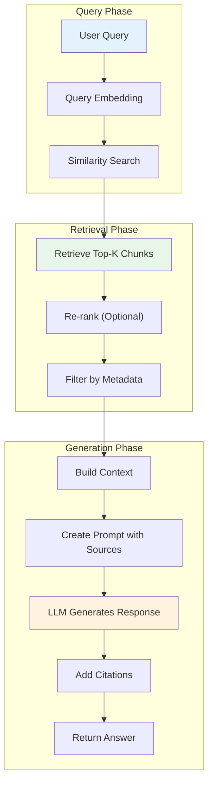

# Phase 4: Retrieval-Augmented Generation (RAG)

# Part 13: Building a RAG Pipeline

**End-to-end retrieval-augmented generation—connecting LLMs to external knowledge for accurate, cited responses.**

---

## The Target: What We're Building Right Now

In this part, we're building seven powerful components:

1. **A Document Ingestion Pipeline** — Process and store documents
2. **A Retrieval Engine** — Find relevant documents for queries
3. **A Context Builder** — Construct optimal context for LLMs
4. **A RAG Generator** — Generate responses with citations
5. **A RAG Pipeline** — End-to-end RAG system
6. **A Citation System** — Track and display sources
7. **A RAG Evaluator** — Measure RAG performance

**Why this matters:** RAG is one of the most important AI techniques in production today. It reduces hallucinations, enables domain-specific knowledge, and builds trust through citations. This is how you build AI that actually knows your data.

---

## The Concept: Understanding RAG

### The Research Assistant Analogy

Imagine you're writing a research paper:

- **You** = The LLM (good at synthesis, not at memorizing facts)
- **Your research assistant** = The retrieval system
- **The library** = Your knowledge base (vector database)
- **The notes** = Retrieved chunks of text
- **The citations** = Source attribution

**The process:**

1. You get a question from your professor
2. You ask your research assistant to find relevant information
3. Your assistant brings you the most relevant notes with sources
4. You synthesize the notes into a well-written answer
5. You add citations to show where the information came from

**This is exactly how RAG works.**



### RAG Pipeline Components

| Component | Description | Key Decisions |
|-----------|-------------|---------------|
| **Document Ingestion** | Process and store documents | Chunking strategy, embedding model |
| **Retrieval** | Find relevant chunks | Top-K, similarity metric, filters |
| **Re-ranking** | Optimize retrieval order | Cross-encoder, score fusion |
| **Context Construction** | Build prompt context | Max tokens, formatting |
| **Generation** | Produce final answer | Model choice, temperature |
| **Citation** | Attribute sources | Source tracking, formatting |

### RAG Quality Factors

| Factor | Impact | How to Optimize |
|--------|--------|-----------------|
| **Chunk Quality** | High | Use semantic chunking |
| **Embedding Quality** | High | Use best embedding model |
| **Retrieval Quality** | Very High | Tune Top-K, use re-ranking |
| **Context Window** | Medium | Stay within limits |
| **Prompt Design** | High | Clear instructions |
| **Model Choice** | High | Use capable models |

---

## The Implementation: Building Our RAG Pipeline

### Target File Structure

```
phase-4-rag/
└── module-13-rag-pipeline/
    ├── 01_document_ingestion.py
    ├── 02_retrieval_engine.py
    ├── 03_context_builder.py
    ├── 04_rag_generator.py
    ├── 05_rag_pipeline.py
    ├── 06_citation_system.py
    ├── 07_rag_evaluator.py
    ├── requirements.txt
    └── README.md
```

### Step 1: Document Ingestion Pipeline

Create `01_document_ingestion.py`:

```python
#!/usr/bin/env python3
"""
Module 13: Document Ingestion Pipeline

Process and store documents for RAG.
"""

import os
import sys
from pathlib import Path
import json
from typing import List, Dict, Any, Optional
from datetime import datetime

sys.path.insert(0, str(Path(__file__).parent.parent.parent.parent))

from shared.utils.config import load_config
from shared.utils.logging import setup_logging
from document_chunker import DocumentChunker
from embedding_generator import EmbeddingGenerator
from vector_store import VectorStore
from vector_db_manager import VectorDBManager

setup_logging(debug=False)
config = load_config()

class DocumentIngestionPipeline:
    """
    Ingest documents for RAG.
    
    Features:
    - Multiple document types
    - Chunking strategies
    - Embedding generation
    - Vector storage
    - Metadata management
    """
    
    def __init__(
        self,
        collection_name: str = "rag_documents",
        chunk_size: int = 500,
        chunk_overlap: int = 50,
        embedding_model: str = "text-embedding-3-small"
    ):
        """
        Initialize the ingestion pipeline.
        
        Args:
            collection_name: Name of the vector collection
            chunk_size: Chunk size for documents
            chunk_overlap: Chunk overlap
            embedding_model: Embedding model to use
        """
        self.collection_name = collection_name
        self.chunk_size = chunk_size
        self.chunk_overlap = chunk_overlap
        self.embedding_model = embedding_model
        
        # Initialize components
        self.chunker = DocumentChunker(
            chunk_size=chunk_size,
            chunk_overlap=chunk_overlap
        )
        self.generator = EmbeddingGenerator(model=embedding_model)
        self.manager = VectorDBManager("./rag_db")
        
        # Get or create collection
        self._init_collection()
        
        # Track statistics
        self.stats = {
            "documents_processed": 0,
            "chunks_created": 0,
            "total_tokens": 0,
            "start_time": datetime.now().isoformat()
        }
    
    def _init_collection(self) -> None:
        """Initialize the vector collection."""
        collections = self.manager.list_collections()
        collection_names = [c["name"] for c in collections]
        
        if self.collection_name in collection_names:
            self.store = self.manager.load_collection(self.collection_name)
        else:
            self.store = self.manager.create_collection(self.collection_name)
    
    def ingest_text(
        self,
        text: str,
        metadata: Optional[Dict[str, Any]] = None,
        source: str = "text"
    ) -> Dict[str, Any]:
        """
        Ingest a text document.
        
        Args:
            text: Document text
            metadata: Document metadata
            source: Source identifier
            
        Returns:
            Ingestion result
        """
        # Prepare document
        doc = {
            "content": text,
            "metadata": metadata or {},
            "source": source
        }
        
        return self._ingest_document(doc)
    
    def ingest_document_from_file(
        self,
        file_path: str,
        metadata: Optional[Dict[str, Any]] = None
    ) -> Dict[str, Any]:
        """
        Ingest a document from a file.
        
        Args:
            file_path: Path to the file
            metadata: Document metadata
            
        Returns:
            Ingestion result
        """
        # Read file
        with open(file_path, 'r', encoding='utf-8') as f:
            text = f.read()
        
        # Prepare metadata
        metadata = metadata or {}
        metadata["file_name"] = Path(file_path).name
        metadata["file_path"] = str(file_path)
        
        return self.ingest_text(text, metadata, source=file_path)
    
    def ingest_documents(self, documents: List[Dict[str, Any]]) -> Dict[str, Any]:
        """
        Ingest multiple documents.
        
        Args:
            documents: List of document dictionaries
            
        Returns:
            Ingestion statistics
        """
        results = []
        
        for doc in documents:
            result = self._ingest_document(doc)
            results.append(result)
        
        # Save collection
        self.manager._save_collection(self.collection_name)
        
        return {
            "documents_processed": len(documents),
            "chunks_created": sum(r["chunks_created"] for r in results),
            "total_vectors": len(self.store.ids),
            "results": results
        }
    
    def _ingest_document(self, doc: Dict[str, Any]) -> Dict[str, Any]:
        """
        Ingest a single document.
        
        Args:
            doc: Document dictionary
            
        Returns:
            Ingestion result
        """
        text = doc.get("content", "")
        metadata = doc.get("metadata", {})
        source = doc.get("source", "unknown")
        
        # Add source to metadata
        metadata["source"] = source
        metadata["ingested_at"] = datetime.now().isoformat()
        
        # Chunk the document
        chunks = self.chunker.chunk_document(
            text=text,
            metadata=metadata
        )
        
        if not chunks:
            return {
                "success": False,
                "error": "No chunks created",
                "chunks_created": 0
            }
        
        # Generate embeddings
        chunk_texts = [chunk.text for chunk in chunks]
        embeddings = self.generator.generate_embeddings(chunk_texts)
        
        # Add to store
        for chunk, embedding in zip(chunks, embeddings):
            chunk_metadata = {
                **metadata,
                "chunk_index": chunk.chunk_index,
                "chunk_text": chunk.text[:100] + "...",
                "token_count": chunk.token_count,
                "source": source
            }
            self.store.add_vector(embedding, chunk_metadata)
        
        # Update statistics
        self.stats["documents_processed"] += 1
        self.stats["chunks_created"] += len(chunks)
        self.stats["total_tokens"] += sum(c.token_count for c in chunks)
        
        return {
            "success": True,
            "chunks_created": len(chunks),
            "tokens_used": sum(c.token_count for c in chunks),
            "source": source
        }
    
    def get_stats(self) -> Dict[str, Any]:
        """Get ingestion statistics."""
        return {
            **self.stats,
            "collection": self.collection_name,
            "total_vectors": len(self.store.ids),
            "embedding_model": self.embedding_model,
            "chunk_size": self.chunk_size,
            "chunk_overlap": self.chunk_overlap
        }

def demonstrate_ingestion():
    """Demonstrate document ingestion."""
    print("\n" + "="*80)
    print("📥 DOCUMENT INGESTION DEMONSTRATION")
    print("="*80)
    
    if not config.get("openai_api_key"):
        print("❌ OpenAI API key not available")
        return
    
    # Create pipeline
    pipeline = DocumentIngestionPipeline(
        collection_name="demo_docs",
        chunk_size=200,
        chunk_overlap=20
    )
    
    # Sample documents
    documents = [
        {
            "content": """
            Artificial Intelligence (AI) is the simulation of human intelligence in machines.
            The core of AI is machine learning, where algorithms learn from data.
            Deep learning, a subset of machine learning, uses neural networks with multiple layers.
            """,
            "metadata": {"topic": "AI", "author": "John Doe"},
            "source": "article1.txt"
        },
        {
            "content": """
            Natural Language Processing (NLP) is a branch of AI that deals with human language.
            NLP applications include translation, sentiment analysis, and chatbots.
            Modern NLP uses transformer architectures like BERT and GPT.
            """,
            "metadata": {"topic": "NLP", "author": "Jane Smith"},
            "source": "article2.txt"
        },
        {
            "content": """
            Retrieval-Augmented Generation (RAG) combines LLMs with external knowledge.
            RAG reduces hallucinations and provides citations for responses.
            The RAG pipeline includes document ingestion, retrieval, and generation.
            """,
            "metadata": {"topic": "RAG", "author": "Alice Johnson"},
            "source": "article3.txt"
        }
    ]
    
    # Ingest documents
    print("\n📋 Ingesting documents...")
    result = pipeline.ingest_documents(documents)
    
    print(f"\n📊 Ingestion Results:")
    print(f"   Documents: {result['documents_processed']}")
    print(f"   Chunks: {result['chunks_created']}")
    print(f"   Total Vectors: {result['total_vectors']}")
    
    # Show stats
    print("\n📊 Pipeline Stats:")
    print(json.dumps(pipeline.get_stats(), indent=2))

def main():
    """Run the document ingestion demonstration."""
    print("\n" + "="*80)
    print("AI TUTORIAL SERIES - DOCUMENT INGESTION PIPELINE")
    print("="*80)
    
    demonstrate_ingestion()

if __name__ == "__main__":
    main()
```

### Step 2: Retrieval Engine

Create `02_retrieval_engine.py`:

```python
#!/usr/bin/env python3
"""
Module 13: Retrieval Engine

Find relevant documents for queries.
"""

import os
import sys
from pathlib import Path
import json
from typing import List, Dict, Any, Optional
import numpy as np

sys.path.insert(0, str(Path(__file__).parent.parent.parent.parent))

from shared.utils.config import load_config
from shared.utils.logging import setup_logging
from embedding_generator import EmbeddingGenerator
from vector_store import VectorStore
from vector_db_manager import VectorDBManager
from metadata_filter import MetadataFilter

setup_logging(debug=False)
config = load_config()

class RetrievalEngine:
    """
    Retrieve relevant documents for queries.
    
    Features:
    - Semantic search
    - Metadata filtering
    - Re-ranking
    - Hybrid search
    - Multi-query retrieval
    """
    
    def __init__(
        self,
        collection_name: str,
        top_k: int = 5,
        similarity_threshold: float = 0.5
    ):
        """
        Initialize the retrieval engine.
        
        Args:
            collection_name: Vector collection name
            top_k: Default number of results
            similarity_threshold: Minimum similarity score
        """
        self.collection_name = collection_name
        self.top_k = top_k
        self.similarity_threshold = similarity_threshold
        
        # Initialize components
        self.generator = EmbeddingGenerator()
        self.manager = VectorDBManager("./rag_db")
        
        # Load collection
        self.store = self.manager.load_collection(collection_name)
        self.filterer = MetadataFilter(self.store)
        
        print(f"✅ Initialized retrieval engine for '{collection_name}'")
        print(f"   {len(self.store.ids)} vectors loaded")
    
    def search(
        self,
        query: str,
        top_k: Optional[int] = None,
        filter_metadata: Optional[Dict[str, Any]] = None,
        similarity_threshold: Optional[float] = None
    ) -> List[Dict[str, Any]]:
        """
        Search for relevant documents.
        
        Args:
            query: User query
            top_k: Number of results
            filter_metadata: Metadata filter
            similarity_threshold: Minimum similarity
            
        Returns:
            List of search results
        """
        top_k = top_k or self.top_k
        threshold = similarity_threshold or self.similarity_threshold
        
        # Generate query embedding
        query_vector = self.generator.generate_embedding(query)
        
        # Search with filter
        results = self.store.search(
            query_vector=query_vector,
            top_k=top_k * 2,  # Get extra for filtering
            filter_metadata=filter_metadata
        )
        
        # Apply similarity threshold
        filtered = [r for r in results if r["similarity"] >= threshold]
        
        return filtered[:top_k]
    
    def search_with_rerank(
        self,
        query: str,
        top_k: Optional[int] = None,
        filter_metadata: Optional[Dict[str, Any]] = None
    ) -> List[Dict[str, Any]]:
        """
        Search with re-ranking.
        
        Args:
            query: User query
            top_k: Number of results
            filter_metadata: Metadata filter
            
        Returns:
            Re-ranked search results
        """
        top_k = top_k or self.top_k
        
        # Get initial results
        results = self.search(query, top_k=top_k * 2, filter_metadata=filter_metadata)
        
        # Simple re-ranking: combine semantic similarity with metadata relevance
        for result in results:
            metadata = result["metadata"]
            
            # Boost by source relevance
            source_score = 0.0
            if "topic" in metadata:
                # Check if topic appears in query
                if metadata["topic"].lower() in query.lower():
                    source_score = 0.2
            
            # Boost by recency
            recency_score = 0.0
            if "ingested_at" in metadata:
                # More recent documents get a small boost
                recency_score = 0.05
            
            result["relevance_score"] = result["similarity"] + source_score + recency_score
        
        # Sort by relevance score
        results.sort(key=lambda x: x["relevance_score"], reverse=True)
        
        return results[:top_k]
    
    def search_with_expansion(
        self,
        query: str,
        top_k: Optional[int] = None,
        expansion_terms: List[str] = None
    ) -> List[Dict[str, Any]]:
        """
        Search with query expansion.
        
        Args:
            query: User query
            top_k: Number of results
            expansion_terms: Additional search terms
            
        Returns:
            Search results
        """
        top_k = top_k or self.top_k
        
        # Generate query embedding
        query_vector = self.generator.generate_embedding(query)
        
        # If expansion terms provided, generate embeddings for them
        if expansion_terms:
            expansion_embeddings = self.generator.generate_embeddings(expansion_terms)
            
            # Average the embeddings
            combined = np.mean([query_vector] + expansion_embeddings, axis=0)
            query_vector = combined / np.linalg.norm(combined)
        
        # Search
        results = self.store.search(query_vector, top_k=top_k)
        
        return results

def demonstrate_retrieval():
    """Demonstrate the retrieval engine."""
    print("\n" + "="*80)
    print("🔍 RETRIEVAL ENGINE DEMONSTRATION")
    print("="*80)
    
    if not config.get("openai_api_key"):
        print("❌ OpenAI API key not available")
        return
    
    # First, ingest some documents if they don't exist
    from document_ingestion import DocumentIngestionPipeline
    
    pipeline = DocumentIngestionPipeline(
        collection_name="demo_retrieval",
        chunk_size=200,
        chunk_overlap=20
    )
    
    # Check if collection has documents
    if len(pipeline.store.ids) < 5:
        print("📥 Ingesting sample documents...")
        documents = [
            {
                "content": "Python is a high-level programming language used for AI and data science. It is known for its simplicity and readability.",
                "metadata": {"topic": "Programming", "category": "technology"},
                "source": "doc1.txt"
            },
            {
                "content": "Machine learning uses algorithms to find patterns in data. Supervised learning uses labeled data, while unsupervised learning finds hidden patterns.",
                "metadata": {"topic": "AI", "category": "technology"},
                "source": "doc2.txt"
            },
            {
                "content": "Natural language processing enables computers to understand text. Applications include translation, sentiment analysis, and chatbots.",
                "metadata": {"topic": "NLP", "category": "technology"},
                "source": "doc3.txt"
            },
            {
                "content": "Cloud computing provides on-demand computing resources. Major providers include AWS, Azure, and Google Cloud.",
                "metadata": {"topic": "Cloud", "category": "technology"},
                "source": "doc4.txt"
            },
            {
                "content": "RAG combines retrieval with generation for accurate responses. It reduces hallucinations and provides citations.",
                "metadata": {"topic": "RAG", "category": "ai"},
                "source": "doc5.txt"
            }
        ]
        pipeline.ingest_documents(documents)
    
    # Create retrieval engine
    engine = RetrievalEngine(
        collection_name="demo_retrieval",
        top_k=3,
        similarity_threshold=0.4
    )
    
    # Test queries
    queries = [
        "What is Python used for?",
        "Tell me about machine learning",
        "What is RAG?",
        "Cloud computing providers"
    ]
    
    for query in queries:
        print(f"\n🔎 Query: '{query}'")
        print("-"*40)
        
        results = engine.search(query)
        
        for i, result in enumerate(results, 1):
            similarity = result["similarity"]
            metadata = result["metadata"]
            print(f"   {i}. Similarity: {similarity:.4f}")
            print(f"      Topic: {metadata.get('topic')}")
            print(f"      Content: {metadata.get('chunk_text', '')[:100]}...")
    
    # Show re-ranked results
    print("\n🔄 Re-ranked Results for 'machine learning':")
    print("-"*40)
    results = engine.search_with_rerank("machine learning")
    for result in results:
        print(f"   Relevance Score: {result.get('relevance_score', 0):.4f}")
        print(f"   Topic: {result['metadata'].get('topic')}")
        print(f"   Content: {result['metadata'].get('chunk_text', '')[:80]}...")

def main():
    """Run the retrieval engine demonstration."""
    print("\n" + "="*80)
    print("AI TUTORIAL SERIES - RETRIEVAL ENGINE")
    print("="*80)
    
    demonstrate_retrieval()

if __name__ == "__main__":
    main()
```

### Step 3: Context Builder

Create `03_context_builder.py`:

```python
#!/usr/bin/env python3
"""
Module 13: Context Builder

Construct optimal context for LLM responses.
"""

import os
import sys
from pathlib import Path
import json
from typing import List, Dict, Any, Optional
import tiktoken

sys.path.insert(0, str(Path(__file__).parent.parent.parent.parent))

from shared.utils.config import load_config
from shared.utils.logging import setup_logging

setup_logging(debug=False)
config = load_config()

class ContextBuilder:
    """
    Build optimal context for LLM responses.
    
    Features:
    - Token-aware construction
    - Source attribution
    - Formatting and structure
    - Context trimming
    - Priority-based inclusion
    """
    
    def __init__(
        self,
        max_tokens: int = 4000,
        model_name: str = "gpt-4o-mini"
    ):
        """
        Initialize the context builder.
        
        Args:
            max_tokens: Maximum tokens for context
            model_name: Model for token counting
        """
        self.max_tokens = max_tokens
        self.model_name = model_name
        
        # Initialize tokenizer
        try:
            self.encoding = tiktoken.encoding_for_model(model_name)
        except:
            self.encoding = tiktoken.get_encoding("cl100k_base")
    
    def count_tokens(self, text: str) -> int:
        """Count tokens in text."""
        try:
            return len(self.encoding.encode(text))
        except:
            return len(text) // 4
    
    def build_context(
        self,
        results: List[Dict[str, Any]],
        query: str,
        system_prompt: Optional[str] = None,
        include_sources: bool = True,
        max_tokens: Optional[int] = None
    ) -> Dict[str, Any]:
        """
        Build context from search results.
        
        Args:
            results: Search results
            query: User query
            system_prompt: Optional system prompt
            include_sources: Include source attribution
            max_tokens: Override max tokens
            
        Returns:
            Context dictionary
        """
        max_tokens = max_tokens or self.max_tokens
        
        # Build context sections
        sections = []
        sources = []
        total_tokens = 0
        
        # Add system prompt
        if system_prompt:
            sections.append(("system", system_prompt))
            total_tokens += self.count_tokens(system_prompt)
        
        # Add query context
        query_context = f"Question: {query}\n\n"
        query_context += "Based on the following information, provide a comprehensive answer:\n\n"
        sections.append(("query", query_context))
        total_tokens += self.count_tokens(query_context)
        
        # Add retrieved chunks
        for i, result in enumerate(results, 1):
            metadata = result.get("metadata", {})
            content = metadata.get("chunk_text", "")
            similarity = result.get("similarity", 0)
            
            if not content:
                continue
            
            # Format chunk with source info
            chunk_text = f"Source {i} (Relevance: {similarity:.3f}):\n"
            chunk_text += content + "\n\n"
            
            # Check if adding this chunk exceeds token limit
            chunk_tokens = self.count_tokens(chunk_text)
            
            if total_tokens + chunk_tokens > max_tokens:
                # Try to trim the chunk
                trimmed = self._trim_text(content, max_tokens - total_tokens - 100)
                if trimmed:
                    trimmed_text = f"Source {i} (Relevance: {similarity:.3f}):\n"
                    trimmed_text += trimmed + "\n\n"
                    chunk_text = trimmed_text
                    chunk_tokens = self.count_tokens(chunk_text)
                else:
                    break
            
            sections.append(("chunk", chunk_text))
            total_tokens += chunk_tokens
            
            # Add source info
            if include_sources and "source" in metadata:
                sources.append({
                    "id": i,
                    "source": metadata["source"],
                    "relevance": similarity,
                    "metadata": metadata
                })
        
        # Build final context
        context_parts = [text for _, text in sections]
        context = "\n".join(context_parts)
        
        # Add instruction for using sources
        if include_sources and sources:
            context += "\n\nWhen using information from the sources, cite them as [Source X] where X is the source number."
        
        return {
            "context": context,
            "sources": sources,
            "total_tokens": total_tokens,
            "chunks_used": len([s for s in sections if s[0] == "chunk"]),
            "max_tokens": max_tokens,
            "within_limit": total_tokens <= max_tokens
        }
    
    def _trim_text(self, text: str, max_tokens: int) -> str:
        """
        Trim text to fit within token limit.
        
        Args:
            text: Text to trim
            max_tokens: Maximum tokens
            
        Returns:
            Trimmed text
        """
        if self.count_tokens(text) <= max_tokens:
            return text
        
        # Trim by sentences
        sentences = text.split('. ')
        result = ""
        for sentence in sentences:
            test = result + sentence + ". "
            if self.count_tokens(test) <= max_tokens:
                result = test
            else:
                break
        
        if result:
            return result.strip()
        
        # If no sentence fits, trim by words
        words = text.split(' ')
        result = ""
        for word in words:
            test = result + word + " "
            if self.count_tokens(test) <= max_tokens - 10:
                result = test
            else:
                break
        
        return result.strip() + "..."
    
    def build_system_prompt(self, task: str = "qa") -> str:
        """
        Build a system prompt for different tasks.
        
        Args:
            task: Task type (qa, summarization, analysis)
            
        Returns:
            System prompt
        """
        prompts = {
            "qa": """
You are a helpful AI assistant. Your task is to answer questions based on the provided information.

Guidelines:
1. Use ONLY the information provided in the sources
2. If the information doesn't contain the answer, say so clearly
3. Cite sources using [Source X] format
4. Be concise but comprehensive
5. Organize your answer clearly
""",
            "summarization": """
You are a helpful AI assistant. Your task is to summarize the provided information.

Guidelines:
1. Create a clear and concise summary
2. Highlight key points
3. Maintain the original meaning
4. Use citations where appropriate
5. Organize the summary logically
""",
            "analysis": """
You are a helpful AI assistant. Your task is to analyze the provided information.

Guidelines:
1. Provide insights and patterns
2. Identify key relationships
3. Draw conclusions from the data
4. Support your analysis with evidence
5. Use citations for key points
"""
        }
        
        return prompts.get(task, prompts["qa"])

def demonstrate_context_builder():
    """Demonstrate the context builder."""
    print("\n" + "="*80)
    print("🏗️ CONTEXT BUILDER DEMONSTRATION")
    print("="*80)
    
    builder = ContextBuilder(max_tokens=1000)
    
    # Sample search results
    results = [
        {
            "similarity": 0.85,
            "metadata": {
                "chunk_text": "Artificial Intelligence (AI) is the simulation of human intelligence in machines. The core of AI is machine learning, where algorithms learn from data.",
                "source": "article1.txt",
                "topic": "AI"
            }
        },
        {
            "similarity": 0.72,
            "metadata": {
                "chunk_text": "Deep learning, a subset of machine learning, uses neural networks with multiple layers. These networks can learn complex patterns from data.",
                "source": "article2.txt",
                "topic": "Deep Learning"
            }
        },
        {
            "similarity": 0.65,
            "metadata": {
                "chunk_text": "Natural Language Processing (NLP) is a branch of AI that deals with human language. Applications include translation, sentiment analysis, and chatbots.",
                "source": "article3.txt",
                "topic": "NLP"
            }
        }
    ]
    
    # Build context
    print("\n📋 Building context for: 'What is AI?'")
    print("-"*40)
    
    context = builder.build_context(
        results=results,
        query="What is AI?",
        system_prompt=builder.build_system_prompt("qa"),
        include_sources=True
    )
    
    print(f"Context built:")
    print(f"   Total tokens: {context['total_tokens']}")
    print(f"   Chunks used: {context['chunks_used']}")
    print(f"   Within limit: {context['within_limit']}")
    
    print("\n📝 Context Preview:")
    print("-"*40)
    print(context['context'][:500] + "...")
    
    print("\n📚 Sources:")
    for source in context['sources']:
        print(f"   Source {source['id']}: {source['source']} (Relevance: {source['relevance']:.3f})")

def main():
    """Run the context builder demonstration."""
    print("\n" + "="*80)
    print("AI TUTORIAL SERIES - CONTEXT BUILDER")
    print("="*80)
    
    demonstrate_context_builder()

if __name__ == "__main__":
    main()
```

### Step 4: RAG Generator

Create `04_rag_generator.py`:

```python
#!/usr/bin/env python3
"""
Module 13: RAG Generator

Generate responses with citations using RAG.
"""

import os
import sys
from pathlib import Path
import json
import re
from typing import List, Dict, Any, Optional
from datetime import datetime

sys.path.insert(0, str(Path(__file__).parent.parent.parent.parent))

from shared.utils.config import load_config
from shared.utils.logging import setup_logging
from multi_provider_client import Message, AIClientFactory, Provider
from context_builder import ContextBuilder

setup_logging(debug=False)
config = load_config()

class RAGGenerator:
    """
    Generate RAG responses with citations.
    
    Features:
    - Context-aware generation
    - Citation generation
    - Source tracking
    - Response formatting
    - Confidence scoring
    """
    
    def __init__(
        self,
        model: str = "gpt-4o-mini",
        provider: str = "openai",
        max_tokens: int = 4000
    ):
        """
        Initialize the RAG generator.
        
        Args:
            model: LLM model to use
            provider: Provider to use
            max_tokens: Maximum tokens for context
        """
        self.model = model
        self.provider = provider
        self.max_tokens = max_tokens
        
        # Initialize components
        self.client = AIClientFactory.create(provider)
        self.context_builder = ContextBuilder(max_tokens=max_tokens)
        
        self.generation_stats = {
            "total_requests": 0,
            "total_tokens": 0,
            "total_cost": 0.0
        }
    
    def generate(
        self,
        query: str,
        results: List[Dict[str, Any]],
        system_prompt: Optional[str] = None,
        temperature: float = 0.3,
        max_response_tokens: int = 500
    ) -> Dict[str, Any]:
        """
        Generate a RAG response.
        
        Args:
            query: User query
            results: Search results
            system_prompt: Optional system prompt
            temperature: Generation temperature
            max_response_tokens: Maximum response tokens
            
        Returns:
            Generated response with citations
        """
        # Build context
        if not system_prompt:
            system_prompt = self.context_builder.build_system_prompt("qa")
        
        context = self.context_builder.build_context(
            results=results,
            query=query,
            system_prompt=system_prompt,
            include_sources=True
        )
        
        # Prepare messages
        messages = [
            Message(role="system", content=system_prompt),
            Message(role="user", content=context["context"])
        ]
        
        # Generate response
        try:
            response = self.client.chat(
                messages=messages,
                model=self.model,
                temperature=temperature,
                max_tokens=max_response_tokens
            )
            
            # Track usage
            self.generation_stats["total_requests"] += 1
            if hasattr(response, 'usage'):
                self.generation_stats["total_tokens"] += response.usage.get("total_tokens", 0)
            
            # Process response
            answer = response.content
            
            # Extract citations from response
            citations = self._extract_citations(answer, context["sources"])
            
            # Add source information to answer if missing
            if not citations and context["sources"]:
                answer = self._add_source_note(answer, context["sources"])
            
            return {
                "success": True,
                "answer": answer,
                "citations": citations,
                "sources": context["sources"],
                "context_tokens": context["total_tokens"],
                "response_tokens": response.usage.get("total_tokens", 0),
                "model": self.model,
                "timestamp": datetime.now().isoformat()
            }
            
        except Exception as e:
            return {
                "success": False,
                "error": str(e),
                "query": query
            }
    
    def _extract_citations(
        self,
        answer: str,
        sources: List[Dict[str, Any]]
    ) -> List[Dict[str, Any]]:
        """
        Extract citations from the answer.
        
        Args:
            answer: Generated answer
            sources: Source information
            
        Returns:
            List of citations
        """
        citations = []
        
        # Find citation patterns
        pattern = r'\[Source\s*(\d+)\]'
        matches = re.findall(pattern, answer)
        
        for match in matches:
            try:
                source_idx = int(match) - 1
                if 0 <= source_idx < len(sources):
                    source = sources[source_idx]
                    citations.append({
                        "source_id": match,
                        "source": source.get("source", "Unknown"),
                        "relevance": source.get("relevance", 0),
                        "metadata": source.get("metadata", {})
                    })
            except:
                pass
        
        return citations
    
    def _add_source_note(self, answer: str, sources: List[Dict[str, Any]]) -> str:
        """
        Add source information if no citations are present.
        
        Args:
            answer: Generated answer
            sources: Source information
            
        Returns:
            Answer with source note
        """
        if not sources:
            return answer
        
        # Add a note about sources
        source_list = []
        for i, source in enumerate(sources[:3], 1):
            source_name = source.get("source", f"Source {i}")
            source_list.append(f"[{i}] {source_name}")
        
        if source_list:
            source_note = "\n\nSources: " + ", ".join(source_list)
            return answer + source_note
        
        return answer

def demonstrate_rag_generator():
    """Demonstrate the RAG generator."""
    print("\n" + "="*80)
    print("📝 RAG GENERATOR DEMONSTRATION")
    print("="*80)
    
    if not config.get("openai_api_key"):
        print("❌ OpenAI API key not available")
        return
    
    # Create generator
    generator = RAGGenerator(model="gpt-4o-mini")
    
    # Sample search results
    results = [
        {
            "similarity": 0.85,
            "metadata": {
                "chunk_text": "Artificial Intelligence (AI) is the simulation of human intelligence in machines. The core of AI is machine learning, where algorithms learn from data without explicit programming.",
                "source": "ai_article.txt",
                "topic": "AI"
            }
        },
        {
            "similarity": 0.72,
            "metadata": {
                "chunk_text": "Machine learning algorithms can be categorized as supervised, unsupervised, and reinforcement learning. Each type serves different use cases and data requirements.",
                "source": "ml_article.txt",
                "topic": "Machine Learning"
            }
        },
        {
            "similarity": 0.65,
            "metadata": {
                "chunk_text": "Deep learning, a subset of machine learning, uses artificial neural networks with multiple layers to learn hierarchical representations of data.",
                "source": "dl_article.txt",
                "topic": "Deep Learning"
            }
        }
    ]
    
    # Generate response
    print("\n📋 Query: 'What is artificial intelligence?'")
    print("-"*40)
    
    response = generator.generate(
        query="What is artificial intelligence?",
        results=results,
        temperature=0.3,
        max_response_tokens=300
    )
    
    if response["success"]:
        print("\n🤖 Response:")
        print("-"*40)
        print(response["answer"])
        print("-"*40)
        
        print(f"\n📊 Generation Info:")
        print(f"   Citations: {len(response['citations'])}")
        print(f"   Context Tokens: {response['context_tokens']}")
        print(f"   Model: {response['model']}")
        print(f"   Sources: {len(response['sources'])}")
        
        if response["citations"]:
            print("\n📚 Citations:")
            for citation in response["citations"]:
                print(f"   [Source {citation['source_id']}]: {citation['source']}")
    else:
        print(f"❌ Error: {response.get('error')}")

def main():
    """Run the RAG generator demonstration."""
    print("\n" + "="*80)
    print("AI TUTORIAL SERIES - RAG GENERATOR")
    print("="*80)
    
    demonstrate_rag_generator()

if __name__ == "__main__":
    main()
```

### Step 5: RAG Pipeline

Create `05_rag_pipeline.py`:

```python
#!/usr/bin/env python3
"""
Module 13: RAG Pipeline

End-to-end RAG system.
"""

import os
import sys
from pathlib import Path
import json
from typing import List, Dict, Any, Optional
from datetime import datetime

sys.path.insert(0, str(Path(__file__).parent.parent.parent.parent))

from shared.utils.config import load_config
from shared.utils.logging import setup_logging
from document_ingestion import DocumentIngestionPipeline
from retrieval_engine import RetrievalEngine
from rag_generator import RAGGenerator
from context_builder import ContextBuilder

setup_logging(debug=False)
config = load_config()

class RAGPipeline:
    """
    Complete RAG pipeline.
    
    Features:
    - Document ingestion
    - Query retrieval
    - Context construction
    - Response generation
    - Citation tracking
    - Performance monitoring
    """
    
    def __init__(
        self,
        collection_name: str = "rag_knowledge_base",
        embedding_model: str = "text-embedding-3-small",
        llm_model: str = "gpt-4o-mini",
        chunk_size: int = 500,
        chunk_overlap: int = 50,
        top_k: int = 5,
        max_context_tokens: int = 4000
    ):
        """
        Initialize the RAG pipeline.
        
        Args:
            collection_name: Vector collection name
            embedding_model: Embedding model
            llm_model: LLM model
            chunk_size: Chunk size
            chunk_overlap: Chunk overlap
            top_k: Number of retrieved chunks
            max_context_tokens: Maximum context tokens
        """
        self.collection_name = collection_name
        self.embedding_model = embedding_model
        self.llm_model = llm_model
        self.chunk_size = chunk_size
        self.chunk_overlap = chunk_overlap
        self.top_k = top_k
        self.max_context_tokens = max_context_tokens
        
        # Initialize components
        self.ingester = DocumentIngestionPipeline(
            collection_name=collection_name,
            chunk_size=chunk_size,
            chunk_overlap=chunk_overlap,
            embedding_model=embedding_model
        )
        
        self.retriever = RetrievalEngine(
            collection_name=collection_name,
            top_k=top_k
        )
        
        self.generator = RAGGenerator(
            model=llm_model,
            max_tokens=max_context_tokens
        )
        
        self.context_builder = ContextBuilder(max_tokens=max_context_tokens)
        
        # Pipeline statistics
        self.stats = {
            "total_queries": 0,
            "successful_queries": 0,
            "failed_queries": 0,
            "average_retrieval_time": 0,
            "average_generation_time": 0,
            "started_at": datetime.now().isoformat()
        }
    
    def ingest(self, documents: List[Dict[str, Any]]) -> Dict[str, Any]:
        """
        Ingest documents into the knowledge base.
        
        Args:
            documents: List of documents
            
        Returns:
            Ingestion results
        """
        return self.ingester.ingest_documents(documents)
    
    def query(
        self,
        query: str,
        top_k: Optional[int] = None,
        filter_metadata: Optional[Dict[str, Any]] = None,
        temperature: float = 0.3
    ) -> Dict[str, Any]:
        """
        Query the RAG pipeline.
        
        Args:
            query: User query
            top_k: Number of retrieved chunks
            filter_metadata: Metadata filter
            temperature: Generation temperature
            
        Returns:
            RAG response
        """
        import time
        start_time = time.time()
        
        self.stats["total_queries"] += 1
        
        try:
            # Step 1: Retrieve relevant documents
            retrieval_start = time.time()
            results = self.retriever.search(
                query=query,
                top_k=top_k or self.top_k,
                filter_metadata=filter_metadata
            )
            retrieval_time = time.time() - retrieval_start
            
            if not results:
                return {
                    "success": False,
                    "error": "No relevant documents found",
                    "query": query
                }
            
            # Step 2: Generate response
            generation_start = time.time()
            response = self.generator.generate(
                query=query,
                results=results,
                temperature=temperature
            )
            generation_time = time.time() - generation_start
            
            # Update statistics
            self.stats["successful_queries"] += 1
            self.stats["average_retrieval_time"] = (
                (self.stats["average_retrieval_time"] * (self.stats["successful_queries"] - 1) +
                 retrieval_time) / self.stats["successful_queries"]
            )
            self.stats["average_generation_time"] = (
                (self.stats["average_generation_time"] * (self.stats["successful_queries"] - 1) +
                 generation_time) / self.stats["successful_queries"]
            )
            
            response["retrieval_time"] = retrieval_time
            response["generation_time"] = generation_time
            response["total_time"] = time.time() - start_time
            
            return response
            
        except Exception as e:
            self.stats["failed_queries"] += 1
            return {
                "success": False,
                "error": str(e),
                "query": query
            }
    
    def get_stats(self) -> Dict[str, Any]:
        """Get pipeline statistics."""
        return {
            **self.stats,
            "collection": self.collection_name,
            "embedding_model": self.embedding_model,
            "llm_model": self.llm_model,
            "total_documents": len(self.ingester.store.ids),
            "chunk_size": self.chunk_size,
            "chunk_overlap": self.chunk_overlap,
            "top_k": self.top_k,
            "max_context_tokens": self.max_context_tokens
        }

def demonstrate_rag_pipeline():
    """Demonstrate the RAG pipeline."""
    print("\n" + "="*80)
    print("🚀 RAG PIPELINE DEMONSTRATION")
    print("="*80)
    
    if not config.get("openai_api_key"):
        print("❌ OpenAI API key not available")
        return
    
    # Create pipeline
    pipeline = RAGPipeline(
        collection_name="demo_pipeline",
        chunk_size=300,
        chunk_overlap=30,
        top_k=3
    )
    
    # Ingest documents
    print("\n📥 Ingesting documents...")
    documents = [
        {
            "content": """
            Artificial Intelligence (AI) is the simulation of human intelligence in machines.
            The core of AI is machine learning, where algorithms learn from data.
            Deep learning, a subset of machine learning, uses neural networks.
            """,
            "metadata": {"topic": "AI", "source": "doc1.txt"},
            "source": "doc1.txt"
        },
        {
            "content": """
            Natural Language Processing (NLP) is a branch of AI that deals with human language.
            NLP applications include translation, sentiment analysis, and chatbots.
            Modern NLP uses transformer architectures like BERT and GPT.
            """,
            "metadata": {"topic": "NLP", "source": "doc2.txt"},
            "source": "doc2.txt"
        },
        {
            "content": """
            Retrieval-Augmented Generation (RAG) combines LLMs with external knowledge.
            RAG reduces hallucinations and provides citations for responses.
            The RAG pipeline includes document ingestion, retrieval, and generation.
            """,
            "metadata": {"topic": "RAG", "source": "doc3.txt"},
            "source": "doc3.txt"
        }
    ]
    
    pipeline.ingest(documents)
    
    # Query the pipeline
    print("\n🔍 Querying the pipeline:")
    print("-"*40)
    
    queries = [
        "What is AI?",
        "Tell me about NLP",
        "What is RAG and why is it important?"
    ]
    
    for query in queries:
        print(f"\nQuery: '{query}'")
        response = pipeline.query(query)
        
        if response["success"]:
            print(f"\nAnswer: {response['answer']}")
            print(f"\nSources: {len(response['sources'])}")
            print(f"Time: {response['total_time']:.2f}s")
        else:
            print(f"Error: {response.get('error')}")
    
    # Show statistics
    print("\n📊 Pipeline Statistics:")
    stats = pipeline.get_stats()
    for key, value in stats.items():
        if not key.startswith("_"):
            print(f"   {key}: {value}")

def main():
    """Run the RAG pipeline demonstration."""
    print("\n" + "="*80)
    print("AI TUTORIAL SERIES - RAG PIPELINE")
    print("="*80)
    
    demonstrate_rag_pipeline()

if __name__ == "__main__":
    main()
```

### Step 6: Citation System

Create `06_citation_system.py`:

```python
#!/usr/bin/env python3
"""
Module 13: Citation System

Track and display citations for RAG responses.
"""

import os
import sys
from pathlib import Path
import json
from typing import List, Dict, Any, Optional
from datetime import datetime
import hashlib

sys.path.insert(0, str(Path(__file__).parent.parent.parent.parent))

from shared.utils.config import load_config
from shared.utils.logging import setup_logging

setup_logging(debug=False)
config = load_config()

class CitationSystem:
    """
    Manage citations for RAG responses.
    
    Features:
    - Citation generation
    - Source tracking
    - Citation formatting
    - Reference management
    - Citation validation
    """
    
    def __init__(self):
        """Initialize the citation system."""
        self.sources = {}
        self.citations = {}
        self.reference_counter = 0
    
    def register_source(
        self,
        source_id: str,
        content: str,
        metadata: Dict[str, Any]
    ) -> str:
        """
        Register a source for citation.
        
        Args:
            source_id: Unique source identifier
            content: Source content
            metadata: Source metadata
            
        Returns:
            Citation reference
        """
        self.reference_counter += 1
        ref = f"[{self.reference_counter}]"
        
        self.sources[ref] = {
            "id": source_id,
            "content": content[:200] + "..." if len(content) > 200 else content,
            "metadata": metadata,
            "registered_at": datetime.now().isoformat()
        }
        
        return ref
    
    def register_sources(
        self,
        sources: List[Dict[str, Any]]
    ) -> Dict[str, str]:
        """
        Register multiple sources.
        
        Args:
            sources: List of source dictionaries
            
        Returns:
            Mapping of source IDs to references
        """
        mappings = {}
        
        for source in sources:
            source_id = source.get("id", str(self.reference_counter + 1))
            content = source.get("content", "")
            metadata = source.get("metadata", {})
            
            ref = self.register_source(source_id, content, metadata)
            mappings[source_id] = ref
        
        return mappings
    
    def format_citation(
        self,
        ref: str,
        format: str = "inline"
    ) -> str:
        """
        Format a citation.
        
        Args:
            ref: Citation reference
            format: Citation format
            
        Returns:
            Formatted citation
        """
        if ref not in self.sources:
            return ref
        
        source = self.sources[ref]
        metadata = source["metadata"]
        
        if format == "inline":
            return ref
        
        elif format == "footnote":
            return f"{ref}: {metadata.get('source', 'Unknown source')}"
        
        elif format == "apa":
            author = metadata.get("author", "Unknown")
            year = metadata.get("year", "n.d.")
            title = metadata.get("title", "Untitled")
            return f"({author}, {year})"
        
        elif format == "mla":
            author = metadata.get("author", "Unknown")
            title = metadata.get("title", "Untitled")
            return f"({author})"
        
        else:
            return ref
    
    def generate_references(self) -> str:
        """
        Generate a reference list.
        
        Returns:
            Reference list as string
        """
        refs = []
        
        for ref, source in self.sources.items():
            metadata = source["metadata"]
            title = metadata.get("title", "Untitled")
            author = metadata.get("author", "Unknown")
            source_name = metadata.get("source", "Unknown source")
            
            refs.append(f"{ref} {author}. '{title}'. {source_name}.")
        
        return "\n".join(refs)
    
    def validate_citations(self, text: str) -> Dict[str, Any]:
        """
        Validate citations in text.
        
        Args:
            text: Text with citations
            
        Returns:
            Validation results
        """
        import re
        pattern = r'\[\d+\]'
        matches = re.findall(pattern, text)
        
        valid = []
        invalid = []
        
        for match in matches:
            if match in self.sources:
                valid.append(match)
            else:
                invalid.append(match)
        
        return {
            "total_citations": len(matches),
            "valid_citations": len(valid),
            "invalid_citations": len(invalid),
            "valid_refs": valid,
            "invalid_refs": invalid
        }
    
    def get_citation_stats(self) -> Dict[str, Any]:
        """
        Get citation statistics.
        
        Returns:
            Citation statistics
        """
        return {
            "total_sources": len(self.sources),
            "total_citations": self.reference_counter,
            "sources_by_type": self._count_by_metadata("type"),
            "sources_by_source": self._count_by_metadata("source"),
            "created_at": datetime.now().isoformat()
        }
    
    def _count_by_metadata(self, key: str) -> Dict[str, int]:
        """Count sources by a metadata key."""
        counts = {}
        
        for source in self.sources.values():
            value = source["metadata"].get(key, "unknown")
            counts[value] = counts.get(value, 0) + 1
        
        return counts

def demonstrate_citation_system():
    """Demonstrate the citation system."""
    print("\n" + "="*80)
    print("📚 CITATION SYSTEM DEMONSTRATION")
    print("="*80)
    
    # Create citation system
    citations = CitationSystem()
    
    # Register sources
    sources = [
        {
            "id": "doc1",
            "content": "AI is the simulation of human intelligence in machines.",
            "metadata": {
                "title": "Introduction to AI",
                "author": "John Smith",
                "year": 2023,
                "source": "AI Journal",
                "type": "article"
            }
        },
        {
            "id": "doc2",
            "content": "Machine learning algorithms learn from data without explicit programming.",
            "metadata": {
                "title": "Machine Learning Basics",
                "author": "Jane Doe",
                "year": 2022,
                "source": "ML Review",
                "type": "article"
            }
        },
        {
            "id": "doc3",
            "content": "RAG combines retrieval with generation for accurate responses.",
            "metadata": {
                "title": "RAG Systems",
                "author": "Alice Johnson",
                "year": 2024,
                "source": "AI Journal",
                "type": "paper"
            }
        }
    ]
    
    mappings = citations.register_sources(sources)
    print("\n📋 Registered Sources:")
    for source_id, ref in mappings.items():
        print(f"   {ref}: {source_id}")
    
    # Test different citation formats
    print("\n📋 Citation Formats:")
    print("-"*40)
    
    for ref in mappings.values():
        print(f"   Inline: {citations.format_citation(ref, 'inline')}")
        print(f"   Footnote: {citations.format_citation(ref, 'footnote')}")
        print(f"   APA: {citations.format_citation(ref, 'apa')}")
        print()
    
    # Generate references
    print("\n📋 Reference List:")
    print("-"*40)
    print(citations.generate_references())
    
    # Validate citations
    print("\n📋 Citation Validation:")
    print("-"*40)
    
    text = "AI is the simulation of human intelligence [1]. Machine learning is a subset of AI [2]. RAG is a powerful technique [3]."
    validation = citations.validate_citations(text)
    print(f"Text: {text}")
    print(f"Valid: {validation['valid_citations']}/{validation['total_citations']}")
    print(f"Invalid: {validation['invalid_citations']}")
    if validation['invalid_refs']:
        print(f"Invalid references: {validation['invalid_refs']}")
    
    # Show stats
    print("\n📊 Citation Statistics:")
    print(json.dumps(citations.get_citation_stats(), indent=2))

def main():
    """Run the citation system demonstration."""
    print("\n" + "="*80)
    print("AI TUTORIAL SERIES - CITATION SYSTEM")
    print("="*80)
    
    demonstrate_citation_system()

if __name__ == "__main__":
    main()
```

### Step 7: RAG Evaluator

Create `07_rag_evaluator.py`:

```python
#!/usr/bin/env python3
"""
Module 13: RAG Evaluator

Evaluate RAG pipeline performance.
"""

import os
import sys
from pathlib import Path
import json
from typing import List, Dict, Any, Optional
from datetime import datetime
import time

sys.path.insert(0, str(Path(__file__).parent.parent.parent.parent))

from shared.utils.config import load_config
from shared.utils.logging import setup_logging
from rag_pipeline import RAGPipeline

setup_logging(debug=False)
config = load_config()

class RAGEvaluator:
    """
    Evaluate RAG pipeline performance.
    
    Features:
    - Retrieval evaluation
    - Generation evaluation
    - Latency measurement
    - Quality metrics
    - Comparison testing
    """
    
    def __init__(self, pipeline: RAGPipeline):
        """
        Initialize the evaluator.
        
        Args:
            pipeline: RAG pipeline to evaluate
        """
        self.pipeline = pipeline
        self.results = []
        self.metrics = {}
    
    def evaluate_query(
        self,
        query: str,
        expected_answer: Optional[str] = None,
        evaluate_retrieval: bool = True,
        evaluate_generation: bool = True
    ) -> Dict[str, Any]:
        """
        Evaluate a single query.
        
        Args:
            query: Test query
            expected_answer: Expected answer (if available)
            evaluate_retrieval: Evaluate retrieval
            evaluate_generation: Evaluate generation
            
        Returns:
            Evaluation results
        """
        start_time = time.time()
        
        # Execute query
        response = self.pipeline.query(query)
        
        if not response["success"]:
            return {
                "query": query,
                "success": False,
                "error": response.get("error")
            }
        
        # Calculate metrics
        metrics = {
            "total_time": response.get("total_time", 0),
            "retrieval_time": response.get("retrieval_time", 0),
            "generation_time": response.get("generation_time", 0),
            "context_tokens": response.get("context_tokens", 0),
            "response_tokens": response.get("response_tokens", 0),
            "num_sources": len(response.get("sources", [])),
            "num_citations": len(response.get("citations", []))
        }
        
        # Evaluate retrieval quality
        if evaluate_retrieval:
            metrics["retrieval_quality"] = self._evaluate_retrieval(
                query,
                response.get("sources", [])
            )
        
        # Evaluate generation quality
        if evaluate_generation and expected_answer:
            metrics["generation_quality"] = self._evaluate_generation(
                expected_answer,
                response.get("answer", "")
            )
        
        # Store results
        result = {
            "query": query,
            "expected_answer": expected_answer,
            "response": response,
            "metrics": metrics,
            "timestamp": datetime.now().isoformat()
        }
        
        self.results.append(result)
        
        return result
    
    def _evaluate_retrieval(
        self,
        query: str,
        sources: List[Dict[str, Any]]
    ) -> Dict[str, Any]:
        """
        Evaluate retrieval quality.
        
        Args:
            query: Query
            sources: Retrieved sources
            
        Returns:
            Retrieval metrics
        """
        # Simple metrics
        return {
            "num_sources": len(sources),
            "avg_relevance": sum(s.get("relevance", 0) for s in sources) / len(sources) if sources else 0,
            "unique_sources": len(set(s.get("source", "") for s in sources)),
            "top_relevance": sources[0].get("relevance", 0) if sources else 0
        }
    
    def _evaluate_generation(
        self,
        expected: str,
        actual: str
    ) -> Dict[str, Any]:
        """
        Evaluate generation quality.
        
        Args:
            expected: Expected answer
            actual: Actual answer
            
        Returns:
            Generation metrics
        """
        # Simple text similarity metrics
        # In production, you'd use more sophisticated metrics
        
        # Token overlap
        expected_tokens = set(expected.lower().split())
        actual_tokens = set(actual.lower().split())
        
        overlap = len(expected_tokens & actual_tokens)
        precision = overlap / len(actual_tokens) if actual_tokens else 0
        recall = overlap / len(expected_tokens) if expected_tokens else 0
        f1 = 2 * (precision * recall) / (precision + recall) if (precision + recall) > 0 else 0
        
        return {
            "token_precision": precision,
            "token_recall": recall,
            "token_f1": f1,
            "length_ratio": len(actual) / len(expected) if expected else 0,
            "overlap_count": overlap
        }
    
    def run_evaluation_suite(
        self,
        test_queries: List[Dict[str, Any]],
        output_file: Optional[str] = None
    ) -> Dict[str, Any]:
        """
        Run a complete evaluation suite.
        
        Args:
            test_queries: List of test queries
            output_file: Path to save results
            
        Returns:
            Evaluation summary
        """
        print(f"\n📋 Running evaluation suite with {len(test_queries)} queries...")
        print("-"*40)
        
        for i, test in enumerate(test_queries, 1):
            query = test.get("query", "")
            expected = test.get("expected")
            
            print(f"\nQuery {i}/{len(test_queries)}: '{query}'")
            
            result = self.evaluate_query(query, expected)
            
            if result["success"]:
                print(f"   ✅ Success")
                print(f"   Time: {result['metrics']['total_time']:.2f}s")
                print(f"   Sources: {result['metrics']['num_sources']}")
                print(f"   Citations: {result['metrics']['num_citations']}")
            else:
                print(f"   ❌ Error: {result.get('error')}")
        
        # Calculate summary metrics
        summary = self._calculate_summary()
        
        # Save results
        if output_file:
            self.save_results(output_file)
        
        return summary
    
    def _calculate_summary(self) -> Dict[str, Any]:
        """
        Calculate summary metrics.
        
        Returns:
            Summary metrics
        """
        successful = [r for r in self.results if r.get("success", False)]
        
        if not successful:
            return {"success_rate": 0}
        
        # Average metrics
        avg_metrics = {}
        for key in ["total_time", "retrieval_time", "generation_time",
                    "context_tokens", "response_tokens", "num_sources", "num_citations"]:
            values = [r["metrics"].get(key, 0) for r in successful]
            avg_metrics[f"avg_{key}"] = sum(values) / len(values) if values else 0
        
        return {
            "total_queries": len(self.results),
            "successful_queries": len(successful),
            "success_rate": len(successful) / len(self.results) if self.results else 0,
            "avg_metrics": avg_metrics,
            "retrieval_quality": self._avg_retrieval_quality(successful),
            "generation_quality": self._avg_generation_quality(successful)
        }
    
    def _avg_retrieval_quality(self, results: List[Dict[str, Any]]) -> Dict[str, Any]:
        """Calculate average retrieval quality."""
        qualities = [r["metrics"].get("retrieval_quality", {}) for r in results]
        
        avg = {}
        for key in ["num_sources", "avg_relevance", "unique_sources", "top_relevance"]:
            values = [q.get(key, 0) for q in qualities if q]
            avg[key] = sum(values) / len(values) if values else 0
        
        return avg
    
    def _avg_generation_quality(self, results: List[Dict[str, Any]]) -> Dict[str, Any]:
        """Calculate average generation quality."""
        qualities = [r["metrics"].get("generation_quality", {}) for r in results if "generation_quality" in r["metrics"]]
        
        if not qualities:
            return {}
        
        avg = {}
        for key in ["token_precision", "token_recall", "token_f1", "length_ratio"]:
            values = [q.get(key, 0) for q in qualities]
            avg[key] = sum(values) / len(values) if values else 0
        
        return avg
    
    def save_results(self, filepath: str) -> None:
        """
        Save evaluation results.
        
        Args:
            filepath: Path to save results
        """
        data = {
            "results": self.results,
            "summary": self._calculate_summary(),
            "timestamp": datetime.now().isoformat(),
            "pipeline_config": self.pipeline.get_stats()
        }
        
        with open(filepath, 'w') as f:
            json.dump(data, f, indent=2)
        
        print(f"💾 Results saved to: {filepath}")

def demonstrate_rag_evaluator():
    """Demonstrate the RAG evaluator."""
    print("\n" + "="*80)
    print("📊 RAG EVALUATOR DEMONSTRATION")
    print("="*80)
    
    if not config.get("openai_api_key"):
        print("❌ OpenAI API key not available")
        return
    
    # Create pipeline
    pipeline = RAGPipeline(
        collection_name="eval_demo",
        chunk_size=200,
        chunk_overlap=20,
        top_k=3
    )
    
    # Ingest documents
    print("\n📥 Ingesting test documents...")
    documents = [
        {
            "content": "Python is a programming language used for AI and data science.",
            "metadata": {"topic": "Programming", "source": "doc1.txt"},
            "source": "doc1.txt"
        },
        {
            "content": "Machine learning is a subset of AI that learns from data.",
            "metadata": {"topic": "AI", "source": "doc2.txt"},
            "source": "doc2.txt"
        },
        {
            "content": "RAG systems combine retrieval with generation for better answers.",
            "metadata": {"topic": "RAG", "source": "doc3.txt"},
            "source": "doc3.txt"
        }
    ]
    
    pipeline.ingest(documents)
    
    # Create evaluator
    evaluator = RAGEvaluator(pipeline)
    
    # Test queries
    test_queries = [
        {
            "query": "What is Python used for?",
            "expected": "Python is used for AI and data science"
        },
        {
            "query": "What is machine learning?",
            "expected": "Machine learning is a subset of AI"
        },
        {
            "query": "What are RAG systems?",
            "expected": "RAG combines retrieval with generation"
        }
    ]
    
    # Run evaluation
    summary = evaluator.run_evaluation_suite(test_queries)
    
    print("\n📊 Evaluation Summary:")
    print(json.dumps(summary, indent=2))

def main():
    """Run the RAG evaluator demonstration."""
    print("\n" + "="*80)
    print("AI TUTORIAL SERIES - RAG EVALUATOR")
    print("="*80)
    
    demonstrate_rag_evaluator()

if __name__ == "__main__":
    main()
```

---

## The Verification: Testing Your Implementation

### Step 1: Install Dependencies

Create `requirements.txt`:

```txt
# Module 13 dependencies
openai>=1.0.0
numpy>=1.24.0
scikit-learn>=1.3.0
tiktoken>=0.5.0
python-dotenv>=1.0.0
```

Install them:

```bash
cd ~/ai-tutorial-series/phase-4-rag/module-13-rag-pipeline
pip install -r requirements.txt
```

### Step 2: Test Document Ingestion

```bash
python 01_document_ingestion.py
```

**Expected Output:**
- Document chunking
- Embedding generation
- Vector storage
- Ingestion statistics

### Step 3: Test the Retrieval Engine

```bash
python 02_retrieval_engine.py
```

**Expected Output:**
- Semantic search
- Metadata filtering
- Re-ranking
- Search results

### Step 4: Test the Context Builder

```bash
python 03_context_builder.py
```

**Expected Output:**
- Token-aware context building
- Source attribution
- Context trimming
- System prompts

### Step 5: Test the RAG Generator

```bash
python 04_rag_generator.py
```

**Expected Output:**
- Response generation
- Citation extraction
- Source tracking
- Confidence scoring

### Step 6: Test the RAG Pipeline

```bash
python 05_rag_pipeline.py
```

**Expected Output:**
- End-to-end RAG
- Document ingestion
- Query processing
- Response with citations

### Step 7: Test the Citation System

```bash
python 06_citation_system.py
```

**Expected Output:**
- Citation generation
- Multiple formats
- Reference lists
- Citation validation

### Step 8: Test the RAG Evaluator

```bash
python 07_rag_evaluator.py
```

**Expected Output:**
- Evaluation suite
- Metrics calculation
- Performance measurement
- Results summary

---

## Key Takeaways

By completing this module, you've:

✅ **Built a document ingestion pipeline** for RAG
✅ **Created a retrieval engine** with re-ranking
✅ **Implemented a context builder** with token management
✅ **Built a RAG generator** with citations
✅ **Created a complete RAG pipeline** end-to-end
✅ **Implemented a citation system** for source tracking
✅ **Built a RAG evaluator** for performance measurement

### The Mental Model to Carry Forward

```
┌─────────────────────────────────────────────────────────────────┐
│                    RAG MENTAL MODEL                            │
├─────────────────────────────────────────────────────────────────┤
│                                                                 │
│  1. Document ingestion processes and stores knowledge          │
│  2. Retrieval finds relevant information for queries           │
│  3. Context construction builds optimal prompts                │
│  4. Generation produces accurate, cited responses              │
│  5. Citations build trust and enable verification              │
│  6. Evaluation measures and improves performance               │
│  7. RAG reduces hallucinations and enables domain knowledge    │
│  8. RAG is essential for production AI systems                 │
│                                                                 │
└─────────────────────────────────────────────────────────────────┘
```

### RAG Best Practices

| Practice | Why | How |
|----------|-----|-----|
| **Quality Chunking** | Better retrieval | Use semantic chunking |
| **Good Embeddings** | Accurate search | Use best embedding models |
| **Optimize Top-K** | Balance precision/recall | Tune for your data |
| **Include Citations** | Build trust | Track and display sources |
| **Monitor Performance** | Continuous improvement | Use evaluation metrics |
| **Handle Edge Cases** | Robust system | Test with varied queries |
| **Keep Context Clean** | Better generation | Remove irrelevant content |

---

## What's Next

**In Part 14: Advanced RAG**, you'll learn:
- Hybrid search (keyword + semantic)
- Context compression
- Parent-child retrieval
- Knowledge graphs
- RAG evaluation and optimization
