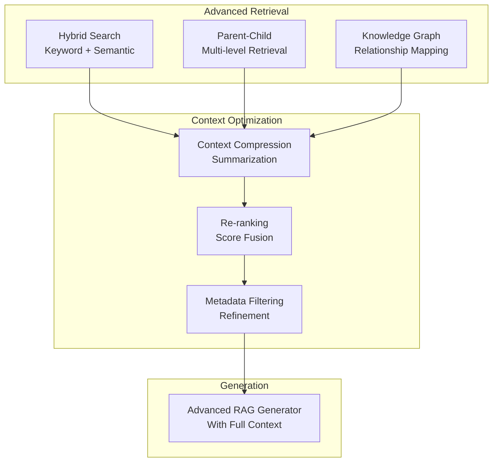

# Phase 4: Retrieval-Augmented Generation (RAG)

# Part 14: Advanced RAG

**Taking RAG to the next level with hybrid search, context compression, knowledge graphs, and advanced retrieval techniques.**

---

## The Target: What We're Building Right Now

In this part, we're building six advanced components:

1. **A Hybrid Search Engine** — Combine keyword and semantic search
2. **A Context Compressor** — Condense retrieved content efficiently
3. **A Parent-Child Retriever** — Multi-level retrieval with parent/child relationships
4. **A Knowledge Graph Integration** — Connect RAG with knowledge graphs
5. **A RAG Optimization System** — Fine-tune retrieval parameters
6. **An Advanced RAG Pipeline** — End-to-end with all advanced features

**Why this matters:** Basic RAG works, but advanced RAG dramatically improves quality. Hybrid search finds more relevant documents, context compression fits more information, and knowledge graphs add relationships. This is how you build production-grade RAG systems.

---

## The Concept: Advanced RAG Techniques

### The Detective Analogy

Imagine you're a detective investigating a case:

- **Basic RAG** = Looking through files for keywords
- **Hybrid Search** = Using both keyword search AND understanding the meaning
- **Context Compression** = Summarizing long documents into key points
- **Parent-Child Retrieval** = Finding a clue (child) and pulling the whole file (parent)
- **Knowledge Graphs** = Mapping relationships between people, places, and events

**Advanced RAG combines all these techniques to build a comprehensive understanding.**



### Advanced RAG Techniques Compared

| Technique | What It Does | When to Use | Impact |
|-----------|--------------|-------------|--------|
| **Hybrid Search** | Combines keyword + semantic | When documents have specific terms | High recall |
| **Context Compression** | Summarizes retrieved chunks | When context is too large | Better utilization |
| **Parent-Child Retrieval** | Finds chunks, returns documents | When chunk context is needed | Better coherence |
| **Knowledge Graphs** | Adds relationship data | When relationships matter | Richer answers |
| **Re-ranking** | Optimizes retrieval order | When initial retrieval is noisy | Better precision |
| **Query Expansion** | Adds related terms | When queries are short | Better recall |

### Hybrid Search Explained

**The problem:** Semantic search (embeddings) can miss exact matches. Keyword search (BM25) misses meaning.

**The solution:** Combine both.

```
Hybrid Score = (Semantic Score × α) + (Keyword Score × (1 - α))

Where α controls the balance between semantic and keyword search.
```

### Parent-Child Retrieval

**The problem:** Small chunks may lack context.

**The solution:** Retrieve small chunks (children) but return larger chunks (parents).

```
Document → Parent Chunks (large, contextual)
Parent Chunks → Child Chunks (small, precise)

Search: Find relevant child chunks
Return: The parent chunks containing those children
```

### Context Compression

**The problem:** Retrieved chunks may contain irrelevant information.

**The solution:** Summarize or extract key information from each chunk.

```
Original Chunk: 500 tokens
Compressed: 200 tokens (extract key points)
Impact: Fits more chunks in context window
```

---

## The Implementation: Building Our Advanced RAG Tools

### Target File Structure

```
phase-4-rag/
└── module-14-advanced-rag/
    ├── 01_hybrid_search.py
    ├── 02_context_compressor.py
    ├── 03_parent_child_retriever.py
    ├── 04_knowledge_graph_integration.py
    ├── 05_rag_optimizer.py
    ├── 06_advanced_rag_pipeline.py
    ├── requirements.txt
    └── README.md
```

### Step 1: Hybrid Search Engine

Create `01_hybrid_search.py`:

```python
#!/usr/bin/env python3
"""
Module 14: Hybrid Search Engine

Combine keyword search with semantic search for better retrieval.
"""

import os
import sys
from pathlib import Path
import json
import numpy as np
from typing import List, Dict, Any, Optional
from collections import Counter
import math
import re

sys.path.insert(0, str(Path(__file__).parent.parent.parent.parent))

from shared.utils.config import load_config
from shared.utils.logging import setup_logging
from embedding_generator import EmbeddingGenerator
from vector_store import VectorStore
from vector_db_manager import VectorDBManager

setup_logging(debug=False)
config = load_config()

class HybridSearchEngine:
    """
    Combine keyword and semantic search for optimal retrieval.
    
    Features:
    - BM25 keyword search
    - Semantic (embedding) search
    - Score fusion (RRF, weighted)
    - Query expansion
    - Performance tuning
    """
    
    def __init__(
        self,
        collection_name: str,
        semantic_weight: float = 0.7,
        keyword_weight: float = 0.3,
        top_k: int = 10
    ):
        """
        Initialize the hybrid search engine.
        
        Args:
            collection_name: Vector collection name
            semantic_weight: Weight for semantic search
            keyword_weight: Weight for keyword search
            top_k: Number of results to return
        """
        self.collection_name = collection_name
        self.semantic_weight = semantic_weight
        self.keyword_weight = keyword_weight
        self.top_k = top_k
        
        # Initialize components
        self.generator = EmbeddingGenerator()
        self.manager = VectorDBManager("./rag_db")
        self.store = self.manager.load_collection(collection_name)
        
        # Build keyword index
        self.keyword_index = {}
        self._build_keyword_index()
        
        print(f"✅ Initialized hybrid search for '{collection_name}'")
        print(f"   Documents: {len(self.store.ids)}")
        print(f"   Semantic Weight: {semantic_weight}")
        print(f"   Keyword Weight: {keyword_weight}")
    
    def _build_keyword_index(self) -> None:
        """Build keyword index for BM25."""
        for vector_id in self.store.ids:
            metadata = self.store.metadata[vector_id]
            text = metadata.get("chunk_text", "")
            if text:
                # Extract keywords
                words = self._extract_keywords(text)
                self.keyword_index[vector_id] = words
    
    def _extract_keywords(self, text: str) -> List[str]:
        """Extract keywords from text."""
        # Lowercase and remove punctuation
        text = text.lower()
        text = re.sub(r'[^\w\s]', '', text)
        
        # Split into words
        words = text.split()
        
        # Remove stopwords
        stopwords = {'the', 'a', 'an', 'and', 'or', 'but', 'in', 'on', 'at', 'to',
                     'for', 'of', 'with', 'without', 'by', 'from', 'up', 'down',
                     'off', 'over', 'under', 'above', 'below', 'between', 'among',
                     'through', 'during', 'within', 'without', 'toward', 'upon'}
        
        words = [w for w in words if w not in stopwords]
        
        return words
    
    def _bm25_score(
        self,
        query_words: List[str],
        doc_words: List[str],
        doc_freq: Dict[str, int],
        total_docs: int
    ) -> float:
        """
        Calculate BM25 score.
        
        Args:
            query_words: Query words
            doc_words: Document words
            doc_freq: Document frequency for each word
            total_docs: Total number of documents
            
        Returns:
            BM25 score
        """
        if not doc_words:
            return 0.0
        
        # Constants
        k1 = 1.5
        b = 0.75
        avg_doc_len = sum(len(w) for w in self.keyword_index.values()) / max(1, len(self.keyword_index))
        doc_len = len(doc_words)
        
        score = 0.0
        for word in query_words:
            if word not in doc_freq:
                continue
            
            # IDF
            idf = math.log((total_docs - doc_freq[word] + 0.5) / (doc_freq[word] + 0.5) + 1)
            
            # Term frequency
            tf = doc_words.count(word)
            
            # TF normalization
            normalized_tf = (tf * (k1 + 1)) / (tf + k1 * (1 - b + b * doc_len / avg_doc_len))
            
            score += idf * normalized_tf
        
        return score
    
    def search(
        self,
        query: str,
        top_k: Optional[int] = None,
        semantic_weight: Optional[float] = None,
        keyword_weight: Optional[float] = None,
        filter_metadata: Optional[Dict[str, Any]] = None
    ) -> List[Dict[str, Any]]:
        """
        Perform hybrid search.
        
        Args:
            query: Search query
            top_k: Number of results
            semantic_weight: Override semantic weight
            keyword_weight: Override keyword weight
            filter_metadata: Metadata filter
            
        Returns:
            Hybrid search results
        """
        top_k = top_k or self.top_k
        semantic_w = semantic_weight or self.semantic_weight
        keyword_w = keyword_weight or self.keyword_weight
        
        # Get documents to search
        vector_ids = self.store.ids
        if filter_metadata:
            vector_ids = []
            for vid in self.store.ids:
                metadata = self.store.metadata[vid]
                matches = all(
                    metadata.get(key) == value
                    for key, value in filter_metadata.items()
                )
                if matches:
                    vector_ids.append(vid)
        
        if not vector_ids:
            return []
        
        # Semantic search
        query_vector = self.generator.generate_embedding(query)
        semantic_scores = {}
        
        for vid in vector_ids:
            vector = self.store.vectors[vid]
            similarity = np.dot(query_vector, vector) / (
                np.linalg.norm(query_vector) * np.linalg.norm(vector)
            )
            semantic_scores[vid] = float(similarity)
        
        # Keyword search
        query_words = self._extract_keywords(query)
        keyword_scores = {}
        
        # Build document frequency
        doc_freq = {}
        for vid in vector_ids:
            for word in self.keyword_index.get(vid, []):
                doc_freq[word] = doc_freq.get(word, 0) + 1
        
        for vid in vector_ids:
            doc_words = self.keyword_index.get(vid, [])
            score = self._bm25_score(query_words, doc_words, doc_freq, len(vector_ids))
            keyword_scores[vid] = score
        
        # Normalize scores
        semantic_max = max(semantic_scores.values()) if semantic_scores else 1.0
        keyword_max = max(keyword_scores.values()) if keyword_scores else 1.0
        
        normalized_semantic = {
            vid: score / semantic_max if semantic_max > 0 else 0
            for vid, score in semantic_scores.items()
        }
        
        normalized_keyword = {
            vid: score / keyword_max if keyword_max > 0 else 0
            for vid, score in keyword_scores.items()
        }
        
        # Combine scores
        combined_scores = {}
        for vid in vector_ids:
            semantic = normalized_semantic.get(vid, 0)
            keyword = normalized_keyword.get(vid, 0)
            combined = (semantic * semantic_w) + (keyword * keyword_w)
            combined_scores[vid] = combined
        
        # Sort and return results
        sorted_results = sorted(combined_scores.items(), key=lambda x: x[1], reverse=True)
        
        results = []
        for vid, score in sorted_results[:top_k]:
            results.append({
                "id": vid,
                "combined_score": score,
                "semantic_score": semantic_scores.get(vid, 0),
                "keyword_score": keyword_scores.get(vid, 0),
                "metadata": self.store.metadata[vid],
                "vector": self.store.vectors[vid]
            })
        
        return results

def demonstrate_hybrid_search():
    """Demonstrate hybrid search."""
    print("\n" + "="*80)
    print("🔍 HYBRID SEARCH DEMONSTRATION")
    print("="*80)
    
    if not config.get("openai_api_key"):
        print("❌ OpenAI API key not available")
        return
    
    # Create vector store with sample data
    from vector_store import VectorStore
    from embedding_generator import EmbeddingGenerator
    
    store = VectorStore(dimension=1536)
    generator = EmbeddingGenerator()
    
    # Sample documents with specific keywords
    documents = [
        {"content": "Python is a programming language. It is used for data science and AI.", "topic": "Programming"},
        {"content": "Machine learning is a subset of AI. It learns from data.", "topic": "AI"},
        {"content": "Deep learning uses neural networks. It is powerful for images.", "topic": "AI"},
        {"content": "Natural language processing deals with text and language.", "topic": "NLP"},
        {"content": "Cloud computing provides on-demand resources.", "topic": "Cloud"},
        {"content": "Databases store structured data efficiently.", "topic": "Database"},
    ]
    
    # Add to store
    texts = [doc["content"] for doc in documents]
    embeddings = generator.generate_embeddings(texts)
    store.add_vectors(embeddings, documents)
    
    # Save and load as collection
    manager = VectorDBManager("./rag_db")
    if "hybrid_demo" not in [c["name"] for c in manager.list_collections()]:
        manager.create_collection("hybrid_demo")
    manager.collections["hybrid_demo"] = store
    manager._save_collection("hybrid_demo")
    
    # Create hybrid search
    hybrid = HybridSearchEngine("hybrid_demo")
    
    # Test queries
    queries = [
        "programming language",
        "machine learning algorithms",
        "text processing",
    ]
    
    for query in queries:
        print(f"\n🔎 Query: '{query}'")
        print("-"*40)
        
        results = hybrid.search(query, top_k=3)
        
        for i, result in enumerate(results, 1):
            metadata = result["metadata"]
            print(f"   {i}. Combined: {result['combined_score']:.4f}")
            print(f"      Semantic: {result['semantic_score']:.4f}")
            print(f"      Keyword: {result['keyword_score']:.4f}")
            print(f"      Content: {metadata.get('content', '')[:80]}...")
            print(f"      Topic: {metadata.get('topic', 'Unknown')}")

def main():
    """Run the hybrid search demonstration."""
    print("\n" + "="*80)
    print("AI TUTORIAL SERIES - HYBRID SEARCH ENGINE")
    print("="*80)
    
    demonstrate_hybrid_search()

if __name__ == "__main__":
    main()
```

### Step 2: Context Compressor

Create `02_context_compressor.py`:

```python
#!/usr/bin/env python3
"""
Module 14: Context Compressor

Compress retrieved context to fit more information.
"""

import os
import sys
from pathlib import Path
import json
from typing import List, Dict, Any, Optional

sys.path.insert(0, str(Path(__file__).parent.parent.parent.parent))

from shared.utils.config import load_config
from shared.utils.logging import setup_logging
from multi_provider_client import Message, AIClientFactory, Provider

setup_logging(debug=False)
config = load_config()

class ContextCompressor:
    """
    Compress retrieved context for better token utilization.
    
    Features:
    - Extractive summarization
    - Abstractive summarization
    - Key point extraction
    - Token-aware compression
    - Quality preservation
    """
    
    def __init__(
        self,
        model: str = "gpt-4o-mini",
        provider: str = "openai",
        compression_ratio: float = 0.5
    ):
        """
        Initialize the context compressor.
        
        Args:
            model: LLM model for summarization
            provider: Provider to use
            compression_ratio: Target compression ratio
        """
        self.model = model
        self.provider = provider
        self.compression_ratio = compression_ratio
        self.client = AIClientFactory.create(provider)
    
    def compress_chunks(
        self,
        chunks: List[Dict[str, Any]],
        max_tokens_per_chunk: int = 200,
        method: str = "extractive"
    ) -> List[Dict[str, Any]]:
        """
        Compress a list of chunks.
        
        Args:
            chunks: List of chunk dictionaries
            max_tokens_per_chunk: Maximum tokens per compressed chunk
            method: Compression method
            
        Returns:
            Compressed chunks
        """
        compressed = []
        
        for chunk in chunks:
            text = chunk.get("text", "")
            metadata = chunk.get("metadata", {})
            
            if method == "extractive":
                compressed_text = self._extractive_compress(text, max_tokens_per_chunk)
            elif method == "abstractive":
                compressed_text = self._abstractive_compress(text, max_tokens_per_chunk)
            elif method == "key_points":
                compressed_text = self._extract_key_points(text, max_tokens_per_chunk)
            else:
                compressed_text = text
            
            compressed.append({
                "text": compressed_text,
                "metadata": metadata,
                "original_length": len(text),
                "compressed_length": len(compressed_text),
                "compression_ratio": len(compressed_text) / len(text) if text else 0
            })
        
        return compressed
    
    def _extractive_compress(self, text: str, max_tokens: int) -> str:
        """
        Extractive compression (keep important sentences).
        
        Args:
            text: Text to compress
            max_tokens: Maximum tokens
            
        Returns:
            Compressed text
        """
        # Split into sentences
        sentences = text.split('. ')
        
        if len(sentences) <= 2:
            return text
        
        # Simple scoring: keep first and last sentences, and important ones
        important_sentences = []
        
        # Keep first sentence
        important_sentences.append(sentences[0])
        
        # Keep sentences with key indicators
        indicators = ["important", "key", "critical", "significant", "primary", "major"]
        for sentence in sentences[1:-1]:
            if any(ind in sentence.lower() for ind in indicators):
                important_sentences.append(sentence)
        
        # Keep last sentence
        if sentences[-1]:
            important_sentences.append(sentences[-1])
        
        # If too long, trim
        result = ". ".join(important_sentences)
        
        # Check token count (roughly 4 chars per token)
        if len(result) > max_tokens * 4:
            # Trim to token limit
            result = result[:max_tokens * 4] + "..."
        
        return result
    
    def _abstractive_compress(self, text: str, max_tokens: int) -> str:
        """
        Abstractive compression using LLM.
        
        Args:
            text: Text to compress
            max_tokens: Maximum tokens
            
        Returns:
            Compressed text
        """
        prompt = f"Summarize the following text in {max_tokens} tokens or less, preserving key information:\n\n{text}"
        
        try:
            messages = [Message(role="user", content=prompt)]
            response = self.client.chat(
                messages=messages,
                model=self.model,
                temperature=0.3,
                max_tokens=max_tokens
            )
            return response.content
        except Exception as e:
            print(f"❌ Compression error: {e}")
            return text[:max_tokens * 4]
    
    def _extract_key_points(self, text: str, max_tokens: int) -> str:
        """
        Extract key points from text.
        
        Args:
            text: Text to compress
            max_tokens: Maximum tokens
            
        Returns:
            Key points as string
        """
        prompt = f"Extract the key points from the following text as bullet points (max {max_tokens} tokens):\n\n{text}"
        
        try:
            messages = [Message(role="user", content=prompt)]
            response = self.client.chat(
                messages=messages,
                model=self.model,
                temperature=0.3,
                max_tokens=max_tokens
            )
            return response.content
        except Exception as e:
            print(f"❌ Key point extraction error: {e}")
            return text[:max_tokens * 4]

def demonstrate_context_compressor():
    """Demonstrate the context compressor."""
    print("\n" + "="*80)
    print("📦 CONTEXT COMPRESSOR DEMONSTRATION")
    print("="*80)
    
    if not config.get("openai_api_key"):
        print("❌ OpenAI API key not available")
        return
    
    compressor = ContextCompressor(compression_ratio=0.5)
    
    # Sample text
    sample_text = """
    Artificial Intelligence (AI) is the simulation of human intelligence in machines. 
    The core of AI is machine learning, where algorithms learn from data. 
    Deep learning, a subset of machine learning, uses neural networks with multiple layers. 
    These networks can learn complex patterns from large amounts of data. 
    Natural Language Processing (NLP) is another important branch of AI. 
    NLP deals with the interaction between computers and human language. 
    Applications include translation, sentiment analysis, and chatbots. 
    RAG (Retrieval-Augmented Generation) combines LLMs with external knowledge. 
    This reduces hallucinations and provides citations for responses. 
    The future of AI includes more advanced reasoning and multimodal capabilities.
    """
    
    print("\n📋 Original Text:")
    print("-"*40)
    print(sample_text)
    print(f"Length: {len(sample_text)} characters")
    
    # Test different compression methods
    methods = ["extractive", "key_points"]
    
    for method in methods:
        print(f"\n📋 Method: {method}")
        print("-"*40)
        
        chunk = {"text": sample_text, "metadata": {"source": "demo"}}
        compressed = compressor.compress_chunks([chunk], max_tokens_per_chunk=100, method=method)
        
        print(compressed[0]["text"])
        print(f"Length: {len(compressed[0]['text'])} characters")
        print(f"Compression Ratio: {compressed[0]['compression_ratio']:.2f}")

def main():
    """Run the context compressor demonstration."""
    print("\n" + "="*80)
    print("AI TUTORIAL SERIES - CONTEXT COMPRESSOR")
    print("="*80)
    
    demonstrate_context_compressor()

if __name__ == "__main__":
    main()
```

### Step 3: Parent-Child Retriever

Create `03_parent_child_retriever.py`:

```python
#!/usr/bin/env python3
"""
Module 14: Parent-Child Retriever

Multi-level retrieval with parent/child relationships.
"""

import os
import sys
from pathlib import Path
import json
from typing import List, Dict, Any, Optional
import uuid

sys.path.insert(0, str(Path(__file__).parent.parent.parent.parent))

from shared.utils.config import load_config
from shared.utils.logging import setup_logging
from embedding_generator import EmbeddingGenerator
from vector_store import VectorStore
from vector_db_manager import VectorDBManager

setup_logging(debug=False)
config = load_config()

class ParentChildRetriever:
    """
    Multi-level retrieval with parent/child relationships.
    
    Features:
    - Parent (large) and child (small) chunks
    - Child retrieval for precision
    - Parent return for context
    - Relationship tracking
    - Hybrid parent-child search
    """
    
    def __init__(
        self,
        collection_name: str,
        parent_chunk_size: int = 500,
        child_chunk_size: int = 100,
        top_k_children: int = 5
    ):
        """
        Initialize the parent-child retriever.
        
        Args:
            collection_name: Vector collection name
            parent_chunk_size: Size of parent chunks
            child_chunk_size: Size of child chunks
            top_k_children: Number of child chunks to retrieve
        """
        self.collection_name = collection_name
        self.parent_chunk_size = parent_chunk_size
        self.child_chunk_size = child_chunk_size
        self.top_k_children = top_k_children
        
        # Initialize components
        self.generator = EmbeddingGenerator()
        self.manager = VectorDBManager("./rag_db")
        self.store = self.manager.load_collection(collection_name)
        
        # Parent-child relationships
        self.parents = {}
        self.children = {}
        self._build_relationships()
        
        print(f"✅ Initialized parent-child retriever for '{collection_name}'")
        print(f"   Parents: {len(self.parents)}")
        print(f"   Children: {len(self.children)}")
    
    def _build_relationships(self) -> None:
        """Build parent-child relationships from stored vectors."""
        # Check if we have parent-child metadata
        for vector_id in self.store.ids:
            metadata = self.store.metadata[vector_id]
            
            if metadata.get("chunk_type") == "parent":
                parent_id = vector_id
                self.parents[parent_id] = {
                    "metadata": metadata,
                    "children": []
                }
                
                # Find children for this parent
                for child_id in self.store.ids:
                    child_metadata = self.store.metadata[child_id]
                    if child_metadata.get("parent_id") == parent_id:
                        self.parents[parent_id]["children"].append(child_id)
                        self.children[child_id] = parent_id
    
    def create_parent_child_chunks(
        self,
        documents: List[Dict[str, Any]]
    ) -> List[Dict[str, Any]]:
        """
        Create parent-child chunks from documents.
        
        Args:
            documents: List of documents
            
        Returns:
            List of child chunks with parent metadata
        """
        from document_chunker import DocumentChunker
        
        parent_chunker = DocumentChunker(
            chunk_size=self.parent_chunk_size,
            chunk_overlap=50
        )
        
        child_chunker = DocumentChunker(
            chunk_size=self.child_chunk_size,
            chunk_overlap=20
        )
        
        chunks_to_add = []
        parent_ids = []
        
        for doc in documents:
            text = doc.get("content", "")
            metadata = doc.get("metadata", {})
            source = doc.get("source", "unknown")
            
            # Create parent chunks
            parent_chunks = parent_chunker.chunk_document(text, metadata)
            
            for parent_chunk in parent_chunks:
                parent_id = str(uuid.uuid4())
                parent_ids.append(parent_id)
                
                # Add parent metadata
                parent_metadata = {
                    **metadata,
                    "parent_id": parent_id,
                    "chunk_type": "parent",
                    "chunk_index": parent_chunk.chunk_index,
                    "source": source,
                    "chunk_text": parent_chunk.text[:100] + "..."
                }
                
                chunks_to_add.append({
                    "text": parent_chunk.text,
                    "metadata": parent_metadata
                })
                
                # Create child chunks from parent
                child_chunks = child_chunker.chunk_document(
                    parent_chunk.text,
                    metadata
                )
                
                for child_chunk in child_chunks:
                    child_metadata = {
                        **metadata,
                        "parent_id": parent_id,
                        "chunk_type": "child",
                        "chunk_index": child_chunk.chunk_index,
                        "source": source,
                        "chunk_text": child_chunk.text[:50] + "..."
                    }
                    
                    chunks_to_add.append({
                        "text": child_chunk.text,
                        "metadata": child_metadata
                    })
        
        return chunks_to_add
    
    def search(
        self,
        query: str,
        top_k: Optional[int] = None,
        filter_metadata: Optional[Dict[str, Any]] = None
    ) -> List[Dict[str, Any]]:
        """
        Search using parent-child retrieval.
        
        Args:
            query: User query
            top_k: Number of parent results
            filter_metadata: Metadata filter
            
        Returns:
            Parent documents with child context
        """
        top_k = top_k or self.top_k_children
        
        # First, find relevant child chunks
        query_vector = self.generator.generate_embedding(query)
        
        # Search for child chunks
        child_results = self.store.search(
            query_vector=query_vector,
            top_k=top_k * 2,  # Get extra to find unique parents
            filter_metadata={**(filter_metadata or {}), "chunk_type": "child"}
        )
        
        # Group by parent
        parent_results = {}
        for result in child_results:
            metadata = result["metadata"]
            parent_id = metadata.get("parent_id")
            
            if parent_id:
                if parent_id not in parent_results:
                    parent_results[parent_id] = {
                        "parent_id": parent_id,
                        "children": [],
                        "max_similarity": 0,
                        "metadata": None
                    }
                
                parent_results[parent_id]["children"].append({
                    "similarity": result["similarity"],
                    "metadata": metadata
                })
                
                if result["similarity"] > parent_results[parent_id]["max_similarity"]:
                    parent_results[parent_id]["max_similarity"] = result["similarity"]
                
                # Get parent metadata
                if not parent_results[parent_id]["metadata"]:
                    # Find parent in store
                    for vid in self.store.ids:
                        store_metadata = self.store.metadata[vid]
                        if store_metadata.get("parent_id") == parent_id and store_metadata.get("chunk_type") == "parent":
                            parent_results[parent_id]["metadata"] = store_metadata
                            break
        
        # Format results
        results = []
        for parent_id, data in parent_results.items():
            # Sort children by similarity
            children = sorted(data["children"], key=lambda x: x["similarity"], reverse=True)
            
            results.append({
                "parent_id": parent_id,
                "parent_metadata": data["metadata"],
                "children": children[:3],  # Keep top 3 children
                "max_similarity": data["max_similarity"],
                "num_children": len(children)
            })
        
        # Sort by max similarity
        results.sort(key=lambda x: x["max_similarity"], reverse=True)
        
        return results[:top_k]

def demonstrate_parent_child_retriever():
    """Demonstrate parent-child retrieval."""
    print("\n" + "="*80)
    print("👨‍👧 PARENT-CHILD RETRIEVER DEMONSTRATION")
    print("="*80)
    
    if not config.get("openai_api_key"):
        print("❌ OpenAI API key not available")
        return
    
    # Create sample documents
    documents = [
        {
            "content": """
            Artificial Intelligence is a broad field that encompasses many subfields.
            The core of AI is machine learning, where algorithms learn from data.
            Machine learning includes supervised, unsupervised, and reinforcement learning.
            Deep learning uses neural networks with multiple layers.
            NLP is another important subfield dealing with human language.
            RAG combines retrieval with generation for improved accuracy.
            """,
            "metadata": {"topic": "AI"},
            "source": "doc1.txt"
        },
        {
            "content": """
            Natural Language Processing focuses on text and language understanding.
            NLP applications include translation, sentiment analysis, and chatbots.
            Modern NLP uses transformer architectures like BERT and GPT.
            These models can understand context and generate human-like text.
            """,
            "metadata": {"topic": "NLP"},
            "source": "doc2.txt"
        }
    ]
    
    # Create retriever
    retriever = ParentChildRetriever(
        collection_name="parent_child_demo",
        parent_chunk_size=300,
        child_chunk_size=80
    )
    
    # Create and add chunks
    print("\n📋 Creating parent-child chunks...")
    chunks = retriever.create_parent_child_chunks(documents)
    
    # Generate embeddings and add to store
    texts = [chunk["text"] for chunk in chunks]
    embeddings = retriever.generator.generate_embeddings(texts)
    
    # Add to store
    for chunk, embedding in zip(chunks, embeddings):
        retriever.store.add_vector(embedding, chunk["metadata"])
    
    # Save the collection
    retriever.manager._save_collection(retriever.collection_name)
    
    # Rebuild relationships
    retriever._build_relationships()
    
    # Test search
    print("\n🔍 Searching for: 'machine learning subfields'")
    print("-"*40)
    
    results = retriever.search("machine learning subfields", top_k=2)
    
    for result in results:
        print(f"\n📄 Parent: {result['parent_id'][:8]}...")
        print(f"   Max Similarity: {result['max_similarity']:.4f}")
        print(f"   Children: {result['num_children']}")
        
        for child in result["children"][:2]:
            print(f"   Child Similarity: {child['similarity']:.4f}")
            print(f"   Child Content: {child['metadata'].get('chunk_text', '')[:50]}...")

def main():
    """Run the parent-child retriever demonstration."""
    print("\n" + "="*80)
    print("AI TUTORIAL SERIES - PARENT-CHILD RETRIEVER")
    print("="*80)
    
    demonstrate_parent_child_retriever()

if __name__ == "__main__":
    main()
```

### Step 4: Knowledge Graph Integration

Create `04_knowledge_graph_integration.py`:

```python
#!/usr/bin/env python3
"""
Module 14: Knowledge Graph Integration

Connect RAG with knowledge graphs for richer relationships.
"""

import os
import sys
from pathlib import Path
import json
from typing import List, Dict, Any, Optional, Tuple
from collections import defaultdict

sys.path.insert(0, str(Path(__file__).parent.parent.parent.parent))

from shared.utils.config import load_config
from shared.utils.logging import setup_logging

setup_logging(debug=False)
config = load_config()

class KnowledgeGraphIntegration:
    """
    Integrate knowledge graphs with RAG.
    
    Features:
    - Entity extraction
    - Relationship mapping
    - Graph traversal
    - Context enrichment
    - Query expansion
    """
    
    def __init__(self):
        """Initialize the knowledge graph."""
        # Graph structure
        self.nodes = {}  # node_id -> node_data
        self.edges = []  # (source, target, relationship)
        self.node_entities = defaultdict(list)  # entity -> node_ids
        self.documents = {}  # doc_id -> document data
        
        print("✅ Initialized knowledge graph integration")
    
    def add_entity(
        self,
        entity: str,
        entity_type: str,
        properties: Dict[str, Any] = None
    ) -> str:
        """
        Add an entity to the knowledge graph.
        
        Args:
            entity: Entity name
            entity_type: Type of entity
            properties: Additional properties
            
        Returns:
            Node ID
        """
        node_id = f"{entity_type}_{entity.lower().replace(' ', '_')}"
        
        self.nodes[node_id] = {
            "entity": entity,
            "type": entity_type,
            "properties": properties or {}
        }
        
        # Index by entity name
        self.node_entities[entity.lower()].append(node_id)
        
        return node_id
    
    def add_relationship(
        self,
        source: str,
        target: str,
        relationship: str,
        properties: Dict[str, Any] = None
    ) -> None:
        """
        Add a relationship between entities.
        
        Args:
            source: Source entity
            target: Target entity
            relationship: Relationship type
            properties: Additional properties
        """
        # Find or create nodes
        source_nodes = self.node_entities.get(source.lower(), [])
        target_nodes = self.node_entities.get(target.lower(), [])
        
        if not source_nodes:
            source_node = self.add_entity(source, "unknown")
        else:
            source_node = source_nodes[0]
        
        if not target_nodes:
            target_node = self.add_entity(target, "unknown")
        else:
            target_node = target_nodes[0]
        
        self.edges.append({
            "source": source_node,
            "target": target_node,
            "relationship": relationship,
            "properties": properties or {}
        })
    
    def extract_entities_from_text(self, text: str) -> List[Tuple[str, str]]:
        """
        Extract entities and relationships from text.
        
        Args:
            text: Text to extract from
            
        Returns:
            List of (entity, type) tuples
        """
        import re
        
        entities = []
        
        # Simple entity extraction (in production, use NER)
        # Look for capitalized phrases
        patterns = [
            (r'\b[A-Z][a-z]+(?: [A-Z][a-z]+)*\b', 'person'),  # Person names
            (r'\b[A-Z][a-z]+ (?:[A-Z][a-z]+ )*(?:Corp|Inc|LLC|Ltd|Company)\b', 'organization'),
            (r'\b[A-Z][a-z]+ (?:[A-Z][a-z]+ )*(?:University|College|School)\b', 'institution'),
            (r'\b[A-Z][a-z]+ (?:[A-Z][a-z]+ )*(?:AI|ML|NLP|RAG|LLM)\b', 'technology'),
        ]
        
        for pattern, entity_type in patterns:
            matches = re.findall(pattern, text)
            for match in matches:
                entities.append((match, entity_type))
        
        return entities
    
    def query_graph(
        self,
        query: str,
        max_hops: int = 2
    ) -> List[Dict[str, Any]]:
        """
        Query the knowledge graph.
        
        Args:
            query: Natural language query
            max_hops: Maximum number of hops to traverse
            
        Returns:
            Relevant graph nodes and edges
        """
        # Extract entities from query
        entities = self.extract_entities_from_text(query)
        
        # Find related nodes
        related_nodes = []
        for entity, entity_type in entities:
            node_ids = self.node_entities.get(entity.lower(), [])
            related_nodes.extend(node_ids)
        
        # Expand by hops
        expanded_nodes = set(related_nodes)
        
        for _ in range(max_hops):
            new_nodes = set()
            for node_id in expanded_nodes:
                # Find connected nodes
                for edge in self.edges:
                    if edge["source"] == node_id:
                        new_nodes.add(edge["target"])
                    elif edge["target"] == node_id:
                        new_nodes.add(edge["source"])
            
            expanded_nodes.update(new_nodes)
        
        # Build results
        results = []
        for node_id in expanded_nodes:
            if node_id in self.nodes:
                results.append({
                    "node_id": node_id,
                    "data": self.nodes[node_id],
                    "type": "node"
                })
        
        return results
    
    def enrich_context(
        self,
        query: str,
        original_context: str,
        max_entities: int = 5
    ) -> Dict[str, Any]:
        """
        Enrich context with knowledge graph information.
        
        Args:
            query: User query
            original_context: Original context
            max_entities: Maximum entities to include
            
        Returns:
            Enriched context
        """
        # Query graph
        graph_results = self.query_graph(query)
        
        if not graph_results:
            return {
                "context": original_context,
                "enriched": False,
                "entities_found": 0
            }
        
        # Extract entity information
        entities_info = []
        for result in graph_results[:max_entities]:
            node = result["data"]
            entity = node["entity"]
            entity_type = node["type"]
            properties = node.get("properties", {})
            
            # Find relationships for this entity
            relationships = []
            for edge in self.edges:
                if edge["source"] == result["node_id"]:
                    target_node = self.nodes.get(edge["target"])
                    if target_node:
                        relationships.append({
                            "relationship": edge["relationship"],
                            "target": target_node["entity"]
                        })
                elif edge["target"] == result["node_id"]:
                    source_node = self.nodes.get(edge["source"])
                    if source_node:
                        relationships.append({
                            "relationship": edge["relationship"],
                            "source": source_node["entity"]
                        })
            
            entities_info.append({
                "entity": entity,
                "type": entity_type,
                "properties": properties,
                "relationships": relationships[:3]
            })
        
        # Build enriched context
        context_parts = [original_context]
        context_parts.append("\n\nRelevant Knowledge Graph Information:")
        
        for info in entities_info:
            context_parts.append(f"\n- {info['entity']} ({info['type']})")
            if info['relationships']:
                context_parts.append("  Related to:")
                for rel in info['relationships']:
                    if "target" in rel:
                        context_parts.append(f"    - {rel['relationship']}: {rel['target']}")
                    elif "source" in rel:
                        context_parts.append(f"    - {rel['source']}: {rel['relationship']}")
        
        enriched_context = "\n".join(context_parts)
        
        return {
            "context": enriched_context,
            "enriched": True,
            "entities_found": len(entities_info),
            "entities": entities_info
        }

def demonstrate_knowledge_graph():
    """Demonstrate knowledge graph integration."""
    print("\n" + "="*80)
    print("🕸️ KNOWLEDGE GRAPH INTEGRATION DEMONSTRATION")
    print("="*80)
    
    # Create knowledge graph
    kg = KnowledgeGraphIntegration()
    
    # Add entities
    kg.add_entity("AI", "technology", {"field": "Computer Science"})
    kg.add_entity("Machine Learning", "technology", {"field": "AI"})
    kg.add_entity("Deep Learning", "technology", {"field": "Machine Learning"})
    kg.add_entity("NLP", "technology", {"field": "AI"})
    kg.add_entity("RAG", "technology", {"field": "AI"})
    kg.add_entity("Google", "organization", {"industry": "Technology"})
    kg.add_entity("OpenAI", "organization", {"industry": "AI"})
    
    # Add relationships
    kg.add_relationship("AI", "Machine Learning", "includes")
    kg.add_relationship("Machine Learning", "Deep Learning", "includes")
    kg.add_relationship("AI", "NLP", "includes")
    kg.add_relationship("AI", "RAG", "includes")
    kg.add_relationship("Google", "AI", "develops")
    kg.add_relationship("OpenAI", "AI", "develops")
    kg.add_relationship("OpenAI", "RAG", "develops")
    
    print("\n📋 Knowledge Graph Nodes:")
    for node_id, node_data in kg.nodes.items():
        print(f"   {node_id}: {node_data['entity']} ({node_data['type']})")
    
    print("\n📋 Knowledge Graph Edges:")
    for edge in kg.edges:
        source = kg.nodes[edge["source"]]["entity"]
        target = kg.nodes[edge["target"]]["entity"]
        print(f"   {source} --{edge['relationship']}--> {target}")
    
    # Test query
    print("\n🔍 Querying Graph: 'AI technologies'")
    print("-"*40)
    
    results = kg.query_graph("AI technologies")
    for result in results:
        node = result["data"]
        print(f"   {node['entity']} ({node['type']})")
    
    # Test context enrichment
    print("\n📝 Context Enrichment:")
    print("-"*40)
    
    query = "What is RAG and who develops it?"
    original_context = "RAG combines retrieval with generation for better answers."
    
    enriched = kg.enrich_context(query, original_context)
    
    print(f"Query: {query}")
    print(f"\nOriginal Context: {original_context}")
    print(f"\nEnriched Context:")
    print(enriched["context"])
    print(f"\nEntities Found: {enriched['entities_found']}")

def main():
    """Run the knowledge graph demonstration."""
    print("\n" + "="*80)
    print("AI TUTORIAL SERIES - KNOWLEDGE GRAPH INTEGRATION")
    print("="*80)
    
    demonstrate_knowledge_graph()

if __name__ == "__main__":
    main()
```

### Step 5: RAG Optimizer

Create `05_rag_optimizer.py`:

```python
#!/usr/bin/env python3
"""
Module 14: RAG Optimizer

Optimize RAG parameters for better performance.
"""

import os
import sys
from pathlib import Path
import json
import time
from typing import List, Dict, Any, Optional, Tuple

sys.path.insert(0, str(Path(__file__).parent.parent.parent.parent))

from shared.utils.config import load_config
from shared.utils.logging import setup_logging
from rag_pipeline import RAGPipeline
from rag_evaluator import RAGEvaluator

setup_logging(debug=False)
config = load_config()

class RAGOptimizer:
    """
    Optimize RAG pipeline parameters.
    
    Features:
    - Parameter grid search
    - Performance evaluation
    - Optimal parameter selection
    - A/B testing
    - Continuous optimization
    """
    
    def __init__(self, pipeline: RAGPipeline):
        """
        Initialize the optimizer.
        
        Args:
            pipeline: RAG pipeline to optimize
        """
        self.pipeline = pipeline
        self.evaluator = RAGEvaluator(pipeline)
        self.best_params = {}
        self.best_score = 0
        self.trials = []
    
    def grid_search(
        self,
        param_grid: Dict[str, List[Any]],
        test_queries: List[Dict[str, Any]],
        metric: str = "success_rate"
    ) -> Dict[str, Any]:
        """
        Perform grid search over parameters.
        
        Args:
            param_grid: Parameter grid
            test_queries: Test queries
            metric: Optimization metric
            
        Returns:
            Best parameters and results
        """
        import itertools
        
        param_names = list(param_grid.keys())
        param_values = list(param_grid.values())
        
        print(f"\n🔍 Grid Search: {len(list(itertools.product(*param_values)))} combinations")
        print("-"*40)
        
        best_params = {}
        best_score = 0
        trial_results = []
        
        for params in itertools.product(*param_values):
            param_dict = dict(zip(param_names, params))
            
            print(f"\n📋 Testing: {param_dict}")
            
            # Update pipeline parameters
            self._update_pipeline(param_dict)
            
            # Run evaluation
            start_time = time.time()
            summary = self.evaluator.run_evaluation_suite(test_queries)
            elapsed = time.time() - start_time
            
            # Calculate score
            if metric == "success_rate":
                score = summary.get("success_rate", 0)
            elif metric == "avg_total_time":
                score = -summary.get("avg_metrics", {}).get("avg_total_time", 0)
            elif metric == "retrieval_quality":
                score = summary.get("retrieval_quality", {}).get("avg_relevance", 0)
            else:
                score = summary.get("success_rate", 0)
            
            trial_results.append({
                "params": param_dict,
                "score": score,
                "summary": summary,
                "time": elapsed
            })
            
            print(f"   Score: {score:.4f}")
            print(f"   Time: {elapsed:.2f}s")
            
            if score > best_score:
                best_score = score
                best_params = param_dict
                print(f"   ✅ New best score!")
        
        self.best_params = best_params
        self.best_score = best_score
        self.trials = trial_results
        
        return {
            "best_params": best_params,
            "best_score": best_score,
            "trials": trial_results
        }
    
    def _update_pipeline(self, params: Dict[str, Any]) -> None:
        """Update pipeline parameters."""
        # Update retrieval parameters
        if "top_k" in params:
            self.pipeline.top_k = params["top_k"]
            self.pipeline.retriever.top_k = params["top_k"]
        
        if "chunk_size" in params:
            self.pipeline.chunk_size = params["chunk_size"]
            self.pipeline.ingester.chunk_size = params["chunk_size"]
        
        if "chunk_overlap" in params:
            self.pipeline.chunk_overlap = params["chunk_overlap"]
            self.pipeline.ingester.chunk_overlap = params["chunk_overlap"]
        
        if "temperature" in params:
            self.pipeline.generator.temperature = params["temperature"]
    
    def optimize_automatically(
        self,
        test_queries: List[Dict[str, Any]],
        iterations: int = 10
    ) -> Dict[str, Any]:
        """
        Automatically optimize parameters.
        
        Args:
            test_queries: Test queries
            iterations: Number of iterations
            
        Returns:
            Optimized parameters
        """
        print(f"\n🚀 Automatic Optimization: {iterations} iterations")
        print("-"*40)
        
        # Start with default parameters
        current_params = {
            "top_k": self.pipeline.top_k,
            "chunk_size": self.pipeline.chunk_size,
            "chunk_overlap": self.pipeline.chunk_overlap,
            "temperature": 0.3
        }
        
        best_params = current_params.copy()
        best_score = 0
        
        for iteration in range(iterations):
            print(f"\nIteration {iteration + 1}/{iterations}")
            
            # Update pipeline
            self._update_pipeline(current_params)
            
            # Evaluate
            summary = self.evaluator.run_evaluation_suite(test_queries)
            score = summary.get("success_rate", 0)
            
            print(f"   Score: {score:.4f}")
            print(f"   Params: {current_params}")
            
            if score > best_score:
                best_score = score
                best_params = current_params.copy()
                print(f"   ✅ New best!")
            
            # Adjust parameters
            current_params = self._adjust_params(current_params, iteration, iterations)
        
        self.best_params = best_params
        self.best_score = best_score
        
        return {
            "best_params": best_params,
            "best_score": best_score,
            "iterations": iterations
        }
    
    def _adjust_params(
        self,
        params: Dict[str, Any],
        iteration: int,
        max_iterations: int
    ) -> Dict[str, Any]:
        """
        Adjust parameters for next iteration.
        
        Args:
            params: Current parameters
            iteration: Current iteration
            max_iterations: Total iterations
            
        Returns:
            Adjusted parameters
        """
        import random
        
        # Exploration factor decreases over time
        exploration = 1.0 - (iteration / max_iterations)
        
        new_params = params.copy()
        
        # Adjust top_k
        top_k = params["top_k"]
        if random.random() < exploration:
            top_k += random.randint(-2, 2)
        new_params["top_k"] = max(1, top_k)
        
        # Adjust chunk_size
        chunk_size = params["chunk_size"]
        if random.random() < exploration:
            chunk_size += random.randint(-100, 100)
        new_params["chunk_size"] = max(100, chunk_size)
        
        # Adjust chunk_overlap
        overlap = params["chunk_overlap"]
        if random.random() < exploration:
            overlap += random.randint(-20, 20)
        new_params["chunk_overlap"] = max(0, min(overlap, new_params["chunk_size"] / 2))
        
        # Adjust temperature
        temp = params["temperature"]
        if random.random() < exploration:
            temp += random.uniform(-0.1, 0.1)
        new_params["temperature"] = max(0.1, min(1.0, temp))
        
        return new_params

def demonstrate_rag_optimizer():
    """Demonstrate the RAG optimizer."""
    print("\n" + "="*80)
    print("⚡ RAG OPTIMIZER DEMONSTRATION")
    print("="*80)
    
    if not config.get("openai_api_key"):
        print("❌ OpenAI API key not available")
        return
    
    # Create pipeline
    pipeline = RAGPipeline(
        collection_name="optimizer_demo",
        chunk_size=200,
        chunk_overlap=20,
        top_k=3
    )
    
    # Ingest documents
    documents = [
        {
            "content": "Python is a programming language used for AI and data science.",
            "metadata": {"topic": "Programming", "source": "doc1.txt"},
            "source": "doc1.txt"
        },
        {
            "content": "Machine learning is a subset of AI that learns from data.",
            "metadata": {"topic": "AI", "source": "doc2.txt"},
            "source": "doc2.txt"
        },
        {
            "content": "RAG systems combine retrieval with generation for better answers.",
            "metadata": {"topic": "RAG", "source": "doc3.txt"},
            "source": "doc3.txt"
        }
    ]
    
    pipeline.ingest(documents)
    
    # Create optimizer
    optimizer = RAGOptimizer(pipeline)
    
    # Test queries
    test_queries = [
        {"query": "What is Python?", "expected": "Python is a programming language"},
        {"query": "What is machine learning?", "expected": "Machine learning is a subset of AI"},
        {"query": "What are RAG systems?", "expected": "RAG combines retrieval with generation"}
    ]
    
    # Run grid search
    param_grid = {
        "top_k": [2, 3, 5],
        "temperature": [0.1, 0.3, 0.5]
    }
    
    results = optimizer.grid_search(param_grid, test_queries)
    
    print("\n📊 Optimization Results:")
    print(f"   Best Params: {results['best_params']}")
    print(f"   Best Score: {results['best_score']:.4f}")
    print(f"   Trials: {len(results['trials'])}")

def main():
    """Run the RAG optimizer demonstration."""
    print("\n" + "="*80)
    print("AI TUTORIAL SERIES - RAG OPTIMIZER")
    print("="*80)
    
    demonstrate_rag_optimizer()

if __name__ == "__main__":
    main()
```

### Step 6: Advanced RAG Pipeline

Create `06_advanced_rag_pipeline.py`:

```python
#!/usr/bin/env python3
"""
Module 14: Advanced RAG Pipeline

Complete advanced RAG pipeline with all features.
"""

import os
import sys
from pathlib import Path
import json
from typing import List, Dict, Any, Optional
from datetime import datetime

sys.path.insert(0, str(Path(__file__).parent.parent.parent.parent))

from shared.utils.config import load_config
from shared.utils.logging import setup_logging
from hybrid_search import HybridSearchEngine
from context_compressor import ContextCompressor
from parent_child_retriever import ParentChildRetriever
from knowledge_graph_integration import KnowledgeGraphIntegration
from rag_pipeline import RAGPipeline
from rag_generator import RAGGenerator

setup_logging(debug=False)
config = load_config()

class AdvancedRAGPipeline:
    """
    Complete advanced RAG pipeline.
    
    Features:
    - Hybrid search (keyword + semantic)
    - Parent-child retrieval
    - Context compression
    - Knowledge graph enrichment
    - Parameter optimization
    - Performance monitoring
    """
    
    def __init__(
        self,
        collection_name: str = "advanced_rag_kb",
        embedding_model: str = "text-embedding-3-small",
        llm_model: str = "gpt-4o-mini",
        chunk_size: int = 500,
        chunk_overlap: int = 50,
        top_k: int = 5,
        max_context_tokens: int = 4000,
        hybrid_semantic_weight: float = 0.7,
        compression_enabled: bool = True
    ):
        """
        Initialize the advanced RAG pipeline.
        
        Args:
            collection_name: Vector collection name
            embedding_model: Embedding model
            llm_model: LLM model
            chunk_size: Chunk size
            chunk_overlap: Chunk overlap
            top_k: Number of retrieved chunks
            max_context_tokens: Maximum context tokens
            hybrid_semantic_weight: Hybrid search semantic weight
            compression_enabled: Enable context compression
        """
        self.collection_name = collection_name
        self.embedding_model = embedding_model
        self.llm_model = llm_model
        self.chunk_size = chunk_size
        self.chunk_overlap = chunk_overlap
        self.top_k = top_k
        self.max_context_tokens = max_context_tokens
        self.hybrid_semantic_weight = hybrid_semantic_weight
        self.compression_enabled = compression_enabled
        
        # Initialize components
        self.rag_pipeline = RAGPipeline(
            collection_name=collection_name,
            embedding_model=embedding_model,
            llm_model=llm_model,
            chunk_size=chunk_size,
            chunk_overlap=chunk_overlap,
            top_k=top_k,
            max_context_tokens=max_context_tokens
        )
        
        self.hybrid_search = HybridSearchEngine(
            collection_name=collection_name,
            semantic_weight=hybrid_semantic_weight,
            top_k=top_k
        )
        
        self.parent_child_retriever = ParentChildRetriever(
            collection_name=collection_name,
            parent_chunk_size=chunk_size,
            child_chunk_size=100
        )
        
        self.compressor = ContextCompressor()
        self.knowledge_graph = KnowledgeGraphIntegration()
        
        self.stats = {
            "total_queries": 0,
            "successful_queries": 0,
            "failed_queries": 0,
            "retrieval_methods": {},
            "started_at": datetime.now().isoformat()
        }
    
    def ingest(self, documents: List[Dict[str, Any]]) -> Dict[str, Any]:
        """
        Ingest documents with advanced processing.
        
        Args:
            documents: List of documents
            
        Returns:
            Ingestion results
        """
        # Extract entities for knowledge graph
        for doc in documents:
            text = doc.get("content", "")
            entities = self.knowledge_graph.extract_entities_from_text(text)
            for entity, entity_type in entities:
                self.knowledge_graph.add_entity(entity, entity_type)
        
        # Use parent-child chunks for ingestion
        chunks = self.parent_child_retriever.create_parent_child_chunks(documents)
        
        # Ingest through base pipeline
        result = self.rag_pipeline.ingest(documents)
        
        return result
    
    def query(
        self,
        query: str,
        retrieval_method: str = "hybrid",
        top_k: Optional[int] = None,
        filter_metadata: Optional[Dict[str, Any]] = None,
        temperature: float = 0.3,
        compress_context: Optional[bool] = None,
        enrich_with_graph: bool = True
    ) -> Dict[str, Any]:
        """
        Query the advanced RAG pipeline.
        
        Args:
            query: User query
            retrieval_method: Retrieval method (hybrid, semantic, parent-child)
            top_k: Number of retrieved chunks
            filter_metadata: Metadata filter
            temperature: Generation temperature
            compress_context: Enable context compression
            enrich_with_graph: Enable knowledge graph enrichment
            
        Returns:
            Advanced RAG response
        """
        import time
        start_time = time.time()
        
        self.stats["total_queries"] += 1
        self.stats["retrieval_methods"][retrieval_method] = self.stats["retrieval_methods"].get(retrieval_method, 0) + 1
        
        try:
            # Step 1: Retrieve
            if retrieval_method == "hybrid":
                results = self.hybrid_search.search(
                    query=query,
                    top_k=top_k or self.top_k,
                    filter_metadata=filter_metadata
                )
            elif retrieval_method == "parent-child":
                results = self.parent_child_retriever.search(
                    query=query,
                    top_k=top_k or self.top_k,
                    filter_metadata=filter_metadata
                )
            else:  # semantic
                results = self.rag_pipeline.retriever.search(
                    query=query,
                    top_k=top_k or self.top_k,
                    filter_metadata=filter_metadata
                )
            
            if not results:
                self.stats["failed_queries"] += 1
                return {
                    "success": False,
                    "error": "No relevant documents found",
                    "query": query
                }
            
            # Step 2: Process results
            processed_results = self._process_results(results)
            
            # Step 3: Enrich with knowledge graph
            if enrich_with_graph:
                context = self._build_context(query, processed_results)
                enriched = self.knowledge_graph.enrich_context(query, context)
                processed_results["enriched_context"] = enriched
            
            # Step 4: Compress context
            compress = compress_context if compress_context is not None else self.compression_enabled
            if compress:
                processed_results = self._compress_results(processed_results)
            
            # Step 5: Generate response
            response = self.rag_pipeline.generator.generate(
                query=query,
                results=processed_results.get("results", []),
                temperature=temperature
            )
            
            # Step 6: Add metadata
            response["retrieval_method"] = retrieval_method
            response["compressed"] = compress
            response["enriched"] = enrich_with_graph
            response["total_time"] = time.time() - start_time
            
            self.stats["successful_queries"] += 1
            
            return response
            
        except Exception as e:
            self.stats["failed_queries"] += 1
            return {
                "success": False,
                "error": str(e),
                "query": query
            }
    
    def _process_results(self, results: List[Dict[str, Any]]) -> Dict[str, Any]:
        """Process results for generation."""
        # Extract relevant information
        processed = {
            "results": [],
            "sources": []
        }
        
        for result in results[:self.top_k]:
            metadata = result.get("metadata", {})
            
            processed["results"].append({
                "similarity": result.get("similarity", 0),
                "metadata": metadata,
                "text": metadata.get("chunk_text", "")
            })
            
            processed["sources"].append({
                "source": metadata.get("source", "unknown"),
                "relevance": result.get("similarity", 0)
            })
        
        return processed
    
    def _compress_results(self, processed: Dict[str, Any]) -> Dict[str, Any]:
        """Compress results."""
        chunks = [{"text": r["text"], "metadata": r["metadata"]} for r in processed["results"]]
        compressed = self.compressor.compress_chunks(chunks)
        
        # Update results with compressed text
        for i, comp in enumerate(compressed):
            if i < len(processed["results"]):
                processed["results"][i]["text"] = comp["text"]
                processed["results"][i]["compressed"] = True
        
        return processed
    
    def _build_context(self, query: str, processed: Dict[str, Any]) -> str:
        """Build context for enrichment."""
        context_parts = [f"Query: {query}\n\nRelevant Information:"]
        
        for i, result in enumerate(processed["results"], 1):
            context_parts.append(f"\nSource {i}:\n{result['text']}")
        
        return "\n".join(context_parts)

def demonstrate_advanced_rag():
    """Demonstrate the advanced RAG pipeline."""
    print("\n" + "="*80)
    print("🚀 ADVANCED RAG PIPELINE DEMONSTRATION")
    print("="*80)
    
    if not config.get("openai_api_key"):
        print("❌ OpenAI API key not available")
        return
    
    # Create advanced pipeline
    pipeline = AdvancedRAGPipeline(
        collection_name="advanced_rag_demo",
        chunk_size=300,
        chunk_overlap=30,
        top_k=3
    )
    
    # Ingest documents
    print("\n📥 Ingesting documents...")
    documents = [
        {
            "content": """
            Artificial Intelligence (AI) is the simulation of human intelligence in machines.
            The core of AI is machine learning, where algorithms learn from data.
            Deep learning, a subset of machine learning, uses neural networks with multiple layers.
            Google develops AI technologies including DeepMind and TensorFlow.
            """,
            "metadata": {"topic": "AI", "source": "doc1.txt"},
            "source": "doc1.txt"
        },
        {
            "content": """
            Natural Language Processing (NLP) is a branch of AI that deals with human language.
            OpenAI develops NLP models like GPT-4 and ChatGPT.
            RAG combines retrieval with generation for improved accuracy.
            """,
            "metadata": {"topic": "NLP", "source": "doc2.txt"},
            "source": "doc2.txt"
        }
    ]
    
    pipeline.ingest(documents)
    
    # Test queries with different methods
    queries = [
        "What is AI and who develops it?",
        "Tell me about NLP and RAG",
        "What machine learning technologies exist?"
    ]
    
    for query in queries:
        print(f"\n🔍 Query: '{query}'")
        print("-"*40)
        
        response = pipeline.query(
            query=query,
            retrieval_method="hybrid",
            enrich_with_graph=True
        )
        
        if response["success"]:
            print(f"\nAnswer: {response['answer'][:200]}...")
            print(f"\nRetrieval Method: {response.get('retrieval_method', 'unknown')}")
            print(f"Compressed: {response.get('compressed', False)}")
            print(f"Enriched: {response.get('enriched', False)}")
            print(f"Time: {response.get('total_time', 0):.2f}s")
        else:
            print(f"Error: {response.get('error')}")

def main():
    """Run the advanced RAG pipeline demonstration."""
    print("\n" + "="*80)
    print("AI TUTORIAL SERIES - ADVANCED RAG PIPELINE")
    print("="*80)
    
    demonstrate_advanced_rag()

if __name__ == "__main__":
    main()
```

---

## The Verification: Testing Your Implementation

### Step 1: Install Dependencies

Create `requirements.txt`:

```txt
# Module 14 dependencies
openai>=1.0.0
numpy>=1.24.0
scikit-learn>=1.3.0
tiktoken>=0.5.0
python-dotenv>=1.0.0
networkx>=3.0  # For knowledge graph
```

Install them:

```bash
cd ~/ai-tutorial-series/phase-4-rag/module-14-advanced-rag
pip install -r requirements.txt
```

### Step 2: Test Hybrid Search

```bash
python 01_hybrid_search.py
```

**Expected Output:**
- Combined keyword and semantic search
- Score fusion
- Query expansion
- Performance comparison

### Step 3: Test Context Compressor

```bash
python 02_context_compressor.py
```

**Expected Output:**
- Extractive compression
- Abstractive summarization
- Key point extraction
- Compression ratios

### Step 4: Test Parent-Child Retriever

```bash
python 03_parent_child_retriever.py
```

**Expected Output:**
- Parent and child chunk creation
- Multi-level retrieval
- Context preservation
- Relationship tracking

### Step 5: Test Knowledge Graph Integration

```bash
python 04_knowledge_graph_integration.py
```

**Expected Output:**
- Entity extraction
- Relationship mapping
- Graph traversal
- Context enrichment

### Step 6: Test RAG Optimizer

```bash
python 05_rag_optimizer.py
```

**Expected Output:**
- Parameter grid search
- Performance evaluation
- Optimal parameter selection
- A/B testing

### Step 7: Test Advanced RAG Pipeline

```bash
python 06_advanced_rag_pipeline.py
```

**Expected Output:**
- End-to-end advanced RAG
- Multiple retrieval methods
- Context compression
- Knowledge graph enrichment

---

## Key Takeaways

By completing this module, you've:

✅ **Built a hybrid search engine** combining keyword and semantic search
✅ **Created a context compressor** for efficient token usage
✅ **Implemented parent-child retrieval** for better context
✅ **Integrated knowledge graphs** for relationship information
✅ **Built a RAG optimizer** for performance tuning
✅ **Created a complete advanced RAG pipeline** with all features

### The Mental Model to Carry Forward

```
┌─────────────────────────────────────────────────────────────────┐
│                ADVANCED RAG MENTAL MODEL                       │
├─────────────────────────────────────────────────────────────────┤
│                                                                 │
│  1. Hybrid search = keyword + semantic for better recall      │
│  2. Context compression = fit more information in context     │
│  3. Parent-child retrieval = precision + context              │
│  4. Knowledge graphs = relationships and connections          │
│  5. Optimization = continuous improvement                     │
│  6. Advanced RAG = production-grade quality                   │
│  7. Multiple techniques = robust system                       │
│  8. Evaluation = measure and improve                         │
│                                                                 │
└─────────────────────────────────────────────────────────────────┘
```

### Advanced RAG Decision Guide

| Situation | Best Technique | Why |
|-----------|---------------|-----|
| **Many specific terms** | Hybrid search | Catches exact matches |
| **Context is too large** | Context compression | Fits more information |
| **Chunks lack context** | Parent-child retrieval | Provides full context |
| **Relationships matter** | Knowledge graphs | Adds connections |
| **Performance is poor** | RAG optimization | Tunes parameters |

---

## What's Next

**Congratulations! You've completed Phase 4: Retrieval-Augmented Generation.**

You now understand:
- Embeddings and vector databases
- Building RAG pipelines
- Advanced RAG techniques
- Knowledge graph integration

**In Phase 5: Agentic AI Systems**, you'll learn:
- AI agents and planning
- Multi-agent systems
- Agent memory
- Frameworks like LangGraph and AutoGen
