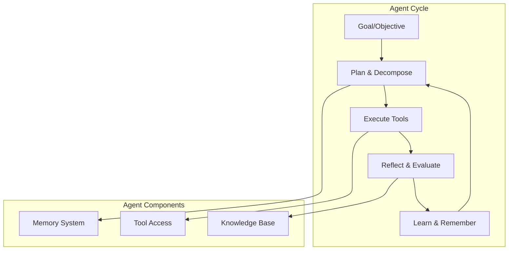

# Phase 5: Agentic AI Systems

> **Objective:** Build autonomous AI systems capable of planning, reasoning, and executing complex workflows.

---

# Part 15: AI Agents

**Understanding what makes an AI agent, how to build one, and the key frameworks that power agentic systems.**

---

## The Target: What We're Building Right Now

In this part, we're building seven powerful components:

1. **A Simple Agent** — The foundation of agentic systems
2. **A Planning Engine** — Break down goals into actionable steps
3. **A Reflection System** — Self-evaluation and improvement
4. **A Memory System** — Short-term and long-term memory
5. **A Tool-Using Agent** — Agents that can use tools
6. **A Goal Decomposition Engine** — Break complex goals into subtasks
7. **A Complete Agent Framework** — Production-ready agent system

**Why this matters:** Agents are the next evolution of AI. Instead of simple question-answer, agents can plan, reason, use tools, and execute complex tasks autonomously. This is how you build AI that actually does things.

---

## The Concept: Understanding AI Agents

### The Employee Analogy

Imagine you're a manager with a new employee:

- **Simple AI (Chatbot)** = An intern who answers questions
- **AI Agent** = A senior employee who:
    1. **Understands** the goal you give them
    2. **Plans** how to achieve it
    3. **Breaks** it into manageable tasks
    4. **Executes** tasks using available tools
    5. **Reflects** on their work and improves
    6. **Remembers** what they've done before
    7. **Learns** from experience

**That's an AI agent.**



### What Makes an AI Agent?

| Component | Description | Example |
|-----------|-------------|---------|
| **Planning** | Break down goals into steps | "To write a report, I need to research, outline, write, and edit" |
| **Reasoning** | Think through problems | "If X, then Y, but if Z, then I should do W" |
| **Memory** | Remember past interactions | "The user prefers concise answers" |
| **Tool Use** | Use external tools | Weather API, calculator, database |
| **Reflection** | Evaluate and improve | "My previous response was too long, let me shorten it" |
| **Learning** | Adapt over time | "I've learned that this user likes technical details" |

### Agent Frameworks Comparison

| Framework | Strengths | Use Cases | Language |
|-----------|-----------|-----------|----------|
| **LangGraph** | Graph-based, flexible, great for complex flows | Complex multi-step agents | Python |
| **AutoGen** | Multi-agent conversations, human-in-the-loop | Collaborative problem-solving | Python |
| **CrewAI** | Role-based teams, simple to use | Task delegation, team coordination | Python |
| **OpenAI Agents SDK** | Production-ready, tool integration | Enterprise applications | Python/JS |
| **Semantic Kernel** | Enterprise integration | Business applications | C#/Python |

### Agent Types

| Type | Description | When to Use |
|------|-------------|-------------|
| **Reactive** | Responds to events | Simple automation |
| **Proactive** | Takes initiative | Complex tasks |
| **Collaborative** | Works with others | Team-based problems |
| **Learning** | Improves over time | Long-term applications |
| **Hybrid** | Combines approaches | Most real-world applications |

---

## The Implementation: Building Our Agent System

### Target File Structure

```
phase-5-agents/
└── module-15-agents/
    ├── 01_simple_agent.py
    ├── 02_planning_engine.py
    ├── 03_reflection_system.py
    ├── 04_memory_system.py
    ├── 05_tool_using_agent.py
    ├── 06_goal_decomposition.py
    ├── 07_complete_agent_framework.py
    ├── requirements.txt
    └── README.md
```

### Step 1: Simple Agent

Create `01_simple_agent.py`:

```python
#!/usr/bin/env python3
"""
Module 15: Simple Agent

The foundation of agentic systems.
"""

import os
import sys
from pathlib import Path
import json
from typing import List, Dict, Any, Optional, Callable
from dataclasses import dataclass, field
from datetime import datetime

sys.path.insert(0, str(Path(__file__).parent.parent.parent.parent))

from shared.utils.config import load_config
from shared.utils.logging import setup_logging
from multi_provider_client import Message, AIClientFactory, Provider

setup_logging(debug=False)
config = load_config()

@dataclass
class AgentState:
    """The state of an agent."""
    goal: str = ""
    plan: List[str] = field(default_factory=list)
    current_step: int = 0
    memory: List[Dict[str, Any]] = field(default_factory=list)
    completed: bool = False
    result: Optional[Any] = None

class SimpleAgent:
    """
    A simple AI agent.
    
    Features:
    - Goal understanding
    - Basic planning
    - Step execution
    - Memory management
    - Simple reasoning
    """
    
    def __init__(
        self,
        name: str = "SimpleAgent",
        model: str = "gpt-4o-mini",
        provider: str = "openai",
        max_steps: int = 5
    ):
        """
        Initialize the simple agent.
        
        Args:
            name: Agent name
            model: LLM model
            provider: Provider
            max_steps: Maximum steps before stopping
        """
        self.name = name
        self.model = model
        self.provider = provider
        self.max_steps = max_steps
        
        self.client = AIClientFactory.create(provider)
        self.state = AgentState()
        
        print(f"✅ Initialized agent: {name}")
    
    def run(self, goal: str) -> Dict[str, Any]:
        """
        Run the agent on a goal.
        
        Args:
            goal: The goal to achieve
            
        Returns:
            Final result
        """
        print(f"\n🤖 {self.name} starting...")
        print(f"📋 Goal: {goal}")
        print("-"*40)
        
        self.state.goal = goal
        self.state.completed = False
        
        # Step 1: Plan
        self._plan()
        
        # Step 2: Execute
        while not self.state.completed and self.state.current_step < self.max_steps:
            self._execute_step()
        
        # Step 3: Finalize
        if not self.state.completed:
            self.state.result = "Agent couldn't complete the goal within max steps"
        
        print(f"\n✅ {self.name} completed")
        print(f"📊 Result: {self.state.result}")
        
        return {
            "agent": self.name,
            "goal": goal,
            "result": self.state.result,
            "steps_taken": self.state.current_step,
            "completed": self.state.completed
        }
    
    def _plan(self) -> None:
        """Plan how to achieve the goal."""
        print("\n📋 Planning...")
        
        prompt = f"""
You are {self.name}, an AI agent.
Your goal is: {self.state.goal}

Create a plan to achieve this goal.
Break it down into 3-5 steps.
Format your response as a numbered list.

Plan:
"""
        
        response = self._call_llm(prompt)
        self.state.plan = self._parse_plan(response)
        
        for i, step in enumerate(self.state.plan, 1):
            print(f"   Step {i}: {step}")
        
        self.state.current_step = 0
    
    def _execute_step(self) -> None:
        """Execute the current step."""
        if self.state.current_step >= len(self.state.plan):
            self.state.completed = True
            self.state.result = "All steps completed"
            return
        
        step = self.state.plan[self.state.current_step]
        print(f"\n⚡ Executing step {self.state.current_step + 1}: {step}")
        
        # Execute the step using LLM reasoning
        prompt = f"""
You are {self.name}, an AI agent.
Goal: {self.state.goal}
Current step: {step}
Memory: {self.state.memory}

Execute this step.
Provide a clear result or action.
If the step is complete, respond with "STEP COMPLETE".

Execution result:
"""
        
        response = self._call_llm(prompt)
        
        self.state.memory.append({
            "step": step,
            "response": response,
            "timestamp": datetime.now().isoformat()
        })
        
        print(f"   Result: {response[:100]}...")
        
        self.state.current_step += 1
        
        # Check if all steps are done
        if self.state.current_step >= len(self.state.plan):
            self.state.completed = True
            self.state.result = response
    
    def _call_llm(self, prompt: str) -> str:
        """Call the LLM with a prompt."""
        messages = [Message(role="user", content=prompt)]
        response = self.client.chat(
            messages=messages,
            model=self.model,
            temperature=0.7,
            max_tokens=500
        )
        return response.content
    
    def _parse_plan(self, response: str) -> List[str]:
        """Parse the plan from LLM response."""
        lines = response.strip().split('\n')
        steps = []
        
        for line in lines:
            line = line.strip()
            if line and (line[0].isdigit() or line.startswith('-')):
                # Remove number/bullet
                step = line.split('.', 1)[-1].strip() if '.' in line else line[1:].strip()
                if step:
                    steps.append(step)
        
        return steps

def demonstrate_simple_agent():
    """Demonstrate the simple agent."""
    print("\n" + "="*80)
    print("🤖 SIMPLE AGENT DEMONSTRATION")
    print("="*80)
    
    if not config.get("openai_api_key"):
        print("❌ OpenAI API key not available")
        return
    
    # Create agent
    agent = SimpleAgent("Researcher")
    
    # Run on a goal
    result = agent.run("Write a brief summary of artificial intelligence")
    
    print("\n📊 Final Result:")
    print(json.dumps(result, indent=2))

def main():
    """Run the simple agent demonstration."""
    print("\n" + "="*80)
    print("AI TUTORIAL SERIES - SIMPLE AGENT")
    print("="*80)
    
    demonstrate_simple_agent()

if __name__ == "__main__":
    main()
```

### Step 2: Planning Engine

Create `02_planning_engine.py`:

```python
#!/usr/bin/env python3
"""
Module 15: Planning Engine

Advanced planning for AI agents.
"""

import os
import sys
from pathlib import Path
import json
from typing import List, Dict, Any, Optional
from dataclasses import dataclass, field

sys.path.insert(0, str(Path(__file__).parent.parent.parent.parent))

from shared.utils.config import load_config
from shared.utils.logging import setup_logging
from multi_provider_client import Message, AIClientFactory, Provider

setup_logging(debug=False)
config = load_config()

@dataclass
class PlanStep:
    """A step in a plan."""
    id: str
    description: str
    dependencies: List[str] = field(default_factory=list)
    status: str = "pending"  # pending, running, completed, failed
    result: Optional[Any] = None

@dataclass
class Plan:
    """A complete plan."""
    goal: str
    steps: List[PlanStep]
    status: str = "created"  # created, running, completed, failed

class PlanningEngine:
    """
    Advanced planning for AI agents.
    
    Features:
    - Goal decomposition
    - Dependency management
    - Parallel planning
    - Plan validation
    - Replanning
    """
    
    def __init__(self, model: str = "gpt-4o-mini", provider: str = "openai"):
        """
        Initialize the planning engine.
        
        Args:
            model: LLM model
            provider: Provider
        """
        self.model = model
        self.provider = provider
        self.client = AIClientFactory.create(provider)
    
    def create_plan(self, goal: str, context: Optional[str] = None) -> Plan:
        """
        Create a plan for a goal.
        
        Args:
            goal: The goal to plan for
            context: Additional context
            
        Returns:
            Plan object
        """
        print(f"\n📋 Creating plan for: {goal}")
        
        prompt = f"""
Goal: {goal}
Context: {context or "No additional context"}

Create a detailed plan to achieve this goal.
For each step, specify:
1. Step ID (short name)
2. Description (what to do)
3. Dependencies (which steps must come before)

Format as JSON:
{{
    "steps": [
        {{
            "id": "step_1",
            "description": "...",
            "dependencies": []
        }},
        ...
    ]
}}
"""
        
        response = self._call_llm(prompt)
        plan_data = self._parse_plan(response)
        
        steps = []
        for step_data in plan_data.get("steps", []):
            steps.append(PlanStep(
                id=step_data.get("id", f"step_{len(steps) + 1}"),
                description=step_data.get("description", ""),
                dependencies=step_data.get("dependencies", [])
            ))
        
        plan = Plan(goal=goal, steps=steps)
        print(f"   Created plan with {len(steps)} steps")
        
        return plan
    
    def _call_llm(self, prompt: str) -> str:
        """Call the LLM."""
        messages = [Message(role="user", content=prompt)]
        response = self.client.chat(
            messages=messages,
            model=self.model,
            temperature=0.3,
            max_tokens=1000
        )
        return response.content
    
    def _parse_plan(self, response: str) -> Dict[str, Any]:
        """Parse the plan from LLM response."""
        try:
            # Find JSON in the response
            start = response.find('{')
            end = response.rfind('}') + 1
            if start >= 0 and end > start:
                return json.loads(response[start:end])
        except:
            pass
        
        # Fallback: parse from text
        lines = response.strip().split('\n')
        steps = []
        
        for line in lines:
            if line.strip() and ('step' in line.lower() or 'task' in line.lower()):
                steps.append({
                    "id": f"step_{len(steps) + 1}",
                    "description": line.strip(),
                    "dependencies": []
                })
        
        return {"steps": steps}
    
    def get_next_steps(self, plan: Plan) -> List[str]:
        """
        Get the next executable steps.
        
        Args:
            plan: The plan
            
        Returns:
            List of step IDs that can be executed next
        """
        ready = []
        
        for step in plan.steps:
            if step.status != "pending":
                continue
            
            # Check dependencies
            deps_met = True
            for dep_id in step.dependencies:
                dep = next((s for s in plan.steps if s.id == dep_id), None)
                if dep and dep.status != "completed":
                    deps_met = False
                    break
            
            if deps_met:
                ready.append(step.id)
        
        return ready
    
    def update_step_status(
        self,
        plan: Plan,
        step_id: str,
        status: str,
        result: Optional[Any] = None
    ) -> None:
        """
        Update a step's status.
        
        Args:
            plan: The plan
            step_id: Step ID
            status: New status
            result: Result of the step
        """
        for step in plan.steps:
            if step.id == step_id:
                step.status = status
                if result is not None:
                    step.result = result
                break
        
        # Check if all steps are complete
        if all(s.status == "completed" for s in plan.steps):
            plan.status = "completed"
        elif any(s.status == "failed" for s in plan.steps):
            plan.status = "failed"

def demonstrate_planning_engine():
    """Demonstrate the planning engine."""
    print("\n" + "="*80)
    print("📋 PLANNING ENGINE DEMONSTRATION")
    print("="*80)
    
    if not config.get("openai_api_key"):
        print("❌ OpenAI API key not available")
        return
    
    engine = PlanningEngine()
    
    # Create a plan
    plan = engine.create_plan(
        goal="Research and write a report on AI agents",
        context="The report should be 3 pages and include examples"
    )
    
    print("\n📊 Plan:")
    print("-"*40)
    print(f"Goal: {plan.goal}")
    print(f"Status: {plan.status}")
    print(f"Steps: {len(plan.steps)}")
    
    for step in plan.steps:
        deps = f" (deps: {step.dependencies})" if step.dependencies else ""
        print(f"   - {step.id}: {step.description}{deps}")
    
    # Show next steps
    print("\n🔍 Next Executable Steps:")
    next_steps = engine.get_next_steps(plan)
    print(f"   {next_steps}")

def main():
    """Run the planning engine demonstration."""
    print("\n" + "="*80)
    print("AI TUTORIAL SERIES - PLANNING ENGINE")
    print("="*80)
    
    demonstrate_planning_engine()

if __name__ == "__main__":
    main()
```

### Step 3: Reflection System

Create `03_reflection_system.py`:

```python
#!/usr/bin/env python3
"""
Module 15: Reflection System

Self-evaluation and improvement for AI agents.
"""

import os
import sys
from pathlib import Path
import json
from typing import List, Dict, Any, Optional

sys.path.insert(0, str(Path(__file__).parent.parent.parent.parent))

from shared.utils.config import load_config
from shared.utils.logging import setup_logging
from multi_provider_client import Message, AIClientFactory, Provider

setup_logging(debug=False)
config = load_config()

class ReflectionSystem:
    """
    Self-evaluation and improvement for agents.
    
    Features:
    - Self-evaluation
    - Criticism and improvement
    - Iterative refinement
    - Quality scoring
    - Learning from mistakes
    """
    
    def __init__(self, model: str = "gpt-4o-mini", provider: str = "openai"):
        """
        Initialize the reflection system.
        
        Args:
            model: LLM model
            provider: Provider
        """
        self.model = model
        self.provider = provider
        self.client = AIClientFactory.create(provider)
        self.reflections = []
    
    def reflect(self, action: str, result: str, context: Dict[str, Any] = None) -> Dict[str, Any]:
        """
        Reflect on an action and its result.
        
        Args:
            action: The action taken
            result: The result of the action
            context: Additional context
            
        Returns:
            Reflection result
        """
        prompt = f"""
You are an AI agent reflecting on your work.

Action: {action}
Result: {result}
Context: {context or "No additional context"}

Evaluate this action:
1. What went well?
2. What could be improved?
3. What did you learn?
4. What would you do differently next time?
5. Score this action (1-10)

Provide a structured reflection:
"""
        
        response = self._call_llm(prompt)
        reflection = self._parse_reflection(response)
        
        reflection["action"] = action
        reflection["result"] = result
        reflection["timestamp"] = datetime.now().isoformat()
        
        self.reflections.append(reflection)
        
        return reflection
    
    def _call_llm(self, prompt: str) -> str:
        """Call the LLM."""
        messages = [Message(role="user", content=prompt)]
        response = self.client.chat(
            messages=messages,
            model=self.model,
            temperature=0.7,
            max_tokens=600
        )
        return response.content
    
    def _parse_reflection(self, response: str) -> Dict[str, Any]:
        """Parse the reflection from LLM response."""
        sections = {
            "strengths": "",
            "improvements": "",
            "learnings": "",
            "different": "",
            "score": 0
        }
        
        lines = response.strip().split('\n')
        current_section = None
        
        for line in lines:
            line = line.strip()
            if not line:
                continue
            
            if 'went well' in line.lower() or 'strength' in line.lower():
                current_section = "strengths"
            elif 'improve' in line.lower() or 'could be better' in line.lower():
                current_section = "improvements"
            elif 'learn' in line.lower():
                current_section = "learnings"
            elif 'differently' in line.lower() or 'next time' in line.lower():
                current_section = "different"
            elif 'score' in line.lower() or '/' in line:
                # Extract score
                try:
                    import re
                    numbers = re.findall(r'\d+', line)
                    if numbers:
                        sections["score"] = int(numbers[0])
                except:
                    pass
                current_section = None
            
            if current_section and line and not any(kw in line.lower() for kw in ['score', 'evaluate']):
                sections[current_section] += line + " "
        
        return sections
    
    def improve(self, original: str, reflection: Dict[str, Any]) -> str:
        """
        Improve based on reflection.
        
        Args:
            original: Original content
            reflection: Reflection to learn from
            
        Returns:
            Improved content
        """
        prompt = f"""
Original content:
{original}

Reflection:
{reflection}

Based on this reflection, improve the original content.
Address the weaknesses and incorporate the learnings.

Improved version:
"""
        
        response = self._call_llm(prompt)
        return response
    
    def get_summary(self) -> Dict[str, Any]:
        """
        Get a summary of all reflections.
        
        Returns:
            Reflection summary
        """
        if not self.reflections:
            return {"total_reflections": 0}
        
        scores = [r.get("score", 0) for r in self.reflections if r.get("score")]
        
        return {
            "total_reflections": len(self.reflections),
            "average_score": sum(scores) / len(scores) if scores else 0,
            "max_score": max(scores) if scores else 0,
            "min_score": min(scores) if scores else 0,
            "learnings": [r.get("learnings") for r in self.reflections if r.get("learnings")]
        }

def demonstrate_reflection_system():
    """Demonstrate the reflection system."""
    print("\n" + "="*80)
    print("🔄 REFLECTION SYSTEM DEMONSTRATION")
    print("="*80)
    
    if not config.get("openai_api_key"):
        print("❌ OpenAI API key not available")
        return
    
    reflection_system = ReflectionSystem()
    
    # Simulate an action
    action = "Wrote a research summary about AI agents"
    result = "The summary was 2 pages long, covered the basics, but lacked technical depth"
    
    # Reflect
    print("\n📋 Reflecting on action:")
    print("-"*40)
    
    reflection = reflection_system.reflect(action, result)
    
    print("Reflection:")
    print(f"   Strengths: {reflection.get('strengths', 'N/A')[:100]}...")
    print(f"   Improvements: {reflection.get('improvements', 'N/A')[:100]}...")
    print(f"   Learnings: {reflection.get('learnings', 'N/A')[:100]}...")
    print(f"   Score: {reflection.get('score', 0)}/10")
    
    # Improve based on reflection
    print("\n📝 Improving based on reflection:")
    print("-"*40)
    
    original = "AI agents are systems that can perform tasks autonomously. They use planning, reasoning, and tools to achieve goals."
    
    improved = reflection_system.improve(original, reflection)
    print(f"Original: {original}")
    print(f"\nImproved: {improved}")
    
    # Get summary
    print("\n📊 Reflection Summary:")
    summary = reflection_system.get_summary()
    print(json.dumps(summary, indent=2))

def main():
    """Run the reflection system demonstration."""
    print("\n" + "="*80)
    print("AI TUTORIAL SERIES - REFLECTION SYSTEM")
    print("="*80)
    
    demonstrate_reflection_system()

if __name__ == "__main__":
    main()
```

### Step 4: Memory System

Create `04_memory_system.py`:

```python
#!/usr/bin/env python3
"""
Module 15: Memory System

Memory management for AI agents.
"""

import os
import sys
from pathlib import Path
import json
from typing import List, Dict, Any, Optional
from datetime import datetime
import pickle

sys.path.insert(0, str(Path(__file__).parent.parent.parent.parent))

from shared.utils.config import load_config
from shared.utils.logging import setup_logging
from embedding_generator import EmbeddingGenerator
from vector_store import VectorStore

setup_logging(debug=False)
config = load_config()

class MemorySystem:
    """
    Memory management for AI agents.
    
    Features:
    - Short-term memory (recent interactions)
    - Long-term memory (vector database)
    - Episodic memory (specific events)
    - Semantic memory (knowledge)
    - Memory retrieval
    - Memory consolidation
    """
    
    def __init__(self, max_short_term: int = 10):
        """
        Initialize the memory system.
        
        Args:
            max_short_term: Maximum short-term memories
        """
        self.max_short_term = max_short_term
        self.short_term = []  # Recent interactions
        self.long_term = VectorStore(dimension=1536)  # Vector DB for long-term
        self.episodic = []  # Specific events
        self.semantic = {}  # Knowledge stores
        
        # Memory metadata
        self.memory_count = 0
        self.last_access = None
        
        self.generator = EmbeddingGenerator()
        
        print("✅ Initialized memory system")
    
    def add_memory(
        self,
        content: str,
        memory_type: str = "short_term",
        metadata: Dict[str, Any] = None
    ) -> None:
        """
        Add a memory to the system.
        
        Args:
            content: Memory content
            memory_type: Type of memory
            metadata: Additional metadata
        """
        memory = {
            "id": self.memory_count,
            "content": content,
            "type": memory_type,
            "metadata": metadata or {},
            "timestamp": datetime.now().isoformat()
        }
        
        self.memory_count += 1
        
        if memory_type == "short_term":
            self.short_term.append(memory)
            if len(self.short_term) > self.max_short_term:
                # Move oldest to long-term
                old = self.short_term.pop(0)
                self._store_long_term(old)
        
        elif memory_type == "episodic":
            self.episodic.append(memory)
        
        elif memory_type == "semantic":
            self.semantic[content[:50]] = memory
    
    def _store_long_term(self, memory: Dict[str, Any]) -> None:
        """Store a memory in long-term memory."""
        # Generate embedding for the memory
        embedding = self.generator.generate_embedding(memory["content"])
        self.long_term.add_vector(embedding, memory)
    
    def retrieve_short_term(self, query: str, top_k: int = 5) -> List[Dict[str, Any]]:
        """
        Retrieve from short-term memory.
        
        Args:
            query: Search query
            top_k: Number of results
            
        Returns:
            Relevant memories
        """
        # Simple keyword matching for short-term
        scores = []
        for memory in self.short_term:
            score = self._keyword_similarity(query, memory["content"])
            scores.append((memory, score))
        
        scores.sort(key=lambda x: x[1], reverse=True)
        return [mem for mem, _ in scores[:top_k]]
    
    def retrieve_long_term(self, query: str, top_k: int = 5) -> List[Dict[str, Any]]:
        """
        Retrieve from long-term memory.
        
        Args:
            query: Search query
            top_k: Number of results
            
        Returns:
            Relevant memories
        """
        if len(self.long_term.ids) == 0:
            return []
        
        query_vector = self.generator.generate_embedding(query)
        results = self.long_term.search(query_vector, top_k=top_k)
        return [r["metadata"] for r in results]
    
    def _keyword_similarity(self, query: str, text: str) -> float:
        """Calculate keyword similarity."""
        query_words = set(query.lower().split())
        text_words = set(text.lower().split())
        overlap = len(query_words & text_words)
        return overlap / len(query_words) if query_words else 0
    
    def consolidate_memories(self) -> None:
        """Consolidate short-term to long-term."""
        while len(self.short_term) > self.max_short_term // 2:
            old = self.short_term.pop(0)
            self._store_long_term(old)
    
    def search(self, query: str, top_k: int = 5) -> List[Dict[str, Any]]:
        """
        Search all memory types.
        
        Args:
            query: Search query
            top_k: Number of results
            
        Returns:
            Combined results
        """
        results = []
        
        # Short-term
        short_results = self.retrieve_short_term(query, top_k)
        results.extend(short_results)
        
        # Long-term
        long_results = self.retrieve_long_term(query, top_k)
        results.extend(long_results)
        
        # Episodic
        episodic_results = []
        for memory in self.episodic:
            if self._keyword_similarity(query, memory["content"]) > 0.5:
                episodic_results.append(memory)
        results.extend(episodic_results[:top_k])
        
        # Remove duplicates
        seen = set()
        unique_results = []
        for r in results:
            r_id = r.get("id")
            if r_id not in seen:
                seen.add(r_id)
                unique_results.append(r)
        
        return unique_results[:top_k]

def demonstrate_memory_system():
    """Demonstrate the memory system."""
    print("\n" + "="*80)
    print("🧠 MEMORY SYSTEM DEMONSTRATION")
    print("="*80)
    
    if not config.get("openai_api_key"):
        print("❌ OpenAI API key not available")
        return
    
    memory = MemorySystem(max_short_term=5)
    
    # Add memories
    print("\n📋 Adding memories...")
    
    memories = [
        ("User prefers concise answers", "short_term"),
        ("User asked about AI agents", "short_term"),
        ("The agent recommended using LangGraph", "short_term"),
        ("User's name is Alice", "short_term"),
        ("User likes technical details", "short_term"),
        ("Previous conversation about Python", "short_term"),
        ("User has 5 years of ML experience", "episodic"),
        ("The user mentioned they're from Boston", "short_term"),
    ]
    
    for content, mem_type in memories:
        memory.add_memory(content, mem_type)
        print(f"   Added: {content}")
    
    # Consolidate
    memory.consolidate_memories()
    print(f"\n📊 Short-term: {len(memory.short_term)} memories")
    print(f"   Long-term: {len(memory.long_term.ids)} memories")
    print(f"   Episodic: {len(memory.episodic)} memories")
    
    # Search
    print("\n🔍 Searching for: 'user preferences'")
    results = memory.search("user preferences")
    
    for i, result in enumerate(results[:3], 1):
        print(f"   {i}. {result.get('content', '')[:50]}...")

def main():
    """Run the memory system demonstration."""
    print("\n" + "="*80)
    print("AI TUTORIAL SERIES - MEMORY SYSTEM")
    print("="*80)
    
    demonstrate_memory_system()

if __name__ == "__main__":
    main()
```

### Step 5: Tool-Using Agent

Create `05_tool_using_agent.py`:

```python
#!/usr/bin/env python3
"""
Module 15: Tool-Using Agent

An agent that can use tools to achieve goals.
"""

import os
import sys
from pathlib import Path
import json
from typing import List, Dict, Any, Optional, Callable

sys.path.insert(0, str(Path(__file__).parent.parent.parent.parent))

from shared.utils.config import load_config
from shared.utils.logging import setup_logging
from multi_provider_client import Message, AIClientFactory, Provider
from function_definition import FunctionDefinition, Parameter, ParameterType, FunctionRegistry

setup_logging(debug=False)
config = load_config()

class ToolUsingAgent:
    """
    An agent that can use tools.
    
    Features:
    - Tool registration
    - Tool selection
    - Tool execution
    - Result interpretation
    - Planning with tools
    """
    
    def __init__(
        self,
        name: str = "ToolAgent",
        model: str = "gpt-4o-mini",
        provider: str = "openai"
    ):
        """
        Initialize the tool-using agent.
        
        Args:
            name: Agent name
            model: LLM model
            provider: Provider
        """
        self.name = name
        self.model = model
        self.provider = provider
        
        self.client = AIClientFactory.create(provider)
        self.registry = FunctionRegistry()
        
        # Track usage
        self.tool_usage = {}
        self.history = []
        
        print(f"✅ Initialized tool-using agent: {name}")
    
    def register_tool(self, function: FunctionDefinition) -> None:
        """Register a tool."""
        self.registry.register(function)
    
    def run(self, goal: str) -> Dict[str, Any]:
        """
        Run the agent with tool access.
        
        Args:
            goal: The goal to achieve
            
        Returns:
            Final result
        """
        print(f"\n🔧 {self.name} starting...")
        print(f"📋 Goal: {goal}")
        print("-"*40)
        
        # Get available tools
        tools_desc = self._get_tools_description()
        
        # Plan with tools
        prompt = f"""
You are {self.name}, an AI agent with access to the following tools:

{tools_desc}

Goal: {goal}

Create a plan to achieve this goal using these tools.
For each step, specify:
1. What to do
2. Which tool to use (if any)
3. What arguments to pass

Respond with a clear plan.
"""
        
        plan = self._call_llm(prompt)
        self.history.append({"action": "plan", "content": plan})
        
        print(f"\n📋 Plan: {plan[:200]}...")
        
        # Execute the plan
        result = self._execute_tools(goal, plan)
        
        return {
            "agent": self.name,
            "goal": goal,
            "result": result,
            "tool_usage": self.tool_usage,
            "history": self.history
        }
    
    def _get_tools_description(self) -> str:
        """Get description of available tools."""
        if not self.registry.functions:
            return "No tools available"
        
        desc = []
        for name, func in self.registry.functions.items():
            desc.append(f"- {name}: {func.description}")
        
        return "\n".join(desc)
    
    def _call_llm(self, prompt: str) -> str:
        """Call the LLM."""
        messages = [Message(role="user", content=prompt)]
        response = self.client.chat(
            messages=messages,
            model=self.model,
            temperature=0.5,
            max_tokens=800
        )
        return response.content
    
    def _execute_tools(self, goal: str, plan: str) -> str:
        """
        Execute tools according to the plan.
        
        Args:
            goal: Original goal
            plan: The plan
            
        Returns:
            Execution result
        """
        # Parse tool calls from the plan
        tool_calls = self._parse_tool_calls(plan)
        
        if not tool_calls:
            # No tools to execute, just return the plan
            return plan
        
        results = []
        for tool_call in tool_calls:
            tool_name = tool_call.get("tool")
            args = tool_call.get("arguments", {})
            
            if tool_name in self.registry.functions:
                try:
                    result = self.registry.execute(tool_name, args)
                    results.append(f"{tool_name}: {json.dumps(result)}")
                    self.tool_usage[tool_name] = self.tool_usage.get(tool_name, 0) + 1
                    print(f"   ✅ Used tool: {tool_name}")
                except Exception as e:
                    results.append(f"{tool_name}: Error - {e}")
                    print(f"   ❌ Tool error: {e}")
        
        # Summarize results
        if results:
            summary_prompt = f"""
Goal: {goal}
Plan: {plan}
Tool Results: {results}

Summarize the results and provide a final answer.
"""
            summary = self._call_llm(summary_prompt)
            return summary
        
        return plan
    
    def _parse_tool_calls(self, text: str) -> List[Dict[str, Any]]:
        """Parse tool calls from text."""
        # Simple parsing for demonstration
        calls = []
        lines = text.split('\n')
        
        for line in lines:
            if 'use' in line.lower() and 'tool' in line.lower():
                # Extract tool name and arguments
                import re
                tool_match = re.search(r'(?:use|tool)\s+(\w+)', line.lower())
                if tool_match:
                    tool_name = tool_match.group(1)
                    # Try to find arguments
                    args = {}
                    arg_matches = re.findall(r'(\w+)\s*:\s*([^,\s]+)', line)
                    for key, value in arg_matches:
                        args[key] = value
                    
                    calls.append({
                        "tool": tool_name,
                        "arguments": args
                    })
        
        return calls

def demonstrate_tool_using_agent():
    """Demonstrate the tool-using agent."""
    print("\n" + "="*80)
    print("🔧 TOOL-USING AGENT DEMONSTRATION")
    print("="*80)
    
    if not config.get("openai_api_key"):
        print("❌ OpenAI API key not available")
        return
    
    # Create agent
    agent = ToolUsingAgent("Assistant")
    
    # Define tools
    def get_weather(location: str) -> dict:
        return {"location": location, "temperature": 22, "condition": "sunny"}
    
    def calculate(expression: str) -> float:
        return eval(expression)
    
    # Register tools
    weather_func = FunctionDefinition(
        name="get_weather",
        description="Get weather for a location",
        parameters=[Parameter(name="location", type=ParameterType.STRING, required=True)],
        handler=get_weather
    )
    
    calc_func = FunctionDefinition(
        name="calculate",
        description="Calculate a mathematical expression",
        parameters=[Parameter(name="expression", type=ParameterType.STRING, required=True)],
        handler=calculate
    )
    
    agent.register_tool(weather_func)
    agent.register_tool(calc_func)
    
    # Run the agent
    result = agent.run("What's the weather in London and what's 15 + 27?")
    
    print("\n📊 Final Result:")
    print(result["result"])
    print(f"\nTool Usage: {result['tool_usage']}")

def main():
    """Run the tool-using agent demonstration."""
    print("\n" + "="*80)
    print("AI TUTORIAL SERIES - TOOL-USING AGENT")
    print("="*80)
    
    demonstrate_tool_using_agent()

if __name__ == "__main__":
    main()
```

### Step 6: Goal Decomposition

Create `06_goal_decomposition.py`:

```python
#!/usr/bin/env python3
"""
Module 15: Goal Decomposition

Break down complex goals into manageable subtasks.
"""

import os
import sys
from pathlib import Path
import json
from typing import List, Dict, Any, Optional
from dataclasses import dataclass, field

sys.path.insert(0, str(Path(__file__).parent.parent.parent.parent))

from shared.utils.config import load_config
from shared.utils.logging import setup_logging
from multi_provider_client import Message, AIClientFactory, Provider

setup_logging(debug=False)
config = load_config()

@dataclass
class SubGoal:
    """A sub-goal in the decomposition."""
    id: str
    description: str
    priority: int = 1
    dependencies: List[str] = field(default_factory=list)
    status: str = "pending"
    result: Optional[Any] = None

@dataclass
class GoalDecomposition:
    """Complete goal decomposition."""
    goal: str
    sub_goals: List[SubGoal]
    context: Dict[str, Any] = field(default_factory=dict)

class GoalDecompositionEngine:
    """
    Decompose complex goals into subtasks.
    
    Features:
    - Goal decomposition
    - Priority assignment
    - Dependency detection
    - Sub-goal validation
    - Progress tracking
    """
    
    def __init__(self, model: str = "gpt-4o-mini", provider: str = "openai"):
        """
        Initialize the decomposition engine.
        
        Args:
            model: LLM model
            provider: Provider
        """
        self.model = model
        self.provider = provider
        self.client = AIClientFactory.create(provider)
    
    def decompose(
        self,
        goal: str,
        context: Dict[str, Any] = None,
        max_sub_goals: int = 10
    ) -> GoalDecomposition:
        """
        Decompose a goal into sub-goals.
        
        Args:
            goal: The goal to decompose
            context: Additional context
            max_sub_goals: Maximum number of sub-goals
            
        Returns:
            GoalDecomposition object
        """
        print(f"\n📋 Decomposing: {goal}")
        
        prompt = f"""
Goal: {goal}
Context: {context or "No additional context"}

Break this goal down into {max_sub_goals} or fewer sub-goals.
For each sub-goal, specify:
1. A clear description
2. Priority (1-5, 5 is highest)
3. Dependencies (other sub-goal IDs that must come first)

Format as JSON:
{{
    "sub_goals": [
        {{
            "id": "sg_1",
            "description": "...",
            "priority": 3,
            "dependencies": []
        }},
        ...
    ]
}}
"""
        
        response = self._call_llm(prompt)
        data = self._parse_decomposition(response)
        
        sub_goals = []
        for sg_data in data.get("sub_goals", [])[:max_sub_goals]:
            sub_goals.append(SubGoal(
                id=sg_data.get("id", f"sg_{len(sub_goals) + 1}"),
                description=sg_data.get("description", ""),
                priority=sg_data.get("priority", 1),
                dependencies=sg_data.get("dependencies", [])
            ))
        
        decomposition = GoalDecomposition(
            goal=goal,
            sub_goals=sub_goals,
            context=context or {}
        )
        
        print(f"   Created {len(sub_goals)} sub-goals")
        return decomposition
    
    def _call_llm(self, prompt: str) -> str:
        """Call the LLM."""
        messages = [Message(role="user", content=prompt)]
        response = self.client.chat(
            messages=messages,
            model=self.model,
            temperature=0.3,
            max_tokens=1000
        )
        return response.content
    
    def _parse_decomposition(self, response: str) -> Dict[str, Any]:
        """Parse the decomposition from LLM response."""
        try:
            # Find JSON in the response
            start = response.find('{')
            end = response.rfind('}') + 1
            if start >= 0 and end > start:
                return json.loads(response[start:end])
        except:
            pass
        
        # Fallback: parse from text
        lines = response.strip().split('\n')
        sub_goals = []
        current_sg = None
        
        for line in lines:
            line = line.strip()
            if not line:
                continue
            
            if line[0].isdigit() or line.startswith('-'):
                if current_sg:
                    sub_goals.append(current_sg)
                current_sg = {
                    "id": f"sg_{len(sub_goals) + 1}",
                    "description": line.split('.', 1)[-1].strip() if '.' in line else line[1:].strip(),
                    "priority": 1,
                    "dependencies": []
                }
            elif current_sg and 'priority' in line.lower():
                # Extract priority
                import re
                numbers = re.findall(r'\d', line)
                if numbers:
                    current_sg["priority"] = int(numbers[0])
            elif current_sg and 'depends' in line.lower() or 'dependency' in line.lower():
                # Extract dependencies
                import re
                ids = re.findall(r'sg_\d+', line)
                if ids:
                    current_sg["dependencies"] = ids
        
        if current_sg:
            sub_goals.append(current_sg)
        
        return {"sub_goals": sub_goals}
    
    def get_execution_order(self, decomposition: GoalDecomposition) -> List[str]:
        """
        Get the optimal execution order for sub-goals.
        
        Args:
            decomposition: The goal decomposition
            
        Returns:
            Ordered list of sub-goal IDs
        """
        # Simple topological sort
        order = []
        pending = [sg.id for sg in decomposition.sub_goals]
        
        while pending:
            ready = []
            for sg_id in pending:
                sg = next((s for s in decomposition.sub_goals if s.id == sg_id), None)
                if sg and all(dep not in pending for dep in sg.dependencies):
                    ready.append(sg_id)
            
            if not ready:
                # Circular dependency, break with remaining
                break
            
            # Sort by priority (higher priority first)
            ready.sort(key=lambda x: next((s for s in decomposition.sub_goals if s.id == x), SubGoal(id="", description="")).priority, reverse=True)
            
            for sg_id in ready:
                order.append(sg_id)
                pending.remove(sg_id)
        
        return order

def demonstrate_goal_decomposition():
    """Demonstrate goal decomposition."""
    print("\n" + "="*80)
    print("🎯 GOAL DECOMPOSITION DEMONSTRATION")
    print("="*80)
    
    if not config.get("openai_api_key"):
        print("❌ OpenAI API key not available")
        return
    
    engine = GoalDecompositionEngine()
    
    # Decompose a complex goal
    goal = "Build a complete AI agent system with planning, memory, and tools"
    
    decomposition = engine.decompose(
        goal=goal,
        context={"tech_stack": "Python, OpenAI API", "timeframe": "2 weeks"}
    )
    
    print("\n📊 Decomposition:")
    print("-"*40)
    print(f"Goal: {decomposition.goal}")
    print(f"Sub-goals: {len(decomposition.sub_goals)}")
    
    for sg in decomposition.sub_goals:
        deps = f" (deps: {sg.dependencies})" if sg.dependencies else ""
        print(f"   {sg.id}: {sg.description[:60]}... (Priority: {sg.priority}){deps}")
    
    # Get execution order
    order = engine.get_execution_order(decomposition)
    print(f"\n📋 Execution Order:")
    for i, sg_id in enumerate(order, 1):
        sg = next((s for s in decomposition.sub_goals if s.id == sg_id), None)
        if sg:
            print(f"   {i}. {sg.description[:50]}...")

def main():
    """Run the goal decomposition demonstration."""
    print("\n" + "="*80)
    print("AI TUTORIAL SERIES - GOAL DECOMPOSITION")
    print("="*80)
    
    demonstrate_goal_decomposition()

if __name__ == "__main__":
    main()
```

### Step 7: Complete Agent Framework

Create `07_complete_agent_framework.py`:

```python
#!/usr/bin/env python3
"""
Module 15: Complete Agent Framework

A production-ready agent framework with all features.
"""

import os
import sys
from pathlib import Path
import json
from typing import List, Dict, Any, Optional
from datetime import datetime

sys.path.insert(0, str(Path(__file__).parent.parent.parent.parent))

from shared.utils.config import load_config
from shared.utils.logging import setup_logging
from simple_agent import SimpleAgent
from planning_engine import PlanningEngine, Plan, PlanStep
from reflection_system import ReflectionSystem
from memory_system import MemorySystem
from tool_using_agent import ToolUsingAgent
from goal_decomposition import GoalDecompositionEngine, GoalDecomposition, SubGoal

setup_logging(debug=False)
config = load_config()

class CompleteAgent:
    """
    A complete AI agent with all components.
    
    Features:
    - Planning
    - Memory
    - Reflection
    - Tools
    - Goal decomposition
    - Monitoring
    """
    
    def __init__(
        self,
        name: str = "CompleteAgent",
        model: str = "gpt-4o-mini",
        provider: str = "openai"
    ):
        """
        Initialize the complete agent.
        
        Args:
            name: Agent name
            model: LLM model
            provider: Provider
        """
        self.name = name
        self.model = model
        self.provider = provider
        
        # Initialize components
        self.planning = PlanningEngine(model, provider)
        self.reflection = ReflectionSystem(model, provider)
        self.memory = MemorySystem()
        self.tools = ToolUsingAgent(name, model, provider)
        self.decomposer = GoalDecompositionEngine(model, provider)
        
        # State
        self.current_goal = None
        self.current_plan = None
        self.history = []
        self.metrics = {
            "total_actions": 0,
            "successful_actions": 0,
            "failed_actions": 0,
            "started_at": datetime.now().isoformat()
        }
        
        print(f"✅ Initialized complete agent: {name}")
    
    def run(self, goal: str) -> Dict[str, Any]:
        """
        Run the complete agent on a goal.
        
        Args:
            goal: The goal to achieve
            
        Returns:
            Final result
        """
        print(f"\n🚀 {self.name} starting...")
        print(f"📋 Goal: {goal}")
        print("="*40)
        
        self.current_goal = goal
        
        # Step 1: Decompose goal
        decomposition = self.decomposer.decompose(goal)
        self.history.append({"action": "decompose", "result": decomposition})
        
        # Step 2: Create plan
        plan = self.planning.create_plan(goal)
        self.current_plan = plan
        self.history.append({"action": "plan", "result": plan})
        
        # Step 3: Execute plan
        results = self._execute_plan(plan)
        
        # Step 4: Reflect on results
        reflection = self.reflection.reflect(str(goal), str(results))
        self.history.append({"action": "reflect", "result": reflection})
        
        # Step 5: Finalize
        final_result = self._finalize(goal, results, reflection)
        
        return {
            "agent": self.name,
            "goal": goal,
            "result": final_result,
            "plan": plan,
            "reflection": reflection,
            "metrics": self.metrics,
            "history": self.history[-5:]  # Last 5 actions
        }
    
    def _execute_plan(self, plan: Plan) -> List[Dict[str, Any]]:
        """
        Execute a plan step by step.
        
        Args:
            plan: The plan to execute
            
        Returns:
            List of step results
        """
        results = []
        
        while plan.status == "created" or plan.status == "running":
            # Get next steps
            next_steps = self.planning.get_next_steps(plan)
            
            if not next_steps:
                break
            
            # Execute each step
            for step_id in next_steps:
                step = next((s for s in plan.steps if s.id == step_id), None)
                if not step:
                    continue
                
                self.metrics["total_actions"] += 1
                
                try:
                    # Execute step using tool agent
                    result = self.tools.run(step.description)
                    step.status = "completed"
                    step.result = result
                    self.metrics["successful_actions"] += 1
                    
                    # Store in memory
                    self.memory.add_memory(
                        f"Step {step_id}: {step.description} - Success",
                        "episodic"
                    )
                    
                    results.append({"step": step_id, "result": result, "success": True})
                    
                except Exception as e:
                    step.status = "failed"
                    step.result = str(e)
                    self.metrics["failed_actions"] += 1
                    
                    # Store failure in memory
                    self.memory.add_memory(
                        f"Step {step_id}: {step.description} - Failed: {e}",
                        "episodic"
                    )
                    
                    results.append({"step": step_id, "error": str(e), "success": False})
            
            # Update plan status
            self.planning.update_step_status(plan, "", "")
        
        return results
    
    def _finalize(
        self,
        goal: str,
        results: List[Dict[str, Any]],
        reflection: Dict[str, Any]
    ) -> str:
        """
        Finalize the agent's work.
        
        Args:
            goal: Original goal
            results: Execution results
            reflection: Reflection
            
        Returns:
            Final result summary
        """
        success_count = sum(1 for r in results if r.get("success", False))
        total_count = len(results)
        
        summary = f"""
Goal: {goal}
Completed: {success_count}/{total_count} steps successful
Reflection Score: {reflection.get('score', 0)}/10

Key Learnings:
{reflection.get('learnings', 'None')}

Would do differently:
{reflection.get('different', 'Nothing')}
"""
        
        return summary

def demonstrate_complete_agent():
    """Demonstrate the complete agent."""
    print("\n" + "="*80)
    print("🤖 COMPLETE AGENT FRAMEWORK DEMONSTRATION")
    print("="*80)
    
    if not config.get("openai_api_key"):
        print("❌ OpenAI API key not available")
        return
    
    # Create agent
    agent = CompleteAgent("SuperAgent")
    
    # Run the agent
    result = agent.run("Research and summarize the key benefits of AI agents")
    
    print("\n📊 Final Result:")
    print("-"*40)
    print(result["result"])
    print("\n📊 Metrics:")
    print(f"   Total Actions: {result['metrics']['total_actions']}")
    print(f"   Successful: {result['metrics']['successful_actions']}")
    print(f"   Failed: {result['metrics']['failed_actions']}")

def main():
    """Run the complete agent demonstration."""
    print("\n" + "="*80)
    print("AI TUTORIAL SERIES - COMPLETE AGENT FRAMEWORK")
    print("="*80)
    
    demonstrate_complete_agent()

if __name__ == "__main__":
    main()
```

---

## The Verification: Testing Your Implementation

### Step 1: Install Dependencies

Create `requirements.txt`:

```txt
# Module 15 dependencies
openai>=1.0.0
anthropic>=0.18.0
python-dotenv>=1.0.0
numpy>=1.24.0
```

Install them:

```bash
cd ~/ai-tutorial-series/phase-5-agents/module-15-agents
pip install -r requirements.txt
```

### Step 2: Test the Simple Agent

```bash
python 01_simple_agent.py
```

**Expected Output:**
- Agent planning and execution
- Step-by-step progress
- Final result

### Step 3: Test the Planning Engine

```bash
python 02_planning_engine.py
```

**Expected Output:**
- Plan creation
- Dependency management
- Next step identification

### Step 4: Test the Reflection System

```bash
python 03_reflection_system.py
```

**Expected Output:**
- Self-evaluation
- Improvement suggestions
- Learning from mistakes

### Step 5: Test the Memory System

```bash
python 04_memory_system.py
```

**Expected Output:**
- Short-term and long-term memory
- Memory retrieval
- Memory consolidation

### Step 6: Test the Tool-Using Agent

```bash
python 05_tool_using_agent.py
```

**Expected Output:**
- Tool registration
- Tool selection and execution
- Result integration

### Step 7: Test Goal Decomposition

```bash
python 06_goal_decomposition.py
```

**Expected Output:**
- Goal breakdown
- Priority assignment
- Dependency detection
- Execution order

### Step 8: Test the Complete Agent Framework

```bash
python 07_complete_agent_framework.py
```

**Expected Output:**
- End-to-end agent execution
- All components working together
- Final result with metrics

---

## Key Takeaways

By completing this module, you've:

✅ **Built a simple agent** with planning and execution
✅ **Created a planning engine** with dependency management
✅ **Implemented a reflection system** for self-improvement
✅ **Built a memory system** with short and long-term storage
✅ **Created a tool-using agent** with tool integration
✅ **Implemented goal decomposition** for complex tasks
✅ **Built a complete agent framework** with all features

### The Mental Model to Carry Forward

```
┌─────────────────────────────────────────────────────────────────┐
│                   AGENT MENTAL MODEL                          │
├─────────────────────────────────────────────────────────────────┤
│                                                                 │
│  1. Agents plan, execute, and reflect                         │
│  2. Memory stores and retrieves information                   │
│  3. Tools extend agent capabilities                          │
│  4. Reflection enables self-improvement                       │
│  5. Goal decomposition handles complexity                    │
│  6. Frameworks provide structure                              │
│  7. Agents are autonomous and proactive                      │
│  8. Multi-agent systems handle larger problems               │
│                                                                 │
└─────────────────────────────────────────────────────────────────┘
```

### Agent Design Patterns

| Pattern | Description | When to Use |
|---------|-------------|-------------|
| **Reactive** | Responds to events | Simple automation |
| **Proactive** | Takes initiative | Complex tasks |
| **Collaborative** | Works with others | Team-based problems |
| **Learning** | Improves over time | Long-term applications |
| **Hierarchical** | Multi-level planning | Large-scale systems |

---

## What's Next

**In Part 16: Multi-Agent Systems**, you'll learn:
- Agent-to-agent communication
- Coordinator and worker agents
- Hierarchical workflows
- Swarm architectures
- Building agent teams
