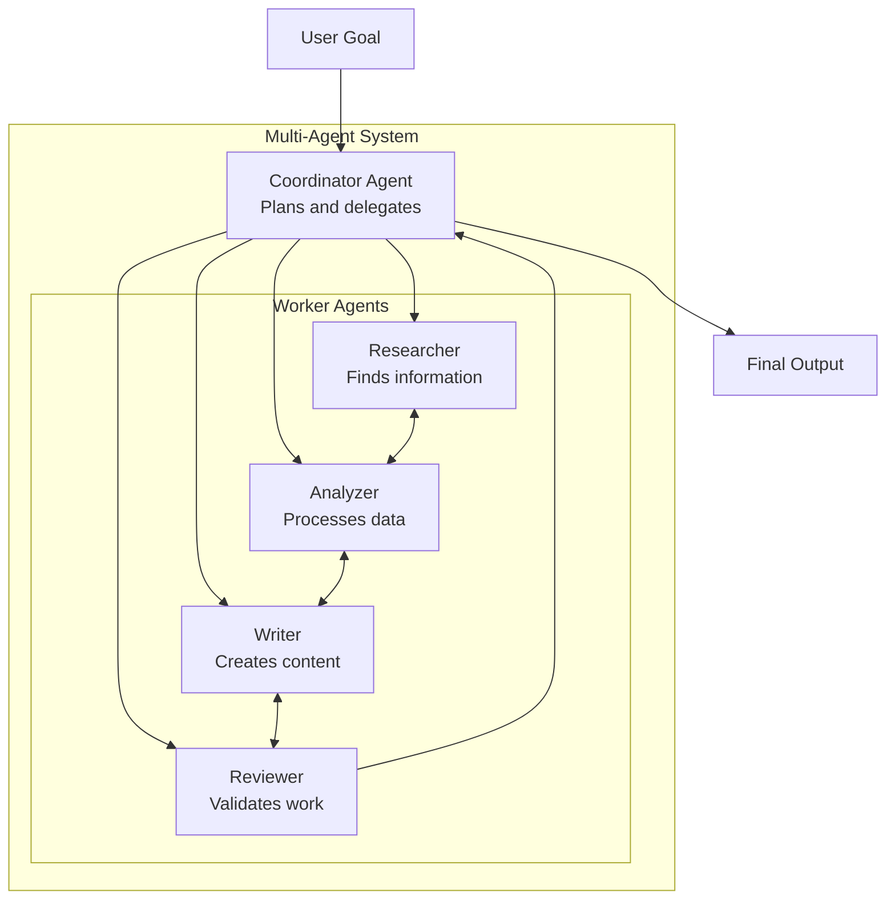

# Phase 5: Agentic AI Systems

# Part 16: Multi-Agent Systems (A2A)

**Building teams of AI agents that collaborate, coordinate, and communicate to solve complex problems.**

---

## The Target: What We're Building Right Now

In this part, we're building six powerful multi-agent components:

1. **A Coordinator Agent** — Orchestrates work across agents
2. **A Worker Agent** — Executes specific tasks
3. **A Communication Protocol** — Agent-to-agent messaging
4. **A Hierarchical Team** — Multi-level agent organization
5. **A Swarm System** — Decentralized agent collaboration
6. **A Complete Multi-Agent Framework** — Production-ready agent teams

**Why this matters:** Single agents are powerful, but multi-agent systems are transformative. They enable complex workflows, parallel work, specialized expertise, and human-like collaboration. This is how you build AI systems that can handle truly complex tasks.

---

## The Concept: Multi-Agent Systems

### The Team Analogy

Imagine you're running a software development company:

- **Project Manager** = Coordinator Agent (plans, delegates, tracks)
- **Developers** = Worker Agents (write code, fix bugs)
- **Designers** = Worker Agents (create UI/UX)
- **QA Engineers** = Worker Agents (test, validate)
- **DevOps** = Worker Agents (deploy, monitor)

**A multi-agent system is exactly like this team.** Each agent has specialized skills, communicates with others, and works together to achieve common goals.



### Agent Communication Patterns

| Pattern | Description | When to Use |
|---------|-------------|-------------|
| **Hierarchical** | Coordinator delegates to workers | Clear structure, defined roles |
| **Peer-to-Peer** | Agents communicate directly | Collaborative problem-solving |
| **Broadcast** | One agent sends to all | Information sharing |
| **Pipeline** | Sequential handoff | Step-by-step workflows |
| **Swarm** | Decentralized collaboration | Emergent problem-solving |

### Multi-Agent Framework Comparison

| Framework | Strengths | Use Cases |
|-----------|-----------|-----------|
| **LangGraph** | Graph-based, flexible | Complex workflows |
| **AutoGen** | Multi-agent conversations | Collaborative problem-solving |
| **CrewAI** | Role-based teams | Simple delegation |
| **OpenAI Swarm** | Lightweight, educational | Prototyping, exploration |

### Team Structures

| Structure | Description | Pros | Cons |
|-----------|-------------|------|------|
| **Centralized** | One coordinator | Clear leadership | Single point of failure |
| **Decentralized** | Peer-to-peer | Resilient | Coordination overhead |
| **Hybrid** | Combination | Balanced | Complex to manage |
| **Hierarchical** | Multiple levels | Scalable | Communication overhead |

---

## The Implementation: Building Our Multi-Agent System

### Target File Structure

```
phase-5-agents/
└── module-16-multi-agent/
    ├── 01_coordinator_agent.py
    ├── 02_worker_agent.py
    ├── 03_communication_protocol.py
    ├── 04_hierarchical_team.py
    ├── 05_swarm_system.py
    ├── 06_complete_multi_agent.py
    ├── requirements.txt
    └── README.md
```

### Step 1: Coordinator Agent

Create `01_coordinator_agent.py`:

```python
#!/usr/bin/env python3
"""
Module 16: Coordinator Agent

Orchestrates work across multiple agents.
"""

import os
import sys
from pathlib import Path
import json
from typing import List, Dict, Any, Optional
from datetime import datetime
import uuid

sys.path.insert(0, str(Path(__file__).parent.parent.parent.parent))

from shared.utils.config import load_config
from shared.utils.logging import setup_logging
from multi_provider_client import Message, AIClientFactory, Provider

setup_logging(debug=False)
config = load_config()

class CoordinatorAgent:
    """
    Coordinates work across multiple agents.
    
    Features:
    - Task decomposition
    - Agent assignment
    - Progress tracking
    - Result aggregation
    - Communication management
    """
    
    def __init__(
        self,
        name: str = "Coordinator",
        model: str = "gpt-4o-mini",
        provider: str = "openai"
    ):
        """
        Initialize the coordinator agent.
        
        Args:
            name: Coordinator name
            model: LLM model
            provider: Provider
        """
        self.name = name
        self.model = model
        self.provider = provider
        self.client = AIClientFactory.create(provider)
        
        self.tasks = {}
        self.agents = {}
        self.results = {}
        self.communications = []
        
        print(f"✅ Initialized coordinator: {name}")
    
    def register_agent(self, agent_id: str, capabilities: List[str]) -> None:
        """
        Register an agent with the coordinator.
        
        Args:
            agent_id: Agent identifier
            capabilities: List of agent capabilities
        """
        self.agents[agent_id] = {
            "id": agent_id,
            "capabilities": capabilities,
            "status": "idle",
            "current_task": None,
            "last_activity": datetime.now().isoformat()
        }
        print(f"   Registered agent: {agent_id} ({capabilities})")
    
    def assign_task(
        self,
        task_description: str,
        required_capabilities: List[str],
        priority: int = 1
    ) -> str:
        """
        Assign a task to the best available agent.
        
        Args:
            task_description: Description of the task
            required_capabilities: Required capabilities
            priority: Task priority
            
        Returns:
            Task ID
        """
        task_id = str(uuid.uuid4())[:8]
        
        # Find best agent
        best_agent = None
        best_score = -1
        
        for agent_id, agent_info in self.agents.items():
            if agent_info["status"] != "idle":
                continue
            
            # Score based on capability match
            capabilities = agent_info["capabilities"]
            score = sum(1 for cap in required_capabilities if cap in capabilities)
            
            if score > best_score:
                best_score = score
                best_agent = agent_id
        
        # Create task
        self.tasks[task_id] = {
            "id": task_id,
            "description": task_description,
            "required_capabilities": required_capabilities,
            "priority": priority,
            "assigned_to": best_agent,
            "status": "assigned" if best_agent else "pending",
            "created_at": datetime.now().isoformat(),
            "result": None
        }
        
        if best_agent:
            self.agents[best_agent]["status"] = "busy"
            self.agents[best_agent]["current_task"] = task_id
            print(f"   📋 Assigned task {task_id} to {best_agent}")
        else:
            print(f"   ⏳ Task {task_id} pending (no available agent)")
        
        return task_id
    
    def complete_task(self, task_id: str, result: Any) -> None:
        """
        Mark a task as completed.
        
        Args:
            task_id: Task ID
            result: Task result
        """
        if task_id not in self.tasks:
            return
        
        task = self.tasks[task_id]
        task["status"] = "completed"
        task["result"] = result
        task["completed_at"] = datetime.now().isoformat()
        
        # Free the agent
        if task["assigned_to"]:
            self.agents[task["assigned_to"]]["status"] = "idle"
            self.agents[task["assigned_to"]]["current_task"] = None
        
        print(f"   ✅ Task {task_id} completed")
    
    def get_next_task(self, agent_id: str) -> Optional[Dict[str, Any]]:
        """
        Get the next task for an agent.
        
        Args:
            agent_id: Agent identifier
            
        Returns:
            Task or None
        """
        # Find highest priority pending task
        pending_tasks = [
            t for t in self.tasks.values()
            if t["status"] == "pending"
        ]
        
        if not pending_tasks:
            return None
        
        # Sort by priority
        pending_tasks.sort(key=lambda x: x["priority"], reverse=True)
        
        return pending_tasks[0]
    
    def communicate(
        self,
        from_agent: str,
        to_agent: str,
        message: str,
        message_type: str = "direct"
    ) -> None:
        """
        Handle communication between agents.
        
        Args:
            from_agent: Sender agent
            to_agent: Recipient agent
            message: Message content
            message_type: Type of message
        """
        communication = {
            "id": str(uuid.uuid4())[:8],
            "from": from_agent,
            "to": to_agent,
            "message": message,
            "type": message_type,
            "timestamp": datetime.now().isoformat(),
            "delivered": False
        }
        
        self.communications.append(communication)
        print(f"   💬 {from_agent} -> {to_agent}: {message[:50]}...")
    
    def get_status(self) -> Dict[str, Any]:
        """
        Get system status.
        
        Returns:
            Status information
        """
        return {
            "agents": self.agents,
            "tasks": {
                "total": len(self.tasks),
                "pending": sum(1 for t in self.tasks.values() if t["status"] == "pending"),
                "assigned": sum(1 for t in self.tasks.values() if t["status"] == "assigned"),
                "completed": sum(1 for t in self.tasks.values() if t["status"] == "completed")
            },
            "communications": len(self.communications)
        }

def demonstrate_coordinator():
    """Demonstrate the coordinator agent."""
    print("\n" + "="*80)
    print("🎯 COORDINATOR AGENT DEMONSTRATION")
    print("="*80)
    
    coordinator = CoordinatorAgent()
    
    # Register agents
    coordinator.register_agent("researcher", ["research", "analysis", "writing"])
    coordinator.register_agent("writer", ["writing", "editing", "research"])
    coordinator.register_agent("reviewer", ["review", "analysis", "quality"])
    
    # Assign tasks
    print("\n📋 Assigning tasks...")
    
    task1 = coordinator.assign_task(
        "Research the latest developments in AI",
        ["research", "analysis"]
    )
    
    task2 = coordinator.assign_task(
        "Write a summary of AI developments",
        ["writing", "editing"]
    )
    
    task3 = coordinator.assign_task(
        "Review the AI developments summary",
        ["review", "quality"]
    )
    
    # Simulate task completion
    coordinator.complete_task(task1, {"findings": "Latest AI developments..."})
    coordinator.complete_task(task2, {"summary": "AI summary content..."})
    
    # Show status
    print("\n📊 System Status:")
    print(json.dumps(coordinator.get_status(), indent=2, default=str))

def main():
    """Run the coordinator demonstration."""
    print("\n" + "="*80)
    print("AI TUTORIAL SERIES - COORDINATOR AGENT")
    print("="*80)
    
    demonstrate_coordinator()

if __name__ == "__main__":
    main()
```

### Step 2: Worker Agent

Create `02_worker_agent.py`:

```python
#!/usr/bin/env python3
"""
Module 16: Worker Agent

Performs specific tasks in a multi-agent system.
"""

import os
import sys
from pathlib import Path
import json
from typing import List, Dict, Any, Optional
from datetime import datetime
import threading
import time

sys.path.insert(0, str(Path(__file__).parent.parent.parent.parent))

from shared.utils.config import load_config
from shared.utils.logging import setup_logging
from multi_provider_client import Message, AIClientFactory, Provider

setup_logging(debug=False)
config = load_config()

class WorkerAgent:
    """
    A worker agent that performs specific tasks.
    
    Features:
    - Task execution
    - Capability reporting
    - Progress updates
    - Communication
    - Status management
    """
    
    def __init__(
        self,
        agent_id: str,
        capabilities: List[str],
        model: str = "gpt-4o-mini",
        provider: str = "openai"
    ):
        """
        Initialize the worker agent.
        
        Args:
            agent_id: Agent identifier
            capabilities: List of capabilities
            model: LLM model
            provider: Provider
        """
        self.agent_id = agent_id
        self.capabilities = capabilities
        self.model = model
        self.provider = provider
        
        self.client = AIClientFactory.create(provider)
        self.current_task = None
        self.status = "idle"
        self.history = []
        
        print(f"✅ Initialized worker: {agent_id}")
        print(f"   Capabilities: {capabilities}")
    
    def execute_task(self, task: Dict[str, Any]) -> Dict[str, Any]:
        """
        Execute a task.
        
        Args:
            task: Task description
            
        Returns:
            Task result
        """
        self.status = "busy"
        self.current_task = task
        
        print(f"\n⚡ {self.agent_id} executing task: {task.get('description', '')[:50]}...")
        
        start_time = time.time()
        
        try:
            # Execute based on capabilities
            result = self._execute(task)
            
            elapsed = time.time() - start_time
            
            # Record success
            self.history.append({
                "task": task,
                "result": result,
                "status": "success",
                "elapsed": elapsed
            })
            
            self.status = "idle"
            self.current_task = None
            
            return {
                "success": True,
                "result": result,
                "agent_id": self.agent_id,
                "elapsed": elapsed
            }
            
        except Exception as e:
            elapsed = time.time() - start_time
            
            self.history.append({
                "task": task,
                "error": str(e),
                "status": "failed",
                "elapsed": elapsed
            })
            
            self.status = "idle"
            self.current_task = None
            
            return {
                "success": False,
                "error": str(e),
                "agent_id": self.agent_id,
                "elapsed": elapsed
            }
    
    def _execute(self, task: Dict[str, Any]) -> Any:
        """
        Execute the actual task.
        
        Args:
            task: Task to execute
            
        Returns:
            Execution result
        """
        description = task.get("description", "")
        task_type = task.get("type", "general")
        
        # Use LLM to execute based on capabilities
        prompt = f"""
You are {self.agent_id}, an AI worker with capabilities: {self.capabilities}
Task: {description}
Task Type: {task_type}

Execute this task and provide the result.
Be specific and detailed.
"""
        
        messages = [Message(role="user", content=prompt)]
        response = self.client.chat(
            messages=messages,
            model=self.model,
            temperature=0.5,
            max_tokens=500
        )
        
        return {
            "output": response.content,
            "task_id": task.get("id", "unknown"),
            "agent_id": self.agent_id
        }
    
    def communicate(self, recipient: str, message: str) -> Dict[str, Any]:
        """
        Send a message to another agent.
        
        Args:
            recipient: Recipient agent ID
            message: Message content
            
        Returns:
            Communication record
        """
        return {
            "from": self.agent_id,
            "to": recipient,
            "message": message,
            "timestamp": datetime.now().isoformat()
        }
    
    def get_status(self) -> Dict[str, Any]:
        """
        Get agent status.
        
        Returns:
            Status information
        """
        return {
            "agent_id": self.agent_id,
            "status": self.status,
            "current_task": self.current_task,
            "capabilities": self.capabilities,
            "history_count": len(self.history),
            "success_rate": sum(1 for h in self.history if h["status"] == "success") / len(self.history) if self.history else 0
        }

def demonstrate_worker():
    """Demonstrate the worker agent."""
    print("\n" + "="*80)
    print("👷 WORKER AGENT DEMONSTRATION")
    print("="*80)
    
    if not config.get("openai_api_key"):
        print("❌ OpenAI API key not available")
        return
    
    # Create worker
    worker = WorkerAgent(
        agent_id="researcher_1",
        capabilities=["research", "analysis", "writing"]
    )
    
    # Execute a task
    task = {
        "id": "task_1",
        "description": "Research the latest trends in AI agents and summarize findings",
        "type": "research"
    }
    
    print("\n📋 Executing task...")
    result = worker.execute_task(task)
    
    if result["success"]:
        print(f"\n✅ Task completed in {result['elapsed']:.2f}s")
        print(f"Result: {json.dumps(result['result'], indent=2)}")
    else:
        print(f"❌ Task failed: {result.get('error')}")
    
    # Show status
    print("\n📊 Worker Status:")
    print(json.dumps(worker.get_status(), indent=2))

def main():
    """Run the worker demonstration."""
    print("\n" + "="*80)
    print("AI TUTORIAL SERIES - WORKER AGENT")
    print("="*80)
    
    demonstrate_worker()

if __name__ == "__main__":
    main()
```

### Step 3: Communication Protocol

Create `03_communication_protocol.py`:

```python
#!/usr/bin/env python3
"""
Module 16: Communication Protocol

Agent-to-agent messaging with rich communication patterns.
"""

import os
import sys
from pathlib import Path
import json
from typing import List, Dict, Any, Optional
from datetime import datetime
import uuid

sys.path.insert(0, str(Path(__file__).parent.parent.parent.parent))

from shared.utils.config import load_config
from shared.utils.logging import setup_logging

setup_logging(debug=False)
config = load_config()

class CommunicationProtocol:
    """
    Agent-to-agent communication protocol.
    
    Features:
    - Direct messaging
    - Broadcast
    - Pub/Sub
    - Request/Response
    - Event notification
    """
    
    def __init__(self):
        """Initialize the communication protocol."""
        self.messages = []
        self.subscribers = {}
        self.message_id = 0
        self.callbacks = {}
        
        print("✅ Initialized communication protocol")
    
    def send_direct(
        self,
        from_agent: str,
        to_agent: str,
        content: str,
        content_type: str = "text",
        metadata: Dict[str, Any] = None
    ) -> Dict[str, Any]:
        """
        Send a direct message to an agent.
        
        Args:
            from_agent: Sender
            to_agent: Recipient
            content: Message content
            content_type: Type of content
            metadata: Additional metadata
            
        Returns:
            Message record
        """
        message = self._create_message(
            sender=from_agent,
            recipients=[to_agent],
            content=content,
            content_type=content_type,
            message_type="direct",
            metadata=metadata
        )
        
        self.messages.append(message)
        
        # Trigger callback if registered
        if to_agent in self.callbacks:
            self.callbacks[to_agent](message)
        
        return message
    
    def send_broadcast(
        self,
        from_agent: str,
        agents: List[str],
        content: str,
        content_type: str = "text",
        metadata: Dict[str, Any] = None
    ) -> List[Dict[str, Any]]:
        """
        Broadcast a message to multiple agents.
        
        Args:
            from_agent: Sender
            agents: List of recipients
            content: Message content
            content_type: Type of content
            metadata: Additional metadata
            
        Returns:
            List of message records
        """
        messages = []
        
        for agent in agents:
            message = self._create_message(
                sender=from_agent,
                recipients=[agent],
                content=content,
                content_type=content_type,
                message_type="broadcast",
                metadata=metadata
            )
            
            self.messages.append(message)
            messages.append(message)
            
            # Trigger callback if registered
            if agent in self.callbacks:
                self.callbacks[agent](message)
        
        return messages
    
    def send_request(
        self,
        from_agent: str,
        to_agent: str,
        request_type: str,
        data: Dict[str, Any],
        timeout: int = 30
    ) -> Dict[str, Any]:
        """
        Send a request expecting a response.
        
        Args:
            from_agent: Sender
            to_agent: Recipient
            request_type: Type of request
            data: Request data
            timeout: Timeout in seconds
            
        Returns:
            Response or error
        """
        message = self._create_message(
            sender=from_agent,
            recipients=[to_agent],
            content=json.dumps(data),
            content_type="request",
            message_type="request",
            metadata={"request_type": request_type, "timeout": timeout}
        )
        
        self.messages.append(message)
        
        # In a real system, you'd wait for a response
        # For demonstration, return immediately
        
        return {
            "success": True,
            "request_id": message["id"],
            "message": "Request sent, waiting for response"
        }
    
    def publish(self, topic: str, from_agent: str, content: str) -> Dict[str, Any]:
        """
        Publish to a topic.
        
        Args:
            topic: Topic name
            from_agent: Publisher
            content: Message content
            
        Returns:
            Publication record
        """
        message = self._create_message(
            sender=from_agent,
            recipients=[],
            content=content,
            content_type="text",
            message_type="pubsub",
            metadata={"topic": topic}
        )
        
        self.messages.append(message)
        
        # Deliver to subscribers
        if topic in self.subscribers:
            for subscriber in self.subscribers[topic]:
                if subscriber in self.callbacks:
                    self.callbacks[subscriber](message)
        
        return message
    
    def subscribe(self, topic: str, agent: str) -> None:
        """
        Subscribe to a topic.
        
        Args:
            topic: Topic name
            agent: Subscribing agent
        """
        if topic not in self.subscribers:
            self.subscribers[topic] = []
        
        if agent not in self.subscribers[topic]:
            self.subscribers[topic].append(agent)
            print(f"📡 {agent} subscribed to {topic}")
    
    def register_callback(self, agent: str, callback: callable) -> None:
        """
        Register a callback for an agent.
        
        Args:
            agent: Agent ID
            callback: Callback function
        """
        self.callbacks[agent] = callback
        print(f"🔗 Registered callback for {agent}")
    
    def _create_message(
        self,
        sender: str,
        recipients: List[str],
        content: str,
        content_type: str,
        message_type: str,
        metadata: Dict[str, Any] = None
    ) -> Dict[str, Any]:
        """
        Create a message.
        
        Args:
            sender: Sender ID
            recipients: Recipient IDs
            content: Message content
            content_type: Type of content
            message_type: Type of message
            metadata: Additional metadata
            
        Returns:
            Message dictionary
        """
        self.message_id += 1
        
        return {
            "id": str(self.message_id),
            "sender": sender,
            "recipients": recipients,
            "content": content,
            "content_type": content_type,
            "message_type": message_type,
            "metadata": metadata or {},
            "timestamp": datetime.now().isoformat(),
            "delivered": False
        }
    
    def get_messages_for_agent(self, agent: str) -> List[Dict[str, Any]]:
        """
        Get messages for an agent.
        
        Args:
            agent: Agent ID
            
        Returns:
            List of messages
        """
        return [
            m for m in self.messages
            if agent in m["recipients"] or m["sender"] == agent
        ]
    
    def get_conversation(self, agent1: str, agent2: str) -> List[Dict[str, Any]]:
        """
        Get conversation between two agents.
        
        Args:
            agent1: First agent
            agent2: Second agent
            
        Returns:
            List of messages
        """
        return [
            m for m in self.messages
            if (m["sender"] == agent1 and agent2 in m["recipients"]) or
               (m["sender"] == agent2 and agent1 in m["recipients"])
        ]

def demonstrate_communication():
    """Demonstrate the communication protocol."""
    print("\n" + "="*80)
    print("💬 COMMUNICATION PROTOCOL DEMONSTRATION")
    print("="*80)
    
    protocol = CommunicationProtocol()
    
    # Register callbacks
    def on_message(message):
        print(f"   📨 {message['sender']} -> {message['recipients'][0]}: {message['content'][:50]}...")
    
    protocol.register_callback("worker_1", on_message)
    protocol.register_callback("worker_2", on_message)
    
    # Direct message
    print("\n📋 Direct Message:")
    protocol.send_direct(
        from_agent="coordinator",
        to_agent="worker_1",
        content="Please research AI trends",
        metadata={"priority": "high"}
    )
    
    # Broadcast
    print("\n📋 Broadcast:")
    protocol.send_broadcast(
        from_agent="coordinator",
        agents=["worker_1", "worker_2", "worker_3"],
        content="Team meeting at 3 PM",
        metadata={"type": "announcement"}
    )
    
    # Pub/Sub
    print("\n📋 Pub/Sub:")
    protocol.subscribe("research_topic", "worker_1")
    protocol.subscribe("research_topic", "worker_2")
    
    protocol.publish(
        topic="research_topic",
        from_agent="coordinator",
        content="New research data available"
    )
    
    # Get conversation
    print("\n📋 Conversation:")
    messages = protocol.get_conversation("coordinator", "worker_1")
    for msg in messages:
        print(f"   {msg['sender']} -> {msg['recipients'][0]}: {msg['content'][:50]}...")

def main():
    """Run the communication demonstration."""
    print("\n" + "="*80)
    print("AI TUTORIAL SERIES - COMMUNICATION PROTOCOL")
    print("="*80)
    
    demonstrate_communication()

if __name__ == "__main__":
    main()
```

### Step 4: Hierarchical Team

Create `04_hierarchical_team.py`:

```python
#!/usr/bin/env python3
"""
Module 16: Hierarchical Team

Multi-level agent organization.
"""

import os
import sys
from pathlib import Path
import json
from typing import List, Dict, Any, Optional
from datetime import datetime

sys.path.insert(0, str(Path(__file__).parent.parent.parent.parent))

from shared.utils.config import load_config
from shared.utils.logging import setup_logging
from coordinator_agent import CoordinatorAgent
from worker_agent import WorkerAgent
from communication_protocol import CommunicationProtocol

setup_logging(debug=False)
config = load_config()

class HierarchicalTeam:
    """
    Hierarchical team of agents.
    
    Features:
    - Multi-level organization
    - Delegation chain
    - Escalation
    - Performance tracking
    - Team coordination
    """
    
    def __init__(self, name: str = "Team"):
        """
        Initialize the hierarchical team.
        
        Args:
            name: Team name
        """
        self.name = name
        self.coordinator = CoordinatorAgent(f"{name}_Coordinator")
        self.communication = CommunicationProtocol()
        
        self.agents = {}
        self.levels = {}
        self.task_history = []
        
        print(f"✅ Initialized hierarchical team: {name}")
    
    def add_agent(
        self,
        agent_id: str,
        capabilities: List[str],
        level: int = 1
    ) -> None:
        """
        Add an agent to the team.
        
        Args:
            agent_id: Agent ID
            capabilities: Agent capabilities
            level: Hierarchy level
        """
        agent = WorkerAgent(agent_id, capabilities)
        self.agents[agent_id] = agent
        self.coordinator.register_agent(agent_id, capabilities)
        
        if level not in self.levels:
            self.levels[level] = []
        self.levels[level].append(agent_id)
        
        print(f"   Added {agent_id} (Level {level})")
    
    def assign_task(
        self,
        task_description: str,
        required_capabilities: List[str],
        priority: int = 1
    ) -> str:
        """
        Assign a task through the hierarchy.
        
        Args:
            task_description: Task description
            required_capabilities: Required capabilities
            priority: Task priority
            
        Returns:
            Task ID
        """
        # Coordinator assigns the task
        task_id = self.coordinator.assign_task(
            task_description,
            required_capabilities,
            priority
        )
        
        # Add to history
        self.task_history.append({
            "task_id": task_id,
            "description": task_description,
            "assigned_at": datetime.now().isoformat(),
            "status": "assigned"
        })
        
        # If no agent available, escalate
        if self.coordinator.tasks[task_id]["status"] == "pending":
            self._escalate_task(task_id)
        
        return task_id
    
    def _escalate_task(self, task_id: str) -> None:
        """
        Escalate a task to a higher level.
        
        Args:
            task_id: Task ID
        """
        print(f"   ⬆️ Escalating task {task_id}")
        
        # Try higher level agents
        for level in sorted(self.levels.keys(), reverse=True):
            for agent_id in self.levels[level]:
                if agent_id not in self.agents:
                    continue
                
                # Check if this agent can handle it
                agent = self.agents[agent_id]
                task = self.coordinator.tasks[task_id]
                required = task.get("required_capabilities", [])
                
                if any(cap in agent.capabilities for cap in required):
                    # Assign to this agent
                    task["assigned_to"] = agent_id
                    task["status"] = "assigned"
                    agent.status = "busy"
                    agent.current_task = task
                    
                    print(f"   ✅ Escalated to {agent_id}")
                    break
            else:
                continue
            break
    
    def execute_next(self, agent_id: str) -> Optional[Dict[str, Any]]:
        """
        Execute the next task for an agent.
        
        Args:
            agent_id: Agent ID
            
        Returns:
            Task result or None
        """
        # Get next task from coordinator
        task = self.coordinator.get_next_task(agent_id)
        
        if not task:
            return None
        
        # Execute the task
        agent = self.agents.get(agent_id)
        if not agent:
            return None
        
        result = agent.execute_task(task)
        
        # Mark task as complete
        self.coordinator.complete_task(task["id"], result)
        
        return result
    
    def get_status(self) -> Dict[str, Any]:
        """
        Get team status.
        
        Returns:
            Team status
        """
        return {
            "name": self.name,
            "coordinator": self.coordinator.get_status(),
            "agents": {
                agent_id: agent.get_status()
                for agent_id, agent in self.agents.items()
            },
            "levels": {
                level: len(agents)
                for level, agents in self.levels.items()
            },
            "task_history": len(self.task_history)
        }

def demonstrate_hierarchical_team():
    """Demonstrate the hierarchical team."""
    print("\n" + "="*80)
    print("🏢 HIERARCHICAL TEAM DEMONSTRATION")
    print("="*80)
    
    if not config.get("openai_api_key"):
        print("❌ OpenAI API key not available")
        return
    
    # Create team
    team = HierarchicalTeam("ResearchTeam")
    
    # Add agents at different levels
    team.add_agent(
        "junior_researcher",
        ["research", "analysis"],
        level=1
    )
    
    team.add_agent(
        "senior_researcher",
        ["research", "analysis", "writing", "review"],
        level=2
    )
    
    team.add_agent(
        "lead_researcher",
        ["research", "analysis", "writing", "review", "strategy"],
        level=3
    )
    
    # Assign tasks
    print("\n📋 Assigning tasks...")
    
    task1 = team.assign_task(
        "Research recent AI trends",
        ["research", "analysis"],
        priority=1
    )
    
    task2 = team.assign_task(
        "Write a comprehensive report on AI",
        ["writing", "review"],
        priority=2
    )
    
    # Execute tasks
    print("\n⚡ Executing tasks...")
    
    # Simulate execution by different agents
    for agent_id in ["junior_researcher", "senior_researcher"]:
        result = team.execute_next(agent_id)
        if result:
            print(f"   ✅ {agent_id} completed task")
    
    # Show status
    print("\n📊 Team Status:")
    status = team.get_status()
    print(json.dumps(status, indent=2, default=str))

def main():
    """Run the hierarchical team demonstration."""
    print("\n" + "="*80)
    print("AI TUTORIAL SERIES - HIERARCHICAL TEAM")
    print("="*80)
    
    demonstrate_hierarchical_team()

if __name__ == "__main__":
    main()
```

### Step 5: Swarm System

Create `05_swarm_system.py`:

```python
#!/usr/bin/env python3
"""
Module 16: Swarm System

Decentralized agent collaboration.
"""

import os
import sys
from pathlib import Path
import json
from typing import List, Dict, Any, Optional
from datetime import datetime
import random
import threading
import time

sys.path.insert(0, str(Path(__file__).parent.parent.parent.parent))

from shared.utils.config import load_config
from shared.utils.logging import setup_logging
from worker_agent import WorkerAgent
from communication_protocol import CommunicationProtocol

setup_logging(debug=False)
config = load_config()

class SwarmSystem:
    """
    Decentralized swarm of agents.
    
    Features:
    - Decentralized coordination
    - Emergent behavior
    - Self-organization
    - Consensus building
    - Resilience
    """
    
    def __init__(self, name: str = "Swarm"):
        """
        Initialize the swarm system.
        
        Args:
            name: Swarm name
        """
        self.name = name
        self.agents = {}
        self.communication = CommunicationProtocol()
        self.tasks = []
        self.results = []
        self.running = False
        
        print(f"✅ Initialized swarm: {name}")
    
    def add_agent(self, agent_id: str, capabilities: List[str]) -> None:
        """
        Add an agent to the swarm.
        
        Args:
            agent_id: Agent ID
            capabilities: Agent capabilities
        """
        agent = WorkerAgent(agent_id, capabilities)
        self.agents[agent_id] = agent
        
        # Register for communication
        def on_message(message):
            print(f"   📨 {message['sender']} -> {agent_id}: {message['content'][:50]}...")
        
        self.communication.register_callback(agent_id, on_message)
        
        print(f"   Added {agent_id} to swarm")
    
    def submit_task(self, task: Dict[str, Any]) -> str:
        """
        Submit a task to the swarm.
        
        Args:
            task: Task description
            
        Returns:
            Task ID
        """
        task_id = f"task_{len(self.tasks) + 1}"
        task["id"] = task_id
        task["status"] = "pending"
        task["submitted_at"] = datetime.now().isoformat()
        
        self.tasks.append(task)
        
        # Announce task to swarm
        self.communication.publish(
            topic="new_tasks",
            from_agent="system",
            content=f"New task: {task.get('description', '')[:50]}..."
        )
        
        print(f"📋 Submitted task {task_id}: {task.get('description', '')[:50]}...")
        
        return task_id
    
    def run(self, max_iterations: int = 10) -> None:
        """
        Run the swarm.
        
        Args:
            max_iterations: Maximum iterations
        """
        self.running = True
        
        print(f"\n🚀 Starting swarm '{self.name}'")
        print(f"   Agents: {len(self.agents)}")
        print(f"   Tasks: {len(self.tasks)}")
        
        iteration = 0
        
        while self.running and iteration < max_iterations:
            iteration += 1
            
            # Each agent processes one task
            for agent_id, agent in self.agents.items():
                if agent.status != "idle":
                    continue
                
                # Find a task this agent can do
                task = self._find_task_for_agent(agent)
                
                if task:
                    # Agent executes the task
                    result = agent.execute_task(task)
                    task["status"] = "completed"
                    task["completed_at"] = datetime.now().isoformat()
                    task["completed_by"] = agent_id
                    
                    self.results.append(result)
                    
                    # Publish result
                    self.communication.publish(
                        topic="completed_tasks",
                        from_agent=agent_id,
                        content=f"Completed: {task.get('description', '')[:50]}..."
                    )
            
            # Check if all tasks are done
            pending = [t for t in self.tasks if t["status"] == "pending"]
            if not pending:
                print(f"✅ All tasks completed in {iteration} iterations")
                break
            
            # Wait a bit before next iteration
            time.sleep(0.5)
        
        self.running = False
    
    def _find_task_for_agent(self, agent: WorkerAgent) -> Optional[Dict[str, Any]]:
        """
        Find a task for an agent.
        
        Args:
            agent: Agent to find task for
            
        Returns:
            Task or None
        """
        for task in self.tasks:
            if task["status"] != "pending":
                continue
            
            required = task.get("required_capabilities", [])
            
            # Check if agent has any required capability
            if any(cap in agent.capabilities for cap in required):
                return task
        
        return None
    
    def get_status(self) -> Dict[str, Any]:
        """
        Get swarm status.
        
        Returns:
            Swarm status
        """
        return {
            "name": self.name,
            "agents": {
                agent_id: agent.get_status()
                for agent_id, agent in self.agents.items()
            },
            "tasks": {
                "total": len(self.tasks),
                "pending": sum(1 for t in self.tasks if t["status"] == "pending"),
                "completed": sum(1 for t in self.tasks if t["status"] == "completed")
            },
            "results": len(self.results)
        }

def demonstrate_swarm():
    """Demonstrate the swarm system."""
    print("\n" + "="*80)
    print("🐝 SWARM SYSTEM DEMONSTRATION")
    print("="*80)
    
    if not config.get("openai_api_key"):
        print("❌ OpenAI API key not available")
        return
    
    # Create swarm
    swarm = SwarmSystem("ResearchSwarm")
    
    # Add agents with different capabilities
    swarm.add_agent("researcher_1", ["research", "analysis"])
    swarm.add_agent("researcher_2", ["research", "writing"])
    swarm.add_agent("researcher_3", ["analysis", "review"])
    swarm.add_agent("researcher_4", ["writing", "review"])
    
    # Submit tasks
    print("\n📋 Submitting tasks...")
    
    tasks = [
        {
            "description": "Research AI trends in 2024",
            "required_capabilities": ["research"]
        },
        {
            "description": "Analyze the AI trends research",
            "required_capabilities": ["analysis"]
        },
        {
            "description": "Write a summary of AI trends",
            "required_capabilities": ["writing"]
        },
        {
            "description": "Review the AI trends summary",
            "required_capabilities": ["review"]
        }
    ]
    
    for task in tasks:
        swarm.submit_task(task)
    
    # Run the swarm
    swarm.run(max_iterations=5)
    
    # Show status
    print("\n📊 Swarm Status:")
    print(json.dumps(swarm.get_status(), indent=2, default=str))

def main():
    """Run the swarm demonstration."""
    print("\n" + "="*80)
    print("AI TUTORIAL SERIES - SWARM SYSTEM")
    print("="*80)
    
    demonstrate_swarm()

if __name__ == "__main__":
    main()
```

### Step 6: Complete Multi-Agent Framework

Create `06_complete_multi_agent.py`:

```python
#!/usr/bin/env python3
"""
Module 16: Complete Multi-Agent Framework

Production-ready multi-agent system with all features.
"""

import os
import sys
from pathlib import Path
import json
from typing import List, Dict, Any, Optional
from datetime import datetime
import threading
import queue

sys.path.insert(0, str(Path(__file__).parent.parent.parent.parent))

from shared.utils.config import load_config
from shared.utils.logging import setup_logging
from coordinator_agent import CoordinatorAgent
from worker_agent import WorkerAgent
from communication_protocol import CommunicationProtocol
from hierarchical_team import HierarchicalTeam
from swarm_system import SwarmSystem

setup_logging(debug=False)
config = load_config()

class CompleteMultiAgentSystem:
    """
    Complete multi-agent system.
    
    Features:
    - Multiple team structures
    - Agent lifecycle management
    - Task distribution
    - Monitoring and logging
    - Performance metrics
    """
    
    def __init__(self, name: str = "MultiAgentSystem"):
        """
        Initialize the complete multi-agent system.
        
        Args:
            name: System name
        """
        self.name = name
        self.teams = {}
        self.swarms = {}
        self.communication = CommunicationProtocol()
        self.metrics = {
            "total_tasks": 0,
            "completed_tasks": 0,
            "failed_tasks": 0,
            "started_at": datetime.now().isoformat()
        }
        self.task_queue = queue.Queue()
        
        print(f"✅ Initialized multi-agent system: {name}")
    
    def create_team(
        self,
        team_name: str,
        structure: str = "hierarchical"
    ) -> str:
        """
        Create a team.
        
        Args:
            team_name: Team name
            structure: Team structure (hierarchical, swarm)
            
        Returns:
            Team ID
        """
        team_id = f"team_{len(self.teams) + 1}"
        
        if structure == "hierarchical":
            team = HierarchicalTeam(team_name)
        elif structure == "swarm":
            team = SwarmSystem(team_name)
        else:
            raise ValueError(f"Unknown structure: {structure}")
        
        self.teams[team_id] = {
            "id": team_id,
            "name": team_name,
            "structure": structure,
            "instance": team,
            "created_at": datetime.now().isoformat()
        }
        
        print(f"✅ Created team: {team_name} ({structure})")
        return team_id
    
    def add_agent_to_team(
        self,
        team_id: str,
        agent_id: str,
        capabilities: List[str],
        level: int = 1
    ) -> None:
        """
        Add an agent to a team.
        
        Args:
            team_id: Team ID
            agent_id: Agent ID
            capabilities: Agent capabilities
            level: Hierarchy level (for hierarchical teams)
        """
        if team_id not in self.teams:
            raise ValueError(f"Team {team_id} not found")
        
        team = self.teams[team_id]["instance"]
        team.add_agent(agent_id, capabilities, level)
    
    def assign_task(
        self,
        team_id: str,
        task_description: str,
        required_capabilities: List[str],
        priority: int = 1
    ) -> str:
        """
        Assign a task to a team.
        
        Args:
            team_id: Team ID
            task_description: Task description
            required_capabilities: Required capabilities
            priority: Task priority
            
        Returns:
            Task ID
        """
        if team_id not in self.teams:
            raise ValueError(f"Team {team_id} not found")
        
        self.metrics["total_tasks"] += 1
        
        team = self.teams[team_id]["instance"]
        
        if isinstance(team, HierarchicalTeam):
            task_id = team.assign_task(task_description, required_capabilities, priority)
        elif isinstance(team, SwarmSystem):
            task = {
                "description": task_description,
                "required_capabilities": required_capabilities,
                "priority": priority
            }
            task_id = team.submit_task(task)
        else:
            raise ValueError(f"Unknown team type")
        
        self.task_queue.put(task_id)
        
        return task_id
    
    def run(self, max_iterations: int = 10) -> Dict[str, Any]:
        """
        Run the multi-agent system.
        
        Args:
            max_iterations: Maximum iterations
            
        Returns:
            System results
        """
        print(f"\n🚀 Running {self.name}...")
        print(f"   Teams: {len(self.teams)}")
        print(f"   Tasks: {self.metrics['total_tasks']}")
        
        results = {}
        
        for team_id, team_info in self.teams.items():
            team = team_info["instance"]
            
            if isinstance(team, HierarchicalTeam):
                # Run hierarchical team
                team_results = self._run_hierarchical(team, max_iterations)
            elif isinstance(team, SwarmSystem):
                # Run swarm
                team.run(max_iterations)
                team_results = team.get_status()
            else:
                team_results = {"error": "Unknown team type"}
            
            results[team_id] = team_results
            
            # Update metrics
            if isinstance(team_results, dict):
                tasks = team_results.get("tasks", {})
                self.metrics["completed_tasks"] += tasks.get("completed", 0)
                self.metrics["failed_tasks"] += tasks.get("failed", 0)
        
        self.metrics["completed_at"] = datetime.now().isoformat()
        
        return {
            "results": results,
            "metrics": self.metrics
        }
    
    def _run_hierarchical(self, team: HierarchicalTeam, max_iterations: int) -> Dict[str, Any]:
        """
        Run a hierarchical team.
        
        Args:
            team: Hierarchical team
            max_iterations: Maximum iterations
            
        Returns:
            Team results
        """
        iteration = 0
        
        while iteration < max_iterations:
            iteration += 1
            
            # Check for tasks to execute
            for agent_id in team.agents:
                result = team.execute_next(agent_id)
                if not result:
                    continue
            
            # Check if all tasks are done
            tasks = team.coordinator.tasks
            pending = [t for t in tasks.values() if t["status"] in ["pending", "assigned"]]
            
            if not pending:
                print(f"   ✅ All tasks completed in {iteration} iterations")
                break
        
        return team.get_status()

def demonstrate_complete_multi_agent():
    """Demonstrate the complete multi-agent system."""
    print("\n" + "="*80)
    print("🤝 COMPLETE MULTI-AGENT SYSTEM DEMONSTRATION")
    print("="*80)
    
    if not config.get("openai_api_key"):
        print("❌ OpenAI API key not available")
        return
    
    # Create system
    system = CompleteMultiAgentSystem("ResearchSystem")
    
    # Create teams
    research_team = system.create_team("ResearchTeam", "hierarchical")
    analysis_swarm = system.create_team("AnalysisSwarm", "swarm")
    
    # Add agents to hierarchical team
    system.add_agent_to_team(
        research_team,
        "junior_researcher",
        ["research", "analysis"],
        level=1
    )
    system.add_agent_to_team(
        research_team,
        "senior_researcher",
        ["research", "analysis", "writing"],
        level=2
    )
    system.add_agent_to_team(
        research_team,
        "lead_researcher",
        ["research", "analysis", "writing", "review"],
        level=3
    )
    
    # Add agents to swarm
    system.add_agent_to_team(
        analysis_swarm,
        "analyzer_1",
        ["analysis", "statistics"]
    )
    system.add_agent_to_team(
        analysis_swarm,
        "analyzer_2",
        ["analysis", "visualization"]
    )
    system.add_agent_to_team(
        analysis_swarm,
        "analyzer_3",
        ["analysis", "reporting"]
    )
    
    # Assign tasks
    print("\n📋 Assigning tasks...")
    
    system.assign_task(
        research_team,
        "Research the latest developments in AI agents",
        ["research", "analysis"],
        priority=1
    )
    
    system.assign_task(
        research_team,
        "Write a comprehensive report on AI agent frameworks",
        ["writing", "review"],
        priority=2
    )
    
    system.assign_task(
        analysis_swarm,
        "Analyze the AI agent research data",
        ["analysis", "statistics"],
        priority=1
    )
    
    # Run the system
    results = system.run(max_iterations=5)
    
    print("\n📊 System Results:")
    print(json.dumps(results, indent=2, default=str))

def main():
    """Run the complete multi-agent demonstration."""
    print("\n" + "="*80)
    print("AI TUTORIAL SERIES - COMPLETE MULTI-AGENT SYSTEM")
    print("="*80)
    
    demonstrate_complete_multi_agent()

if __name__ == "__main__":
    main()
```

---

## The Verification: Testing Your Implementation

### Step 1: Install Dependencies

Create `requirements.txt`:

```txt
# Module 16 dependencies
openai>=1.0.0
python-dotenv>=1.0.0
```

Install them:

```bash
cd ~/ai-tutorial-series/phase-5-agents/module-16-multi-agent
pip install -r requirements.txt
```

### Step 2: Test the Coordinator Agent

```bash
python 01_coordinator_agent.py
```

**Expected Output:**
- Agent registration
- Task assignment
- Status tracking
- Communication management

### Step 3: Test the Worker Agent

```bash
python 02_worker_agent.py
```

**Expected Output:**
- Task execution
- Capability reporting
- Status management

### Step 4: Test the Communication Protocol

```bash
python 03_communication_protocol.py
```

**Expected Output:**
- Direct messaging
- Broadcast
- Pub/Sub
- Callbacks

### Step 5: Test the Hierarchical Team

```bash
python 04_hierarchical_team.py
```

**Expected Output:**
- Multi-level organization
- Delegation
- Escalation
- Performance tracking

### Step 6: Test the Swarm System

```bash
python 05_swarm_system.py
```

**Expected Output:**
- Decentralized coordination
- Emergent behavior
- Self-organization
- Consensus

### Step 7: Test the Complete Multi-Agent System

```bash
python 06_complete_multi_agent.py
```

**Expected Output:**
- Multiple team structures
- Task distribution
- Monitoring
- Performance metrics

---

## Key Takeaways

By completing this module, you've:

✅ **Built a coordinator agent** for orchestrating work
✅ **Created worker agents** for task execution
✅ **Implemented a communication protocol** for agent-to-agent messaging
✅ **Built a hierarchical team** with multi-level organization
✅ **Created a swarm system** for decentralized collaboration
✅ **Built a complete multi-agent framework** for production use

### The Mental Model to Carry Forward

```
┌─────────────────────────────────────────────────────────────────┐
│               MULTI-AGENT MENTAL MODEL                        │
├─────────────────────────────────────────────────────────────────┤
│                                                                 │
│  1. Multiple agents collaborate on complex tasks              │
│  2. Coordinators plan and delegate                            │
│  3. Workers execute specific tasks                            │
│  4. Communication enables coordination                        │
│  5. Hierarchical teams provide structure                      │
│  6. Swarms enable decentralized problem-solving               │
│  7. Different structures suit different problems              │
│  8. Multi-agent systems scale to complex problems             │
│                                                                 │
└─────────────────────────────────────────────────────────────────┘
```

### Team Structure Decision Guide

| Problem Type | Best Structure | Why |
|--------------|---------------|-----|
| **Well-defined tasks** | Hierarchical | Clear roles and delegation |
| **Complex, evolving tasks** | Swarm | Emergent solutions |
| **Mixed tasks** | Hybrid | Flexibility + structure |
| **Large-scale problems** | Hierarchical | Scalability |
| **Creative problems** | Swarm | Diverse perspectives |

---

## What's Next

**In Part 17: Agent Memory**, you'll learn:
- Short-term and long-term memory
- Episodic and semantic memory
- Memory pruning and summarization
- Vector memory integration
- Building agents that learn and remember
