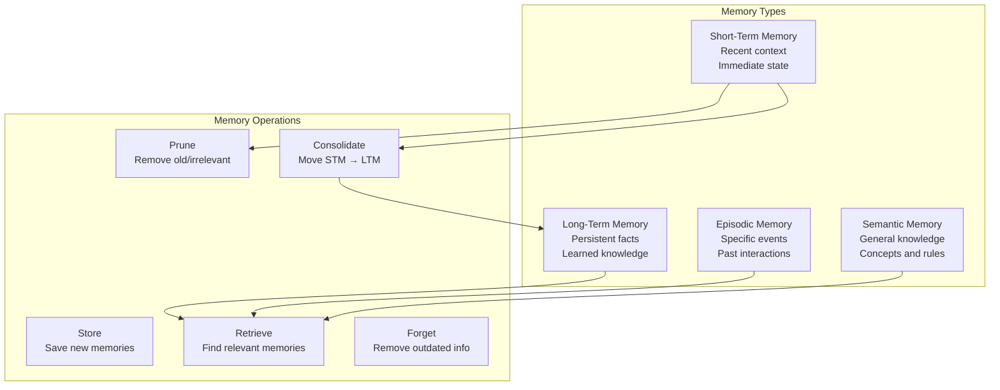

# Phase 5: Agentic AI Systems

# Part 17: Agent Memory

**Building agents that learn, remember, and improve over time—with short-term, long-term, episodic, and semantic memory.**

---

## The Target: What We're Building Right Now

In this part, we're building six powerful memory components:

1. **A Short-Term Memory System** — Recent interactions and context
2. **A Long-Term Memory System** — Persistent knowledge storage
3. **An Episodic Memory System** — Specific event recall
4. **A Semantic Memory System** — Knowledge and facts
5. **A Memory Pruning System** — Efficient memory management
6. **A Complete Agent Memory Framework** — Production-ready memory systems

**Why this matters:** Memory is what makes agents truly intelligent. Without memory, every interaction is from scratch. With memory, agents learn, adapt, and personalize—creating experiences that improve over time.

---

## The Concept: Agent Memory

### The Human Memory Analogy

Think about how you remember things:

- **Short-Term Memory** = What you remember from the last few minutes (conversation context)
- **Long-Term Memory** = Facts you've learned over years (knowledge)
- **Episodic Memory** = Specific events you've experienced (meeting with a client)
- **Semantic Memory** = General knowledge and concepts (how a car works)

**AI agents need all these types of memory to be truly intelligent.**



### Memory Types Compared

| Type | Duration | Capacity | Purpose | Example |
|------|----------|----------|---------|---------|
| **Short-Term** | Minutes | Limited (context window) | Immediate reasoning | "User just asked about Python" |
| **Long-Term** | Permanent | Unlimited (vector DB) | Persistent knowledge | "User prefers concise answers" |
| **Episodic** | Permanent | Unlimited | Event recall | "User mentioned they're from Boston" |
| **Semantic** | Permanent | Unlimited | General facts | "Python is a programming language" |

### Memory Operations

| Operation | Description | When Used |
|-----------|-------------|-----------|
| **Store** | Save new information | Every interaction |
| **Retrieve** | Find relevant memories | Before reasoning |
| **Prune** | Remove old/irrelevant | When memory is full |
| **Consolidate** | Move to long-term | Periodic |
| **Forget** | Remove outdated info | When knowledge changes |
| **Update** | Modify existing memories | When new info arrives |
| **Index** | Organize for retrieval | During storage |

### Memory Retrieval Strategies

| Strategy | Description | Use Case |
|----------|-------------|----------|
| **Recency** | Most recent first | Short-term context |
| **Relevance** | Semantic similarity | Finding related knowledge |
| **Frequency** | Most accessed first | Commonly used facts |
| **Importance** | Priority-based | Critical information |
| **Temporal** | Time-based | Historical context |

---

## The Implementation: Building Our Agent Memory Systems

### Target File Structure

```
phase-5-agents/
└── module-17-agent-memory/
    ├── 01_short_term_memory.py
    ├── 02_long_term_memory.py
    ├── 03_episodic_memory.py
    ├── 04_semantic_memory.py
    ├── 05_memory_pruning.py
    ├── 06_complete_agent_memory.py
    ├── requirements.txt
    └── README.md
```

### Step 1: Short-Term Memory System

Create `01_short_term_memory.py`:

```python
#!/usr/bin/env python3
"""
Module 17: Short-Term Memory System

Recent interactions and immediate context for agents.
"""

import os
import sys
from pathlib import Path
import json
from typing import List, Dict, Any, Optional
from datetime import datetime
from collections import deque

sys.path.insert(0, str(Path(__file__).parent.parent.parent.parent))

from shared.utils.config import load_config
from shared.utils.logging import setup_logging

setup_logging(debug=False)
config = load_config()

class ShortTermMemory:
    """
    Short-term memory for agent context.
    
    Features:
    - Sliding window of recent interactions
    - Context preservation
    - Priority-based retention
    - Timestamp tracking
    - Automatic pruning
    """
    
    def __init__(self, max_items: int = 20, max_tokens: int = 4000):
        """
        Initialize short-term memory.
        
        Args:
            max_items: Maximum number of items to keep
            max_tokens: Maximum tokens to keep
        """
        self.max_items = max_items
        self.max_tokens = max_tokens
        self.memory = deque(maxlen=max_items)
        self.total_tokens = 0
        
        print(f"✅ Initialized short-term memory (max items: {max_items})")
    
    def add(self, content: str, metadata: Optional[Dict[str, Any]] = None) -> None:
        """
        Add an item to short-term memory.
        
        Args:
            content: Memory content
            metadata: Additional metadata
        """
        # Approximate token count (roughly 4 chars per token)
        token_count = len(content) // 4
        
        # Check if we need to prune
        if self.total_tokens + token_count > self.max_tokens:
            self._prune_to_fit(token_count)
        
        item = {
            "content": content,
            "metadata": metadata or {},
            "timestamp": datetime.now().isoformat(),
            "token_count": token_count
        }
        
        self.memory.append(item)
        self.total_tokens += token_count
        
        print(f"   📝 Added to STM: {content[:50]}... ({token_count} tokens)")
    
    def _prune_to_fit(self, needed_tokens: int) -> None:
        """
        Prune memory to fit new item.
        
        Args:
            needed_tokens: Tokens needed for new item
        """
        while self.memory and self.total_tokens + needed_tokens > self.max_tokens:
            old_item = self.memory.popleft()
            self.total_tokens -= old_item.get("token_count", 0)
            print(f"   🧹 Pruned STM: {old_item['content'][:30]}...")
    
    def retrieve(self, top_k: int = 5) -> List[Dict[str, Any]]:
        """
        Retrieve recent items from memory.
        
        Args:
            top_k: Number of items to retrieve
            
        Returns:
            List of memory items
        """
        return list(self.memory)[-top_k:]
    
    def retrieve_all(self) -> List[Dict[str, Any]]:
        """
        Retrieve all items from memory.
        
        Returns:
            List of all memory items
        """
        return list(self.memory)
    
    def search(self, query: str, top_k: int = 5) -> List[Dict[str, Any]]:
        """
        Search memory for relevant items.
        
        Args:
            query: Search query
            top_k: Number of results
            
        Returns:
            Relevant memory items
        """
        # Simple keyword matching
        query_words = set(query.lower().split())
        scored = []
        
        for item in self.memory:
            content = item["content"].lower()
            score = sum(1 for word in query_words if word in content)
            if score > 0:
                scored.append((item, score))
        
        scored.sort(key=lambda x: x[1], reverse=True)
        return [item for item, _ in scored[:top_k]]
    
    def get_context(self) -> str:
        """
        Get all memory as context string.
        
        Returns:
            Context string
        """
        items = self.retrieve_all()
        context = "\n".join([
            f"[{item['timestamp']}] {item['content']}"
            for item in items
        ])
        return context
    
    def clear(self) -> None:
        """Clear all short-term memory."""
        self.memory.clear()
        self.total_tokens = 0
        print("🧹 Cleared short-term memory")
    
    def get_stats(self) -> Dict[str, Any]:
        """
        Get memory statistics.
        
        Returns:
            Memory stats
        """
        return {
            "items": len(self.memory),
            "total_tokens": self.total_tokens,
            "max_items": self.max_items,
            "max_tokens": self.max_tokens,
            "utilization": f"{len(self.memory)}/{self.max_items} items, {self.total_tokens}/{self.max_tokens} tokens"
        }

def demonstrate_short_term():
    """Demonstrate short-term memory."""
    print("\n" + "="*80)
    print("🧠 SHORT-TERM MEMORY DEMONSTRATION")
    print("="*80)
    
    # Create memory
    stm = ShortTermMemory(max_items=5, max_tokens=200)
    
    # Add items
    print("\n📋 Adding items...")
    stm.add("User asked about Python programming")
    stm.add("User wants to learn about AI agents")
    stm.add("User has experience with machine learning")
    stm.add("User needs help with a project")
    stm.add("User is using GPT-4 for development")
    
    # This should trigger pruning
    stm.add("User prefers concise answers and examples")
    
    # Retrieve
    print("\n📋 Recent items:")
    recent = stm.retrieve(top_k=3)
    for item in recent:
        print(f"   {item['content'][:50]}...")
    
    # Search
    print("\n🔍 Search: 'Python'")
    results = stm.search("Python")
    for item in results:
        print(f"   {item['content'][:50]}...")
    
    # Stats
    print("\n📊 Memory Stats:")
    print(json.dumps(stm.get_stats(), indent=2))

def main():
    """Run the short-term memory demonstration."""
    print("\n" + "="*80)
    print("AI TUTORIAL SERIES - SHORT-TERM MEMORY")
    print("="*80)
    
    demonstrate_short_term()

if __name__ == "__main__":
    main()
```

### Step 2: Long-Term Memory System

Create `02_long_term_memory.py`:

```python
#!/usr/bin/env python3
"""
Module 17: Long-Term Memory System

Persistent knowledge storage for agents.
"""

import os
import sys
from pathlib import Path
import json
from typing import List, Dict, Any, Optional
from datetime import datetime
import pickle

sys.path.insert(0, str(Path(__file__).parent.parent.parent.parent))

from shared.utils.config import load_config
from shared.utils.logging import setup_logging
from embedding_generator import EmbeddingGenerator
from vector_store import VectorStore

setup_logging(debug=False)
config = load_config()

class LongTermMemory:
    """
    Long-term memory for agents.
    
    Features:
    - Vector-based storage
    - Semantic search
    - Metadata filtering
    - Persistence
    - Consolidation from short-term
    """
    
    def __init__(
        self,
        collection_name: str = "agent_long_term",
        dimension: int = 1536,
        persistence_path: Optional[str] = None
    ):
        """
        Initialize long-term memory.
        
        Args:
            collection_name: Name for the memory collection
            dimension: Vector dimension
            persistence_path: Path for persistence
        """
        self.collection_name = collection_name
        self.dimension = dimension
        self.persistence_path = persistence_path or f"{collection_name}.pkl"
        
        self.store = VectorStore(dimension=dimension)
        self.generator = EmbeddingGenerator()
        
        # Load existing memory if available
        self._load()
        
        print(f"✅ Initialized long-term memory ({len(self.store.ids)} items)")
    
    def add(
        self,
        content: str,
        metadata: Optional[Dict[str, Any]] = None,
        importance: float = 1.0
    ) -> str:
        """
        Add an item to long-term memory.
        
        Args:
            content: Memory content
            metadata: Additional metadata
            importance: Importance score (1-10)
            
        Returns:
            Memory ID
        """
        metadata = metadata or {}
        metadata["importance"] = importance
        metadata["timestamp"] = datetime.now().isoformat()
        metadata["content_preview"] = content[:100] + "..."
        
        # Generate embedding
        embedding = self.generator.generate_embedding(content)
        
        # Store in vector database
        vector_id = self.store.add_vector(embedding, metadata)
        self._save()
        
        print(f"   💾 Added to LTM: {content[:50]}... (importance: {importance})")
        
        return vector_id
    
    def retrieve(
        self,
        query: str,
        top_k: int = 5,
        min_importance: float = 0.0,
        filter_metadata: Optional[Dict[str, Any]] = None
    ) -> List[Dict[str, Any]]:
        """
        Retrieve from long-term memory.
        
        Args:
            query: Search query
            top_k: Number of results
            min_importance: Minimum importance threshold
            filter_metadata: Metadata filter
            
        Returns:
            Retrieved memories
        """
        if len(self.store.ids) == 0:
            return []
        
        # Generate query embedding
        query_vector = self.generator.generate_embedding(query)
        
        # Search
        results = self.store.search(query_vector, top_k=top_k * 2)
        
        # Filter by importance and metadata
        filtered = []
        for result in results:
            metadata = result["metadata"]
            
            if metadata.get("importance", 0) < min_importance:
                continue
            
            if filter_metadata:
                matches = all(
                    metadata.get(key) == value
                    for key, value in filter_metadata.items()
                )
                if not matches:
                    continue
            
            filtered.append({
                "content": metadata.get("content_preview", ""),
                "metadata": metadata,
                "similarity": result["similarity"]
            })
        
        return filtered[:top_k]
    
    def update(self, vector_id: str, new_content: str) -> bool:
        """
        Update a memory.
        
        Args:
            vector_id: ID of the memory
            new_content: New content
            
        Returns:
            True if updated
        """
        if vector_id not in self.store.vectors:
            return False
        
        # Remove old vector
        old_metadata = self.store.metadata[vector_id]
        del self.store.vectors[vector_id]
        del self.store.metadata[vector_id]
        self.store.ids.remove(vector_id)
        self.store.stats["total_vectors"] -= 1
        
        # Add as new
        self.add(new_content, old_metadata)
        
        self._save()
        return True
    
    def delete(self, vector_id: str) -> bool:
        """
        Delete a memory.
        
        Args:
            vector_id: ID of the memory
            
        Returns:
            True if deleted
        """
        result = self.store.delete_vector(vector_id)
        if result:
            self._save()
        return result
    
    def _save(self) -> None:
        """Save memory to disk."""
        self.store.save(self.persistence_path)
    
    def _load(self) -> None:
        """Load memory from disk."""
        if os.path.exists(self.persistence_path):
            self.store.load(self.persistence_path)
            print(f"📂 Loaded LTM: {len(self.store.ids)} items")
    
    def get_stats(self) -> Dict[str, Any]:
        """
        Get memory statistics.
        
        Returns:
            Memory stats
        """
        stats = self.store.get_stats()
        stats["dimension"] = self.dimension
        stats["persistence_path"] = self.persistence_path
        return stats

def demonstrate_long_term():
    """Demonstrate long-term memory."""
    print("\n" + "="*80)
    print("💾 LONG-TERM MEMORY DEMONSTRATION")
    print("="*80)
    
    if not config.get("openai_api_key"):
        print("❌ OpenAI API key not available")
        return
    
    # Create memory
    ltm = LongTermMemory("demo_ltm")
    
    # Add memories
    print("\n📋 Adding memories...")
    
    ltm.add(
        "User prefers concise, example-driven explanations",
        {"type": "preference", "user": "alice"},
        importance=8.0
    )
    
    ltm.add(
        "User is building a RAG system for document search",
        {"type": "project", "user": "alice"},
        importance=7.0
    )
    
    ltm.add(
        "User asked about vector databases for RAG",
        {"type": "query", "user": "alice"},
        importance=6.0
    )
    
    ltm.add(
        "User has experience with Python and SQL",
        {"type": "skill", "user": "alice"},
        importance=5.0
    )
    
    # Retrieve
    print("\n🔍 Retrieving: 'preferences'")
    results = ltm.retrieve("preferences", top_k=3)
    for result in results:
        print(f"   Similarity: {result['similarity']:.4f}")
        print(f"   Content: {result['content']}")
        print(f"   Importance: {result['metadata'].get('importance', 0)}")
    
    # Retrieve with filter
    print("\n🔍 Retrieving: 'RAG' with importance >= 6")
    results = ltm.retrieve(
        "RAG",
        top_k=3,
        min_importance=6.0
    )
    for result in results:
        print(f"   {result['content']} (imp: {result['metadata'].get('importance', 0)})")
    
    # Stats
    print("\n📊 Memory Stats:")
    print(json.dumps(ltm.get_stats(), indent=2, default=str))

def main():
    """Run the long-term memory demonstration."""
    print("\n" + "="*80)
    print("AI TUTORIAL SERIES - LONG-TERM MEMORY")
    print("="*80)
    
    demonstrate_long_term()

if __name__ == "__main__":
    main()
```

### Step 3: Episodic Memory System

Create `03_episodic_memory.py`:

```python
#!/usr/bin/env python3
"""
Module 17: Episodic Memory System

Specific event recall for agents.
"""

import os
import sys
from pathlib import Path
import json
from typing import List, Dict, Any, Optional
from datetime import datetime
from collections import defaultdict

sys.path.insert(0, str(Path(__file__).parent.parent.parent.parent))

from shared.utils.config import load_config
from shared.utils.logging import setup_logging

setup_logging(debug=False)
config = load_config()

class EpisodicMemory:
    """
    Episodic memory for agents.
    
    Features:
    - Event storage with timestamps
    - Temporal retrieval
    - Episode grouping
    - Event importance scoring
    - Pattern detection
    """
    
    def __init__(self, max_episodes: int = 1000):
        """
        Initialize episodic memory.
        
        Args:
            max_episodes: Maximum episodes to keep
        """
        self.max_episodes = max_episodes
        self.episodes = []
        self.events_by_type = defaultdict(list)
        self.events_by_entity = defaultdict(list)
        
        print(f"✅ Initialized episodic memory (max episodes: {max_episodes})")
    
    def add_episode(
        self,
        content: str,
        episode_type: str = "general",
        entities: List[str] = None,
        importance: float = 1.0,
        metadata: Optional[Dict[str, Any]] = None
    ) -> Dict[str, Any]:
        """
        Add an episode to memory.
        
        Args:
            content: Episode content
            episode_type: Type of episode
            entities: Entities involved
            importance: Importance score
            metadata: Additional metadata
            
        Returns:
            Episode record
        """
        episode = {
            "id": len(self.episodes),
            "content": content,
            "type": episode_type,
            "entities": entities or [],
            "importance": importance,
            "metadata": metadata or {},
            "timestamp": datetime.now().isoformat()
        }
        
        self.episodes.append(episode)
        
        # Index by type
        self.events_by_type[episode_type].append(episode)
        
        # Index by entity
        for entity in episode["entities"]:
            self.events_by_entity[entity].append(episode)
        
        # Prune if needed
        if len(self.episodes) > self.max_episodes:
            old = self.episodes.pop(0)
            self._remove_from_index(old)
        
        print(f"   📖 Added episode: {content[:50]}... (type: {episode_type})")
        
        return episode
    
    def _remove_from_index(self, episode: Dict[str, Any]) -> None:
        """
        Remove an episode from indices.
        
        Args:
            episode: Episode to remove
        """
        # Remove from type index
        if episode["type"] in self.events_by_type:
            self.events_by_type[episode["type"]] = [
                e for e in self.events_by_type[episode["type"]]
                if e["id"] != episode["id"]
            ]
        
        # Remove from entity index
        for entity in episode["entities"]:
            if entity in self.events_by_entity:
                self.events_by_entity[entity] = [
                    e for e in self.events_by_entity[entity]
                    if e["id"] != episode["id"]
                ]
    
    def retrieve_by_type(
        self,
        episode_type: str,
        top_k: int = 10,
        min_importance: float = 0.0
    ) -> List[Dict[str, Any]]:
        """
        Retrieve episodes by type.
        
        Args:
            episode_type: Type to retrieve
            top_k: Number of results
            min_importance: Minimum importance
            
        Returns:
            Episodes of the specified type
        """
        episodes = self.events_by_type.get(episode_type, [])
        
        # Filter by importance
        filtered = [e for e in episodes if e["importance"] >= min_importance]
        
        # Sort by recency
        filtered.sort(key=lambda x: x["timestamp"], reverse=True)
        
        return filtered[:top_k]
    
    def retrieve_by_entity(
        self,
        entity: str,
        top_k: int = 10,
        min_importance: float = 0.0
    ) -> List[Dict[str, Any]]:
        """
        Retrieve episodes by entity.
        
        Args:
            entity: Entity to search for
            top_k: Number of results
            min_importance: Minimum importance
            
        Returns:
            Episodes involving the entity
        """
        episodes = self.events_by_entity.get(entity, [])
        
        # Filter by importance
        filtered = [e for e in episodes if e["importance"] >= min_importance]
        
        # Sort by recency
        filtered.sort(key=lambda x: x["timestamp"], reverse=True)
        
        return filtered[:top_k]
    
    def retrieve_temporal(
        self,
        start_time: datetime,
        end_time: datetime,
        top_k: int = 10
    ) -> List[Dict[str, Any]]:
        """
        Retrieve episodes within a time range.
        
        Args:
            start_time: Start time
            end_time: End time
            top_k: Number of results
            
        Returns:
            Episodes in the time range
        """
        start_str = start_time.isoformat()
        end_str = end_time.isoformat()
        
        filtered = []
        for episode in self.episodes:
            timestamp = episode["timestamp"]
            if start_str <= timestamp <= end_str:
                filtered.append(episode)
        
        # Sort by recency
        filtered.sort(key=lambda x: x["timestamp"], reverse=True)
        
        return filtered[:top_k]
    
    def get_summary(self, top_k: int = 5) -> Dict[str, Any]:
        """
        Get summary of episodic memory.
        
        Args:
            top_k: Number of most recent to include
            
        Returns:
            Memory summary
        """
        recent = self.episodes[-top_k:] if self.episodes else []
        
        return {
            "total_episodes": len(self.episodes),
            "types": dict(self.events_by_type),
            "entities": dict(self.events_by_entity),
            "most_recent": [
                {
                    "content": e["content"][:50] + "...",
                    "type": e["type"],
                    "timestamp": e["timestamp"]
                }
                for e in recent
            ]
        }

def demonstrate_episodic():
    """Demonstrate episodic memory."""
    print("\n" + "="*80)
    print("📖 EPISODIC MEMORY DEMONSTRATION")
    print("="*80)
    
    # Create memory
    em = EpisodicMemory(max_episodes=20)
    
    # Add episodes
    print("\n📋 Adding episodes...")
    
    em.add_episode(
        "User asked about vector databases for RAG",
        episode_type="query",
        entities=["user", "rag", "vector_db"],
        importance=7.0
    )
    
    em.add_episode(
        "User mentioned they're building a chatbot",
        episode_type="project",
        entities=["user", "chatbot"],
        importance=6.0
    )
    
    em.add_episode(
        "User said they prefer using LangChain",
        episode_type="preference",
        entities=["user", "langchain"],
        importance=8.0
    )
    
    em.add_episode(
        "User encountered an error with embeddings",
        episode_type="issue",
        entities=["user", "embeddings", "error"],
        importance=9.0
    )
    
    em.add_episode(
        "User resolved the embedding issue with OpenAI",
        episode_type="solution",
        entities=["user", "embeddings", "openai"],
        importance=8.0
    )
    
    # Retrieve by type
    print("\n🔍 Retrieving 'issue' episodes:")
    issues = em.retrieve_by_type("issue")
    for issue in issues:
        print(f"   {issue['content']}")
    
    # Retrieve by entity
    print("\n🔍 Retrieving episodes with 'embeddings':")
    embeddings_eps = em.retrieve_by_entity("embeddings")
    for ep in embeddings_eps:
        print(f"   {ep['content']} (importance: {ep['importance']})")
    
    # Summary
    print("\n📊 Memory Summary:")
    print(json.dumps(em.get_summary(), indent=2, default=str))

def main():
    """Run the episodic memory demonstration."""
    print("\n" + "="*80)
    print("AI TUTORIAL SERIES - EPISODIC MEMORY")
    print("="*80)
    
    demonstrate_episodic()

if __name__ == "__main__":
    main()
```

### Step 4: Semantic Memory System

Create `04_semantic_memory.py`:

```python
#!/usr/bin/env python3
"""
Module 17: Semantic Memory System

General knowledge and concept storage for agents.
"""

import os
import sys
from pathlib import Path
import json
from typing import List, Dict, Any, Optional
from datetime import datetime

sys.path.insert(0, str(Path(__file__).parent.parent.parent.parent))

from shared.utils.config import load_config
from shared.utils.logging import setup_logging

setup_logging(debug=False)
config = load_config()

class SemanticMemory:
    """
    Semantic memory for agents.
    
    Features:
    - Concept storage
    - Relationship tracking
    - Knowledge graph
    - Concept retrieval
    - Inference
    """
    
    def __init__(self):
        """Initialize semantic memory."""
        self.concepts = {}  # concept -> concept_data
        self.relationships = []  # (concept1, relation, concept2)
        self.facts = []  # Fact statements
        
        print("✅ Initialized semantic memory")
    
    def add_concept(
        self,
        concept: str,
        category: str = "general",
        properties: Dict[str, Any] = None,
        definition: str = None
    ) -> None:
        """
        Add a concept to semantic memory.
        
        Args:
            concept: Concept name
            category: Concept category
            properties: Additional properties
            definition: Concept definition
        """
        self.concepts[concept] = {
            "name": concept,
            "category": category,
            "properties": properties or {},
            "definition": definition,
            "added_at": datetime.now().isoformat()
        }
        
        print(f"   📚 Added concept: {concept} ({category})")
    
    def add_relationship(
        self,
        concept1: str,
        relation: str,
        concept2: str
    ) -> None:
        """
        Add a relationship between concepts.
        
        Args:
            concept1: First concept
            relation: Relationship type
            concept2: Second concept
        """
        if concept1 not in self.concepts:
            self.add_concept(concept1, "unknown")
        if concept2 not in self.concepts:
            self.add_concept(concept2, "unknown")
        
        relationship = {
            "concept1": concept1,
            "relation": relation,
            "concept2": concept2,
            "timestamp": datetime.now().isoformat()
        }
        
        self.relationships.append(relationship)
        print(f"   🔗 Added relationship: {concept1} --{relation}--> {concept2}")
    
    def add_fact(self, fact: str, source: str = "inferred") -> None:
        """
        Add a fact statement.
        
        Args:
            fact: Fact statement
            source: Source of the fact
        """
        self.facts.append({
            "fact": fact,
            "source": source,
            "timestamp": datetime.now().isoformat()
        })
        print(f"   📝 Added fact: {fact[:50]}...")
    
    def get_concept(self, concept: str) -> Optional[Dict[str, Any]]:
        """
        Get concept information.
        
        Args:
            concept: Concept name
            
        Returns:
            Concept data or None
        """
        return self.concepts.get(concept)
    
    def get_related_concepts(
        self,
        concept: str,
        relation: Optional[str] = None
    ) -> List[str]:
        """
        Get concepts related to a given concept.
        
        Args:
            concept: Concept name
            relation: Optional relation filter
            
        Returns:
            List of related concept names
        """
        related = []
        
        for rel in self.relationships:
            if rel["concept1"] == concept:
                if relation is None or rel["relation"] == relation:
                    related.append(rel["concept2"])
            elif rel["concept2"] == concept:
                if relation is None or rel["relation"] == relation:
                    related.append(rel["concept1"])
        
        return list(set(related))
    
    def query(self, query: str) -> Dict[str, Any]:
        """
        Query semantic memory.
        
        Args:
            query: Natural language query
            
        Returns:
            Query results
        """
        # Simple keyword-based query
        words = query.lower().split()
        
        # Find relevant concepts
        relevant_concepts = []
        for concept, data in self.concepts.items():
            concept_lower = concept.lower()
            if any(word in concept_lower for word in words):
                relevant_concepts.append(concept)
        
        # Find relevant facts
        relevant_facts = []
        for fact in self.facts:
            fact_lower = fact["fact"].lower()
            if any(word in fact_lower for word in words):
                relevant_facts.append(fact)
        
        # Find relevant relationships
        relevant_relationships = []
        for rel in self.relationships:
            rel_str = f"{rel['concept1']} {rel['relation']} {rel['concept2']}".lower()
            if any(word in rel_str for word in words):
                relevant_relationships.append(rel)
        
        return {
            "concepts": relevant_concepts,
            "facts": relevant_facts,
            "relationships": relevant_relationships
        }
    
    def get_knowledge_graph(
        self,
        center_concept: Optional[str] = None,
        depth: int = 1
    ) -> Dict[str, Any]:
        """
        Get knowledge graph around a concept.
        
        Args:
            center_concept: Center concept
            depth: How many levels to traverse
            
        Returns:
            Knowledge graph
        """
        if center_concept and center_concept not in self.concepts:
            return {"error": "Concept not found"}
        
        nodes = set()
        edges = []
        
        if center_concept:
            nodes.add(center_concept)
            
            for level in range(depth):
                current_nodes = list(nodes)
                for node in current_nodes:
                    related = self.get_related_concepts(node)
                    for rel in related:
                        nodes.add(rel)
                        # Find the relationship
                        for edge in self.relationships:
                            if (edge["concept1"] == node and edge["concept2"] == rel) or \
                               (edge["concept2"] == node and edge["concept1"] == rel):
                                edges.append({
                                    "from": edge["concept1"],
                                    "to": edge["concept2"],
                                    "relation": edge["relation"]
                                })
        else:
            # Return all concepts and relationships
            nodes = set(self.concepts.keys())
            for rel in self.relationships:
                edges.append({
                    "from": rel["concept1"],
                    "to": rel["concept2"],
                    "relation": rel["relation"]
                })
        
        return {
            "nodes": list(nodes),
            "edges": edges,
            "center": center_concept,
            "depth": depth
        }

def demonstrate_semantic():
    """Demonstrate semantic memory."""
    print("\n" + "="*80)
    print("📚 SEMANTIC MEMORY DEMONSTRATION")
    print("="*80)
    
    # Create memory
    sm = SemanticMemory()
    
    # Add concepts
    print("\n📋 Adding concepts...")
    sm.add_concept("AI", "technology", {"field": "Computer Science"}, "Artificial Intelligence")
    sm.add_concept("Machine Learning", "technology", {"field": "AI"}, "ML algorithms")
    sm.add_concept("Deep Learning", "technology", {"field": "ML"}, "Neural networks")
    sm.add_concept("NLP", "technology", {"field": "AI"}, "Natural Language Processing")
    sm.add_concept("RAG", "technology", {"field": "AI"}, "Retrieval-Augmented Generation")
    
    # Add relationships
    print("\n📋 Adding relationships...")
    sm.add_relationship("AI", "includes", "Machine Learning")
    sm.add_relationship("Machine Learning", "includes", "Deep Learning")
    sm.add_relationship("AI", "includes", "NLP")
    sm.add_relationship("AI", "includes", "RAG")
    sm.add_relationship("RAG", "uses", "Vector Databases")
    sm.add_relationship("RAG", "uses", "Embeddings")
    
    # Add facts
    print("\n📋 Adding facts...")
    sm.add_fact("RAG combines retrieval with generation for better responses")
    sm.add_fact("Vector databases store embeddings for similarity search")
    sm.add_fact("Deep learning uses neural networks with multiple layers")
    
    # Query
    print("\n🔍 Query: 'machine learning neural networks'")
    results = sm.query("machine learning neural networks")
    print(f"   Concepts: {results['concepts']}")
    print(f"   Facts: {len(results['facts'])} found")
    print(f"   Relationships: {len(results['relationships'])} found")
    
    # Knowledge graph
    print("\n🕸️ Knowledge graph around 'AI':")
    graph = sm.get_knowledge_graph("AI", depth=1)
    print(f"   Nodes: {graph['nodes']}")
    print(f"   Edges: {len(graph['edges'])}")

def main():
    """Run the semantic memory demonstration."""
    print("\n" + "="*80)
    print("AI TUTORIAL SERIES - SEMANTIC MEMORY")
    print("="*80)
    
    demonstrate_semantic()

if __name__ == "__main__":
    main()
```

### Step 5: Memory Pruning System

Create `05_memory_pruning.py`:

```python
#!/usr/bin/env python3
"""
Module 17: Memory Pruning System

Efficient memory management for agents.
"""

import os
import sys
from pathlib import Path
import json
from typing import List, Dict, Any, Optional
from datetime import datetime, timedelta
from collections import defaultdict

sys.path.insert(0, str(Path(__file__).parent.parent.parent.parent))

from shared.utils.config import load_config
from shared.utils.logging import setup_logging

setup_logging(debug=False)
config = load_config()

class MemoryPruner:
    """
    Prune and manage agent memory.
    
    Features:
    - Age-based pruning
    - Importance-based pruning
    - Recency-based pruning
    - Consolidation
    - Memory optimization
    """
    
    def __init__(
        self,
        max_items: int = 1000,
        max_age_days: int = 30,
        min_importance: float = 3.0
    ):
        """
        Initialize the memory pruner.
        
        Args:
            max_items: Maximum items to keep
            max_age_days: Maximum age in days
            min_importance: Minimum importance to keep
        """
        self.max_items = max_items
        self.max_age_days = max_age_days
        self.min_importance = min_importance
        
        self.pruned_count = 0
        self.consolidated_count = 0
        
        print(f"✅ Initialized memory pruner")
        print(f"   Max items: {max_items}, Max age: {max_age_days} days")
    
    def prune_memories(
        self,
        memories: List[Dict[str, Any]],
        strategy: str = "importance"
    ) -> List[Dict[str, Any]]:
        """
        Prune memories using a strategy.
        
        Args:
            memories: List of memories
            strategy: Pruning strategy
            
        Returns:
            Pruned memories
        """
        if strategy == "age":
            return self._prune_by_age(memories)
        elif strategy == "importance":
            return self._prune_by_importance(memories)
        elif strategy == "recency":
            return self._prune_by_recency(memories)
        elif strategy == "hybrid":
            return self._prune_hybrid(memories)
        else:
            return memories
    
    def _prune_by_age(self, memories: List[Dict[str, Any]]) -> List[Dict[str, Any]]:
        """Prune by age."""
        cutoff = datetime.now() - timedelta(days=self.max_age_days)
        cutoff_str = cutoff.isoformat()
        
        pruned = []
        for memory in memories:
            timestamp = memory.get("timestamp", "")
            if timestamp >= cutoff_str:
                pruned.append(memory)
            else:
                self.pruned_count += 1
                print(f"   🧹 Pruned by age: {memory.get('content', '')[:30]}...")
        
        return pruned
    
    def _prune_by_importance(self, memories: List[Dict[str, Any]]) -> List[Dict[str, Any]]:
        """Prune by importance."""
        # Sort by importance (highest first)
        sorted_memories = sorted(
            memories,
            key=lambda x: x.get("importance", 0),
            reverse=True
        )
        
        # Keep top N items
        pruned = sorted_memories[:self.max_items]
        
        # Count pruned
        self.pruned_count += len(memories) - len(pruned)
        
        return pruned
    
    def _prune_by_recency(self, memories: List[Dict[str, Any]]) -> List[Dict[str, Any]]:
        """Prune by recency."""
        # Sort by recency (newest first)
        sorted_memories = sorted(
            memories,
            key=lambda x: x.get("timestamp", ""),
            reverse=True
        )
        
        # Keep top N items
        pruned = sorted_memories[:self.max_items]
        
        # Count pruned
        self.pruned_count += len(memories) - len(pruned)
        
        return pruned
    
    def _prune_hybrid(self, memories: List[Dict[str, Any]]) -> List[Dict[str, Any]]:
        """Prune using hybrid strategy."""
        # Calculate scores
        scored = []
        for memory in memories:
            # Importance score (0-10)
            importance = memory.get("importance", 5)
            
            # Recency score (newer = higher)
            timestamp = memory.get("timestamp", "")
            if timestamp:
                try:
                    dt = datetime.fromisoformat(timestamp)
                    days_old = (datetime.now() - dt).days
                    recency = max(0, 10 - days_old)
                except:
                    recency = 5
            else:
                recency = 5
            
            # Combined score
            combined = (importance * 0.7) + (recency * 0.3)
            scored.append((memory, combined))
        
        # Sort by combined score
        scored.sort(key=lambda x: x[1], reverse=True)
        
        # Keep top N
        pruned = [s[0] for s in scored[:self.max_items]]
        
        self.pruned_count += len(memories) - len(pruned)
        
        return pruned
    
    def consolidate_memories(
        self,
        memories: List[Dict[str, Any]],
        grouping_key: str = "type"
    ) -> List[Dict[str, Any]]:
        """
        Consolidate memories by grouping.
        
        Args:
            memories: List of memories
            grouping_key: Key to group by
            
        Returns:
            Consolidated memories
        """
        groups = defaultdict(list)
        
        for memory in memories:
            key = memory.get(grouping_key, "default")
            groups[key].append(memory)
        
        consolidated = []
        for key, group in groups.items():
            if len(group) <= 1:
                consolidated.extend(group)
                continue
            
            # Create a consolidated memory
            contents = [g.get("content", "") for g in group]
            summary = f"{len(group)} memories about {key}: " + " | ".join(contents[:3])
            if len(contents) > 3:
                summary += f" (+{len(contents) - 3} more)"
            
            # Take the most recent timestamp
            latest = max(group, key=lambda x: x.get("timestamp", ""))
            
            consolidated_memory = {
                "content": summary,
                "type": "consolidated",
                "original_types": [g.get("type") for g in group],
                "count": len(group),
                "importance": max(g.get("importance", 5) for g in group),
                "timestamp": latest.get("timestamp", datetime.now().isoformat())
            }
            
            consolidated.append(consolidated_memory)
            self.consolidated_count += len(group) - 1
        
        return consolidated

def demonstrate_pruning():
    """Demonstrate memory pruning."""
    print("\n" + "="*80)
    print("🧹 MEMORY PRUNING DEMONSTRATION")
    print("="*80)
    
    # Create sample memories
    memories = []
    for i in range(20):
        memories.append({
            "content": f"Memory {i}: This is a sample memory item",
            "importance": 10 - (i % 10),
            "timestamp": (datetime.now() - timedelta(days=i % 30)).isoformat(),
            "type": f"type_{i % 3}"
        })
    
    pruner = MemoryPruner(
        max_items=8,
        max_age_days=15,
        min_importance=4.0
    )
    
    print(f"\n📋 Original: {len(memories)} memories")
    
    # Test different strategies
    strategies = ["age", "importance", "recency", "hybrid"]
    
    for strategy in strategies:
        pruned = pruner.prune_memories(memories, strategy)
        print(f"\n📊 Strategy: {strategy}")
        print(f"   Result: {len(pruned)} memories")
        print(f"   Pruned: {pruner.pruned_count}")
        
        # Show consolidation
        consolidated = pruner.consolidate_memories(pruned, "type")
        print(f"   Consolidated: {len(consolidated)} memories")
        print(f"   Consolidated count: {pruner.consolidated_count}")
        
        # Reset
        pruner.pruned_count = 0
        pruner.consolidated_count = 0

def main():
    """Run the memory pruning demonstration."""
    print("\n" + "="*80)
    print("AI TUTORIAL SERIES - MEMORY PRUNING SYSTEM")
    print("="*80)
    
    demonstrate_pruning()

if __name__ == "__main__":
    main()
```

### Step 6: Complete Agent Memory Framework

Create `06_complete_agent_memory.py`:

```python
#!/usr/bin/env python3
"""
Module 17: Complete Agent Memory Framework

Production-ready memory system for agents.
"""

import os
import sys
from pathlib import Path
import json
from typing import List, Dict, Any, Optional
from datetime import datetime
import threading
import time

sys.path.insert(0, str(Path(__file__).parent.parent.parent.parent))

from shared.utils.config import load_config
from shared.utils.logging import setup_logging
from short_term_memory import ShortTermMemory
from long_term_memory import LongTermMemory
from episodic_memory import EpisodicMemory
from semantic_memory import SemanticMemory
from memory_pruning import MemoryPruner

setup_logging(debug=False)
config = load_config()

class CompleteAgentMemory:
    """
    Complete memory system for agents.
    
    Features:
    - All memory types
    - Automatic consolidation
    - Pruning and optimization
    - Memory retrieval
    - Persistence
    - Monitoring
    """
    
    def __init__(
        self,
        agent_name: str = "Agent",
        stm_max_items: int = 20,
        ltm_collection: str = "agent_memory",
        max_episodes: int = 1000,
        persist_path: str = "./agent_memory"
    ):
        """
        Initialize the complete agent memory.
        
        Args:
            agent_name: Agent name
            stm_max_items: Short-term memory capacity
            ltm_collection: Long-term memory collection name
            max_episodes: Maximum episodic memories
            persist_path: Persistence path
        """
        self.agent_name = agent_name
        self.persist_path = Path(persist_path)
        self.persist_path.mkdir(exist_ok=True)
        
        # Initialize memory systems
        self.short_term = ShortTermMemory(max_items=stm_max_items)
        self.long_term = LongTermMemory(
            collection_name=f"{agent_name}_{ltm_collection}",
            persistence_path=str(self.persist_path / "long_term.pkl")
        )
        self.episodic = EpisodicMemory(max_episodes=max_episodes)
        self.semantic = SemanticMemory()
        self.pruner = MemoryPruner()
        
        # Threading for background consolidation
        self.running = False
        self.consolidation_thread = None
        
        # Metrics
        self.metrics = {
            "total_stored": 0,
            "total_retrieved": 0,
            "total_pruned": 0,
            "last_consolidation": None
        }
        
        print(f"✅ Initialized complete agent memory: {agent_name}")
        self._load()
    
    def _load(self) -> None:
        """Load memory from persistence."""
        # Load semantic memory
        semantic_path = self.persist_path / "semantic.json"
        if semantic_path.exists():
            try:
                with open(semantic_path, 'r') as f:
                    data = json.load(f)
                    self.semantic.concepts = data.get("concepts", {})
                    self.semantic.relationships = data.get("relationships", [])
                    self.semantic.facts = data.get("facts", [])
                print(f"📂 Loaded semantic memory: {len(self.semantic.concepts)} concepts")
            except:
                pass
        
        # Load episodic memory
        episodic_path = self.persist_path / "episodic.json"
        if episodic_path.exists():
            try:
                with open(episodic_path, 'r') as f:
                    data = json.load(f)
                    self.episodic.episodes = data.get("episodes", [])
                    self.episodic.events_by_type = data.get("events_by_type", {})
                    self.episodic.events_by_entity = data.get("events_by_entity", {})
                print(f"📂 Loaded episodic memory: {len(self.episodic.episodes)} episodes")
            except:
                pass
    
    def _save(self) -> None:
        """Save memory to persistence."""
        # Save semantic memory
        semantic_path = self.persist_path / "semantic.json"
        try:
            with open(semantic_path, 'w') as f:
                json.dump({
                    "concepts": self.semantic.concepts,
                    "relationships": self.semantic.relationships,
                    "facts": self.semantic.facts
                }, f, indent=2, default=str)
        except:
            pass
        
        # Save episodic memory
        episodic_path = self.persist_path / "episodic.json"
        try:
            with open(episodic_path, 'w') as f:
                json.dump({
                    "episodes": self.episodic.episodes,
                    "events_by_type": self.episodic.events_by_type,
                    "events_by_entity": self.episodic.events_by_entity
                }, f, indent=2, default=str)
        except:
            pass
    
    def store(
        self,
        content: str,
        memory_type: str = "short_term",
        metadata: Optional[Dict[str, Any]] = None,
        importance: float = 5.0
    ) -> str:
        """
        Store a memory.
        
        Args:
            content: Memory content
            memory_type: Type of memory
            metadata: Additional metadata
            importance: Importance score
            
        Returns:
            Memory ID
        """
        metadata = metadata or {}
        
        if memory_type == "short_term":
            self.short_term.add(content, metadata)
            self.metrics["total_stored"] += 1
            
            # If short-term is full, trigger consolidation
            if len(self.short_term.memory) >= self.short_term.max_items:
                self._consolidate_short_term()
            
            return "stm_" + str(len(self.short_term.memory))
        
        elif memory_type == "long_term":
            vector_id = self.long_term.add(content, metadata, importance)
            self.metrics["total_stored"] += 1
            self._save()
            return vector_id
        
        elif memory_type == "episodic":
            episode = self.episodic.add_episode(
                content,
                metadata.get("type", "general"),
                metadata.get("entities", []),
                importance,
                metadata
            )
            self.metrics["total_stored"] += 1
            self._save()
            return str(episode["id"])
        
        elif memory_type == "semantic":
            self.semantic.add_concept(
                content,
                metadata.get("category", "general"),
                metadata.get("properties", {}),
                metadata.get("definition")
            )
            self.metrics["total_stored"] += 1
            self._save()
            return "sem_" + content
        
        else:
            raise ValueError(f"Unknown memory type: {memory_type}")
    
    def retrieve(
        self,
        query: str,
        memory_types: List[str] = None,
        top_k: int = 5
    ) -> Dict[str, List[Dict[str, Any]]]:
        """
        Retrieve memories.
        
        Args:
            query: Search query
            memory_types: Types to retrieve from
            top_k: Number of results per type
            
        Returns:
            Retrieved memories by type
        """
        memory_types = memory_types or ["short_term", "long_term", "episodic", "semantic"]
        results = {}
        
        self.metrics["total_retrieved"] += 1
        
        if "short_term" in memory_types:
            results["short_term"] = self.short_term.search(query, top_k)
        
        if "long_term" in memory_types:
            results["long_term"] = self.long_term.retrieve(query, top_k)
        
        if "episodic" in memory_types:
            # Search episodic memory
            episodes = []
            for ep in self.episodic.episodes:
                if any(word in ep["content"].lower() for word in query.lower().split()):
                    episodes.append(ep)
            results["episodic"] = episodes[:top_k]
        
        if "semantic" in memory_types:
            semantic_results = self.semantic.query(query)
            results["semantic"] = {
                "concepts": semantic_results["concepts"],
                "facts": semantic_results["facts"],
                "relationships": semantic_results["relationships"]
            }
        
        return results
    
    def _consolidate_short_term(self) -> None:
        """Consolidate short-term to long-term memory."""
        items = self.short_term.retrieve_all()
        
        if not items:
            return
        
        # Create consolidated content
        content = "\n".join([item["content"] for item in items])
        
        # Store in long-term memory
        vector_id = self.long_term.add(
            content,
            {"type": "consolidated", "source": "short_term"},
            importance=7.0
        )
        
        # Clear short-term memory
        self.short_term.clear()
        
        self.metrics["last_consolidation"] = datetime.now().isoformat()
        print(f"🔄 Consolidated {len(items)} short-term items to long-term")
    
    def start_background_consolidation(self, interval: int = 60) -> None:
        """
        Start background consolidation thread.
        
        Args:
            interval: Consolidation interval in seconds
        """
        if self.running:
            return
        
        self.running = True
        
        def consolidation_loop():
            while self.running:
                time.sleep(interval)
                if len(self.short_term.memory) > self.short_term.max_items // 2:
                    self._consolidate_short_term()
                    self._prune_memories()
                    self._save()
        
        self.consolidation_thread = threading.Thread(target=consolidation_loop, daemon=True)
        self.consolidation_thread.start()
        print(f"🔄 Started background consolidation (interval: {interval}s)")
    
    def _prune_memories(self) -> None:
        """Prune long-term memory."""
        # Get all long-term memories
        memories = []
        for vector_id in self.long_term.store.ids:
            metadata = self.long_term.store.metadata[vector_id]
            memories.append({
                "content": metadata.get("content_preview", ""),
                "importance": metadata.get("importance", 5),
                "timestamp": metadata.get("timestamp", "")
            })
        
        # Prune
        pruned = self.pruner.prune_memories(memories, "hybrid")
        self.metrics["total_pruned"] += len(memories) - len(pruned)
    
    def get_summary(self) -> Dict[str, Any]:
        """
        Get memory summary.
        
        Returns:
            Memory summary
        """
        return {
            "agent": self.agent_name,
            "short_term": self.short_term.get_stats(),
            "long_term": self.long_term.get_stats(),
            "episodic": self.episodic.get_summary(),
            "semantic": {
                "concepts": len(self.semantic.concepts),
                "relationships": len(self.semantic.relationships),
                "facts": len(self.semantic.facts)
            },
            "metrics": self.metrics
        }
    
    def stop(self) -> None:
        """Stop background processes."""
        self.running = False
        if self.consolidation_thread:
            self.consolidation_thread.join(timeout=5)
        self._save()

def demonstrate_complete_memory():
    """Demonstrate the complete agent memory."""
    print("\n" + "="*80)
    print("🧠 COMPLETE AGENT MEMORY DEMONSTRATION")
    print("="*80)
    
    if not config.get("openai_api_key"):
        print("❌ OpenAI API key not available")
        return
    
    # Create memory system
    memory = CompleteAgentMemory("DemoAgent")
    
    # Store different types of memories
    print("\n📋 Storing memories...")
    
    # Short-term
    memory.store("User asked about Python programming", "short_term")
    memory.store("User is building a RAG system", "short_term")
    memory.store("User prefers concise explanations", "short_term")
    
    # Long-term
    memory.store(
        "User has 5 years of Python experience",
        "long_term",
        {"type": "user_info"},
        importance=8.0
    )
    
    # Episodic
    memory.store(
        "User mentioned they're using OpenAI API for a project",
        "episodic",
        {"type": "conversation", "entities": ["user", "openai"]},
        importance=7.0
    )
    
    # Semantic
    memory.store(
        "RAG",
        "semantic",
        {"category": "technology", "definition": "Retrieval-Augmented Generation"}
    )
    
    # Consolidate short-term
    memory._consolidate_short_term()
    
    # Retrieve
    print("\n🔍 Retrieving: 'Python experience'")
    results = memory.retrieve("Python experience", top_k=3)
    
    for mem_type, items in results.items():
        print(f"\n   {mem_type}:")
        if items:
            for item in items[:2]:
                if isinstance(item, dict):
                    print(f"      {item.get('content', 'N/A')[:50]}...")
        else:
            print(f"      No results")
    
    # Summary
    print("\n📊 Memory Summary:")
    summary = memory.get_summary()
    print(json.dumps(summary, indent=2, default=str))
    
    # Stop background processes
    memory.stop()

def main():
    """Run the complete agent memory demonstration."""
    print("\n" + "="*80)
    print("AI TUTORIAL SERIES - COMPLETE AGENT MEMORY")
    print("="*80)
    
    demonstrate_complete_memory()

if __name__ == "__main__":
    main()
```

---

## The Verification: Testing Your Implementation

### Step 1: Install Dependencies

Create `requirements.txt`:

```txt
# Module 17 dependencies
openai>=1.0.0
numpy>=1.24.0
python-dotenv>=1.0.0
```

Install them:

```bash
cd ~/ai-tutorial-series/phase-5-agents/module-17-agent-memory
pip install -r requirements.txt
```

### Step 2: Test Short-Term Memory

```bash
python 01_short_term_memory.py
```

**Expected Output:**
- Adding items with automatic pruning
- Retrieval by recency
- Search functionality

### Step 3: Test Long-Term Memory

```bash
python 02_long_term_memory.py
```

**Expected Output:**
- Vector-based storage
- Semantic search
- Metadata filtering
- Importance scoring

### Step 4: Test Episodic Memory

```bash
python 03_episodic_memory.py
```

**Expected Output:**
- Event storage with timestamps
- Retrieval by type
- Entity-based retrieval
- Temporal queries

### Step 5: Test Semantic Memory

```bash
python 04_semantic_memory.py
```

**Expected Output:**
- Concept storage
- Relationship mapping
- Knowledge graph
- Query functionality

### Step 6: Test Memory Pruning

```bash
python 05_memory_pruning.py
```

**Expected Output:**
- Multiple pruning strategies
- Age-based pruning
- Importance-based pruning
- Consolidation

### Step 7: Test Complete Agent Memory

```bash
python 06_complete_agent_memory.py
```

**Expected Output:**
- All memory types working together
- Automatic consolidation
- Background pruning
- Persistence

---

## Key Takeaways

By completing this module, you've:

✅ **Built a short-term memory system** for immediate context
✅ **Created a long-term memory system** with vector storage
✅ **Implemented an episodic memory system** for event recall
✅ **Built a semantic memory system** for knowledge storage
✅ **Created a memory pruning system** for optimization
✅ **Built a complete agent memory framework** for production use

### The Mental Model to Carry Forward

```
┌─────────────────────────────────────────────────────────────────┐
│                 AGENT MEMORY MENTAL MODEL                      │
├─────────────────────────────────────────────────────────────────┤
│                                                                 │
│  1. Short-term memory holds immediate context                 │
│  2. Long-term memory stores persistent knowledge              │
│  3. Episodic memory recalls specific events                   │
│  4. Semantic memory stores general knowledge                  │
│  5. Pruning keeps memory efficient                            │
│  6. Consolidation moves STM → LTM                            │
│  7. Different memory types serve different purposes           │
│  8. Complete memory systems enable learning agents            │
│                                                                 │
└─────────────────────────────────────────────────────────────────┘
```

### Memory Best Practices

| Practice | Why | How |
|----------|-----|-----|
| **Prune Regularly** | Prevents bloat | Use hybrid pruning |
| **Importance Scoring** | Prioritize memory | Score 1-10 |
| **Consolidate STM → LTM** | Preserve context | Periodic background |
| **Index by Type** | Faster retrieval | Categorize memories |
| **Persist Periodically** | Prevent loss | Save to disk |
| **Monitor Usage** | Track performance | Log metrics |

---

## What's Next

**Congratulations! You've completed Phase 5: Agentic AI Systems.**

You now understand:
- AI agents and their components
- Planning, reflection, and tool use
- Multi-agent systems and collaboration
- Agent memory systems

**In Phase 6: AI Application Engineering**, you'll learn:
- Asynchronous AI programming
- Resilient AI systems
- AI observability
- AI security
