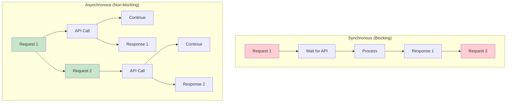

# Phase 6: AI Application Engineering

> **Objective:** Learn production-ready engineering practices for scalable, resilient AI systems.

---

# Part 18: Asynchronous AI Programming

**Building high-performance, concurrent AI applications with async/await, streaming, and real-time communication.**

---

## The Target: What We're Building Right Now

In this part, we're building six powerful asynchronous components:

1. **An Async AI Client** — Non-blocking API calls
2. **A Streaming Response Handler** — Real-time text generation
3. **A Concurrent Request Processor** — Parallel AI operations
4. **A Server-Sent Events (SSE) Server** — Real-time web streaming
5. **A WebSocket AI Server** — Bidirectional communication
6. **An Async Task Scheduler** — Background job processing

**Why this matters:** AI applications are inherently I/O-bound and latency-sensitive. Asynchronous programming unlocks the full potential of modern hardware, enabling responsive, scalable AI services that can handle thousands of concurrent users.

---

## The Concept: Asynchronous AI Programming

### The Restaurant Analogy

Imagine you're running a busy restaurant:

- **Synchronous (Blocking)** = One chef cooking one order at a time
- **Asynchronous (Non-blocking)** = Multiple chefs working on different orders simultaneously
- **Concurrent** = Multiple orders in progress at once
- **Parallel** = Multiple chefs working on the same order together

**Asynchronous AI programming is about maximizing efficiency by never waiting idle.**



### Async vs Sync: Performance Comparison

| Metric | Synchronous | Asynchronous |
|--------|-------------|--------------|
| **Response Time** | Sequential (N × time) | Parallel (~time) |
| **Throughput** | Limited by I/O | I/O-bound scaling |
| **Resource Usage** | Idle waiting | Full utilization |
| **Complexity** | Simple | Moderate |
| **Debugging** | Easier | Harder |

### Async AI Patterns

| Pattern | Description | Use Case |
|---------|-------------|----------|
| **Fire and Forget** | Send request, don't wait | Logging, analytics |
| **Request-Response** | Wait for response | User queries |
| **Streaming** | Get response in chunks | Chat, generation |
| **Batching** | Process multiple at once | Batch inference |
| **Parallel** | Multiple independent requests | Data processing |
| **Pipeline** | Sequential with async | Complex workflows |

### Async Technologies

| Technology | Purpose | Best For |
|------------|---------|----------|
| **asyncio** | Python async framework | Python applications |
| **FastAPI** | Async web framework | API servers |
| **aiohttp** | Async HTTP client | API calls |
| **WebSockets** | Bidirectional communication | Real-time apps |
| **SSE** | Server-sent events | Streaming responses |
| **Celery** | Task queues | Background jobs |

---

## The Implementation: Building Our Async AI Tools

### Target File Structure

```
phase-6-engineering/
└── module-18-async-ai/
    ├── 01_async_ai_client.py
    ├── 02_streaming_handler.py
    ├── 03_concurrent_processor.py
    ├── 04_sse_server.py
    ├── 05_websocket_server.py
    ├── 06_async_task_scheduler.py
    ├── requirements.txt
    └── README.md
```

### Step 1: Async AI Client

Create `01_async_ai_client.py`:

```python
#!/usr/bin/env python3
"""
Module 18: Async AI Client

Non-blocking AI API calls with async/await.
"""

import os
import sys
from pathlib import Path
import json
import asyncio
import aiohttp
from typing import List, Dict, Any, Optional
from datetime import datetime

sys.path.insert(0, str(Path(__file__).parent.parent.parent.parent))

from shared.utils.config import load_config
from shared.utils.logging import setup_logging

setup_logging(debug=False)
config = load_config()

class AsyncAIClient:
    """
    Asynchronous AI client for non-blocking API calls.
    
    Features:
    - Async API calls
    - Connection pooling
    - Timeout handling
    - Retry logic
    - Rate limiting
    """
    
    def __init__(
        self,
        provider: str = "openai",
        api_key: Optional[str] = None,
        max_concurrent: int = 10,
        timeout: int = 60
    ):
        """
        Initialize the async client.
        
        Args:
            provider: Provider name
            api_key: API key
            max_concurrent: Maximum concurrent requests
            timeout: Request timeout in seconds
        """
        self.provider = provider
        self.api_key = api_key or config.get("openai_api_key")
        self.max_concurrent = max_concurrent
        self.timeout = timeout
        
        self.session = None
        self.semaphore = asyncio.Semaphore(max_concurrent)
        
        print(f"✅ Initialized async AI client: {provider}")
        print(f"   Max concurrent: {max_concurrent}")
    
    async def __aenter__(self):
        """Enter async context."""
        self.session = aiohttp.ClientSession()
        return self
    
    async def __aexit__(self, exc_type, exc_val, exc_tb):
        """Exit async context."""
        if self.session:
            await self.session.close()
    
    async def generate(
        self,
        prompt: str,
        system: Optional[str] = None,
        temperature: float = 0.7,
        max_tokens: int = 500,
        model: str = "gpt-4o-mini"
    ) -> Dict[str, Any]:
        """
        Generate a response asynchronously.
        
        Args:
            prompt: User prompt
            system: System prompt
            temperature: Temperature
            max_tokens: Max tokens
            model: Model to use
            
        Returns:
            Response dictionary
        """
        async with self.semaphore:
            url = "https://api.openai.com/v1/chat/completions"
            
            messages = []
            if system:
                messages.append({"role": "system", "content": system})
            messages.append({"role": "user", "content": prompt})
            
            payload = {
                "model": model,
                "messages": messages,
                "temperature": temperature,
                "max_tokens": max_tokens
            }
            
            headers = {
                "Authorization": f"Bearer {self.api_key}",
                "Content-Type": "application/json"
            }
            
            try:
                async with self.session.post(
                    url,
                    json=payload,
                    headers=headers,
                    timeout=aiohttp.ClientTimeout(total=self.timeout)
                ) as response:
                    data = await response.json()
                    
                    if response.status == 200:
                        return {
                            "success": True,
                            "content": data["choices"][0]["message"]["content"],
                            "usage": data.get("usage", {}),
                            "model": model
                        }
                    else:
                        return {
                            "success": False,
                            "error": data.get("error", {}).get("message", "Unknown error"),
                            "status": response.status
                        }
                        
            except asyncio.TimeoutError:
                return {
                    "success": False,
                    "error": f"Request timed out after {self.timeout}s"
                }
            except Exception as e:
                return {
                    "success": False,
                    "error": str(e)
                }
    
    async def generate_many(
        self,
        prompts: List[str],
        **kwargs
    ) -> List[Dict[str, Any]]:
        """
        Generate responses for multiple prompts.
        
        Args:
            prompts: List of prompts
            **kwargs: Additional generation parameters
            
        Returns:
            List of responses
        """
        tasks = [self.generate(prompt, **kwargs) for prompt in prompts]
        return await asyncio.gather(*tasks)
    
    async def stream_generate(
        self,
        prompt: str,
        system: Optional[str] = None,
        temperature: float = 0.7,
        max_tokens: int = 500,
        model: str = "gpt-4o-mini"
    ):
        """
        Stream a response asynchronously.
        
        Args:
            prompt: User prompt
            system: System prompt
            temperature: Temperature
            max_tokens: Max tokens
            model: Model to use
            
        Yields:
            Response chunks
        """
        url = "https://api.openai.com/v1/chat/completions"
        
        messages = []
        if system:
            messages.append({"role": "system", "content": system})
        messages.append({"role": "user", "content": prompt})
        
        payload = {
            "model": model,
            "messages": messages,
            "temperature": temperature,
            "max_tokens": max_tokens,
            "stream": True
        }
        
        headers = {
            "Authorization": f"Bearer {self.api_key}",
            "Content-Type": "application/json"
        }
        
        async with self.session.post(
            url,
            json=payload,
            headers=headers,
            timeout=aiohttp.ClientTimeout(total=self.timeout)
        ) as response:
            async for line in response.content:
                line = line.decode('utf-8').strip()
                if line.startswith('data: '):
                    data = line[6:]
                    if data == '[DONE]':
                        break
                    try:
                        chunk = json.loads(data)
                        content = chunk.get("choices", [{}])[0].get("delta", {}).get("content")
                        if content:
                            yield content
                    except:
                        pass

async def demonstrate_async_client():
    """Demonstrate the async AI client."""
    print("\n" + "="*80)
    print("⚡ ASYNC AI CLIENT DEMONSTRATION")
    print("="*80)
    
    if not config.get("openai_api_key"):
        print("❌ OpenAI API key not available")
        return
    
    async with AsyncAIClient(max_concurrent=3) as client:
        # Single request
        print("\n📋 Single request:")
        result = await client.generate(
            "What is asynchronous programming?",
            system="You are a helpful assistant.",
            temperature=0.7
        )
        
        if result["success"]:
            print(f"   Response: {result['content'][:100]}...")
            print(f"   Tokens: {result['usage'].get('total_tokens', 'N/A')}")
        else:
            print(f"   Error: {result.get('error')}")
        
        # Multiple requests (concurrent)
        print("\n📋 Multiple concurrent requests:")
        prompts = [
            "Explain Python's asyncio",
            "What is FastAPI?",
            "How does async improve performance?"
        ]
        
        start = datetime.now()
        results = await client.generate_many(prompts)
        elapsed = (datetime.now() - start).total_seconds()
        
        for i, result in enumerate(results, 1):
            if result["success"]:
                print(f"   {i}. {result['content'][:60]}...")
            else:
                print(f"   {i}. Error: {result.get('error')}")
        
        print(f"\n   Elapsed: {elapsed:.2f}s for {len(prompts)} requests")
        
        # Streaming
        print("\n📋 Streaming response:")
        print("   ", end="", flush=True)
        async for chunk in client.stream_generate("Write a haiku about async programming"):
            print(chunk, end="", flush=True)
        print()

def main():
    """Run the async client demonstration."""
    print("\n" + "="*80)
    print("AI TUTORIAL SERIES - ASYNC AI CLIENT")
    print("="*80)
    
    asyncio.run(demonstrate_async_client())

if __name__ == "__main__":
    main()
```

### Step 2: Streaming Response Handler

Create `02_streaming_handler.py`:

```python
#!/usr/bin/env python3
"""
Module 18: Streaming Response Handler

Real-time text generation with streaming.
"""

import os
import sys
from pathlib import Path
import json
import asyncio
from typing import AsyncGenerator, Dict, Any, Optional
from datetime import datetime

sys.path.insert(0, str(Path(__file__).parent.parent.parent.parent))

from shared.utils.config import load_config
from shared.utils.logging import setup_logging
from async_ai_client import AsyncAIClient

setup_logging(debug=False)
config = load_config()

class StreamingHandler:
    """
    Handle streaming responses from AI models.
    
    Features:
    - Real-time streaming
    - Event-based handling
    - Buffer management
    - Error recovery
    - Progress tracking
    """
    
    def __init__(self, client: Optional[AsyncAIClient] = None):
        """
        Initialize the streaming handler.
        
        Args:
            client: Async AI client (creates one if not provided)
        """
        self.client = client or AsyncAIClient()
        self.buffers = {}
        self.progress = {}
        
        print("✅ Initialized streaming handler")
    
    async def stream_with_callbacks(
        self,
        prompt: str,
        on_chunk: Optional[callable] = None,
        on_complete: Optional[callable] = None,
        on_error: Optional[callable] = None,
        **kwargs
    ) -> Dict[str, Any]:
        """
        Stream with callback functions.
        
        Args:
            prompt: User prompt
            on_chunk: Called for each chunk
            on_complete: Called on completion
            on_error: Called on error
            **kwargs: Additional parameters
            
        Returns:
            Response metadata
        """
        full_response = ""
        chunk_count = 0
        start_time = datetime.now()
        
        try:
            async for chunk in self.client.stream_generate(prompt, **kwargs):
                full_response += chunk
                chunk_count += 1
                
                if on_chunk:
                    await on_chunk(chunk, full_response, chunk_count)
            
            elapsed = (datetime.now() - start_time).total_seconds()
            
            result = {
                "success": True,
                "full_response": full_response,
                "chunk_count": chunk_count,
                "elapsed": elapsed
            }
            
            if on_complete:
                await on_complete(result)
            
            return result
            
        except Exception as e:
            error_result = {
                "success": False,
                "error": str(e),
                "chunk_count": chunk_count
            }
            
            if on_error:
                await on_error(error_result)
            
            return error_result
    
    async def stream_to_buffer(
        self,
        stream_id: str,
        prompt: str,
        **kwargs
    ) -> AsyncGenerator[str, None]:
        """
        Stream to a buffer with incremental yields.
        
        Args:
            stream_id: Stream identifier
            prompt: User prompt
            **kwargs: Additional parameters
            
        Yields:
            Response chunks
        """
        self.buffers[stream_id] = ""
        self.progress[stream_id] = 0
        
        try:
            async for chunk in self.client.stream_generate(prompt, **kwargs):
                self.buffers[stream_id] += chunk
                self.progress[stream_id] += len(chunk)
                yield chunk
            
            # Stream complete
            self.progress[stream_id] = -1
            
        except Exception as e:
            yield f"Error: {str(e)}"
            self.progress[stream_id] = -2
    
    def get_buffer(self, stream_id: str) -> Optional[str]:
        """
        Get the current buffer content.
        
        Args:
            stream_id: Stream identifier
            
        Returns:
            Current buffer content or None
        """
        return self.buffers.get(stream_id)
    
    def get_progress(self, stream_id: str) -> Dict[str, Any]:
        """
        Get stream progress.
        
        Args:
            stream_id: Stream identifier
            
        Returns:
            Progress information
        """
        progress = self.progress.get(stream_id, 0)
        
        if progress == -1:
            status = "complete"
        elif progress == -2:
            status = "error"
        elif progress > 0:
            status = "streaming"
        else:
            status = "idle"
        
        return {
            "stream_id": stream_id,
            "status": status,
            "buffer_length": len(self.buffers.get(stream_id, "")),
            "progress": progress
        }
    
    def clear_buffer(self, stream_id: str) -> None:
        """Clear a buffer."""
        if stream_id in self.buffers:
            del self.buffers[stream_id]
        if stream_id in self.progress:
            del self.progress[stream_id]

async def demonstrate_streaming():
    """Demonstrate the streaming handler."""
    print("\n" + "="*80)
    print("📡 STREAMING HANDLER DEMONSTRATION")
    print("="*80)
    
    if not config.get("openai_api_key"):
        print("❌ OpenAI API key not available")
        return
    
    handler = StreamingHandler()
    
    # Callback functions
    async def on_chunk(chunk, full, count):
        print(chunk, end="", flush=True)
        if count % 5 == 0:
            # Show progress occasionally
            pass
    
    async def on_complete(result):
        print(f"\n\n✅ Complete! {result['chunk_count']} chunks in {result['elapsed']:.2f}s")
    
    # Stream with callbacks
    print("\n📋 Streaming with callbacks:")
    print("-"*40)
    
    await handler.stream_with_callbacks(
        "Write a story about a robot learning to be human (50 words)",
        on_chunk=on_chunk,
        on_complete=on_complete,
        temperature=0.8,
        max_tokens=100
    )
    
    # Stream to buffer
    print("\n\n📋 Streaming to buffer:")
    print("-"*40)
    
    stream_id = "demo_stream"
    buffer = ""
    
    async for chunk in handler.stream_to_buffer(
        stream_id,
        "Explain the concept of AI in simple terms (3 sentences)",
        temperature=0.7,
        max_tokens=100
    ):
        buffer += chunk
        print(chunk, end="", flush=True)
    
    print("\n\n📊 Buffer Status:")
    print(json.dumps(handler.get_progress(stream_id), indent=2))
    
    # Clean up
    handler.clear_buffer(stream_id)

def main():
    """Run the streaming handler demonstration."""
    print("\n" + "="*80)
    print("AI TUTORIAL SERIES - STREAMING HANDLER")
    print("="*80)
    
    asyncio.run(demonstrate_streaming())

if __name__ == "__main__":
    main()
```

### Step 3: Concurrent Request Processor

Create `03_concurrent_processor.py`:

```python
#!/usr/bin/env python3
"""
Module 18: Concurrent Request Processor

Process multiple AI requests concurrently with rate limiting.
"""

import os
import sys
from pathlib import Path
import json
import asyncio
import time
from typing import List, Dict, Any, Optional
from datetime import datetime

sys.path.insert(0, str(Path(__file__).parent.parent.parent.parent))

from shared.utils.config import load_config
from shared.utils.logging import setup_logging
from async_ai_client import AsyncAIClient

setup_logging(debug=False)
config = load_config()

class ConcurrentProcessor:
    """
    Process AI requests concurrently with rate limiting.
    
    Features:
    - Concurrent processing
    - Rate limiting
    - Priority queuing
    - Result aggregation
    - Performance monitoring
    """
    
    def __init__(
        self,
        max_concurrent: int = 10,
        rate_limit: int = 100,
        rate_window: int = 60
    ):
        """
        Initialize the concurrent processor.
        
        Args:
            max_concurrent: Maximum concurrent requests
            rate_limit: Maximum requests per window
            rate_window: Rate window in seconds
        """
        self.max_concurrent = max_concurrent
        self.rate_limit = rate_limit
        self.rate_window = rate_window
        
        self.semaphore = asyncio.Semaphore(max_concurrent)
        self.request_timestamps = []
        self.results = []
        
        self.stats = {
            "total_processed": 0,
            "successful": 0,
            "failed": 0,
            "total_time": 0
        }
        
        print(f"✅ Initialized concurrent processor")
        print(f"   Max concurrent: {max_concurrent}")
        print(f"   Rate limit: {rate_limit}/min")
    
    async def process(
        self,
        tasks: List[Dict[str, Any]],
        client: Optional[AsyncAIClient] = None
    ) -> List[Dict[str, Any]]:
        """
        Process multiple tasks concurrently.
        
        Args:
            tasks: List of task dictionaries
            client: Async AI client
            
        Returns:
            List of results
        """
        client = client or AsyncAIClient()
        self.results = []
        
        start_time = time.time()
        
        # Create tasks
        async_tasks = []
        for task in tasks:
            async_tasks.append(self._process_task(task, client))
        
        # Execute concurrently
        results = await asyncio.gather(*async_tasks)
        
        self.stats["total_processed"] = len(results)
        self.stats["successful"] = sum(1 for r in results if r.get("success", False))
        self.stats["failed"] = sum(1 for r in results if not r.get("success", False))
        self.stats["total_time"] = time.time() - start_time
        
        return results
    
    async def _process_task(
        self,
        task: Dict[str, Any],
        client: AsyncAIClient
    ) -> Dict[str, Any]:
        """
        Process a single task.
        
        Args:
            task: Task dictionary
            client: Async AI client
            
        Returns:
            Task result
        """
        async with self.semaphore:
            # Check rate limit
            await self._check_rate_limit()
            
            # Process task
            prompt = task.get("prompt", "")
            system = task.get("system")
            temperature = task.get("temperature", 0.7)
            max_tokens = task.get("max_tokens", 500)
            
            result = await client.generate(
                prompt,
                system,
                temperature,
                max_tokens
            )
            
            # Add task metadata
            result["task_id"] = task.get("id", str(len(self.results)))
            result["task_metadata"] = task.get("metadata", {})
            
            self.results.append(result)
            
            return result
    
    async def _check_rate_limit(self) -> None:
        """Check and enforce rate limit."""
        now = time.time()
        
        # Clean old timestamps
        cutoff = now - self.rate_window
        self.request_timestamps = [t for t in self.request_timestamps if t > cutoff]
        
        # Check limit
        if len(self.request_timestamps) >= self.rate_limit:
            # Wait until next request is allowed
            wait_time = self.request_timestamps[0] + self.rate_window - now + 0.1
            if wait_time > 0:
                await asyncio.sleep(wait_time)
                # Clean again
                now = time.time()
                cutoff = now - self.rate_window
                self.request_timestamps = [t for t in self.request_timestamps if t > cutoff]
        
        # Add current request
        self.request_timestamps.append(now)
    
    def get_stats(self) -> Dict[str, Any]:
        """Get processing statistics."""
        return {
            **self.stats,
            "success_rate": self.stats["successful"] / self.stats["total_processed"] if self.stats["total_processed"] > 0 else 0,
            "avg_time_per_request": self.stats["total_time"] / self.stats["total_processed"] if self.stats["total_processed"] > 0 else 0
        }

async def demonstrate_concurrent():
    """Demonstrate the concurrent processor."""
    print("\n" + "="*80)
    print("🔄 CONCURRENT PROCESSOR DEMONSTRATION")
    print("="*80)
    
    if not config.get("openai_api_key"):
        print("❌ OpenAI API key not available")
        return
    
    # Create processor and client
    processor = ConcurrentProcessor(max_concurrent=3, rate_limit=20)
    
    async with AsyncAIClient() as client:
        # Create tasks
        tasks = [
            {
                "id": f"task_{i}",
                "prompt": f"Write a haiku about topic {i}",
                "system": "You are a poet.",
                "temperature": 0.8,
                "max_tokens": 50,
                "metadata": {"topic": f"topic_{i}"}
            }
            for i in range(1, 6)
        ]
        
        print("\n📋 Processing 5 concurrent tasks...")
        start = datetime.now()
        
        results = await processor.process(tasks, client)
        
        elapsed = (datetime.now() - start).total_seconds()
        
        print(f"\n✅ Completed in {elapsed:.2f}s")
        print(f"   Success: {processor.stats['successful']}/{processor.stats['total_processed']}")
        
        # Show results
        print("\n📊 Results:")
        for result in results[:3]:
            if result["success"]:
                print(f"   ✅ {result['task_id']}: {result['content'][:80]}...")
            else:
                print(f"   ❌ {result['task_id']}: {result.get('error')}")
        
        if len(results) > 3:
            print(f"   ... and {len(results) - 3} more")
        
        # Stats
        print("\n📊 Stats:")
        print(json.dumps(processor.get_stats(), indent=2))

def main():
    """Run the concurrent processor demonstration."""
    print("\n" + "="*80)
    print("AI TUTORIAL SERIES - CONCURRENT PROCESSOR")
    print("="*80)
    
    asyncio.run(demonstrate_concurrent())

if __name__ == "__main__":
    main()
```

### Step 4: Server-Sent Events Server

Create `04_sse_server.py`:

```python
#!/usr/bin/env python3
"""
Module 18: Server-Sent Events Server

Real-time web streaming with Server-Sent Events.
"""

import os
import sys
from pathlib import Path
import json
import asyncio
from typing import AsyncGenerator, Dict, Any
from fastapi import FastAPI, Request
from fastapi.responses import StreamingResponse
import uvicorn

sys.path.insert(0, str(Path(__file__).parent.parent.parent.parent))

from shared.utils.config import load_config
from shared.utils.logging import setup_logging
from async_ai_client import AsyncAIClient
from streaming_handler import StreamingHandler

setup_logging(debug=False)
config = load_config()

app = FastAPI(title="SSE AI Server", version="1.0.0")

# Initialize components
ai_client = AsyncAIClient()
streaming_handler = StreamingHandler(ai_client)

@app.get("/")
async def root():
    """Root endpoint."""
    return {
        "service": "SSE AI Server",
        "endpoints": {
            "/sse/chat": "POST - Stream chat completions",
            "/sse/stream": "GET - Stream with query params",
            "/health": "GET - Health check"
        }
    }

@app.get("/health")
async def health():
    """Health check endpoint."""
    return {"status": "healthy", "timestamp": datetime.now().isoformat()}

@app.post("/sse/chat")
async def sse_chat(request: Request):
    """
    Stream chat completions via SSE.
    
    Request body:
    {
        "prompt": "User prompt",
        "system": "System prompt (optional)",
        "temperature": 0.7,
        "max_tokens": 500
    }
    """
    data = await request.json()
    prompt = data.get("prompt", "")
    system = data.get("system")
    temperature = data.get("temperature", 0.7)
    max_tokens = data.get("max_tokens", 500)
    
    async def generate():
        """Generate SSE events."""
        try:
            # Send start event
            yield f"data: {json.dumps({'type': 'start'})}\n\n"
            
            async for chunk in ai_client.stream_generate(
                prompt=prompt,
                system=system,
                temperature=temperature,
                max_tokens=max_tokens
            ):
                # Send chunk event
                yield f"data: {json.dumps({'type': 'chunk', 'content': chunk})}\n\n"
            
            # Send complete event
            yield f"data: {json.dumps({'type': 'complete'})}\n\n"
            
        except Exception as e:
            # Send error event
            yield f"data: {json.dumps({'type': 'error', 'error': str(e)})}\n\n"
    
    return StreamingResponse(
        generate(),
        media_type="text/event-stream",
        headers={
            "Cache-Control": "no-cache",
            "Connection": "keep-alive",
            "Access-Control-Allow-Origin": "*"
        }
    )

@app.get("/sse/stream")
async def sse_stream(prompt: str, system: str = None, temperature: float = 0.7, max_tokens: int = 500):
    """
    Stream via SSE with query parameters.
    
    Query params:
        prompt: User prompt
        system: System prompt (optional)
        temperature: Temperature (default: 0.7)
        max_tokens: Max tokens (default: 500)
    """
    async def generate():
        """Generate SSE events."""
        try:
            yield f"data: {json.dumps({'type': 'start'})}\n\n"
            
            async for chunk in ai_client.stream_generate(
                prompt=prompt,
                system=system,
                temperature=temperature,
                max_tokens=max_tokens
            ):
                yield f"data: {json.dumps({'type': 'chunk', 'content': chunk})}\n\n"
            
            yield f"data: {json.dumps({'type': 'complete'})}\n\n"
            
        except Exception as e:
            yield f"data: {json.dumps({'type': 'error', 'error': str(e)})}\n\n"
    
    return StreamingResponse(
        generate(),
        media_type="text/event-stream",
        headers={
            "Cache-Control": "no-cache",
            "Connection": "keep-alive",
            "Access-Control-Allow-Origin": "*"
        }
    )

def main():
    """Run the SSE server."""
    print("\n" + "="*80)
    print("📡 SSE AI SERVER")
    print("="*80)
    
    if not config.get("openai_api_key"):
        print("❌ OpenAI API key not available")
        return
    
    print("\n🚀 Starting SSE server...")
    print("   http://localhost:8000")
    print("   POST /sse/chat - Stream chat completions")
    print("   GET /sse/stream - Stream with query params")
    print("\n💡 Test with curl:")
    print("   curl -X POST http://localhost:8000/sse/chat \\")
    print("        -H 'Content-Type: application/json' \\")
    print("        -d '{\"prompt\":\"Hello, world!\"}'")
    
    uvicorn.run(app, host="0.0.0.0", port=8000)

if __name__ == "__main__":
    main()
```

### Step 5: WebSocket AI Server

Create `05_websocket_server.py`:

```python
#!/usr/bin/env python3
"""
Module 18: WebSocket AI Server

Bidirectional real-time AI communication with WebSockets.
"""

import os
import sys
from pathlib import Path
import json
import asyncio
from typing import Dict, Any
from fastapi import FastAPI, WebSocket, WebSocketDisconnect
import uvicorn

sys.path.insert(0, str(Path(__file__).parent.parent.parent.parent))

from shared.utils.config import load_config
from shared.utils.logging import setup_logging
from async_ai_client import AsyncAIClient

setup_logging(debug=False)
config = load_config()

app = FastAPI(title="WebSocket AI Server", version="1.0.0")

# Initialize components
ai_client = AsyncAIClient()

# Connection manager
class ConnectionManager:
    """Manage WebSocket connections."""
    
    def __init__(self):
        self.active_connections: List[WebSocket] = []
    
    async def connect(self, websocket: WebSocket):
        await websocket.accept()
        self.active_connections.append(websocket)
    
    def disconnect(self, websocket: WebSocket):
        if websocket in self.active_connections:
            self.active_connections.remove(websocket)
    
    async def send_message(self, websocket: WebSocket, message: Dict[str, Any]):
        await websocket.send_json(message)
    
    async def broadcast(self, message: Dict[str, Any]):
        for connection in self.active_connections:
            await connection.send_json(message)

manager = ConnectionManager()

@app.websocket("/ws/chat")
async def websocket_chat(websocket: WebSocket):
    """WebSocket chat endpoint."""
    await manager.connect(websocket)
    
    try:
        # Send welcome message
        await manager.send_message(websocket, {
            "type": "connected",
            "message": "Connected to AI chat server"
        })
        
        while True:
            # Receive message
            data = await websocket.receive_json()
            
            if data.get("type") == "ping":
                await manager.send_message(websocket, {"type": "pong"})
                continue
            
            prompt = data.get("prompt", "")
            system = data.get("system")
            temperature = data.get("temperature", 0.7)
            max_tokens = data.get("max_tokens", 500)
            
            # Send acknowledgment
            await manager.send_message(websocket, {
                "type": "ack",
                "message": "Processing request..."
            })
            
            try:
                # Stream response
                async for chunk in ai_client.stream_generate(
                    prompt=prompt,
                    system=system,
                    temperature=temperature,
                    max_tokens=max_tokens
                ):
                    await manager.send_message(websocket, {
                        "type": "chunk",
                        "content": chunk
                    })
                
                # Send complete signal
                await manager.send_message(websocket, {
                    "type": "complete"
                })
                
            except Exception as e:
                await manager.send_message(websocket, {
                    "type": "error",
                    "error": str(e)
                })
                
    except WebSocketDisconnect:
        manager.disconnect(websocket)
        print(f"Client disconnected")

@app.websocket("/ws/broadcast")
async def websocket_broadcast(websocket: WebSocket):
    """WebSocket broadcast endpoint."""
    await manager.connect(websocket)
    
    try:
        while True:
            data = await websocket.receive_json()
            
            if data.get("type") == "broadcast":
                # Broadcast to all connected clients
                await manager.broadcast({
                    "type": "broadcast",
                    "sender": data.get("sender", "anonymous"),
                    "message": data.get("message", "")
                })
            elif data.get("type") == "ai_chat":
                # Process with AI and broadcast
                prompt = data.get("prompt", "")
                
                async for chunk in ai_client.stream_generate(
                    prompt=prompt,
                    temperature=0.7,
                    max_tokens=200
                ):
                    await manager.broadcast({
                        "type": "ai_chunk",
                        "content": chunk
                    })
                
                await manager.broadcast({
                    "type": "ai_complete"
                })
                
    except WebSocketDisconnect:
        manager.disconnect(websocket)

@app.get("/")
async def root():
    """Root endpoint."""
    return {
        "service": "WebSocket AI Server",
        "websocket_endpoints": {
            "/ws/chat": "Bi-directional chat",
            "/ws/broadcast": "Broadcast to all clients"
        }
    }

def main():
    """Run the WebSocket server."""
    print("\n" + "="*80)
    print("🔌 WEBSOCKET AI SERVER")
    print("="*80)
    
    if not config.get("openai_api_key"):
        print("❌ OpenAI API key not available")
        return
    
    print("\n🚀 Starting WebSocket server...")
    print("   ws://localhost:8000/ws/chat")
    print("   ws://localhost:8000/ws/broadcast")
    print("\n💡 Test with a WebSocket client:")
    print("   - Connect to ws://localhost:8000/ws/chat")
    print("   - Send: {\"prompt\": \"Hello, world!\"}")
    print("   - Receive streaming responses")
    
    uvicorn.run(app, host="0.0.0.0", port=8000)

if __name__ == "__main__":
    main()
```

### Step 6: Async Task Scheduler

Create `06_async_task_scheduler.py`:

```python
#!/usr/bin/env python3
"""
Module 18: Async Task Scheduler

Background job processing for AI tasks.
"""

import os
import sys
from pathlib import Path
import json
import asyncio
from typing import List, Dict, Any, Optional, Callable
from datetime import datetime
import queue

sys.path.insert(0, str(Path(__file__).parent.parent.parent.parent))

from shared.utils.config import load_config
from shared.utils.logging import setup_logging
from async_ai_client import AsyncAIClient

setup_logging(debug=False)
config = load_config()

class AsyncTaskScheduler:
    """
    Schedule and process AI tasks in the background.
    
    Features:
    - Task queuing
    - Background processing
    - Task prioritization
    - Retry logic
    - Result callbacks
    - Monitoring
    """
    
    def __init__(
        self,
        max_workers: int = 5,
        retry_count: int = 3,
        retry_delay: int = 5
    ):
        """
        Initialize the task scheduler.
        
        Args:
            max_workers: Maximum concurrent workers
            retry_count: Number of retries
            retry_delay: Delay between retries
        """
        self.max_workers = max_workers
        self.retry_count = retry_count
        self.retry_delay = retry_delay
        
        self.task_queue = asyncio.Queue()
        self.active_tasks = []
        self.completed_tasks = []
        self.failed_tasks = []
        
        self.running = False
        self.workers = []
        self.client = None
        
        self.stats = {
            "total_submitted": 0,
            "total_processed": 0,
            "total_success": 0,
            "total_failed": 0,
            "started_at": None,
            "last_processed": None
        }
        
        print(f"✅ Initialized async task scheduler")
        print(f"   Max workers: {max_workers}")
    
    async def start(self):
        """Start the task scheduler."""
        if self.running:
            return
        
        self.running = True
        self.stats["started_at"] = datetime.now().isoformat()
        self.client = AsyncAIClient()
        
        # Create workers
        for i in range(self.max_workers):
            worker = asyncio.create_task(self._worker(i))
            self.workers.append(worker)
        
        print(f"🚀 Started task scheduler with {self.max_workers} workers")
    
    async def stop(self):
        """Stop the task scheduler."""
        self.running = False
        
        # Wait for workers to complete
        for worker in self.workers:
            worker.cancel()
        
        await asyncio.gather(*self.workers, return_exceptions=True)
        
        if self.client:
            await self.client.__aexit__(None, None, None)
        
        print(f"🛑 Stopped task scheduler")
    
    async def submit_task(
        self,
        task: Dict[str, Any],
        callback: Optional[Callable] = None,
        priority: int = 0
    ) -> str:
        """
        Submit a task for processing.
        
        Args:
            task: Task definition
            callback: Callback function
            priority: Task priority (higher = earlier)
            
        Returns:
            Task ID
        """
        task_id = f"task_{self.stats['total_submitted'] + 1}_{datetime.now().strftime('%H%M%S')}"
        
        task_entry = {
            "id": task_id,
            "task": task,
            "callback": callback,
            "priority": priority,
            "status": "queued",
            "created_at": datetime.now().isoformat(),
            "attempts": 0
        }
        
        await self.task_queue.put(task_entry)
        self.stats["total_submitted"] += 1
        
        print(f"📋 Submitted task {task_id}")
        
        return task_id
    
    async def _worker(self, worker_id: int):
        """Worker for processing tasks."""
        while self.running:
            try:
                # Get task from queue with timeout
                try:
                    task_entry = await asyncio.wait_for(
                        self.task_queue.get(),
                        timeout=1.0
                    )
                except asyncio.TimeoutError:
                    continue
                
                # Process task
                await self._process_task(task_entry, worker_id)
                
            except asyncio.CancelledError:
                break
            except Exception as e:
                print(f"Worker {worker_id} error: {e}")
                await asyncio.sleep(1)
    
    async def _process_task(self, task_entry: Dict[str, Any], worker_id: int):
        """Process a single task."""
        task_id = task_entry["id"]
        task = task_entry["task"]
        callback = task_entry["callback"]
        attempts = task_entry["attempts"] + 1
        
        print(f"🔄 Worker {worker_id} processing {task_id} (attempt {attempts})")
        
        try:
            # Process the task
            result = await self._execute_task(task)
            
            # Update status
            task_entry["status"] = "completed"
            task_entry["completed_at"] = datetime.now().isoformat()
            
            self.completed_tasks.append(task_entry)
            self.stats["total_processed"] += 1
            self.stats["total_success"] += 1
            self.stats["last_processed"] = datetime.now().isoformat()
            
            print(f"✅ Task {task_id} completed")
            
            # Execute callback
            if callback:
                try:
                    await callback(result)
                except Exception as e:
                    print(f"Callback error: {e}")
            
        except Exception as e:
            # Handle failure
            if attempts < self.retry_count:
                # Retry
                print(f"⚠️ Task {task_id} failed, retrying ({attempts}/{self.retry_count})")
                task_entry["attempts"] = attempts
                
                # Put back in queue after delay
                await asyncio.sleep(self.retry_delay)
                await self.task_queue.put(task_entry)
            else:
                # Final failure
                task_entry["status"] = "failed"
                task_entry["error"] = str(e)
                task_entry["failed_at"] = datetime.now().isoformat()
                
                self.failed_tasks.append(task_entry)
                self.stats["total_processed"] += 1
                self.stats["total_failed"] += 1
                self.stats["last_processed"] = datetime.now().isoformat()
                
                print(f"❌ Task {task_id} failed after {attempts} attempts: {e}")
    
    async def _execute_task(self, task: Dict[str, Any]) -> Any:
        """
        Execute a task.
        
        Args:
            task: Task to execute
            
        Returns:
            Task result
        """
        task_type = task.get("type", "generate")
        
        if task_type == "generate":
            prompt = task.get("prompt", "")
            system = task.get("system")
            temperature = task.get("temperature", 0.7)
            max_tokens = task.get("max_tokens", 500)
            
            result = await self.client.generate(
                prompt=prompt,
                system=system,
                temperature=temperature,
                max_tokens=max_tokens
            )
            
            if not result.get("success"):
                raise Exception(result.get("error", "Generation failed"))
            
            return result.get("content")
        
        elif task_type == "stream":
            # Streaming tasks are processed differently
            raise ValueError("Streaming tasks not supported in scheduler")
        
        else:
            raise ValueError(f"Unknown task type: {task_type}")
    
    def get_stats(self) -> Dict[str, Any]:
        """Get scheduler statistics."""
        return {
            **self.stats,
            "queued": self.task_queue.qsize(),
            "active": len(self.active_tasks),
            "completed": len(self.completed_tasks),
            "failed": len(self.failed_tasks),
            "running": self.running
        }

async def demonstrate_scheduler():
    """Demonstrate the async task scheduler."""
    print("\n" + "="*80)
    print("📋 ASYNC TASK SCHEDULER DEMONSTRATION")
    print("="*80)
    
    if not config.get("openai_api_key"):
        print("❌ OpenAI API key not available")
        return
    
    # Create and start scheduler
    scheduler = AsyncTaskScheduler(max_workers=3)
    await scheduler.start()
    
    # Submit tasks
    print("\n📋 Submitting tasks...")
    
    tasks = [
        {
            "type": "generate",
            "prompt": "What is asynchronous programming?",
            "temperature": 0.7
        },
        {
            "type": "generate",
            "prompt": "Explain Python's asyncio",
            "temperature": 0.7
        },
        {
            "type": "generate",
            "prompt": "What are coroutines?",
            "temperature": 0.7
        },
        {
            "type": "generate",
            "prompt": "How do async/await work?",
            "temperature": 0.7
        },
        {
            "type": "generate",
            "prompt": "What is an event loop?",
            "temperature": 0.7
        }
    ]
    
    # Define callback
    async def on_complete(result):
        print(f"   🎯 Callback: {result[:50]}...")
    
    # Submit tasks
    for task in tasks:
        await scheduler.submit_task(task, callback=on_complete)
    
    # Wait for tasks to complete
    print("\n⏳ Waiting for tasks to complete...")
    await asyncio.sleep(10)
    
    # Show stats
    print("\n📊 Scheduler Stats:")
    stats = scheduler.get_stats()
    print(json.dumps(stats, indent=2))
    
    # Stop scheduler
    await scheduler.stop()

def main():
    """Run the async task scheduler demonstration."""
    print("\n" + "="*80)
    print("AI TUTORIAL SERIES - ASYNC TASK SCHEDULER")
    print("="*80)
    
    asyncio.run(demonstrate_scheduler())

if __name__ == "__main__":
    main()
```

---

## The Verification: Testing Your Implementation

### Step 1: Install Dependencies

Create `requirements.txt`:

```txt
# Module 18 dependencies
openai>=1.0.0
python-dotenv>=1.0.0
aiohttp>=3.9.0
fastapi>=0.104.0
uvicorn[standard]>=0.24.0
websockets>=12.0
sse-starlette>=1.7.0
```

Install them:

```bash
cd ~/ai-tutorial-series/phase-6-engineering/module-18-async-ai
pip install -r requirements.txt
```

### Step 2: Test the Async AI Client

```bash
python 01_async_ai_client.py
```

**Expected Output:**
- Async API calls
- Concurrent requests
- Streaming responses

### Step 3: Test the Streaming Handler

```bash
python 02_streaming_handler.py
```

**Expected Output:**
- Real-time streaming
- Callback functions
- Buffer management

### Step 4: Test the Concurrent Processor

```bash
python 03_concurrent_processor.py
```

**Expected Output:**
- Concurrent processing
- Rate limiting
- Result aggregation

### Step 5: Test the SSE Server

```bash
python 04_sse_server.py
```

**Expected Output:**
- SSE server running
- Streaming responses
- Real-time updates

### Step 6: Test the WebSocket Server

```bash
python 05_websocket_server.py
```

**Expected Output:**
- WebSocket server running
- Bidirectional communication
- Real-time streaming

### Step 7: Test the Async Task Scheduler

```bash
python 06_async_task_scheduler.py
```

**Expected Output:**
- Task queuing
- Background processing
- Retry logic
- Monitoring

---

## Key Takeaways

By completing this module, you've:

✅ **Built an async AI client** for non-blocking API calls
✅ **Created a streaming handler** for real-time responses
✅ **Implemented a concurrent processor** for parallel operations
✅ **Built an SSE server** for web streaming
✅ **Created a WebSocket server** for bidirectional communication
✅ **Implemented an async task scheduler** for background processing

### The Mental Model to Carry Forward

```
┌─────────────────────────────────────────────────────────────────┐
│               ASYNC AI MENTAL MODEL                           │
├─────────────────────────────────────────────────────────────────┤
│                                                                 │
│  1. Async programming maximizes I/O efficiency                │
│  2. Non-blocking calls improve throughput                     │
│  3. Streaming provides real-time user experience              │
│  4. Concurrency handles multiple requests                     │
│  5. SSE is great for server-to-client streaming               │
│  6. WebSocket enables bidirectional communication             │
│  7. Background tasks prevent blocking                         │
│  8. Async is essential for production AI applications         │
│                                                                 │
└─────────────────────────────────────────────────────────────────┘
```

### Async Best Practices

| Practice | Why | How |
|----------|-----|-----|
| **Use Connection Pooling** | Reuse connections | aiohttp.ClientSession |
| **Implement Timeouts** | Prevent hangs | timeout parameter |
| **Rate Limit** | Avoid API limits | Semaphore, token bucket |
| **Handle Errors** | Graceful degradation | Try/except with retries |
| **Use Callbacks** | Async notifications | on_complete/on_error |
| **Monitor Performance** | Track metrics | Timing, success rates |

---

## What's Next

**In Part 19: Resilient AI Systems**, you'll learn:
- Retry policies and exponential backoff
- Circuit breakers
- Timeouts and cancellation
- Rate limiting
- Graceful degradation
