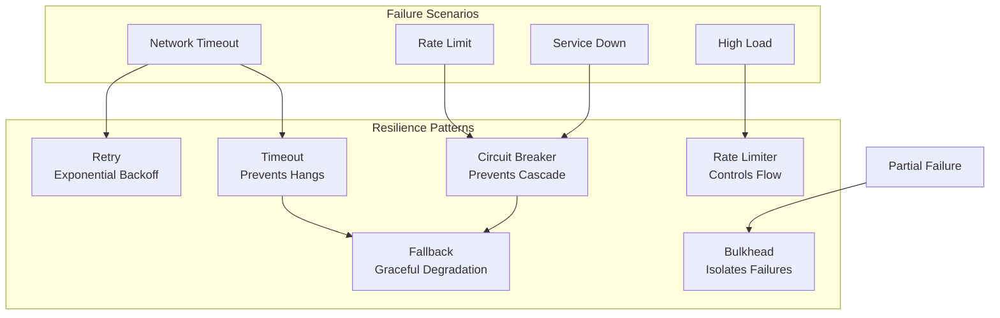
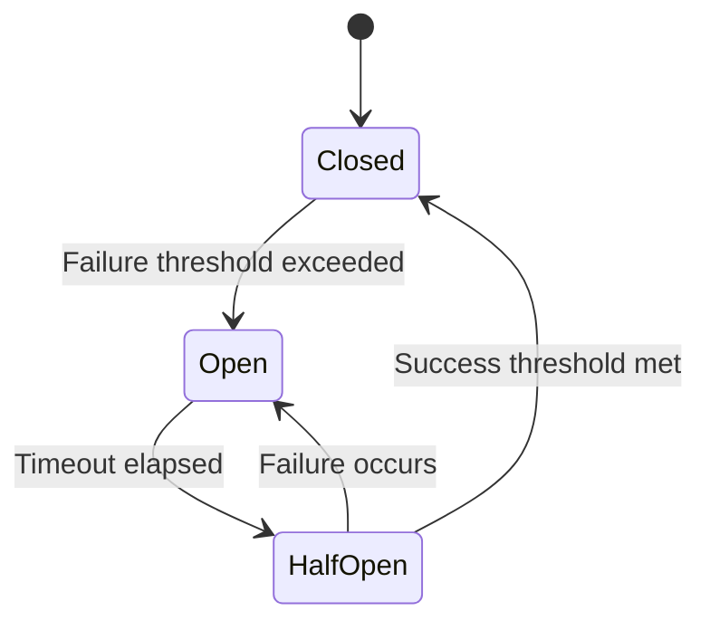

# Phase 6: AI Application Engineering

# Part 19: Resilient AI Systems

**Building robust, fault-tolerant AI applications that handle failures gracefully—with retries, circuit breakers, timeouts, and graceful degradation.**

---

## The Target: What We're Building Right Now

In this part, we're building six powerful resilience components:

1. **A Retry System** — Exponential backoff with jitter
2. **A Circuit Breaker** — Prevent cascading failures
3. **A Timeout Manager** — Prevent hanging operations
4. **A Rate Limiter** — Control request flow
5. **A Bulkhead Pattern** — Isolate failures
6. **A Complete Resilient AI Client** — Production-ready resilience

**Why this matters:** AI APIs fail—networks drop, services go down, rate limits hit. A resilient system handles these failures gracefully, maintaining availability and user experience when things go wrong.

---

## The Concept: Building Resilient AI Systems

### The Building Analogy

Imagine constructing a building:

- **Retries** = Having backup materials if something breaks
- **Circuit Breaker** = A fire door that closes to stop fire spreading
- **Timeouts** = Fire alarms that go off after a certain time
- **Rate Limiting** = Only allowing a certain number of people in
- **Bulkheads** = Separate rooms that prevent fire spreading
- **Graceful Degradation** = A building that can still function even if part is damaged

**Resilient systems are designed to handle failure without complete collapse.**



### Resilience Patterns Comparison

| Pattern | Problem Solved | How It Works | When to Use |
|---------|---------------|--------------|-------------|
| **Retry** | Transient failures | Retry with backoff | Temporary network issues |
| **Circuit Breaker** | Cascading failures | Stop requests after failures | Service outages |
| **Timeout** | Hanging operations | Cancel after time limit | Slow responses |
| **Rate Limiting** | Overwhelming services | Limit request rate | API limits |
| **Bulkhead** | Resource exhaustion | Isolate components | Resource contention |
| **Fallback** | Unavailable service | Use alternative | Degraded service |
| **Graceful Degradation** | Complete failure | Reduce functionality | Any failure |

### Retry Strategies

| Strategy | Delay Pattern | Use Case | Pros | Cons |
|----------|---------------|----------|------|------|
| **Fixed** | Constant delay | Simple retries | Simple | May worsen congestion |
| **Linear** | Linearly increasing | Moderate failures | Gradual backoff | Predictable |
| **Exponential** | Doubling delay | Network failures | Efficient | Can wait too long |
| **Exponential + Jitter** | Doubling + random | Production systems | Prevents thundering herd | More complex |

### Circuit Breaker States



---

## The Implementation: Building Our Resilience Tools

### Target File Structure

```
phase-6-engineering/
└── module-19-resilient-ai/
    ├── 01_retry_system.py
    ├── 02_circuit_breaker.py
    ├── 03_timeout_manager.py
    ├── 04_rate_limiter.py
    ├── 05_bulkhead_pattern.py
    ├── 06_resilient_ai_client.py
    ├── requirements.txt
    └── README.md
```

### Step 1: Retry System

Create `01_retry_system.py`:

```python
#!/usr/bin/env python3
"""
Module 19: Retry System

Exponential backoff with jitter for resilient API calls.
"""

import os
import sys
from pathlib import Path
import json
import time
import random
from typing import List, Dict, Any, Optional, Callable
from datetime import datetime

sys.path.insert(0, str(Path(__file__).parent.parent.parent.parent))

from shared.utils.config import load_config
from shared.utils.logging import setup_logging

setup_logging(debug=False)
config = load_config()

class RetrySystem:
    """
    Retry system with exponential backoff and jitter.
    
    Features:
    - Exponential backoff
    - Random jitter
    - Configurable retry count
    - Error filtering
    - Callback support
    """
    
    def __init__(
        self,
        max_retries: int = 3,
        base_delay: float = 1.0,
        max_delay: float = 60.0,
        backoff_factor: float = 2.0,
        jitter_factor: float = 0.5,
        retry_on: Optional[List[type]] = None
    ):
        """
        Initialize the retry system.
        
        Args:
            max_retries: Maximum number of retries
            base_delay: Base delay in seconds
            max_delay: Maximum delay in seconds
            backoff_factor: Multiplier for each retry
            jitter_factor: Random variation factor
            retry_on: Exceptions to retry on
        """
        self.max_retries = max_retries
        self.base_delay = base_delay
        self.max_delay = max_delay
        self.backoff_factor = backoff_factor
        self.jitter_factor = jitter_factor
        self.retry_on = retry_on or [Exception]
        
        self.stats = {
            "total_attempts": 0,
            "successful_attempts": 0,
            "failed_attempts": 0,
            "total_retries": 0
        }
        
        print(f"✅ Initialized retry system")
        print(f"   Max retries: {max_retries}")
        print(f"   Base delay: {base_delay}s")
    
    def execute(
        self,
        func: Callable,
        *args,
        **kwargs
    ) -> Any:
        """
        Execute a function with retries.
        
        Args:
            func: Function to execute
            *args: Arguments for the function
            **kwargs: Keyword arguments
            
        Returns:
            Function result
        """
        last_exception = None
        
        for attempt in range(self.max_retries + 1):
            self.stats["total_attempts"] += 1
            
            try:
                result = func(*args, **kwargs)
                self.stats["successful_attempts"] += 1
                return result
                
            except Exception as e:
                last_exception = e
                self.stats["failed_attempts"] += 1
                
                # Check if we should retry
                if not self._should_retry(e):
                    raise
                
                # Check if this is the last attempt
                if attempt >= self.max_retries:
                    raise
                
                # Calculate delay
                delay = self._calculate_delay(attempt)
                self.stats["total_retries"] += 1
                
                print(f"   ⚠️ Attempt {attempt + 1}/{self.max_retries + 1} failed: {str(e)[:50]}...")
                print(f"   ⏳ Retrying in {delay:.2f}s")
                
                time.sleep(delay)
        
        raise last_exception
    
    async def execute_async(
        self,
        func: Callable,
        *args,
        **kwargs
    ) -> Any:
        """
        Execute an async function with retries.
        
        Args:
            func: Async function to execute
            *args: Arguments for the function
            **kwargs: Keyword arguments
            
        Returns:
            Function result
        """
        import asyncio
        
        last_exception = None
        
        for attempt in range(self.max_retries + 1):
            self.stats["total_attempts"] += 1
            
            try:
                result = await func(*args, **kwargs)
                self.stats["successful_attempts"] += 1
                return result
                
            except Exception as e:
                last_exception = e
                self.stats["failed_attempts"] += 1
                
                if not self._should_retry(e):
                    raise
                
                if attempt >= self.max_retries:
                    raise
                
                delay = self._calculate_delay(attempt)
                self.stats["total_retries"] += 1
                
                print(f"   ⚠️ Attempt {attempt + 1} failed: {str(e)[:50]}...")
                print(f"   ⏳ Retrying in {delay:.2f}s")
                
                await asyncio.sleep(delay)
        
        raise last_exception
    
    def _should_retry(self, exception: Exception) -> bool:
        """
        Check if the exception should be retried.
        
        Args:
            exception: The exception to check
            
        Returns:
            True if should retry
        """
        for exc_type in self.retry_on:
            if isinstance(exception, exc_type):
                return True
        return False
    
    def _calculate_delay(self, attempt: int) -> float:
        """
        Calculate delay with exponential backoff and jitter.
        
        Args:
            attempt: Current attempt number
            
        Returns:
            Delay in seconds
        """
        # Exponential backoff
        delay = self.base_delay * (self.backoff_factor ** attempt)
        
        # Add jitter
        jitter = random.uniform(-self.jitter_factor, self.jitter_factor) * delay
        delay += jitter
        
        # Clamp to max
        delay = min(delay, self.max_delay)
        delay = max(0.1, delay)
        
        return delay
    
    def get_stats(self) -> Dict[str, Any]:
        """
        Get retry statistics.
        
        Returns:
            Statistics dictionary
        """
        return {
            **self.stats,
            "success_rate": self.stats["successful_attempts"] / self.stats["total_attempts"] if self.stats["total_attempts"] > 0 else 0
        }

def demonstrate_retry():
    """Demonstrate the retry system."""
    print("\n" + "="*80)
    print("🔄 RETRY SYSTEM DEMONSTRATION")
    print("="*80)
    
    # Create retry system
    retry = RetrySystem(
        max_retries=3,
        base_delay=0.5,
        max_delay=5.0,
        backoff_factor=2.0
    )
    
    # Simulate a flaky function
    attempt_count = 0
    
    def flaky_function():
        nonlocal attempt_count
        attempt_count += 1
        
        if attempt_count < 3:
            raise ConnectionError("Connection failed")
        return f"Success on attempt {attempt_count}"
    
    # Execute with retry
    print("\n📋 Testing flaky function:")
    try:
        result = retry.execute(flaky_function)
        print(f"✅ Result: {result}")
    except Exception as e:
        print(f"❌ Failed: {e}")
    
    # Async version
    import asyncio
    
    async def flaky_async():
        import random
        if random.random() < 0.6:
            raise TimeoutError("Timeout")
        return "Async success!"
    
    print("\n📋 Testing async flaky function:")
    try:
        result = asyncio.run(retry.execute_async(flaky_async))
        print(f"✅ Result: {result}")
    except Exception as e:
        print(f"❌ Failed: {e}")
    
    # Show stats
    print("\n📊 Retry Statistics:")
    print(json.dumps(retry.get_stats(), indent=2))

def main():
    """Run the retry system demonstration."""
    print("\n" + "="*80)
    print("AI TUTORIAL SERIES - RETRY SYSTEM")
    print("="*80)
    
    demonstrate_retry()

if __name__ == "__main__":
    main()
```

### Step 2: Circuit Breaker

Create `02_circuit_breaker.py`:

```python
#!/usr/bin/env python3
"""
Module 19: Circuit Breaker

Prevent cascading failures in AI systems.
"""

import os
import sys
from pathlib import Path
import json
import time
from typing import Dict, Any, Optional, Callable
from enum import Enum
from datetime import datetime

sys.path.insert(0, str(Path(__file__).parent.parent.parent.parent))

from shared.utils.config import load_config
from shared.utils.logging import setup_logging

setup_logging(debug=False)
config = load_config()

class CircuitState(Enum):
    """Circuit breaker states."""
    CLOSED = "closed"      # Normal operation
    OPEN = "open"          # Circuit is open (failing)
    HALF_OPEN = "half_open"  # Testing if service recovered

class CircuitBreaker:
    """
    Circuit breaker pattern for preventing cascading failures.
    
    Features:
    - Configurable failure threshold
    - Timeout for recovery
    - Half-open state for testing
    - Success threshold for closing
    - State change callbacks
    """
    
    def __init__(
        self,
        name: str = "default",
        failure_threshold: int = 5,
        recovery_timeout: float = 30.0,
        success_threshold: int = 3,
        timeout: float = 10.0
    ):
        """
        Initialize the circuit breaker.
        
        Args:
            name: Circuit breaker name
            failure_threshold: Number of failures before opening
            recovery_timeout: Seconds before trying to recover
            success_threshold: Number of successes before closing
            timeout: Operation timeout
        """
        self.name = name
        self.failure_threshold = failure_threshold
        self.recovery_timeout = recovery_timeout
        self.success_threshold = success_threshold
        self.timeout = timeout
        
        self.state = CircuitState.CLOSED
        self.failure_count = 0
        self.success_count = 0
        self.last_failure_time = None
        self.last_state_change = datetime.now().isoformat()
        
        self.stats = {
            "total_requests": 0,
            "successful_requests": 0,
            "failed_requests": 0,
            "rejected_requests": 0,
            "state_changes": 0
        }
        
        print(f"✅ Initialized circuit breaker: {name}")
        print(f"   Failure threshold: {failure_threshold}")
        print(f"   Recovery timeout: {recovery_timeout}s")
    
    def execute(
        self,
        func: Callable,
        *args,
        **kwargs
    ) -> Any:
        """
        Execute a function with circuit breaker protection.
        
        Args:
            func: Function to execute
            *args: Arguments for the function
            **kwargs: Keyword arguments
            
        Returns:
            Function result
            
        Raises:
            Exception: Circuit breaker is open
            Exception: Operation timed out
        """
        self.stats["total_requests"] += 1
        
        # Check if circuit is open
        if self.state == CircuitState.OPEN:
            # Check if recovery timeout has elapsed
            if self.last_failure_time:
                elapsed = time.time() - self.last_failure_time
                if elapsed >= self.recovery_timeout:
                    # Move to half-open
                    self._transition_to(CircuitState.HALF_OPEN)
                else:
                    self.stats["rejected_requests"] += 1
                    raise Exception(
                        f"Circuit breaker '{self.name}' is OPEN. "
                        f"Retry in {self.recovery_timeout - elapsed:.1f}s"
                    )
        
        # Execute the function
        try:
            # Set a timeout
            import threading
            result = [None]
            error = [None]
            done = [False]
            
            def execute_with_timeout():
                try:
                    result[0] = func(*args, **kwargs)
                    done[0] = True
                except Exception as e:
                    error[0] = e
                    done[0] = True
            
            thread = threading.Thread(target=execute_with_timeout)
            thread.daemon = True
            thread.start()
            thread.join(self.timeout)
            
            if not done[0]:
                raise TimeoutError(f"Operation timed out after {self.timeout}s")
            
            if error[0]:
                raise error[0]
            
            # Success
            self._record_success()
            return result[0]
            
        except Exception as e:
            self._record_failure(e)
            raise
    
    def _record_success(self) -> None:
        """Record a successful request."""
        self.stats["successful_requests"] += 1
        
        if self.state == CircuitState.HALF_OPEN:
            self.success_count += 1
            if self.success_count >= self.success_threshold:
                self._transition_to(CircuitState.CLOSED)
        elif self.state == CircuitState.CLOSED:
            self.failure_count = 0  # Reset failure count
    
    def _record_failure(self, error: Exception) -> None:
        """Record a failed request."""
        self.stats["failed_requests"] += 1
        
        if self.state == CircuitState.CLOSED:
            self.failure_count += 1
            if self.failure_count >= self.failure_threshold:
                self._transition_to(CircuitState.OPEN)
        
        elif self.state == CircuitState.HALF_OPEN:
            self._transition_to(CircuitState.OPEN)
    
    def _transition_to(self, new_state: CircuitState) -> None:
        """
        Transition to a new circuit state.
        
        Args:
            new_state: New state
        """
        old_state = self.state
        self.state = new_state
        self.stats["state_changes"] += 1
        self.last_state_change = datetime.now().isoformat()
        
        if new_state == CircuitState.OPEN:
            self.last_failure_time = time.time()
            self.success_count = 0
            print(f"🔴 Circuit '{self.name}' opened")
        
        elif new_state == CircuitState.HALF_OPEN:
            self.success_count = 0
            self.last_failure_time = None
            print(f"🟡 Circuit '{self.name}' half-open (testing)")
        
        elif new_state == CircuitState.CLOSED:
            self.failure_count = 0
            self.success_count = 0
            self.last_failure_time = None
            print(f"🟢 Circuit '{self.name}' closed (healthy)")
    
    def force_open(self) -> None:
        """Force the circuit to open."""
        self._transition_to(CircuitState.OPEN)
    
    def force_close(self) -> None:
        """Force the circuit to close."""
        self._transition_to(CircuitState.CLOSED)
    
    def get_status(self) -> Dict[str, Any]:
        """
        Get circuit breaker status.
        
        Returns:
            Status information
        """
        return {
            "name": self.name,
            "state": self.state.value,
            "failure_count": self.failure_count,
            "success_count": self.success_count,
            "last_failure_time": self.last_failure_time,
            "last_state_change": self.last_state_change,
            "stats": self.stats
        }

def demonstrate_circuit_breaker():
    """Demonstrate the circuit breaker."""
    print("\n" + "="*80)
    print("⭕ CIRCUIT BREAKER DEMONSTRATION")
    print("="*80)
    
    # Create circuit breaker
    cb = CircuitBreaker(
        name="test_circuit",
        failure_threshold=3,
        recovery_timeout=5.0,
        success_threshold=2
    )
    
    print("\n📋 Testing circuit breaker behavior:")
    print("-"*40)
    
    # Simulate a failing function
    import random
    
    def flaky_function():
        if random.random() < 0.7:
            raise ConnectionError("Connection failed")
        return "Success!"
    
    # Make multiple calls
    for i in range(1, 15):
        try:
            result = cb.execute(flaky_function)
            print(f"   {i}. ✅ {result}")
        except Exception as e:
            print(f"   {i}. ❌ {str(e)[:50]}...")
        
        # Show status
        status = cb.get_status()
        if status["state"] != "closed":
            print(f"      State: {status['state']}")
            print(f"      Failures: {status['failure_count']}")
            print(f"      Successes: {status['success_count']}")
        
        # Small delay between calls
        time.sleep(0.2)
    
    print("\n📊 Circuit Status:")
    print(json.dumps(cb.get_status(), indent=2))

def main():
    """Run the circuit breaker demonstration."""
    print("\n" + "="*80)
    print("AI TUTORIAL SERIES - CIRCUIT BREAKER")
    print("="*80)
    
    demonstrate_circuit_breaker()

if __name__ == "__main__":
    main()
```

### Step 3: Timeout Manager

Create `03_timeout_manager.py`:

```python
#!/usr/bin/env python3
"""
Module 19: Timeout Manager

Prevent hanging operations with configurable timeouts.
"""

import os
import sys
from pathlib import Path
import json
import signal
import time
import threading
from typing import Any, Callable, Optional, Dict
from contextlib import contextmanager

sys.path.insert(0, str(Path(__file__).parent.parent.parent.parent))

from shared.utils.config import load_config
from shared.utils.logging import setup_logging

setup_logging(debug=False)
config = load_config()

class TimeoutManager:
    """
    Manage timeouts for operations.
    
    Features:
    - Thread-based timeouts
    - Signal-based timeouts
    - Context manager
    - Custom timeout handlers
    - Timeout statistics
    """
    
    def __init__(self, default_timeout: float = 30.0):
        """
        Initialize the timeout manager.
        
        Args:
            default_timeout: Default timeout in seconds
        """
        self.default_timeout = default_timeout
        self.stats = {
            "total_operations": 0,
            "completed_operations": 0,
            "timed_out_operations": 0,
            "timeouts": []
        }
        
        print(f"✅ Initialized timeout manager")
        print(f"   Default timeout: {default_timeout}s")
    
    @contextmanager
    def timeout(self, seconds: Optional[float] = None):
        """
        Context manager for timeouts.
        
        Args:
            seconds: Timeout in seconds (uses default if None)
        """
        timeout = seconds or self.default_timeout
        signal_alarm = hasattr(signal, 'SIGALRM')
        
        if signal_alarm:
            # Use signal-based timeout (Unix only)
            def timeout_handler(signum, frame):
                raise TimeoutError(f"Operation timed out after {timeout}s")
            
            old_handler = signal.signal(signal.SIGALRM, timeout_handler)
            signal.alarm(int(timeout))
            
            try:
                self.stats["total_operations"] += 1
                yield
                self.stats["completed_operations"] += 1
            except TimeoutError as e:
                self.stats["timed_out_operations"] += 1
                self.stats["timeouts"].append({
                    "timeout": timeout,
                    "error": str(e),
                    "timestamp": time.time()
                })
                raise
            finally:
                signal.alarm(0)
                signal.signal(signal.SIGALRM, old_handler)
        else:
            # Use thread-based timeout (cross-platform)
            result = [None]
            error = [None]
            done = [False]
            
            def target():
                try:
                    yield
                    done[0] = True
                except Exception as e:
                    error[0] = e
                    done[0] = True
            
            thread = threading.Thread(target=target)
            thread.daemon = True
            thread.start()
            thread.join(timeout)
            
            self.stats["total_operations"] += 1
            
            if not done[0]:
                self.stats["timed_out_operations"] += 1
                self.stats["timeouts"].append({
                    "timeout": timeout,
                    "error": f"Operation timed out after {timeout}s",
                    "timestamp": time.time()
                })
                raise TimeoutError(f"Operation timed out after {timeout}s")
            
            if error[0]:
                raise error[0]
            
            self.stats["completed_operations"] += 1
            yield
    
    def execute_with_timeout(
        self,
        func: Callable,
        *args,
        timeout: Optional[float] = None,
        **kwargs
    ) -> Any:
        """
        Execute a function with a timeout.
        
        Args:
            func: Function to execute
            *args: Arguments for the function
            timeout: Timeout in seconds
            **kwargs: Keyword arguments
            
        Returns:
            Function result
            
        Raises:
            TimeoutError: If operation times out
        """
        with self.timeout(timeout):
            return func(*args, **kwargs)
    
    async def execute_async_with_timeout(
        self,
        func: Callable,
        *args,
        timeout: Optional[float] = None,
        **kwargs
    ) -> Any:
        """
        Execute an async function with a timeout.
        
        Args:
            func: Async function to execute
            *args: Arguments for the function
            timeout: Timeout in seconds
            **kwargs: Keyword arguments
            
        Returns:
            Function result
            
        Raises:
            TimeoutError: If operation times out
        """
        import asyncio
        
        timeout = timeout or self.default_timeout
        
        try:
            return await asyncio.wait_for(
                func(*args, **kwargs),
                timeout=timeout
            )
        except asyncio.TimeoutError:
            self.stats["timed_out_operations"] += 1
            self.stats["timeouts"].append({
                "timeout": timeout,
                "error": f"Async operation timed out after {timeout}s",
                "timestamp": time.time()
            })
            raise TimeoutError(f"Async operation timed out after {timeout}s")
    
    def get_stats(self) -> Dict[str, Any]:
        """
        Get timeout statistics.
        
        Returns:
            Statistics dictionary
        """
        return {
            **self.stats,
            "success_rate": self.stats["completed_operations"] / self.stats["total_operations"] if self.stats["total_operations"] > 0 else 0,
            "recent_timeouts": self.stats["timeouts"][-5:]
        }

def demonstrate_timeout():
    """Demonstrate the timeout manager."""
    print("\n" + "="*80)
    print("⏱️ TIMEOUT MANAGER DEMONSTRATION")
    print("="*80)
    
    manager = TimeoutManager(default_timeout=2.0)
    
    # Function that takes time
    def slow_function(delay: float):
        print(f"   Sleeping for {delay}s...")
        time.sleep(delay)
        return "Completed!"
    
    # Test with timeout
    print("\n📋 Testing with 2s timeout:")
    try:
        result = manager.execute_with_timeout(slow_function, 1.0, timeout=2.0)
        print(f"✅ Result: {result}")
    except TimeoutError as e:
        print(f"❌ {e}")
    
    print("\n📋 Testing with 1s timeout (should fail):")
    try:
        result = manager.execute_with_timeout(slow_function, 2.0, timeout=1.0)
        print(f"✅ Result: {result}")
    except TimeoutError as e:
        print(f"❌ {e}")
    
    # Async version
    import asyncio
    
    async def slow_async(delay: float):
        print(f"   Async sleeping for {delay}s...")
        await asyncio.sleep(delay)
        return "Async completed!"
    
    print("\n📋 Testing async with 2s timeout:")
    try:
        result = asyncio.run(
            manager.execute_async_with_timeout(slow_async, 1.0, timeout=2.0)
        )
        print(f"✅ Result: {result}")
    except TimeoutError as e:
        print(f"❌ {e}")
    
    # Stats
    print("\n📊 Timeout Statistics:")
    print(json.dumps(manager.get_stats(), indent=2))

def main():
    """Run the timeout manager demonstration."""
    print("\n" + "="*80)
    print("AI TUTORIAL SERIES - TIMEOUT MANAGER")
    print("="*80)
    
    demonstrate_timeout()

if __name__ == "__main__":
    main()
```

### Step 4: Rate Limiter

Create `04_rate_limiter.py`:

```python
#!/usr/bin/env python3
"""
Module 19: Rate Limiter

Control request flow to prevent overwhelming services.
"""

import os
import sys
from pathlib import Path
import json
import time
import threading
from typing import Dict, Any, Optional
from collections import deque
from datetime import datetime

sys.path.insert(0, str(Path(__file__).parent.parent.parent.parent))

from shared.utils.config import load_config
from shared.utils.logging import setup_logging

setup_logging(debug=False)
config = load_config()

class RateLimiter:
    """
    Rate limiter for controlling request flow.
    
    Features:
    - Token bucket algorithm
    - Configurable rate and capacity
    - Burst handling
    - Multiple limiters
    - Statistics
    """
    
    def __init__(
        self,
        name: str = "default",
        rate: float = 10.0,
        capacity: float = 10.0,
        burst: float = 2.0
    ):
        """
        Initialize the rate limiter.
        
        Args:
            name: Rate limiter name
            rate: Requests per second
            capacity: Maximum tokens
            burst: Burst capacity multiplier
        """
        self.name = name
        self.rate = rate
        self.capacity = capacity
        self.burst = burst
        
        self.tokens = capacity
        self.max_tokens = capacity * burst
        self.last_refill = time.time()
        self.lock = threading.Lock()
        
        self.stats = {
            "total_requests": 0,
            "allowed_requests": 0,
            "blocked_requests": 0,
            "last_request": None
        }
        
        print(f"✅ Initialized rate limiter: {name}")
        print(f"   Rate: {rate} req/s")
        print(f"   Capacity: {capacity}")
        print(f"   Burst: {burst}x")
    
    def allow_request(self, cost: float = 1.0) -> bool:
        """
        Check if a request is allowed.
        
        Args:
            cost: Request cost in tokens
            
        Returns:
            True if request is allowed
        """
        self.stats["total_requests"] += 1
        
        with self.lock:
            self._refill_tokens()
            
            if self.tokens >= cost:
                self.tokens -= cost
                self.stats["allowed_requests"] += 1
                self.stats["last_request"] = datetime.now().isoformat()
                return True
            else:
                self.stats["blocked_requests"] += 1
                return False
    
    def _refill_tokens(self) -> None:
        """Refill tokens based on elapsed time."""
        now = time.time()
        elapsed = now - self.last_refill
        
        # Calculate tokens to add
        tokens_to_add = elapsed * self.rate
        
        self.tokens = min(self.tokens + tokens_to_add, self.max_tokens)
        self.last_refill = now
    
    def wait_until_allowed(self, cost: float = 1.0, max_wait: float = 60.0) -> bool:
        """
        Wait until a request is allowed.
        
        Args:
            cost: Request cost
            max_wait: Maximum wait time
            
        Returns:
            True if request was allowed within max_wait
        """
        start_time = time.time()
        
        while True:
            if self.allow_request(cost):
                return True
            
            # Check if we've waited too long
            if time.time() - start_time >= max_wait:
                return False
            
            # Calculate wait time
            with self.lock:
                self._refill_tokens()
                if self.tokens < cost:
                    wait_time = (cost - self.tokens) / self.rate
                else:
                    wait_time = 0.1
            
            time.sleep(min(wait_time, 0.5))
    
    def execute_with_limiter(
        self,
        func: callable,
        *args,
        cost: float = 1.0,
        wait: bool = True,
        **kwargs
    ) -> Dict[str, Any]:
        """
        Execute a function with rate limiting.
        
        Args:
            func: Function to execute
            *args: Arguments for the function
            cost: Request cost
            wait: Whether to wait if rate limited
            **kwargs: Keyword arguments
            
        Returns:
            Result dictionary
        """
        if wait:
            allowed = self.wait_until_allowed(cost)
        else:
            allowed = self.allow_request(cost)
        
        if not allowed:
            return {
                "success": False,
                "error": "Rate limit exceeded",
                "rate_limiter": self.name
            }
        
        try:
            result = func(*args, **kwargs)
            return {
                "success": True,
                "result": result,
                "rate_limiter": self.name
            }
        except Exception as e:
            return {
                "success": False,
                "error": str(e),
                "rate_limiter": self.name
            }
    
    def get_stats(self) -> Dict[str, Any]:
        """
        Get rate limiter statistics.
        
        Returns:
            Statistics dictionary
        """
        with self.lock:
            self._refill_tokens()
            return {
                **self.stats,
                "current_tokens": self.tokens,
                "max_tokens": self.max_tokens,
                "rate": self.rate,
                "capacity": self.capacity,
                "burst": self.burst,
                "allowed_rate": self.stats["allowed_requests"] / self.stats["total_requests"] if self.stats["total_requests"] > 0 else 0
            }

def demonstrate_rate_limiter():
    """Demonstrate the rate limiter."""
    print("\n" + "="*80)
    print("🚦 RATE LIMITER DEMONSTRATION")
    print("="*80)
    
    # Create rate limiter
    limiter = RateLimiter("demo", rate=2.0, capacity=3.0, burst=2.0)
    
    print("\n📋 Testing rate limiter:")
    print("-"*40)
    
    # Simulate requests
    for i in range(10):
        allowed = limiter.allow_request()
        status = "✅" if allowed else "❌"
        print(f"   {i+1}. {status} Request {'allowed' if allowed else 'blocked'}")
        
        # Show stats every few requests
        if (i + 1) % 3 == 0:
            stats = limiter.get_stats()
            print(f"      Tokens: {stats['current_tokens']:.2f}")
            print(f"      Allowed: {stats['allowed_requests']}/{stats['total_requests']}")
        
        time.sleep(0.3)
    
    # Test with wait
    print("\n📋 Testing with wait:")
    print("-"*40)
    
    def test_func():
        return "Request processed"
    
    for i in range(5):
        result = limiter.execute_with_limiter(test_func, wait=True)
        if result["success"]:
            print(f"   {i+1}. ✅ {result['result']}")
        else:
            print(f"   {i+1}. ❌ {result['error']}")
    
    # Stats
    print("\n📊 Rate Limiter Stats:")
    print(json.dumps(limiter.get_stats(), indent=2))

def main():
    """Run the rate limiter demonstration."""
    print("\n" + "="*80)
    print("AI TUTORIAL SERIES - RATE LIMITER")
    print("="*80)
    
    demonstrate_rate_limiter()

if __name__ == "__main__":
    main()
```

### Step 5: Bulkhead Pattern

Create `05_bulkhead_pattern.py`:

```python
#!/usr/bin/env python3
"""
Module 19: Bulkhead Pattern

Isolate failures and resource contention in AI systems.
"""

import os
import sys
from pathlib import Path
import json
import threading
import time
from typing import Dict, Any, Optional, List
from collections import deque
from datetime import datetime

sys.path.insert(0, str(Path(__file__).parent.parent.parent.parent))

from shared.utils.config import load_config
from shared.utils.logging import setup_logging

setup_logging(debug=False)
config = load_config()

class Bulkhead:
    """
    Bulkhead pattern for isolating failures.
    
    Features:
    - Resource isolation
    - Thread pool management
    - Queue management
    - Failure containment
    """
    
    def __init__(
        self,
        name: str = "default",
        max_concurrent: int = 5,
        queue_size: int = 10,
        timeout: float = 30.0
    ):
        """
        Initialize the bulkhead.
        
        Args:
            name: Bulkhead name
            max_concurrent: Maximum concurrent operations
            queue_size: Maximum queue size
            timeout: Operation timeout
        """
        self.name = name
        self.max_concurrent = max_concurrent
        self.queue_size = queue_size
        self.timeout = timeout
        
        self.active_count = 0
        self.queue = deque()
        self.lock = threading.Lock()
        self.condition = threading.Condition(self.lock)
        
        self.stats = {
            "total_accepted": 0,
            "total_rejected": 0,
            "total_completed": 0,
            "total_failed": 0,
            "peak_active": 0,
            "peak_queue": 0
        }
        
        print(f"✅ Initialized bulkhead: {name}")
        print(f"   Max concurrent: {max_concurrent}")
        print(f"   Queue size: {queue_size}")
    
    def acquire(self, timeout: Optional[float] = None) -> bool:
        """
        Acquire a slot in the bulkhead.
        
        Args:
            timeout: Timeout for acquiring
            
        Returns:
            True if acquired
        """
        timeout = timeout or self.timeout
        start_time = time.time()
        
        with self.condition:
            # Check if we can execute immediately
            if self.active_count < self.max_concurrent:
                self.active_count += 1
                self.stats["total_accepted"] += 1
                self._update_peak_active()
                return True
            
            # Check if we can queue
            if len(self.queue) >= self.queue_size:
                self.stats["total_rejected"] += 1
                return False
            
            # Add to queue
            self.queue.append(time.time())
            self._update_peak_queue()
            
            while True:
                # Wait for a slot
                if len(self.queue) > 0 and self.queue[0] == time.time():
                    self.queue.popleft()
                
                # Check if we can proceed
                if self.active_count < self.max_concurrent:
                    self.active_count += 1
                    self.stats["total_accepted"] += 1
                    self._update_peak_active()
                    return True
                
                # Check timeout
                if time.time() - start_time >= timeout:
                    self.stats["total_rejected"] += 1
                    return False
                
                # Wait for notification
                self.condition.wait(timeout=0.1)
    
    def release(self) -> None:
        """Release a slot in the bulkhead."""
        with self.condition:
            self.active_count -= 1
            self.stats["total_completed"] += 1
            self.condition.notify()
    
    def _update_peak_active(self) -> None:
        """Update peak active count."""
        if self.active_count > self.stats["peak_active"]:
            self.stats["peak_active"] = self.active_count
    
    def _update_peak_queue(self) -> None:
        """Update peak queue size."""
        if len(self.queue) > self.stats["peak_queue"]:
            self.stats["peak_queue"] = len(self.queue)
    
    def execute(self, func: callable, *args, **kwargs) -> Dict[str, Any]:
        """
        Execute a function through the bulkhead.
        
        Args:
            func: Function to execute
            *args: Arguments for the function
            **kwargs: Keyword arguments
            
        Returns:
            Result dictionary
        """
        acquired = self.acquire()
        
        if not acquired:
            self.stats["total_rejected"] += 1
            return {
                "success": False,
                "error": "Bulkhead capacity exceeded",
                "bulkhead": self.name
            }
        
        try:
            result = func(*args, **kwargs)
            self.stats["total_completed"] += 1
            return {
                "success": True,
                "result": result,
                "bulkhead": self.name
            }
        except Exception as e:
            self.stats["total_failed"] += 1
            return {
                "success": False,
                "error": str(e),
                "bulkhead": self.name
            }
        finally:
            self.release()
    
    def get_stats(self) -> Dict[str, Any]:
        """
        Get bulkhead statistics.
        
        Returns:
            Statistics dictionary
        """
        with self.lock:
            return {
                **self.stats,
                "name": self.name,
                "active_count": self.active_count,
                "queue_length": len(self.queue),
                "max_concurrent": self.max_concurrent,
                "queue_size": self.queue_size,
                "acceptance_rate": self.stats["total_accepted"] / (self.stats["total_accepted"] + self.stats["total_rejected"]) if (self.stats["total_accepted"] + self.stats["total_rejected"]) > 0 else 0
            }

class BulkheadPool:
    """
    Manage multiple bulkheads for different services.
    """
    
    def __init__(self):
        """Initialize the bulkhead pool."""
        self.bulkheads = {}
        print("✅ Initialized bulkhead pool")
    
    def create_bulkhead(
        self,
        name: str,
        max_concurrent: int = 5,
        queue_size: int = 10,
        timeout: float = 30.0
    ) -> Bulkhead:
        """
        Create a new bulkhead.
        
        Args:
            name: Bulkhead name
            max_concurrent: Maximum concurrent operations
            queue_size: Queue size
            timeout: Operation timeout
            
        Returns:
            Bulkhead instance
        """
        bulkhead = Bulkhead(name, max_concurrent, queue_size, timeout)
        self.bulkheads[name] = bulkhead
        return bulkhead
    
    def get_bulkhead(self, name: str) -> Optional[Bulkhead]:
        """
        Get a bulkhead by name.
        
        Args:
            name: Bulkhead name
            
        Returns:
            Bulkhead instance or None
        """
        return self.bulkheads.get(name)
    
    def get_stats(self) -> Dict[str, Any]:
        """
        Get statistics for all bulkheads.
        
        Returns:
            Statistics dictionary
        """
        return {
            name: bulkhead.get_stats()
            for name, bulkhead in self.bulkheads.items()
        }

def demonstrate_bulkhead():
    """Demonstrate the bulkhead pattern."""
    print("\n" + "="*80)
    print("🚧 BULKHEAD PATTERN DEMONSTRATION")
    print("="*80)
    
    # Create bulkhead
    bulkhead = Bulkhead("api_calls", max_concurrent=3, queue_size=5)
    
    # Simulate work
    def work_function(work_id: int, duration: float):
        print(f"   Work {work_id} starting (duration: {duration}s)")
        time.sleep(duration)
        print(f"   Work {work_id} completed")
        return f"Result from work {work_id}"
    
    # Submit work
    print("\n📋 Submitting work:")
    print("-"*40)
    
    # Use threads to simulate concurrent requests
    threads = []
    results = []
    
    def submit_work(work_id: int, duration: float):
        result = bulkhead.execute(work_function, work_id, duration)
        results.append(result)
    
    # Submit 10 pieces of work with varying durations
    for i in range(10):
        duration = 0.5 + (i % 3) * 0.5
        thread = threading.Thread(target=submit_work, args=(i, duration))
        threads.append(thread)
        thread.start()
        time.sleep(0.1)  # Stagger submissions
    
    # Wait for all to complete
    for thread in threads:
        thread.join()
    
    print("\n📊 Results:")
    for i, result in enumerate(results):
        if result["success"]:
            print(f"   {i+1}. ✅ {result['result']}")
        else:
            print(f"   {i+1}. ❌ {result['error']}")
    
    # Stats
    print("\n📊 Bulkhead Stats:")
    print(json.dumps(bulkhead.get_stats(), indent=2))

def main():
    """Run the bulkhead demonstration."""
    print("\n" + "="*80)
    print("AI TUTORIAL SERIES - BULKHEAD PATTERN")
    print("="*80)
    
    demonstrate_bulkhead()

if __name__ == "__main__":
    main()
```

### Step 6: Resilient AI Client

Create `06_resilient_ai_client.py`:

```python
#!/usr/bin/env python3
"""
Module 19: Resilient AI Client

Production-ready client with all resilience patterns.
"""

import os
import sys
from pathlib import Path
import json
import time
from typing import Dict, Any, Optional, List
from datetime import datetime

sys.path.insert(0, str(Path(__file__).parent.parent.parent.parent))

from shared.utils.config import load_config
from shared.utils.logging import setup_logging
from retry_system import RetrySystem
from circuit_breaker import CircuitBreaker
from timeout_manager import TimeoutManager
from rate_limiter import RateLimiter
from bulkhead_pattern import Bulkhead

setup_logging(debug=False)
config = load_config()

class ResilientAIClient:
    """
    Production-ready AI client with full resilience.
    
    Features:
    - Retry with exponential backoff
    - Circuit breaker
    - Timeout management
    - Rate limiting
    - Bulkhead isolation
    """
    
    def __init__(
        self,
        model: str = "gpt-4o-mini",
        max_retries: int = 3,
        failure_threshold: int = 5,
        recovery_timeout: float = 30.0,
        timeout_seconds: float = 30.0,
        rate_limit: float = 10.0,
        max_concurrent: int = 5
    ):
        """
        Initialize the resilient AI client.
        
        Args:
            model: Model to use
            max_retries: Maximum retries
            failure_threshold: Circuit breaker failure threshold
            recovery_timeout: Circuit breaker recovery timeout
            timeout_seconds: Operation timeout
            rate_limit: Rate limit (requests/second)
            max_concurrent: Maximum concurrent operations
        """
        self.model = model
        
        # Initialize resilience components
        self.retry = RetrySystem(
            max_retries=max_retries,
            base_delay=1.0,
            max_delay=30.0,
            backoff_factor=2.0
        )
        
        self.circuit_breaker = CircuitBreaker(
            name="openai_api",
            failure_threshold=failure_threshold,
            recovery_timeout=recovery_timeout,
            success_threshold=3
        )
        
        self.timeout_manager = TimeoutManager(default_timeout=timeout_seconds)
        
        self.rate_limiter = RateLimiter(
            name="openai_requests",
            rate=rate_limit,
            capacity=rate_limit
        )
        
        self.bulkhead = Bulkhead(
            name="ai_requests",
            max_concurrent=max_concurrent,
            queue_size=10
        )
        
        # Initialize AI client
        self.client = None
        self._init_client()
        
        self.stats = {
            "total_requests": 0,
            "successful_requests": 0,
            "failed_requests": 0,
            "started_at": datetime.now().isoformat()
        }
        
        print(f"✅ Initialized resilient AI client")
        print(f"   Model: {model}")
        print(f"   Max retries: {max_retries}")
        print(f"   Failure threshold: {failure_threshold}")
        print(f"   Rate limit: {rate_limit} req/s")
        print(f"   Max concurrent: {max_concurrent}")
    
    def _init_client(self) -> None:
        """Initialize the AI client."""
        api_key = config.get("openai_api_key")
        if not api_key:
            print("⚠️ OpenAI API key not found")
            return
        
        try:
            from openai import OpenAI
            self.client = OpenAI(api_key=api_key)
        except Exception as e:
            print(f"⚠️ Failed to initialize client: {e}")
    
    def generate(
        self,
        prompt: str,
        system: Optional[str] = None,
        temperature: float = 0.7,
        max_tokens: int = 500
    ) -> Dict[str, Any]:
        """
        Generate a response with full resilience.
        
        Args:
            prompt: User prompt
            system: System prompt
            temperature: Temperature
            max_tokens: Maximum tokens
            
        Returns:
            Response dictionary
        """
        self.stats["total_requests"] += 1
        
        def execute_generation():
            """Execute the generation request."""
            if not self.client:
                raise Exception("Client not initialized")
            
            messages = []
            if system:
                messages.append({"role": "system", "content": system})
            messages.append({"role": "user", "content": prompt})
            
            response = self.client.chat.completions.create(
                model=self.model,
                messages=messages,
                temperature=temperature,
                max_tokens=max_tokens
            )
            
            return {
                "content": response.choices[0].message.content,
                "usage": {
                    "prompt_tokens": response.usage.prompt_tokens,
                    "completion_tokens": response.usage.completion_tokens,
                    "total_tokens": response.usage.total_tokens
                },
                "model": self.model
            }
        
        try:
            # Apply all resilience patterns
            result = self.bulkhead.execute(
                lambda: self.rate_limiter.execute_with_limiter(
                    lambda: self.timeout_manager.execute_with_timeout(
                        lambda: self.circuit_breaker.execute(
                            lambda: self.retry.execute(execute_generation)
                        ),
                        timeout=30.0
                    ),
                    wait=True
                )
            )
            
            if result["success"]:
                self.stats["successful_requests"] += 1
                return {
                    "success": True,
                    **result["result"]
                }
            else:
                self.stats["failed_requests"] += 1
                return {
                    "success": False,
                    "error": result.get("error", "Unknown error")
                }
            
        except Exception as e:
            self.stats["failed_requests"] += 1
            return {
                "success": False,
                "error": str(e)
            }
    
    def get_stats(self) -> Dict[str, Any]:
        """
        Get client statistics.
        
        Returns:
            Statistics dictionary
        """
        return {
            **self.stats,
            "retry": self.retry.get_stats(),
            "circuit_breaker": self.circuit_breaker.get_status(),
            "rate_limiter": self.rate_limiter.get_stats(),
            "bulkhead": self.bulkhead.get_stats(),
            "success_rate": self.stats["successful_requests"] / self.stats["total_requests"] if self.stats["total_requests"] > 0 else 0
        }

def demonstrate_resilient_client():
    """Demonstrate the resilient AI client."""
    print("\n" + "="*80)
    print("🛡️ RESILIENT AI CLIENT DEMONSTRATION")
    print("="*80)
    
    if not config.get("openai_api_key"):
        print("❌ OpenAI API key not available")
        return
    
    # Create client
    client = ResilientAIClient(
        model="gpt-4o-mini",
        max_retries=2,
        failure_threshold=3,
        timeout_seconds=10.0,
        rate_limit=5.0,
        max_concurrent=3
    )
    
    # Generate responses
    print("\n📋 Generating responses:")
    print("-"*40)
    
    prompts = [
        "What is the capital of France?",
        "Write a haiku about resilience",
        "Explain the concept of circuit breakers"
    ]
    
    for i, prompt in enumerate(prompts, 1):
        print(f"\nPrompt {i}: {prompt}")
        
        start = time.time()
        result = client.generate(prompt)
        elapsed = time.time() - start
        
        if result["success"]:
            print(f"✅ Response: {result['content'][:100]}...")
            print(f"   Tokens: {result['usage']['total_tokens']}")
            print(f"   Time: {elapsed:.2f}s")
        else:
            print(f"❌ Error: {result['error']}")
    
    # Show stats
    print("\n📊 Client Stats:")
    stats = client.get_stats()
    print(json.dumps({
        "success_rate": stats["success_rate"],
        "total_requests": stats["total_requests"],
        "retry_success": stats["retry"]["success_rate"],
        "circuit_state": stats["circuit_breaker"]["state"]
    }, indent=2))

def main():
    """Run the resilient client demonstration."""
    print("\n" + "="*80)
    print("AI TUTORIAL SERIES - RESILIENT AI CLIENT")
    print("="*80)
    
    demonstrate_resilient_client()

if __name__ == "__main__":
    main()
```

---

## The Verification: Testing Your Implementation

### Step 1: Install Dependencies

Create `requirements.txt`:

```txt
# Module 19 dependencies
openai>=1.0.0
python-dotenv>=1.0.0
```

Install them:

```bash
cd ~/ai-tutorial-series/phase-6-engineering/module-19-resilient-ai
pip install -r requirements.txt
```

### Step 2: Test the Retry System

```bash
python 01_retry_system.py
```

**Expected Output:**
- Exponential backoff
- Jitter calculation
- Retry statistics

### Step 3: Test the Circuit Breaker

```bash
python 02_circuit_breaker.py
```

**Expected Output:**
- State transitions (Closed → Open → Half-Open → Closed)
- Failure threshold
- Recovery timeout

### Step 4: Test the Timeout Manager

```bash
python 03_timeout_manager.py
```

**Expected Output:**
- Timeout handling
- Context manager
- Async support

### Step 5: Test the Rate Limiter

```bash
python 04_rate_limiter.py
```

**Expected Output:**
- Token bucket algorithm
- Rate limiting
- Burst handling

### Step 6: Test the Bulkhead Pattern

```bash
python 05_bulkhead_pattern.py
```

**Expected Output:**
- Concurrent control
- Queue management
- Isolation

### Step 7: Test the Resilient AI Client

```bash
python 06_resilient_ai_client.py
```

**Expected Output:**
- All resilience patterns working together
- Successful API calls
- Statistics

---

## Key Takeaways

By completing this module, you've:

✅ **Built a retry system** with exponential backoff
✅ **Created a circuit breaker** for preventing cascading failures
✅ **Implemented a timeout manager** for hanging operations
✅ **Built a rate limiter** for controlling request flow
✅ **Created a bulkhead pattern** for isolating failures
✅ **Built a resilient AI client** with all patterns

### The Mental Model to Carry Forward

```
┌─────────────────────────────────────────────────────────────────┐
│               RESILIENT SYSTEMS MENTAL MODEL                  │
├─────────────────────────────────────────────────────────────────┤
│                                                                 │
│  1. Retries handle transient failures gracefully              │
│  2. Circuit breakers prevent cascading failures               │
│  3. Timeouts prevent hanging operations                       │
│  4. Rate limiting prevents overwhelming services              │
│  5. Bulkheads isolate failures                                │
│  6. Graceful degradation maintains partial functionality      │
│  7. Resilience patterns work together                         │
│  8. Production AI systems must be resilient                   │
│                                                                 │
└─────────────────────────────────────────────────────────────────┘
```

### Resilience Best Practices

| Practice | Why | How |
|----------|-----|-----|
| **Use Exponential Backoff** | Prevents thundering herd | Double delay each retry |
| **Add Jitter** | Prevents synchronized retries | Random variation |
| **Set Timeouts** | Prevents hangs | Always timeout operations |
| **Monitor Circuit** | Know when services fail | Track state changes |
| **Rate Limit** | Respect API limits | Token bucket algorithm |
| **Isolate Resources** | Prevent contention | Bulkhead pattern |

---

## What's Next

**In Part 20: AI Observability**, you'll learn:
- Logging and tracing for AI applications
- Token usage and cost monitoring
- Latency analysis
- Prompt versioning
- Model evaluation and telemetry
