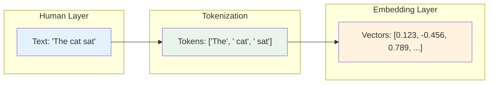
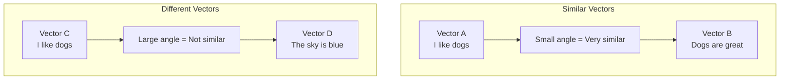

# Phase 1: Understanding How LLMs Actually Work

# Part 2: Tokens & Embeddings

**Understanding how text becomes numbers—the foundation of every AI application you'll build.**

---

## The Target: What We're Building Right Now

In this part, we're building four interconnected tools:

1. **A Token Counter Tool** — See exactly how text gets broken into tokens
2. **An Embedding Generator** — Convert text into meaningful number vectors
3. **A Semantic Similarity Visualizer** — See how embeddings capture meaning
4. **A Basic Semantic Search Engine** — Find similar text using embeddings

**Why this matters:** Everything you build in this series—chatbots, RAG systems, agents, search engines—rests on the concepts of tokens and embeddings. Master these, and everything else becomes easier to understand.

---

## The Concept: What Are Tokens and Embeddings?

### The Building Blocks Analogy

Imagine you're building with LEGO bricks:

- **Characters** (letters) = Individual LEGO studs (too small to build with efficiently)
- **Words** = Pre-assembled LEGO pieces (convenient but limited)
- **Tokens** = Special LEGO pieces that represent common chunks (the sweet spot)
- **Embeddings** = The instruction manual that tells you which pieces connect to which

Here's the key insight: **Computers don't understand words—they understand numbers.**

Tokens and embeddings are how we bridge the gap between human language and machine mathematics.



### What Are Tokens, Really?

A **token** is the smallest unit of text that an LLM processes. But here's the twist: **tokens aren't words**.

- A token can be a word: "cat" → ["cat"]
- A token can be part of a word: "running" → ["run", "ning"]
- A token can be punctuation: "." → ["."]
- A token can be a space: " " → [" "]

**Why not just use words?** 
- There are too many words (English has ~500,000)
- Words have variations (run, runs, running, ran)
- Some languages don't use spaces

**The token solution:**
- Common words get their own token
- Rare words get split into common pieces
- This creates a balanced vocabulary (e.g., 50,000-100,000 tokens)

**Real-world example:**

```
Text: "I love artificial intelligence!"
Tokens: ["I", " love", " artificial", " intelligence", "!"]
Count: 5 tokens
```

### Tokenization Algorithms

There are two main algorithms you'll encounter:

#### 1. BPE (Byte-Pair Encoding)

**How it works:** Start with characters, then iteratively merge the most frequent pairs.

```
Step 1: ["a", "b", "c"] 
Step 2: ["ab", "c"]  (if "ab" appears often)
Step 3: ["ab", "c"]  (keep merging until vocabulary is the right size)
```

**Used by:** GPT models, RoBERTa

#### 2. SentencePiece

**How it works:** Treats text as a stream of Unicode characters and builds tokens from them.

```
Text: "Hello world!"
Tokens: ["Hello", " world", "!"]
```

**Used by:** T5, Llama, Gemma

**The difference:** BPE starts with characters and merges; SentencePiece treats spaces as characters too.

### What Are Embeddings?

If tokens are the "what" (the pieces of text), embeddings are the "where" (where this text lives in meaning-space).

An **embedding** is a vector (a list of numbers) that represents the meaning of a piece of text.

```
"cat" → [0.123, -0.456, 0.789, 0.234, -0.567, ...]  (1536 numbers)
"dog" → [0.145, -0.423, 0.765, 0.289, -0.543, ...]  (1536 numbers)
```

**Why this is powerful:**

1. **Semantic similarity:** Similar meanings have similar vectors
   - "cat" is close to "kitten"
   - "cat" is far from "airplane"

2. **Mathematical operations:** You can do math with meaning!
   - "king" - "man" + "woman" ≈ "queen"

3. **Search:** Find documents that mean the same thing, not just words
   - Search "how to train a dog" returns "canine obedience tips"

### Measuring Similarity: Cosine Similarity

How do we know if two embeddings are similar? We use **cosine similarity**.

**The concept:** The angle between two vectors. Smaller angle = more similar.



**Formula:**
```
cosine_similarity(A, B) = (A · B) / (||A|| × ||B||)

Range: -1 (opposite) to 1 (identical)
Typically: 0 to 1 for text embeddings (all positive)
```

**In plain English:**
- Similar texts → cosine similarity near 1.0
- Unrelated texts → cosine similarity near 0.0
- Opposite meanings → cosine similarity near -1.0 (rare with modern embeddings)

---

## The Implementation: Building Our Token & Embedding Tools

### Target File Structure

```
phase-1-understanding-llms/
└── module-2-tokens-embeddings/
    ├── 01_token_counter.py
    ├── 02_embedding_generator.py
    ├── 03_semantic_similarity.py
    ├── 04_semantic_search.py
    ├── 05_tokenization_explorer.py
    ├── requirements.txt
    └── README.md
```

Let's build each tool step by step.

### Step 1: Token Counter Tool

First, let's build a tool that shows you exactly how text gets converted to tokens.

Create `01_token_counter.py`:

```python
#!/usr/bin/env python3
"""
Module 2: Token Counter Tool

This tool shows how text gets broken down into tokens.
Understanding tokenization is crucial for:
- Cost optimization (tokens = money)
- Context window management (max tokens = 128k)
- Prompt engineering (efficient prompting)

We'll use two tokenizers:
1. tiktoken (OpenAI's tokenizer) - shows what the model actually sees
2. A custom visualizer - shows tokens as colored chunks for clarity
"""

import os
import sys
from pathlib import Path
import tiktoken
from typing import List, Tuple

# Add shared directory to path
sys.path.insert(0, str(Path(__file__).parent.parent.parent.parent))

from shared.utils.config import load_config
from shared.utils.logging import setup_logging

# Set up logging
setup_logging(debug=False)

# Load configuration
config = load_config()

class TokenCounter:
    """
    A tool for counting and visualizing tokens in text.
    
    This class provides multiple ways to understand tokenization:
    1. Count tokens for any text
    2. Visualize token boundaries
    3. Compare tokenization across models
    4. Show token cost estimates
    """
    
    def __init__(self, model: str = "gpt-4o-mini"):
        """
        Initialize the token counter.
        
        Args:
            model: The model to use for tokenization (affects tokenizer)
        """
        self.model = model
        
        # Map model names to tiktoken encoding names
        # Different models use different tokenizers
        self.encoding_map = {
            "gpt-4o-mini": "cl100k_base",
            "gpt-4o": "cl100k_base",
            "gpt-3.5-turbo": "cl100k_base",
            "text-embedding-3-small": "cl100k_base",
            "text-embedding-ada-002": "cl100k_base",
        }
        
        # Get the encoding for this model
        encoding_name = self.encoding_map.get(model, "cl100k_base")
        self.encoding = tiktoken.get_encoding(encoding_name)
        
        # Token color mapping for visualization
        self.token_colors = [
            "\033[31m",  # Red
            "\033[32m",  # Green
            "\033[33m",  # Yellow
            "\033[34m",  # Blue
            "\033[35m",  # Magenta
            "\033[36m",  # Cyan
            "\033[37m",  # White
        ]
        self.reset_color = "\033[0m"
    
    def count_tokens(self, text: str) -> int:
        """
        Count the number of tokens in the given text.
        
        Args:
            text: The text to tokenize
            
        Returns:
            Number of tokens
        """
        return len(self.encoding.encode(text))
    
    def get_tokens(self, text: str) -> List[int]:
        """
        Get the token IDs for the given text.
        
        Args:
            text: The text to tokenize
            
        Returns:
            List of token IDs (integers)
        """
        return self.encoding.encode(text)
    
    def decode_tokens(self, token_ids: List[int]) -> str:
        """
        Decode token IDs back to text.
        
        Args:
            token_ids: List of token IDs
            
        Returns:
            Decoded text
        """
        return self.encoding.decode(token_ids)
    
    def visualize_tokens(self, text: str, show_ids: bool = False) -> str:
        """
        Visualize token boundaries in text.
        
        Args:
            text: The text to visualize
            show_ids: Whether to show token IDs
            
        Returns:
            A string with colored token visualization
        """
        tokens = self.encoding.encode(text)
        
        # Decode each token individually to see the boundaries
        # Note: We need to decode each token separately because
        # tokens might represent parts of words or special characters
        token_strings = []
        current_pos = 0
        
        for i, token_id in enumerate(tokens):
            # Decode this token (get its string representation)
            token_str = self.encoding.decode([token_id])
            token_strings.append(token_str)
        
        # Color each token
        colored_tokens = []
        for i, token_str in enumerate(token_strings):
            color = self.token_colors[i % len(self.token_colors)]
            
            if show_ids:
                token_id = tokens[i]
                # Show token ID and the token string
                colored_tokens.append(f"{color}[{token_id}: '{token_str}']{self.reset_color}")
            else:
                # Just show the token string with color
                colored_tokens.append(f"{color}{token_str}{self.reset_color}")
        
        # Join tokens with a special separator to show boundaries
        # But careful: we don't want to change the text
        # We'll use a thin space between tokens for visualization
        return " ".join(colored_tokens)
    
    def analyze_text(self, text: str) -> dict:
        """
        Perform a complete analysis of the text.
        
        Args:
            text: The text to analyze
            
        Returns:
            Dictionary with analysis results
        """
        tokens = self.encoding.encode(text)
        token_count = len(tokens)
        char_count = len(text)
        
        # Calculate stats
        avg_token_length = char_count / token_count if token_count > 0 else 0
        
        # Find unique tokens
        unique_tokens = set(tokens)
        
        # Show a few example tokens
        sample_tokens = tokens[:10] if len(tokens) > 10 else tokens
        sample_token_strings = [self.encoding.decode([t]) for t in sample_tokens]
        
        # Token distribution (this is expensive for long text, skip if too long)
        token_freq = {}
        if len(tokens) < 1000:
            for token in tokens:
                token_freq[token] = token_freq.get(token, 0) + 1
            most_common = sorted(token_freq.items(), key=lambda x: x[1], reverse=True)[:5]
            most_common_str = [(self.encoding.decode([t]), f) for t, f in most_common]
        else:
            most_common_str = [("Too many tokens to analyze", 0)]
        
        return {
            "text": text,
            "text_length_chars": char_count,
            "token_count": token_count,
            "unique_tokens": len(unique_tokens),
            "avg_token_length": avg_token_length,
            "tokens": tokens,
            "sample_token_strings": sample_token_strings,
            "most_common_tokens": most_common_str
        }
    
    def print_analysis(self, text: str) -> None:
        """
        Print a detailed analysis of the text.
        
        Args:
            text: The text to analyze
        """
        print("\n" + "="*80)
        print("🔍 TOKEN ANALYSIS")
        print("="*80)
        
        analysis = self.analyze_text(text)
        
        print(f"\n📝 Original Text:")
        print("-"*40)
        print(f"{text}")
        print("-"*40)
        
        print(f"\n📊 Statistics:")
        print(f"   Characters: {analysis['text_length_chars']}")
        print(f"   Tokens: {analysis['token_count']}")
        print(f"   Unique Tokens: {analysis['unique_tokens']}")
        print(f"   Average Token Length: {analysis['avg_token_length']:.2f} chars")
        
        # Show sample tokens
        if analysis['sample_token_strings']:
            print(f"\n🔢 Sample Tokens (first 10):")
            for i, token_str in enumerate(analysis['sample_token_strings'], 1):
                print(f"   {i}. '{token_str}'")
        
        # Show most common tokens
        if analysis['most_common_tokens'] and analysis['most_common_tokens'][0][1] > 0:
            print(f"\n📈 Most Common Tokens:")
            for token_str, freq in analysis['most_common_tokens']:
                if token_str.strip() or token_str == " ":
                    display_token = " " if token_str == " " else token_str
                    print(f"   '{display_token}' appears {freq} times")
        
        # Visualize tokens
        print(f"\n🎨 Token Visualization:")
        print("-"*40)
        print(self.visualize_tokens(text))
        print("-"*40)
        
        # Show token IDs (if not too many)
        if len(analysis['tokens']) <= 20:
            print(f"\n🔢 Token IDs:")
            print(analysis['tokens'])
        
        # Cost estimate
        input_cost = (analysis['token_count'] / 1_000_000) * 0.150  # $0.15 per 1M tokens
        output_cost = (50 / 1_000_000) * 0.600  # Assume 50 output tokens
        total_cost = input_cost + output_cost
        
        print(f"\n💰 Cost Estimate (gpt-4o-mini):")
        print(f"   Input cost: ${input_cost:.6f}")
        print(f"   Output cost (50 tokens): ${output_cost:.6f}")
        print(f"   Total: ${total_cost:.6f}")
        print(f"   (Per 1000 tokens: ${0.00015:.4f} input, ${0.00060:.4f} output)")

def compare_tokenization():
    """Compare tokenization across different models."""
    print("\n" + "="*80)
    print("🔄 COMPARING TOKENIZATION ACROSS MODELS")
    print("="*80)
    
    test_text = "The quick brown fox jumps over the lazy dog."
    
    # Different models use different tokenizers
    models = ["gpt-4o-mini", "gpt-3.5-turbo", "text-embedding-3-small"]
    
    print(f"\n📝 Testing text: '{test_text}'")
    print("\n" + "-"*80)
    
    for model in models:
        counter = TokenCounter(model)
        token_count = counter.count_tokens(test_text)
        
        print(f"\n🤖 Model: {model}")
        print(f"   Token count: {token_count}")
        print(f"   Token visualization:")
        print(f"   {counter.visualize_tokens(test_text)}")

def tokenization_examples():
    """Show interesting tokenization examples."""
    print("\n" + "="*80)
    print("🎯 INTERESTING TOKENIZATION EXAMPLES")
    print("="*80)
    
    counter = TokenCounter("gpt-4o-mini")
    
    examples = [
        {
            "name": "Contractions",
            "text": "I'm going to the store. Don't forget the milk!"
        },
        {
            "name": "Emojis",
            "text": "I love Python! 🐍❤️😊"
        },
        {
            "name": "Code",
            "text": "def hello_world():\n    print('Hello, World!')"
        },
        {
            "name": "Numbers",
            "text": "The year is 2024 and I have $1,234.56."
        }
    ]
    
    for example in examples:
        print(f"\n📚 {example['name']}:")
        print("-"*40)
        print(f"Text: {example['text']}")
        print(f"Tokens: {counter.count_tokens(example['text'])}")
        print("Visualization:")
        print(counter.visualize_tokens(example['text']))

def main():
    """Run the token counter demonstrations."""
    print("\n" + "="*80)
    print("AI TUTORIAL SERIES - PART 2: TOKENS & EMBEDDINGS")
    print("="*80)
    
    # Create token counter
    counter = TokenCounter("gpt-4o-mini")
    
    # Example 1: Simple text
    counter.print_analysis("The cat sat on the mat.")
    
    # Example 2: Longer text
    counter.print_analysis(
        "Artificial intelligence is the simulation of human intelligence "
        "processes by machines, especially computer systems. Specific "
        "applications of AI include expert systems, natural language "
        "processing, speech recognition, and machine vision."
    )
    
    # Example 3: Compare tokenization
    compare_tokenization()
    
    # Example 4: Interesting examples
    tokenization_examples()
    
    # Interactive mode
    print("\n" + "="*80)
    print("💡 INTERACTIVE MODE")
    print("="*80)
    print("\nYou can now analyze your own text:")
    print("1. Create a TokenCounter instance: counter = TokenCounter()")
    print("2. Analyze text: counter.print_analysis('your text here')")
    print("\nExample:")
    print("   counter.print_analysis('Hello, world!')")
    print("   counter.count_tokens('Hello, world!')")
    
    # Example of interactive usage
    print("\n" + "="*80)
    print("📝 TRY IT YOURSELF:")
    print("="*80)
    
    while True:
        try:
            user_input = input("\nEnter text to analyze (or 'quit' to exit): ")
            if user_input.lower() in ['quit', 'q', 'exit']:
                break
            if user_input.strip():
                counter.print_analysis(user_input)
        except KeyboardInterrupt:
            break
        except Exception as e:
            print(f"❌ Error: {e}")

if __name__ == "__main__":
    main()
```

### Step 2: Embedding Generator

Now let's build the embedding generator that converts text to vectors.

Create `02_embedding_generator.py`:

```python
#!/usr/bin/env python3
"""
Module 2: Embedding Generator

Embeddings are the foundation of:
- Semantic search (finding similar text)
- RAG (Retrieval-Augmented Generation)
- Clustering (grouping similar documents)
- Classification (categorizing text)

This tool generates embeddings and helps you understand what they represent.
"""

import os
import sys
from pathlib import Path
import json
import numpy as np
from typing import List, Dict, Any, Optional
from datetime import datetime

sys.path.insert(0, str(Path(__file__).parent.parent.parent.parent))

from shared.utils.config import load_config
from shared.utils.logging import setup_logging

# Import for embedding generation
from openai import OpenAI
import numpy as np

# Set up logging
setup_logging(debug=False)

# Load configuration
config = load_config()

class EmbeddingGenerator:
    """
    Generate and analyze embeddings for text.
    
    Embeddings are dense vector representations of text that capture
    semantic meaning. This class handles:
    - Generating embeddings from various providers
    - Analyzing embedding properties
    - Comparing embeddings
    - Visualizing embedding relationships
    """
    
    def __init__(self, provider: str = "openai", model: str = "text-embedding-3-small"):
        """
        Initialize the embedding generator.
        
        Args:
            provider: The provider to use ("openai", "anthropic", "google")
            model: The embedding model to use
        """
        self.provider = provider
        self.model = model
        
        # Initialize provider clients
        if provider == "openai":
            api_key = config.get("openai_api_key")
            if not api_key:
                raise ValueError("OpenAI API key not found")
            self.client = OpenAI(api_key=api_key)
            self.dimensions = self._get_embedding_dimensions()
        else:
            raise ValueError(f"Provider {provider} not yet implemented")
    
    def _get_embedding_dimensions(self) -> int:
        """
        Get the dimension of the embedding model.
        
        Returns:
            The number of dimensions in the embedding
        """
        # Known dimensions for common models
        dims = {
            "text-embedding-3-small": 1536,
            "text-embedding-3-large": 3072,
            "text-embedding-ada-002": 1536
        }
        return dims.get(self.model, 1536)
    
    def generate_embedding(self, text: str) -> np.ndarray:
        """
        Generate an embedding for the given text.
        
        Args:
            text: The text to embed
            
        Returns:
            A numpy array representing the embedding
        """
        if self.provider == "openai":
            try:
                # Make the API call
                response = self.client.embeddings.create(
                    model=self.model,
                    input=text,
                    # For text-embedding-3 models, we can reduce dimensions
                    # This saves cost and compute
                    dimensions=self.dimensions if "text-embedding-3" in self.model else None
                )
                
                # Extract the embedding as a numpy array
                embedding = np.array(response.data[0].embedding)
                
                # Save token usage information
                self.last_usage = {
                    "prompt_tokens": response.usage.prompt_tokens,
                    "total_tokens": response.usage.total_tokens,
                    "model": self.model
                }
                
                return embedding
                
            except Exception as e:
                print(f"❌ Error generating embedding: {e}")
                raise
    
    def generate_embeddings(self, texts: List[str]) -> List[np.ndarray]:
        """
        Generate embeddings for multiple texts in a batch.
        
        Args:
            texts: List of texts to embed
            
        Returns:
            List of numpy arrays representing the embeddings
        """
        embeddings = []
        for text in texts:
            embeddings.append(self.generate_embedding(text))
        return embeddings
    
    def analyze_embedding(self, embedding: np.ndarray) -> Dict[str, Any]:
        """
        Analyze the properties of an embedding.
        
        Args:
            embedding: The embedding to analyze
            
        Returns:
            Dictionary with analysis results
        """
        return {
            "dimensions": len(embedding),
            "dtype": str(embedding.dtype),
            "min_value": float(np.min(embedding)),
            "max_value": float(np.max(embedding)),
            "mean": float(np.mean(embedding)),
            "std": float(np.std(embedding)),
            "norm": float(np.linalg.norm(embedding)),
            "sparsity": float(np.sum(np.abs(embedding) < 0.001) / len(embedding))
        }
    
    def compare_embeddings(self, emb1: np.ndarray, emb2: np.ndarray) -> Dict[str, float]:
        """
        Compare two embeddings using various metrics.
        
        Args:
            emb1: First embedding
            emb2: Second embedding
            
        Returns:
            Dictionary with comparison metrics
        """
        # Cosine similarity
        cosine_sim = np.dot(emb1, emb2) / (np.linalg.norm(emb1) * np.linalg.norm(emb2))
        
        # Euclidean distance
        euclidean_dist = np.linalg.norm(emb1 - emb2)
        
        # Manhattan distance
        manhattan_dist = np.sum(np.abs(emb1 - emb2))
        
        return {
            "cosine_similarity": float(cosine_sim),
            "euclidean_distance": float(euclidean_dist),
            "manhattan_distance": float(manhattan_dist)
        }
    
    def find_similar_texts(self, query: str, texts: List[str], top_k: int = 3) -> List[Dict[str, Any]]:
        """
        Find texts similar to the query using embeddings.
        
        Args:
            query: The query text
            texts: List of texts to search
            top_k: Number of results to return
            
        Returns:
            List of dictionaries with text and similarity scores
        """
        # Generate query embedding
        query_embedding = self.generate_embedding(query)
        
        # Generate embeddings for all texts
        text_embeddings = self.generate_embeddings(texts)
        
        # Calculate similarity scores
        results = []
        for i, text_embedding in enumerate(text_embeddings):
            similarity = self.compare_embeddings(query_embedding, text_embedding)["cosine_similarity"]
            results.append({
                "text": texts[i],
                "similarity": similarity,
                "index": i
            })
        
        # Sort by similarity (highest first)
        results.sort(key=lambda x: x["similarity"], reverse=True)
        
        return results[:top_k]
    
    def visualize_embedding(self, embedding: np.ndarray, num_values: int = 20) -> str:
        """
        Create a visual representation of the embedding.
        
        Args:
            embedding: The embedding to visualize
            num_values: Number of values to show
            
        Returns:
            A string representation of the embedding
        """
        # For large embeddings, only show a preview
        if len(embedding) > num_values:
            preview = embedding[:num_values]
            suffix = f"... (+{len(embedding) - num_values} more)"
        else:
            preview = embedding
            suffix = ""
        
        # Format as a string
        values_str = ", ".join([f"{v:.4f}" for v in preview])
        
        return f"[{values_str}]{suffix}"
    
    def get_token_count(self, text: str) -> int:
        """Get the token count for a text."""
        # We'll use the token counter from earlier
        try:
            from token_counter import TokenCounter as TC
            counter = TC()
            return counter.count_tokens(text)
        except:
            # Fallback: estimate 1 token per 4 characters
            return len(text) // 4

def demonstrate_embedding_basics():
    """Show the basic properties of embeddings."""
    print("\n" + "="*80)
    print("🔢 EMBEDDING BASICS")
    print("="*80)
    
    # Create generator
    generator = EmbeddingGenerator()
    
    # Example text
    text = "Artificial intelligence is changing the world."
    
    print(f"\n📝 Text: '{text}'")
    
    # Generate embedding
    embedding = generator.generate_embedding(text)
    
    # Analyze
    analysis = generator.analyze_embedding(embedding)
    
    print(f"\n📊 Embedding Properties:")
    print(f"   Dimensions: {analysis['dimensions']}")
    print(f"   Data Type: {analysis['dtype']}")
    print(f"   Min Value: {analysis['min_value']:.4f}")
    print(f"   Max Value: {analysis['max_value']:.4f}")
    print(f"   Mean: {analysis['mean']:.4f}")
    print(f"   Standard Deviation: {analysis['std']:.4f}")
    print(f"   Norm (Length): {analysis['norm']:.4f}")
    print(f"   Sparsity: {analysis['sparsity']:.2%}")
    
    print(f"\n🔍 Preview (first 10 values):")
    print(f"   {generator.visualize_embedding(embedding, 10)}")

def demonstrate_semantic_similarity():
    """Show how embeddings capture semantic meaning."""
    print("\n" + "="*80)
    print("🎯 SEMANTIC SIMILARITY")
    print("="*80)
    
    generator = EmbeddingGenerator()
    
    # Define test cases with varying semantic similarity
    test_cases = [
        {
            "text1": "The cat sat on the mat.",
            "text2": "A feline rested on the rug.",
            "expected": "Very similar (same meaning, different words)"
        },
        {
            "text1": "The cat sat on the mat.",
            "text2": "I love eating pizza for dinner.",
            "expected": "Not similar (completely different topic)"
        },
        {
            "text1": "The cat sat on the mat.",
            "text2": "The dog ran through the park.",
            "expected": "Somewhat similar (animals, actions)"
        },
        {
            "text1": "The cat sat on the mat.",
            "text2": "The cat sat on the mat.",
            "expected": "Identical (same text)"
        }
    ]
    
    print("\n📊 Comparing Text Similarity:")
    print("-"*80)
    
    for case in test_cases:
        # Generate embeddings
        emb1 = generator.generate_embedding(case["text1"])
        emb2 = generator.generate_embedding(case["text2"])
        
        # Compare
        comparison = generator.compare_embeddings(emb1, emb2)
        
        print(f"\n📝 Text 1: '{case['text1']}'")
        print(f"📝 Text 2: '{case['text2']}'")
        print(f"🎯 Expected: {case['expected']}")
        print(f"📊 Cosine Similarity: {comparison['cosine_similarity']:.4f}")
        print(f"📐 Euclidean Distance: {comparison['euclidean_distance']:.4f}")
        print(f"📏 Manhattan Distance: {comparison['manhattan_distance']:.4f}")
        print("-"*40)

def demonstrate_embedding_search():
    """Show how to use embeddings for search."""
    print("\n" + "="*80)
    print("🔍 EMBEDDING SEARCH")
    print("="*80)
    
    generator = EmbeddingGenerator()
    
    # Corpus of documents
    documents = [
        "The Earth revolves around the Sun in an elliptical orbit.",
        "Cats are known for their agility and independent nature.",
        "Python is a programming language known for its simplicity.",
        "The Great Wall of China is visible from space.",
        "Coffee beans are grown in over 70 countries worldwide.",
        "Machine learning enables computers to learn from data.",
        "The Pacific Ocean is the largest ocean on Earth.",
        "Dogs are often called 'man's best friend'.",
        "JavaScript is widely used for web development.",
        "Tea is the most consumed beverage in the world after water."
    ]
    
    print(f"\n📚 Document Corpus ({len(documents)} documents):")
    for i, doc in enumerate(documents, 1):
        print(f"   {i}. {doc}")
    
    # Test queries
    queries = [
        "What orbits the sun?",
        "Tell me about programming languages.",
        "What are some popular pets?",
        "Tell me about the largest ocean."
    ]
    
    print("\n" + "-"*80)
    
    for query in queries:
        print(f"\n🔎 Query: '{query}'")
        print("📋 Top 3 Results:")
        
        results = generator.find_similar_texts(query, documents, top_k=3)
        
        for i, result in enumerate(results, 1):
            similarity = result["similarity"]
            text = result["text"]
            print(f"   {i}. (Similarity: {similarity:.4f}) {text[:50]}...")
        
        print("-"*40)

def demonstrate_embedding_math():
    """Show the famous 'king - man + woman ≈ queen' analogy."""
    print("\n" + "="*80)
    print("🧮 EMBEDDING MATH")
    print("="*80)
    
    generator = EmbeddingGenerator()
    
    # Words for the analogy
    words = ["king", "man", "woman", "queen"]
    
    # Generate embeddings
    embeddings = {}
    for word in words:
        embeddings[word] = generator.generate_embedding(word)
    
    print("\n🎯 Testing: king - man + woman ≈ queen")
    print("-"*80)
    
    # Calculate: king - man + woman
    result_embedding = embeddings["king"] - embeddings["man"] + embeddings["woman"]
    
    # Compare with queen
    comparison = generator.compare_embeddings(result_embedding, embeddings["queen"])
    
    print(f"\n📊 king - man + woman:")
    print(f"   Cosine similarity with queen: {comparison['cosine_similarity']:.4f}")
    print(f"   (Higher is better - we want this to be close to 1.0)")
    
    # Compare with a random word
    random_word = "computer"
    random_embedding = generator.generate_embedding(random_word)
    random_comparison = generator.compare_embeddings(result_embedding, random_embedding)
    
    print(f"\n📊 king - man + woman:")
    print(f"   Cosine similarity with '{random_word}': {random_comparison['cosine_similarity']:.4f}")
    print(f"   (Lower is better - we want this to be far from the result)")
    
    # Check if it worked
    if comparison['cosine_similarity'] > random_comparison['cosine_similarity']:
        print("\n✅ The math works! king - man + woman is closer to queen than to a random word.")
    else:
        print("\n⚠️ The math didn't work perfectly. This can happen with smaller models.")
    
    print("\n💡 This demonstrates how embeddings capture semantic meaning:")
    print("   - 'king' and 'queen' are in the same semantic space")
    print("   - The relationship 'male → female' is encoded in the vectors")
    print("   - This is why embeddings are so powerful for understanding language")

def main():
    """Run all embedding demonstrations."""
    print("\n" + "="*80)
    print("AI TUTORIAL SERIES - PART 2: EMBEDDINGS")
    print("="*80)
    
    try:
        demonstrate_embedding_basics()
        demonstrate_semantic_similarity()
        demonstrate_embedding_search()
        demonstrate_embedding_math()
    except Exception as e:
        print(f"\n❌ Error: {e}")
        print("\nTroubleshooting:")
        print("1. Ensure you have a valid OPENAI_API_KEY in .env")
        print("2. Check you have credits in your OpenAI account")
        print("3. The embedding model 'text-embedding-3-small' should be available")
        raise
    
    print("\n" + "="*80)
    print("✅ All embedding demonstrations complete!")
    print("="*80)

if __name__ == "__main__":
    main()
```

### Step 3: Semantic Similarity Visualizer

Create `03_semantic_similarity.py`:

```python
#!/usr/bin/env python3
"""
Module 2: Semantic Similarity Visualizer

This tool visualizes how embeddings group semantically similar texts
and calculates similarity scores between any two texts.
"""

import os
import sys
from pathlib import Path
import numpy as np
import matplotlib.pyplot as plt
from sklearn.manifold import TSNE
from typing import List, Dict, Any

sys.path.insert(0, str(Path(__file__).parent.parent.parent.parent))

from shared.utils.config import load_config
from shared.utils.logging import setup_logging

# Import embedding generator
from embedding_generator import EmbeddingGenerator

# Set up logging
setup_logging(debug=False)

class SemanticVisualizer:
    """
    Visualize semantic relationships between texts using embeddings.
    
    This class provides:
    - 2D visualization of text relationships
    - Similarity matrices
    - Clustering of related texts
    """
    
    def __init__(self):
        """Initialize the visualizer with an embedding generator."""
        self.generator = EmbeddingGenerator()
        
    def create_similarity_matrix(self, texts: List[str]) -> np.ndarray:
        """
        Create a similarity matrix for all pairs of texts.
        
        Args:
            texts: List of texts to compare
            
        Returns:
            A matrix of cosine similarities
        """
        n = len(texts)
        matrix = np.zeros((n, n))
        
        # Generate embeddings for all texts
        embeddings = self.generator.generate_embeddings(texts)
        
        # Calculate pairwise similarities
        for i in range(n):
            for j in range(n):
                if i == j:
                    matrix[i, j] = 1.0
                else:
                    emb_i = embeddings[i]
                    emb_j = embeddings[j]
                    similarity = np.dot(emb_i, emb_j) / (np.linalg.norm(emb_i) * np.linalg.norm(emb_j))
                    matrix[i, j] = float(similarity)
        
        return matrix
    
    def visualize_embeddings_2d(self, texts: List[str], labels: List[str] = None) -> None:
        """
        Project embeddings to 2D using t-SNE and visualize them.
        
        Args:
            texts: List of texts to visualize
            labels: Optional labels for the texts
        """
        if labels is None:
            labels = [f"Text {i}" for i in range(len(texts))]
        
        # Generate embeddings
        embeddings = self.generator.generate_embeddings(texts)
        embeddings_np = np.array(embeddings)
        
        # Use t-SNE to reduce to 2D
        tsne = TSNE(n_components=2, random_state=42, perplexity=min(30, len(texts) - 1))
        embeddings_2d = tsne.fit_transform(embeddings_np)
        
        # Create the plot
        fig, ax = plt.subplots(figsize=(12, 8))
        
        # Scatter plot
        ax.scatter(embeddings_2d[:, 0], embeddings_2d[:, 1], alpha=0.5)
        
        # Annotate points
        for i, (x, y) in enumerate(embeddings_2d):
            ax.annotate(labels[i], (x, y), fontsize=10, ha='center', va='bottom')
        
        ax.set_title('Semantic Similarity Visualization (2D Projection)')
        ax.set_xlabel('Dimension 1')
        ax.set_ylabel('Dimension 2')
        ax.grid(True, alpha=0.3)
        
        # Save and show
        plt.tight_layout()
        plt.savefig('semantic_similarity_visualization.png', dpi=150)
        print("\n📊 Visualization saved to: semantic_similarity_visualization.png")
        plt.show()
    
    def visualize_similarity_matrix(self, texts: List[str], labels: List[str] = None) -> None:
        """
        Visualize the similarity matrix as a heatmap.
        
        Args:
            texts: List of texts to compare
            labels: Optional labels for the texts
        """
        if labels is None:
            labels = [f"Text {i}" for i in range(len(texts))]
        
        # Calculate similarity matrix
        matrix = self.create_similarity_matrix(texts)
        
        # Create heatmap
        fig, ax = plt.subplots(figsize=(10, 8))
        
        im = ax.imshow(matrix, cmap='RdYlGn', vmin=0, vmax=1)
        
        # Add colorbar
        plt.colorbar(im, ax=ax, label='Cosine Similarity')
        
        # Set labels
        ax.set_xticks(range(len(labels)))
        ax.set_yticks(range(len(labels)))
        ax.set_xticklabels(labels, rotation=45, ha='right')
        ax.set_yticklabels(labels)
        
        # Add values in cells
        for i in range(len(labels)):
            for j in range(len(labels)):
                text = ax.text(j, i, f"{matrix[i, j]:.2f}",
                             ha="center", va="center", color="black", fontsize=8)
        
        ax.set_title('Semantic Similarity Matrix')
        
        # Save and show
        plt.tight_layout()
        plt.savefig('similarity_matrix.png', dpi=150)
        print("\n📊 Similarity matrix saved to: similarity_matrix.png")
        plt.show()
    
    def find_clusters(self, texts: List[str], threshold: float = 0.7) -> Dict[str, List[str]]:
        """
        Find clusters of semantically similar texts.
        
        Args:
            texts: List of texts to cluster
            threshold: Similarity threshold for clustering
            
        Returns:
            Dictionary mapping cluster labels to lists of texts
        """
        matrix = self.create_similarity_matrix(texts)
        n = len(texts)
        
        # Simple clustering: group texts with similarity above threshold
        clusters = []
        visited = [False] * n
        
        for i in range(n):
            if not visited[i]:
                cluster = [i]
                visited[i] = True
                
                for j in range(i + 1, n):
                    if not visited[j] and matrix[i, j] >= threshold:
                        cluster.append(j)
                        visited[j] = True
                
                clusters.append(cluster)
        
        # Convert to text labels
        result = {}
        for i, cluster in enumerate(clusters):
            result[f"Cluster {i+1}"] = [texts[idx] for idx in cluster]
        
        return result

def main():
    """Demonstrate semantic similarity visualization."""
    print("\n" + "="*80)
    print("AI TUTORIAL SERIES - SEMANTIC SIMILARITY VISUALIZATION")
    print("="*80)
    
    # Create visualizer
    visualizer = SemanticVisualizer()
    
    # Define texts with varying semantic relationships
    texts = [
        "The cat sleeps on the warm windowsill.",
        "A feline rests on the sunny ledge.",
        "The dog plays fetch in the garden.",
        "Canines enjoy chasing tennis balls.",
        "Climate change affects global weather patterns.",
        "Global warming impacts worldwide temperatures.",
        "I love programming in Python.",
        "Python is a great language for AI.",
        "JavaScript is used for web development.",
        "HTML and CSS are used for web design.",
        "Coffee is a popular morning beverage.",
        "Tea is a popular beverage worldwide.",
        "The quick brown fox jumps over the lazy dog.",
    ]
    
    print(f"\n📚 Analyzing {len(texts)} texts...")
    print("-"*40)
    for i, text in enumerate(texts, 1):
        print(f"{i}. {text[:50]}{'...' if len(text) > 50 else ''}")
    print("-"*40)
    
    # 1. Show semantic clusters
    print("\n🔍 Finding semantic clusters...")
    clusters = visualizer.find_clusters(texts, threshold=0.6)
    
    for cluster_name, cluster_texts in clusters.items():
        print(f"\n📁 {cluster_name}:")
        for text in cluster_texts:
            print(f"   • {text}")
    
    # 2. Show 2D visualization
    print("\n📊 Generating 2D visualization...")
    labels = [f"T{i+1}" for i in range(len(texts))]
    visualizer.visualize_embeddings_2d(texts, labels)
    
    # 3. Show similarity matrix
    print("\n📊 Generating similarity matrix...")
    visualizer.visualize_similarity_matrix(texts, labels)

if __name__ == "__main__":
    main()
```

### Step 4: Semantic Search Engine

Create `04_semantic_search.py`:

```python
#!/usr/bin/env python3
"""
Module 2: Semantic Search Engine

A simple but complete semantic search engine that can find relevant
texts based on meaning, not just keywords.
"""

import os
import sys
from pathlib import Path
import json
import numpy as np
from typing import List, Dict, Any, Optional
from datetime import datetime
import pickle

sys.path.insert(0, str(Path(__file__).parent.parent.parent.parent))

from shared.utils.config import load_config
from shared.utils.logging import setup_logging

from embedding_generator import EmbeddingGenerator

setup_logging(debug=False)

class SemanticSearchEngine:
    """
    A semantic search engine that finds relevant texts using embeddings.
    
    This is the foundation of RAG (Retrieval-Augmented Generation).
    """
    
    def __init__(self, model: str = "text-embedding-3-small"):
        """
        Initialize the search engine.
        
        Args:
            model: The embedding model to use
        """
        self.generator = EmbeddingGenerator(model=model)
        self.documents = []
        self.embeddings = []
        self.metadata = []
        
    def add_documents(self, documents: List[str], metadata: List[Dict[str, Any]] = None) -> None:
        """
        Add documents to the search index.
        
        Args:
            documents: List of document texts
            metadata: Optional metadata for each document
        """
        if metadata is None:
            metadata = [{"index": i} for i in range(len(documents))]
        
        # Generate embeddings for all documents
        print(f"📝 Generating embeddings for {len(documents)} documents...")
        embeddings = self.generator.generate_embeddings(documents)
        
        # Store everything
        self.documents.extend(documents)
        self.embeddings.extend(embeddings)
        self.metadata.extend(metadata)
        
        print(f"✅ Added {len(documents)} documents. Total: {len(self.documents)}")
    
    def search(self, query: str, top_k: int = 5, min_similarity: float = 0.0) -> List[Dict[str, Any]]:
        """
        Search for documents similar to the query.
        
        Args:
            query: The search query
            top_k: Number of results to return
            min_similarity: Minimum similarity threshold
            
        Returns:
            List of search results with scores and metadata
        """
        if not self.documents:
            print("⚠️ No documents in index")
            return []
        
        # Generate query embedding
        query_embedding = self.generator.generate_embedding(query)
        
        # Calculate similarities
        results = []
        for i, doc_embedding in enumerate(self.embeddings):
            similarity = np.dot(query_embedding, doc_embedding) / (
                np.linalg.norm(query_embedding) * np.linalg.norm(doc_embedding)
            )
            
            if similarity >= min_similarity:
                results.append({
                    "text": self.documents[i],
                    "similarity": float(similarity),
                    "metadata": self.metadata[i],
                    "index": i
                })
        
        # Sort by similarity (highest first)
        results.sort(key=lambda x: x["similarity"], reverse=True)
        
        return results[:top_k]
    
    def save_index(self, filepath: str) -> None:
        """
        Save the search index to disk.
        
        Args:
            filepath: Path to save the index
        """
        data = {
            "documents": self.documents,
            "embeddings": [emb.tolist() for emb in self.embeddings],
            "metadata": self.metadata,
            "timestamp": datetime.now().isoformat()
        }
        
        with open(filepath, 'wb') as f:
            pickle.dump(data, f)
        
        print(f"💾 Index saved to: {filepath}")
    
    def load_index(self, filepath: str) -> None:
        """
        Load a search index from disk.
        
        Args:
            filepath: Path to the saved index
        """
        with open(filepath, 'rb') as f:
            data = pickle.load(f)
        
        self.documents = data["documents"]
        self.embeddings = [np.array(emb) for emb in data["embeddings"]]
        self.metadata = data["metadata"]
        
        print(f"📂 Index loaded from: {filepath}")
        print(f"   {len(self.documents)} documents loaded")
    
    def get_document_count(self) -> int:
        """Get the number of documents in the index."""
        return len(self.documents)

def build_knowledge_base():
    """Build a sample knowledge base for search demonstrations."""
    
    # Sample documents about various topics
    documents = [
        # Technology
        "Python is a high-level, interpreted programming language with dynamic semantics.",
        "JavaScript is a programming language that conforms to the ECMAScript specification.",
        "React is a JavaScript library for building user interfaces.",
        "Machine learning is a method of data analysis that automates analytical model building.",
        "Deep learning is a subset of machine learning that uses neural networks.",
        
        # Science
        "Photosynthesis is the process by which plants convert sunlight into chemical energy.",
        "DNA contains the genetic instructions used in the development of all living organisms.",
        "The Big Bang theory explains the origin of the universe approximately 13.8 billion years ago.",
        "Evolution is the change in the heritable characteristics of biological populations.",
        "Quantum mechanics is a fundamental theory in physics that describes nature at atomic scales.",
        
        # World
        "Tokyo is the capital of Japan and the most populous metropolitan area in the world.",
        "Paris is the capital of France and is known as the City of Light.",
        "The Amazon rainforest is the largest tropical rainforest in the world.",
        "The Great Wall of China was built over many centuries to protect the Chinese empire.",
        "The Egyptian pyramids are ancient masonry structures built as tombs for pharaohs.",
        
        # Culture
        "Coffee is a brewed drink prepared from roasted coffee beans.",
        "Tea is an aromatic beverage prepared by pouring hot water over cured tea leaves.",
        "Pizza is a savory dish of Italian origin consisting of a round base of dough.",
        "Sushi is a Japanese dish of vinegared rice with various ingredients.",
        "Wine is an alcoholic drink made from fermented grapes.",
        
        # General
        "The Earth is the third planet from the Sun and the only known planet with life.",
        "Water is a transparent, tasteless, and odorless chemical substance.",
        "Books are a source of knowledge and entertainment for people around the world.",
        "Music is an art form and cultural activity whose medium is sound.",
        "Art is a diverse range of human activities involving creative imagination."
    ]
    
    # Add metadata (in a real system, this would be document IDs, timestamps, categories)
    metadata = [
        {"category": "technology", "id": f"tech_{i}"}
        for i in range(len(documents)//3)
    ] + [
        {"category": "science", "id": f"sci_{i}"}
        for i in range(len(documents)//3, 2*len(documents)//3)
    ] + [
        {"category": "world", "id": f"world_{i}"}
        for i in range(2*len(documents)//3, len(documents))
    ]
    
    return documents, metadata

def demonstrate_search():
    """Demonstrate the semantic search engine."""
    print("\n" + "="*80)
    print("🔍 SEMANTIC SEARCH DEMONSTRATION")
    print("="*80)
    
    # Build knowledge base
    documents, metadata = build_knowledge_base()
    
    # Create search engine
    engine = SemanticSearchEngine()
    engine.add_documents(documents, metadata)
    
    print(f"\n📚 Built knowledge base with {len(documents)} documents")
    print("   Categories: technology, science, world, culture, general")
    
    # Test queries
    queries = [
        "Tell me about programming",
        "What is the origin of the universe?",
        "Tell me about food and drinks",
        "What are famous landmarks?",
        "I want to learn about evolution"
    ]
    
    for query in queries:
        print(f"\n" + "="*60)
        print(f"🔎 Query: '{query}'")
        print("="*60)
        
        results = engine.search(query, top_k=3)
        
        if results:
            for i, result in enumerate(results, 1):
                similarity = result["similarity"]
                text = result["text"]
                category = result["metadata"]["category"]
                
                print(f"\n📌 Result {i} (similarity: {similarity:.3f}, category: {category})")
                print(f"   {text}")
        else:
            print("   No results found")

def main():
    """Run all semantic search demonstrations."""
    demonstrate_search()
    
    print("\n" + "="*80)
    print("✅ Semantic search demonstration complete!")
    print("="*80)
    
    print("\n💡 Next Steps:")
    print("1. Try adding your own documents to the knowledge base")
    print("2. Experiment with different queries")
    print("3. Notice how semantic search finds related concepts, not just keywords")
    print("4. This is the foundation of RAG (Retrieval-Augmented Generation)")

if __name__ == "__main__":
    main()
```

### Step 5: Tokenization Explorer

Create `05_tokenization_explorer.py`:

```python
#!/usr/bin/env python3
"""
Module 2: Tokenization Explorer

An interactive tool to explore how different tokenizers work.
"""

import os
import sys
from pathlib import Path
import tiktoken
from typing import List, Dict, Any

sys.path.insert(0, str(Path(__file__).parent.parent.parent.parent))

from token_counter import TokenCounter

def compare_tokenizers():
    """Compare different tokenizers on the same text."""
    print("\n" + "="*80)
    print("🔀 COMPARING TOKENIZERS")
    print("="*80)
    
    # Different models use different tokenizers
    models = [
        "gpt-4o-mini",        # cl100k_base
        "gpt-3.5-turbo",      # cl100k_base (same as above)
        "text-davinci-003",   # p50k_base (older)
    ]
    
    # Test texts that show tokenizer differences
    test_texts = [
        "Hello, world!",
        "I'm going to the store.",
        "The quick brown fox jumps over the lazy dog.",
        "🐍 Python is awesome!",
        "안녕하세요, 세계야!",  # Korean
        "こんにちは、世界！",   # Japanese
        "😊❤️🎉",             # Emojis
    ]
    
    for text in test_texts:
        print(f"\n📝 Text: '{text}'")
        print("-"*40)
        
        for model in models:
            try:
                counter = TokenCounter(model)
                token_count = counter.count_tokens(text)
                tokens = counter.get_tokens(text)
                
                # Show token preview
                token_preview = counter.visualize_tokens(text)
                
                print(f"\n🤖 {model}:")
                print(f"   Token count: {token_count}")
                print(f"   Tokens: {token_preview}")
                
            except Exception as e:
                print(f"\n🤖 {model}: Error - {e}")

def analyze_tokens_by_type():
    """Analyze how tokenization handles different text types."""
    print("\n" + "="*80)
    print("📊 TOKENIZATION BY TEXT TYPE")
    print("="*80)
    
    counter = TokenCounter("gpt-4o-mini")
    
    examples = {
        "English": "The cat sat on the mat.",
        "Code": "def hello(): print('Hello, World!')",
        "Numbers": "1234567890 $1,234.56",
        "Special characters": "!@#$%^&*()_+-=[]{};:'\",.<>?/",
        "Unicode": "😊🚀🌈✨💎",
        "Chinese": "你好，世界！",
        "Arabic": "مرحبا بالعالم",
        "Hindi": "नमस्ते दुनिया",
        "Mixed": "Hello 世界！🚀"
    }
    
    for text_type, text in examples.items():
        token_count = counter.count_tokens(text)
        chars = len(text)
        avg_token_len = chars / token_count if token_count > 0 else 0
        
        print(f"\n📚 {text_type}:")
        print(f"   Text: '{text}'")
        print(f"   Characters: {chars}")
        print(f"   Tokens: {token_count}")
        print(f"   Average token length: {avg_token_len:.2f} chars")
        print(f"   Visualization:")
        print(f"   {counter.visualize_tokens(text)}")

def explore_vocabulary():
    """Explore the tokenizer's vocabulary."""
    print("\n" + "="*80)
    print("📚 EXPLORING VOCABULARY")
    print("="*80)
    
    counter = TokenCounter("gpt-4o-mini")
    encoding = counter.encoding
    
    # Get the vocabulary size
    vocab_size = encoding.max_token_value + 1
    print(f"\n🔢 Vocabulary size: {vocab_size:,} tokens")
    print("\n💡 The model can represent any text using combinations of these tokens.")
    
    # Show some examples of tokens and their IDs
    example_tokens = [
        "hello", "world", " Python", " coding", " AI",
        "123", " !", " ?", " .", "\\n"
    ]
    
    print("\n📝 Example token mappings:")
    print("-"*40)
    
    for token_str in example_tokens:
        try:
            token_ids = encoding.encode(token_str)
            if len(token_ids) == 1:
                token_id = token_ids[0]
                print(f"   '{token_str}' → token {token_id}")
            else:
                print(f"   '{token_str}' → {len(token_ids)} tokens: {token_ids}")
        except:
            print(f"   '{token_str}' → (could not encode)")
    
    # Show some token IDs and what they decode to
    print("\n🔍 Decoding token IDs:")
    print("-"*40)
    
    sample_ids = [1, 10, 100, 1000, 10000, 50000, 100000]
    
    for token_id in sample_ids:
        if token_id <= vocab_size:
            try:
                decoded = encoding.decode([token_id])
                print(f"   Token {token_id} → '{decoded}'")
            except:
                print(f"   Token {token_id} → (invalid)")

def interactive_tool():
    """Interactive tokenization explorer."""
    print("\n" + "="*80)
    print("🎯 INTERACTIVE TOKEN EXPLORER")
    print("="*80)
    
    counter = TokenCounter("gpt-4o-mini")
    
    print("\nCommands:")
    print("  - Enter text to analyze")
    print("  - Type 'compare' to see all models")
    print("  - Type 'vocab' to explore vocabulary")
    print("  - Type 'quit' to exit")
    
    while True:
        try:
            user_input = input("\n🔍 Enter text to explore: ")
            
            if user_input.lower() in ['quit', 'q', 'exit']:
                break
                
            elif user_input.lower() == 'compare':
                compare_tokenizers()
                continue
                
            elif user_input.lower() == 'vocab':
                explore_vocabulary()
                continue
                
            elif user_input.strip():
                counter.print_analysis(user_input)
                
        except KeyboardInterrupt:
            break
        except Exception as e:
            print(f"❌ Error: {e}")

def main():
    """Run all tokenization explorations."""
    print("\n" + "="*80)
    print("AI TUTORIAL SERIES - TOKENIZATION EXPLORER")
    print("="*80)
    
    # Show basic tokenization
    compare_tokenizers()
    analyze_tokens_by_type()
    explore_vocabulary()
    
    # Interactive mode
    interactive_tool()

if __name__ == "__main__":
    main()
```

---

## The Verification: Testing Your Implementation

### Step 1: Install Dependencies

First, install the required packages for this module:

Create `requirements.txt` in the module directory:

```txt
# Module 2 dependencies
tiktoken>=0.5.0
openai>=1.0.0
numpy>=1.24.0
matplotlib>=3.7.0
scikit-learn>=1.3.0
python-dotenv>=1.0.0
```

Install them:

```bash
cd ~/ai-tutorial-series/phase-1-understanding-llms/module-2-tokens-embeddings
pip install -r requirements.txt
```

### Step 2: Test the Token Counter

```bash
# Run the token counter
python 01_token_counter.py
```

**Expected Output:**
- A detailed analysis of "The cat sat on the mat."
- Token visualization showing colored token boundaries
- Token count and unique tokens
- Cost estimates
- Interesting tokenization examples

**What to look for:**
- Tokens are colored differently to show boundaries
- "The" is a single token
- " cat" is a single token (note the space)
- Long text has more tokens

### Step 3: Test the Embedding Generator

```bash
# Run the embedding generator
python 02_embedding_generator.py
```

**Expected Output:**
- Embedding properties (dimensions, min/max, mean)
- Semantic similarity comparisons
- Embedding search results
- The "king - man + woman ≈ queen" analogy

**What to look for:**
- Embeddings are 1536-dimensional vectors (for text-embedding-3-small)
- Similar texts have cosine similarity close to 1.0
- Dissimilar texts have cosine similarity close to 0.0
- The math analogy works (king - man + woman ≈ queen)

### Step 4: Test the Semantic Similarity Visualizer

```bash
# Run the visualizer
python 03_semantic_similarity.py
```

**Expected Output:**
- Clusters of semantically similar texts
- A 2D visualization of embeddings
- A similarity matrix heatmap

**What to look for:**
- Similar texts cluster together in the 2D plot
- The similarity matrix shows high values for related texts
- Clusters match your expectations (technology texts together, science texts together)

### Step 5: Test the Semantic Search Engine

```bash
# Run the search engine
python 04_semantic_search.py
```

**Expected Output:**
- Search results for various queries
- Each result shows the text, similarity score, and category

**What to look for:**
- "Tell me about programming" finds Python, JavaScript, React docs
- "What is the origin of the universe?" finds Big Bang theory
- Results are semantically relevant, not just keyword matches

### Step 6: Test the Tokenization Explorer

```bash
# Run the tokenization explorer
python 05_tokenization_explorer.py
```

**Expected Output:**
- Tokenization comparison across models
- Tokenization by text type
- Vocabulary exploration
- Interactive mode

**What to look for:**
- Different models tokenize differently
- Emojis can be multiple tokens
- Non-English text tokens differently

---

## Key Takeaways

By completing this module, you've:

✅ **Understood tokens** and how they differ from words
✅ **Learned tokenization algorithms** (BPE, SentencePiece)
✅ **Counted tokens** using tiktoken
✅ **Generated embeddings** using OpenAI's API
✅ **Measured semantic similarity** using cosine similarity
✅ **Built a semantic search engine**
✅ **Visualized embeddings** in 2D
✅ **Explored the vocabulary** of tokenizers

### The Mental Model to Carry Forward

```
┌─────────────────────────────────────────────────────────────────┐
│                  TOKENS & EMBEDDINGS MENTAL MODEL              │
├─────────────────────────────────────────────────────────────────┤
│                                                                 │
│  1. Tokens are chunks of text that models process              │
│  2. Different models use different tokenizers                  │
│  3. Token count = cost (less tokens = cheaper)                 │
│  4. Embeddings are vectors that capture meaning                │
│  5. Similar meanings = similar embeddings                      │
│  6. Cosine similarity measures semantic similarity             │
│  7. Embeddings enable semantic search                          │
│  8. Embeddings are the foundation of RAG                      │
│                                                                 │
└─────────────────────────────────────────────────────────────────┘
```

### Key Data Points to Remember

| Concept | Value | Notes |
|---------|-------|-------|
| GPT-4 token limit | 128,000 tokens | ~300 pages of text |
| Embedding dimension | 1536 | text-embedding-3-small |
| Tokenization | ~4 chars per token | Average for English |
| Cosine similarity range | 0.0 to 1.0 | 1.0 = identical |
| Cost (input) | $0.15 / 1M tokens | gpt-4o-mini |
| Cost (output) | $0.60 / 1M tokens | gpt-4o-mini |
| Embedding cost | $0.02 / 1M tokens | text-embedding-3-small |

---

## What's Next

**In Part 3: How LLM Inference Works**, you'll learn:

- The complete inference process step by step
- How next-token prediction works
- Probability distributions and sampling
- Temperature, Top-K, and Top-P
- Why hallucinations happen
- How to control randomness

**You'll build:**
- A text generator with adjustable parameters
- A probability visualizer
- A tool to explore different sampling strategies
- A hallucination analyzer

**[Continue to Part 3: How LLM Inference Works →]**

---

## Reference Section: Deep Dive

### Tokenization Algorithms Explained

#### BPE (Byte-Pair Encoding) in Detail

```
Step 1: Start with character vocabulary
        "a", "b", "c", "d", "e", ... all Unicode characters

Step 2: Find the most common pair of characters
        "t" and "h" appear together often → create "th"

Step 3: Merge all occurrences of "th"
        "the" → becomes "th" + "e"

Step 4: Repeat until vocabulary is the right size
        Common pairs: "th", "er", "ing", "ion", ...

Result: Vocabulary of 50,000-100,000 tokens
        Can represent any word as a combination of tokens
```

**Why BPE is effective:**
- Common words become single tokens (efficient)
- Rare words get split into common parts (still representable)
- Handles unknown words gracefully

#### SentencePiece Explained

```
The key difference: SentencePiece doesn't use spaces as separators.

Text: "Hello world!"
Characters: H e l l o w o r l d !

SentencePiece treats spaces like any other character.

Resulting tokens might be:
"Hello", " world", "!"

Note: This handles languages without spaces (Chinese, Japanese) better.
```

### Embedding Model Comparison

| Model | Dimensions | Use Case | Cost (per 1M tokens) |
|-------|------------|----------|---------------------|
| text-embedding-3-small | 1536 | General purpose, cost-effective | $0.02 |
| text-embedding-3-large | 3072 | Higher accuracy, more expensive | $0.13 |
| text-embedding-ada-002 | 1536 | Legacy, still effective | $0.02 |

**When to use each:**
- **text-embedding-3-small**: Most use cases (good balance of cost/quality)
- **text-embedding-3-large**: When you need the highest accuracy
- **text-embedding-ada-002**: Legacy systems that already use it

### Cosine Similarity vs. Other Metrics

| Metric | Range | What it measures | Pros | Cons |
|--------|-------|------------------|------|------|
| **Cosine Similarity** | -1 to 1 | Angle between vectors | Insensitive to magnitude | Loses magnitude info |
| **Euclidean Distance** | 0 to ∞ | Straight-line distance | Intuitive | Sensitive to magnitude |
| **Manhattan Distance** | 0 to ∞ | Grid distance | Robust to outliers | Less precise |

**For embeddings, use cosine similarity.** It works best because:
- Embeddings are normalized (magnitude is controlled)
- Only the direction matters for semantic meaning

### The "King - Man + Woman ≈ Queen" Phenomenon

This famous example shows how embeddings capture relationships:

```
Embedding("king") - Embedding("man") = Gender vector (male → female)
Embedding("woman") + Gender vector ≈ Embedding("queen")

Translation: The relationship "man → woman" is the same as "king → queen"
```

**Other analogies that work:**
- "Paris" - "France" + "Italy" ≈ "Rome"
- "Scientists" - "Science" + "Art" ≈ "Artists"
- "August" - "Summer" + "Winter" ≈ "December"

---

## Troubleshooting Common Issues

| Issue | Cause | Solution |
|-------|-------|----------|
| `tiktoken.EncodingNotFound` | Invalid model name | Use correct model name from `encoding_map` |
| `OpenAI API Error` | API key invalid | Check your API key in `.env` |
| `Embedding generation failed` | No credits in OpenAI account | Add credits or use a different model |
| `Visualization import error` | matplotlib not installed | `pip install matplotlib` |
| `t-SNE takes forever` | Too many documents | Reduce the number of documents |
| `Embedding dimension mismatch` | Different models | Use the same model for all embeddings |

---

## Quick Reference: Code Snippets

### Count Tokens

```python
import tiktoken

encoding = tiktoken.get_encoding("cl100k_base")
token_count = len(encoding.encode("Your text here"))
```

### Generate Embeddings

```python
from openai import OpenAI

client = OpenAI()
response = client.embeddings.create(
    model="text-embedding-3-small",
    input="Your text here"
)
embedding = response.data[0].embedding
```

### Calculate Cosine Similarity

```python
import numpy as np

def cosine_similarity(a, b):
    return np.dot(a, b) / (np.linalg.norm(a) * np.linalg.norm(b))
```

### Semantic Search

```python
# See 04_semantic_search.py for the complete implementation
```

---

## Glossary: Key Terms from This Module

| Term | Definition |
|------|------------|
| **Token** | The smallest unit of text processed by an LLM (can be word, subword, or character) |
| **Tokenization** | The process of breaking text into tokens |
| **BPE** (Byte-Pair Encoding) | A tokenization algorithm that iteratively merges frequent character pairs |
| **SentencePiece** | A tokenization algorithm that treats spaces as characters |
| **Embedding** | A vector (list of numbers) that represents the meaning of a piece of text |
| **Vector Dimension** | The number of numbers in an embedding vector (e.g., 1536 for text-embedding-3-small) |
| **Semantic Similarity** | How similar two texts are in meaning |
| **Cosine Similarity** | A measure of similarity between vectors based on the angle between them |
| **t-SNE** | A technique for reducing high-dimensional data to 2D for visualization |
| **Semantic Search** | Finding documents based on meaning, not just keywords |
| **Vector Database** | A database optimized for storing and searching embeddings |

---

## Resources for Further Learning

- **OpenAI Tokenizer**: https://platform.openai.com/tokenizer
- **OpenAI Embeddings Documentation**: https://platform.openai.com/docs/guides/embeddings
- **TikToken Documentation**: https://github.com/openai/tiktoken
- **The Illustrated Word2vec**: http://jalammar.github.io/illustrated-word2vec/
- **Semantic Search Tutorial**: https://www.pinecone.io/learn/semantic-search/
