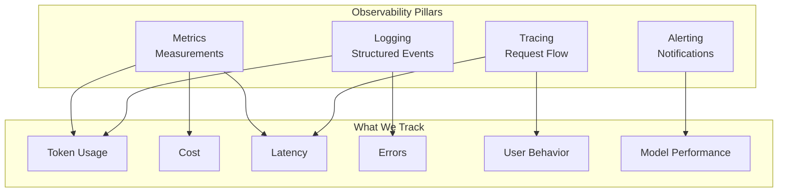

# Phase 6: AI Application Engineering

# Part 20: AI Observability

**Understanding what your AI system is doing—logging, tracing, cost monitoring, latency analysis, and performance evaluation.**

---

## The Target: What We're Building Right Now

In this part, we're building six powerful observability components:

1. **A Structured Logger** — Comprehensive logging for AI systems
2. **A Tracing System** — Request flow tracking
3. **A Token & Cost Monitor** — Real-time cost tracking
4. **A Latency Analyzer** — Performance measurement
5. **A Prompt Versioning System** — Track prompt changes
6. **A Complete Observability Stack** — Production-ready monitoring

**Why this matters:** AI systems are complex and opaque. Without observability, you're flying blind—unable to debug issues, optimize costs, or understand user behavior. Observability is essential for production AI.

---

## The Concept: AI Observability

### The Dashboard Analogy

Imagine you're flying a plane:

- **Logging** = The black box recording everything
- **Tracing** = The flight path showing where you've been
- **Metrics** = The instrument panel showing speed, altitude, fuel
- **Monitoring** = The warning lights and alerts
- **Dashboards** = The cockpit display showing everything at once

**Observability is your AI system's cockpit.**



### Observability vs. Monitoring

| Aspect | Monitoring | Observability |
|--------|------------|---------------|
| **What** | Known unknowns | Unknown unknowns |
| **How** | Pre-defined metrics | Explore and discover |
| **Scope** | System health | System understanding |
| **Output** | Dashboards, alerts | Insights, debugging |
| **Focus** | What's wrong | Why it's wrong |

### Key AI Metrics

| Metric | What It Measures | Why It Matters |
|--------|------------------|----------------|
| **Token Usage** | Tokens processed | Cost, context limits |
| **Cost** | Money spent | Budget, optimization |
| **Latency** | Response time | User experience |
| **Error Rate** | Failed requests | Reliability |
| **Success Rate** | Successful requests | Quality |
| **Prompt Version** | Which prompt used | A/B testing |
| **Model Used** | Which model | Cost/quality |

### Observability Tools Comparison

| Tool | Focus | Key Features | Best For |
|------|-------|--------------|----------|
| **LangSmith** | AI-specific | Tracing, evaluation | AI development |
| **OpenTelemetry** | General | Standardized telemetry | Multi-service |
| **Helicone** | AI APIs | Cost tracking | API usage |
| **Weights & Biases** | ML | Experiment tracking | Model training |
| **Phoenix** | LLM | Tracing, evaluation | LLM apps |

---

## The Implementation: Building Our Observability Tools

### Target File Structure

```
phase-6-engineering/
└── module-20-observability/
    ├── 01_structured_logger.py
    ├── 02_tracing_system.py
    ├── 03_token_cost_monitor.py
    ├── 04_latency_analyzer.py
    ├── 05_prompt_versioning.py
    ├── 06_complete_observability.py
    ├── requirements.txt
    └── README.md
```

### Step 1: Structured Logger

Create `01_structured_logger.py`:

```python
#!/usr/bin/env python3
"""
Module 20: Structured Logger

Comprehensive logging for AI systems with structured data.
"""

import os
import sys
from pathlib import Path
import json
import logging
from typing import Dict, Any, Optional
from datetime import datetime
import uuid

sys.path.insert(0, str(Path(__file__).parent.parent.parent.parent))

from shared.utils.config import load_config

setup_logging(debug=False)
config = load_config()

class StructuredLogger:
    """
    Structured logging for AI systems.
    
    Features:
    - JSON-formatted logs
    - Log levels
    - Context propagation
    - Timestamp tracking
    - Log rotation
    """
    
    def __init__(
        self,
        name: str = "ai_app",
        log_level: str = "INFO",
        log_file: Optional[str] = None,
        json_format: bool = True
    ):
        """
        Initialize the structured logger.
        
        Args:
            name: Logger name
            log_level: Log level (DEBUG, INFO, WARNING, ERROR, CRITICAL)
            log_file: Log file path
            json_format: Use JSON format
        """
        self.name = name
        self.json_format = json_format
        
        # Set up logger
        self.logger = logging.getLogger(name)
        self.logger.setLevel(getattr(logging, log_level.upper()))
        
        # Clear existing handlers
        self.logger.handlers.clear()
        
        # Console handler
        console_handler = logging.StreamHandler(sys.stdout)
        console_handler.setFormatter(self._get_formatter())
        self.logger.addHandler(console_handler)
        
        # File handler
        if log_file:
            file_handler = logging.FileHandler(log_file)
            file_handler.setFormatter(self._get_formatter())
            self.logger.addHandler(file_handler)
        
        # Context storage
        self.context = {}
        
        print(f"✅ Initialized structured logger: {name}")
    
    def _get_formatter(self):
        """Get the log formatter."""
        if self.json_format:
            return logging.Formatter('%(message)s')
        else:
            return logging.Formatter(
                '%(asctime)s - %(name)s - %(levelname)s - %(message)s'
            )
    
    def _format_log(self, level: str, message: str, **kwargs) -> str:
        """
        Format a log entry.
        
        Args:
            level: Log level
            message: Log message
            **kwargs: Additional fields
            
        Returns:
            Formatted log entry
        """
        log_entry = {
            "timestamp": datetime.now().isoformat(),
            "level": level,
            "logger": self.name,
            "message": message,
            **self.context,
            **kwargs
        }
        
        if self.json_format:
            return json.dumps(log_entry)
        else:
            return f"{log_entry['timestamp']} - {log_entry['logger']} - {level} - {message}"
    
    def set_context(self, **kwargs) -> None:
        """
        Set context for all subsequent logs.
        
        Args:
            **kwargs: Context key-value pairs
        """
        self.context.update(kwargs)
    
    def clear_context(self) -> None:
        """Clear the context."""
        self.context = {}
    
    def debug(self, message: str, **kwargs) -> None:
        """Log a debug message."""
        self.logger.debug(self._format_log("DEBUG", message, **kwargs))
    
    def info(self, message: str, **kwargs) -> None:
        """Log an info message."""
        self.logger.info(self._format_log("INFO", message, **kwargs))
    
    def warning(self, message: str, **kwargs) -> None:
        """Log a warning message."""
        self.logger.warning(self._format_log("WARNING", message, **kwargs))
    
    def error(self, message: str, **kwargs) -> None:
        """Log an error message."""
        self.logger.error(self._format_log("ERROR", message, **kwargs))
    
    def critical(self, message: str, **kwargs) -> None:
        """Log a critical message."""
        self.logger.critical(self._format_log("CRITICAL", message, **kwargs))
    
    def log_request(
        self,
        request_id: str,
        prompt: str,
        model: str,
        **kwargs
    ) -> None:
        """
        Log an AI request.
        
        Args:
            request_id: Request ID
            prompt: User prompt
            model: Model used
            **kwargs: Additional fields
        """
        self.info(
            "AI Request",
            event_type="request",
            request_id=request_id,
            prompt=prompt[:100] + "..." if len(prompt) > 100 else prompt,
            model=model,
            **kwargs
        )
    
    def log_response(
        self,
        request_id: str,
        response: str,
        tokens: Dict[str, int],
        latency_ms: float,
        **kwargs
    ) -> None:
        """
        Log an AI response.
        
        Args:
            request_id: Request ID
            response: AI response
            tokens: Token usage
            latency_ms: Latency in milliseconds
            **kwargs: Additional fields
        """
        self.info(
            "AI Response",
            event_type="response",
            request_id=request_id,
            response=response[:100] + "..." if len(response) > 100 else response,
            tokens=tokens,
            latency_ms=latency_ms,
            **kwargs
        )
    
    def log_error(
        self,
        request_id: str,
        error: str,
        **kwargs
    ) -> None:
        """
        Log an error.
        
        Args:
            request_id: Request ID
            error: Error message
            **kwargs: Additional fields
        """
        self.error(
            "AI Error",
            event_type="error",
            request_id=request_id,
            error=error,
            **kwargs
        )

def demonstrate_logger():
    """Demonstrate the structured logger."""
    print("\n" + "="*80)
    print("📝 STRUCTURED LOGGER DEMONSTRATION")
    print("="*80)
    
    # Create logger
    logger = StructuredLogger(
        name="ai_demo",
        log_level="INFO",
        json_format=True
    )
    
    # Set context
    logger.set_context(
        service="demo",
        environment="development",
        user_id="user_123"
    )
    
    # Log requests and responses
    request_id = str(uuid.uuid4())[:8]
    
    logger.log_request(
        request_id=request_id,
        prompt="What is artificial intelligence?",
        model="gpt-4o-mini",
        temperature=0.7
    )
    
    # Simulate processing
    logger.log_response(
        request_id=request_id,
        response="AI is the simulation of human intelligence in machines...",
        tokens={"prompt": 10, "completion": 20, "total": 30},
        latency_ms=1250.5,
        model="gpt-4o-mini"
    )
    
    # Log an error
    error_id = str(uuid.uuid4())[:8]
    logger.log_error(
        request_id=error_id,
        error="Rate limit exceeded",
        status_code=429,
        retry_after=60
    )
    
    # Clear context
    logger.clear_context()
    logger.info("Context cleared")

def main():
    """Run the structured logger demonstration."""
    print("\n" + "="*80)
    print("AI TUTORIAL SERIES - STRUCTURED LOGGER")
    print("="*80)
    
    demonstrate_logger()

if __name__ == "__main__":
    main()
```

### Step 2: Tracing System

Create `02_tracing_system.py`:

```python
#!/usr/bin/env python3
"""
Module 20: Tracing System

Request flow tracking for AI systems.
"""

import os
import sys
from pathlib import Path
import json
import time
import uuid
from typing import Dict, Any, Optional, List
from datetime import datetime
from collections import defaultdict

sys.path.insert(0, str(Path(__file__).parent.parent.parent.parent))

from shared.utils.config import load_config
from shared.utils.logging import setup_logging
from structured_logger import StructuredLogger

setup_logging(debug=False)
config = load_config()

class TraceSpan:
    """A span in a trace."""
    
    def __init__(
        self,
        name: str,
        trace_id: str,
        parent_id: Optional[str] = None,
        attributes: Optional[Dict[str, Any]] = None
    ):
        self.id = str(uuid.uuid4())[:8]
        self.trace_id = trace_id
        self.parent_id = parent_id
        self.name = name
        self.attributes = attributes or {}
        self.start_time = time.time()
        self.end_time = None
        self.duration_ms = None
        self.events = []
    
    def add_event(self, name: str, attributes: Optional[Dict[str, Any]] = None) -> None:
        """Add an event to the span."""
        self.events.append({
            "name": name,
            "attributes": attributes or {},
            "timestamp": time.time()
        })
    
    def end(self) -> None:
        """End the span."""
        self.end_time = time.time()
        self.duration_ms = (self.end_time - self.start_time) * 1000
    
    def to_dict(self) -> Dict[str, Any]:
        """Convert span to dictionary."""
        return {
            "id": self.id,
            "trace_id": self.trace_id,
            "parent_id": self.parent_id,
            "name": self.name,
            "attributes": self.attributes,
            "start_time": datetime.fromtimestamp(self.start_time).isoformat(),
            "end_time": datetime.fromtimestamp(self.end_time).isoformat() if self.end_time else None,
            "duration_ms": self.duration_ms,
            "events": self.events
        }

class Tracer:
    """
    Distributed tracing for AI applications.
    
    Features:
    - Trace spans
    - Parent-child relationships
    - Attribute tracking
    - Event logging
    - Performance measurement
    """
    
    def __init__(self, logger: Optional[StructuredLogger] = None):
        """
        Initialize the tracer.
        
        Args:
            logger: Structured logger (creates one if not provided)
        """
        self.logger = logger or StructuredLogger("tracer")
        self.spans = []
        self.current_spans = {}
        self.traces = defaultdict(list)
        
        print("✅ Initialized tracer")
    
    def start_span(
        self,
        name: str,
        trace_id: Optional[str] = None,
        parent_id: Optional[str] = None,
        attributes: Optional[Dict[str, Any]] = None
    ) -> TraceSpan:
        """
        Start a new span.
        
        Args:
            name: Span name
            trace_id: Trace ID (auto-generated if None)
            parent_id: Parent span ID
            attributes: Span attributes
            
        Returns:
            TraceSpan object
        """
        if trace_id is None:
            trace_id = str(uuid.uuid4())[:8]
        
        span = TraceSpan(name, trace_id, parent_id, attributes)
        self.current_spans[span.id] = span
        self.traces[trace_id].append(span)
        
        self.logger.debug(
            f"Started span: {name}",
            span_id=span.id,
            trace_id=trace_id,
            parent_id=parent_id
        )
        
        return span
    
    def end_span(self, span: TraceSpan) -> None:
        """
        End a span.
        
        Args:
            span: Span to end
        """
        span.end()
        self.spans.append(span)
        if span.id in self.current_spans:
            del self.current_spans[span.id]
        
        self.logger.debug(
            f"Ended span: {span.name}",
            span_id=span.id,
            duration_ms=span.duration_ms
        )
    
    def trace(self, name: str, attributes: Optional[Dict[str, Any]] = None):
        """
        Context manager for tracing.
        
        Args:
            name: Operation name
            attributes: Operation attributes
            
        Yields:
            Span object
        """
        trace_id = str(uuid.uuid4())[:8]
        span = self.start_span(name, trace_id, attributes=attributes)
        
        try:
            yield span
        finally:
            self.end_span(span)
    
    def get_trace(self, trace_id: str) -> List[Dict[str, Any]]:
        """
        Get a trace by ID.
        
        Args:
            trace_id: Trace ID
            
        Returns:
            List of spans in the trace
        """
        return [span.to_dict() for span in self.traces.get(trace_id, [])]
    
    def get_all_traces(self) -> Dict[str, List[Dict[str, Any]]]:
        """
        Get all traces.
        
        Returns:
            Dictionary of traces
        """
        return {
            trace_id: [span.to_dict() for span in spans]
            for trace_id, spans in self.traces.items()
        }
    
    def get_stats(self) -> Dict[str, Any]:
        """
        Get tracing statistics.
        
        Returns:
            Statistics dictionary
        """
        spans = self.spans
        if not spans:
            return {"total_spans": 0}
        
        durations = [s.duration_ms for s in spans if s.duration_ms is not None]
        
        return {
            "total_spans": len(spans),
            "total_traces": len(self.traces),
            "avg_duration_ms": sum(durations) / len(durations) if durations else 0,
            "max_duration_ms": max(durations) if durations else 0,
            "min_duration_ms": min(durations) if durations else 0
        }

def demonstrate_tracer():
    """Demonstrate the tracer."""
    print("\n" + "="*80)
    print("🔍 TRACING SYSTEM DEMONSTRATION")
    print("="*80)
    
    # Create tracer
    tracer = Tracer()
    
    # Simulate a request trace
    trace_id = str(uuid.uuid4())[:8]
    
    # Root span
    root_span = tracer.start_span(
        name="ai_request",
        trace_id=trace_id,
        attributes={"endpoint": "/chat", "user": "user_123"}
    )
    
    # Simulate internal operations
    # Step 1: Tokenization
    token_span = tracer.start_span(
        name="tokenize",
        trace_id=trace_id,
        parent_id=root_span.id,
        attributes={"text_length": 150}
    )
    time.sleep(0.05)
    token_span.add_event("tokens", {"count": 45})
    tracer.end_span(token_span)
    
    # Step 2: Model inference
    model_span = tracer.start_span(
        name="model_inference",
        trace_id=trace_id,
        parent_id=root_span.id,
        attributes={"model": "gpt-4o-mini", "temperature": 0.7}
    )
    time.sleep(0.1)
    model_span.add_event("response", {"length": 200})
    tracer.end_span(model_span)
    
    # End root span
    root_span.add_event("complete", {"success": True})
    tracer.end_span(root_span)
    
    # Get trace
    print("\n📊 Trace:")
    trace = tracer.get_trace(trace_id)
    for span in trace:
        print(f"   {span['name']}: {span['duration_ms']:.2f}ms")
        if span['parent_id']:
            print(f"      Parent: {span['parent_id']}")
    
    # Stats
    print("\n📊 Tracing Stats:")
    print(json.dumps(tracer.get_stats(), indent=2))

def main():
    """Run the tracer demonstration."""
    print("\n" + "="*80)
    print("AI TUTORIAL SERIES - TRACING SYSTEM")
    print("="*80)
    
    demonstrate_tracer()

if __name__ == "__main__":
    main()
```

### Step 3: Token & Cost Monitor

Create `03_token_cost_monitor.py`:

```python
#!/usr/bin/env python3
"""
Module 20: Token & Cost Monitor

Real-time cost and token tracking for AI applications.
"""

import os
import sys
from pathlib import Path
import json
from typing import Dict, Any, List, Optional
from datetime import datetime, timedelta
from collections import defaultdict

sys.path.insert(0, str(Path(__file__).parent.parent.parent.parent))

from shared.utils.config import load_config
from shared.utils.logging import setup_logging

setup_logging(debug=False)
config = load_config()

class TokenCostMonitor:
    """
    Monitor token usage and costs for AI applications.
    
    Features:
    - Token counting
    - Cost calculation
    - Time-series tracking
    - Budget alerts
    - Usage forecasting
    """
    
    def __init__(self):
        """Initialize the token and cost monitor."""
        self.records = []
        self.total_tokens = 0
        self.total_cost = 0.0
        self.daily_usage = defaultdict(lambda: {"tokens": 0, "cost": 0})
        self.model_usage = defaultdict(lambda: {"tokens": 0, "cost": 0})
        
        # Pricing (USD per 1M tokens)
        self.pricing = {
            "gpt-4o-mini": {"input": 0.150, "output": 0.600},
            "gpt-4o": {"input": 5.00, "output": 15.00},
            "gpt-3.5-turbo": {"input": 0.50, "output": 1.50},
            "text-embedding-3-small": {"input": 0.02, "output": 0.02}
        }
        
        # Budget settings
        self.budget = {
            "daily_limit": 1.0,
            "monthly_limit": 10.0,
            "warning_threshold": 0.8
        }
        
        print("✅ Initialized token & cost monitor")
    
    def record_usage(
        self,
        model: str,
        prompt_tokens: int,
        completion_tokens: int,
        operation: str = "chat"
    ) -> Dict[str, Any]:
        """
        Record token usage.
        
        Args:
            model: Model used
            prompt_tokens: Number of prompt tokens
            completion_tokens: Number of completion tokens
            operation: Operation type
            
        Returns:
            Cost and token information
        """
        pricing = self.pricing.get(model, {"input": 0, "output": 0})
        
        input_cost = (prompt_tokens / 1_000_000) * pricing["input"]
        output_cost = (completion_tokens / 1_000_000) * pricing["output"]
        total_cost = input_cost + output_cost
        total_tokens = prompt_tokens + completion_tokens
        
        record = {
            "timestamp": datetime.now().isoformat(),
            "model": model,
            "operation": operation,
            "prompt_tokens": prompt_tokens,
            "completion_tokens": completion_tokens,
            "total_tokens": total_tokens,
            "input_cost": input_cost,
            "output_cost": output_cost,
            "total_cost": total_cost
        }
        
        self.records.append(record)
        self.total_tokens += total_tokens
        self.total_cost += total_cost
        
        # Update daily usage
        day = datetime.now().strftime("%Y-%m-%d")
        self.daily_usage[day]["tokens"] += total_tokens
        self.daily_usage[day]["cost"] += total_cost
        
        # Update model usage
        self.model_usage[model]["tokens"] += total_tokens
        self.model_usage[model]["cost"] += total_cost
        
        return record
    
    def get_usage_summary(
        self,
        days: Optional[int] = None
    ) -> Dict[str, Any]:
        """
        Get usage summary.
        
        Args:
            days: Number of days to include
            
        Returns:
            Usage summary
        """
        records = self.records
        if days:
            cutoff = datetime.now() - timedelta(days=days)
            cutoff_str = cutoff.isoformat()
            records = [r for r in records if r["timestamp"] >= cutoff_str]
        
        if not records:
            return {
                "total_tokens": 0,
                "total_cost": 0,
                "request_count": 0,
                "records": []
            }
        
        return {
            "total_tokens": sum(r["total_tokens"] for r in records),
            "total_cost": sum(r["total_cost"] for r in records),
            "request_count": len(records),
            "records": records[-10:]  # Last 10 records
        }
    
    def get_budget_status(self) -> Dict[str, Any]:
        """
        Get budget status.
        
        Returns:
            Budget status
        """
        today = datetime.now().strftime("%Y-%m-%d")
        daily_cost = self.daily_usage[today]["cost"]
        month = datetime.now().strftime("%Y-%m")
        
        # Monthly cost
        monthly_cost = sum(
            usage["cost"]
            for day, usage in self.daily_usage.items()
            if day.startswith(month)
        )
        
        daily_percent = (daily_cost / self.budget["daily_limit"]) * 100 if self.budget["daily_limit"] > 0 else 0
        monthly_percent = (monthly_cost / self.budget["monthly_limit"]) * 100 if self.budget["monthly_limit"] > 0 else 0
        
        return {
            "daily": {
                "used": daily_cost,
                "limit": self.budget["daily_limit"],
                "percentage": daily_percent,
                "status": "warning" if daily_percent > self.budget["warning_threshold"] * 100 else "ok"
            },
            "monthly": {
                "used": monthly_cost,
                "limit": self.budget["monthly_limit"],
                "percentage": monthly_percent,
                "status": "warning" if monthly_percent > self.budget["warning_threshold"] * 100 else "ok"
            },
            "overall": {
                "total_cost": self.total_cost,
                "total_tokens": self.total_tokens,
                "request_count": len(self.records)
            }
        }
    
    def get_forecast(self, days_ahead: int = 30) -> Dict[str, Any]:
        """
        Get usage forecast.
        
        Args:
            days_ahead: Number of days to forecast
            
        Returns:
            Usage forecast
        """
        # Simple linear forecast based on average daily usage
        days = len(self.daily_usage)
        if days == 0:
            return {"forecast": "Insufficient data"}
        
        avg_daily_cost = self.total_cost / days
        avg_daily_tokens = self.total_tokens / days
        
        return {
            "forecast_days": days_ahead,
            "projected_cost": avg_daily_cost * days_ahead,
            "projected_tokens": avg_daily_tokens * days_ahead,
            "based_on_days": days,
            "avg_daily_cost": avg_daily_cost,
            "avg_daily_tokens": avg_daily_tokens
        }
    
    def get_model_breakdown(self) -> Dict[str, Any]:
        """
        Get usage breakdown by model.
        
        Returns:
            Model usage breakdown
        """
        return {
            model: {
                "tokens": usage["tokens"],
                "cost": usage["cost"],
                "percentage": (usage["cost"] / self.total_cost) * 100 if self.total_cost > 0 else 0
            }
            for model, usage in self.model_usage.items()
        }

def demonstrate_monitor():
    """Demonstrate the token and cost monitor."""
    print("\n" + "="*80)
    print("💰 TOKEN & COST MONITOR DEMONSTRATION")
    print("="*80)
    
    monitor = TokenCostMonitor()
    
    # Simulate usage
    print("\n📋 Recording usage...")
    
    usage_data = [
        {"model": "gpt-4o-mini", "prompt": 100, "completion": 50},
        {"model": "gpt-4o", "prompt": 200, "completion": 80},
        {"model": "gpt-4o-mini", "prompt": 150, "completion": 60},
        {"model": "text-embedding-3-small", "prompt": 500, "completion": 0},
        {"model": "gpt-4o-mini", "prompt": 300, "completion": 120}
    ]
    
    for usage in usage_data:
        record = monitor.record_usage(
            model=usage["model"],
            prompt_tokens=usage["prompt"],
            completion_tokens=usage["completion"]
        )
        print(f"   {usage['model']}: {usage['prompt']}+{usage['completion']} tokens = ${record['total_cost']:.4f}")
    
    # Summary
    print("\n📊 Usage Summary:")
    summary = monitor.get_usage_summary()
    print(json.dumps(summary, indent=2))
    
    # Budget status
    print("\n💰 Budget Status:")
    print(json.dumps(monitor.get_budget_status(), indent=2))
    
    # Model breakdown
    print("\n📊 Model Breakdown:")
    print(json.dumps(monitor.get_model_breakdown(), indent=2))
    
    # Forecast
    print("\n📈 Forecast:")
    print(json.dumps(monitor.get_forecast(7), indent=2))

def main():
    """Run the token and cost monitor demonstration."""
    print("\n" + "="*80)
    print("AI TUTORIAL SERIES - TOKEN & COST MONITOR")
    print("="*80)
    
    demonstrate_monitor()

if __name__ == "__main__":
    main()
```

### Step 4: Latency Analyzer

Create `04_latency_analyzer.py`:

```python
#!/usr/bin/env python3
"""
Module 20: Latency Analyzer

Performance measurement for AI applications.
"""

import os
import sys
from pathlib import Path
import json
import time
from typing import Dict, Any, List, Optional
from datetime import datetime
from collections import deque
import statistics

sys.path.insert(0, str(Path(__file__).parent.parent.parent.parent))

from shared.utils.config import load_config
from shared.utils.logging import setup_logging

setup_logging(debug=False)
config = load_config()

class LatencyAnalyzer:
    """
    Analyze latency and performance of AI systems.
    
    Features:
    - Request timing
    - Percentile calculations
    - Performance trends
    - SLA monitoring
    - Anomaly detection
    """
    
    def __init__(self, window_size: int = 1000):
        """
        Initialize the latency analyzer.
        
        Args:
            window_size: Number of records to keep
        """
        self.window_size = window_size
        self.records = deque(maxlen=window_size)
        self.summary_stats = {}
        self.sla = {
            "p50": 1000,   # 50% under 1s
            "p90": 3000,   # 90% under 3s
            "p95": 5000,   # 95% under 5s
            "p99": 10000   # 99% under 10s
        }
        
        print(f"✅ Initialized latency analyzer (window: {window_size})")
    
    def record(
        self,
        operation: str,
        duration_ms: float,
        metadata: Optional[Dict[str, Any]] = None
    ) -> None:
        """
        Record a latency measurement.
        
        Args:
            operation: Operation name
            duration_ms: Duration in milliseconds
            metadata: Additional metadata
        """
        record = {
            "timestamp": datetime.now().isoformat(),
            "operation": operation,
            "duration_ms": duration_ms,
            "metadata": metadata or {}
        }
        
        self.records.append(record)
        
        # Update summary stats
        durations = [r["duration_ms"] for r in self.records if r["operation"] == operation]
        if durations:
            self.summary_stats[operation] = {
                "count": len(durations),
                "min": min(durations),
                "max": max(durations),
                "mean": statistics.mean(durations),
                "median": statistics.median(durations),
                "p50": self._percentile(durations, 50),
                "p90": self._percentile(durations, 90),
                "p95": self._percentile(durations, 95),
                "p99": self._percentile(durations, 99)
            }
    
    def _percentile(self, data: List[float], percentile: float) -> float:
        """
        Calculate a percentile.
        
        Args:
            data: List of values
            percentile: Percentile (0-100)
            
        Returns:
            Percentile value
        """
        if not data:
            return 0
        
        sorted_data = sorted(data)
        index = (len(sorted_data) - 1) * (percentile / 100)
        
        if index.is_integer():
            return sorted_data[int(index)]
        else:
            lower = sorted_data[int(index)]
            upper = sorted_data[int(index) + 1]
            return lower + (upper - lower) * (index - int(index))
    
    def get_operation_stats(self, operation: str) -> Dict[str, Any]:
        """
        Get statistics for an operation.
        
        Args:
            operation: Operation name
            
        Returns:
            Operation statistics
        """
        return self.summary_stats.get(operation, {})
    
    def get_all_stats(self) -> Dict[str, Any]:
        """
        Get statistics for all operations.
        
        Returns:
            All statistics
        """
        return self.summary_stats
    
    def check_sla(self, operation: str) -> Dict[str, Any]:
        """
        Check SLA compliance for an operation.
        
        Args:
            operation: Operation name
            
        Returns:
            SLA check results
        """
        stats = self.summary_stats.get(operation, {})
        results = {}
        
        for percentile, threshold in self.sla.items():
            pct_key = f"p{percentile.replace('p', '')}"
            value = stats.get(pct_key, 0)
            compliant = value <= threshold
            results[percentile] = {
                "threshold_ms": threshold,
                "actual_ms": value,
                "compliant": compliant
            }
        
        # Overall compliance
        compliant = all(r["compliant"] for r in results.values())
        
        return {
            "operation": operation,
            "results": results,
            "compliant": compliant
        }
    
    def detect_anomalies(
        self,
        operation: str,
        threshold: float = 3.0
    ) -> List[Dict[str, Any]]:
        """
        Detect anomalies in latency.
        
        Args:
            operation: Operation name
            threshold: Standard deviation threshold
            
        Returns:
            Anomaly records
        """
        records = [r for r in self.records if r["operation"] == operation]
        if len(records) < 10:
            return []
        
        durations = [r["duration_ms"] for r in records]
        mean = statistics.mean(durations)
        std = statistics.stdev(durations) if len(durations) > 1 else 0
        
        anomalies = []
        for record in records:
            z_score = (record["duration_ms"] - mean) / std if std > 0 else 0
            if abs(z_score) > threshold:
                anomalies.append({
                    **record,
                    "z_score": z_score,
                    "mean": mean,
                    "std": std
                })
        
        return anomalies
    
    def get_trend(
        self,
        operation: str,
        window: int = 50
    ) -> Dict[str, Any]:
        """
        Get latency trend for an operation.
        
        Args:
            operation: Operation name
            window: Window size for trend
            
        Returns:
            Trend data
        """
        records = [r for r in self.records if r["operation"] == operation]
        if len(records) < window:
            return {"trend": "Insufficient data"}
        
        recent = records[-window:]
        durations = [r["duration_ms"] for r in recent]
        
        # Calculate trend (simple linear regression)
        x = list(range(len(durations)))
        y = durations
        
        n = len(x)
        sum_x = sum(x)
        sum_y = sum(y)
        sum_xy = sum(x[i] * y[i] for i in range(n))
        sum_xx = sum(x[i] * x[i] for i in range(n))
        
        slope = (n * sum_xy - sum_x * sum_y) / (n * sum_xx - sum_x * sum_x) if n > 1 else 0
        
        trend = "increasing" if slope > 0.5 else "decreasing" if slope < -0.5 else "stable"
        
        return {
            "slope": slope,
            "trend": trend,
            "window": window,
            "mean": statistics.mean(durations),
            "recent": durations[-10:]
        }

def demonstrate_latency_analyzer():
    """Demonstrate the latency analyzer."""
    print("\n" + "="*80)
    print("⏱️ LATENCY ANALYZER DEMONSTRATION")
    print("="*80)
    
    analyzer = LatencyAnalyzer(window_size=100)
    
    # Simulate latency measurements
    print("\n📋 Recording latency measurements...")
    
    import random
    
    operations = ["api_call", "model_inference", "tokenization", "embedding"]
    
    for i in range(50):
        op = random.choice(operations)
        duration = random.gauss(200, 50)  # Normal distribution
        
        if op == "api_call":
            duration = random.gauss(500, 150)
        elif op == "model_inference":
            duration = random.gauss(1000, 300)
        
        # Add some anomalies
        if i % 20 == 0:
            duration *= 5
        
        analyzer.record(
            operation=op,
            duration_ms=duration,
            metadata={"request_id": f"req_{i}"}
        )
    
    # Show stats
    print("\n📊 Statistics:")
    all_stats = analyzer.get_all_stats()
    for op, stats in all_stats.items():
        print(f"\n   {op}:")
        print(f"      Mean: {stats['mean']:.2f}ms")
        print(f"      P95: {stats['p95']:.2f}ms")
        print(f"      P99: {stats['p99']:.2f}ms")
    
    # Check SLA for model_inference
    print("\n📋 SLA Check for 'model_inference':")
    sla = analyzer.check_sla("model_inference")
    print(json.dumps(sla, indent=2))
    
    # Detect anomalies
    print("\n🚨 Anomalies in 'api_call':")
    anomalies = analyzer.detect_anomalies("api_call")
    for anomaly in anomalies[:3]:
        print(f"   Duration: {anomaly['duration_ms']:.2f}ms (Z-score: {anomaly['z_score']:.2f})")
    
    # Trend analysis
    print("\n📈 Trend for 'model_inference':")
    trend = analyzer.get_trend("model_inference")
    print(f"   Trend: {trend['trend']}")
    print(f"   Slope: {trend['slope']:.2f}")

def main():
    """Run the latency analyzer demonstration."""
    print("\n" + "="*80)
    print("AI TUTORIAL SERIES - LATENCY ANALYZER")
    print("="*80)
    
    demonstrate_latency_analyzer()

if __name__ == "__main__":
    main()
```

### Step 5: Prompt Versioning

Create `05_prompt_versioning.py`:

```python
#!/usr/bin/env python3
"""
Module 20: Prompt Versioning

Track and manage prompt versions for AI applications.
"""

import os
import sys
from pathlib import Path
import json
import hashlib
from typing import Dict, Any, List, Optional
from datetime import datetime
import uuid

sys.path.insert(0, str(Path(__file__).parent.parent.parent.parent))

from shared.utils.config import load_config
from shared.utils.logging import setup_logging

setup_logging(debug=False)
config = load_config()

class PromptVersioning:
    """
    Track and manage prompt versions.
    
    Features:
    - Version creation
    - Version comparison
    - A/B testing support
    - Rollback
    - Performance tracking
    """
    
    def __init__(self, storage_path: str = "./prompts"):
        """
        Initialize prompt versioning.
        
        Args:
            storage_path: Path for storing prompts
        """
        self.storage_path = Path(storage_path)
        self.storage_path.mkdir(exist_ok=True)
        self.prompts = {}
        self.versions = {}
        self.performance = {}
        
        self._load()
        
        print(f"✅ Initialized prompt versioning")
        print(f"   Storage: {storage_path}")
    
    def _load(self) -> None:
        """Load prompts from storage."""
        version_file = self.storage_path / "versions.json"
        if version_file.exists():
            try:
                with open(version_file, 'r') as f:
                    data = json.load(f)
                    self.prompts = data.get("prompts", {})
                    self.versions = data.get("versions", {})
                    self.performance = data.get("performance", {})
                print(f"📂 Loaded {len(self.prompts)} prompts")
            except:
                pass
    
    def _save(self) -> None:
        """Save prompts to storage."""
        data = {
            "prompts": self.prompts,
            "versions": self.versions,
            "performance": self.performance,
            "updated_at": datetime.now().isoformat()
        }
        
        with open(self.storage_path / "versions.json", 'w') as f:
            json.dump(data, f, indent=2)
    
    def create_prompt(
        self,
        name: str,
        template: str,
        variables: List[str] = None,
        metadata: Dict[str, Any] = None
    ) -> str:
        """
        Create a new prompt version.
        
        Args:
            name: Prompt name
            template: Prompt template
            variables: Variable names
            metadata: Additional metadata
            
        Returns:
            Version ID
        """
        # Generate version ID
        version_id = str(uuid.uuid4())[:8]
        timestamp = datetime.now().isoformat()
        
        # Calculate hash
        content_hash = hashlib.md5(template.encode()).hexdigest()[:8]
        
        # Create version
        version = {
            "id": version_id,
            "name": name,
            "template": template,
            "variables": variables or [],
            "metadata": metadata or {},
            "hash": content_hash,
            "created_at": timestamp,
            "version": len(self.prompts.get(name, {}).get("versions", [])) + 1
        }
        
        # Store
        if name not in self.prompts:
            self.prompts[name] = {
                "name": name,
                "versions": [],
                "current_version": None
            }
        
        self.prompts[name]["versions"].append(version_id)
        self.versions[version_id] = version
        self.prompts[name]["current_version"] = version_id
        
        self._save()
        
        print(f"📝 Created prompt: {name} (v{version['version']})")
        
        return version_id
    
    def get_prompt(self, prompt_id: str) -> Optional[Dict[str, Any]]:
        """
        Get a prompt by ID.
        
        Args:
            prompt_id: Prompt ID
            
        Returns:
            Prompt data or None
        """
        return self.versions.get(prompt_id)
    
    def get_current_prompt(self, name: str) -> Optional[Dict[str, Any]]:
        """
        Get the current version of a prompt.
        
        Args:
            name: Prompt name
            
        Returns:
            Prompt data or None
        """
        if name not in self.prompts:
            return None
        
        current_id = self.prompts[name]["current_version"]
        return self.versions.get(current_id)
    
    def get_all_versions(self, name: str) -> List[Dict[str, Any]]:
        """
        Get all versions of a prompt.
        
        Args:
            name: Prompt name
            
        Returns:
            List of prompt versions
        """
        if name not in self.prompts:
            return []
        
        return [
            self.versions[v_id]
            for v_id in self.prompts[name]["versions"]
            if v_id in self.versions
        ]
    
    def set_current_version(self, name: str, version_id: str) -> bool:
        """
        Set the current version of a prompt.
        
        Args:
            name: Prompt name
            version_id: Version ID
            
        Returns:
            True if successful
        """
        if name not in self.prompts:
            return False
        
        if version_id not in self.versions:
            return False
        
        self.prompts[name]["current_version"] = version_id
        self._save()
        
        print(f"🔄 Set current version for '{name}': {version_id}")
        
        return True
    
    def record_performance(
        self,
        prompt_id: str,
        metrics: Dict[str, Any]
    ) -> None:
        """
        Record performance for a prompt version.
        
        Args:
            prompt_id: Prompt ID
            metrics: Performance metrics
        """
        if prompt_id not in self.performance:
            self.performance[prompt_id] = []
        
        self.performance[prompt_id].append({
            **metrics,
            "timestamp": datetime.now().isoformat()
        })
        
        self._save()
    
    def get_performance(
        self,
        prompt_id: str,
        top_k: int = 10
    ) -> List[Dict[str, Any]]:
        """
        Get performance data for a prompt.
        
        Args:
            prompt_id: Prompt ID
            top_k: Number of recent records
            
        Returns:
            Performance records
        """
        records = self.performance.get(prompt_id, [])
        return records[-top_k:]
    
    def compare_versions(
        self,
        name: str,
        version_ids: List[str]
    ) -> Dict[str, Any]:
        """
        Compare different versions of a prompt.
        
        Args:
            name: Prompt name
            version_ids: List of version IDs to compare
            
        Returns:
            Comparison results
        """
        if name not in self.prompts:
            return {"error": "Prompt not found"}
        
        comparisons = {}
        for v_id in version_ids:
            if v_id not in self.versions:
                continue
            
            prompt = self.versions[v_id]
            perf = self.get_performance(v_id)
            
            if perf:
                avg_score = sum(p.get("score", 0) for p in perf) / len(perf)
                avg_tokens = sum(p.get("tokens", 0) for p in perf) / len(perf)
            else:
                avg_score = 0
                avg_tokens = 0
            
            comparisons[v_id] = {
                "version": prompt["version"],
                "created_at": prompt["created_at"],
                "hash": prompt["hash"],
                "variable_count": len(prompt["variables"]),
                "usage_count": len(perf),
                "avg_score": avg_score,
                "avg_tokens": avg_tokens
            }
        
        return comparisons

def demonstrate_prompt_versioning():
    """Demonstrate prompt versioning."""
    print("\n" + "="*80)
    print("📝 PROMPT VERSIONING DEMONSTRATION")
    print("="*80)
    
    pv = PromptVersioning()
    
    # Create prompts
    print("\n📋 Creating prompts...")
    
    prompt1 = pv.create_prompt(
        name="qa_template",
        template="Answer the question: {{question}}\n\nContext: {{context}}",
        variables=["question", "context"],
        metadata={"task": "qa", "style": "concise"}
    )
    
    prompt2 = pv.create_prompt(
        name="qa_template",
        template="Please provide a comprehensive answer to: {{question}}\n\nBased on: {{context}}\n\nBe detailed and thorough.",
        variables=["question", "context"],
        metadata={"task": "qa", "style": "detailed"}
    )
    
    prompt3 = pv.create_prompt(
        name="summarization",
        template="Summarize the following text in {{length}} sentences:\n\n{{text}}",
        variables=["text", "length"],
        metadata={"task": "summarization", "style": "concise"}
    )
    
    # Get current versions
    print("\n📋 Current versions:")
    current = pv.get_current_prompt("qa_template")
    if current:
        print(f"   QA Template: v{current['version']}")
        print(f"   Template: {current['template'][:50]}...")
    
    # Compare versions
    print("\n📋 Comparing versions:")
    versions = pv.get_all_versions("qa_template")
    version_ids = [v["id"] for v in versions]
    
    comparison = pv.compare_versions("qa_template", version_ids)
    for v_id, data in comparison.items():
        print(f"   v{data['version']}: {data['created_at'][:10]}")
        print(f"      Variables: {data['variable_count']}")
        print(f"      Hash: {data['hash']}")
    
    # List all prompts
    print("\n📋 All prompts:")
    for name, data in pv.prompts.items():
        print(f"   {name}: {len(data['versions'])} versions")
        current = pv.get_current_prompt(name)
        if current:
            print(f"      Current: v{current['version']}")

def main():
    """Run the prompt versioning demonstration."""
    print("\n" + "="*80)
    print("AI TUTORIAL SERIES - PROMPT VERSIONING")
    print("="*80)
    
    demonstrate_prompt_versioning()

if __name__ == "__main__":
    main()
```

### Step 6: Complete Observability Stack

Create `06_complete_observability.py`:

```python
#!/usr/bin/env python3
"""
Module 20: Complete Observability Stack

Production-ready observability for AI applications.
"""

import os
import sys
from pathlib import Path
import json
import time
from typing import Dict, Any, Optional, List
from datetime import datetime
import uuid

sys.path.insert(0, str(Path(__file__).parent.parent.parent.parent))

from shared.utils.config import load_config
from shared.utils.logging import setup_logging
from structured_logger import StructuredLogger
from tracing_system import Tracer
from token_cost_monitor import TokenCostMonitor
from latency_analyzer import LatencyAnalyzer
from prompt_versioning import PromptVersioning

setup_logging(debug=False)
config = load_config()

class ObservabilityStack:
    """
    Complete observability for AI applications.
    
    Features:
    - Structured logging
    - Distributed tracing
    - Token and cost monitoring
    - Latency analysis
    - Prompt versioning
    - Comprehensive dashboards
    """
    
    def __init__(
        self,
        service_name: str = "ai_service",
        log_level: str = "INFO",
        storage_path: str = "./observability"
    ):
        """
        Initialize the observability stack.
        
        Args:
            service_name: Service name
            log_level: Log level
            storage_path: Storage path
        """
        self.service_name = service_name
        self.storage_path = Path(storage_path)
        self.storage_path.mkdir(exist_ok=True)
        
        # Initialize components
        self.logger = StructuredLogger(
            name=service_name,
            log_level=log_level,
            log_file=str(self.storage_path / "service.log")
        )
        
        self.tracer = Tracer(self.logger)
        self.cost_monitor = TokenCostMonitor()
        self.latency_analyzer = LatencyAnalyzer()
        self.prompt_versioning = PromptVersioning(
            storage_path=str(self.storage_path / "prompts")
        )
        
        # Set global context
        self.logger.set_context(
            service=service_name,
            environment=config.get("environment", "development")
        )
        
        self.stats = {
            "requests": 0,
            "errors": 0,
            "started_at": datetime.now().isoformat()
        }
        
        print(f"✅ Initialized observability stack: {service_name}")
    
    def trace_operation(self, name: str, attributes: Optional[Dict[str, Any]] = None):
        """
        Context manager for traced operations.
        
        Args:
            name: Operation name
            attributes: Operation attributes
        """
        trace_id = str(uuid.uuid4())[:8]
        span = self.tracer.start_span(name, trace_id, attributes=attributes)
        
        try:
            yield span
        finally:
            self.tracer.end_span(span)
    
    def log_request(
        self,
        prompt: str,
        model: str,
        metadata: Optional[Dict[str, Any]] = None
    ) -> Dict[str, Any]:
        """
        Log an AI request.
        
        Args:
            prompt: User prompt
            model: Model used
            metadata: Additional metadata
            
        Returns:
            Request information
        """
        request_id = str(uuid.uuid4())[:8]
        
        self.stats["requests"] += 1
        
        self.logger.log_request(
            request_id=request_id,
            prompt=prompt,
            model=model,
            **metadata or {}
        )
        
        return {
            "request_id": request_id,
            "prompt": prompt,
            "model": model
        }
    
    def log_response(
        self,
        request_id: str,
        response: str,
        tokens: Dict[str, int],
        latency_ms: float,
        model: str,
        prompt_id: Optional[str] = None
    ) -> None:
        """
        Log an AI response.
        
        Args:
            request_id: Request ID
            response: AI response
            tokens: Token usage
            latency_ms: Latency in milliseconds
            model: Model used
            prompt_id: Prompt ID (for versioning)
        """
        self.logger.log_response(
            request_id=request_id,
            response=response,
            tokens=tokens,
            latency_ms=latency_ms,
            model=model
        )
        
        # Record cost
        self.cost_monitor.record_usage(
            model=model,
            prompt_tokens=tokens.get("prompt", 0),
            completion_tokens=tokens.get("completion", 0)
        )
        
        # Record latency
        self.latency_analyzer.record(
            operation="model_inference",
            duration_ms=latency_ms,
            metadata={"model": model, "request_id": request_id}
        )
        
        # Record prompt performance
        if prompt_id:
            self.prompt_versioning.record_performance(
                prompt_id=prompt_id,
                metrics={
                    "score": len(response) / 100,  # Simple scoring
                    "tokens": tokens.get("total", 0),
                    "latency_ms": latency_ms
                }
            )
    
    def log_error(
        self,
        request_id: str,
        error: str,
        status_code: Optional[int] = None
    ) -> None:
        """
        Log an error.
        
        Args:
            request_id: Request ID
            error: Error message
            status_code: HTTP status code
        """
        self.stats["errors"] += 1
        
        self.logger.log_error(
            request_id=request_id,
            error=error,
            status_code=status_code
        )
    
    def get_status(self) -> Dict[str, Any]:
        """
        Get system status.
        
        Returns:
            System status
        """
        return {
            "service": self.service_name,
            "stats": self.stats,
            "tracing": self.tracer.get_stats(),
            "cost": self.cost_monitor.get_usage_summary(),
            "latency": {
                op: self.latency_analyzer.get_operation_stats(op)
                for op in self.latency_analyzer.get_all_stats().keys()
            },
            "prompts": {
                name: {
                    "versions": len(data["versions"]),
                    "current": data["current_version"]
                }
                for name, data in self.prompt_versioning.prompts.items()
            }
        }
    
    def generate_report(self) -> str:
        """
        Generate a report.
        
        Returns:
            Report string
        """
        status = self.get_status()
        
        report = f"""
========================================
   AI SERVICE OBSERVABILITY REPORT
========================================

Service: {status['service']}
Started: {self.stats['started_at']}

=== REQUEST STATISTICS ===
Total Requests: {self.stats['requests']}
Errors: {self.stats['errors']}
Error Rate: {(self.stats['errors'] / self.stats['requests'] * 100) if self.stats['requests'] > 0 else 0:.2f}%

=== COST & TOKENS ===
Total Tokens: {status['cost']['total_tokens']:,}
Total Cost: ${status['cost']['total_cost']:.4f}
Requests: {status['cost']['request_count']}

=== LATENCY ===
"""
        
        for op, stats in status["latency"].items():
            if stats:
                report += f"\n{op}:\n"
                report += f"  Mean: {stats.get('mean', 0):.2f}ms\n"
                report += f"  P95: {stats.get('p95', 0):.2f}ms\n"
                report += f"  P99: {stats.get('p99', 0):.2f}ms\n"
        
        report += f"""
=== PROMPTS ===
"""
        
        for name, data in status["prompts"].items():
            current = self.prompt_versioning.get_current_prompt(name)
            report += f"\n{name}:\n"
            report += f"  Versions: {data['versions']}\n"
            if current:
                report += f"  Current: v{current['version']}\n"
                report += f"  Variables: {len(current['variables'])}\n"
        
        return report

def demonstrate_observability():
    """Demonstrate the observability stack."""
    print("\n" + "="*80)
    print("📊 COMPLETE OBSERVABILITY STACK DEMONSTRATION")
    print("="*80)
    
    if not config.get("openai_api_key"):
        print("❌ OpenAI API key not available")
        return
    
    # Create observability stack
    obs = ObservabilityStack(
        service_name="demo_ai_service",
        log_level="INFO"
    )
    
    # Simulate requests
    print("\n📋 Simulating requests...")
    
    # Create a prompt
    prompt_id = obs.prompt_versioning.create_prompt(
        name="qa_prompt",
        template="Answer: {{question}}",
        variables=["question"]
    )
    
    for i in range(5):
        request = obs.log_request(
            prompt=f"What is AI? (request {i+1})",
            model="gpt-4o-mini",
            metadata={"user_id": "user_123"}
        )
        
        # Simulate processing
        import random
        time.sleep(0.1)
        
        # Simulate response
        obs.log_response(
            request_id=request["request_id"],
            response=f"AI is artificial intelligence... (response {i+1})",
            tokens={
                "prompt": random.randint(10, 30),
                "completion": random.randint(20, 50),
                "total": random.randint(30, 80)
            },
            latency_ms=random.gauss(500, 100),
            model="gpt-4o-mini",
            prompt_id=prompt_id
        )
        
        # Occasionally log errors
        if i == 2:
            obs.log_error(
                request_id=request["request_id"],
                error="Rate limit exceeded",
                status_code=429
            )
    
    # Generate report
    print("\n📊 Report:")
    print(obs.generate_report())
    
    # Show status
    print("\n📊 Status:")
    status = obs.get_status()
    print(json.dumps({
        "requests": status["stats"]["requests"],
        "errors": status["stats"]["errors"],
        "cost": status["cost"]["total_cost"],
        "prompts": len(status["prompts"])
    }, indent=2))

def main():
    """Run the observability stack demonstration."""
    print("\n" + "="*80)
    print("AI TUTORIAL SERIES - COMPLETE OBSERVABILITY STACK")
    print("="*80)
    
    demonstrate_observability()

if __name__ == "__main__":
    main()
```

---

## The Verification: Testing Your Implementation

### Step 1: Install Dependencies

Create `requirements.txt`:

```txt
# Module 20 dependencies
python-dotenv>=1.0.0
```

Install them:

```bash
cd ~/ai-tutorial-series/phase-6-engineering/module-20-observability
pip install -r requirements.txt
```

### Step 2: Test the Structured Logger

```bash
python 01_structured_logger.py
```

**Expected Output:**
- JSON-formatted logs
- Context propagation
- Request and response logging

### Step 3: Test the Tracing System

```bash
python 02_tracing_system.py
```

**Expected Output:**
- Span creation
- Parent-child relationships
- Duration measurement

### Step 4: Test the Token & Cost Monitor

```bash
python 03_token_cost_monitor.py
```

**Expected Output:**
- Token counting
- Cost calculation
- Budget status
- Forecasting

### Step 5: Test the Latency Analyzer

```bash
python 04_latency_analyzer.py
```

**Expected Output:**
- Percentile calculations
- SLA monitoring
- Anomaly detection
- Trend analysis

### Step 6: Test Prompt Versioning

```bash
python 05_prompt_versioning.py
```

**Expected Output:**
- Version creation
- Version comparison
- Performance tracking
- Rollback

### Step 7: Test the Complete Observability Stack

```bash
python 06_complete_observability.py
```

**Expected Output:**
- All observability components working together
- Comprehensive report
- System status

---

## Key Takeaways

By completing this module, you've:

✅ **Built a structured logger** for comprehensive logging
✅ **Created a tracing system** for request flow tracking
✅ **Implemented a token & cost monitor** for usage tracking
✅ **Built a latency analyzer** for performance measurement
✅ **Created a prompt versioning system** for change tracking
✅ **Built a complete observability stack** for production use

### The Mental Model to Carry Forward

```
┌─────────────────────────────────────────────────────────────────┐
│               OBSERVABILITY MENTAL MODEL                      │
├─────────────────────────────────────────────────────────────────┤
│                                                                 │
│  1. Logging captures structured events                        │
│  2. Tracing tracks request flows                              │
│  3. Metrics measure system performance                        │
│  4. Cost monitoring tracks spending                          │
│  5. Latency analysis identifies bottlenecks                   │
│  6. Prompt versioning tracks changes                          │
│  7. Observability is essential for production                 │
│  8. The three pillars: Logs, Traces, Metrics                 │
│                                                                 │
└─────────────────────────────────────────────────────────────────┘
```

### Observability Best Practices

| Practice | Why | How |
|----------|-----|-----|
| **Structure Logs** | Machine-readable | Use JSON format |
| **Add Context** | Debugging | Include request IDs |
| **Track Costs** | Budget management | Monitor tokens |
| **Measure Latency** | Performance | Track percentiles |
| **Version Prompts** | Change tracking | Hash and version |
| **Monitor SLAs** | Reliability | Set thresholds |

---

## What's Next

**In Part 21: AI Security**, you'll learn:
- Prompt injection and jailbreak attacks
- Data leakage prevention
- Secret management
- Tool abuse prevention
- Guardrails and content moderation
