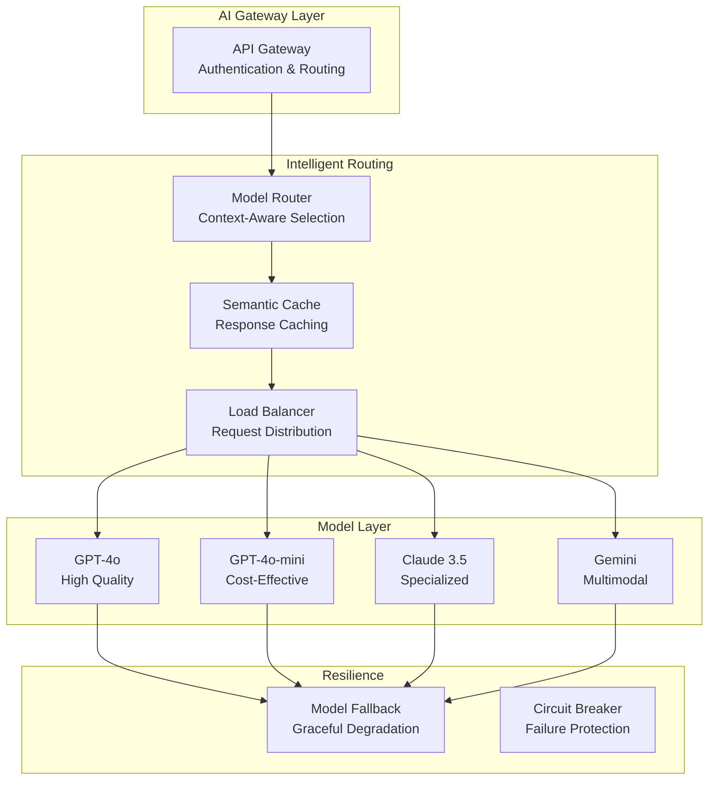

# Phase 7: Production AI Architecture

> **Objective:** Design enterprise-grade AI platforms and services.

---

# Part 22: AI System Architecture

**Building scalable, cost-effective AI platforms—gateways, model routing, caching, load balancing, and multi-model strategies.**

---

## The Target: What We're Building Right Now

In this part, we're building six powerful architectural components:

1. **An AI Gateway** — Unified entry point for AI services
2. **A Model Router** — Intelligent model selection and routing
3. **A Response Cache** — Semantic caching for cost reduction
4. **A Load Balancer** — Distribute requests across models
5. **A Model Fallback System** — Graceful degradation
6. **A Multi-Model Strategy Engine** — Optimize cost and quality

**Why this matters:** Production AI requires more than just calling APIs. You need scalable architecture that handles traffic, optimizes costs, and maintains reliability. This is how you build enterprise-grade AI.

---

## The Concept: AI System Architecture

### The Airport Analogy

Imagine you're running an international airport:

- **AI Gateway** = The main terminal (all flights go through here)
- **Model Router** = The flight schedule (which plane goes where)
- **Response Cache** = The baggage claim (faster for returning passengers)
- **Load Balancer** = The air traffic control (managing traffic)
- **Model Fallback** = The backup runway (when one is closed)
- **Multi-Model Strategy** = Different airlines (choosing the right one)

**AI system architecture is about managing complexity at scale.**



### Architecture Components

| Component | Purpose | Key Features |
|-----------|---------|--------------|
| **AI Gateway** | Unified entry point | Authentication, rate limiting, logging |
| **Model Router** | Intelligent routing | Cost/quality optimization |
| **Response Cache** | Reduce costs | Semantic caching, TTL |
| **Load Balancer** | Distribute traffic | Health checks, weighted routing |
| **Model Fallback** | Ensure availability | Automatic failover |
| **Multi-Model Strategy** | Optimize decisions | Cost-quality tradeoffs |

### Routing Strategies

| Strategy | Description | When to Use |
|----------|-------------|-------------|
| **Round Robin** | Distribute evenly | Equal load balancing |
| **Weighted** | Weighted distribution | Different capacities |
| **Cost-Based** | Cheapest first | Cost optimization |
| **Quality-Based** | Best quality first | Quality optimization |
| **Context-Aware** | Based on task | Task-specific routing |
| **Dynamic** | Real-time optimization | Variable conditions |

### Caching Strategies

| Strategy | Description | Benefits |
|----------|-------------|----------|
| **Exact Match** | Identical queries | Simple, effective |
| **Semantic** | Similar meaning | Higher cache hit rate |
| **TTL-Based** | Time-based expiry | Freshness control |
| **LRU** | Least recently used | Memory efficiency |
| **Hybrid** | Multiple strategies | Best of both |

---

## The Implementation: Building Our Architecture Components

### Target File Structure

```
phase-7-production/
└── module-22-system-architecture/
    ├── 01_ai_gateway.py
    ├── 02_model_router.py
    ├── 03_response_cache.py
    ├── 04_load_balancer.py
    ├── 05_model_fallback.py
    ├── 06_multi_model_strategy.py
    ├── requirements.txt
    └── README.md
```

### Step 1: AI Gateway

Create `01_ai_gateway.py`:

```python
#!/usr/bin/env python3
"""
Module 22: AI Gateway

Unified entry point for AI services.
"""

import os
import sys
from pathlib import Path
import json
import time
import hashlib
from typing import Dict, Any, Optional, List
from datetime import datetime
import uuid

sys.path.insert(0, str(Path(__file__).parent.parent.parent.parent))

from shared.utils.config import load_config
from shared.utils.logging import setup_logging

setup_logging(debug=False)
config = load_config()

class AIGateway:
    """
    AI Gateway - unified entry point for AI services.
    
    Features:
    - Authentication
    - Rate limiting
    - Request routing
    - Response transformation
    - Logging and monitoring
    - API key management
    """
    
    def __init__(
        self,
        name: str = "AI Gateway",
        max_requests_per_minute: int = 100
    ):
        """
        Initialize the AI gateway.
        
        Args:
            name: Gateway name
            max_requests_per_minute: Rate limit
        """
        self.name = name
        self.max_requests_per_minute = max_requests_per_minute
        
        self.api_keys = {}
        self.request_log = []
        self.routes = {}
        self.rate_limits = {}
        
        print(f"✅ Initialized AI Gateway: {name}")
        print(f"   Rate limit: {max_requests_per_minute} req/min")
    
    def register_api_key(
        self,
        key: str,
        name: str,
        permissions: List[str] = None,
        rate_limit: Optional[int] = None
    ) -> None:
        """
        Register an API key.
        
        Args:
            key: API key
            name: Key name
            permissions: Permissions
            rate_limit: Custom rate limit
        """
        self.api_keys[key] = {
            "name": name,
            "permissions": permissions or ["chat"],
            "rate_limit": rate_limit or self.max_requests_per_minute,
            "created_at": datetime.now().isoformat(),
            "usage": 0
        }
        
        print(f"🔑 Registered API key: {name}")
    
    def register_route(
        self,
        path: str,
        handler: callable,
        methods: List[str] = None
    ) -> None:
        """
        Register a route.
        
        Args:
            path: Route path
            handler: Route handler
            methods: HTTP methods
        """
        self.routes[path] = {
            "handler": handler,
            "methods": methods or ["POST"],
            "registered_at": datetime.now().isoformat()
        }
        
        print(f"🛣️ Registered route: {path}")
    
    def handle_request(
        self,
        path: str,
        data: Dict[str, Any],
        api_key: str,
        method: str = "POST"
    ) -> Dict[str, Any]:
        """
        Handle an incoming request.
        
        Args:
            path: Request path
            data: Request data
            api_key: API key
            method: HTTP method
            
        Returns:
            Response data
        """
        start_time = time.time()
        request_id = str(uuid.uuid4())[:8]
        
        # Authenticate
        auth_result = self._authenticate(api_key)
        if not auth_result["success"]:
            return auth_result
        
        # Check rate limit
        rate_result = self._check_rate_limit(api_key)
        if not rate_result["success"]:
            return rate_result
        
        # Find route
        if path not in self.routes:
            return {
                "success": False,
                "error": f"Route not found: {path}",
                "request_id": request_id
            }
        
        route = self.routes[path]
        
        # Check method
        if method not in route["methods"]:
            return {
                "success": False,
                "error": f"Method not allowed: {method}",
                "request_id": request_id
            }
        
        # Execute handler
        try:
            result = route["handler"](data)
            
            # Log request
            self._log_request(
                request_id=request_id,
                api_key=api_key,
                path=path,
                method=method,
                status="success",
                duration_ms=(time.time() - start_time) * 1000
            )
            
            return {
                "success": True,
                "data": result,
                "request_id": request_id,
                "gateway": self.name
            }
            
        except Exception as e:
            self._log_request(
                request_id=request_id,
                api_key=api_key,
                path=path,
                method=method,
                status="error",
                error=str(e),
                duration_ms=(time.time() - start_time) * 1000
            )
            
            return {
                "success": False,
                "error": str(e),
                "request_id": request_id
            }
    
    def _authenticate(self, api_key: str) -> Dict[str, Any]:
        """
        Authenticate API key.
        
        Args:
            api_key: API key
            
        Returns:
            Authentication result
        """
        if api_key not in self.api_keys:
            return {
                "success": False,
                "error": "Invalid API key",
                "status_code": 401
            }
        
        key_data = self.api_keys[api_key]
        key_data["usage"] += 1
        
        return {"success": True, "key_data": key_data}
    
    def _check_rate_limit(self, api_key: str) -> Dict[str, Any]:
        """
        Check rate limit.
        
        Args:
            api_key: API key
            
        Returns:
            Rate limit check result
        """
        key_data = self.api_keys.get(api_key)
        if not key_data:
            return {"success": False, "error": "Invalid API key"}
        
        rate_limit = key_data["rate_limit"]
        
        # Count requests in the last minute
        one_minute_ago = time.time() - 60
        recent_requests = [
            req for req in self.request_log
            if req["api_key"] == api_key and
            req["timestamp"] > one_minute_ago
        ]
        
        if len(recent_requests) >= rate_limit:
            return {
                "success": False,
                "error": f"Rate limit exceeded: {rate_limit} req/min",
                "status_code": 429,
                "retry_after": 60
            }
        
        return {"success": True}
    
    def _log_request(
        self,
        request_id: str,
        api_key: str,
        path: str,
        method: str,
        status: str,
        duration_ms: float,
        error: Optional[str] = None
    ) -> None:
        """
        Log a request.
        
        Args:
            request_id: Request ID
            api_key: API key
            path: Request path
            method: HTTP method
            status: Status
            duration_ms: Duration in milliseconds
            error: Error message
        """
        self.request_log.append({
            "request_id": request_id,
            "api_key": api_key,
            "path": path,
            "method": method,
            "status": status,
            "duration_ms": duration_ms,
            "error": error,
            "timestamp": time.time()
        })
    
    def get_stats(self) -> Dict[str, Any]:
        """
        Get gateway statistics.
        
        Returns:
            Gateway statistics
        """
        last_minute = [
            req for req in self.request_log
            if req["timestamp"] > time.time() - 60
        ]
        
        return {
            "name": self.name,
            "total_requests": len(self.request_log),
            "requests_last_minute": len(last_minute),
            "api_keys": len(self.api_keys),
            "routes": len(self.routes),
            "rate_limit": self.max_requests_per_minute
        }

def demonstrate_gateway():
    """Demonstrate the AI gateway."""
    print("\n" + "="*80)
    print("🚪 AI GATEWAY DEMONSTRATION")
    print("="*80)
    
    # Create gateway
    gateway = AIGateway("Demo Gateway", max_requests_per_minute=5)
    
    # Register API key
    gateway.register_api_key(
        key="sk-demo-key-123",
        name="Demo User",
        permissions=["chat"],
        rate_limit=3
    )
    
    # Register route
    def chat_handler(data):
        prompt = data.get("prompt", "")
        return {
            "response": f"Processed: {prompt}",
            "model": "gpt-4o-mini",
            "tokens": {"total": 50}
        }
    
    gateway.register_route("/chat", chat_handler)
    
    # Test requests
    print("\n📋 Sending requests:")
    print("-"*40)
    
    for i in range(6):
        result = gateway.handle_request(
            path="/chat",
            data={"prompt": f"Hello {i+1}"},
            api_key="sk-demo-key-123"
        )
        
        if result["success"]:
            print(f"   {i+1}. ✅ {result['data']['response']}")
        else:
            print(f"   {i+1}. ❌ {result.get('error')}")
    
    # Stats
    print("\n📊 Gateway Stats:")
    print(json.dumps(gateway.get_stats(), indent=2))

def main():
    """Run the AI gateway demonstration."""
    print("\n" + "="*80)
    print("AI TUTORIAL SERIES - AI GATEWAY")
    print("="*80)
    
    demonstrate_gateway()

if __name__ == "__main__":
    main()
```

### Step 2: Model Router

Create `02_model_router.py`:

```python
#!/usr/bin/env python3
"""
Module 22: Model Router

Intelligent model selection and routing.
"""

import os
import sys
from pathlib import Path
import json
from typing import Dict, Any, List, Optional
from datetime import datetime

sys.path.insert(0, str(Path(__file__).parent.parent.parent.parent))

from shared.utils.config import load_config
from shared.utils.logging import setup_logging

setup_logging(debug=False)
config = load_config()

class ModelRouter:
    """
    Intelligent model routing.
    
    Features:
    - Context-aware routing
    - Cost optimization
    - Quality optimization
    - Weighted routing
    - Performance tracking
    """
    
    def __init__(self):
        """Initialize the model router."""
        self.models = {}
        self.routing_history = []
        self.performance = {}
        
        print("✅ Initialized model router")
    
    def register_model(
        self,
        name: str,
        provider: str,
        cost_per_1k: float,
        quality_score: float,
        latency_ms: float,
        capabilities: List[str] = None,
        max_tokens: int = 128000,
        weight: float = 1.0
    ) -> None:
        """
        Register a model.
        
        Args:
            name: Model name
            provider: Provider name
            cost_per_1k: Cost per 1000 tokens
            quality_score: Quality score (0-1)
            latency_ms: Average latency in ms
            capabilities: Model capabilities
            max_tokens: Context window
            weight: Routing weight
        """
        self.models[name] = {
            "name": name,
            "provider": provider,
            "cost_per_1k": cost_per_1k,
            "quality_score": quality_score,
            "latency_ms": latency_ms,
            "capabilities": capabilities or ["chat"],
            "max_tokens": max_tokens,
            "weight": weight,
            "success_rate": 1.0,
            "registered_at": datetime.now().isoformat()
        }
        
        self.performance[name] = {
            "requests": 0,
            "successes": 0,
            "failures": 0,
            "total_latency": 0
        }
        
        print(f"🤖 Registered model: {name} ({provider})")
    
    def route(
        self,
        task: str,
        required_capabilities: List[str] = None,
        max_cost: Optional[float] = None,
        min_quality: Optional[float] = None,
        max_latency: Optional[float] = None,
        strategy: str = "balanced"
    ) -> Dict[str, Any]:
        """
        Route a task to the best model.
        
        Args:
            task: Task description
            required_capabilities: Required capabilities
            max_cost: Maximum cost
            min_quality: Minimum quality
            max_latency: Maximum latency
            strategy: Routing strategy
            
        Returns:
            Routing decision
        """
        required_capabilities = required_capabilities or ["chat"]
        
        # Filter models
        candidates = []
        
        for name, model in self.models.items():
            # Check capabilities
            if not any(cap in model["capabilities"] for cap in required_capabilities):
                continue
            
            # Check cost
            if max_cost and model["cost_per_1k"] > max_cost:
                continue
            
            # Check quality
            if min_quality and model["quality_score"] < min_quality:
                continue
            
            # Check latency
            if max_latency and model["latency_ms"] > max_latency:
                continue
            
            candidates.append(name)
        
        if not candidates:
            return {
                "success": False,
                "error": "No models match the criteria",
                "candidates": []
            }
        
        # Route based on strategy
        if strategy == "cost":
            selected = min(candidates, key=lambda x: self.models[x]["cost_per_1k"])
        elif strategy == "quality":
            selected = max(candidates, key=lambda x: self.models[x]["quality_score"])
        elif strategy == "speed":
            selected = min(candidates, key=lambda x: self.models[x]["latency_ms"])
        elif strategy == "weighted":
            selected = self._weighted_route(candidates)
        else:  # balanced
            selected = self._balanced_route(candidates)
        
        # Record routing
        decision = {
            "task": task,
            "selected_model": selected,
            "candidates": candidates,
            "strategy": strategy,
            "timestamp": datetime.now().isoformat(),
            "model_info": self.models[selected]
        }
        
        self.routing_history.append(decision)
        
        # Update performance
        self.performance[selected]["requests"] += 1
        
        return {
            "success": True,
            "model": selected,
            "decision": decision
        }
    
    def _weighted_route(self, candidates: List[str]) -> str:
        """
        Route using weights.
        
        Args:
            candidates: Candidate models
            
        Returns:
            Selected model
        """
        import random
        
        weights = [self.models[m]["weight"] for m in candidates]
        total_weight = sum(weights)
        
        if total_weight == 0:
            return candidates[0]
        
        r = random.random() * total_weight
        cumulative = 0
        
        for i, candidate in enumerate(candidates):
            cumulative += weights[i]
            if r <= cumulative:
                return candidate
        
        return candidates[-1]
    
    def _balanced_route(self, candidates: List[str]) -> str:
        """
        Balanced routing considering multiple factors.
        
        Args:
            candidates: Candidate models
            
        Returns:
            Selected model
        """
        scores = {}
        
        for candidate in candidates:
            model = self.models[candidate]
            performance = self.performance[candidate]
            
            # Base score
            score = model["quality_score"] * 0.5
            
            # Cost factor (lower is better)
            cost_factor = 1 - (model["cost_per_1k"] / max(1, max(m["cost_per_1k"] for m in self.models.values())))
            score += cost_factor * 0.3
            
            # Latency factor
            latency_factor = 1 - (model["latency_ms"] / max(1, max(m["latency_ms"] for m in self.models.values())))
            score += latency_factor * 0.1
            
            # Success rate factor
            if performance["requests"] > 0:
                success_rate = performance["successes"] / performance["requests"]
                score += success_rate * 0.1
            
            scores[candidate] = score
        
        return max(scores, key=scores.get)
    
    def record_result(
        self,
        model: str,
        success: bool,
        latency_ms: float,
        tokens_used: int
    ) -> None:
        """
        Record a model's performance.
        
        Args:
            model: Model name
            success: Whether request succeeded
            latency_ms: Latency in ms
            tokens_used: Tokens used
        """
        if model not in self.performance:
            return
        
        perf = self.performance[model]
        perf["requests"] += 1
        perf["successes"] += 1 if success else 0
        perf["failures"] += 0 if success else 1
        perf["total_latency"] += latency_ms
    
    def get_model_stats(self, model: str) -> Dict[str, Any]:
        """
        Get model statistics.
        
        Args:
            model: Model name
            
        Returns:
            Model statistics
        """
        if model not in self.models:
            return {}
        
        model_info = self.models[model]
        perf = self.performance.get(model, {})
        
        return {
            **model_info,
            "requests": perf.get("requests", 0),
            "success_rate": perf.get("successes", 0) / perf.get("requests", 1) if perf.get("requests", 0) > 0 else 1.0,
            "avg_latency": perf.get("total_latency", 0) / perf.get("requests", 1) if perf.get("requests", 0) > 0 else model_info["latency_ms"]
        }

def demonstrate_router():
    """Demonstrate the model router."""
    print("\n" + "="*80)
    print("🔀 MODEL ROUTER DEMONSTRATION")
    print("="*80)
    
    router = ModelRouter()
    
    # Register models
    router.register_model(
        name="gpt-4o",
        provider="openai",
        cost_per_1k=0.030,
        quality_score=0.95,
        latency_ms=800,
        capabilities=["chat", "reasoning", "multimodal"]
    )
    
    router.register_model(
        name="gpt-4o-mini",
        provider="openai",
        cost_per_1k=0.001,
        quality_score=0.70,
        latency_ms=300,
        capabilities=["chat"]
    )
    
    router.register_model(
        name="claude-3.5-sonnet",
        provider="anthropic",
        cost_per_1k=0.015,
        quality_score=0.90,
        latency_ms=600,
        capabilities=["chat", "reasoning"]
    )
    
    router.register_model(
        name="gemini-1.5-flash",
        provider="google",
        cost_per_1k=0.001,
        quality_score=0.65,
        latency_ms=400,
        capabilities=["chat", "multimodal"]
    )
    
    # Test different strategies
    print("\n📋 Testing routing strategies:")
    print("-"*40)
    
    strategies = ["cost", "quality", "speed", "balanced"]
    
    for strategy in strategies:
        print(f"\n🎯 Strategy: {strategy}")
        result = router.route(
            task="Simple chat",
            required_capabilities=["chat"],
            strategy=strategy
        )
        
        if result["success"]:
            model = result["model"]
            info = router.models[model]
            print(f"   Selected: {model}")
            print(f"   Cost: ${info['cost_per_1k']:.3f}/1K")
            print(f"   Quality: {info['quality_score']:.2f}")
            print(f"   Latency: {info['latency_ms']:.0f}ms")
    
    # Show model stats
    print("\n📊 Model Statistics:")
    for model in router.models.keys():
        stats = router.get_model_stats(model)
        print(f"\n{model}:")
        print(f"   Cost: ${stats['cost_per_1k']:.3f}/1K")
        print(f"   Quality: {stats['quality_score']:.2f}")
        print(f"   Success Rate: {stats['success_rate']:.2%}")

def main():
    """Run the model router demonstration."""
    print("\n" + "="*80)
    print("AI TUTORIAL SERIES - MODEL ROUTER")
    print("="*80)
    
    demonstrate_router()

if __name__ == "__main__":
    main()
```

### Step 3: Response Cache

Create `03_response_cache.py`:

```python
#!/usr/bin/env python3
"""
Module 22: Response Cache

Semantic caching for cost reduction.
"""

import os
import sys
from pathlib import Path
import json
import time
import hashlib
from typing import Dict, Any, Optional, List
from datetime import datetime, timedelta

sys.path.insert(0, str(Path(__file__).parent.parent.parent.parent))

from shared.utils.config import load_config
from shared.utils.logging import setup_logging
from embedding_generator import EmbeddingGenerator
from vector_store import VectorStore

setup_logging(debug=False)
config = load_config()

class ResponseCache:
    """
    Semantic caching for AI responses.
    
    Features:
    - Semantic similarity caching
    - TTL-based expiry
    - Cache hit tracking
    - Memory management
    """
    
    def __init__(
        self,
        max_items: int = 1000,
        ttl_seconds: int = 3600,
        similarity_threshold: float = 0.95,
        use_embeddings: bool = True
    ):
        """
        Initialize the response cache.
        
        Args:
            max_items: Maximum cache items
            ttl_seconds: Cache TTL in seconds
            similarity_threshold: Similarity threshold for cache hits
            use_embeddings: Use semantic similarity
        """
        self.max_items = max_items
        self.ttl_seconds = ttl_seconds
        self.similarity_threshold = similarity_threshold
        self.use_embeddings = use_embeddings
        
        self.cache = {}
        self.hits = 0
        self.misses = 0
        
        if use_embeddings:
            self.generator = EmbeddingGenerator()
            self.vector_store = VectorStore(dimension=1536)
        
        print(f"✅ Initialized response cache")
        print(f"   Max items: {max_items}")
        print(f"   TTL: {ttl_seconds}s")
        print(f"   Similarity threshold: {similarity_threshold}")
    
    def get(self, query: str, context: Dict[str, Any] = None) -> Optional[Dict[str, Any]]:
        """
        Get a cached response.
        
        Args:
            query: User query
            context: Additional context
            
        Returns:
            Cached response or None
        """
        if self.use_embeddings:
            return self._get_semantic(query, context)
        else:
            return self._get_exact(query, context)
    
    def _get_exact(self, query: str, context: Dict[str, Any] = None) -> Optional[Dict[str, Any]]:
        """
        Get exact match from cache.
        
        Args:
            query: User query
            context: Additional context
            
        Returns:
            Cached response or None
        """
        key = self._generate_key(query, context)
        
        if key not in self.cache:
            self.misses += 1
            return None
        
        entry = self.cache[key]
        
        # Check TTL
        if self._is_expired(entry):
            del self.cache[key]
            self.misses += 1
            return None
        
        self.hits += 1
        entry["last_accessed"] = datetime.now().isoformat()
        
        return entry["response"]
    
    def _get_semantic(self, query: str, context: Dict[str, Any] = None) -> Optional[Dict[str, Any]]:
        """
        Get semantically similar response from cache.
        
        Args:
            query: User query
            context: Additional context
            
        Returns:
            Cached response or None
        """
        if not self.vector_store.ids:
            self.misses += 1
            return None
        
        # Generate query embedding
        query_embedding = self.generator.generate_embedding(query)
        
        # Search for similar queries
        results = self.vector_store.search(
            query_embedding,
            top_k=1,
            filter_metadata={"context_hash": self._hash_context(context)}
        )
        
        if not results:
            self.misses += 1
            return None
        
        result = results[0]
        similarity = result["similarity"]
        
        if similarity < self.similarity_threshold:
            self.misses += 1
            return None
        
        # Get the cached response
        entry = self.cache.get(result["id"])
        if not entry or self._is_expired(entry):
            self.misses += 1
            return None
        
        self.hits += 1
        entry["last_accessed"] = datetime.now().isoformat()
        
        return entry["response"]
    
    def set(
        self,
        query: str,
        response: Dict[str, Any],
        context: Dict[str, Any] = None,
        ttl: Optional[int] = None
    ) -> None:
        """
        Store a response in cache.
        
        Args:
            query: User query
            response: Response to cache
            context: Additional context
            ttl: Custom TTL
        """
        key = self._generate_key(query, context)
        
        entry = {
            "query": query,
            "response": response,
            "context": context or {},
            "created_at": datetime.now().isoformat(),
            "last_accessed": datetime.now().isoformat(),
            "ttl": ttl or self.ttl_seconds,
            "hits": 0
        }
        
        # Store exact match
        self.cache[key] = entry
        
        # Store semantic embedding
        if self.use_embeddings:
            embedding = self.generator.generate_embedding(query)
            metadata = {
                "query": query[:100],
                "context_hash": self._hash_context(context),
                "key": key
            }
            self.vector_store.add_vector(embedding, metadata)
        
        # Prune if needed
        if len(self.cache) > self.max_items:
            self._prune()
    
    def _generate_key(self, query: str, context: Dict[str, Any] = None) -> str:
        """
        Generate a cache key.
        
        Args:
            query: User query
            context: Additional context
            
        Returns:
            Cache key
        """
        context_str = json.dumps(context or {}, sort_keys=True)
        combined = f"{query}:{context_str}"
        return hashlib.md5(combined.encode()).hexdigest()
    
    def _hash_context(self, context: Dict[str, Any] = None) -> str:
        """
        Hash context for filtering.
        
        Args:
            context: Context dictionary
            
        Returns:
            Context hash
        """
        if not context:
            return "no_context"
        
        context_str = json.dumps(context, sort_keys=True)
        return hashlib.md5(context_str.encode()).hexdigest()
    
    def _is_expired(self, entry: Dict[str, Any]) -> bool:
        """
        Check if cache entry is expired.
        
        Args:
            entry: Cache entry
            
        Returns:
            True if expired
        """
        created_at = datetime.fromisoformat(entry["created_at"])
        ttl = entry.get("ttl", self.ttl_seconds)
        expiry = created_at + timedelta(seconds=ttl)
        return datetime.now() > expiry
    
    def _prune(self) -> None:
        """Prune old cache entries."""
        # Remove expired entries
        expired = [k for k, v in self.cache.items() if self._is_expired(v)]
        for key in expired:
            del self.cache[key]
        
        # If still over limit, remove least recently used
        if len(self.cache) > self.max_items:
            sorted_items = sorted(
                self.cache.items(),
                key=lambda x: x[1]["last_accessed"]
            )
            for key, _ in sorted_items[:len(self.cache) - self.max_items]:
                del self.cache[key]
    
    def get_stats(self) -> Dict[str, Any]:
        """
        Get cache statistics.
        
        Returns:
            Cache statistics
        """
        total_requests = self.hits + self.misses
        return {
            "items": len(self.cache),
            "hits": self.hits,
            "misses": self.misses,
            "hit_rate": self.hits / total_requests if total_requests > 0 else 0,
            "max_items": self.max_items,
            "ttl": self.ttl_seconds
        }

def demonstrate_cache():
    """Demonstrate the response cache."""
    print("\n" + "="*80)
    print("💾 RESPONSE CACHE DEMONSTRATION")
    print("="*80)
    
    if not config.get("openai_api_key"):
        print("❌ OpenAI API key not available")
        print("   Using exact-match cache only")
    
    cache = ResponseCache(
        max_items=10,
        ttl_seconds=60,
        similarity_threshold=0.85,
        use_embeddings=bool(config.get("openai_api_key"))
    )
    
    # Cache responses
    print("\n📋 Caching responses:")
    print("-"*40)
    
    queries = [
        "What is AI?",
        "What is machine learning?",
        "What is AI?",  # Duplicate
        "What is deep learning?",
        "What is artificial intelligence?",  # Similar to "What is AI?"
    ]
    
    responses = [
        {"content": "AI is the simulation of human intelligence in machines."},
        {"content": "Machine learning is a subset of AI that learns from data."},
        {"content": "AI is the simulation of human intelligence in machines."},
        {"content": "Deep learning uses neural networks with multiple layers."},
        {"content": "AI is the simulation of human intelligence in machines."}
    ]
    
    for query, response in zip(queries, responses):
        cached = cache.get(query)
        if cached:
            print(f"   ✅ Cache hit: '{query[:20]}...'")
        else:
            print(f"   📝 Cache miss: '{query[:20]}...'")
            cache.set(query, response)
    
    # Statistics
    print("\n📊 Cache Statistics:")
    print(json.dumps(cache.get_stats(), indent=2))

def main():
    """Run the response cache demonstration."""
    print("\n" + "="*80)
    print("AI TUTORIAL SERIES - RESPONSE CACHE")
    print("="*80)
    
    demonstrate_cache()

if __name__ == "__main__":
    main()
```

### Step 4: Load Balancer

Create `04_load_balancer.py`:

```python
#!/usr/bin/env python3
"""
Module 22: Load Balancer

Distribute requests across models.
"""

import os
import sys
from pathlib import Path
import json
import time
import random
from typing import Dict, Any, List, Optional
from datetime import datetime

sys.path.insert(0, str(Path(__file__).parent.parent.parent.parent))

from shared.utils.config import load_config
from shared.utils.logging import setup_logging

setup_logging(debug=False)
config = load_config()

class LoadBalancer:
    """
    Distribute requests across models.
    
    Features:
    - Round robin
    - Weighted distribution
    - Health checks
    - Auto-scaling
    - Performance tracking
    """
    
    def __init__(self, name: str = "default"):
        """
        Initialize the load balancer.
        
        Args:
            name: Load balancer name
        """
        self.name = name
        self.targets = []
        self.current_index = 0
        self.health = {}
        self.requests = []
        
        print(f"✅ Initialized load balancer: {name}")
    
    def add_target(
        self,
        name: str,
        weight: float = 1.0,
        max_requests: int = 100,
        health_check_interval: int = 30
    ) -> None:
        """
        Add a target.
        
        Args:
            name: Target name
            weight: Load balancing weight
            max_requests: Maximum concurrent requests
            health_check_interval: Health check interval
        """
        target = {
            "name": name,
            "weight": weight,
            "max_requests": max_requests,
            "health_check_interval": health_check_interval,
            "healthy": True,
            "current_requests": 0,
            "total_requests": 0,
            "successful_requests": 0,
            "failed_requests": 0,
            "last_health_check": None,
            "added_at": datetime.now().isoformat()
        }
        
        self.targets.append(target)
        self.health[name] = True
        
        print(f"🎯 Added target: {name} (weight: {weight})")
    
    def get_target(self, strategy: str = "weighted") -> Optional[Dict[str, Any]]:
        """
        Get a target using the specified strategy.
        
        Args:
            strategy: Load balancing strategy
            
        Returns:
            Target or None
        """
        healthy_targets = [t for t in self.targets if t["healthy"]]
        
        if not healthy_targets:
            return None
        
        if strategy == "round_robin":
            return self._round_robin(healthy_targets)
        elif strategy == "weighted":
            return self._weighted(healthy_targets)
        elif strategy == "least_loaded":
            return self._least_loaded(healthy_targets)
        elif strategy == "random":
            return self._random(healthy_targets)
        else:
            return self._weighted(healthy_targets)
    
    def _round_robin(self, targets: List[Dict[str, Any]]) -> Dict[str, Any]:
        """
        Round robin selection.
        
        Args:
            targets: Available targets
            
        Returns:
            Selected target
        """
        if not targets:
            return None
        
        self.current_index = (self.current_index + 1) % len(targets)
        return targets[self.current_index]
    
    def _weighted(self, targets: List[Dict[str, Any]]) -> Dict[str, Any]:
        """
        Weighted selection.
        
        Args:
            targets: Available targets
            
        Returns:
            Selected target
        """
        if not targets:
            return None
        
        weights = [t["weight"] for t in targets]
        total_weight = sum(weights)
        
        if total_weight == 0:
            return random.choice(targets)
        
        r = random.random() * total_weight
        cumulative = 0
        
        for i, target in enumerate(targets):
            cumulative += weights[i]
            if r <= cumulative:
                return target
        
        return targets[-1]
    
    def _least_loaded(self, targets: List[Dict[str, Any]]) -> Dict[str, Any]:
        """
        Least loaded selection.
        
        Args:
            targets: Available targets
            
        Returns:
            Selected target
        """
        if not targets:
            return None
        
        return min(targets, key=lambda x: x["current_requests"] / x["max_requests"])
    
    def _random(self, targets: List[Dict[str, Any]]) -> Dict[str, Any]:
        """
        Random selection.
        
        Args:
            targets: Available targets
            
        Returns:
            Selected target
        """
        if not targets:
            return None
        
        return random.choice(targets)
    
    def record_request(
        self,
        target_name: str,
        success: bool,
        duration_ms: float
    ) -> None:
        """
        Record a request result.
        
        Args:
            target_name: Target name
            success: Whether request succeeded
            duration_ms: Duration in ms
        """
        for target in self.targets:
            if target["name"] == target_name:
                target["total_requests"] += 1
                if success:
                    target["successful_requests"] += 1
                else:
                    target["failed_requests"] += 1
                target["current_requests"] = max(0, target["current_requests"] - 1)
                break
        
        self.requests.append({
            "target": target_name,
            "success": success,
            "duration_ms": duration_ms,
            "timestamp": time.time()
        })
    
    def health_check(self) -> Dict[str, Any]:
        """
        Perform health checks.
        
        Returns:
            Health check results
        """
        results = {}
        
        for target in self.targets:
            # Simulate health check
            # In production, would ping the target
            is_healthy = target["successful_requests"] / max(1, target["total_requests"]) > 0.8
            target["healthy"] = is_healthy
            target["last_health_check"] = datetime.now().isoformat()
            results[target["name"]] = is_healthy
        
        return results
    
    def get_stats(self) -> Dict[str, Any]:
        """
        Get load balancer statistics.
        
        Returns:
            Load balancer stats
        """
        total_requests = sum(t["total_requests"] for t in self.targets)
        total_success = sum(t["successful_requests"] for t in self.targets)
        
        return {
            "name": self.name,
            "targets": [
                {
                    "name": t["name"],
                    "healthy": t["healthy"],
                    "load": t["current_requests"] / t["max_requests"],
                    "success_rate": t["successful_requests"] / max(1, t["total_requests"])
                }
                for t in self.targets
            ],
            "total_requests": total_requests,
            "success_rate": total_success / max(1, total_requests),
            "active_targets": len([t for t in self.targets if t["healthy"]])
        }

def demonstrate_load_balancer():
    """Demonstrate the load balancer."""
    print("\n" + "="*80)
    print("⚖️ LOAD BALANCER DEMONSTRATION")
    print("="*80)
    
    # Create load balancer
    lb = LoadBalancer("AI Load Balancer")
    
    # Add targets
    lb.add_target("gpt-4o", weight=1.0, max_requests=50)
    lb.add_target("gpt-4o-mini", weight=3.0, max_requests=100)
    lb.add_target("claude-3.5", weight=2.0, max_requests=75)
    
    # Simulate requests
    print("\n📋 Simulating 20 requests:")
    print("-"*40)
    
    strategies = ["weighted", "round_robin", "least_loaded"]
    
    for i in range(20):
        strategy = strategies[i % len(strategies)]
        target = lb.get_target(strategy)
        
        if target:
            # Simulate request
            success = random.random() > 0.1  # 90% success rate
            duration = random.gauss(500, 100)
            
            lb.record_request(target["name"], success, duration)
            
            status = "✅" if success else "❌"
            print(f"   {i+1}. {status} {target['name']} ({strategy}) - {duration:.0f}ms")
    
    # Stats
    print("\n📊 Load Balancer Stats:")
    stats = lb.get_stats()
    print(json.dumps(stats, indent=2))

def main():
    """Run the load balancer demonstration."""
    print("\n" + "="*80)
    print("AI TUTORIAL SERIES - LOAD BALANCER")
    print("="*80)
    
    demonstrate_load_balancer()

if __name__ == "__main__":
    main()
```

### Step 5: Model Fallback

Create `05_model_fallback.py`:

```python
#!/usr/bin/env python3
"""
Module 22: Model Fallback

Graceful degradation with model fallback.
"""

import os
import sys
from pathlib import Path
import json
import time
from typing import Dict, Any, List, Optional, Callable

sys.path.insert(0, str(Path(__file__).parent.parent.parent.parent))

from shared.utils.config import load_config
from shared.utils.logging import setup_logging

setup_logging(debug=False)
config = load_config()

class ModelFallback:
    """
    Graceful degradation with model fallback.
    
    Features:
    - Multi-tier fallback
    - Automatic failover
    - Degraded mode
    - Recovery detection
    """
    
    def __init__(self):
        """Initialize the model fallback system."""
        self.models = []
        self.fallback_chain = {}
        self.health = {}
        self.current_mode = "normal"
        
        print("✅ Initialized model fallback system")
    
    def register_model(
        self,
        name: str,
        handler: Callable,
        priority: int = 0,
        fallback_to: Optional[str] = None,
        health_check: Optional[Callable] = None
    ) -> None:
        """
        Register a model.
        
        Args:
            name: Model name
            handler: Model handler
            priority: Priority (higher = more preferred)
            fallback_to: Fallback model name
            health_check: Health check function
        """
        model = {
            "name": name,
            "handler": handler,
            "priority": priority,
            "fallback_to": fallback_to,
            "health_check": health_check,
            "healthy": True,
            "last_check": None,
            "failures": 0
        }
        
        self.models.append(model)
        self.health[name] = True
        
        if fallback_to:
            self.fallback_chain[name] = fallback_to
        
        print(f"📋 Registered model: {name} (priority: {priority})")
    
    def execute(self, *args, **kwargs) -> Dict[str, Any]:
        """
        Execute with fallback.
        
        Args:
            *args: Arguments for the handler
            **kwargs: Keyword arguments
            
        Returns:
            Execution result
        """
        # Sort models by priority
        sorted_models = sorted(self.models, key=lambda x: x["priority"], reverse=True)
        
        # Execute each model in order
        for model in sorted_models:
            if not model["healthy"]:
                continue
            
            try:
                result = model["handler"](*args, **kwargs)
                
                # Reset failures on success
                model["failures"] = 0
                
                return {
                    "success": True,
                    "result": result,
                    "model": model["name"],
                    "fallback_used": model["name"] != sorted_models[0]["name"]
                }
                
            except Exception as e:
                model["failures"] += 1
                print(f"⚠️ Model {model['name']} failed: {e}")
                
                # Check if we should mark as unhealthy
                if model["failures"] >= 3:
                    model["healthy"] = False
                    self.health[model["name"]] = False
                    print(f"🔴 Model {model['name']} marked unhealthy")
        
        # All models failed
        return {
            "success": False,
            "error": "All models failed",
            "model": "none"
        }
    
    def check_health(self) -> Dict[str, bool]:
        """
        Check all models' health.
        
        Returns:
            Health status dictionary
        """
        results = {}
        
        for model in self.models:
            if model["health_check"]:
                try:
                    is_healthy = model["health_check"]()
                    model["healthy"] = is_healthy
                    self.health[model["name"]] = is_healthy
                    results[model["name"]] = is_healthy
                except Exception:
                    model["healthy"] = False
                    self.health[model["name"]] = False
                    results[model["name"]] = False
            else:
                results[model["name"]] = model["healthy"]
        
        # Update mode
        if any(not h for h in self.health.values()):
            self.current_mode = "degraded"
        else:
            self.current_mode = "normal"
        
        return results
    
    def get_status(self) -> Dict[str, Any]:
        """
        Get system status.
        
        Returns:
            System status
        """
        return {
            "mode": self.current_mode,
            "models": {
                name: {
                    "healthy": healthy,
                    "failures": next((m["failures"] for m in self.models if m["name"] == name), 0)
                }
                for name, healthy in self.health.items()
            },
            "active_models": len([h for h in self.health.values() if h])
        }

def demonstrate_fallback():
    """Demonstrate the model fallback system."""
    print("\n" + "="*80)
    print("🔄 MODEL FALLBACK DEMONSTRATION")
    print("="*80)
    
    fallback = ModelFallback()
    
    # Register models with handlers
    def primary_handler(*args):
        if args and args[0] == "fail":
            raise Exception("Primary model failed")
        return "Primary model response"
    
    def backup_handler(*args):
        return "Backup model response"
    
    def tertiary_handler(*args):
        return "Tertiary model response"
    
    fallback.register_model(
        name="primary",
        handler=primary_handler,
        priority=3,
        fallback_to="backup"
    )
    
    fallback.register_model(
        name="backup",
        handler=backup_handler,
        priority=2,
        fallback_to="tertiary"
    )
    
    fallback.register_model(
        name="tertiary",
        handler=tertiary_handler,
        priority=1
    )
    
    # Test execution
    print("\n📋 Testing fallback:")
    print("-"*40)
    
    # Normal execution
    print("\n1. Normal execution:")
    result = fallback.execute()
    print(f"   Success: {result['success']}")
    print(f"   Model: {result['model']}")
    print(f"   Result: {result['result']}")
    
    # Fail primary
    print("\n2. Primary fails:")
    result = fallback.execute("fail")
    print(f"   Success: {result['success']}")
    print(f"   Model: {result['model']}")
    print(f"   Result: {result['result']}")
    
    # Health check
    print("\n3. Health check:")
    health = fallback.check_health()
    print(f"   Health: {json.dumps(health, indent=2)}")
    print(f"   Mode: {fallback.current_mode}")
    
    # Status
    print("\n4. System status:")
    print(json.dumps(fallback.get_status(), indent=2))

def main():
    """Run the model fallback demonstration."""
    print("\n" + "="*80)
    print("AI TUTORIAL SERIES - MODEL FALLBACK")
    print("="*80)
    
    demonstrate_fallback()

if __name__ == "__main__":
    main()
```

### Step 6: Multi-Model Strategy Engine

Create `06_multi_model_strategy.py`:

```python
#!/usr/bin/env python3
"""
Module 22: Multi-Model Strategy Engine

Optimize cost and quality with multi-model strategies.
"""

import os
import sys
from pathlib import Path
import json
from typing import Dict, Any, List, Optional
from datetime import datetime

sys.path.insert(0, str(Path(__file__).parent.parent.parent.parent))

from shared.utils.config import load_config
from shared.utils.logging import setup_logging
from model_router import ModelRouter
from load_balancer import LoadBalancer
from model_fallback import ModelFallback

setup_logging(debug=False)
config = load_config()

class MultiModelStrategyEngine:
    """
    Multi-model strategy optimization.
    
    Features:
    - Cost-quality optimization
    - Dynamic strategy switching
    - Performance monitoring
    - A/B testing
    - Auto-tuning
    """
    
    def __init__(self):
        """Initialize the multi-model strategy engine."""
        self.router = ModelRouter()
        self.load_balancer = LoadBalancer("Multi-Model LB")
        self.fallback = ModelFallback()
        
        self.strategies = {}
        self.current_strategy = "balanced"
        self.performance = {}
        self.history = []
        
        print("✅ Initialized multi-model strategy engine")
    
    def register_strategy(
        self,
        name: str,
        models: List[str],
        weights: Optional[List[float]] = None,
        description: str = ""
    ) -> None:
        """
        Register a strategy.
        
        Args:
            name: Strategy name
            models: List of model names
            weights: Model weights
            description: Strategy description
        """
        self.strategies[name] = {
            "name": name,
            "models": models,
            "weights": weights or [1.0] * len(models),
            "description": description,
            "created_at": datetime.now().isoformat()
        }
        
        print(f"📋 Registered strategy: {name}")
    
    def execute(
        self,
        task: str,
        strategy: Optional[str] = None,
        **kwargs
    ) -> Dict[str, Any]:
        """
        Execute using a strategy.
        
        Args:
            task: Task description
            strategy: Strategy name
            **kwargs: Additional arguments
            
        Returns:
            Execution result
        """
        strategy = strategy or self.current_strategy
        
        if strategy not in self.strategies:
            return {
                "success": False,
                "error": f"Strategy not found: {strategy}"
            }
        
        strat = self.strategies[strategy]
        
        # Get models for this strategy
        models = strat["models"]
        weights = strat["weights"]
        
        # Route to a model
        if len(models) == 1:
            selected = models[0]
        else:
            # Use load balancer to select
            # Register models with load balancer
            for model, weight in zip(models, weights):
                self.load_balancer.add_target(model, weight=weight)
            
            target = self.load_balancer.get_target("weighted")
            if not target:
                return {
                    "success": False,
                    "error": "No models available"
                }
            selected = target["name"]
        
        # Execute using fallback
        result = self.fallback.execute(task, selected, **kwargs)
        
        # Record history
        self.history.append({
            "task": task,
            "strategy": strategy,
            "selected_model": selected,
            "success": result["success"],
            "timestamp": datetime.now().isoformat()
        })
        
        return result
    
    def switch_strategy(self, name: str) -> bool:
        """
        Switch to a different strategy.
        
        Args:
            name: Strategy name
            
        Returns:
            True if switched
        """
        if name not in self.strategies:
            return False
        
        self.current_strategy = name
        print(f"🔄 Switched to strategy: {name}")
        return True
    
    def get_performance(self, strategy: str) -> Dict[str, Any]:
        """
        Get strategy performance.
        
        Args:
            strategy: Strategy name
            
        Returns:
            Performance metrics
        """
        history = [
            h for h in self.history
            if h["strategy"] == strategy
        ]
        
        if not history:
            return {"success": 0, "requests": 0}
        
        successes = sum(1 for h in history if h["success"])
        
        return {
            "requests": len(history),
            "successes": successes,
            "success_rate": successes / len(history),
            "models_used": list(set(h["selected_model"] for h in history))
        }
    
    def get_recommendation(self, task_type: str) -> str:
        """
        Get strategy recommendation.
        
        Args:
            task_type: Task type
            
        Returns:
            Recommended strategy
        """
        recommendations = {
            "chat": "balanced",
            "code": "quality",
            "reasoning": "quality",
            "creative": "creative",
            "extraction": "cost",
            "summarization": "balanced"
        }
        
        return recommendations.get(task_type, "balanced")

def demonstrate_multi_model():
    """Demonstrate the multi-model strategy engine."""
    print("\n" + "="*80)
    print("⚡ MULTI-MODEL STRATEGY ENGINE DEMONSTRATION")
    print("="*80)
    
    engine = MultiModelStrategyEngine()
    
    # Register strategies
    engine.register_strategy(
        name="cost",
        models=["gpt-4o-mini", "gemini-1.5-flash"],
        weights=[0.6, 0.4],
        description="Cost-optimized strategy"
    )
    
    engine.register_strategy(
        name="balanced",
        models=["gpt-4o-mini", "claude-3.5-sonnet"],
        weights=[0.5, 0.5],
        description="Balanced cost-quality"
    )
    
    engine.register_strategy(
        name="quality",
        models=["gpt-4o", "claude-3.5-sonnet"],
        weights=[0.6, 0.4],
        description="Quality-optimized strategy"
    )
    
    # Register models with fallback
    def model_handler(model_name: str, task: str):
        return {
            "content": f"Response from {model_name} to: {task}",
            "model": model_name
        }
    
    for model in ["gpt-4o", "gpt-4o-mini", "claude-3.5-sonnet", "gemini-1.5-flash"]:
        engine.fallback.register_model(
            name=model,
            handler=lambda task, m=model: model_handler(m, task),
            priority=3
        )
    
    # Test strategies
    print("\n📋 Testing strategies:")
    print("-"*40)
    
    tasks = ["Simple question", "Code generation", "Creative writing"]
    
    for task in tasks:
        strategy = engine.get_recommendation(task.lower())
        print(f"\nTask: '{task}'")
        print(f"Recommended: {strategy}")
        
        result = engine.execute(task, strategy)
        print(f"Success: {result['success']}")
        print(f"Model: {result.get('model', 'none')}")
    
    # Performance
    print("\n📊 Performance:")
    for strategy in engine.strategies.keys():
        perf = engine.get_performance(strategy)
        print(f"\n{strategy}:")
        print(f"   Success Rate: {perf.get('success_rate', 0):.2%}")
        print(f"   Requests: {perf.get('requests', 0)}")

def main():
    """Run the multi-model strategy demonstration."""
    print("\n" + "="*80)
    print("AI TUTORIAL SERIES - MULTI-MODEL STRATEGY ENGINE")
    print("="*80)
    
    demonstrate_multi_model()

if __name__ == "__main__":
    main()
```

---

## The Verification: Testing Your Implementation

### Step 1: Install Dependencies

Create `requirements.txt`:

```txt
# Module 22 dependencies
openai>=1.0.0
numpy>=1.24.0
python-dotenv>=1.0.0
```

Install them:

```bash
cd ~/ai-tutorial-series/phase-7-production/module-22-system-architecture
pip install -r requirements.txt
```

### Step 2: Test the AI Gateway

```bash
python 01_ai_gateway.py
```

**Expected Output:**
- API key registration
- Route handling
- Rate limiting

### Step 3: Test the Model Router

```bash
python 02_model_router.py
```

**Expected Output:**
- Model registration
- Strategy-based routing
- Performance tracking

### Step 4: Test the Response Cache

```bash
python 03_response_cache.py
```

**Expected Output:**
- Semantic caching
- Cache hits/misses
- TTL management

### Step 5: Test the Load Balancer

```bash
python 04_load_balancer.py
```

**Expected Output:**
- Multiple strategies
- Health checks
- Performance tracking

### Step 6: Test the Model Fallback

```bash
python 05_model_fallback.py
```

**Expected Output:**
- Multi-tier fallback
- Health detection
- Degraded mode

### Step 7: Test the Multi-Model Strategy Engine

```bash
python 06_multi_model_strategy.py
```

**Expected Output:**
- Strategy registration
- Cost-quality optimization
- Performance monitoring

---

## Key Takeaways

By completing this module, you've:

✅ **Built an AI gateway** for unified entry
✅ **Created a model router** for intelligent selection
✅ **Implemented a response cache** for cost reduction
✅ **Built a load balancer** for request distribution
✅ **Created a model fallback system** for resilience
✅ **Built a multi-model strategy engine** for optimization

### The Mental Model to Carry Forward

```
┌─────────────────────────────────────────────────────────────────┐
│                 AI ARCHITECTURE MENTAL MODEL                   │
├─────────────────────────────────────────────────────────────────┤
│                                                                 │
│  1. Gateways provide unified entry points                     │
│  2. Routers enable intelligent model selection                │
│  3. Caches reduce costs and latency                          │
│  4. Load balancers distribute traffic                        │
│  5. Fallback ensures availability                            │
│  6. Multi-model strategies optimize cost/quality             │
│  7. Architecture must be scalable and resilient              │
│  8. Production AI requires careful design                    │
│                                                                 │
└─────────────────────────────────────────────────────────────────┘
```

### Architecture Best Practices

| Practice | Why | How |
|----------|-----|-----|
| **Gateway Pattern** | Single entry point | API Gateway |
| **Circuit Breakers** | Prevent cascading | Resilience patterns |
| **Caching** | Reduce costs | Semantic caching |
| **Load Balancing** | Handle traffic | Weighted distribution |
| **Fallback** | Ensure availability | Multi-tier fallback |
| **Monitoring** | See everything | Observability |

---

## What's Next

**In Part 23: Deployment**, you'll learn:
- Docker containerization
- Kubernetes orchestration
- Serverless AI
- GPU deployment
- CI/CD for AI
