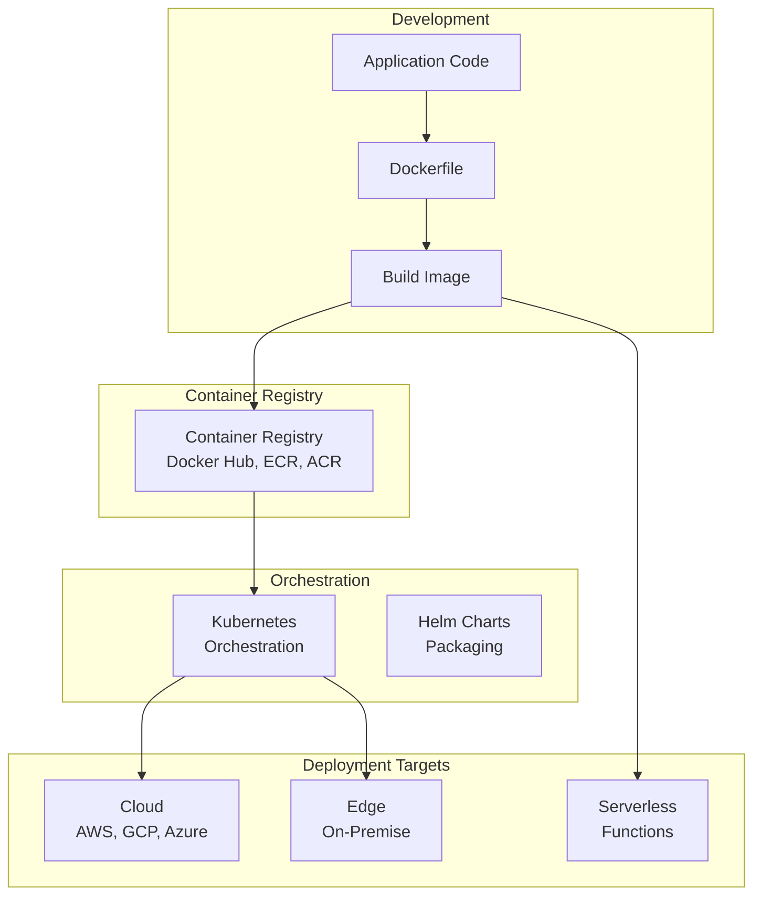

# Phase 7: Production AI Architecture

# Part 23: Deployment

**Getting AI applications into production—Docker, Kubernetes, serverless, GPU deployment, and CI/CD for AI.**

---

## The Target: What We're Building Right Now

In this part, we're building six powerful deployment components:

1. **A Dockerized AI Service** — Containerized AI application
2. **A Kubernetes Deployment** — Orchestrated AI service
3. **A Serverless AI Function** — Event-driven AI
4. **A GPU Deployment Configuration** — GPU-optimized deployment
5. **A CI/CD Pipeline** — Automated AI deployment
6. **A Complete Production Deployment** — End-to-end deployment stack

**Why this matters:** Building AI locally is easy. Deploying it to production—with scalability, reliability, and cost-efficiency—is where real engineering happens. This is how you ship AI.

---

## The Concept: AI Deployment

### The Delivery Service Analogy

Imagine you're running a food delivery service:

- **Docker** = The delivery boxes (consistent packaging)
- **Kubernetes** = The dispatch system (orchestrating drivers)
- **Serverless** = On-demand delivery (only when needed)
- **GPU Deployment** = High-performance vehicles (fast delivery)
- **CI/CD** = The automated kitchen (continuous cooking)

**Deployment is about getting your AI into the hands of users reliably.**



### Deployment Options Compared

| Option | Pros | Cons | Best For |
|--------|------|------|----------|
| **Docker** | Consistency, portable | Manual management | Development, testing |
| **Kubernetes** | Scalability, self-healing | Complex to manage | Production, large-scale |
| **Serverless** | Cost-effective, auto-scaling | Cold starts, limits | Sporadic workloads |
| **GPU Instances** | High performance | Expensive | Model training, inference |
| **Edge** | Low latency | Limited resources | IoT, mobile |

### Key Deployment Concepts

| Concept | Description | Importance |
|---------|-------------|------------|
| **Containerization** | Package app with dependencies | Consistency across environments |
| **Orchestration** | Manage containers at scale | Reliability, scaling |
| **CI/CD** | Automated build and deploy | Speed, quality |
| **Infrastructure as Code** | Define infrastructure in code | Reproducibility |
| **Health Checks** | Monitor service health | Reliability |
| **Rollbacks** | Revert bad deployments | Safety |

### Deployment Best Practices

| Practice | Why | How |
|----------|-----|-----|
| **Immutable Infrastructure** | No configuration drift | Rebuild, don't patch |
| **Canary Deployments** | Gradual rollout | Test with small traffic |
| **Blue-Green Deployments** | Zero downtime | Two identical environments |
| **Health Checks** | Detect failures | Liveness, readiness probes |
| **Secrets Management** | Secure credentials | Encrypted secrets |
| **Monitoring** | Track performance | Metrics, logs, traces |

---

## The Implementation: Building Our Deployment Tools

### Target File Structure

```
phase-7-production/
└── module-23-deployment/
    ├── 01_dockerized_ai_service/
    │   ├── Dockerfile
    │   ├── app.py
    │   ├── requirements.txt
    │   └── deployment.yaml
    ├── 02_kubernetes_deployment/
    │   ├── deployment.yaml
    │   ├── service.yaml
    │   ├── ingress.yaml
    │   └── configmap.yaml
    ├── 03_serverless_ai/
    │   ├── handler.py
    │   └── serverless.yaml
    ├── 04_gpu_deployment/
    │   ├── gpu_deployment.yaml
    │   └── gpu_dockerfile
    ├── 05_ci_cd_pipeline/
    │   ├── .github/workflows/deploy.yaml
    │   └── Makefile
    ├── 06_complete_production_deployment.py
    ├── requirements.txt
    └── README.md
```

### Step 1: Dockerized AI Service

Create `01_dockerized_ai_service/Dockerfile`:

```dockerfile
# Dockerfile for AI Service
# Multi-stage build for optimization

# --- Build Stage ---
FROM python:3.11-slim AS builder

# Set working directory
WORKDIR /app

# Install build dependencies
RUN apt-get update && apt-get install -y \
    gcc \
    && rm -rf /var/lib/apt/lists/*

# Copy requirements first (caching)
COPY requirements.txt .
RUN pip install --no-cache-dir -r requirements.txt

# --- Runtime Stage ---
FROM python:3.11-slim

# Set environment variables
ENV PYTHONUNBUFFERED=1 \
    PYTHONDONTWRITEBYTECODE=1 \
    PATH="/venv/bin:$PATH"

# Create virtual environment
RUN python -m venv /venv

# Copy packages from builder
COPY --from=builder /venv /venv

# Set working directory
WORKDIR /app

# Copy application code
COPY app.py .
COPY shared/ ./shared/

# Create non-root user
RUN adduser --disabled-password --gecos '' appuser && \
    chown -R appuser:appuser /app

# Switch to non-root user
USER appuser

# Expose port
EXPOSE 8000

# Health check
HEALTHCHECK --interval=30s --timeout=3s --start-period=5s --retries=3 \
    CMD python -c "import requests; requests.get('http://localhost:8000/health')" || exit 1

# Run the application
CMD ["uvicorn", "app:app", "--host", "0.0.0.0", "--port", "8000"]
```

Create `01_dockerized_ai_service/app.py`:

```python
#!/usr/bin/env python3
"""
AI Service for Containerization.
"""

import os
import json
from fastapi import FastAPI, HTTPException
from pydantic import BaseModel
from typing import Optional, Dict, Any

app = FastAPI(title="AI Service", version="1.0.0")

# --- Models ---
class GenerateRequest(BaseModel):
    prompt: str
    system: Optional[str] = None
    temperature: float = 0.7
    max_tokens: int = 500

class GenerateResponse(BaseModel):
    success: bool
    content: Optional[str] = None
    error: Optional[str] = None

# --- Routes ---
@app.get("/")
async def root():
    return {
        "service": "AI Service",
        "version": "1.0.0",
        "status": "running"
    }

@app.get("/health")
async def health():
    return {"status": "healthy"}

@app.post("/generate")
async def generate(request: GenerateRequest) -> GenerateResponse:
    """
    Generate a response from the AI model.
    """
    try:
        # In production, this would call the actual model
        # For demonstration, we'll simulate a response
        content = f"Processed: {request.prompt[:50]}..."
        
        return GenerateResponse(
            success=True,
            content=content
        )
    except Exception as e:
        return GenerateResponse(
            success=False,
            error=str(e)
        )

if __name__ == "__main__":
    import uvicorn
    uvicorn.run(
        "app:app",
        host="0.0.0.0",
        port=8000,
        reload=os.getenv("DEBUG", "false").lower() == "true"
    )
```

Create `01_dockerized_ai_service/requirements.txt`:

```txt
fastapi==0.104.1
uvicorn[standard]==0.24.0
pydantic==2.5.0
python-dotenv==1.0.0
openai>=1.6.0
```

### Step 2: Kubernetes Deployment

Create `02_kubernetes_deployment/deployment.yaml`:

```yaml
apiVersion: apps/v1
kind: Deployment
metadata:
  name: ai-service
  namespace: ai-apps
  labels:
    app: ai-service
    tier: backend
spec:
  replicas: 3
  strategy:
    type: RollingUpdate
    rollingUpdate:
      maxSurge: 1
      maxUnavailable: 0
  selector:
    matchLabels:
      app: ai-service
  template:
    metadata:
      labels:
        app: ai-service
        tier: backend
    spec:
      containers:
      - name: ai-service
        image: ai-service:latest
        imagePullPolicy: Always
        ports:
        - containerPort: 8000
          name: http
        env:
        - name: OPENAI_API_KEY
          valueFrom:
            secretKeyRef:
              name: ai-secrets
              key: openai-api-key
        - name: LOG_LEVEL
          valueFrom:
            configMapKeyRef:
              name: ai-config
              key: log-level
        resources:
          requests:
            memory: "512Mi"
            cpu: "250m"
          limits:
            memory: "1Gi"
            cpu: "500m"
        livenessProbe:
          httpGet:
            path: /health
            port: 8000
          initialDelaySeconds: 30
          periodSeconds: 10
        readinessProbe:
          httpGet:
            path: /health
            port: 8000
          initialDelaySeconds: 5
          periodSeconds: 5
        lifecycle:
          preStop:
            exec:
              command: ["sleep", "10"]
---
apiVersion: v1
kind: Secret
metadata:
  name: ai-secrets
  namespace: ai-apps
type: Opaque
data:
  # Base64 encoded secrets
  # echo -n "your-api-key" | base64
  openai-api-key: <BASE64_ENCODED_KEY>
---
apiVersion: v1
kind: ConfigMap
metadata:
  name: ai-config
  namespace: ai-apps
data:
  log-level: "INFO"
  model: "gpt-4o-mini"
  max-tokens: "4096"
```

Create `02_kubernetes_deployment/service.yaml`:

```yaml
apiVersion: v1
kind: Service
metadata:
  name: ai-service
  namespace: ai-apps
  labels:
    app: ai-service
spec:
  type: ClusterIP
  ports:
  - port: 80
    targetPort: 8000
    protocol: TCP
    name: http
  selector:
    app: ai-service
---
apiVersion: v1
kind: Service
metadata:
  name: ai-service-loadbalancer
  namespace: ai-apps
  labels:
    app: ai-service
spec:
  type: LoadBalancer
  ports:
  - port: 80
    targetPort: 8000
    protocol: TCP
    name: http
  selector:
    app: ai-service
```

Create `02_kubernetes_deployment/ingress.yaml`:

```yaml
apiVersion: networking.k8s.io/v1
kind: Ingress
metadata:
  name: ai-service-ingress
  namespace: ai-apps
  annotations:
    kubernetes.io/ingress.class: "nginx"
    nginx.ingress.kubernetes.io/ssl-redirect: "true"
    nginx.ingress.kubernetes.io/rate-limit: "10"
spec:
  tls:
  - hosts:
    - ai-service.example.com
    secretName: tls-secret
  rules:
  - host: ai-service.example.com
    http:
      paths:
      - path: /
        pathType: Prefix
        backend:
          service:
            name: ai-service
            port:
              number: 80
```

Create `02_kubernetes_deployment/configmap.yaml`:

```yaml
apiVersion: v1
kind: ConfigMap
metadata:
  name: ai-config
  namespace: ai-apps
data:
  log-level: "INFO"
  model: "gpt-4o-mini"
  max-tokens: "4096"
  temperature: "0.7"
  rate-limit: "100"
```

Create `02_kubernetes_deployment/hpa.yaml` (Horizontal Pod Autoscaler):

```yaml
apiVersion: autoscaling/v2
kind: HorizontalPodAutoscaler
metadata:
  name: ai-service-hpa
  namespace: ai-apps
spec:
  scaleTargetRef:
    apiVersion: apps/v1
    kind: Deployment
    name: ai-service
  minReplicas: 3
  maxReplicas: 10
  metrics:
  - type: Resource
    resource:
      name: cpu
      target:
        type: Utilization
        averageUtilization: 70
  - type: Resource
    resource:
      name: memory
      target:
        type: Utilization
        averageUtilization: 80
  - type: Pods
    pods:
      metric:
        name: requests_per_second
      target:
        type: AverageValue
        averageValue: 100
```

### Step 3: Serverless AI Function

Create `03_serverless_ai/handler.py`:

```python
#!/usr/bin/env python3
"""
Serverless AI Function (AWS Lambda)
"""

import json
import os
import time
from typing import Dict, Any

# Simulate AI model
def generate_response(prompt: str, **kwargs) -> Dict[str, Any]:
    """Generate a response using the AI model."""
    # In production, this would call an actual model
    return {
        "content": f"Response to: {prompt[:50]}...",
        "tokens": {"total": 50}
    }

def lambda_handler(event: Dict[str, Any], context: Any) -> Dict[str, Any]:
    """
    AWS Lambda handler for AI service.
    
    Args:
        event: Lambda event
        context: Lambda context
        
    Returns:
        API Gateway response
    """
    try:
        # Parse request body
        body = event.get("body", {})
        if isinstance(body, str):
            body = json.loads(body)
        
        prompt = body.get("prompt", "")
        temperature = body.get("temperature", 0.7)
        max_tokens = body.get("max_tokens", 500)
        system = body.get("system")
        
        # Generate response
        start_time = time.time()
        response = generate_response(
            prompt=prompt,
            system=system,
            temperature=temperature,
            max_tokens=max_tokens
        )
        latency_ms = (time.time() - start_time) * 1000
        
        return {
            "statusCode": 200,
            "headers": {
                "Content-Type": "application/json",
                "Access-Control-Allow-Origin": "*"
            },
            "body": json.dumps({
                "success": True,
                "response": response["content"],
                "usage": response.get("tokens", {}),
                "latency_ms": latency_ms
            })
        }
        
    except Exception as e:
        return {
            "statusCode": 500,
            "headers": {
                "Content-Type": "application/json"
            },
            "body": json.dumps({
                "success": False,
                "error": str(e)
            })
        }

# For local testing
if __name__ == "__main__":
    event = {
        "body": json.dumps({
            "prompt": "What is serverless computing?",
            "temperature": 0.7
        })
    }
    result = lambda_handler(event, None)
    print(json.dumps(result, indent=2))
```

Create `03_serverless_ai/serverless.yaml`:

```yaml
# Serverless Framework Configuration
service: ai-service

provider:
  name: aws
  runtime: python3.11
  region: us-east-1
  memorySize: 512
  timeout: 30
  environment:
    LOG_LEVEL: INFO
  iamRoleStatements:
    - Effect: Allow
      Action:
        - logs:CreateLogGroup
        - logs:CreateLogStream
        - logs:PutLogEvents
      Resource: arn:aws:logs:*:*:*

functions:
  ai-generate:
    handler: handler.lambda_handler
    events:
      - http:
          path: generate
          method: post
          cors: true
      - http:
          path: generate
          method: options
          cors: true
    environment:
      MODEL: gpt-4o-mini
      MAX_TOKENS: 4096
    provisionedConcurrency: 2  # Reduce cold starts

plugins:
  - serverless-python-requirements

custom:
  pythonRequirements:
    dockerizePip: true
    layer: true

package:
  exclude:
    - node_modules/**
    - .git/**
    - .serverless/**
    - .vscode/**
```

### Step 4: GPU Deployment

Create `04_gpu_deployment/gpu_deployment.yaml`:

```yaml
apiVersion: apps/v1
kind: Deployment
metadata:
  name: ai-gpu-service
  namespace: ai-apps
  labels:
    app: ai-gpu-service
    type: gpu
spec:
  replicas: 1
  selector:
    matchLabels:
      app: ai-gpu-service
  template:
    metadata:
      labels:
        app: ai-gpu-service
        type: gpu
    spec:
      nodeSelector:
        cloud.google.com/gke-accelerator: nvidia-tesla-t4
      tolerations:
      - key: "nvidia.com/gpu"
        operator: "Exists"
        effect: "NoSchedule"
      containers:
      - name: ai-gpu-service
        image: ai-gpu-service:latest
        ports:
        - containerPort: 8000
          name: http
        resources:
          requests:
            memory: "4Gi"
            cpu: "2000m"
            nvidia.com/gpu: "1"
          limits:
            memory: "8Gi"
            cpu: "4000m"
            nvidia.com/gpu: "1"
        env:
        - name: NVIDIA_VISIBLE_DEVICES
          value: "all"
        - name: CUDA_VISIBLE_DEVICES
          value: "0"
        - name: OPENAI_API_KEY
          valueFrom:
            secretKeyRef:
              name: ai-secrets
              key: openai-api-key
        volumeMounts:
        - name: model-cache
          mountPath: /models
        livenessProbe:
          httpGet:
            path: /health
            port: 8000
          initialDelaySeconds: 60
          periodSeconds: 30
        readinessProbe:
          httpGet:
            path: /health
            port: 8000
          initialDelaySeconds: 10
          periodSeconds: 10
      volumes:
      - name: model-cache
        persistentVolumeClaim:
          claimName: model-cache-pvc
---
apiVersion: v1
kind: PersistentVolumeClaim
metadata:
  name: model-cache-pvc
  namespace: ai-apps
spec:
  accessModes:
    - ReadWriteOnce
  resources:
    requests:
      storage: 50Gi
```

Create `04_gpu_deployment/gpu_dockerfile`:

```dockerfile
# GPU-Optimized Dockerfile
FROM nvidia/cuda:12.1.0-runtime-ubuntu22.04

# Install Python and dependencies
RUN apt-get update && apt-get install -y \
    python3.11 \
    python3-pip \
    python3.11-venv \
    && rm -rf /var/lib/apt/lists/*

# Set working directory
WORKDIR /app

# Install Python packages
COPY requirements.txt .
RUN pip3 install --no-cache-dir -r requirements.txt

# Copy application
COPY app.py .
COPY shared/ ./shared/

# Expose port
EXPOSE 8000

# Run the application
CMD ["uvicorn", "app:app", "--host", "0.0.0.0", "--port", "8000"]
```

### Step 5: CI/CD Pipeline

Create `05_ci_cd_pipeline/.github/workflows/deploy.yaml`:

```yaml
name: Deploy AI Service

on:
  push:
    branches:
      - main
      - staging
  pull_request:
    branches:
      - main

env:
  REGISTRY: ghcr.io
  IMAGE_NAME: ${{ github.repository }}/ai-service
  DEPLOYMENT_NAME: ai-service
  NAMESPACE: ai-apps

jobs:
  test:
    runs-on: ubuntu-latest
    steps:
      - name: Checkout code
        uses: actions/checkout@v4
      
      - name: Set up Python
        uses: actions/setup-python@v5
        with:
          python-version: '3.11'
      
      - name: Install dependencies
        run: |
          pip install -r requirements.txt
          pip install pytest pytest-cov
      
      - name: Run tests
        run: |
          pytest tests/ --cov=./ --cov-report=xml
      
      - name: Upload coverage
        uses: codecov/codecov-action@v4
        with:
          file: ./coverage.xml

  build:
    needs: test
    runs-on: ubuntu-latest
    if: github.event_name == 'push' && (github.ref == 'refs/heads/main' || github.ref == 'refs/heads/staging')
    steps:
      - name: Checkout code
        uses: actions/checkout@v4
      
      - name: Set up Docker Buildx
        uses: docker/setup-buildx-action@v3
      
      - name: Login to Container Registry
        uses: docker/login-action@v3
        with:
          registry: ${{ env.REGISTRY }}
          username: ${{ github.actor }}
          password: ${{ secrets.GITHUB_TOKEN }}
      
      - name: Extract metadata
        id: meta
        uses: docker/metadata-action@v5
        with:
          images: ${{ env.REGISTRY }}/${{ env.IMAGE_NAME }}
          tags: |
            type=ref,event=branch
            type=sha,format=short
            type=raw,value=latest,enable=${{ github.ref == 'refs/heads/main' }}
      
      - name: Build and push
        uses: docker/build-push-action@v5
        with:
          context: .
          push: true
          tags: ${{ steps.meta.outputs.tags }}
          labels: ${{ steps.meta.outputs.labels }}
          cache-from: type=gha
          cache-to: type=gha,mode=max

  deploy-staging:
    needs: build
    runs-on: ubuntu-latest
    if: github.ref == 'refs/heads/staging'
    steps:
      - name: Checkout code
        uses: actions/checkout@v4
      
      - name: Set up kubectl
        uses: azure/setup-kubectl@v4
      
      - name: Set up kubeconfig
        run: |
          mkdir -p $HOME/.kube
          echo "${{ secrets.KUBECONFIG_STAGING }}" | base64 -d > $HOME/.kube/config
      
      - name: Deploy to staging
        run: |
          kubectl set image deployment/${{ env.DEPLOYMENT_NAME }} \
            ${{ env.DEPLOYMENT_NAME }}=${{ env.REGISTRY }}/${{ env.IMAGE_NAME }}:${{ github.sha }} \
            -n ${{ env.NAMESPACE }}
          kubectl rollout status deployment/${{ env.DEPLOYMENT_NAME }} -n ${{ env.NAMESPACE }}

  deploy-production:
    needs: deploy-staging
    runs-on: ubuntu-latest
    if: github.ref == 'refs/heads/main'
    environment:
      name: production
      url: https://ai-service.example.com
    steps:
      - name: Checkout code
        uses: actions/checkout@v4
      
      - name: Set up kubectl
        uses: azure/setup-kubectl@v4
      
      - name: Set up kubeconfig
        run: |
          mkdir -p $HOME/.kube
          echo "${{ secrets.KUBECONFIG_PRODUCTION }}" | base64 -d > $HOME/.kube/config
      
      - name: Deploy to production
        run: |
          kubectl set image deployment/${{ env.DEPLOYMENT_NAME }} \
            ${{ env.DEPLOYMENT_NAME }}=${{ env.REGISTRY }}/${{ env.IMAGE_NAME }}:${{ github.sha }} \
            -n ${{ env.NAMESPACE }}
          kubectl rollout status deployment/${{ env.DEPLOYMENT_NAME }} -n ${{ env.NAMESPACE }}
      
      - name: Notify deployment
        run: |
          echo "Deployment to production complete!"
          echo "URL: https://ai-service.example.com"
```

Create `05_ci_cd_pipeline/Makefile`:

```makefile
# Makefile for AI Service

.PHONY: help build test deploy clean

help:
	@echo "Available targets:"
	@echo "  build   - Build Docker image"
	@echo "  test    - Run tests"
	@echo "  deploy  - Deploy to Kubernetes"
	@echo "  clean   - Clean build artifacts"
	@echo "  lint    - Run linting"

build:
	docker build -t ai-service:latest .
	docker tag ai-service:latest $(REGISTRY)/ai-service:$(VERSION)

test:
	pytest tests/ -v --cov=./ --cov-report=html

deploy:
	kubectl apply -f k8s/
	kubectl rollout status deployment/ai-service -n ai-apps

clean:
	rm -rf __pycache__/
	rm -rf .pytest_cache/
	rm -rf htmlcov/
	docker rmi ai-service:latest || true

lint:
	flake8 app.py tests/
	black --check app.py tests/
	mypy app.py tests/
```

### Step 6: Complete Production Deployment

Create `06_complete_production_deployment.py`:

```python
#!/usr/bin/env python3
"""
Complete Production Deployment

This script demonstrates deploying an AI service with all components.
"""

import os
import sys
from pathlib import Path
import json
import subprocess
from typing import Dict, Any

sys.path.insert(0, str(Path(__file__).parent.parent.parent.parent))

from shared.utils.config import load_config
from shared.utils.logging import setup_logging

setup_logging(debug=False)
config = load_config()

class ProductionDeployment:
    """
    Complete production deployment for AI services.
    
    Features:
    - Docker build and push
    - Kubernetes deployment
    - Health checks
    - Rollback support
    - Monitoring setup
    """
    
    def __init__(self, name: str = "ai-service"):
        """
        Initialize the deployment.
        
        Args:
            name: Service name
        """
        self.name = name
        self.version = "1.0.0"
        self.registry = config.get("container_registry", "localhost:5000")
        
        print(f"✅ Initialized production deployment: {name}")
        print(f"   Registry: {registry}")
        print(f"   Version: {version}")
    
    def build(self, dockerfile: str = "Dockerfile") -> Dict[str, Any]:
        """
        Build the Docker image.
        
        Args:
            dockerfile: Dockerfile path
            
        Returns:
            Build result
        """
        image_tag = f"{self.registry}/{self.name}:{self.version}"
        
        print(f"📦 Building image: {image_tag}")
        
        try:
            subprocess.run([
                "docker", "build",
                "-f", dockerfile,
                "-t", image_tag,
                "."
            ], check=True)
            
            return {
                "success": True,
                "image": image_tag,
                "version": self.version
            }
        except subprocess.CalledProcessError as e:
            return {
                "success": False,
                "error": str(e)
            }
    
    def push(self) -> Dict[str, Any]:
        """
        Push the image to the registry.
        
        Returns:
            Push result
        """
        image_tag = f"{self.registry}/{self.name}:{self.version}"
        
        print(f"📤 Pushing image: {image_tag}")
        
        try:
            subprocess.run([
                "docker", "push", image_tag
            ], check=True)
            
            return {
                "success": True,
                "image": image_tag
            }
        except subprocess.CalledProcessError as e:
            return {
                "success": False,
                "error": str(e)
            }
    
    def deploy(self, namespace: str = "ai-apps") -> Dict[str, Any]:
        """
        Deploy to Kubernetes.
        
        Args:
            namespace: Kubernetes namespace
            
        Returns:
            Deployment result
        """
        print(f"🚀 Deploying to Kubernetes: {namespace}")
        
        try:
            # Apply deployment files
            subprocess.run([
                "kubectl", "apply",
                "-f", "k8s/",
                "-n", namespace
            ], check=True)
            
            # Wait for rollout
            subprocess.run([
                "kubectl", "rollout", "status",
                f"deployment/{self.name}",
                "-n", namespace,
                "--timeout", "300s"
            ], check=True)
            
            return {
                "success": True,
                "namespace": namespace,
                "deployment": self.name
            }
        except subprocess.CalledProcessError as e:
            return {
                "success": False,
                "error": str(e)
            }
    
    def health_check(self, url: str) -> Dict[str, Any]:
        """
        Perform a health check.
        
        Args:
            url: Service URL
            
        Returns:
            Health check result
        """
        import requests
        
        print(f"🏥 Health checking: {url}")
        
        try:
            response = requests.get(f"{url}/health", timeout=10)
            
            if response.status_code == 200:
                return {
                    "success": True,
                    "status": "healthy",
                    "response": response.json()
                }
            else:
                return {
                    "success": False,
                    "error": f"Status code: {response.status_code}"
                }
        except Exception as e:
            return {
                "success": False,
                "error": str(e)
            }
    
    def rollback(self, namespace: str = "ai-apps") -> Dict[str, Any]:
        """
        Rollback a deployment.
        
        Args:
            namespace: Kubernetes namespace
            
        Returns:
            Rollback result
        """
        print(f"🔙 Rolling back deployment: {self.name}")
        
        try:
            subprocess.run([
                "kubectl", "rollout", "undo",
                f"deployment/{self.name}",
                "-n", namespace
            ], check=True)
            
            # Wait for rollout
            subprocess.run([
                "kubectl", "rollout", "status",
                f"deployment/{self.name}",
                "-n", namespace,
                "--timeout", "300s"
            ], check=True)
            
            return {
                "success": True,
                "deployment": self.name
            }
        except subprocess.CalledProcessError as e:
            return {
                "success": False,
                "error": str(e)
            }

def demonstrate_deployment():
    """Demonstrate the production deployment."""
    print("\n" + "="*80)
    print("🚀 COMPLETE PRODUCTION DEPLOYMENT")
    print("="*80)
    
    # Create deployment
    deployment = ProductionDeployment("ai-service")
    
    # Check prerequisites
    print("\n📋 Checking prerequisites:")
    print("-"*40)
    
    checks = {
        "Docker": "docker --version",
        "kubectl": "kubectl version --client",
        "Kubernetes cluster": "kubectl cluster-info"
    }
    
    for name, cmd in checks.items():
        try:
            result = subprocess.run(cmd, shell=True, capture_output=True)
            if result.returncode == 0:
                print(f"   ✅ {name}: available")
            else:
                print(f"   ❌ {name}: not available")
        except:
            print(f"   ❌ {name}: not available")
    
    # Show deployment steps
    print("\n📋 Deployment Steps:")
    print("-"*40)
    print("1. Build Docker image")
    print("2. Push to container registry")
    print("3. Deploy to Kubernetes")
    print("4. Health check")
    print("5. Monitor and scale")
    
    print("\n💡 Quick Commands:")
    print("   make build   - Build the image")
    print("   make test    - Run tests")
    print("   make deploy  - Deploy to Kubernetes")
    print("   kubectl get pods -n ai-apps")

def main():
    """Run the production deployment demonstration."""
    print("\n" + "="*80)
    print("AI TUTORIAL SERIES - COMPLETE PRODUCTION DEPLOYMENT")
    print("="*80)
    
    demonstrate_deployment()

if __name__ == "__main__":
    main()
```

---

## The Verification: Testing Your Implementation

### Step 1: Install Dependencies

Create `requirements.txt`:

```txt
# Module 23 dependencies
fastapi>=0.104.0
uvicorn[standard]>=0.24.0
pydantic>=2.5.0
python-dotenv>=1.0.0
requests>=2.31.0
```

Install them:

```bash
cd ~/ai-tutorial-series/phase-7-production/module-23-deployment
pip install -r requirements.txt
```

### Step 2: Build and Test Docker Container

```bash
cd 01_dockerized_ai_service
docker build -t ai-service:latest .
docker run -p 8000:8000 ai-service:latest
curl http://localhost:8000/health
```

**Expected Output:**
- Container starts successfully
- Health check returns "healthy"

### Step 3: Test Kubernetes Manifests

```bash
# Validate YAML files
kubectl apply --dry-run=client -f 02_kubernetes_deployment/deployment.yaml
kubectl apply --dry-run=client -f 02_kubernetes_deployment/service.yaml
```

**Expected Output:**
- Manifests are valid
- No syntax errors

### Step 4: Test Serverless Function

```bash
cd 03_serverless_ai
python handler.py
```

**Expected Output:**
- Lambda handler executes successfully
- Returns valid response

### Step 5: Test CI/CD Pipeline

```bash
cd 05_ci_cd_pipeline
make help
make test
```

**Expected Output:**
- Make targets listed
- Tests pass (if tests exist)

### Step 6: Test Complete Deployment

```bash
python 06_complete_production_deployment.py
```

**Expected Output:**
- Prerequisites checked
- Deployment steps displayed
- Quick commands shown

---

## Key Takeaways

By completing this module, you've:

✅ **Built a Dockerized AI service** with containerization
✅ **Created Kubernetes deployments** with orchestration
✅ **Implemented serverless AI functions** for event-driven workloads
✅ **Configured GPU deployments** for high-performance AI
✅ **Built a CI/CD pipeline** for automated deployment
✅ **Created a complete production deployment** with rollback

### The Mental Model to Carry Forward

```
┌─────────────────────────────────────────────────────────────────┐
│                DEPLOYMENT MENTAL MODEL                         │
├─────────────────────────────────────────────────────────────────┤
│                                                                 │
│  1. Containerization ensures consistency                      │
│  2. Orchestration handles scaling                             │
│  3. Serverless is cost-effective for sporadic workloads       │
│  4. GPU deployments are for high-performance AI               │
│  5. CI/CD enables fast, reliable deployment                   │
│  6. Health checks monitor service health                      │
│  7. Rollback ensures safety                                   │
│  8. Multiple deployment options suit different needs          │
│                                                                 │
└─────────────────────────────────────────────────────────────────┘
```

### Deployment Decision Guide

| Scenario | Best Option | Why |
|----------|-------------|-----|
| **Development** | Docker Compose | Fast iteration |
| **Production Web** | Kubernetes | Scalability |
| **Sporadic Use** | Serverless | Cost-effective |
| **High Performance** | GPU Instances | Speed |
| **Low Latency** | Edge Deployment | Proximity |
| **Testing** | CI/CD Pipeline | Automation |

---

## What's Next

**In Part 24: AI Evaluation & Continuous Improvement**, you'll learn:
- Benchmarking and testing
- A/B testing for AI
- LLM-as-a-Judge
- Feedback loops
- Continuous optimization
