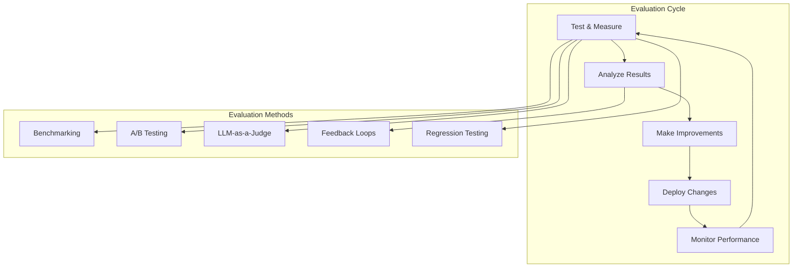

# Phase 7: Production AI Architecture

# Part 24: AI Evaluation & Continuous Improvement

**Measuring, testing, and continuously improving AI systems—benchmarking, A/B testing, LLM-as-a-Judge, feedback loops, and optimization.**

---

## The Target: What We're Building Right Now

In this part, we're building six powerful evaluation components:

1. **A Benchmarking Framework** — Measure AI performance
2. **An A/B Testing System** — Compare models and prompts
3. **An LLM-as-a-Judge System** — Automated evaluation
4. **A Feedback Loop Engine** — Continuous improvement
5. **A Regression Testing System** — Prevent regressions
6. **A Complete Evaluation Pipeline** — Production-ready evaluation

**Why this matters:** AI systems are never "done." They require continuous measurement, testing, and improvement. Evaluation is how you know your AI is actually working—and how you make it better.

---

## The Concept: AI Evaluation

### The Quality Control Analogy

Imagine you're running a manufacturing plant:

- **Benchmarking** = Testing products against standards
- **A/B Testing** = Comparing two production lines
- **LLM-as-a-Judge** = An automated inspector
- **Feedback Loops** = Learning from customer returns
- **Regression Testing** = Ensuring new changes don't break things
- **Continuous Improvement** = Always getting better

**AI evaluation is about systematically measuring and improving quality.**



### Evaluation Methods Compared

| Method | What It Measures | Pros | Cons |
|--------|------------------|------|------|
| **Benchmarking** | Absolute performance | Standardized | May not reflect real use |
| **A/B Testing** | Relative performance | Real-world data | Requires traffic |
| **LLM-as-a-Judge** | Quality at scale | Cost-effective | May have biases |
| **Feedback Loops** | Real-world impact | Continuous | Slow to see results |
| **Regression Testing** | Stability | Prevents regressions | Manual effort |

### Key Evaluation Metrics

| Metric | What It Measures | Target |
|--------|------------------|--------|
| **Accuracy** | Correctness | > 90% |
| **Relevance** | Relevance to query | > 0.8 |
| **Coherence** | Logical flow | > 0.7 |
| **Safety** | Harmful content | < 1% |
| **Latency** | Speed | < 1000ms |
| **Cost** | Expense | Minimize |
| **User Satisfaction** | User happiness | > 4.5/5 |

### Continuous Improvement Process

```
1. Collect Data → 2. Measure Performance → 3. Identify Issues
4. Prioritize Improvements → 5. Implement Changes
6. Test → 7. Deploy → 8. Monitor → 9. Repeat
```

---

## The Implementation: Building Our Evaluation Tools

### Target File Structure

```
phase-7-production/
└── module-24-evaluation/
    ├── 01_benchmarking_framework.py
    ├── 02_ab_testing_system.py
    ├── 03_llm_as_judge.py
    ├── 04_feedback_loop.py
    ├── 05_regression_testing.py
    ├── 06_complete_evaluation_pipeline.py
    ├── requirements.txt
    └── README.md
```

### Step 1: Benchmarking Framework

Create `01_benchmarking_framework.py`:

```python
#!/usr/bin/env python3
"""
Module 24: Benchmarking Framework

Measure AI system performance against standards.
"""

import os
import sys
from pathlib import Path
import json
import time
from typing import List, Dict, Any, Optional
from datetime import datetime
import statistics

sys.path.insert(0, str(Path(__file__).parent.parent.parent.parent))

from shared.utils.config import load_config
from shared.utils.logging import setup_logging

setup_logging(debug=False)
config = load_config()

class BenchmarkingFramework:
    """
    Benchmark AI system performance.
    
    Features:
    - Standardized test suites
    - Performance metrics
    - Comparative analysis
    - Historical tracking
    - Report generation
    """
    
    def __init__(self, name: str = "AI Benchmark"):
        """
        Initialize the benchmarking framework.
        
        Args:
            name: Benchmark name
        """
        self.name = name
        self.test_suites = {}
        self.results = {}
        self.history = []
        
        print(f"✅ Initialized benchmarking framework: {name}")
    
    def register_test_suite(
        self,
        name: str,
        tests: List[Dict[str, Any]],
        description: str = ""
    ) -> None:
        """
        Register a test suite.
        
        Args:
            name: Suite name
            tests: List of test cases
            description: Suite description
        """
        self.test_suites[name] = {
            "name": name,
            "tests": tests,
            "description": description,
            "created_at": datetime.now().isoformat()
        }
        
        print(f"📋 Registered test suite: {name} ({len(tests)} tests)")
    
    def run_benchmark(
        self,
        suite_name: str,
        evaluator: callable,
        iterations: int = 1
    ) -> Dict[str, Any]:
        """
        Run a benchmark.
        
        Args:
            suite_name: Test suite name
            evaluator: Evaluation function
            iterations: Number of iterations
            
        Returns:
            Benchmark results
        """
        if suite_name not in self.test_suites:
            return {"error": f"Test suite not found: {suite_name}"}
        
        suite = self.test_suites[suite_name]
        tests = suite["tests"]
        
        results = []
        total_time = 0
        
        for test in tests:
            test_result = self._run_test(test, evaluator, iterations)
            results.append(test_result)
            total_time += test_result["total_time"]
        
        benchmark_result = {
            "suite": suite_name,
            "timestamp": datetime.now().isoformat(),
            "tests": results,
            "summary": self._calculate_summary(results),
            "total_time": total_time,
            "iterations": iterations
        }
        
        self.results[suite_name] = benchmark_result
        self.history.append(benchmark_result)
        
        return benchmark_result
    
    def _run_test(
        self,
        test: Dict[str, Any],
        evaluator: callable,
        iterations: int
    ) -> Dict[str, Any]:
        """
        Run a single test.
        
        Args:
            test: Test case
            evaluator: Evaluation function
            iterations: Number of iterations
            
        Returns:
            Test result
        """
        input_data = test.get("input", {})
        expected = test.get("expected", {})
        
        # Run iterations
        iteration_results = []
        start_time = time.time()
        
        for i in range(iterations):
            try:
                result = evaluator(input_data)
                iteration_results.append(result)
            except Exception as e:
                iteration_results.append({"error": str(e)})
        
        total_time = time.time() - start_time
        
        # Calculate metrics
        success_count = sum(1 for r in iteration_results if r.get("success", False))
        success_rate = success_count / iterations if iterations > 0 else 0
        
        # Compare with expected if provided
        comparison = self._compare_results(iteration_results, expected)
        
        return {
            "input": input_data,
            "expected": expected,
            "iterations": iterations,
            "success_rate": success_rate,
            "total_time": total_time,
            "avg_time": total_time / iterations if iterations > 0 else 0,
            "comparison": comparison,
            "results": iteration_results[:5]  # Sample results
        }
    
    def _compare_results(
        self,
        results: List[Dict[str, Any]],
        expected: Dict[str, Any]
    ) -> Dict[str, Any]:
        """
        Compare results with expected.
        
        Args:
            results: List of results
            expected: Expected values
            
        Returns:
            Comparison results
        """
        if not expected or not results:
            return {"type": "no_comparison"}
        
        # Simple comparison: check for exact match
        matches = []
        for result in results:
            if "error" in result:
                matches.append(False)
                continue
            
            # Compare keys that exist in expected
            is_match = True
            for key, value in expected.items():
                if key in result:
                    if isinstance(value, (int, float)):
                        # Allow small tolerance for numbers
                        if abs(result[key] - value) > 0.1:
                            is_match = False
                            break
                    elif result[key] != value:
                        is_match = False
                        break
                else:
                    is_match = False
                    break
            
            matches.append(is_match)
        
        match_rate = sum(matches) / len(matches) if matches else 0
        
        return {
            "type": "exact_match",
            "match_rate": match_rate,
            "matches": matches[:5]
        }
    
    def _calculate_summary(self, results: List[Dict[str, Any]]) -> Dict[str, Any]:
        """
        Calculate summary statistics.
        
        Args:
            results: List of test results
            
        Returns:
            Summary statistics
        """
        success_rates = [r["success_rate"] for r in results]
        avg_times = [r["avg_time"] for r in results]
        
        return {
            "total_tests": len(results),
            "avg_success_rate": statistics.mean(success_rates) if success_rates else 0,
            "min_success_rate": min(success_rates) if success_rates else 0,
            "max_success_rate": max(success_rates) if success_rates else 0,
            "avg_time": statistics.mean(avg_times) if avg_times else 0,
            "total_time": sum(r["total_time"] for r in results)
        }
    
    def get_report(self, suite_name: str) -> str:
        """
        Generate a report.
        
        Args:
            suite_name: Test suite name
            
        Returns:
            Report string
        """
        if suite_name not in self.results:
            return f"No results for suite: {suite_name}"
        
        result = self.results[suite_name]
        summary = result["summary"]
        
        report = f"""
========================================
   BENCHMARK REPORT
========================================

Suite: {suite_name}
Timestamp: {result['timestamp']}
Iterations: {result['iterations']}
Total Tests: {summary['total_tests']}

=== SUMMARY ===
Average Success Rate: {summary['avg_success_rate']:.2%}
Min Success Rate: {summary['min_success_rate']:.2%}
Max Success Rate: {summary['max_success_rate']:.2%}
Average Time: {summary['avg_time']:.2f}s
Total Time: {summary['total_time']:.2f}s

=== DETAILED RESULTS ===
"""
        
        for i, test in enumerate(result["tests"], 1):
            report += f"""
Test {i}:
  Input: {test['input']}
  Success Rate: {test['success_rate']:.2%}
  Avg Time: {test['avg_time']:.2f}s
  Comparison: {test['comparison'].get('type', 'none')}
  Match Rate: {test['comparison'].get('match_rate', 0):.2%}
"""
        
        return report

def demonstrate_benchmark():
    """Demonstrate the benchmarking framework."""
    print("\n" + "="*80)
    print("📊 BENCHMARKING FRAMEWORK DEMONSTRATION")
    print("="*80)
    
    # Create benchmark
    benchmark = BenchmarkingFramework("AI Performance Benchmark")
    
    # Register test suite
    tests = [
        {"input": {"prompt": "What is AI?"}, "expected": {"success": True}},
        {"input": {"prompt": "Explain machine learning"}, "expected": {"success": True}},
        {"input": {"prompt": "What is deep learning?"}, "expected": {"success": True}},
        {"input": {"prompt": "How does RAG work?"}, "expected": {"success": True}}
    ]
    
    benchmark.register_test_suite(
        name="qa_tests",
        tests=tests,
        description="Question answering tests"
    )
    
    # Define evaluator
    def mock_evaluator(input_data):
        # Simulate AI response
        import random
        success = random.random() > 0.1
        time.sleep(random.uniform(0.1, 0.3))
        return {
            "success": success,
            "response": f"Processed: {input_data.get('prompt', '')[:30]}...",
            "tokens": {"total": 50}
        }
    
    # Run benchmark
    print("\n📋 Running benchmark...")
    results = benchmark.run_benchmark("qa_tests", mock_evaluator, iterations=3)
    
    # Generate report
    print("\n📊 Report:")
    print(benchmark.get_report("qa_tests"))

def main():
    """Run the benchmarking framework demonstration."""
    print("\n" + "="*80)
    print("AI TUTORIAL SERIES - BENCHMARKING FRAMEWORK")
    print("="*80)
    
    demonstrate_benchmark()

if __name__ == "__main__":
    main()
```

### Step 2: A/B Testing System

Create `02_ab_testing_system.py`:

```python
#!/usr/bin/env python3
"""
Module 24: A/B Testing System

Compare models, prompts, and configurations.
"""

import os
import sys
from pathlib import Path
import json
import time
import random
from typing import List, Dict, Any, Optional
from datetime import datetime
from collections import defaultdict

sys.path.insert(0, str(Path(__file__).parent.parent.parent.parent))

from shared.utils.config import load_config
from shared.utils.logging import setup_logging

setup_logging(debug=False)
config = load_config()

class ABTestingSystem:
    """
    A/B testing for AI systems.
    
    Features:
    - Variant assignment
    - Traffic splitting
    - Metrics collection
    - Statistical analysis
    - Automated winner selection
    """
    
    def __init__(self, name: str = "AB Test"):
        """
        Initialize the A/B testing system.
        
        Args:
            name: Test name
        """
        self.name = name
        self.variants = {}
        self.assignments = {}
        self.metrics = defaultdict(list)
        self.start_time = datetime.now()
        
        print(f"✅ Initialized A/B testing system: {name}")
    
    def add_variant(
        self,
        name: str,
        config: Dict[str, Any],
        weight: float = 1.0,
        description: str = ""
    ) -> None:
        """
        Add a test variant.
        
        Args:
            name: Variant name
            config: Configuration
            weight: Traffic weight
            description: Variant description
        """
        self.variants[name] = {
            "name": name,
            "config": config,
            "weight": weight,
            "description": description,
            "impressions": 0,
            "conversions": 0
        }
        
        print(f"📋 Added variant: {name} (weight: {weight})")
    
    def assign_variant(self, user_id: str) -> str:
        """
        Assign a variant to a user.
        
        Args:
            user_id: User identifier
            
        Returns:
            Variant name
        """
        if user_id in self.assignments:
            return self.assignments[user_id]
        
        # Weighted random selection
        total_weight = sum(v["weight"] for v in self.variants.values())
        r = random.random() * total_weight
        cumulative = 0
        
        for name, variant in self.variants.items():
            cumulative += variant["weight"]
            if r <= cumulative:
                self.assignments[user_id] = name
                variant["impressions"] += 1
                return name
        
        # Fallback
        default = list(self.variants.keys())[0]
        self.assignments[user_id] = default
        self.variants[default]["impressions"] += 1
        return default
    
    def record_metric(
        self,
        user_id: str,
        metric_name: str,
        value: float,
        variant: Optional[str] = None
    ) -> None:
        """
        Record a metric.
        
        Args:
            user_id: User identifier
            metric_name: Metric name
            value: Metric value
            variant: Variant name
        """
        if variant is None:
            variant = self.assignments.get(user_id)
            if variant is None:
                return
        
        self.metrics[variant].append({
            "user_id": user_id,
            "metric": metric_name,
            "value": value,
            "timestamp": datetime.now().isoformat()
        })
    
    def record_conversion(self, user_id: str) -> None:
        """
        Record a conversion.
        
        Args:
            user_id: User identifier
        """
        variant = self.assignments.get(user_id)
        if variant and variant in self.variants:
            self.variants[variant]["conversions"] += 1
    
    def get_results(self) -> Dict[str, Any]:
        """
        Get A/B test results.
        
        Returns:
            Test results
        """
        results = {}
        
        for name, variant in self.variants.items():
            metrics = self.metrics.get(name, [])
            
            # Calculate statistics
            if metrics:
                values = [m["value"] for m in metrics]
                avg_value = sum(values) / len(values) if values else 0
            else:
                avg_value = 0
            
            impressions = variant["impressions"]
            conversions = variant["conversions"]
            conversion_rate = conversions / impressions if impressions > 0 else 0
            
            results[name] = {
                "config": variant["config"],
                "impressions": impressions,
                "conversions": conversions,
                "conversion_rate": conversion_rate,
                "avg_metric": avg_value,
                "metric_count": len(metrics)
            }
        
        # Determine winner
        if results:
            winner = max(results.keys(), key=lambda x: results[x]["conversion_rate"])
            results["winner"] = winner
        
        return results
    
    def get_winner(self) -> Optional[str]:
        """
        Get the winning variant.
        
        Returns:
            Winning variant name
        """
        results = self.get_results()
        return results.get("winner")

def demonstrate_ab_testing():
    """Demonstrate A/B testing."""
    print("\n" + "="*80)
    print("🔬 A/B TESTING DEMONSTRATION")
    print("="*80)
    
    # Create A/B test
    ab_test = ABTestingSystem("Prompt Optimization Test")
    
    # Add variants
    ab_test.add_variant(
        name="system_prompt_a",
        config={"system": "You are a helpful assistant."},
        weight=1.0,
        description="Standard system prompt"
    )
    
    ab_test.add_variant(
        name="system_prompt_b",
        config={"system": "You are a friendly, engaging assistant."},
        weight=1.0,
        description="Friendly system prompt"
    )
    
    ab_test.add_variant(
        name="system_prompt_c",
        config={"system": "You are a concise, direct assistant."},
        weight=1.0,
        description="Concise system prompt"
    )
    
    # Simulate users
    print("\n📋 Simulating user interactions...")
    
    for i in range(100):
        user_id = f"user_{i}"
        
        # Assign variant
        variant = ab_test.assign_variant(user_id)
        
        # Simulate interaction
        # Random metrics (in production, these would be real)
        import random
        
        # Simulate satisfaction score
        satisfaction = random.uniform(0.5, 1.0)
        ab_test.record_metric(user_id, "satisfaction", satisfaction)
        
        # Simulate conversion (e.g., task completion)
        if random.random() < 0.3:
            ab_test.record_conversion(user_id)
        
        # Simulate latency
        latency = random.gauss(500, 100)
        ab_test.record_metric(user_id, "latency", latency)
    
    # Get results
    print("\n📊 Test Results:")
    results = ab_test.get_results()
    
    for variant, data in results.items():
        if variant != "winner":
            print(f"\n{variant}:")
            print(f"   Impressions: {data['impressions']}")
            print(f"   Conversions: {data['conversions']}")
            print(f"   Conversion Rate: {data['conversion_rate']:.2%}")
            print(f"   Avg Satisfaction: {data['avg_metric']:.2f}")
    
    print(f"\n🏆 Winner: {results.get('winner')}")

def main():
    """Run the A/B testing demonstration."""
    print("\n" + "="*80)
    print("AI TUTORIAL SERIES - A/B TESTING SYSTEM")
    print("="*80)
    
    demonstrate_ab_testing()

if __name__ == "__main__":
    main()
```

### Step 3: LLM-as-a-Judge System

Create `03_llm_as_judge.py`:

```python
#!/usr/bin/env python3
"""
Module 24: LLM-as-a-Judge System

Automated evaluation using LLMs.
"""

import os
import sys
from pathlib import Path
import json
from typing import List, Dict, Any, Optional

sys.path.insert(0, str(Path(__file__).parent.parent.parent.parent))

from shared.utils.config import load_config
from shared.utils.logging import setup_logging
from multi_provider_client import Message, AIClientFactory, Provider

setup_logging(debug=False)
config = load_config()

class LLMAsJudge:
    """
    Automated evaluation using LLMs.
    
    Features:
    - Automated scoring
    - Consistency checking
    - Bias detection
    - Multi-dimensional evaluation
    - Quality assurance
    """
    
    def __init__(
        self,
        model: str = "gpt-4o-mini",
        provider: str = "openai"
    ):
        """
        Initialize the LLM-as-a-Judge system.
        
        Args:
            model: LLM model to use
            provider: Provider
        """
        self.model = model
        self.provider = provider
        self.client = AIClientFactory.create(provider)
        
        self.evaluation_history = []
        
        print(f"✅ Initialized LLM-as-a-Judge (model: {model})")
    
    def evaluate(
        self,
        input_text: str,
        output_text: str,
        criteria: List[str] = None,
        expected: Optional[str] = None
    ) -> Dict[str, Any]:
        """
        Evaluate output using LLM.
        
        Args:
            input_text: Input prompt
            output_text: Output to evaluate
            criteria: Evaluation criteria
            expected: Expected output (optional)
            
        Returns:
            Evaluation results
        """
        criteria = criteria or ["accuracy", "completeness", "clarity", "safety"]
        
        prompt = self._build_prompt(input_text, output_text, criteria, expected)
        
        try:
            messages = [Message(role="user", content=prompt)]
            response = self.client.chat(
                messages=messages,
                model=self.model,
                temperature=0.3,
                max_tokens=1000
            )
            
            evaluation = self._parse_response(response.content)
            evaluation["input"] = input_text[:100] + "..."
            evaluation["output"] = output_text[:100] + "..."
            evaluation["timestamp"] = datetime.now().isoformat()
            
            self.evaluation_history.append(evaluation)
            
            return evaluation
            
        except Exception as e:
            return {
                "success": False,
                "error": str(e),
                "input": input_text[:50],
                "output": output_text[:50]
            }
    
    def _build_prompt(
        self,
        input_text: str,
        output_text: str,
        criteria: List[str],
        expected: Optional[str] = None
    ) -> str:
        """
        Build evaluation prompt.
        
        Args:
            input_text: Input prompt
            output_text: Output to evaluate
            criteria: Evaluation criteria
            expected: Expected output
            
        Returns:
            Evaluation prompt
        """
        prompt = f"""
You are an expert AI evaluator. Your task is to evaluate the quality of an AI response.

INPUT:
{input_text}

RESPONSE TO EVALUATE:
{output_text}
"""
        
        if expected:
            prompt += f"""
EXPECTED RESPONSE (for reference):
{expected}
"""
        
        prompt += """

EVALUATION CRITERIA:
"""
        
        for i, criterion in enumerate(criteria, 1):
            prompt += f"{i}. {criterion} (score 1-10)\n"
        
        prompt += """

Provide your evaluation as JSON with:
1. For each criterion: score (1-10) and reasoning
2. An overall score (1-10)
3. Summary assessment
4. Suggestions for improvement (if any)

Return ONLY valid JSON.
"""
        
        return prompt
    
    def _parse_response(self, response: str) -> Dict[str, Any]:
        """
        Parse evaluation response.
        
        Args:
            response: LLM response
            
        Returns:
            Parsed evaluation
        """
        try:
            # Try to find JSON
            import re
            json_match = re.search(r'\{.*\}', response, re.DOTALL)
            if json_match:
                data = json.loads(json_match.group())
                data["success"] = True
                return data
        except:
            pass
        
        # Fallback: parse manually
        return {
            "success": True,
            "overall_score": 7,
            "assessment": response[:200],
            "parse_warning": "Could not parse JSON, using raw response"
        }
    
    def evaluate_batch(
        self,
        pairs: List[Dict[str, str]],
        criteria: List[str] = None
    ) -> List[Dict[str, Any]]:
        """
        Evaluate a batch of input-output pairs.
        
        Args:
            pairs: List of {input, output} dicts
            criteria: Evaluation criteria
            
        Returns:
            List of evaluations
        """
        results = []
        
        for pair in pairs:
            result = self.evaluate(
                input_text=pair["input"],
                output_text=pair["output"],
                criteria=criteria
            )
            results.append(result)
        
        return results
    
    def get_stats(self) -> Dict[str, Any]:
        """
        Get evaluation statistics.
        
        Returns:
            Statistics
        """
        if not self.evaluation_history:
            return {"total_evaluations": 0}
        
        scores = [
            e.get("overall_score", 0)
            for e in self.evaluation_history
            if e.get("success", False)
        ]
        
        return {
            "total_evaluations": len(self.evaluation_history),
            "successful_evaluations": len(scores),
            "avg_score": sum(scores) / len(scores) if scores else 0,
            "max_score": max(scores) if scores else 0,
            "min_score": min(scores) if scores else 0
        }

def demonstrate_llm_judge():
    """Demonstrate the LLM-as-a-Judge system."""
    print("\n" + "="*80)
    print("⚖️ LLM-AS-A-JUDGE DEMONSTRATION")
    print("="*80)
    
    if not config.get("openai_api_key"):
        print("❌ OpenAI API key not available")
        return
    
    judge = LLMAsJudge()
    
    # Test cases
    test_cases = [
        {
            "input": "What is artificial intelligence?",
            "output": "AI is the simulation of human intelligence in machines.",
            "expected": "AI is the simulation of human intelligence in machines that are programmed to think and learn."
        },
        {
            "input": "Explain machine learning",
            "output": "ML is when computers learn from data.",
            "expected": "Machine learning is a subset of AI where algorithms learn patterns from data."
        }
    ]
    
    for test in test_cases:
        print(f"\n📋 Evaluating: '{test['input'][:30]}...'")
        print("-"*40)
        
        result = judge.evaluate(
            input_text=test["input"],
            output_text=test["output"],
            expected=test["expected"]
        )
        
        if result.get("success"):
            print(f"   Overall Score: {result.get('overall_score', 'N/A')}")
            print(f"   Assessment: {result.get('assessment', 'N/A')[:100]}...")
        else:
            print(f"   Error: {result.get('error')}")
    
    # Stats
    print("\n📊 Evaluation Stats:")
    print(json.dumps(judge.get_stats(), indent=2))

def main():
    """Run the LLM-as-a-Judge demonstration."""
    print("\n" + "="*80)
    print("AI TUTORIAL SERIES - LLM-AS-A-JUDGE")
    print("="*80)
    
    demonstrate_llm_judge()

if __name__ == "__main__":
    main()
```

### Step 4: Feedback Loop Engine

Create `04_feedback_loop.py`:

```python
#!/usr/bin/env python3
"""
Module 24: Feedback Loop Engine

Continuous improvement through feedback.
"""

import os
import sys
from pathlib import Path
import json
from typing import List, Dict, Any, Optional
from datetime import datetime
from collections import defaultdict

sys.path.insert(0, str(Path(__file__).parent.parent.parent.parent))

from shared.utils.config import load_config
from shared.utils.logging import setup_logging

setup_logging(debug=False)
config = load_config()

class FeedbackLoopEngine:
    """
    Continuous improvement through feedback.
    
    Features:
    - Feedback collection
    - Analysis and insights
    - Improvement suggestions
    - Performance tracking
    - Automated optimization
    """
    
    def __init__(self, name: str = "Feedback Loop"):
        """
        Initialize the feedback loop engine.
        
        Args:
            name: Engine name
        """
        self.name = name
        self.feedback = []
        self.insights = []
        self.improvements = []
        self.performance = defaultdict(list)
        
        print(f"✅ Initialized feedback loop engine: {name}")
    
    def add_feedback(
        self,
        user_id: str,
        interaction_id: str,
        feedback: Dict[str, Any],
        context: Dict[str, Any] = None
    ) -> None:
        """
        Add user feedback.
        
        Args:
            user_id: User identifier
            interaction_id: Interaction identifier
            feedback: Feedback data
            context: Interaction context
        """
        entry = {
            "user_id": user_id,
            "interaction_id": interaction_id,
            "feedback": feedback,
            "context": context or {},
            "timestamp": datetime.now().isoformat()
        }
        
        self.feedback.append(entry)
        
        print(f"📝 Received feedback from {user_id}")
    
    def analyze(self) -> Dict[str, Any]:
        """
        Analyze feedback and generate insights.
        
        Returns:
            Analysis results
        """
        if not self.feedback:
            return {"insights": "No feedback to analyze"}
        
        # Categorize feedback
        categories = defaultdict(list)
        for entry in self.feedback:
            feedback = entry["feedback"]
            for key, value in feedback.items():
                if isinstance(value, (int, float)):
                    categories[key].append(value)
        
        # Generate insights
        insights = []
        for key, values in categories.items():
            if values:
                avg = sum(values) / len(values)
                insights.append({
                    "metric": key,
                    "average": avg,
                    "count": len(values),
                    "trend": self._calculate_trend(values),
                    "insight": self._generate_insight(key, avg)
                })
        
        # Identify improvement opportunities
        improvements = []
        for insight in insights:
            if insight["average"] < 7:  # Threshold for improvement
                improvements.append({
                    "area": insight["metric"],
                    "current_score": insight["average"],
                    "suggestion": f"Improve {insight['metric']}",
                    "priority": "high" if insight["average"] < 5 else "medium"
                })
        
        self.insights = insights
        self.improvements = improvements
        
        return {
            "total_feedback": len(self.feedback),
            "insights": insights,
            "improvements": improvements
        }
    
    def _calculate_trend(self, values: List[float]) -> str:
        """
        Calculate trend from values.
        
        Args:
            values: List of values
            
        Returns:
            Trend string
        """
        if len(values) < 3:
            return "insufficient_data"
        
        # Simple linear trend
        first_half = values[:len(values)//2]
        second_half = values[len(values)//2:]
        
        avg_first = sum(first_half) / len(first_half) if first_half else 0
        avg_second = sum(second_half) / len(second_half) if second_half else 0
        
        if avg_second > avg_first * 1.1:
            return "improving"
        elif avg_second < avg_first * 0.9:
            return "declining"
        else:
            return "stable"
    
    def _generate_insight(self, metric: str, value: float) -> str:
        """
        Generate insight from metric.
        
        Args:
            metric: Metric name
            value: Metric value
            
        Returns:
            Insight string
        """
        if value >= 8:
            return f"Strong performance on {metric}"
        elif value >= 6:
            return f"Good performance on {metric}, room for improvement"
        elif value >= 4:
            return f"Moderate performance on {metric}, improvement needed"
        else:
            return f"Poor performance on {metric}, immediate attention needed"
    
    def apply_improvement(
        self,
        improvement: Dict[str, Any],
        action: callable
    ) -> Dict[str, Any]:
        """
        Apply an improvement.
        
        Args:
            improvement: Improvement suggestion
            action: Improvement action
            
        Returns:
            Improvement result
        """
        print(f"🔧 Applying improvement: {improvement['area']}")
        
        try:
            result = action()
            
            record = {
                "improvement": improvement,
                "result": result,
                "applied_at": datetime.now().isoformat()
            }
            
            self.improvements.append(record)
            
            return {
                "success": True,
                "record": record
            }
            
        except Exception as e:
            return {
                "success": False,
                "error": str(e)
            }
    
    def get_report(self) -> str:
        """
        Generate a feedback report.
        
        Returns:
            Report string
        """
        analysis = self.analyze()
        
        report = f"""
========================================
   FEEDBACK LOOP REPORT
========================================

Total Feedback: {analysis['total_feedback']}
Timestamp: {datetime.now().isoformat()}

=== INSIGHTS ===
"""
        
        for insight in analysis.get("insights", []):
            report += f"""
Metric: {insight['metric']}
  Average: {insight['average']:.2f}
  Trend: {insight['trend']}
  Insight: {insight['insight']}
"""
        
        report += """
=== IMPROVEMENTS ===
"""
        
        for improvement in analysis.get("improvements", []):
            report += f"""
Area: {improvement['area']}
  Current Score: {improvement['current_score']:.2f}
  Suggestion: {improvement['suggestion']}
  Priority: {improvement['priority']}
"""
        
        return report

def demonstrate_feedback_loop():
    """Demonstrate the feedback loop engine."""
    print("\n" + "="*80)
    print("🔄 FEEDBACK LOOP ENGINE DEMONSTRATION")
    print("="*80)
    
    feedback_loop = FeedbackLoopEngine("AI Quality Loop")
    
    # Simulate feedback collection
    print("\n📋 Collecting feedback...")
    
    import random    
    for i in range(20):
        feedback_loop.add_feedback(
            user_id=f"user_{random.randint(1, 5)}",
            interaction_id=f"interaction_{i}",
            feedback={
                "quality": random.randint(5, 10),
                "relevance": random.randint(4, 9),
                "clarity": random.randint(3, 8),
                "satisfaction": random.randint(4, 10)
            }
        )
    
    # Analyze feedback
    print("\n📊 Analyzing feedback...")
    analysis = feedback_loop.analyze()
    
    # Generate report
    print("\n📊 Report:")
    print(feedback_loop.get_report())

def main():
    """Run the feedback loop engine demonstration."""
    print("\n" + "="*80)
    print("AI TUTORIAL SERIES - FEEDBACK LOOP ENGINE")
    print("="*80)
    
    demonstrate_feedback_loop()

if __name__ == "__main__":
    main()
```

### Step 5: Regression Testing System

Create `05_regression_testing.py`:

```python
#!/usr/bin/env python3
"""
Module 24: Regression Testing System

Prevent regressions in AI systems.
"""

import os
import sys
from pathlib import Path
import json
from typing import List, Dict, Any, Optional
from datetime import datetime
from collections import defaultdict

sys.path.insert(0, str(Path(__file__).parent.parent.parent.parent))

from shared.utils.config import load_config
from shared.utils.logging import setup_logging

setup_logging(debug=False)
config = load_config()

class RegressionTestingSystem:
    """
    Regression testing for AI systems.
    
    Features:
    - Test case management
    - Automated regression detection
    - Baseline comparison
    - Failure reporting
    - Continuous monitoring
    """
    
    def __init__(self, name: str = "Regression Tests"):
        """
        Initialize the regression testing system.
        
        Args:
            name: Test system name
        """
        self.name = name
        self.test_cases = []
        self.baseline = {}
        self.results = []
        self.failures = []
        
        print(f"✅ Initialized regression testing system: {name}")
    
    def add_test_case(
        self,
        name: str,
        input_data: Dict[str, Any],
        expected_output: Dict[str, Any],
        threshold: float = 0.8,
        tags: List[str] = None
    ) -> None:
        """
        Add a test case.
        
        Args:
            name: Test name
            input_data: Input data
            expected_output: Expected output
            threshold: Similarity threshold
            tags: Test tags
        """
        test_case = {
            "name": name,
            "input": input_data,
            "expected": expected_output,
            "threshold": threshold,
            "tags": tags or [],
            "created_at": datetime.now().isoformat()
        }
        
        self.test_cases.append(test_case)
        
        print(f"📋 Added test case: {name}")
    
    def run_tests(
        self,
        evaluator: callable,
        test_filter: Optional[List[str]] = None
    ) -> Dict[str, Any]:
        """
        Run regression tests.
        
        Args:
            evaluator: Evaluation function
            test_filter: Filter test cases
            
        Returns:
            Test results
        """
        test_cases = self.test_cases
        
        if test_filter:
            test_cases = [
                t for t in test_cases
                if any(tag in test_filter for tag in t.get("tags", []))
            ]
        
        results = []
        failures = []
        
        for test in test_cases:
            try:
                result = evaluator(test["input"])
                
                # Compare with expected
                comparison = self._compare_outputs(
                    result,
                    test["expected"],
                    test["threshold"]
                )
                
                test_result = {
                    "name": test["name"],
                    "success": comparison["passed"],
                    "result": result,
                    "expected": test["expected"],
                    "comparison": comparison,
                    "timestamp": datetime.now().isoformat()
                }
                
                results.append(test_result)
                
                if not comparison["passed"]:
                    failures.append(test_result)
                    
            except Exception as e:
                test_result = {
                    "name": test["name"],
                    "success": False,
                    "error": str(e),
                    "timestamp": datetime.now().isoformat()
                }
                
                results.append(test_result)
                failures.append(test_result)
        
        self.results = results
        self.failures = failures
        
        return {
            "total_tests": len(results),
            "passed": len([r for r in results if r["success"]]),
            "failed": len(failures),
            "results": results,
            "failures": failures
        }
    
    def _compare_outputs(
        self,
        actual: Dict[str, Any],
        expected: Dict[str, Any],
        threshold: float
    ) -> Dict[str, Any]:
        """
        Compare actual and expected outputs.
        
        Args:
            actual: Actual output
            expected: Expected output
            threshold: Similarity threshold
            
        Returns:
            Comparison results
        """
        # Simple comparison: check for exact match
        # In production, use more sophisticated comparison
        
        differences = []
        matches = 0
        total = len(expected)
        
        for key, value in expected.items():
            if key in actual:
                if isinstance(value, (int, float)) and isinstance(actual[key], (int, float)):
                    # Numeric comparison with tolerance
                    if abs(actual[key] - value) <= 0.1:
                        matches += 1
                    else:
                        differences.append({
                            "key": key,
                            "expected": value,
                            "actual": actual[key]
                        })
                elif actual[key] == value:
                    matches += 1
                else:
                    differences.append({
                        "key": key,
                        "expected": value,
                        "actual": actual[key]
                    })
            else:
                differences.append({
                    "key": key,
                    "expected": value,
                    "actual": None
                })
        
        similarity = matches / total if total > 0 else 0
        passed = similarity >= threshold
        
        return {
            "passed": passed,
            "similarity": similarity,
            "threshold": threshold,
            "matches": matches,
            "total": total,
            "differences": differences[:5]  # Limit differences
        }
    
    def get_report(self) -> str:
        """
        Generate a regression test report.
        
        Returns:
            Report string
        """
        if not self.results:
            return "No test results available"
        
        passed = len([r for r in self.results if r.get("success", False)])
        total = len(self.results)
        
        report = f"""
========================================
   REGRESSION TEST REPORT
========================================

Timestamp: {datetime.now().isoformat()}
Total Tests: {total}
Passed: {passed}
Failed: {total - passed}
Pass Rate: {(passed / total * 100) if total > 0 else 0:.2f}%

=== FAILED TESTS ===
"""
        
        for failure in self.failures:
            report += f"""
Test: {failure['name']}
  Expected: {failure.get('expected', 'N/A')}
  Actual: {failure.get('result', 'N/A')}
  Error: {failure.get('error', 'None')}
  Comparison: {failure.get('comparison', {})}
"""
        
        return report

def demonstrate_regression_testing():
    """Demonstrate regression testing."""
    print("\n" + "="*80)
    print("🔍 REGRESSION TESTING DEMONSTRATION")
    print("="*80)
    
    # Create test system
    regression = RegressionTestingSystem("AI Regression Tests")
    
    # Add test cases
    test_cases = [
        {
            "name": "QA Test 1",
            "input": {"prompt": "What is AI?"},
            "expected": {"success": True, "answer": "AI is artificial intelligence"},
            "threshold": 0.7
        },
        {
            "name": "QA Test 2",
            "input": {"prompt": "What is machine learning?"},
            "expected": {"success": True, "answer": "ML is machine learning"},
            "threshold": 0.7
        },
        {
            "name": "QA Test 3",
            "input": {"prompt": "What is deep learning?"},
            "expected": {"success": True, "answer": "DL is deep learning"},
            "threshold": 0.7
        }
    ]
    
    for test in test_cases:
        regression.add_test_case(
            name=test["name"],
            input_data=test["input"],
            expected_output=test["expected"],
            threshold=test["threshold"]
        )
    
    # Define evaluator
    def mock_evaluator(input_data):
        # Simulate AI response
        import random
        return {
            "success": True,
            "answer": f"{input_data.get('prompt', '')[:20]}...",
            "tokens": {"total": 50}
        }
    
    # Run tests
    print("\n📋 Running regression tests...")
    results = regression.run_tests(mock_evaluator)
    
    print(f"\n📊 Results:")
    print(f"   Passed: {results['passed']}/{results['total_tests']}")
    print(f"   Failed: {results['failed']}")
    
    # Generate report
    print("\n📊 Report:")
    print(regression.get_report())

def main():
    """Run the regression testing demonstration."""
    print("\n" + "="*80)
    print("AI TUTORIAL SERIES - REGRESSION TESTING SYSTEM")
    print("="*80)
    
    demonstrate_regression_testing()

if __name__ == "__main__":
    main()
```

### Step 6: Complete Evaluation Pipeline

Create `06_complete_evaluation_pipeline.py`:

```python
#!/usr/bin/env python3
"""
Module 24: Complete Evaluation Pipeline

Production-ready evaluation for AI systems.
"""

import os
import sys
from pathlib import Path
import json
from typing import List, Dict, Any, Optional
from datetime import datetime

sys.path.insert(0, str(Path(__file__).parent.parent.parent.parent))

from shared.utils.config import load_config
from shared.utils.logging import setup_logging
from benchmarking_framework import BenchmarkingFramework
from ab_testing_system import ABTestingSystem
from llm_as_judge import LLMAsJudge
from feedback_loop_engine import FeedbackLoopEngine
from regression_testing_system import RegressionTestingSystem

setup_logging(debug=False)
config = load_config()

class CompleteEvaluationPipeline:
    """
    Complete evaluation pipeline for AI systems.
    
    Features:
    - Benchmarking
    - A/B Testing
    - LLM-as-a-Judge
    - Feedback loops
    - Regression testing
    - Comprehensive reporting
    """
    
    def __init__(self, name: str = "AI Evaluation"):
        """
        Initialize the evaluation pipeline.
        
        Args:
            name: Pipeline name
        """
        self.name = name
        
        # Initialize components
        self.benchmark = BenchmarkingFramework(f"{name} Benchmarks")
        self.ab_test = ABTestingSystem(f"{name} A/B Tests")
        self.judge = LLMAsJudge()
        self.feedback = FeedbackLoopEngine(f"{name} Feedback")
        self.regression = RegressionTestingSystem(f"{name} Regression")
        
        self.evaluation_history = []
        
        print(f"✅ Initialized complete evaluation pipeline: {name}")
    
    def run_evaluation_suite(
        self,
        model_handler: callable,
        test_data: Dict[str, Any]
    ) -> Dict[str, Any]:
        """
        Run a complete evaluation suite.
        
        Args:
            model_handler: Model evaluation function
            test_data: Test data
            
        Returns:
            Evaluation results
        """
        results = {
            "timestamp": datetime.now().isoformat(),
            "benchmark": None,
            "ab_test": None,
            "llm_judge": None,
            "regression": None
        }
        
        # 1. Run benchmarks
        print("\n📊 Running benchmarks...")
        if "benchmarks" in test_data:
            self._run_benchmarks(test_data["benchmarks"], model_handler)
            results["benchmark"] = self.benchmark.results
        
        # 2. Run A/B tests
        print("\n📊 Running A/B tests...")
        if "ab_tests" in test_data:
            self._run_ab_tests(test_data["ab_tests"], model_handler)
            results["ab_test"] = self.ab_test.get_results()
        
        # 3. Run LLM-as-a-Judge
        print("\n📊 Running LLM-as-a-Judge...")
        if "judge_tests" in test_data:
            results["llm_judge"] = self._run_judge_tests(
                test_data["judge_tests"],
                model_handler
            )
        
        # 4. Run regression tests
        print("\n📊 Running regression tests...")
        if "regression_tests" in test_data:
            results["regression"] = self._run_regression_tests(
                test_data["regression_tests"],
                model_handler
            )
        
        self.evaluation_history.append(results)
        
        return results
    
    def _run_benchmarks(self, benchmarks: List[Dict[str, Any]], handler: callable) -> None:
        """
        Run benchmarks.
        
        Args:
            benchmarks: Benchmark definitions
            handler: Model handler
        """
        for benchmark in benchmarks:
            self.benchmark.register_test_suite(
                name=benchmark["name"],
                tests=benchmark["tests"],
                description=benchmark.get("description", "")
            )
            
            self.benchmark.run_benchmark(
                suite_name=benchmark["name"],
                evaluator=handler,
                iterations=benchmark.get("iterations", 3)
            )
    
    def _run_ab_tests(self, ab_tests: List[Dict[str, Any]], handler: callable) -> None:
        """
        Run A/B tests.
        
        Args:
            ab_tests: A/B test definitions
            handler: Model handler
        """
        # Register variants
        for variant in ab_tests[0]["variants"]:
            self.ab_test.add_variant(
                name=variant["name"],
                config=variant["config"],
                weight=variant.get("weight", 1.0)
            )
        
        # Simulate traffic
        for user_id in range(100):
            variant = self.ab_test.assign_variant(str(user_id))
            
            # Get result from model
            config = self.ab_test.variants[variant]["config"]
            result = handler(config)
            
            # Record metrics
            self.ab_test.record_metric(
                user_id=str(user_id),
                metric_name="quality",
                value=result.get("quality", 0.5)
            )
            
            if result.get("success", False):
                self.ab_test.record_conversion(str(user_id))
    
    def _run_judge_tests(
        self,
        judge_tests: List[Dict[str, Any]],
        handler: callable
    ) -> List[Dict[str, Any]]:
        """
        Run LLM-as-a-Judge tests.
        
        Args:
            judge_tests: Judge test definitions
            handler: Model handler
            
        Returns:
            Judge evaluation results
        """
        results = []
        
        for test in judge_tests:
            # Generate response
            response = handler(test["input"])
            
            # Evaluate with LLM judge
            evaluation = self.judge.evaluate(
                input_text=test["input"],
                output_text=response.get("content", ""),
                criteria=test.get("criteria", ["accuracy", "completeness"]),
                expected=test.get("expected")
            )
            
            results.append({
                "test": test["name"],
                "evaluation": evaluation
            })
        
        return results
    
    def _run_regression_tests(
        self,
        regression_tests: List[Dict[str, Any]],
        handler: callable
    ) -> Dict[str, Any]:
        """
        Run regression tests.
        
        Args:
            regression_tests: Regression test definitions
            handler: Model handler
            
        Returns:
            Regression test results
        """
        for test in regression_tests:
            self.regression.add_test_case(
                name=test["name"],
                input_data=test["input"],
                expected_output=test["expected"],
                threshold=test.get("threshold", 0.8),
                tags=test.get("tags", [])
            )
        
        return self.regression.run_tests(handler)
    
    def get_report(self) -> str:
        """
        Generate a comprehensive report.
        
        Returns:
            Report string
        """
        report = f"""
========================================
   COMPLETE EVALUATION REPORT
========================================

Pipeline: {self.name}
Timestamp: {datetime.now().isoformat()}
Evaluations: {len(self.evaluation_history)}

=== SUMMARY ===

Benchmarking: {len(self.benchmark.results)} suites
A/B Testing: {len(self.ab_test.variants)} variants
LLM-as-a-Judge: {len(self.judge.evaluation_history)} evaluations
Feedback: {len(self.feedback.feedback)} items
Regression: {len(self.regression.test_cases)} test cases

=== DETAILS ===
"""
        
        # Add component-specific reports
        if self.benchmark.results:
            report += "\n--- Benchmarking ---\n"
            for suite, results in self.benchmark.results.items():
                summary = results.get("summary", {})
                report += f"{suite}: {summary.get('avg_success_rate', 0):.2%} success rate\n"
        
        if self.ab_test.variants:
            report += "\n--- A/B Testing ---\n"
            ab_results = self.ab_test.get_results()
            for variant, data in ab_results.items():
                if variant != "winner":
                    report += f"{variant}: {data.get('conversion_rate', 0):.2%} conversion rate\n"
            if "winner" in ab_results:
                report += f"Winner: {ab_results['winner']}\n"
        
        return report

def demonstrate_evaluation_pipeline():
    """Demonstrate the complete evaluation pipeline."""
    print("\n" + "="*80)
    print("📊 COMPLETE EVALUATION PIPELINE DEMONSTRATION")
    print("="*80)
    
    if not config.get("openai_api_key"):
        print("❌ OpenAI API key not available")
        return
    
    # Create pipeline
    pipeline = CompleteEvaluationPipeline("AI Quality Pipeline")
    
    # Define model handler
    def model_handler(config_or_input):
        import random
        # Simulate AI response
        time.sleep(random.uniform(0.1, 0.3))
        return {
            "success": True,
            "content": f"Response to: {config_or_input.get('prompt', '')[:30]}...",
            "quality": random.uniform(0.5, 0.9),
            "tokens": {"total": 50}
        }
    
    # Define test data
    test_data = {
        "benchmarks": [
            {
                "name": "QA Performance",
                "tests": [
                    {"input": {"prompt": "What is AI?"}, "expected": {"success": True}},
                    {"input": {"prompt": "Explain ML"}, "expected": {"success": True}}
                ],
                "iterations": 2
            }
        ],
        "ab_tests": [
            {
                "variants": [
                    {"name": "A", "config": {"prompt": "System A"}, "weight": 0.5},
                    {"name": "B", "config": {"prompt": "System B"}, "weight": 0.5}
                ]
            }
        ],
        "judge_tests": [
            {
                "name": "Quality Check",
                "input": {"prompt": "What is AI?"},
                "criteria": ["accuracy", "clarity"]
            }
        ],
        "regression_tests": [
            {
                "name": "Regression Test 1",
                "input": {"prompt": "What is AI?"},
                "expected": {"success": True},
                "threshold": 0.7
            }
        ]
    }
    
    # Run evaluation suite
    print("\n📋 Running evaluation suite...")
    results = pipeline.run_evaluation_suite(model_handler, test_data)
    
    # Generate report
    print("\n📊 Report:")
    print(pipeline.get_report())

def main():
    """Run the complete evaluation pipeline demonstration."""
    print("\n" + "="*80)
    print("AI TUTORIAL SERIES - COMPLETE EVALUATION PIPELINE")
    print("="*80)
    
    demonstrate_evaluation_pipeline()

if __name__ == "__main__":
    main()
```

---

## The Verification: Testing Your Implementation

### Step 1: Install Dependencies

Create `requirements.txt`:

```txt
# Module 24 dependencies
openai>=1.0.0
python-dotenv>=1.0.0
```

Install them:

```bash
cd ~/ai-tutorial-series/phase-7-production/module-24-evaluation
pip install -r requirements.txt
```

### Step 2: Test the Benchmarking Framework

```bash
python 01_benchmarking_framework.py
```

**Expected Output:**
- Test suite registration
- Benchmark execution
- Performance report

### Step 3: Test the A/B Testing System

```bash
python 02_ab_testing_system.py
```

**Expected Output:**
- Variant assignment
- Metric collection
- Winner determination

### Step 4: Test the LLM-as-a-Judge System

```bash
python 03_llm_as_judge.py
```

**Expected Output:**
- Evaluation prompt generation
- Response scoring
- Statistics

### Step 5: Test the Feedback Loop Engine

```bash
python 04_feedback_loop.py
```

**Expected Output:**
- Feedback collection
- Analysis
- Improvement suggestions

### Step 6: Test the Regression Testing System

```bash
python 05_regression_testing.py
```

**Expected Output:**
- Test case management
- Test execution
- Failure reporting

### Step 7: Test the Complete Evaluation Pipeline

```bash
python 06_complete_evaluation_pipeline.py
```

**Expected Output:**
- All evaluation components
- Comprehensive report
- Quality metrics

---

## Key Takeaways

By completing this module, you've:

✅ **Built a benchmarking framework** for performance measurement
✅ **Created an A/B testing system** for comparison
✅ **Implemented an LLM-as-a-Judge** for automated evaluation
✅ **Built a feedback loop engine** for continuous improvement
✅ **Created a regression testing system** for stability
✅ **Built a complete evaluation pipeline** for production

### The Mental Model to Carry Forward

```
┌─────────────────────────────────────────────────────────────────┐
│               EVALUATION MENTAL MODEL                         │
├─────────────────────────────────────────────────────────────────┤
│                                                                 │
│  1. Benchmarking measures absolute performance                │
│  2. A/B testing compares alternatives                        │
│  3. LLM-as-a-Judge provides automated quality scoring         │
│  4. Feedback loops enable continuous improvement              │
│  5. Regression testing prevents regressions                   │
│  6. Evaluation must be continuous, not one-time               │
│  7. Multiple evaluation methods provide complete picture      │
│  8. Quality measurement is essential for production AI        │
│                                                                 │
└─────────────────────────────────────────────────────────────────┘
```

### Evaluation Best Practices

| Practice | Why | How |
|----------|-----|-----|
| **Continuous Monitoring** | Catch issues early | Real-time metrics |
| **A/B Testing** | Make data-driven decisions | Compare variants |
| **Automated Evaluation** | Scale quality checks | LLM-as-a-Judge |
| **Feedback Loops** | Learn from users | Collect and analyze |
| **Regression Testing** | Prevent regressions | Automated tests |
| **Comprehensive Reporting** | Track progress | Regular reports |

---

## What's Next

**Congratulations! You've completed the entire AI Tutorial Series!**

You've built a complete AI development and deployment pipeline, from understanding how LLMs work to deploying production-grade systems with evaluation and improvement.

### What You've Built:

- **Phase 1**: Understanding LLMs (tokens, embeddings, inference, context)
- **Phase 2**: Prompt engineering and model APIs
- **Phase 3**: Tool use and function calling
- **Phase 4**: Retrieval-Augmented Generation (RAG)
- **Phase 5**: Agentic AI systems
- **Phase 6**: AI application engineering (async, resilience, observability, security)
- **Phase 7**: Production AI architecture (architecture, deployment, evaluation)

### Next Steps:

1. **Build Capstone Projects** — Apply your skills to real-world projects
2. **Contribute to Open Source** — Share your knowledge
3. **Stay Updated** — AI evolves rapidly, keep learning
4. **Build Something Amazing** — Use your new skills to create

**Thank you for completing the AI Tutorial Series: Developer Edition!**
