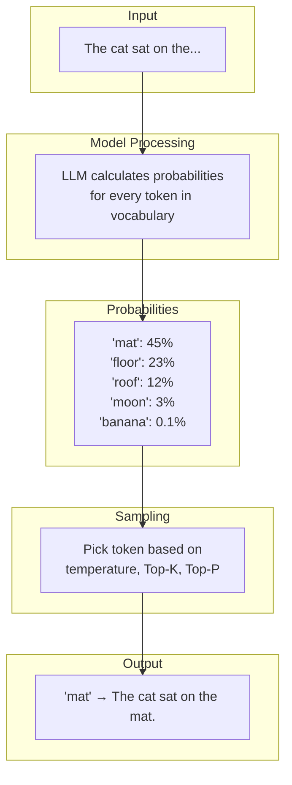
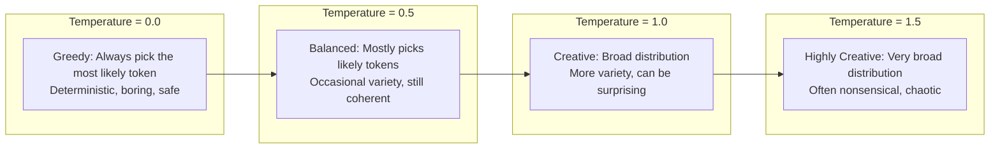
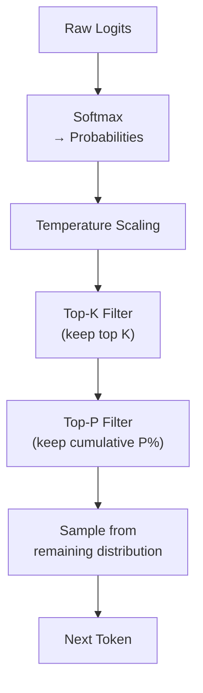

# Phase 1: Understanding How LLMs Actually Work

# Part 3: How LLM Inference Works

**Peeking under the hood of text generation—understanding probability, randomness, and why LLMs sometimes fail.**

---

## The Target: What We're Building Right Now

In this part, we're building six interconnected tools:

1. **A Text Generator with Adjustable Parameters** — Control temperature, Top-K, and Top-P
2. **A Probability Visualizer** — See the next-token probabilities in real-time
3. **A Sampling Strategy Explorer** — Compare different sampling methods
4. **A Hallucination Analyzer** — Understand why LLMs make things up
5. **A Deterministic vs. Random Generator** — See the difference between modes
6. **An Interactive Inference Playground** — Experiment with all parameters live

**Why this matters:** Understanding inference is the key to controlling LLM behavior. Without this knowledge, you're just guessing. With it, you can build reliable, predictable AI applications.

---

## The Concept: How LLMs Actually Generate Text

### The Prediction Machine Analogy

Imagine you're playing a game of "What comes next?" where you have to predict the next word in a sentence.

Someone says: "The cat sat on the..."

What word comes next?

- "mat" (most likely)
- "floor" (somewhat likely)
- "roof" (less likely)
- "moon" (very unlikely)
- "banana" (almost impossible)

**This is exactly what an LLM does, but at a massive scale.**

The model looks at all the words so far, calculates the probability of every possible next token, and picks one according to rules we set.



### The Complete Inference Process

Here's what happens every time you make an API call, step by step:

```
Step 1: Input Processing
        Your prompt → Tokens → Embeddings

Step 2: Forward Pass Through Model
        Embeddings pass through all layers of the neural network
        Each layer processes the embeddings
        Final layer produces logits (raw scores for each token)

Step 3: Convert Logits to Probabilities
        Apply softmax: converts scores to probabilities (0 to 1)
        All probabilities sum to 1.0

Step 4: Apply Sampling Strategy
        Temperature: Scale the probabilities
        Top-K: Only consider the K most likely tokens
        Top-P: Only consider tokens that cumulatively reach P%

Step 5: Choose the Next Token
        Sample from the filtered probability distribution
        Or pick the highest (greedy) if temperature = 0

Step 6: Append Token and Repeat
        Add the chosen token to the context
        Repeat steps 2-5 until max_tokens or stop condition
```

**In plain English:** The model predicts one token at a time, each time looking at everything it has generated so far.

### Temperature: The Creativity Dial

Temperature is the most important parameter you'll control. Think of it as a "creativity dial":



**The math behind it:**

```
Original probability: P(token) = softmax(logits)

With temperature: P(token) = softmax(logits / temperature)

When temperature < 1.0:
- High probabilities become higher
- Low probabilities become lower
- Distribution becomes sharper (more deterministic)

When temperature > 1.0:
- High probabilities become lower
- Low probabilities become higher
- Distribution becomes flatter (more random)

When temperature = 0.0:
- Only the highest probability token is ever chosen (greedy)
- Output is deterministic (same prompt → same output)
```

**Temperature in practice:**

| Temperature | Use Case | Example |
|-------------|----------|---------|
| 0.0 | Code generation, data extraction | "Extract the email from this text" |
| 0.3 | Factual answers, Q&A | "What is the capital of France?" |
| 0.7 | General chat, creative writing | "Write a story about a robot" |
| 1.0 | Brainstorming, poetry | "Write a poem about AI" |
| 1.5 | Experimental, art | "Generate surreal descriptions" |

### Top-K: Limiting the Candidates

Top-K says: "Only consider the K most likely tokens."

```
Example: Top-K = 5

Token probabilities:
1. "mat": 45%
2. "floor": 23%
3. "roof": 12%
4. "table": 8%
5. "chair": 5%
6. "moon": 3%
7. "banana": 2%
... (all other tokens)

With Top-K = 5:
Only consider tokens 1-5
Probability of "moon" becomes 0%
Probability of "mat" becomes 45/(45+23+12+8+5) = 48.4%
```

**Why use Top-K?**
- Removes absurdly unlikely tokens
- Speeds up generation (fewer tokens to consider)
- Prevents the model from going off the rails

### Top-P (Nucleus Sampling): Dynamic Filtering

Top-P says: "Keep adding tokens from most likely to least likely until the cumulative probability reaches P%."

```
Example: Top-P = 0.9 (90%)

Token probabilities (sorted):
1. "mat": 45% (cumulative: 45%)
2. "floor": 23% (cumulative: 68%)
3. "roof": 12% (cumulative: 80%)
4. "table": 8% (cumulative: 88%)
5. "chair": 5% (cumulative: 93%) ← Stop here (passed 90%)
6. "moon": 3% (excluded)
7. "banana": 2% (excluded)

Only consider tokens 1-5
```

**Why use Top-P instead of Top-K?**
- Adapts to the situation (more flexible)
- If probabilities are spread out, includes more tokens
- If probabilities are concentrated, includes fewer tokens
- More natural for creative tasks

### The Combined Effect

When you use temperature, Top-K, and Top-P together:



**How they work together:**

1. **Temperature** changes the shape of the distribution
2. **Top-K** removes all but the top K tokens
3. **Top-P** further filters to the top P% of probability mass
4. **Sampling** chooses one token from the remaining distribution

### Hallucinations: Why LLMs Sometimes Fail

A **hallucination** is when an LLM generates information that's incorrect or fabricated but presented as factual.

**Why do hallucinations happen?**

1. **The model is a pattern-matching machine**
   - It doesn't "know" facts—it predicts what words should come next
   - If the pattern suggests a false statement, it will say it

2. **Training data imperfections**
   - Models learn from the internet (which has misinformation)
   - They learn from books (which can be outdated or fictional)

3. **Confidence mismatches**
   - The model can be very confident about false information
   - "The sky is green" might get a high probability if the pattern matches

4. **Out-of-distribution prompts**
   - Ask the model about something it hasn't seen in training
   - It will try to pattern-match anyway, often making things up

**Types of hallucinations:**

| Type | Description | Example |
|------|-------------|---------|
| **Factual** | Wrong facts stated confidently | "The Eiffel Tower is in Berlin" |
| **Contradictory** | Contradicts itself | "The capital is Paris. Actually, it's London." |
| **Nonsensical** | Makes no logical sense | "The cat is made of 100% pure happiness" |
| **Fictional** | Presents fiction as fact | "In 2024, humans colonized Mars" |

**How to reduce hallucinations:**

1. **Lower temperature** — More deterministic
2. **Use RAG** — Ground the model in facts
3. **Chain-of-Thought** — Force step-by-step reasoning
4. **Self-consistency** — Generate multiple times and choose most common
5. **Better prompts** — Be explicit about facts
6. **Verification** — Cross-check with external systems

---

## The Implementation: Building Our Inference Tools

### Target File Structure

```
phase-1-understanding-llms/
└── module-3-inference/
    ├── 01_text_generator.py
    ├── 02_probability_visualizer.py
    ├── 03_sampling_comparison.py
    ├── 04_hallucination_analyzer.py
    ├── 05_deterministic_vs_random.py
    ├── 06_inference_playground.py
    ├── requirements.txt
    └── README.md
```

### Step 1: The Basic Text Generator

Create `01_text_generator.py`:

```python
#!/usr/bin/env python3
"""
Module 3: Text Generator with Adjustable Parameters

This tool demonstrates how temperature, Top-K, and Top-P affect text generation.
You can experiment with different settings and see the results in real-time.
"""

import os
import sys
from pathlib import Path
import json
from typing import List, Dict, Any, Optional
import time

sys.path.insert(0, str(Path(__file__).parent.parent.parent.parent))

from shared.utils.config import load_config
from shared.utils.logging import setup_logging
from openai import OpenAI

setup_logging(debug=False)
config = load_config()

class TextGenerator:
    """
    A text generator with adjustable inference parameters.
    
    This class demonstrates how temperature, Top-K, and Top-P
    affect the quality and randomness of generated text.
    """
    
    def __init__(self, model: str = "gpt-4o-mini"):
        """
        Initialize the text generator.
        
        Args:
            model: The model to use for generation
        """
        api_key = config.get("openai_api_key")
        if not api_key:
            raise ValueError("OpenAI API key not found")
        
        self.client = OpenAI(api_key=api_key)
        self.model = model
        
    def generate(
        self,
        prompt: str,
        system: Optional[str] = None,
        temperature: float = 0.7,
        top_p: float = 1.0,
        max_tokens: int = 200,
        stream: bool = False,
        top_k: Optional[int] = None  # Note: OpenAI API doesn't support Top-K directly
    ) -> Dict[str, Any]:
        """
        Generate text with the specified parameters.
        
        Args:
            prompt: The user prompt
            system: Optional system prompt
            temperature: Controls randomness (0.0 to 2.0)
            top_p: Nucleus sampling threshold (0.0 to 1.0)
            max_tokens: Maximum tokens to generate
            stream: Whether to stream the response
            top_k: Top-K filtering (OpenAI doesn't support this directly)
            
        Returns:
            Dictionary with response and metadata
        """
        messages = []
        if system:
            messages.append({"role": "system", "content": system})
        messages.append({"role": "user", "content": prompt})
        
        start_time = time.time()
        
        try:
            response = self.client.chat.completions.create(
                model=self.model,
                messages=messages,
                temperature=temperature,
                top_p=top_p,
                max_tokens=max_tokens,
                stream=stream
            )
            
            elapsed = time.time() - start_time
            
            if stream:
                # For streaming, we return the stream object
                return {
                    "stream": response,
                    "elapsed": elapsed
                }
            else:
                # For non-streaming, return the complete response
                return {
                    "text": response.choices[0].message.content,
                    "usage": {
                        "prompt_tokens": response.usage.prompt_tokens,
                        "completion_tokens": response.usage.completion_tokens,
                        "total_tokens": response.usage.total_tokens
                    },
                    "elapsed": elapsed,
                    "model": self.model,
                    "parameters": {
                        "temperature": temperature,
                        "top_p": top_p,
                        "max_tokens": max_tokens
                    }
                }
                
        except Exception as e:
            print(f"❌ Error generating text: {e}")
            raise
    
    def generate_with_streaming(self, prompt: str, **kwargs) -> None:
        """
        Generate text with streaming output.
        
        Args:
            prompt: The user prompt
            **kwargs: Additional parameters for generate()
        """
        print(f"\n📝 Prompt: {prompt}")
        print(f"🌡️ Parameters: {json.dumps(kwargs, indent=2)}")
        print("\n🤖 Response (streaming):")
        print("-"*40)
        
        response = self.generate(prompt, stream=True, **kwargs)
        
        full_text = ""
        for chunk in response["stream"]:
            if chunk.choices[0].delta.content is not None:
                content = chunk.choices[0].delta.content
                print(content, end="", flush=True)
                full_text += content
        
        print("\n" + "-"*40)
        print(f"\n⏱️ Elapsed: {response['elapsed']:.2f}s")

def demonstrate_temperature():
    """Show how temperature affects output."""
    print("\n" + "="*80)
    print("🌡️ TEMPERATURE DEMONSTRATION")
    print("="*80)
    
    generator = TextGenerator()
    
    prompt = "Write a short story about a robot learning to dance."
    system = "You are a creative storyteller."
    
    # Different temperature values
    temperatures = [0.0, 0.3, 0.7, 1.0, 1.5]
    
    for temp in temperatures:
        print(f"\n🌡️ Temperature: {temp}")
        print("-"*40)
        
        result = generator.generate(
            prompt=prompt,
            system=system,
            temperature=temp,
            max_tokens=100
        )
        
        print(result["text"])
        print(f"\n⏱️ Time: {result['elapsed']:.2f}s")
        print(f"📊 Tokens: {result['usage']['total_tokens']}")
        print("-"*40)

def demonstrate_top_p():
    """Show how Top-P affects output."""
    print("\n" + "="*80)
    print("🎯 TOP-P DEMONSTRATION")
    print("="*80)
    
    generator = TextGenerator()
    
    prompt = "Explain the water cycle in detail."
    system = "You are a science teacher who gives clear, detailed explanations."
    
    # Different Top-P values
    top_p_values = [0.3, 0.5, 0.7, 0.9, 1.0]
    
    for top_p in top_p_values:
        print(f"\n🎯 Top-P: {top_p}")
        print("-"*40)
        
        result = generator.generate(
            prompt=prompt,
            system=system,
            temperature=0.7,
            top_p=top_p,
            max_tokens=150
        )
        
        print(result["text"])
        print(f"\n⏱️ Time: {result['elapsed']:.2f}s")
        print(f"📊 Tokens: {result['usage']['total_tokens']}")
        print("-"*40)

def demonstrate_combined_effects():
    """Show how temperature and Top-P work together."""
    print("\n" + "="*80)
    print("🔄 COMBINED EFFECTS")
    print("="*80)
    
    generator = TextGenerator()
    
    prompt = "Write a poem about artificial intelligence."
    system = "You are a poet."
    
    # Test different combinations
    combinations = [
        {"temp": 0.0, "top_p": 1.0, "desc": "Deterministic"},
        {"temp": 0.7, "top_p": 0.9, "desc": "Balanced"},
        {"temp": 1.0, "top_p": 0.5, "desc": "Creative with constraints"},
        {"temp": 1.5, "top_p": 1.0, "desc": "Highly creative"}
    ]
    
    for combo in combinations:
        print(f"\n🎨 {combo['desc']}: temp={combo['temp']}, top_p={combo['top_p']}")
        print("-"*40)
        
        result = generator.generate(
            prompt=prompt,
            system=system,
            temperature=combo["temp"],
            top_p=combo["top_p"],
            max_tokens=100
        )
        
        print(result["text"])
        print("-"*40)

def interactive_demo():
    """Interactive text generation demo."""
    print("\n" + "="*80)
    print("🎮 INTERACTIVE TEXT GENERATION")
    print("="*80)
    
    generator = TextGenerator()
    
    print("\n💡 Instructions:")
    print("   - Enter your prompt")
    print("   - Adjust temperature (0.0-2.0)")
    print("   - Adjust Top-P (0.0-1.0)")
    print("   - Type 'quit' to exit")
    
    while True:
        try:
            print("\n" + "-"*40)
            prompt = input("📝 Prompt: ")
            if prompt.lower() in ['quit', 'q', 'exit']:
                break
            
            if not prompt.strip():
                continue
            
            # Get parameters
            temp_input = input("🌡️ Temperature (0.0-2.0, default=0.7): ").strip()
            temp = float(temp_input) if temp_input else 0.7
            temp = max(0.0, min(2.0, temp))
            
            top_p_input = input("🎯 Top-P (0.0-1.0, default=1.0): ").strip()
            top_p = float(top_p_input) if top_p_input else 1.0
            top_p = max(0.0, min(1.0, top_p))
            
            print(f"\n🔄 Generating with temp={temp}, top_p={top_p}...\n")
            
            result = generator.generate(
                prompt=prompt,
                temperature=temp,
                top_p=top_p,
                max_tokens=200
            )
            
            print(result["text"])
            print(f"\n📊 Tokens: {result['usage']['total_tokens']}")
            print(f"⏱️ Time: {result['elapsed']:.2f}s")
            
        except ValueError:
            print("❌ Invalid input. Please enter numbers.")
        except KeyboardInterrupt:
            break
        except Exception as e:
            print(f"❌ Error: {e}")

def main():
    """Run all demonstrations."""
    print("\n" + "="*80)
    print("AI TUTORIAL SERIES - PART 3: LLM INFERENCE")
    print("="*80)
    
    try:
        demonstrate_temperature()
        demonstrate_top_p()
        demonstrate_combined_effects()
        interactive_demo()
    except Exception as e:
        print(f"\n❌ Error: {e}")
        print("\nTroubleshooting:")
        print("1. Ensure OPENAI_API_KEY is set in .env")
        print("2. Check you have credits in your OpenAI account")
        print("3. The model 'gpt-4o-mini' should be available")
        raise

if __name__ == "__main__":
    main()
```

### Step 2: Probability Visualizer

Create `02_probability_visualizer.py`:

```python
#!/usr/bin/env python3
"""
Module 3: Probability Visualizer

This tool shows the probability distribution of the next token
at each step of generation. It helps you understand what the
model is "thinking" when it chooses words.
"""

import os
import sys
from pathlib import Path
import json
import numpy as np
from typing import List, Dict, Any, Optional
from collections import Counter

sys.path.insert(0, str(Path(__file__).parent.parent.parent.parent))

from shared.utils.config import load_config
from shared.utils.logging import setup_logging
from openai import OpenAI

setup_logging(debug=False)
config = load_config()

class ProbabilityVisualizer:
    """
    Visualize the probabilities of next tokens during generation.
    
    This class shows you:
    - The top tokens and their probabilities at each step
    - How temperature affects the distribution
    - Which tokens are considered and why
    """
    
    def __init__(self, model: str = "gpt-4o-mini"):
        """Initialize the visualizer."""
        api_key = config.get("openai_api_key")
        if not api_key:
            raise ValueError("OpenAI API key not found")
        
        self.client = OpenAI(api_key=api_key)
        self.model = model
    
    def get_logits_and_probs(self, prompt: str, temperature: float = 1.0, max_tokens: int = 10) -> Dict[str, Any]:
        """
        Get token probabilities using logit bias to see the full distribution.
        
        Note: This is a simulation since OpenAI's API doesn't directly expose logits.
        We'll use a combination of techniques to approximate the probabilities.
        """
        # This is a limitation of the OpenAI API - we can't directly get logits
        # For a real implementation, you'd use a model that exposes logits
        # Or use a library like transformers with a local model
        
        # For demonstration, we'll simulate by generating with different parameters
        messages = [{"role": "user", "content": prompt}]
        
        # We'll use a simple approach: generate with logit_bias to see token probabilities
        # This is an approximation - for real logits you'd need a local model
        
        try:
            # First, get a standard completion to see what the model chooses
            response = self.client.chat.completions.create(
                model=self.model,
                messages=messages,
                temperature=temperature,
                max_tokens=1,
                logprobs=True,
                top_logprobs=10
            )
            
            # OpenAI's API gives us top logprobs
            top_logprobs = response.choices[0].logprobs.content[0].top_logprobs
            
            # Convert logprobs to probabilities
            # logprobs are natural logs, so we convert with exp
            tokens = []
            for lp in top_logprobs:
                tokens.append({
                    "token": lp.token,
                    "logprob": lp.logprob,
                    "probability": np.exp(lp.logprob)
                })
            
            return {
                "tokens": tokens,
                "chosen_token": response.choices[0].message.content,
                "temperature": temperature,
                "model": self.model
            }
            
        except Exception as e:
            print(f"❌ Error getting probabilities: {e}")
            raise
    
    def visualize_probabilities(self, prompt: str, temperature: float = 1.0) -> None:
        """
        Visualize the probability distribution for the next token.
        
        Args:
            prompt: The input prompt
            temperature: The temperature to use
        """
        print("\n" + "="*80)
        print("🎯 PROBABILITY DISTRIBUTION VISUALIZATION")
        print("="*80)
        
        print(f"\n📝 Prompt: '{prompt}'")
        print(f"🌡️ Temperature: {temperature}")
        
        result = self.get_logits_and_probs(prompt, temperature)
        
        print("\n📊 Top 10 Token Probabilities:")
        print("-"*40)
        
        # Sort by probability (highest first)
        sorted_tokens = sorted(result["tokens"], key=lambda x: x["probability"], reverse=True)
        
        for i, token_info in enumerate(sorted_tokens[:10], 1):
            token = token_info["token"]
            prob = token_info["probability"]
            logprob = token_info["logprob"]
            
            # Create a visual bar
            bar_length = int(prob * 40)
            bar = "█" * bar_length
            
            print(f"{i:2d}. '{token[:20]}' {bar} {prob:.2%} (logprob: {logprob:.3f})")
        
        print(f"\n✅ Chosen token: '{result['chosen_token']}'")
        print(f"📊 Total tokens considered: {len(result['tokens'])}")
    
    def compare_temperatures(self, prompt: str) -> None:
        """
        Compare probability distributions at different temperatures.
        
        Args:
            prompt: The input prompt
        """
        print("\n" + "="*80)
        print("🌡️ TEMPERATURE COMPARISON")
        print("="*80)
        
        temperatures = [0.0, 0.5, 1.0, 1.5]
        
        print(f"\n📝 Prompt: '{prompt}'")
        print("\nHow temperature changes the probability distribution:")
        print("-"*80)
        
        all_results = []
        for temp in temperatures:
            result = self.get_logits_and_probs(prompt, temp)
            all_results.append({
                "temperature": temp,
                "result": result
            })
        
        # Compare the top token across temperatures
        print("\n📊 Effect on Top Token Probability:")
        print("-"*40)
        
        for data in all_results:
            temp = data["temperature"]
            sorted_tokens = sorted(data["result"]["tokens"], key=lambda x: x["probability"], reverse=True)
            top_token = sorted_tokens[0]
            
            print(f"Temperature {temp:.1f}:")
            print(f"  Top token: '{top_token['token']}'")
            print(f"  Probability: {top_token['probability']:.2%}")
            
            # Show how the distribution changes
            if len(sorted_tokens) > 1:
                second_token = sorted_tokens[1]
                print(f"  Second token: '{second_token['token']}' (prob: {second_token['probability']:.2%})")
                print(f"  Gap: {top_token['probability'] - second_token['probability']:.2%}")
            print()
    
    def simulate_temperature_effect(self):
        """
        Simulate the effect of temperature on probability distributions.
        
        This uses a simple mathematical demonstration since we can't
        easily get raw logits from OpenAI.
        """
        print("\n" + "="*80)
        print("📊 UNDERSTANDING TEMPERATURE EFFECT")
        print("="*80)
        
        # Create a sample probability distribution
        # These are typical token probabilities for a real prompt
        sample_probs = np.array([0.4, 0.25, 0.15, 0.10, 0.05, 0.03, 0.02])
        
        print("\nSample probability distribution (typical for a prompt):")
        print(f"  Tokens: {list(range(1, len(sample_probs)+1))}")
        print(f"  Probabilities: {sample_probs}")
        
        print("\nApplying different temperatures:")
        print("-"*40)
        
        temperatures = [0.5, 1.0, 2.0]
        
        for temp in temperatures:
            # Apply temperature scaling
            # For temperature < 1: sharpens distribution
            # For temperature > 1: flattens distribution
            scaled_logits = np.log(sample_probs) / temp
            scaled_probs = np.exp(scaled_logits)
            scaled_probs = scaled_probs / np.sum(scaled_probs)
            
            print(f"\n🌡️ Temperature = {temp:.1f}:")
            print(f"   Scaled probabilities: {scaled_probs}")
            
            if temp < 1.0:
                print("   → Distribution sharpens (more deterministic)")
            elif temp > 1.0:
                print("   → Distribution flattens (more random)")
            else:
                print("   → Distribution unchanged")

def main():
    """Run all probability visualizations."""
    print("\n" + "="*80)
    print("AI TUTORIAL SERIES - PROBABILITY VISUALIZER")
    print("="*80)
    
    try:
        visualizer = ProbabilityVisualizer()
        
        # Test prompts
        prompts = [
            "The capital of France is",
            "The quick brown fox jumps over the",
            "I like to eat pizza and"
        ]
        
        for prompt in prompts:
            visualizer.visualize_probabilities(prompt, temperature=0.7)
        
        # Compare temperatures
        visualizer.compare_temperatures("The capital of France is")
        
        # Simulate temperature effect
        visualizer.simulate_temperature_effect()
        
    except Exception as e:
        print(f"\n❌ Error: {e}")
        print("\nNote: The OpenAI API has limited support for viewing raw probabilities.")
        print("For full logit access, consider using a local model with transformers.")
        raise

if __name__ == "__main__":
    main()
```

### Step 3: Sampling Strategy Explorer

Create `03_sampling_comparison.py`:

```python
#!/usr/bin/env python3
"""
Module 3: Sampling Strategy Explorer

Compare different sampling strategies and see how they affect generation.
"""

import os
import sys
from pathlib import Path
import json
import numpy as np
from typing import List, Dict, Any

sys.path.insert(0, str(Path(__file__).parent.parent.parent.parent))

from shared.utils.config import load_config
from shared.utils.logging import setup_logging
from openai import OpenAI

setup_logging(debug=False)
config = load_config()

class SamplingExplorer:
    """
    Compare different sampling strategies.
    
    This class demonstrates:
    - Greedy sampling (temperature = 0)
    - Random sampling (temperature = 1)
    - Nucleus sampling (Top-P)
    - Combined strategies
    """
    
    def __init__(self, model: str = "gpt-4o-mini"):
        """Initialize the explorer."""
        api_key = config.get("openai_api_key")
        if not api_key:
            raise ValueError("OpenAI API key not found")
        
        self.client = OpenAI(api_key=api_key)
        self.model = model
    
    def generate_multiple_samples(
        self,
        prompt: str,
        system: str = "You are a helpful assistant.",
        n: int = 5,
        temperature: float = 0.7,
        top_p: float = 1.0,
        max_tokens: int = 100
    ) -> List[Dict[str, Any]]:
        """
        Generate multiple samples with the same parameters.
        
        Args:
            prompt: The user prompt
            system: The system prompt
            n: Number of samples to generate
            temperature: Temperature to use
            top_p: Top-P to use
            max_tokens: Maximum tokens to generate
            
        Returns:
            List of generated samples
        """
        samples = []
        messages = [
            {"role": "system", "content": system},
            {"role": "user", "content": prompt}
        ]
        
        for i in range(n):
            try:
                response = self.client.chat.completions.create(
                    model=self.model,
                    messages=messages,
                    temperature=temperature,
                    top_p=top_p,
                    max_tokens=max_tokens
                )
                
                samples.append({
                    "sample": i + 1,
                    "text": response.choices[0].message.content,
                    "tokens": response.usage.total_tokens
                })
                
            except Exception as e:
                print(f"❌ Error generating sample {i+1}: {e}")
        
        return samples
    
    def compare_sampling_methods(self, prompt: str) -> None:
        """
        Compare different sampling methods on the same prompt.
        
        Args:
            prompt: The prompt to test
        """
        print("\n" + "="*80)
        print("🎲 SAMPLING METHOD COMPARISON")
        print("="*80)
        
        print(f"\n📝 Prompt: '{prompt}'")
        
        # Different sampling strategies
        strategies = [
            {
                "name": "Greedy (Temperature=0)",
                "temp": 0.0,
                "top_p": 1.0,
                "desc": "Always picks the most likely token"
            },
            {
                "name": "Balanced (Temp=0.7, Top-P=0.9)",
                "temp": 0.7,
                "top_p": 0.9,
                "desc": "Good balance of creativity and coherence"
            },
            {
                "name": "Creative (Temp=1.0, Top-P=1.0)",
                "temp": 1.0,
                "top_p": 1.0,
                "desc": "Maximum creativity, can be unpredictable"
            },
            {
                "name": "Controlled (Temp=0.7, Top-P=0.5)",
                "temp": 0.7,
                "top_p": 0.5,
                "desc": "More focused, less variety"
            }
        ]
        
        for strategy in strategies:
            print(f"\n🎯 {strategy['name']}")
            print(f"   {strategy['desc']}")
            print(f"   Parameters: temp={strategy['temp']}, top_p={strategy['top_p']}")
            print("-"*40)
            
            # Generate multiple samples
            samples = self.generate_multiple_samples(
                prompt=prompt,
                temperature=strategy["temp"],
                top_p=strategy["top_p"],
                n=3,
                max_tokens=100
            )
            
            for sample in samples:
                print(f"\nSample {sample['sample']} (tokens: {sample['tokens']}):")
                print(sample["text"])
            
            print("-"*40)
    
    def analyze_variability(self, prompt: str) -> None:
        """
        Analyze how much variation different sampling methods produce.
        
        Args:
            prompt: The prompt to test
        """
        print("\n" + "="*80)
        print("📊 VARIABILITY ANALYSIS")
        print("="*80)
        
        print(f"\n📝 Prompt: '{prompt}'")
        
        # Test different temperatures
        temperatures = [0.0, 0.3, 0.7, 1.0, 1.5]
        
        print("\n🌡️ Variability at different temperatures:")
        print("-"*40)
        
        for temp in temperatures:
            samples = self.generate_multiple_samples(
                prompt=prompt,
                temperature=temp,
                n=5,
                max_tokens=50
            )
            
            # Check for duplicates (variability)
            unique_texts = set([s["text"] for s in samples])
            duplicate_count = len(samples) - len(unique_texts)
            variability = len(unique_texts) / len(samples) if samples else 0
            
            print(f"\nTemperature {temp:.1f}:")
            print(f"  Samples: {len(samples)}")
            print(f"  Unique responses: {len(unique_texts)}")
            print(f"  Variability: {variability:.0%}")
            
            if temp == 0.0:
                print("  → At temperature 0, all samples are identical (greedy)")
            elif temp < 0.5:
                print("  → Low temperature: mostly similar responses")
            elif temp < 1.0:
                print("  → Medium temperature: good balance")
            else:
                print("  → High temperature: very different responses")
    
    def demonstrate_top_p_effects(self, prompt: str) -> None:
        """
        Demonstrate how Top-P affects generation.
        
        Args:
            prompt: The prompt to test
        """
        print("\n" + "="*80)
        print("🎯 TOP-P EFFECTS")
        print("="*80)
        
        print(f"\n📝 Prompt: '{prompt}'")
        
        # Test different Top-P values
        top_p_values = [0.3, 0.5, 0.7, 0.9, 1.0]
        
        print("\n📊 Top-P comparison:")
        print("-"*40)
        
        for top_p in top_p_values:
            print(f"\n🎯 Top-P = {top_p}")
            print("   (Lower = more focused, Higher = more diverse)")
            
            samples = self.generate_multiple_samples(
                prompt=prompt,
                temperature=0.7,
                top_p=top_p,
                n=3,
                max_tokens=80
            )
            
            for sample in samples:
                print(f"   Sample {sample['sample']}: {sample['text'][:60]}...")
            
            print("-"*40)
    
    def comprehensive_comparison(self, prompt: str) -> None:
        """
        Run a comprehensive comparison of all sampling methods.
        
        Args:
            prompt: The prompt to test
        """
        self.compare_sampling_methods(prompt)
        self.analyze_variability(prompt)
        self.demonstrate_top_p_effects(prompt)

def main():
    """Run all sampling comparisons."""
    print("\n" + "="*80)
    print("AI TUTORIAL SERIES - SAMPLING STRATEGY EXPLORER")
    print("="*80)
    
    try:
        explorer = SamplingExplorer()
        
        # Test prompts
        prompts = [
            "Write a creative story about a magical forest.",
            "Explain the concept of artificial intelligence in simple terms.",
            "Describe the future of technology in 50 years."
        ]
        
        # Run comprehensive comparisons
        for prompt in prompts:
            explorer.comprehensive_comparison(prompt)
        
    except Exception as e:
        print(f"\n❌ Error: {e}")
        raise

if __name__ == "__main__":
    main()
```

### Step 4: Hallucination Analyzer

Create `04_hallucination_analyzer.py`:

```python
#!/usr/bin/env python3
"""
Module 3: Hallucination Analyzer

Understand why LLMs hallucinate and how to detect it.
"""

import os
import sys
from pathlib import Path
import json
from typing import List, Dict, Any, Tuple
from datetime import datetime

sys.path.insert(0, str(Path(__file__).parent.parent.parent.parent))

from shared.utils.config import load_config
from shared.utils.logging import setup_logging
from openai import OpenAI

setup_logging(debug=False)
config = load_config()

class HallucinationAnalyzer:
    """
    Analyze and detect hallucinations in LLM responses.
    
    This class helps you understand:
    - What types of hallucinations occur
    - Why they happen
    - How to detect them
    - How to reduce them
    """
    
    def __init__(self, model: str = "gpt-4o-mini"):
        """Initialize the analyzer."""
        api_key = config.get("openai_api_key")
        if not api_key:
            raise ValueError("OpenAI API key not found")
        
        self.client = OpenAI(api_key=api_key)
        self.model = model
    
    def generate_response(self, prompt: str, temperature: float = 0.7, max_tokens: int = 200) -> Dict[str, Any]:
        """
        Generate a response from the model.
        
        Args:
            prompt: The user prompt
            temperature: Temperature to use
            max_tokens: Maximum tokens to generate
            
        Returns:
            Dictionary with response and metadata
        """
        try:
            response = self.client.chat.completions.create(
                model=self.model,
                messages=[
                    {"role": "user", "content": prompt}
                ],
                temperature=temperature,
                max_tokens=max_tokens
            )
            
            return {
                "text": response.choices[0].message.content,
                "tokens": response.usage.total_tokens,
                "model": self.model
            }
            
        except Exception as e:
            print(f"❌ Error generating response: {e}")
            raise
    
    def analyze_hallucination_risk(self, prompt: str) -> Dict[str, Any]:
        """
        Analyze the hallucination risk for a prompt.
        
        Args:
            prompt: The prompt to analyze
            
        Returns:
            Dictionary with risk assessment
        """
        risk_factors = []
        risk_score = 0
        
        # Factor 1: Open-ended questions (higher risk)
        open_ended_words = ["why", "how", "what", "describe", "explain", "write"]
        if any(word in prompt.lower() for word in open_ended_words):
            risk_factors.append("Open-ended question requires creative generation")
            risk_score += 20
        
        # Factor 2: Specific factual claims (higher risk if model isn't sure)
        fact_words = ["discovered", "invented", "created", "established", "founded"]
        if any(word in prompt.lower() for word in fact_words):
            risk_factors.append("Factual claims may be inaccurate")
            risk_score += 15
        
        # Factor 3: Dates and numbers (higher risk)
        date_patterns = ["\d{4}", "century", "years", "ago", "in \d{1,2}"]
        import re
        if any(re.search(pattern, prompt) for pattern in date_patterns):
            risk_factors.append("Dates and numbers are often hallucinated")
            risk_score += 25
        
        # Factor 4: Niche or specialized topics (higher risk)
        niche_topics = ["quantum", "anthropology", "archaeology", "astrophysics"]
        if any(topic in prompt.lower() for topic in niche_topics):
            risk_factors.append("Niche topics may have limited training data")
            risk_score += 20
        
        # Factor 5: Length of prompt (shorter = higher risk)
        if len(prompt) < 50:
            risk_factors.append("Short prompt gives less context for accurate response")
            risk_score += 10
        
        # Determine risk level
        if risk_score >= 70:
            risk_level = "HIGH"
            risk_color = "🔴"
        elif risk_score >= 40:
            risk_level = "MEDIUM"
            risk_color = "🟡"
        else:
            risk_level = "LOW"
            risk_color = "🟢"
        
        return {
            "risk_score": risk_score,
            "risk_level": risk_level,
            "risk_color": risk_color,
            "risk_factors": risk_factors,
            "prompt": prompt
        }
    
    def detect_hallucinations(self, prompt: str, response: str) -> Dict[str, Any]:
        """
        Try to detect hallucinations in a response.
        
        This uses a simple heuristic approach. In production, you'd use
        techniques like self-consistency, citation checking, or external
        knowledge verification.
        
        Args:
            prompt: The original prompt
            response: The model's response
            
        Returns:
            Dictionary with hallucination detection results
        """
        signs = []
        confidence = 0.0
        
        # Sign 1: Overly specific details
        specific_patterns = [
            r"\d{4}",  # Years
            r"\d+%",   # Percentages
            r"\d+\.\d+", # Decimal numbers
        ]
        import re
        if any(re.search(pattern, response) for pattern in specific_patterns):
            signs.append("Contains specific numbers/dates that may be invented")
            confidence += 0.2
        
        # Sign 2: Absolutist language (often a sign of overconfidence)
        absolutist_words = ["always", "never", "every", "all", "none", "absolutely", "definitely"]
        if any(word in response.lower() for word in absolutist_words):
            signs.append("Uses overconfident language about unverifiable claims")
            confidence += 0.15
        
        # Sign 3: Lack of hedging (good responses often hedge)
        hedging_words = ["may", "might", "could", "perhaps", "suggest", "appears", "seems", "often"]
        hedging_count = sum(1 for word in hedging_words if word in response.lower())
        if hedging_count < 2:
            signs.append("Lacks hedging language, may be overconfident")
            confidence += 0.1
        
        # Sign 4: Response length relative to prompt
        # Very long responses to short prompts can be hallucinatory
        if len(response) > len(prompt) * 20 and len(prompt) < 30:
            signs.append("Response is very long relative to short prompt")
            confidence += 0.2
        
        # Sign 5: Contradictory statements
        # This is complex to detect, but we can look for common contradictions
        contradictions = [
            ("true", "false"),
            ("yes", "no"),
            ("right", "wrong"),
            ("correct", "incorrect"),
        ]
        for a, b in contradictions:
            if a in response.lower() and b in response.lower():
                signs.append("Contains potentially contradictory statements")
                confidence += 0.25
                break
        
        # Determine likelihood of hallucination
        if confidence >= 0.6:
            likelihood = "HIGH"
            confidence_display = "🔴"
        elif confidence >= 0.3:
            likelihood = "MEDIUM"
            confidence_display = "🟡"
        else:
            likelihood = "LOW"
            confidence_display = "🟢"
        
        return {
            "likelihood": likelihood,
            "confidence": confidence,
            "confidence_display": confidence_display,
            "signs": signs,
            "response": response[:200] + "..." if len(response) > 200 else response
        }
    
    def compare_hallucination(self, prompt: str) -> None:
        """
        Compare hallucination risk across different temperatures.
        
        Args:
            prompt: The prompt to test
        """
        print("\n" + "="*80)
        print("🔍 HALLUCINATION ANALYSIS")
        print("="*80)
        
        print(f"\n📝 Prompt: '{prompt}'")
        
        # Risk analysis
        risk = self.analyze_hallucination_risk(prompt)
        
        print(f"\n🎯 Hallucination Risk Assessment:")
        print(f"   Risk Level: {risk['risk_color']} {risk['risk_level']}")
        print(f"   Risk Score: {risk['risk_score']}/100")
        print(f"   Factors:")
        for factor in risk['risk_factors']:
            print(f"     • {factor}")
        
        # Generate responses at different temperatures
        print("\n📊 Testing different temperatures:")
        print("-"*40)
        
        temperatures = [0.0, 0.7, 1.5]
        
        for temp in temperatures:
            print(f"\n🌡️ Temperature: {temp}")
            
            response = self.generate_response(prompt, temp, max_tokens=200)
            detection = self.detect_hallucinations(prompt, response["text"])
            
            print(f"   Hallucination Likelihood: {detection['confidence_display']} {detection['likelihood']}")
            print(f"   Response Preview: {response['text'][:150]}...")
            
            if detection['signs']:
                print("   Signs:")
                for sign in detection['signs']:
                    print(f"     • {sign}")
            
            print("-"*40)

def demonstrate_hallucination_types():
    """Demonstrate different types of hallucinations."""
    print("\n" + "="*80)
    print("🎭 TYPES OF HALLUCINATIONS")
    print("="*80)
    
    analyzer = HallucinationAnalyzer()
    
    # Prompts designed to induce hallucinations
    examples = [
        {
            "name": "Factual Hallucination",
            "prompt": "What was the name of the captain of the Titanic?",
            "note": "The model might invent a name or provide an incorrect one"
        },
        {
            "name": "Contradictory Hallucination",
            "prompt": "Tell me about the AI winter of 1974 and why it ended.",
            "note": "The model might give conflicting details about the timeline"
        },
        {
            "name": "Nonsensical Hallucination",
            "prompt": "Describe the behavior of the imaginary element 'Unobtainium'.",
            "note": "The model will make things up about a fictional element"
        },
        {
            "name": "Fictional Hallucination",
            "prompt": "Write a biography of a historical figure who never existed.",
            "note": "The model creates a complete fictional biography"
        }
    ]
    
    for example in examples:
        print(f"\n📚 {example['name']}:")
        print(f"   Prompt: '{example['prompt']}'")
        print(f"   Note: {example['note']}")
        print("-"*40)
        
        response = analyzer.generate_response(example["prompt"], temperature=0.7, max_tokens=300)
        detection = analyzer.detect_hallucinations(example["prompt"], response["text"])
        
        print(f"Response:")
        print(response["text"])
        print(f"\nHallucination Signs:")
        if detection['signs']:
            for sign in detection['signs']:
                print(f"  • {sign}")
        else:
            print("  No clear signs detected")
        print("-"*40)

def demonstrate_hallucination_reduction():
    """Demonstrate how to reduce hallucinations."""
    print("\n" + "="*80)
    print("🛡️ REDUCING HALLUCINATIONS")
    print("="*80)
    
    analyzer = HallucinationAnalyzer()
    
    # Same prompt with different strategies
    base_prompt = "What is the capital of Burkina Faso?"
    
    strategies = [
        {
            "name": "Base",
            "prompt": base_prompt,
            "note": "No special handling"
        },
        {
            "name": "Lower Temperature",
            "prompt": base_prompt,
            "temp": 0.0,
            "note": "Temperature 0.0 (greedy)"
        },
        {
            "name": "Fact-Checking Prompt",
            "prompt": f"{base_prompt} Only answer if you are certain. If you're not sure, say so.",
            "note": "Prompting for uncertainty"
        },
        {
            "name": "Structured Format",
            "prompt": f"{base_prompt}\n\nRespond in this format:\nFact: [answer]\nConfidence: [high/medium/low]\nSource: [how you know]",
            "note": "Structured format with confidence"
        }
    ]
    
    for strategy in strategies:
        print(f"\n🎯 {strategy['name']}:")
        print(f"   Note: {strategy['note']}")
        print("-"*40)
        
        temp = strategy.get('temp', 0.7)
        response = analyzer.generate_response(strategy["prompt"], temperature=temp, max_tokens=200)
        detection = analyzer.detect_hallucinations(strategy["prompt"], response["text"])
        
        print(f"Response: {response['text'][:200]}...")
        print(f"Hallucination Likelihood: {detection['confidence_display']} {detection['likelihood']}")
        if detection['signs']:
            print("Signs:")
            for sign in detection['signs']:
                print(f"  • {sign}")
        print("-"*40)

def main():
    """Run all hallucination analyses."""
    print("\n" + "="*80)
    print("AI TUTORIAL SERIES - HALLUCINATION ANALYZER")
    print("="*80)
    
    try:
        # Demonstrate different types
        demonstrate_hallucination_types()
        
        # Show analysis for a specific prompt
        analyzer = HallucinationAnalyzer()
        analyzer.compare_hallucination("What was the name of the first person to climb Mount Everest?")
        
        # Show reduction strategies
        demonstrate_hallucination_reduction()
        
    except Exception as e:
        print(f"\n❌ Error: {e}")
        raise

if __name__ == "__main__":
    main()
```

### Step 5: Deterministic vs. Random Generator

Create `05_deterministic_vs_random.py`:

```python
#!/usr/bin/env python3
"""
Module 3: Deterministic vs. Random Generator

Demonstrates the difference between deterministic (temperature=0)
and random generation.
"""

import os
import sys
from pathlib import Path
import json
from typing import List, Dict, Any
import hashlib

sys.path.insert(0, str(Path(__file__).parent.parent.parent.parent))

from shared.utils.config import load_config
from shared.utils.logging import setup_logging
from openai import OpenAI

setup_logging(debug=False)
config = load_config()

class DeterministicVsRandom:
    """
    Compare deterministic and random generation.
    
    This class demonstrates:
    - Deterministic generation (same input → same output)
    - Random generation (same input → different outputs)
    - When to use each approach
    """
    
    def __init__(self, model: str = "gpt-4o-mini"):
        """Initialize the generator."""
        api_key = config.get("openai_api_key")
        if not api_key:
            raise ValueError("OpenAI API key not found")
        
        self.client = OpenAI(api_key=api_key)
        self.model = model
    
    def generate(
        self,
        prompt: str,
        system: str = "You are a helpful assistant.",
        temperature: float = 0.7,
        max_tokens: int = 100,
        seed: int = None
    ) -> Dict[str, Any]:
        """
        Generate text with specified parameters.
        
        Args:
            prompt: The user prompt
            system: The system prompt
            temperature: Temperature to use
            max_tokens: Maximum tokens to generate
            seed: Random seed (if provided, makes it deterministic)
            
        Returns:
            Dictionary with response and metadata
        """
        messages = [
            {"role": "system", "content": system},
            {"role": "user", "content": prompt}
        ]
        
        try:
            # Note: OpenAI's API doesn't support seed directly in the same way
            # Some models do, but for demonstration we'll use a workaround
            response = self.client.chat.completions.create(
                model=self.model,
                messages=messages,
                temperature=temperature,
                max_tokens=max_tokens
            )
            
            text = response.choices[0].message.content
            
            # Generate a hash of the response for comparison
            text_hash = hashlib.md5(text.encode()).hexdigest()
            
            return {
                "text": text,
                "hash": text_hash,
                "tokens": response.usage.total_tokens,
                "temperature": temperature,
                "seed": seed
            }
            
        except Exception as e:
            print(f"❌ Error generating: {e}")
            raise
    
    def generate_multiple(self, prompt: str, temperature: float, n: int = 3) -> List[Dict[str, Any]]:
        """
        Generate multiple responses with the same parameters.
        
        Args:
            prompt: The user prompt
            temperature: Temperature to use
            n: Number of responses to generate
            
        Returns:
            List of generated responses
        """
        results = []
        for i in range(n):
            result = self.generate(prompt, temperature=temperature)
            results.append(result)
        return results
    
    def compare_deterministic_random(self, prompt: str) -> None:
        """
        Compare deterministic vs random generation.
        
        Args:
            prompt: The prompt to test
        """
        print("\n" + "="*80)
        print("🎲 DETERMINISTIC VS. RANDOM GENERATION")
        print("="*80)
        
        print(f"\n📝 Prompt: '{prompt}'")
        
        # Deterministic (temperature = 0)
        print("\n🔒 Deterministic Generation (Temperature = 0.0):")
        print("-"*40)
        det_results = self.generate_multiple(prompt, temperature=0.0, n=3)
        
        for i, result in enumerate(det_results, 1):
            print(f"\nSample {i}:")
            print(f"  Text: {result['text'][:150]}...")
            print(f"  Hash: {result['hash']}")
        
        # Check if all hashes are the same
        hashes = [r['hash'] for r in det_results]
        all_same = len(set(hashes)) == 1
        print(f"\n  All samples identical: {all_same}")
        if all_same:
            print("  ✅ Deterministic! Same input produces same output.")
        else:
            print("  ⚠️ Not deterministic (note: temperature 0 should be deterministic)")
        
        # Random (temperature = 1.0)
        print("\n🎲 Random Generation (Temperature = 1.0):")
        print("-"*40)
        rand_results = self.generate_multiple(prompt, temperature=1.0, n=3)
        
        for i, result in enumerate(rand_results, 1):
            print(f"\nSample {i}:")
            print(f"  Text: {result['text'][:150]}...")
            print(f"  Hash: {result['hash']}")
        
        hashes = [r['hash'] for r in rand_results]
        all_same = len(set(hashes)) == 1
        print(f"\n  All samples identical: {all_same}")
        if not all_same:
            print("  ✅ Random! Different outputs from the same input.")
        else:
            print("  ⚠️ Not random (unusual at temperature 1.0)")
    
    def demonstrate_use_cases(self) -> None:
        """Demonstrate when to use deterministic vs random generation."""
        print("\n" + "="*80)
        print("🎯 USE CASE COMPARISON")
        print("="*80)
        
        prompts = {
            "Data Extraction": {
                "prompt": "Extract the email addresses from this text: 'Contact us at support@example.com or sales@company.com'",
                "temp": 0.0,
                "reason": "Deterministic - need consistent, accurate extraction"
            },
            "Content Generation": {
                "prompt": "Write a creative tagline for a new AI product.",
                "temp": 0.8,
                "reason": "Random - need variety for brainstorming"
            },
            "Code Generation": {
                "prompt": "Write a Python function to calculate factorial.",
                "temp": 0.0,
                "reason": "Deterministic - code should be correct and consistent"
            },
            "Story Writing": {
                "prompt": "Continue this story: 'The old house at the end of the street...'",
                "temp": 0.9,
                "reason": "Random - need creativity and variety"
            }
        }
        
        for task, config in prompts.items():
            print(f"\n📚 Task: {task}")
            print(f"   Prompt: '{config['prompt']}'")
            print(f"   Temperature: {config['temp']}")
            print(f"   Why: {config['reason']}")
            print("-"*40)
            
            if config['temp'] == 0.0:
                # Deterministic - show one sample
                result = self.generate(config['prompt'], temperature=0.0)
                print(f"Response: {result['text'][:200]}...")
            else:
                # Random - show multiple samples
                results = self.generate_multiple(config['prompt'], temperature=config['temp'], n=2)
                for i, result in enumerate(results, 1):
                    print(f"\nSample {i}: {result['text'][:150]}...")
            
            print("-"*40)
    
    def interactive_comparison(self):
        """Interactive mode for comparing deterministic/random generation."""
        print("\n" + "="*80)
        print("🎮 INTERACTIVE COMPARISON")
        print("="*80)
        
        while True:
            try:
                print("\n" + "-"*40)
                prompt = input("📝 Enter a prompt (or 'quit'): ")
                if prompt.lower() in ['quit', 'q', 'exit']:
                    break
                
                if not prompt.strip():
                    continue
                
                print("\n🔒 Deterministic (temp=0.0):")
                det_result = self.generate(prompt, temperature=0.0)
                print(f"  {det_result['text'][:200]}...")
                
                print("\n🎲 Random (temp=1.0):")
                rand_result = self.generate(prompt, temperature=1.0)
                print(f"  {rand_result['text'][:200]}...")
                
                print("\n🔍 Balanced (temp=0.7):")
                bal_result = self.generate(prompt, temperature=0.7)
                print(f"  {bal_result['text'][:200]}...")
                
            except KeyboardInterrupt:
                break
            except Exception as e:
                print(f"❌ Error: {e}")

def main():
    """Run all comparisons."""
    print("\n" + "="*80)
    print("AI TUTORIAL SERIES - DETERMINISTIC VS RANDOM GENERATOR")
    print("="*80)
    
    try:
        generator = DeterministicVsRandom()
        
        # Compare deterministic vs random
        generator.compare_deterministic_random(
            "Explain the concept of machine learning in simple terms."
        )
        
        # Demonstrate use cases
        generator.demonstrate_use_cases()
        
        # Interactive mode
        generator.interactive_comparison()
        
    except Exception as e:
        print(f"\n❌ Error: {e}")
        raise

if __name__ == "__main__":
    main()
```

### Step 6: Inference Playground

Create `06_inference_playground.py`:

```python
#!/usr/bin/env python3
"""
Module 3: Inference Playground

An interactive playground to experiment with all inference parameters.
"""

import os
import sys
from pathlib import Path
import json
from typing import Dict, Any
import time

sys.path.insert(0, str(Path(__file__).parent.parent.parent.parent))

from shared.utils.config import load_config
from shared.utils.logging import setup_logging
from openai import OpenAI

setup_logging(debug=False)
config = load_config()

class InferencePlayground:
    """
    Interactive playground for experimenting with inference parameters.
    
    This class provides a simple interface to test different combinations
    of temperature, Top-P, and other parameters.
    """
    
    def __init__(self, model: str = "gpt-4o-mini"):
        """Initialize the playground."""
        api_key = config.get("openai_api_key")
        if not api_key:
            raise ValueError("OpenAI API key not found")
        
        self.client = OpenAI(api_key=api_key)
        self.model = model
        
        # Default parameters
        self.defaults = {
            "temperature": 0.7,
            "top_p": 1.0,
            "max_tokens": 200,
            "system": "You are a helpful assistant."
        }
    
    def generate(self, params: Dict[str, Any]) -> Dict[str, Any]:
        """
        Generate text with the given parameters.
        
        Args:
            params: Dictionary with generation parameters
            
        Returns:
            Dictionary with response and metadata
        """
        prompt = params.get("prompt", "")
        system = params.get("system", self.defaults["system"])
        temperature = params.get("temperature", self.defaults["temperature"])
        top_p = params.get("top_p", self.defaults["top_p"])
        max_tokens = params.get("max_tokens", self.defaults["max_tokens"])
        
        messages = [
            {"role": "system", "content": system},
            {"role": "user", "content": prompt}
        ]
        
        start_time = time.time()
        
        try:
            response = self.client.chat.completions.create(
                model=self.model,
                messages=messages,
                temperature=temperature,
                top_p=top_p,
                max_tokens=max_tokens
            )
            
            elapsed = time.time() - start_time
            
            return {
                "text": response.choices[0].message.content,
                "usage": {
                    "prompt_tokens": response.usage.prompt_tokens,
                    "completion_tokens": response.usage.completion_tokens,
                    "total_tokens": response.usage.total_tokens
                },
                "elapsed": elapsed,
                "parameters": {
                    "temperature": temperature,
                    "top_p": top_p,
                    "max_tokens": max_tokens,
                    "model": self.model
                }
            }
            
        except Exception as e:
            print(f"❌ Error generating: {e}")
            raise
    
    def run_playground(self):
        """Run the interactive playground."""
        print("\n" + "="*80)
        print("🎮 INFERENCE PLAYGROUND")
        print("="*80)
        
        print("\nWelcome to the Inference Playground!")
        print("\nHere you can experiment with different parameters:")
        print("  • Temperature (0.0 to 2.0) - Controls randomness")
        print("  • Top-P (0.0 to 1.0) - Nucleus sampling")
        print("  • Max Tokens - Response length")
        print("  • System Prompt - AI persona")
        print("\nType 'help' for examples, 'quit' to exit")
        
        print("\n" + "="*80)
        
        while True:
            try:
                print("\n" + "-"*40)
                
                # Get prompt
                prompt = input("📝 Prompt: ")
                if prompt.lower() in ['quit', 'q', 'exit']:
                    break
                
                if prompt.lower() == 'help':
                    self.show_help()
                    continue
                
                if not prompt.strip():
                    continue
                
                # Get parameters
                print("\n⚙️ Parameters (press Enter for defaults):")
                
                temp_input = input("🌡️ Temperature (0.0-2.0, default=0.7): ").strip()
                temperature = float(temp_input) if temp_input else 0.7
                temperature = max(0.0, min(2.0, temperature))
                
                top_p_input = input("🎯 Top-P (0.0-1.0, default=1.0): ").strip()
                top_p = float(top_p_input) if top_p_input else 1.0
                top_p = max(0.0, min(1.0, top_p))
                
                tokens_input = input("📏 Max Tokens (default=200): ").strip()
                max_tokens = int(tokens_input) if tokens_input else 200
                max_tokens = max(1, min(4096, max_tokens))
                
                sys_input = input("🎭 System Prompt (default='You are a helpful assistant.'): ").strip()
                system = sys_input if sys_input else "You are a helpful assistant."
                
                # Generate
                params = {
                    "prompt": prompt,
                    "temperature": temperature,
                    "top_p": top_p,
                    "max_tokens": max_tokens,
                    "system": system
                }
                
                print(f"\n🔄 Generating with temp={temperature}, top_p={top_p}, max_tokens={max_tokens}...")
                print("-"*40)
                
                result = self.generate(params)
                
                print("\n🤖 Response:")
                print("-"*40)
                print(result["text"])
                print("-"*40)
                
                print(f"\n📊 Statistics:")
                print(f"  Tokens: {result['usage']['total_tokens']}")
                print(f"  Time: {result['elapsed']:.2f}s")
                print(f"  Model: {result['parameters']['model']}")
                
                # Quick presets
                print("\n💡 Quick Presets:")
                print("  [1] Deterministic (temp=0.0, top_p=1.0)")
                print("  [2] Balanced (temp=0.7, top_p=0.9)")
                print("  [3] Creative (temp=1.0, top_p=1.0)")
                print("  [4] Focused (temp=0.7, top_p=0.5)")
                print("  [5] Regenerate with same parameters")
                
                preset = input("\nSelect preset (or Enter to continue): ").strip()
                
                if preset == '1':
                    params["temperature"] = 0.0
                    params["top_p"] = 1.0
                    print("\n🔄 Regenerating with deterministic settings...")
                    result = self.generate(params)
                    print(f"\n🤖 Response:\n{result['text']}")
                
                elif preset == '2':
                    params["temperature"] = 0.7
                    params["top_p"] = 0.9
                    print("\n🔄 Regenerating with balanced settings...")
                    result = self.generate(params)
                    print(f"\n🤖 Response:\n{result['text']}")
                
                elif preset == '3':
                    params["temperature"] = 1.0
                    params["top_p"] = 1.0
                    print("\n🔄 Regenerating with creative settings...")
                    result = self.generate(params)
                    print(f"\n🤖 Response:\n{result['text']}")
                
                elif preset == '4':
                    params["temperature"] = 0.7
                    params["top_p"] = 0.5
                    print("\n🔄 Regenerating with focused settings...")
                    result = self.generate(params)
                    print(f"\n🤖 Response:\n{result['text']}")
                
                elif preset == '5':
                    print("\n🔄 Regenerating with same parameters...")
                    result = self.generate(params)
                    print(f"\n🤖 Response:\n{result['text']}")
                
            except ValueError as e:
                print(f"❌ Invalid input: {e}")
            except KeyboardInterrupt:
                break
            except Exception as e:
                print(f"❌ Error: {e}")
    
    def show_help(self):
        """Show help with example prompts."""
        print("\n" + "="*80)
        print("📚 HELP - EXAMPLE PROMPTS")
        print("="*80)
        
        examples = {
            "Creative": {
                "prompt": "Write a poem about a digital sunset.",
                "params": {"temperature": 1.0, "top_p": 1.0}
            },
            "Factual": {
                "prompt": "What is the capital of France?",
                "params": {"temperature": 0.0, "top_p": 1.0}
            },
            "Balanced": {
                "prompt": "Explain the concept of artificial intelligence.",
                "params": {"temperature": 0.7, "top_p": 0.9}
            },
            "Code": {
                "prompt": "Write a Python function to reverse a string.",
                "params": {"temperature": 0.0, "top_p": 1.0}
            },
            "Brainstorming": {
                "prompt": "List 10 creative uses for a paperclip.",
                "params": {"temperature": 1.0, "top_p": 0.9}
            }
        }
        
        for name, example in examples.items():
            print(f"\n🎯 {name}:")
            print(f"   Prompt: '{example['prompt']}'")
            print(f"   Parameters: temp={example['params']['temperature']}, top_p={example['params']['top_p']}")

def main():
    """Run the inference playground."""
    print("\n" + "="*80)
    print("AI TUTORIAL SERIES - INFERENCE PLAYGROUND")
    print("="*80)
    
    try:
        playground = InferencePlayground()
        playground.run_playground()
        
    except Exception as e:
        print(f"\n❌ Error: {e}")
        raise

if __name__ == "__main__":
    main()
```

---

## The Verification: Testing Your Implementation

### Step 1: Install Dependencies

Create `requirements.txt`:

```txt
# Module 3 dependencies
openai>=1.0.0
numpy>=1.24.0
python-dotenv>=1.0.0
```

Install them:

```bash
cd ~/ai-tutorial-series/phase-1-understanding-llms/module-3-inference
pip install -r requirements.txt
```

### Step 2: Test the Text Generator

```bash
python 01_text_generator.py
```

**Expected Output:**
- Temperature demonstration (5 different values)
- Top-P demonstration (5 different values)
- Combined effects demonstration
- Interactive mode

**What to look for:**
- Temperature 0: Most deterministic, often repetitive
- Temperature 0.7: Balanced, creative but coherent
- Temperature 1.5: Creative but often nonsensical
- Lower Top-P: More focused output
- Higher Top-P: More varied output

### Step 3: Test the Probability Visualizer

```bash
python 02_probability_visualizer.py
```

**Expected Output:**
- Probability distributions for different prompts
- Temperature comparison
- Simulation of temperature effects

**What to look for:**
- Top token probabilities and logprobs
- How temperature changes the distribution
- Understanding of "greedy" vs "random" selection

### Step 4: Test the Sampling Explorer

```bash
python 03_sampling_comparison.py
```

**Expected Output:**
- Sampling method comparisons
- Variability analysis
- Top-P effects

**What to look for:**
- Greedy: All samples identical
- Creative: All samples different
- Variability increases with temperature

### Step 5: Test the Hallucination Analyzer

```bash
python 04_hallucination_analyzer.py
```

**Expected Output:**
- Types of hallucinations
- Risk assessment
- Hallucination reduction strategies

**What to look for:**
- Higher risk factors for certain prompts
- Lower temperature reduces hallucinations
- Prompt engineering can reduce hallucinations

### Step 6: Test the Deterministic vs Random Generator

```bash
python 05_deterministic_vs_random.py
```

**Expected Output:**
- Deterministic vs random comparison
- Use case demonstrations
- Interactive comparison

**What to look for:**
- Temperature 0: Same output every time
- Temperature 1: Different output every time
- Different use cases for each mode

### Step 7: Test the Inference Playground

```bash
python 06_inference_playground.py
```

**Expected Output:**
- Interactive playground
- Parameter experimentation
- Quick presets

**What to look for:**
- Ability to change parameters on the fly
- See how different settings affect output
- Understanding of parameter combinations

---

## Key Takeaways

By completing this module, you've:

✅ **Understood the inference process** — from input to output
✅ **Controlled generation** using temperature, Top-K, and Top-P
✅ **Visualized probabilities** to see what the model is "thinking"
✅ **Compared sampling strategies** and their effects
✅ **Analyzed hallucinations** and learned to reduce them
✅ **Experimented with deterministic vs random generation**
✅ **Built an interactive playground** for experimentation

### The Mental Model to Carry Forward

```
┌─────────────────────────────────────────────────────────────────┐
│                  INFERENCE MENTAL MODEL                        │
├─────────────────────────────────────────────────────────────────┤
│                                                                 │
│  1. LLMs predict the next token (one at a time)               │
│  2. Temperature controls creativity (0 = greedy, >1 = random) │
│  3. Top-K limits token candidates (faster, more focused)      │
│  4. Top-P dynamically filters candidates (more natural)        │
│  5. Hallucinations happen when patterns don't match reality   │
│  6. Lower temperature = less hallucination                    │
│  7. Deterministic = predictable, Random = creative            │
│  8. Choose parameters based on use case                       │
│                                                                 │
└─────────────────────────────────────────────────────────────────┘
```

### Quick Reference: Parameter Guide

| Parameter | Range | Effect | When to Use |
|-----------|-------|--------|-------------|
| **Temperature** | 0.0 to 2.0 | Controls randomness | 0.0 for data extraction, 0.7 for chat, 1.0+ for creativity |
| **Top-P** | 0.0 to 1.0 | Nucleus sampling | 0.9 for most tasks, lower for focused output |
| **Top-K** | 1 to N | Limit candidates | 40-50 for most tasks, lower for faster generation |
| **Max Tokens** | 1 to 4096+ | Response length | Based on desired response length |

### Parameter Combinations

| Use Case | Temperature | Top-P | Top-K |
|----------|-------------|-------|-------|
| **Data Extraction** | 0.0 | 1.0 | 1 |
| **Factual Q&A** | 0.3 | 0.9 | 40 |
| **General Chat** | 0.7 | 0.9 | 50 |
| **Creative Writing** | 0.9 | 0.95 | 80 |
| **Brainstorming** | 1.0 | 1.0 | 100 |
| **Code Generation** | 0.0 | 1.0 | 1 |

---

## What's Next

**In Part 4: Context Windows & Memory**, you'll learn:

- What context windows are and why they matter
- How attention mechanisms work
- What happens when you exceed the context window
- How to manage conversation history
- Building chatbots with memory
- Long-context models and their limitations

**You'll build:**
- A simple chatbot with conversation history
- A context overflow detector
- A memory management system
- A token usage tracker

**[Continue to Part 4: Context Windows & Memory →]**

---

## Reference Section: Deep Dive

### The Mathematics of Temperature

Given logits `z` for each token:

```
Original probabilities: P(i) = exp(z_i) / Σ exp(z_j)

With temperature T: P(i) = exp(z_i / T) / Σ exp(z_j / T)

When T = 0:
- Only the token with the highest logit has probability 1
- All others have probability 0
- This is "greedy" or "argmax" decoding

When T = 1:
- Original distribution (no change)

When T > 1:
- Distribution becomes flatter (more uniform)
- Lower probability tokens become more likely
- More exploration

When T < 1:
- Distribution becomes sharper
- Higher probability tokens become even more likely
- Less exploration
```

### Understanding Logits and Softmax

**Logits** are the raw outputs from the final layer of the neural network. They can be any number (positive or negative).

**Softmax** converts logits to probabilities:

```
P(i) = exp(logit_i) / Σ exp(logit_j)
```

This ensures:
- All probabilities are between 0 and 1
- All probabilities sum to 1
- Higher logits → higher probabilities

### The Relationship Between Temperature and Entropy

**Entropy** measures randomness in a distribution:

- High entropy = more random (flatter distribution)
- Low entropy = more deterministic (peaky distribution)

```
Entropy = -Σ P(i) * log(P(i))

At temperature 0: Entropy = 0 (completely deterministic)
As temperature increases: Entropy increases (more random)
At temperature infinity: All tokens have equal probability (maximum entropy)
```

### Why Hallucinations Happen: A Deeper Look

1. **Training Data Limitations**
   - The model only knows what it was trained on
   - If something isn't in the training data, the model can't know it
   - But it will still try to generate something

2. **Smoothing and Generalization**
   - Models are trained to be smooth and general
   - This means they'll "fill in the gaps" even when they shouldn't
   - Creates plausible-sounding but incorrect information

3. **Context Limitations**
   - The model only sees what's in the current context window
   - If the relevant information isn't in the context, it must guess
   - Guessing is often wrong

4. **Prompting Issues**
   - Ambiguous prompts lead to ambiguous responses
   - The model must choose a path, often making assumptions
   - These assumptions can be wrong

5. **Confidence Calibration**
   - LLMs are often overconfident
   - They assign high probabilities to incorrect tokens
   - Especially when generating long sequences

### Reducing Hallucinations: Proven Techniques

| Technique | How it Works | Effectiveness |
|-----------|--------------|---------------|
| **Lower Temperature** | Reduces randomness, makes output more predictable | High |
| **RAG (Retrieval-Augmented Generation)** | Grounds output in facts from a knowledge base | Very High |
| **Chain-of-Thought** | Forces step-by-step reasoning | High |
| **Self-Consistency** | Generates multiple times, picks most common | Medium |
| **Citation Generation** | Requires the model to cite sources | Medium |
| **Human-in-the-Loop** | Have humans verify important outputs | Very High |
| **Better Prompts** | Give more context, more constraints | High |

---

## Troubleshooting Common Issues

| Issue | Cause | Solution |
|-------|-------|----------|
| **`temperature` parameter not working** | Value outside 0-2 range | Use 0.0 to 2.0 |
| **Output too repetitive** | Temperature too low | Increase temperature (try 0.7+) |
| **Output too random/nonsensical** | Temperature too high | Decrease temperature (try 0.5-) |
| **Output too short** | `max_tokens` too low | Increase `max_tokens` |
| **Output cut off** | `max_tokens` limit reached | Increase `max_tokens` or use `stop` sequence |
| **Hallucinations increasing** | Temperature too high or prompt too open | Lower temperature, add constraints |
| **Same output every time** | Temperature = 0.0 (deterministic) | Increase temperature |
| **Different output every time** | Temperature > 0.0 (random) | Use temperature = 0.0 for determinism |

---

## Glossary: Key Terms from This Module

| Term | Definition |
|------|------------|
| **Inference** | The process of generating text from an LLM |
| **Logit** | Raw score for a token before softmax (can be any number) |
| **Softmax** | Function that converts logits to probabilities (0-1, sum to 1) |
| **Temperature** | Parameter controlling randomness (0.0 to 2.0+) |
| **Greedy Decoding** | Always picking the most likely token (temperature = 0) |
| **Sampling** | Randomly picking tokens based on probabilities |
| **Top-K** | Only considering the K most likely tokens |
| **Top-P (Nucleus Sampling)** | Only considering tokens that cumulatively reach P% |
| **Hallucination** | When the model generates incorrect information confidently |
| **Entropy** | Measure of randomness in a probability distribution |
| **Deterministic** | Same input always produces same output |
| **Stochastic** | Same input can produce different outputs |
| **Logprobs** | Logarithm of probabilities (for numerical stability) |

---

## Resources for Further Learning

- **OpenAI API Reference**: https://platform.openai.com/docs/api-reference
- **Understanding Temperature in LLMs**: https://lukesalamone.github.io/posts/what-is-temperature/
- **Nucleus Sampling Paper**: https://arxiv.org/abs/1904.09751
- **The Annotated Transformer**: https://nlp.seas.harvard.edu/2018/04/03/attention.html
- **Why LLMs Hallucinate**: https://cobusgreyling.medium.com/why-large-language-models-hallucinate-7bd1b02f8f0e
