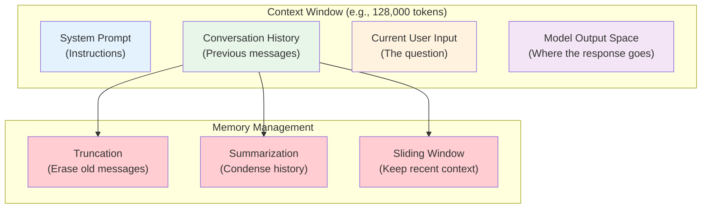
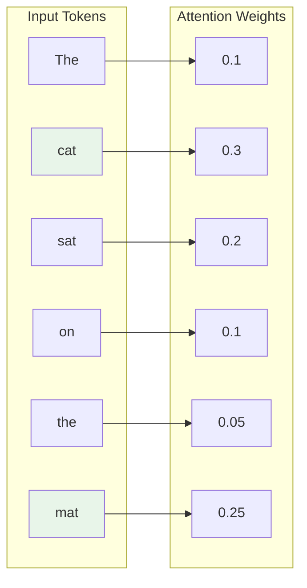

# Phase 1: Understanding How LLMs Actually Work

# Part 4: Context Windows & Memory

**Understanding the "short-term memory" of LLMs—how much they can remember, what happens when they forget, and how to build chatbots that actually remember conversations.**

---

## The Target: What We're Building Right Now

In this part, we're building five interconnected tools:

1. **A Simple Chatbot with Conversation History** — A working chatbot that remembers the conversation
2. **A Context Overflow Detector** — See exactly when you exceed the context window
3. **A Token Usage Tracker** — Monitor token consumption in real-time
4. **A Memory Management System** — Implement truncation, summarization, and sliding windows
5. **A Long-Context Explorer** — Test and understand the limits of different models

**Why this matters:** Every AI application has memory limits. Understanding how to manage context is the difference between a chatbot that works and one that forgets who you are mid-conversation.

---

## The Concept: Context Windows and Memory

### The Whiteboard Analogy

Imagine you're a teacher giving a lecture. You have a whiteboard that can only hold so much information:

- **Context Window** = The size of your whiteboard
- **Input Tokens** = Everything you write on the whiteboard (your notes, student questions)
- **Output Tokens** = What you write on the whiteboard in response
- **Total Tokens** = Everything on the whiteboard at once

If you write too much on the whiteboard:

1. You can't add anything new
2. You have to erase old information to make room
3. You might lose important context

**This is exactly how LLMs work.** They have a limited "whiteboard" (context window) and can only process what's currently written on it.



### What is a Context Window?

**Context window** is the maximum number of tokens an LLM can process in a single request.

- **Input tokens** count against this limit
- **Output tokens** also count against this limit
- **Total = Input + Output** must be ≤ Context Window

| Model | Context Window | Approximate Pages of Text |
|-------|---------------|---------------------------|
| GPT-3.5 | 16,384 | ~40 pages |
| GPT-4 | 8,192 | ~20 pages |
| GPT-4-Turbo | 128,000 | ~300 pages |
| GPT-4o | 128,000 | ~300 pages |
| GPT-4o-mini | 128,000 | ~300 pages |
| Claude 3 | 200,000 | ~500 pages |
| Claude 3.5 | 200,000 | ~500 pages |
| Gemini 1.5 | 2,000,000 | ~5,000 pages |
| Llama 3 | 128,000 | ~300 pages |

**What this means in practice:**

- Most modern models can handle an entire book
- But they can't handle an entire library
- You need to be strategic about what you include

### Attention Mechanisms: How Models "Pay Attention"

Attention is the mechanism that allows LLMs to focus on the most relevant parts of the context.

**The analogy:** When you're reading a long document, you don't read every word equally. You pay more attention to:
- The title
- The first sentence of each paragraph
- Keywords related to your question
- The conclusion

**Similarly, attention mechanisms in LLMs:**
- Assign weights to each token in the context
- Higher weight = more "attention" paid to that token
- This is what makes transformer models so powerful



### What Happens When You Exceed the Context Window?

When you try to send more tokens than the context window allows:

1. **The API will reject the request** (most common)
   - Error: "This model's maximum context length is X tokens"
   - Your application crashes

2. **The model truncates the input** (if the API allows it)
   - Older messages are dropped
   - You lose important context

3. **The model's performance degrades** (if it tries to process everything)
   - Attention becomes less effective
   - The model "forgets" important information

**Real-world example:**
```
You send: 100,000 tokens (but the model only handles 8,000)
Result: The first 92,000 tokens are "forgotten"
         Only the last 8,000 tokens are considered
         The model has no idea what the conversation was about 5 minutes ago
```

### Memory Management Strategies

To handle context limits, we use several strategies:

#### 1. Truncation (Simple Drop)

**How it works:** When you exceed the limit, simply drop the oldest messages.

```python
# Keep only the last N messages
messages = messages[-max_messages:]
```

**Pros:** Simple, fast
**Cons:** Loses important context

#### 2. Sliding Window

**How it works:** Keep the most recent messages, but keep system prompt and current question.

```python
# Keep system prompt + last N messages + current question
system_prompt = messages[0]  # Keep system prompt
recent = messages[-10:]      # Keep last 10 messages
```

**Pros:** Keeps recent context
**Cons:** Loses long-term memory

#### 3. Summarization

**How it works:** Condense old messages into a summary.

```python
# Summarize old messages
old_messages = messages[:-10]
summary = summarize_with_llm(old_messages)
messages = [summary] + messages[-10:]
```

**Pros:** Preserves key information
**Cons:** Expensive (calls LLM), loses details

#### 4. Hierarchical Memory

**How it works:** Maintain multiple levels of memory.

```python
# Level 1: Immediate context (last N messages)
# Level 2: Recent history (summarized)
# Level 3: Long-term memory (vector database)
```

**Pros:** Best retention
**Cons:** Complex, expensive

---

## The Implementation: Building Our Memory Tools

### Target File Structure

```
phase-1-understanding-llms/
└── module-4-context-memory/
    ├── 01_simple_chatbot.py
    ├── 02_context_overflow_detector.py
    ├── 03_token_usage_tracker.py
    ├── 04_memory_management.py
    ├── 05_long_context_explorer.py
    ├── requirements.txt
    └── README.md
```

### Step 1: Simple Chatbot with Conversation History

Create `01_simple_chatbot.py`:

```python
#!/usr/bin/env python3
"""
Module 4: Simple Chatbot with Conversation History

A working chatbot that maintains conversation history and tracks token usage.
This is the foundation for any conversational AI application.
"""

import os
import sys
from pathlib import Path
import json
from typing import List, Dict, Any, Optional
from datetime import datetime

sys.path.insert(0, str(Path(__file__).parent.parent.parent.parent))

from shared.utils.config import load_config
from shared.utils.logging import setup_logging
from openai import OpenAI

setup_logging(debug=False)
config = load_config()

class SimpleChatbot:
    """
    A chatbot that maintains conversation history and tracks token usage.
    
    This class demonstrates:
    - Maintaining a conversation history
    - Tracking token usage in real-time
    - Managing the context window
    - System prompt management
    """
    
    def __init__(
        self,
        model: str = "gpt-4o-mini",
        system_prompt: Optional[str] = None,
        max_history: int = 20
    ):
        """
        Initialize the chatbot.
        
        Args:
            model: The model to use
            system_prompt: Custom system prompt
            max_history: Maximum number of messages to keep
        """
        api_key = config.get("openai_api_key")
        if not api_key:
            raise ValueError("OpenAI API key not found")
        
        self.client = OpenAI(api_key=api_key)
        self.model = model
        
        # Set system prompt (with default)
        self.system_prompt = system_prompt or (
            "You are a helpful, friendly AI assistant. "
            "You provide clear, accurate, and helpful responses. "
            "If you don't know something, say so honestly."
        )
        
        # Initialize conversation history
        self.messages = [
            {"role": "system", "content": self.system_prompt}
        ]
        
        self.max_history = max_history
        self.token_usage = {
            "total_prompt_tokens": 0,
            "total_completion_tokens": 0,
            "total_tokens": 0,
            "requests": 0
        }
        
        self.conversation_metadata = {
            "started_at": datetime.now().isoformat(),
            "model": model,
            "message_count": 0
        }
    
    def add_message(self, role: str, content: str) -> None:
        """
        Add a message to the conversation history.
        
        Args:
            role: "user" or "assistant"
            content: The message content
        """
        # Check if we need to truncate history
        # We keep system prompt + last N messages
        if len(self.messages) >= self.max_history + 1:  # +1 for system prompt
            # Keep system prompt, remove oldest user/assistant messages
            # But keep at least the most recent messages
            self.messages = [
                self.messages[0],  # System prompt
            ] + self.messages[-(self.max_history - 1):]
        
        self.messages.append({"role": role, "content": content})
        self.conversation_metadata["message_count"] += 1
    
    def get_conversation_context(self) -> List[Dict[str, str]]:
        """Get the current conversation context."""
        return self.messages.copy()
    
    def get_conversation_summary(self) -> Dict[str, Any]:
        """
        Get a summary of the conversation.
        
        Returns:
            Dictionary with conversation metadata
        """
        return {
            "message_count": self.conversation_metadata["message_count"],
            "total_tokens_used": self.token_usage["total_tokens"],
            "model": self.conversation_metadata["model"],
            "started_at": self.conversation_metadata["started_at"],
            "history_size": len(self.messages),
            "max_history": self.max_history
        }
    
    def generate_response(
        self,
        user_input: str,
        temperature: float = 0.7,
        max_tokens: int = 500
    ) -> Dict[str, Any]:
        """
        Generate a response to the user input.
        
        Args:
            user_input: The user's message
            temperature: Temperature for generation
            max_tokens: Maximum tokens for response
            
        Returns:
            Dictionary with response and metadata
        """
        # Add user message to history
        self.add_message("user", user_input)
        
        try:
            # Generate response
            response = self.client.chat.completions.create(
                model=self.model,
                messages=self.messages,
                temperature=temperature,
                max_tokens=max_tokens
            )
            
            # Extract response
            assistant_message = response.choices[0].message.content
            
            # Add assistant message to history
            self.add_message("assistant", assistant_message)
            
            # Track token usage
            self.token_usage["total_prompt_tokens"] += response.usage.prompt_tokens
            self.token_usage["total_completion_tokens"] += response.usage.completion_tokens
            self.token_usage["total_tokens"] += response.usage.total_tokens
            self.token_usage["requests"] += 1
            
            return {
                "response": assistant_message,
                "usage": {
                    "prompt_tokens": response.usage.prompt_tokens,
                    "completion_tokens": response.usage.completion_tokens,
                    "total_tokens": response.usage.total_tokens
                },
                "cumulative": self.token_usage.copy(),
                "message_count": self.conversation_metadata["message_count"]
            }
            
        except Exception as e:
            print(f"❌ Error generating response: {e}")
            raise
    
    def clear_history(self) -> None:
        """Clear the conversation history."""
        self.messages = [
            {"role": "system", "content": self.system_prompt}
        ]
        self.conversation_metadata["message_count"] = 0
        print("🧹 Conversation history cleared")

def run_chatbot():
    """Run the chatbot in interactive mode."""
    print("\n" + "="*80)
    print("🤖 AI CHATBOT WITH MEMORY")
    print("="*80)
    
    print("\n📋 Instructions:")
    print("  - Type your messages and press Enter")
    print("  - Type 'history' to see conversation history")
    print("  - Type 'stats' to see token usage")
    print("  - Type 'clear' to reset the conversation")
    print("  - Type 'quit' to exit")
    
    # Create chatbot
    chatbot = SimpleChatbot(
        model="gpt-4o-mini",
        max_history=20
    )
    
    print(f"\n🤖 System: {chatbot.system_prompt}")
    print(f"📊 Model: {chatbot.model}")
    print(f"📏 Max History: {chatbot.max_history} messages")
    print("\n" + "="*80)
    
    while True:
        try:
            # Get user input
            user_input = input("\n👤 You: ").strip()
            
            if not user_input:
                continue
            
            # Handle commands
            if user_input.lower() in ['quit', 'q', 'exit']:
                print("\n👋 Goodbye!")
                break
            
            if user_input.lower() == 'history':
                print("\n📜 Conversation History:")
                print("-"*40)
                messages = chatbot.get_conversation_context()
                for msg in messages:
                    role = msg["role"]
                    content = msg["content"]
                    if role == "system":
                        print(f"[SYSTEM] {content[:100]}...")
                    else:
                        print(f"[{role.upper()}] {content[:100]}{'...' if len(content) > 100 else ''}")
                print("-"*40)
                continue
            
            if user_input.lower() == 'stats':
                stats = chatbot.get_conversation_summary()
                print("\n📊 Conversation Stats:")
                print("-"*40)
                for key, value in stats.items():
                    print(f"  {key}: {value}")
                print(f"  Token Usage:")
                print(f"    Prompt tokens: {chatbot.token_usage['total_prompt_tokens']}")
                print(f"    Completion tokens: {chatbot.token_usage['total_completion_tokens']}")
                print(f"    Total tokens: {chatbot.token_usage['total_tokens']}")
                print(f"    Requests: {chatbot.token_usage['requests']}")
                print("-"*40)
                continue
            
            if user_input.lower() == 'clear':
                chatbot.clear_history()
                continue
            
            # Generate response
            print("🤖 Assistant: ", end="", flush=True)
            
            result = chatbot.generate_response(user_input, temperature=0.7, max_tokens=500)
            
            # Print response (with streaming feel - we'll show it all at once)
            print(result["response"])
            
            # Show token usage for this message
            print(f"\n  📊 Tokens: {result['usage']['total_tokens']} (Cumulative: {result['cumulative']['total_tokens']})")
            
        except KeyboardInterrupt:
            print("\n\n👋 Goodbye!")
            break
        except Exception as e:
            print(f"\n❌ Error: {e}")
            print("   Please try again or type 'quit' to exit")

def main():
    """Run the chatbot demo."""
    run_chatbot()

if __name__ == "__main__":
    main()
```

### Step 2: Context Overflow Detector

Create `02_context_overflow_detector.py`:

```python
#!/usr/bin/env python3
"""
Module 4: Context Overflow Detector

Detects when a conversation is about to exceed the context window.
This is critical for preventing API errors and maintaining conversation quality.
"""

import os
import sys
from pathlib import Path
import tiktoken
from typing import List, Dict, Any, Optional

sys.path.insert(0, str(Path(__file__).parent.parent.parent.parent))

from shared.utils.config import load_config
from shared.utils.logging import setup_logging

setup_logging(debug=False)
config = load_config()

class ContextOverflowDetector:
    """
    Detect when a conversation exceeds or is about to exceed the context window.
    
    This class provides:
    - Token counting for the entire conversation
    - Prediction of future overflow
    - Recommendations for mitigation
    """
    
    def __init__(self, model: str = "gpt-4o-mini"):
        """
        Initialize the detector.
        
        Args:
            model: The model to check against
        """
        self.model = model
        
        # Model context windows (in tokens)
        self.context_windows = {
            "gpt-4o-mini": 128000,
            "gpt-4o": 128000,
            "gpt-4-turbo": 128000,
            "gpt-4": 8192,
            "gpt-3.5-turbo": 16384,
            "claude-3-5-sonnet": 200000,
            "claude-3-opus": 200000,
            "gemini-1.5-pro": 2000000,
            "gemini-1.5-flash": 1000000,
        }
        
        # Get the max tokens for this model
        self.max_tokens = self.context_windows.get(
            model, 128000
        )  # Default to 128k if unknown
        
        # Tokenizer for counting
        try:
            # OpenAI tokenizer
            self.encoding = tiktoken.encoding_for_model(model)
        except:
            # Fallback
            self.encoding = tiktoken.get_encoding("cl100k_base")
    
    def count_tokens(self, text: str) -> int:
        """Count tokens in a text string."""
        try:
            return len(self.encoding.encode(text))
        except:
            # Rough estimate
            return len(text) // 4
    
    def count_messages(self, messages: List[Dict[str, str]]) -> int:
        """
        Count tokens in a list of messages.
        
        Args:
            messages: List of message dicts with 'role' and 'content'
            
        Returns:
            Total token count
        """
        total_tokens = 0
        
        # Each message has overhead (role, etc.)
        # We'll add a small overhead per message
        overhead_per_message = 4  # Approximate overhead
        
        for message in messages:
            content = message.get("content", "")
            role = message.get("role", "")
            
            # Count content tokens
            content_tokens = self.count_tokens(content)
            
            # Add overhead
            total_tokens += content_tokens + overhead_per_message
            
            # Extra overhead for role
            if role:
                total_tokens += 2
        
        return total_tokens
    
    def analyze_conversation(self, messages: List[Dict[str, str]]) -> Dict[str, Any]:
        """
        Analyze a conversation for context overflow.
        
        Args:
            messages: List of message dicts
            
        Returns:
            Dictionary with analysis results
        """
        # Count tokens
        total_tokens = self.count_messages(messages)
        
        # Calculate usage
        usage_percentage = (total_tokens / self.max_tokens) * 100
        
        # Determine status
        if total_tokens >= self.max_tokens:
            status = "OVERFLOW"
            status_color = "🔴"
            recommendation = "Remove older messages, use summarization, or switch to a model with larger context"
        elif usage_percentage >= 80:
            status = "CRITICAL"
            status_color = "🟠"
            recommendation = "Consider truncating or summarizing soon"
        elif usage_percentage >= 60:
            status = "WARNING"
            status_color = "🟡"
            recommendation = "Monitor token usage, prepare for mitigation"
        else:
            status = "OK"
            status_color = "🟢"
            recommendation = "Context is healthy"
        
        # Calculate remaining capacity
        remaining_tokens = max(0, self.max_tokens - total_tokens)
        
        # Estimate how many more messages we can add
        avg_message_tokens = total_tokens / max(1, len(messages))
        estimated_messages = int(remaining_tokens / max(1, avg_message_tokens)) if avg_message_tokens > 0 else 0
        
        return {
            "model": self.model,
            "max_context_tokens": self.max_tokens,
            "current_tokens": total_tokens,
            "usage_percentage": usage_percentage,
            "remaining_tokens": remaining_tokens,
            "status": status,
            "status_color": status_color,
            "recommendation": recommendation,
            "message_count": len(messages),
            "avg_message_tokens": avg_message_tokens,
            "estimated_remaining_messages": estimated_messages
        }
    
    def print_analysis(self, messages: List[Dict[str, str]]) -> None:
        """
        Print a detailed analysis of the conversation.
        
        Args:
            messages: List of message dicts
        """
        analysis = self.analyze_conversation(messages)
        
        print("\n" + "="*80)
        print("📊 CONTEXT WINDOW ANALYSIS")
        print("="*80)
        
        print(f"\n🤖 Model: {analysis['model']}")
        print(f"📏 Context Window: {analysis['max_context_tokens']:,} tokens")
        print(f"\n📝 Current Conversation:")
        print(f"   Messages: {analysis['message_count']}")
        print(f"   Total Tokens: {analysis['current_tokens']:,}")
        print(f"   Usage: {analysis['usage_percentage']:.1f}%")
        print(f"   Remaining: {analysis['remaining_tokens']:,} tokens")
        print(f"\n📊 Status: {analysis['status_color']} {analysis['status']}")
        print(f"💡 Recommendation: {analysis['recommendation']}")
        
        if analysis['estimated_remaining_messages'] > 0:
            print(f"\n   Estimated remaining messages: ~{analysis['estimated_remaining_messages']}")
        
        # Show a visual indicator
        print("\n📊 Context Usage:")
        bar_length = 40
        filled = int((analysis['usage_percentage'] / 100) * bar_length)
        bar = "█" * filled + "░" * (bar_length - filled)
        
        print(f"   [{bar}] {analysis['usage_percentage']:.1f}%")
        
        # Additional information
        print("\n💡 To reduce context usage:")
        print("   1. Use a system prompt (included only once)")
        print("   2. Keep only recent messages (sliding window)")
        print("   3. Summarize old messages")
        print("   4. Use a model with a larger context window")
        print("   5. Use RAG for external knowledge instead of including it in context")

def simulate_conversation_growth():
    """Simulate how a conversation grows over time."""
    print("\n" + "="*80)
    print("📈 CONVERSATION GROWTH SIMULATION")
    print("="*80)
    
    detector = ContextOverflowDetector("gpt-4o-mini")
    
    # Create a simulated conversation
    messages = []
    
    # System prompt
    messages.append({
        "role": "system",
        "content": "You are a helpful assistant." * 50  # ~50 tokens
    })
    
    # Simulate 30 turns
    print("\n📊 Conversation Growth Over Time:")
    print("-"*40)
    
    for i in range(1, 31):
        # Simulate user and assistant messages
        user_content = f"This is message {i}. " * 20  # ~40 tokens
        assistant_content = f"This is the response to message {i}. " * 40  # ~80 tokens
        
        messages.append({"role": "user", "content": user_content})
        messages.append({"role": "assistant", "content": assistant_content})
        
        # Analyze every 5 messages
        if i % 5 == 0:
            analysis = detector.analyze_conversation(messages)
            print(f"\nAfter {i*2} messages ({analysis['message_count']} messages):")
            print(f"  Tokens: {analysis['current_tokens']:,}")
            print(f"  Usage: {analysis['usage_percentage']:.1f}%")
            print(f"  Status: {analysis['status_color']} {analysis['status']}")
            
            if analysis['status'] in ['WARNING', 'CRITICAL', 'OVERFLOW']:
                print(f"  ⚠️ {analysis['recommendation']}")

def main():
    """Run the context overflow detector."""
    print("\n" + "="*80)
    print("AI TUTORIAL SERIES - CONTEXT OVERFLOW DETECTOR")
    print("="*80)
    
    # Create a detector
    detector = ContextOverflowDetector("gpt-4o-mini")
    
    # Example 1: A short conversation
    messages = [
        {"role": "system", "content": "You are a helpful assistant."},
        {"role": "user", "content": "Hello!"},
        {"role": "assistant", "content": "Hi there! How can I help you today?"},
        {"role": "user", "content": "Tell me about AI."},
        {"role": "assistant", "content": "AI is a fascinating field..."}
    ]
    
    detector.print_analysis(messages)
    
    # Example 2: A long conversation
    print("\n" + "="*80)
    print("📄 EXAMPLE: LONG CONVERSATION")
    print("="*80)
    
    long_messages = [
        {"role": "system", "content": "You are a helpful assistant."}
    ]
    
    # Add 50 messages with varying lengths
    for i in range(25):
        long_messages.append({
            "role": "user",
            "content": f"This is user message {i}. " * 30
        })
        long_messages.append({
            "role": "assistant",
            "content": f"This is assistant response {i}. " * 50
        })
    
    detector.print_analysis(long_messages)
    
    # Run the simulation
    simulate_conversation_growth()

if __name__ == "__main__":
    main()
```

### Step 3: Token Usage Tracker

Create `03_token_usage_tracker.py`:

```python
#!/usr/bin/env python3
"""
Module 4: Token Usage Tracker

Tracks token usage in real-time and provides cost estimates.
"""

import os
import sys
from pathlib import Path
import json
from typing import List, Dict, Any
from datetime import datetime, timedelta
from collections import defaultdict

sys.path.insert(0, str(Path(__file__).parent.parent.parent.parent))

from shared.utils.config import load_config
from shared.utils.logging import setup_logging

setup_logging(debug=False)
config = load_config()

class TokenUsageTracker:
    """
    Track token usage and costs across API calls.
    
    This class provides:
    - Real-time token tracking
    - Cost calculations
    - Usage trends
    - Budget alerts
    """
    
    def __init__(self):
        """Initialize the tracker."""
        self.usage = {
            "requests": [],
            "total": {
                "prompt_tokens": 0,
                "completion_tokens": 0,
                "total_tokens": 0,
                "cost_usd": 0.0,
                "requests": 0
            },
            "by_model": defaultdict(lambda: {
                "prompt_tokens": 0,
                "completion_tokens": 0,
                "total_tokens": 0,
                "cost_usd": 0.0,
                "requests": 0
            })
        }
        
        # Pricing per 1M tokens (USD)
        self.pricing = {
            "gpt-4o-mini": {
                "input": 0.150,
                "output": 0.600
            },
            "gpt-4o": {
                "input": 5.00,
                "output": 15.00
            },
            "gpt-4-turbo": {
                "input": 10.00,
                "output": 30.00
            },
            "gpt-4": {
                "input": 30.00,
                "output": 60.00
            },
            "gpt-3.5-turbo": {
                "input": 0.50,
                "output": 1.50
            },
            "claude-3-5-sonnet": {
                "input": 3.00,
                "output": 15.00
            },
            "claude-3-opus": {
                "input": 15.00,
                "output": 75.00
            }
        }
    
    def track_request(
        self,
        model: str,
        prompt_tokens: int,
        completion_tokens: int,
        total_tokens: int,
        timestamp: Optional[datetime] = None
    ) -> None:
        """
        Track a single API request.
        
        Args:
            model: The model used
            prompt_tokens: Number of prompt tokens
            completion_tokens: Number of completion tokens
            total_tokens: Total tokens
            timestamp: When the request was made
        """
        if timestamp is None:
            timestamp = datetime.now()
        
        # Calculate cost
        pricing = self.pricing.get(model, {"input": 0.0, "output": 0.0})
        cost = (prompt_tokens / 1_000_000) * pricing["input"] + \
               (completion_tokens / 1_000_000) * pricing["output"]
        
        # Store request
        request = {
            "timestamp": timestamp.isoformat(),
            "model": model,
            "prompt_tokens": prompt_tokens,
            "completion_tokens": completion_tokens,
            "total_tokens": total_tokens,
            "cost_usd": cost
        }
        
        self.usage["requests"].append(request)
        
        # Update totals
        self.usage["total"]["prompt_tokens"] += prompt_tokens
        self.usage["total"]["completion_tokens"] += completion_tokens
        self.usage["total"]["total_tokens"] += total_tokens
        self.usage["total"]["cost_usd"] += cost
        self.usage["total"]["requests"] += 1
        
        # Update per-model totals
        self.usage["by_model"][model]["prompt_tokens"] += prompt_tokens
        self.usage["by_model"][model]["completion_tokens"] += completion_tokens
        self.usage["by_model"][model]["total_tokens"] += total_tokens
        self.usage["by_model"][model]["cost_usd"] += cost
        self.usage["by_model"][model]["requests"] += 1
    
    def get_summary(self) -> Dict[str, Any]:
        """Get a summary of usage."""
        summary = {
            "total": self.usage["total"].copy(),
            "by_model": dict(self.usage["by_model"]),
            "request_count": len(self.usage["requests"]),
            "last_request": None
        }
        
        if self.usage["requests"]:
            summary["last_request"] = self.usage["requests"][-1]
        
        return summary
    
    def get_time_range_summary(self, hours: int) -> Dict[str, Any]:
        """
        Get usage summary for a specific time range.
        
        Args:
            hours: Number of hours to look back
            
        Returns:
            Summary for the time range
        """
        cutoff = datetime.now() - timedelta(hours=hours)
        
        filtered_requests = [
            r for r in self.usage["requests"]
            if datetime.fromisoformat(r["timestamp"]) >= cutoff
        ]
        
        summary = {
            "prompt_tokens": sum(r["prompt_tokens"] for r in filtered_requests),
            "completion_tokens": sum(r["completion_tokens"] for r in filtered_requests),
            "total_tokens": sum(r["total_tokens"] for r in filtered_requests),
            "cost_usd": sum(r["cost_usd"] for r in filtered_requests),
            "requests": len(filtered_requests),
            "hours": hours
        }
        
        return summary
    
    def get_cost_breakdown(self) -> Dict[str, float]:
        """Get cost breakdown by model."""
        return {
            model: data["cost_usd"]
            for model, data in self.usage["by_model"].items()
        }
    
    def get_token_breakdown(self) -> Dict[str, int]:
        """Get token breakdown by model."""
        return {
            model: data["total_tokens"]
            for model, data in self.usage["by_model"].items()
        }
    
    def print_summary(self) -> None:
        """Print a detailed usage summary."""
        summary = self.get_summary()
        
        print("\n" + "="*80)
        print("📊 TOKEN USAGE SUMMARY")
        print("="*80)
        
        print(f"\n📈 Overall Usage:")
        print(f"   Requests: {summary['request_count']}")
        print(f"   Prompt Tokens: {summary['total']['prompt_tokens']:,}")
        print(f"   Completion Tokens: {summary['total']['completion_tokens']:,}")
        print(f"   Total Tokens: {summary['total']['total_tokens']:,}")
        print(f"   Total Cost: ${summary['total']['cost_usd']:.4f}")
        
        if summary['last_request']:
            last = summary['last_request']
            print(f"\n🕐 Last Request:")
            print(f"   Time: {last['timestamp']}")
            print(f"   Model: {last['model']}")
            print(f"   Tokens: {last['total_tokens']}")
            print(f"   Cost: ${last['cost_usd']:.4f}")
        
        # Per-model breakdown
        print("\n📊 Per-Model Breakdown:")
        print("-"*40)
        
        for model, data in self.usage["by_model"].items():
            print(f"\n🤖 {model}:")
            print(f"   Requests: {data['requests']}")
            print(f"   Total Tokens: {data['total_tokens']:,}")
            print(f"   Cost: ${data['cost_usd']:.4f}")
        
        # Time range summaries
        print("\n📈 Time Range Summaries:")
        print("-"*40)
        
        for hours in [1, 6, 24, 168]:  # 1h, 6h, 24h, 7d
            range_summary = self.get_time_range_summary(hours)
            print(f"\nLast {hours} hours:")
            print(f"   Requests: {range_summary['requests']}")
            print(f"   Tokens: {range_summary['total_tokens']:,}")
            print(f"   Cost: ${range_summary['cost_usd']:.4f}")
    
    def check_budget(self, budget_usd: float) -> Dict[str, Any]:
        """
        Check if usage is within budget.
        
        Args:
            budget_usd: Budget in USD
            
        Returns:
            Dict with budget status
        """
        total_cost = self.usage["total"]["cost_usd"]
        
        if total_cost >= budget_usd:
            status = "EXCEEDED"
            status_color = "🔴"
        elif total_cost >= budget_usd * 0.8:
            status = "WARNING"
            status_color = "🟠"
        else:
            status = "OK"
            status_color = "🟢"
        
        return {
            "budget": budget_usd,
            "used": total_cost,
            "remaining": max(0, budget_usd - total_cost),
            "percentage_used": (total_cost / budget_usd) * 100 if budget_usd > 0 else 0,
            "status": status,
            "status_color": status_color
        }

def demonstrate_tracker():
    """Demonstrate the token usage tracker."""
    tracker = TokenUsageTracker()
    
    print("\n" + "="*80)
    print("📊 TOKEN USAGE TRACKER DEMONSTRATION")
    print("="*80)
    
    # Simulate some API calls
    print("\n🔄 Simulating API calls...")
    
    calls = [
        {"model": "gpt-4o-mini", "prompt": 100, "completion": 50},
        {"model": "gpt-4o-mini", "prompt": 200, "completion": 80},
        {"model": "gpt-4o", "prompt": 150, "completion": 60},
        {"model": "gpt-4o-mini", "prompt": 300, "completion": 120},
        {"model": "gpt-3.5-turbo", "prompt": 80, "completion": 40},
        {"model": "gpt-4o", "prompt": 250, "completion": 100},
    ]
    
    for call in calls:
        tracker.track_request(
            model=call["model"],
            prompt_tokens=call["prompt"],
            completion_tokens=call["completion"],
            total_tokens=call["prompt"] + call["completion"]
        )
        print(f"   ✓ {call['model']}: {call['prompt']}+{call['completion']} tokens")
    
    # Print summary
    tracker.print_summary()
    
    # Check budget
    print("\n" + "="*80)
    print("💰 BUDGET CHECK")
    print("="*80)
    
    budget_status = tracker.check_budget(0.05)  # $0.05 budget
    print(f"\nBudget: ${budget_status['budget']:.4f}")
    print(f"Used: ${budget_status['used']:.4f}")
    print(f"Remaining: ${budget_status['remaining']:.4f}")
    print(f"Percentage used: {budget_status['percentage_used']:.1f}%")
    print(f"Status: {budget_status['status_color']} {budget_status['status']}")

def main():
    """Run the token usage tracker demo."""
    demonstrate_tracker()

if __name__ == "__main__":
    main()
```

### Step 4: Memory Management System

Create `04_memory_management.py`:

```python
#!/usr/bin/env python3
"""
Module 4: Memory Management System

Implements various memory management strategies for LLM conversations.
"""

import os
import sys
from pathlib import Path
import json
from typing import List, Dict, Any, Optional
import tiktoken

sys.path.insert(0, str(Path(__file__).parent.parent.parent.parent))

from shared.utils.config import load_config
from shared.utils.logging import setup_logging

setup_logging(debug=False)
config = load_config()

class MemoryManager:
    """
    Manage conversation memory to stay within context limits.
    
    This class implements:
    - Truncation (drop oldest messages)
    - Sliding window (keep recent messages)
    - Summarization (condense old messages)
    - Priority-based retention (keep important messages)
    """
    
    def __init__(self, model: str = "gpt-4o-mini", max_tokens: Optional[int] = None):
        """
        Initialize the memory manager.
        
        Args:
            model: The model being used
            max_tokens: Maximum context tokens (auto-detect if not provided)
        """
        self.model = model
        
        # Context window sizes
        self.context_windows = {
            "gpt-4o-mini": 128000,
            "gpt-4o": 128000,
            "gpt-4-turbo": 128000,
            "gpt-4": 8192,
            "gpt-3.5-turbo": 16384,
        }
        
        self.max_tokens = max_tokens or self.context_windows.get(model, 128000)
        
        # Tokenizer for counting
        try:
            self.encoding = tiktoken.encoding_for_model(model)
        except:
            self.encoding = tiktoken.get_encoding("cl100k_base")
        
        # Keep system prompt as first message
        self.system_prompt = None
    
    def count_tokens(self, text: str) -> int:
        """Count tokens in a text string."""
        try:
            return len(self.encoding.encode(text))
        except:
            return len(text) // 4
    
    def count_messages(self, messages: List[Dict[str, str]]) -> int:
        """Count total tokens in messages."""
        total = 0
        for msg in messages:
            total += self.count_tokens(msg.get("content", ""))
            total += 4  # Overhead per message
        return total
    
    def truncate_messages(
        self,
        messages: List[Dict[str, str]],
        max_tokens: Optional[int] = None,
        keep_system: bool = True
    ) -> List[Dict[str, str]]:
        """
        Truncate messages by dropping oldest messages.
        
        Args:
            messages: List of message dicts
            max_tokens: Maximum tokens to keep
            keep_system: Whether to keep system prompt
            
        Returns:
            Truncated messages list
        """
        if max_tokens is None:
            max_tokens = self.max_tokens
        
        # If messages already fit, return them
        if self.count_messages(messages) <= max_tokens:
            return messages
        
        # Separate system prompt
        system_msg = None
        if keep_system and messages and messages[0]["role"] == "system":
            system_msg = messages[0]
            messages = messages[1:]
        
        # Keep dropping oldest messages until we fit
        while messages and self.count_messages(messages) > max_tokens:
            messages.pop(0)  # Remove oldest
        
        # Re-add system prompt
        if system_msg:
            messages = [system_msg] + messages
        
        return messages
    
    def sliding_window(
        self,
        messages: List[Dict[str, str]],
        window_size: int = 20,
        keep_system: bool = True
    ) -> List[Dict[str, str]]:
        """
        Keep only the most recent messages (sliding window).
        
        Args:
            messages: List of message dicts
            window_size: Number of recent messages to keep
            keep_system: Whether to keep system prompt
            
        Returns:
            Filtered messages
        """
        if keep_system and messages and messages[0]["role"] == "system":
            system_msg = messages[0]
            # Keep system prompt + last window_size messages
            recent = messages[-window_size:]
            return [system_msg] + recent
        else:
            return messages[-window_size:]
    
    def summarize_messages(
        self,
        messages: List[Dict[str, str]],
        summary_max_tokens: int = 100,
        keep_system: bool = True
    ) -> List[Dict[str, str]]:
        """
        Summarize old messages to reduce token usage.
        
        Note: This requires an LLM call to generate the summary.
        
        Args:
            messages: List of message dicts
            summary_max_tokens: Max tokens for summary
            keep_system: Whether to keep system prompt
            
        Returns:
            Messages with old parts summarized
        """
        # This is a placeholder - in production you'd call an LLM
        # to generate the summary
        
        if len(messages) <= 2:
            return messages
        
        # Simple implementation: combine old messages into one
        # In a real system, you'd call an LLM to summarize
        
        if keep_system and messages[0]["role"] == "system":
            system_msg = messages[0]
            other_messages = messages[1:]
            
            # Keep last few messages un-summarized
            keep_recent = 5
            to_summarize = other_messages[:-keep_recent]
            recent = other_messages[-keep_recent:]
            
            # Create a summary message
            if to_summarize:
                summary_content = "Previous conversation: " + " | ".join([
                    f"{m['role']}: {m['content'][:50]}..."
                    for m in to_summarize
                ])
                
                # Truncate summary if needed
                summary_tokens = self.count_tokens(summary_content)
                if summary_tokens > summary_max_tokens:
                    # Keep first few and last few messages
                    first_few = to_summarize[:3]
                    last_few = to_summarize[-3:]
                    summary_content = "Conversation summary: " + " | ".join([
                        f"{m['role']}: {m['content'][:30]}..."
                        for m in first_few + last_few
                    ])
                
                result = [system_msg]
                result.append({"role": "system", "content": summary_content})
                result.extend(recent)
                return result
        
        return messages
    
    def priority_retention(
        self,
        messages: List[Dict[str, str]],
        max_tokens: Optional[int] = None
    ) -> List[Dict[str, str]]:
        """
        Keep messages based on priority (system > assistant > user).
        
        Args:
            messages: List of message dicts
            max_tokens: Maximum tokens to keep
            
        Returns:
            Messages with lower-priority messages removed
        """
        if max_tokens is None:
            max_tokens = self.max_tokens
        
        if self.count_messages(messages) <= max_tokens:
            return messages
        
        # Separate system messages
        system_messages = [m for m in messages if m["role"] == "system"]
        assistant_messages = [m for m in messages if m["role"] == "assistant"]
        user_messages = [m for m in messages if m["role"] == "user"]
        
        # Priority order: system > assistant > user
        # Keep all system, as many assistant as possible, then user
        
        result = system_messages.copy()
        
        # Add assistant messages (most recent first)
        assistant_messages.reverse()
        for msg in assistant_messages:
            test_messages = result + [msg]
            if self.count_messages(test_messages) <= max_tokens:
                result.append(msg)
            else:
                break
        
        # Add user messages (most recent first)
        user_messages.reverse()
        for msg in user_messages:
            test_messages = result + [msg]
            if self.count_messages(test_messages) <= max_tokens:
                result.append(msg)
            else:
                break
        
        # Restore chronological order
        result.sort(key=lambda x: messages.index(x))
        
        return result
    
    def compare_strategies(
        self,
        messages: List[Dict[str, str]],
        target_tokens: int = 1000
    ) -> Dict[str, Any]:
        """
        Compare different memory management strategies.
        
        Args:
            messages: List of message dicts
            target_tokens: Target number of tokens to keep
            
        Returns:
            Comparison results
        """
        original_tokens = self.count_messages(messages)
        
        strategies = {
            "None (Original)": messages,
            "Truncation": self.truncate_messages(messages, target_tokens),
            "Sliding Window (10)": self.sliding_window(messages, window_size=10),
            "Sliding Window (20)": self.sliding_window(messages, window_size=20),
            "Priority Retention": self.priority_retention(messages, target_tokens),
        }
        
        results = {}
        for name, msgs in strategies.items():
            tokens = self.count_messages(msgs)
            reduction = ((original_tokens - tokens) / original_tokens) * 100 if original_tokens > 0 else 0
            results[name] = {
                "messages": len(msgs),
                "tokens": tokens,
                "reduction_percent": reduction,
                "meets_target": tokens <= target_tokens
            }
        
        return results

def demonstrate_memory_management():
    """Demonstrate memory management strategies."""
    print("\n" + "="*80)
    print("🧠 MEMORY MANAGEMENT STRATEGIES")
    print("="*80)
    
    manager = MemoryManager("gpt-4o-mini")
    
    # Create a long conversation
    messages = [
        {"role": "system", "content": "You are a helpful AI assistant."}
    ]
    
    for i in range(30):
        messages.append({
            "role": "user",
            "content": f"This is user message number {i}. " * 15
        })
        messages.append({
            "role": "assistant",
            "content": f"This is assistant response number {i}. " * 25
        })
    
    print(f"\n📝 Original Conversation:")
    print(f"   Messages: {len(messages)}")
    print(f"   Total Tokens: {manager.count_messages(messages):,}")
    print(f"   Context Limit: {manager.max_tokens:,}")
    
    # Compare strategies
    print(f"\n🎯 Target: Keep under 1,000 tokens")
    print("-"*40)
    
    comparison = manager.compare_strategies(messages, target_tokens=1000)
    
    for strategy, result in comparison.items():
        status = "✅" if result["meets_target"] else "❌"
        print(f"\n{strategy}:")
        print(f"   Messages: {result['messages']}")
        print(f"   Tokens: {result['tokens']:,}")
        print(f"   Reduction: {result['reduction_percent']:.1f}%")
        print(f"   Meets target: {status}")

def interactive_memory_demo():
    """Interactive demonstration of memory management."""
    print("\n" + "="*80)
    print("🎮 INTERACTIVE MEMORY MANAGEMENT")
    print("="*80)
    
    manager = MemoryManager("gpt-4o-mini")
    
    # Create a sample conversation
    messages = [
        {"role": "system", "content": "You are a helpful AI assistant."}
    ]
    
    print("\n📝 Building a sample conversation...")
    
    for i in range(20):
        messages.append({
            "role": "user",
            "content": f"Question {i}: What is the meaning of life?" if i % 2 == 0 else f"Question {i}: Tell me about AI."
        })
        messages.append({
            "role": "assistant",
            "content": f"Response {i}: This is a detailed answer to your question. " * 10
        })
    
    print(f"Conversation has {len(messages)} messages")
    print(f"Total tokens: {manager.count_messages(messages):,}")
    
    print("\n💡 Available Strategies:")
    print("  1. Truncation (drop oldest)")
    print("  2. Sliding Window (keep recent)")
    print("  3. Priority Retention")
    print("  4. Summarization (simple)")
    
    while True:
        try:
            print("\n" + "-"*40)
            choice = input("Select strategy (1-4) or 'quit': ").strip()
            
            if choice.lower() in ['quit', 'q', 'exit']:
                break
            
            if choice == '1':
                max_tokens = int(input("Max tokens to keep: ") or "1000")
                result = manager.truncate_messages(messages, max_tokens)
                print(f"\n✅ Truncated to {len(result)} messages ({manager.count_messages(result):,} tokens)")
                
            elif choice == '2':
                window_size = int(input("Window size: ") or "10")
                result = manager.sliding_window(messages, window_size)
                print(f"\n✅ Sliding window: {len(result)} messages ({manager.count_messages(result):,} tokens)")
                
            elif choice == '3':
                max_tokens = int(input("Max tokens to keep: ") or "1000")
                result = manager.priority_retention(messages, max_tokens)
                print(f"\n✅ Priority retention: {len(result)} messages ({manager.count_messages(result):,} tokens)")
                
            elif choice == '4':
                result = manager.summarize_messages(messages)
                print(f"\n✅ Summarized: {len(result)} messages ({manager.count_messages(result):,} tokens)")
            
            else:
                print("❌ Invalid choice")
                
        except KeyboardInterrupt:
            break
        except Exception as e:
            print(f"❌ Error: {e}")

def main():
    """Run memory management demonstrations."""
    demonstrate_memory_management()
    interactive_memory_demo()

if __name__ == "__main__":
    main()
```

### Step 5: Long-Context Explorer

Create `05_long_context_explorer.py`:

```python
#!/usr/bin/env python3
"""
Module 4: Long-Context Explorer

Test and understand the limits of different models' context windows.
"""

import os
import sys
from pathlib import Path
import json
from typing import List, Dict, Any, Optional
import time

sys.path.insert(0, str(Path(__file__).parent.parent.parent.parent))

from shared.utils.config import load_config
from shared.utils.logging import setup_logging

setup_logging(debug=False)
config = load_config()

class LongContextExplorer:
    """
    Explore and test the context limits of different models.
    
    This class provides:
    - Context window information for different models
    - Testing of context limits
    - Performance comparison at different context sizes
    """
    
    def __init__(self):
        """Initialize the explorer."""
        # Model context windows
        self.models = {
            "gpt-4o-mini": {
                "max_tokens": 128000,
                "price_per_1m_input": 0.150,
                "price_per_1m_output": 0.600
            },
            "gpt-4o": {
                "max_tokens": 128000,
                "price_per_1m_input": 5.00,
                "price_per_1m_output": 15.00
            },
            "gpt-4-turbo": {
                "max_tokens": 128000,
                "price_per_1m_input": 10.00,
                "price_per_1m_output": 30.00
            },
            "gpt-4": {
                "max_tokens": 8192,
                "price_per_1m_input": 30.00,
                "price_per_1m_output": 60.00
            },
            "gpt-3.5-turbo": {
                "max_tokens": 16384,
                "price_per_1m_input": 0.50,
                "price_per_1m_output": 1.50
            },
            "claude-3-5-sonnet": {
                "max_tokens": 200000,
                "price_per_1m_input": 3.00,
                "price_per_1m_output": 15.00
            },
            "claude-3-opus": {
                "max_tokens": 200000,
                "price_per_1m_input": 15.00,
                "price_per_1m_output": 75.00
            }
        }
    
    def get_model_info(self, model: str) -> Dict[str, Any]:
        """Get information about a model."""
        return self.models.get(model, {
            "max_tokens": 128000,
            "price_per_1m_input": 0.0,
            "price_per_1m_output": 0.0
        })
    
    def compare_models(self) -> None:
        """Compare all models' context windows and pricing."""
        print("\n" + "="*80)
        print("📊 MODEL COMPARISON")
        print("="*80)
        
        print("\n" + "-"*80)
        print(f"{'Model':<20} {'Context Window':<15} {'Input Cost':<15} {'Output Cost':<15}")
        print("-"*80)
        
        for model, info in sorted(self.models.items()):
            print(f"{model:<20} {info['max_tokens']:>12,}    ${info['price_per_1m_input']:.3f}      ${info['price_per_1m_output']:.3f}")
        
        print("-"*80)
    
    def estimate_usage(
        self,
        model: str,
        prompt_tokens: int,
        completion_tokens: int
    ) -> Dict[str, Any]:
        """
        Estimate cost and feasibility for a request.
        
        Args:
            model: The model to use
            prompt_tokens: Number of prompt tokens
            completion_tokens: Number of completion tokens
            
        Returns:
            Dictionary with cost and feasibility estimates
        """
        info = self.get_model_info(model)
        max_tokens = info["max_tokens"]
        total_tokens = prompt_tokens + completion_tokens
        
        feasible = total_tokens <= max_tokens
        
        # Calculate cost
        input_cost = (prompt_tokens / 1_000_000) * info["price_per_1m_input"]
        output_cost = (completion_tokens / 1_000_000) * info["price_per_1m_output"]
        total_cost = input_cost + output_cost
        
        # Calculate percentages
        usage_percent = (total_tokens / max_tokens) * 100 if max_tokens > 0 else 0
        
        return {
            "model": model,
            "max_tokens": max_tokens,
            "prompt_tokens": prompt_tokens,
            "completion_tokens": completion_tokens,
            "total_tokens": total_tokens,
            "usage_percent": usage_percent,
            "feasible": feasible,
            "input_cost": input_cost,
            "output_cost": output_cost,
            "total_cost": total_cost
        }
    
    def simulate_context_usage(self) -> None:
        """Simulate how different applications use context."""
        print("\n" + "="*80)
        print("📝 CONTEXT USAGE SIMULATION")
        print("="*80)
        
        scenarios = [
            {
                "name": "Short Q&A",
                "prompt_tokens": 100,
                "completion_tokens": 200
            },
            {
                "name": "Long Document Analysis",
                "prompt_tokens": 50000,
                "completion_tokens": 1000
            },
            {
                "name": "Book Summary",
                "prompt_tokens": 100000,
                "completion_tokens": 2000
            },
            {
                "name": "Code Review",
                "prompt_tokens": 20000,
                "completion_tokens": 500
            },
            {
                "name": "Research Paper Analysis",
                "prompt_tokens": 80000,
                "completion_tokens": 1500
            },
            {
                "name": "Conversation (20 turns)",
                "prompt_tokens": 5000,
                "completion_tokens": 1000
            }
        ]
        
        models_to_test = ["gpt-4o-mini", "gpt-4o", "claude-3-5-sonnet"]
        
        for scenario in scenarios:
            print(f"\n📚 {scenario['name']}:")
            print("-"*40)
            
            for model in models_to_test:
                estimate = self.estimate_usage(
                    model,
                    scenario["prompt_tokens"],
                    scenario["completion_tokens"]
                )
                
                status = "✅" if estimate["feasible"] else "❌"
                print(f"{model}: {status} {estimate['total_tokens']:,} tokens "
                      f"({estimate['usage_percent']:.1f}%) "
                      f"${estimate['total_cost']:.4f}")
    
    def show_context_comparison(self) -> None:
        """Show a visual comparison of context windows."""
        print("\n" + "="*80)
        print("📊 CONTEXT WINDOW VISUALIZATION")
        print("="*80)
        
        print("\nHow much text fits in each model's context window:")
        print("-"*80)
        
        # Word counts
        words_per_token = 0.75  # Approximate
        chars_per_word = 5
        
        for model, info in sorted(self.models.items()):
            max_tokens = info["max_tokens"]
            approx_words = int(max_tokens * words_per_token)
            approx_chars = approx_words * chars_per_word
            approx_pages = approx_chars // 2500  # ~2500 chars per page
            
            # Visual bar
            bar_length = min(50, approx_pages // 10 + 1)
            bar = "█" * bar_length
            
            print(f"\n{model}:")
            print(f"  {bar} {max_tokens:,} tokens")
            print(f"  ≈ {approx_words:,} words, {approx_pages} pages")
    
    def find_best_model(
        self,
        prompt_tokens: int,
        completion_tokens: int,
        max_budget: float = 0.10
    ) -> Dict[str, Any]:
        """
        Find the best model for a given task based on cost and feasibility.
        
        Args:
            prompt_tokens: Number of prompt tokens
            completion_tokens: Number of completion tokens
            max_budget: Maximum budget in USD
            
        Returns:
            Best model recommendation
        """
        candidates = []
        
        for model, info in self.models.items():
            estimate = self.estimate_usage(model, prompt_tokens, completion_tokens)
            
            if estimate["feasible"] and estimate["total_cost"] <= max_budget:
                candidates.append({
                    "model": model,
                    "cost": estimate["total_cost"],
                    "feasible": True,
                    "usage_percent": estimate["usage_percent"],
                    "tokens": estimate["total_tokens"]
                })
        
        if candidates:
            # Sort by cost (cheapest first)
            candidates.sort(key=lambda x: x["cost"])
            
            return {
                "recommendation": candidates[0]["model"],
                "candidates": candidates,
                "all_feasible": False
            }
        else:
            # Find the cheapest feasible model regardless of budget
            feasible = []
            for model, info in self.models.items():
                estimate = self.estimate_usage(model, prompt_tokens, completion_tokens)
                if estimate["feasible"]:
                    feasible.append({
                        "model": model,
                        "cost": estimate["total_cost"],
                        "usage_percent": estimate["usage_percent"],
                        "tokens": estimate["total_tokens"]
                    })
            
            if feasible:
                feasible.sort(key=lambda x: x["cost"])
                return {
                    "recommendation": feasible[0]["model"],
                    "candidates": feasible,
                    "all_feasible": True,
                    "note": "No model fits within the budget. Showing cheapest feasible option."
                }
            else:
                return {
                    "recommendation": None,
                    "candidates": [],
                    "all_feasible": False,
                    "note": "No model can handle this request. Consider reducing tokens."
                }

def main():
    """Run the long-context explorer."""
    print("\n" + "="*80)
    print("AI TUTORIAL SERIES - LONG-CONTEXT EXPLORER")
    print("="*80)
    
    explorer = LongContextExplorer()
    
    # Show model comparison
    explorer.compare_models()
    
    # Show context window visualization
    explorer.show_context_comparison()
    
    # Simulate different use cases
    explorer.simulate_context_usage()
    
    # Find best model for a task
    print("\n" + "="*80)
    print("🎯 MODEL RECOMMENDATION ENGINE")
    print("="*80)
    
    # Example task: Analyze a 50,000 token document with 1,000 token response
    result = explorer.find_best_model(
        prompt_tokens=50000,
        completion_tokens=1000,
        max_budget=0.05  # $0.05 budget
    )
    
    print(f"\n📝 Task: 50,000 token document, 1,000 token response")
    print(f"💰 Budget: $0.05")
    
    if result["recommendation"]:
        print(f"\n✅ Recommended Model: {result['recommendation']}")
        print(f"   Cost: ${result['candidates'][0]['cost']:.4f}")
        print(f"   Usage: {result['candidates'][0]['usage_percent']:.1f}%")
    else:
        print("\n❌ No model found that fits the constraints")
    
    print("\n💡 Use this tool to choose the right model for your needs:")

if __name__ == "__main__":
    main()
```

---

## The Verification: Testing Your Implementation

### Step 1: Install Dependencies

Create `requirements.txt`:

```txt
# Module 4 dependencies
openai>=1.0.0
tiktoken>=0.5.0
python-dotenv>=1.0.0
```

Install them:

```bash
cd ~/ai-tutorial-series/phase-1-understanding-llms/module-4-context-memory
pip install -r requirements.txt
```

### Step 2: Test the Simple Chatbot

```bash
python 01_simple_chatbot.py
```

**Expected Output:**
- Interactive chatbot with conversation history
- Commands: `history`, `stats`, `clear`, `quit`
- Token usage tracking

**What to test:**
1. Have a conversation (5-10 messages)
2. Type `history` to see the conversation
3. Type `stats` to see token usage
4. Type `clear` to reset
5. Watch the token count increase with each message

### Step 3: Test the Context Overflow Detector

```bash
python 02_context_overflow_detector.py
```

**Expected Output:**
- Analysis of a short conversation
- Analysis of a long conversation
- Conversation growth simulation

**What to look for:**
- Warning levels: OK → WARNING → CRITICAL → OVERFLOW
- Token counts increasing
- Recommendations for mitigation
- Visual context usage bar

### Step 4: Test the Token Usage Tracker

```bash
python 03_token_usage_tracker.py
```

**Expected Output:**
- Simulated API calls
- Token usage summary
- Per-model breakdown
- Time range summaries
- Budget check

**What to look for:**
- Total tokens and cost
- Breakdown by model
- Budget warnings at 80%
- Cost per request

### Step 5: Test the Memory Management System

```bash
python 04_memory_management.py
```

**Expected Output:**
- Comparison of memory management strategies
- Interactive demo

**What to test:**
1. Run the comparison to see which strategy reduces tokens most
2. Interactive mode: test different strategies
3. See token reduction percentages

### Step 6: Test the Long-Context Explorer

```bash
python 05_long_context_explorer.py
```

**Expected Output:**
- Model comparison table
- Context window visualization
- Usage simulations
- Model recommendation

**What to look for:**
- Different models' context sizes
- Cost differences between models
- Which models fit different use cases

---

## Key Takeaways

By completing this module, you've:

✅ **Built a working chatbot** with conversation history
✅ **Tracked token usage** in real-time
✅ **Detected context overflow** before it happens
✅ **Implemented memory management strategies** (truncation, sliding window, summarization)
✅ **Compared different models' context windows**
✅ **Estimated costs** for different use cases

### The Mental Model to Carry Forward

```
┌─────────────────────────────────────────────────────────────────┐
│                  CONTEXT MEMORY MENTAL MODEL                   │
├─────────────────────────────────────────────────────────────────┤
│                                                                 │
│  1. Context window = how much the model can "remember"        │
│  2. Every message adds tokens to the context                  │
│  3. Exceeding the window = error or lost memory               │
│  4. Memory management is essential for long conversations     │
│  5. Strategies: truncate, slide, summarize, prioritize        │
│  6. Different models have different context sizes             │
│  7. Token usage = cost (manage it carefully)                  │
│  8. Plan your context usage before building your app          │
│                                                                 │
└─────────────────────────────────────────────────────────────────┘
```

### Memory Management Cheat Sheet

| Strategy | Best For | Pros | Cons |
|----------|----------|------|------|
| **Truncation** | Short conversations | Simple, fast | Loses context |
| **Sliding Window** | Ongoing conversations | Keeps recent context | Forgets older info |
| **Summarization** | Long discussions | Preserves key info | Expensive, loses details |
| **Priority Retention** | Important conversations | Keeps important messages | Complex to implement |
| **Hierarchical** | Enterprise apps | Best retention | Most complex |

### Token Budget Guide

| Use Case | Tokens per Request | Cost per Request (gpt-4o-mini) | Cost per 1000 Requests |
|----------|-------------------|-------------------------------|----------------------|
| Simple Q&A | ~500 | $0.0001 | $0.10 |
| Chat (10 turns) | ~2000 | $0.0004 | $0.40 |
| Document Analysis | ~50,000 | $0.0075 | $7.50 |
| Long Document | ~100,000 | $0.015 | $15.00 |
| Very Long Document | ~1,000,000 | $0.15 | $150.00 |

---

## What's Next

**You've completed Phase 1: Understanding How LLMs Actually Work!**

You now understand:
- What LLMs are and how they work (Tokens, Embeddings, Inference, Context)
- How to control generation (Temperature, Top-K, Top-P)
- How to manage memory (Context windows, truncation, summarization)

**In Phase 2: Prompt Engineering & Model APIs**, you'll learn:
- How to communicate effectively with LLMs
- System prompts, user prompts, and assistant messages
- Chain-of-Thought reasoning
- Structured outputs (JSON, schemas)
- Multimodal AI (images, audio)

**[Continue to Phase 2, Part 5: AI APIs →]**

---

## Reference Section: Deep Dive

### Understanding Attention Mechanisms

Attention is what makes transformers work. Here's a simplified explanation:

```
Given the sentence: "The cat sat on the mat"

Attention calculates how much each word relates to every other word:

"The" → "cat": strong
"The" → "mat": strong
"cat" → "sat": very strong
"cat" → "mat": medium
"sat" → "on": strong
"on" → "the": strong

This creates a matrix of relationships that helps the model understand:
- What the subject is ("cat")
- What it did ("sat")
- Where it happened ("on the mat")
```

**Multi-Head Attention:** Instead of one set of attention weights, the model uses multiple "heads" that look at different aspects of the relationships.

### Context Windows Over Time

| Year | Model | Context Window | Advancement |
|------|-------|---------------|-------------|
| 2018 | GPT-1 | 512 | Initial |
| 2019 | GPT-2 | 1024 | Doubled |
| 2020 | GPT-3 | 2048 | Doubled again |
| 2021 | GPT-3.5 | 4096 | 2x improvement |
| 2022 | GPT-4 | 8192 | 2x improvement |
| 2023 | GPT-4-Turbo | 128,000 | 16x improvement |
| 2024 | Gemini 1.5 | 2,000,000 | 15x improvement |

**The trend:** Context windows are growing rapidly. Soon, entire books will fit in context.

### Calculating Token Costs

```
Cost = (prompt_tokens × input_price_per_token) + 
       (completion_tokens × output_price_per_token)

Example (gpt-4o-mini):
- prompt_tokens: 10,000
- completion_tokens: 500
- input_price: $0.150 / 1M tokens
- output_price: $0.600 / 1M tokens

Cost = (10,000 / 1,000,000 × $0.150) + 
       (500 / 1,000,000 × $0.600)
     = $0.0015 + $0.0003
     = $0.0018
```

---

## Troubleshooting Common Issues

| Issue | Cause | Solution |
|-------|-------|----------|
| **API error: context length exceeded** | Too many tokens | Truncate or summarize |
| **Chatbot forgets earlier conversation** | Context window exceeded | Use memory management |
| **Token count keeps increasing** | Conversation growing | Implement sliding window |
| **Costs are higher than expected** | Too many tokens per request | Optimize prompts, use cheaper model |
| **Performance degrades over time** | Context getting too full | Summarize old messages |
| **Model doesn't use the full context** | Attention limitations | Break into chunks, use RAG |

---

## Glossary: Key Terms from This Module

| Term | Definition |
|------|------------|
| **Context Window** | Maximum tokens a model can process in one request |
| **Input Tokens** | Tokens in the prompt/system messages |
| **Output Tokens** | Tokens in the model's response |
| **Total Tokens** | Input + Output tokens |
| **Attention** | Mechanism that weights the importance of each token |
| **Truncation** | Dropping oldest messages to fit context |
| **Sliding Window** | Keeping only recent messages |
| **Summarization** | Condensing old messages into a summary |
| **Memory Management** | Strategies to stay within context limits |
| **Long-Context Models** | Models with large context windows (>100K tokens) |
| **Overflow** | When context window is exceeded |

---

## Resources for Further Learning

- **OpenAI Context Length Guide**: https://platform.openai.com/docs/guides/context
- **Understanding Attention**: https://jalammar.github.io/visualizing-neural-machine-translation-mechanics-of-seq2seq-models-with-attention/
- **The Transformer Architecture**: https://arxiv.org/abs/1706.03762
- **Memory Management in LLMs**: https://www.pinecone.io/learn/memory-management-llms/


**Phase 1 Complete!** You've built the foundation for all future AI development.

**Next: Phase 2, Part 5: AI APIs**
- Connect to multiple LLM providers
- Manage API keys and authentication
- Implement streaming responses
- Optimize costs with rate limiting
