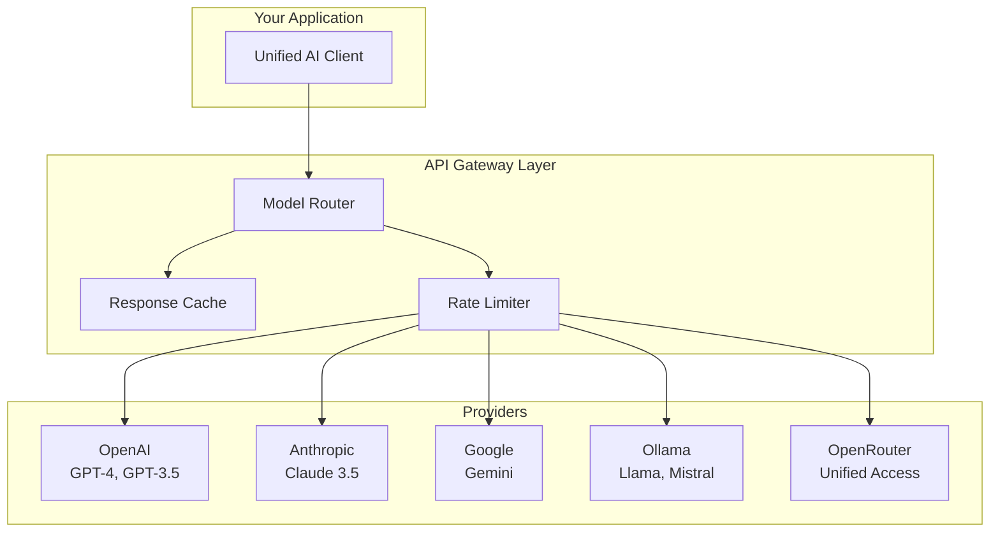

# Phase 2: Prompt Engineering & Model APIs

> **Objective:** Learn how developers communicate with LLMs effectively.

---

# Part 5: AI APIs

**Connecting your code to LLM providers—mastering authentication, streaming, rate limits, and cost optimization.**

---

## The Target: What We're Building Right Now

In this part, we're building six interconnected tools:

1. **A Multi-Provider Client** — Unified interface for OpenAI, Anthropic, Google, and Ollama
2. **A Streaming Response Handler** — Real-time streaming with SSE and WebSockets
3. **A Rate Limit Manager** — Smart throttling to avoid hitting limits
4. **A Cost Optimization Engine** — Choose the cheapest model for each task
5. **A Model Router** — Route requests to the best model based on task requirements
6. **An API Key Manager** — Secure key rotation and management

**Why this matters:** You'll rarely use just one AI provider in production. Mastering multiple APIs and their nuances is essential for building robust, cost-effective applications.

---

## The Concept: Connecting to AI APIs

### The Restaurant Analogy

Imagine you're building a food delivery app that works with multiple restaurants:

- **Each restaurant** has its own menu (API endpoints)
- **Each restaurant** has its own ordering system (authentication)
- **Each restaurant** has different delivery times (latency)
- **Each restaurant** has different pricing (cost)
- **Some restaurants** deliver faster (streaming)
- **Some restaurants** have limited seating (rate limits)

Your job is to build a unified ordering system that:
1. Talks to all restaurants in their own language
2. Handles authentication for each
3. Manages order limits
4. Chooses the best restaurant for each order
5. Tracks costs across all restaurants

**This is exactly what an AI API integration does.**



### Provider Comparison

| Feature | OpenAI | Anthropic | Google | Ollama | OpenRouter |
|---------|--------|-----------|--------|--------|------------|
| **Models** | GPT-4, GPT-3.5 | Claude 3.5 | Gemini | Llama, Mistral | All major models |
| **Pricing** | Pay per token | Pay per token | Pay per token | Free (local) | Pay per token |
| **Streaming** | ✅ Yes | ✅ Yes | ✅ Yes | ✅ Yes | ✅ Yes |
| **Function Calling** | ✅ Yes | ✅ Yes | ✅ Yes | Limited | ✅ Yes |
| **Vision** | ✅ Yes | ✅ Yes | ✅ Yes | Limited | ✅ Yes |
| **Context Window** | 128K | 200K | 2M | Varies | Varies |
| **Rate Limits** | Strict | Strict | Strict | None | Moderate |

### Authentication Methods

Each provider uses a different authentication method:

| Provider | Authentication | Example |
|----------|---------------|---------|
| **OpenAI** | API Key in Header | `Authorization: Bearer sk-...` |
| **Anthropic** | API Key in Header | `x-api-key: sk-ant-...` |
| **Google** | API Key in Query/Header | `?key=AIza...` or Bearer token |
| **Ollama** | None (local) | Connect to localhost |
| **OpenRouter** | API Key in Header | `Authorization: Bearer sk-or-...` |

### Rate Limits: The Hidden Constraint

Every API provider has rate limits. These are the maximum number of requests you can make in a given time period.

**Types of rate limits:**

1. **Requests per minute** (RPM) — How many API calls you can make
2. **Tokens per minute** (TPM) — How many tokens you can process
3. **Requests per day** (RPD) — Daily limits (rare)
4. **Concurrent requests** — How many requests at once

**What happens when you hit a rate limit:**

```
HTTP 429: Too Many Requests
Response: {
    "error": {
        "message": "Rate limit exceeded",
        "type": "rate_limit",
        "retry_after": 60  // seconds to wait
    }
}
```

**How to handle rate limits:**

1. **Exponential backoff** — Wait longer each time you get a 429
2. **Retry with jitter** — Add randomness to avoid collisions
3. **Queue requests** — Don't send more than the limit
4. **Circuit breaker** — Stop sending if the provider is overwhelmed

### Cost Optimization Strategies

LLM costs can add up quickly. Here's how to optimize:

| Strategy | How it Works | Savings |
|----------|--------------|---------|
| **Model Selection** | Use cheaper models for simple tasks | 50-90% |
| **Prompt Optimization** | Shorten prompts, remove redundancy | 20-40% |
| **Caching** | Cache identical requests | 30-90% |
| **Batching** | Batch multiple requests together | 10-30% |
| **Streaming** | No cost difference, better UX | - |
| **Token Management** | Monitor and control token usage | 20-60% |

---

## The Implementation: Building Our API Tools

### Target File Structure

```
phase-2-prompt-engineering/
└── module-5-apis/
    ├── 01_multi_provider_client.py
    ├── 02_streaming_handler.py
    ├── 03_rate_limit_manager.py
    ├── 04_cost_optimizer.py
    ├── 05_model_router.py
    ├── 06_api_key_manager.py
    ├── requirements.txt
    └── README.md
```

### Step 1: Multi-Provider Client

Create `01_multi_provider_client.py`:

```python
#!/usr/bin/env python3
"""
Module 5: Multi-Provider AI Client

A unified client that works with multiple AI providers.
This is the foundation for building provider-agnostic applications.
"""

import os
import sys
from pathlib import Path
import json
from abc import ABC, abstractmethod
from typing import List, Dict, Any, Optional, Union, Iterator
from dataclasses import dataclass
from enum import Enum
import time

sys.path.insert(0, str(Path(__file__).parent.parent.parent.parent))

from shared.utils.config import load_config
from shared.utils.logging import setup_logging

setup_logging(debug=False)
config = load_config()

# --- Data Models ---

@dataclass
class Message:
    """A message in a conversation."""
    role: str  # "system", "user", "assistant"
    content: str

@dataclass
class ChatCompletion:
    """A chat completion response."""
    content: str
    model: str
    provider: str
    usage: Dict[str, int]  # prompt_tokens, completion_tokens, total_tokens
    finish_reason: Optional[str] = None

class Provider(Enum):
    """Supported AI providers."""
    OPENAI = "openai"
    ANTHROPIC = "anthropic"
    GOOGLE = "google"
    OLLAMA = "ollama"
    OPENROUTER = "openrouter"

# --- Base Provider Client ---

class AIProviderClient(ABC):
    """Abstract base class for all provider clients."""
    
    @abstractmethod
    def chat(
        self,
        messages: List[Message],
        model: str,
        temperature: float = 0.7,
        max_tokens: int = 1000,
        top_p: float = 1.0,
        stream: bool = False,
        **kwargs
    ) -> Union[ChatCompletion, Iterator[ChatCompletion]]:
        """Send a chat completion request."""
        pass
    
    @abstractmethod
    def get_models(self) -> List[str]:
        """Get available models."""
        pass
    
    @property
    @abstractmethod
    def provider_name(self) -> str:
        """Get the provider name."""
        pass

# --- OpenAI Provider ---

class OpenAIClient(AIProviderClient):
    """OpenAI provider client."""
    
    def __init__(self, api_key: Optional[str] = None):
        from openai import OpenAI
        
        self.api_key = api_key or config.get("openai_api_key")
        if not self.api_key:
            raise ValueError("OpenAI API key required")
        
        self.client = OpenAI(api_key=self.api_key)
        self._provider_name = "openai"
        self.default_model = "gpt-4o-mini"
    
    @property
    def provider_name(self) -> str:
        return self._provider_name
    
    def get_models(self) -> List[str]:
        try:
            models = self.client.models.list()
            return [m.id for m in models if "gpt" in m.id]
        except:
            return ["gpt-4o-mini", "gpt-4o", "gpt-3.5-turbo"]
    
    def chat(
        self,
        messages: List[Message],
        model: str = None,
        temperature: float = 0.7,
        max_tokens: int = 1000,
        top_p: float = 1.0,
        stream: bool = False,
        **kwargs
    ) -> Union[ChatCompletion, Iterator[ChatCompletion]]:
        model = model or self.default_model
        
        # Convert messages to OpenAI format
        openai_messages = [
            {"role": m.role, "content": m.content}
            for m in messages
        ]
        
        try:
            response = self.client.chat.completions.create(
                model=model,
                messages=openai_messages,
                temperature=temperature,
                max_tokens=max_tokens,
                top_p=top_p,
                stream=stream,
                **kwargs
            )
            
            if stream:
                return self._handle_stream(response)
            else:
                return ChatCompletion(
                    content=response.choices[0].message.content,
                    model=response.model,
                    provider=self.provider_name,
                    usage={
                        "prompt_tokens": response.usage.prompt_tokens,
                        "completion_tokens": response.usage.completion_tokens,
                        "total_tokens": response.usage.total_tokens
                    },
                    finish_reason=response.choices[0].finish_reason
                )
        except Exception as e:
            raise Exception(f"OpenAI API error: {e}")
    
    def _handle_stream(self, stream):
        """Handle streaming response from OpenAI."""
        for chunk in stream:
            if chunk.choices[0].delta.content:
                yield ChatCompletion(
                    content=chunk.choices[0].delta.content,
                    model=chunk.model,
                    provider=self.provider_name,
                    usage={},
                    finish_reason=None
                )

# --- Anthropic Provider ---

class AnthropicClient(AIProviderClient):
    """Anthropic Claude provider client."""
    
    def __init__(self, api_key: Optional[str] = None):
        from anthropic import Anthropic
        
        self.api_key = api_key or config.get("anthropic_api_key")
        if not self.api_key:
            raise ValueError("Anthropic API key required")
        
        self.client = Anthropic(api_key=self.api_key)
        self._provider_name = "anthropic"
        self.default_model = "claude-3-5-sonnet-20241022"
    
    @property
    def provider_name(self) -> str:
        return self._provider_name
    
    def get_models(self) -> List[str]:
        return ["claude-3-5-sonnet-20241022", "claude-3-opus-20240229", "claude-3-haiku-20240307"]
    
    def chat(
        self,
        messages: List[Message],
        model: str = None,
        temperature: float = 0.7,
        max_tokens: int = 1000,
        top_p: float = 1.0,
        stream: bool = False,
        **kwargs
    ) -> Union[ChatCompletion, Iterator[ChatCompletion]]:
        model = model or self.default_model
        
        # Extract system message (Anthropic has separate system parameter)
        system = None
        user_messages = []
        
        for msg in messages:
            if msg.role == "system":
                system = msg.content
            else:
                user_messages.append({
                    "role": msg.role,
                    "content": msg.content
                })
        
        try:
            response = self.client.messages.create(
                model=model,
                system=system,
                messages=user_messages,
                temperature=temperature,
                max_tokens=max_tokens,
                top_p=top_p,
                stream=stream,
                **kwargs
            )
            
            if stream:
                return self._handle_stream(response)
            else:
                return ChatCompletion(
                    content=response.content[0].text,
                    model=response.model,
                    provider=self.provider_name,
                    usage={
                        "prompt_tokens": response.usage.input_tokens,
                        "completion_tokens": response.usage.output_tokens,
                        "total_tokens": response.usage.input_tokens + response.usage.output_tokens
                    },
                    finish_reason=response.stop_reason
                )
        except Exception as e:
            raise Exception(f"Anthropic API error: {e}")
    
    def _handle_stream(self, stream):
        """Handle streaming response from Anthropic."""
        for chunk in stream:
            if chunk.type == "content_block_delta":
                if chunk.delta.text:
                    yield ChatCompletion(
                        content=chunk.delta.text,
                        model=chunk.model,
                        provider=self.provider_name,
                        usage={},
                        finish_reason=None
                    )

# --- Google Gemini Provider ---

class GoogleClient(AIProviderClient):
    """Google Gemini provider client."""
    
    def __init__(self, api_key: Optional[str] = None):
        import google.generativeai as genai
        
        self.api_key = api_key or config.get("google_api_key")
        if not self.api_key:
            raise ValueError("Google API key required")
        
        genai.configure(api_key=self.api_key)
        self.client = genai
        self._provider_name = "google"
        self.default_model = "gemini-1.5-flash"
    
    @property
    def provider_name(self) -> str:
        return self._provider_name
    
    def get_models(self) -> List[str]:
        return ["gemini-1.5-pro", "gemini-1.5-flash"]
    
    def chat(
        self,
        messages: List[Message],
        model: str = None,
        temperature: float = 0.7,
        max_tokens: int = 1000,
        top_p: float = 1.0,
        stream: bool = False,
        **kwargs
    ) -> Union[ChatCompletion, Iterator[ChatCompletion]]:
        model = model or self.default_model
        
        # Google uses a different message format
        # Convert messages to a single prompt or chat history
        
        try:
            model_obj = self.client.GenerativeModel(model)
            
            # Build prompt from messages
            prompt_parts = []
            system = None
            
            for msg in messages:
                if msg.role == "system":
                    system = msg.content
                else:
                    prompt_parts.append(f"{msg.role.upper()}: {msg.content}")
            
            prompt = "\n".join(prompt_parts)
            if system:
                prompt = f"System: {system}\n\n{prompt}"
            
            # Generate response
            response = model_obj.generate_content(
                prompt,
                generation_config={
                    "temperature": temperature,
                    "max_output_tokens": max_tokens,
                    "top_p": top_p,
                },
                stream=stream
            )
            
            if stream:
                return self._handle_stream(response)
            else:
                return ChatCompletion(
                    content=response.text,
                    model=model,
                    provider=self.provider_name,
                    usage={
                        "prompt_tokens": 0,  # Google doesn't provide token counts
                        "completion_tokens": 0,
                        "total_tokens": 0
                    },
                    finish_reason=None
                )
        except Exception as e:
            raise Exception(f"Google API error: {e}")
    
    def _handle_stream(self, stream):
        """Handle streaming response from Google."""
        for chunk in stream:
            if chunk.text:
                yield ChatCompletion(
                    content=chunk.text,
                    model=self.default_model,
                    provider=self.provider_name,
                    usage={},
                    finish_reason=None
                )

# --- Ollama Local Provider ---

class OllamaClient(AIProviderClient):
    """Ollama local provider client."""
    
    def __init__(self, host: str = "http://localhost:11434"):
        import ollama
        
        self.host = host
        self.client = ollama.Client(host=host)
        self._provider_name = "ollama"
        self.default_model = "llama3.2"
    
    @property
    def provider_name(self) -> str:
        return self._provider_name
    
    def get_models(self) -> List[str]:
        try:
            models = self.client.list()
            return [m["model"] for m in models["models"]]
        except:
            return ["llama3.2", "mistral", "gemma2"]
    
    def chat(
        self,
        messages: List[Message],
        model: str = None,
        temperature: float = 0.7,
        max_tokens: int = 1000,
        top_p: float = 1.0,
        stream: bool = False,
        **kwargs
    ) -> Union[ChatCompletion, Iterator[ChatCompletion]]:
        model = model or self.default_model
        
        # Convert messages to Ollama format
        ollama_messages = [
            {"role": m.role, "content": m.content}
            for m in messages
        ]
        
        try:
            response = self.client.chat(
                model=model,
                messages=ollama_messages,
                options={
                    "temperature": temperature,
                    "num_predict": max_tokens,
                    "top_p": top_p
                },
                stream=stream,
                **kwargs
            )
            
            if stream:
                return self._handle_stream(response)
            else:
                return ChatCompletion(
                    content=response["message"]["content"],
                    model=model,
                    provider=self.provider_name,
                    usage={
                        "prompt_tokens": 0,  # Ollama doesn't provide token counts
                        "completion_tokens": 0,
                        "total_tokens": 0
                    },
                    finish_reason=response.get("done_reason")
                )
        except Exception as e:
            raise Exception(f"Ollama API error: {e}")
    
    def _handle_stream(self, stream):
        """Handle streaming response from Ollama."""
        for chunk in stream:
            if chunk["message"]["content"]:
                yield ChatCompletion(
                    content=chunk["message"]["content"],
                    model=chunk.get("model", self.default_model),
                    provider=self.provider_name,
                    usage={},
                    finish_reason=chunk.get("done_reason")
                )

# --- Unified Client Factory ---

class AIClientFactory:
    """Factory for creating AI provider clients."""
    
    _clients = {
        Provider.OPENAI: OpenAIClient,
        Provider.ANTHROPIC: AnthropicClient,
        Provider.GOOGLE: GoogleClient,
        Provider.OLLAMA: OllamaClient,
    }
    
    @classmethod
    def create(cls, provider: Union[str, Provider], **kwargs) -> AIProviderClient:
        """Create a provider client."""
        if isinstance(provider, str):
            provider = Provider(provider.lower())
        
        client_class = cls._clients.get(provider)
        if not client_class:
            raise ValueError(f"Unsupported provider: {provider}")
        
        return client_class(**kwargs)
    
    @classmethod
    def get_available_providers(cls) -> List[str]:
        """Get list of available providers."""
        return [p.value for p in cls._clients.keys()]

# --- Demonstration ---

def demonstrate_multi_provider():
    """Demonstrate the multi-provider client."""
    print("\n" + "="*80)
    print("🔌 MULTI-PROVIDER AI CLIENT DEMONSTRATION")
    print("="*80)
    
    # Test each provider
    providers = []
    
    # Check which providers are available
    if config.get("openai_api_key"):
        providers.append(("OpenAI", Provider.OPENAI))
    if config.get("anthropic_api_key"):
        providers.append(("Anthropic", Provider.ANTHROPIC))
    if config.get("google_api_key"):
        providers.append(("Google", Provider.GOOGLE))
    # Always include Ollama (if running)
    providers.append(("Ollama (Local)", Provider.OLLAMA))
    
    print(f"\n📡 Testing {len(providers)} providers...")
    
    for name, provider in providers:
        print(f"\n🤖 {name}:")
        print("-"*40)
        
        try:
            client = AIClientFactory.create(provider)
            
            # Test with a simple message
            messages = [
                Message(role="system", content="You are a helpful assistant."),
                Message(role="user", content="What is the capital of France?")
            ]
            
            result = client.chat(
                messages=messages,
                temperature=0.7,
                max_tokens=100
            )
            
            print(f"✅ Response: {result.content[:100]}...")
            print(f"📊 Model: {result.model}")
            print(f"📊 Tokens: {result.usage.get('total_tokens', 'N/A')}")
            
            # Show available models
            models = client.get_models()
            print(f"📊 Available models: {', '.join(models[:3])}...")
            
        except Exception as e:
            print(f"❌ Error: {e}")

def main():
    """Run the demonstration."""
    print("\n" + "="*80)
    print("AI TUTORIAL SERIES - PART 5: MULTI-PROVIDER AI CLIENT")
    print("="*80)
    
    demonstrate_multi_provider()
    
    print("\n" + "="*80)
    print("✅ Multi-provider client demonstration complete!")
    print("="*80)

if __name__ == "__main__":
    main()
```

### Step 2: Streaming Response Handler

Create `02_streaming_handler.py`:

```python
#!/usr/bin/env python3
"""
Module 5: Streaming Response Handler

Handle real-time streaming responses from AI providers.
This enables chat-like experiences where text appears as it's generated.
"""

import os
import sys
from pathlib import Path
import json
import time
from typing import List, Dict, Any, Iterator, Optional
from dataclasses import dataclass
import threading
from queue import Queue

sys.path.insert(0, str(Path(__file__).parent.parent.parent.parent))

from shared.utils.config import load_config
from shared.utils.logging import setup_logging

setup_logging(debug=False)
config = load_config()

# Import from the multi-provider client
from multi_provider_client import (
    AIClientFactory, Message, ChatCompletion, Provider
)

@dataclass
class StreamEvent:
    """A streaming event."""
    type: str  # "chunk", "complete", "error"
    content: Optional[str] = None
    metadata: Optional[Dict[str, Any]] = None

class StreamingHandler:
    """
    Handle streaming responses from AI providers.
    
    This class provides:
    - Real-time streaming of AI responses
    - Event-based processing
    - Thread-safe streaming
    - Connection management
    """
    
    def __init__(self):
        """Initialize the streaming handler."""
        self.active_streams = {}
        self.stream_counter = 0
    
    def stream_chat(
        self,
        provider: str,
        messages: List[Message],
        model: str = None,
        temperature: float = 0.7,
        max_tokens: int = 1000,
        **kwargs
    ) -> Iterator[StreamEvent]:
        """
        Stream a chat completion.
        
        Args:
            provider: Provider name
            messages: List of messages
            model: Model to use
            temperature: Temperature
            max_tokens: Max tokens
            
        Yields:
            StreamEvent objects
        """
        try:
            client = AIClientFactory.create(provider)
            stream_id = self.stream_counter
            self.stream_counter += 1
            
            # Send a start event
            yield StreamEvent(
                type="start",
                content=None,
                metadata={"stream_id": stream_id, "provider": provider}
            )
            
            # Start streaming
            full_content = ""
            chunk_count = 0
            
            for chunk in client.chat(
                messages=messages,
                model=model,
                temperature=temperature,
                max_tokens=max_tokens,
                stream=True,
                **kwargs
            ):
                chunk_count += 1
                full_content += chunk.content
                
                # Yield each chunk
                yield StreamEvent(
                    type="chunk",
                    content=chunk.content,
                    metadata={
                        "chunk_number": chunk_count,
                        "total_so_far": len(full_content)
                    }
                )
            
            # Send completion event
            yield StreamEvent(
                type="complete",
                content=full_content,
                metadata={
                    "total_chunks": chunk_count,
                    "total_length": len(full_content)
                }
            )
            
        except Exception as e:
            yield StreamEvent(
                type="error",
                content=None,
                metadata={"error": str(e)}
            )
    
    def stream_with_callbacks(
        self,
        provider: str,
        messages: List[Message],
        on_chunk: callable = None,
        on_complete: callable = None,
        on_error: callable = None,
        **kwargs
    ) -> str:
        """
        Stream with callback functions.
        
        Args:
            provider: Provider name
            messages: List of messages
            on_chunk: Called for each chunk
            on_complete: Called when complete
            on_error: Called on error
            **kwargs: Additional parameters
            
        Returns:
            Complete response text
        """
        full_response = ""
        
        for event in self.stream_chat(provider, messages, **kwargs):
            if event.type == "chunk" and event.content:
                full_response += event.content
                if on_chunk:
                    on_chunk(event.content, full_response)
            elif event.type == "complete":
                if on_complete:
                    on_complete(full_response, event.metadata)
            elif event.type == "error":
                if on_error:
                    on_error(event.metadata.get("error"))
        
        return full_response
    
    def simulate_streaming_demo(self):
        """Demonstrate streaming with a simulated slow response."""
        print("\n" + "="*80)
        print("📡 STREAMING DEMONSTRATION")
        print("="*80)
        
        # Check available providers
        providers = []
        if config.get("openai_api_key"):
            providers.append(("OpenAI", Provider.OPENAI))
        if config.get("anthropic_api_key"):
            providers.append(("Anthropic", Provider.ANTHROPIC))
        if config.get("google_api_key"):
            providers.append(("Google", Provider.GOOGLE))
        
        if not providers:
            print("❌ No providers available")
            return
        
        # Test streaming with the first available provider
        name, provider = providers[0]
        
        print(f"\n🤖 Using {name} with streaming:")
        print("-"*40)
        
        messages = [
            Message(
                role="system",
                content="You are a helpful assistant. Keep your responses brief and clear."
            ),
            Message(
                role="user",
                content="Explain what artificial intelligence is in 3 sentences."
            )
        ]
        
        # Define callbacks
        def on_chunk(chunk, full_so_far):
            print(chunk, end="", flush=True)
        
        def on_complete(full, metadata):
            print(f"\n\n✅ Complete! {metadata.get('total_length')} characters")
        
        def on_error(error):
            print(f"\n❌ Error: {error}")
        
        # Stream with callbacks
        handler.stream_with_callbacks(
            provider=provider.value,
            messages=messages,
            on_chunk=on_chunk,
            on_complete=on_complete,
            on_error=on_error,
            temperature=0.7,
            max_tokens=150
        )

def create_sse_response_generator():
    """
    Create a Server-Sent Events (SSE) response generator.
    This is useful for web applications.
    
    Returns:
        Generator that yields SSE formatted events
    """
    from multi_provider_client import AIClientFactory, Message, Provider
    
    def generate_sse(
        provider: str,
        messages: List[Dict[str, str]],
        **kwargs
    ):
        """Generate SSE formatted events."""
        # Convert dict messages to Message objects
        msg_objects = [Message(**m) for m in messages]
        
        try:
            client = AIClientFactory.create(provider)
            
            # Start streaming
            for chunk in client.chat(
                messages=msg_objects,
                stream=True,
                **kwargs
            ):
                # Format as SSE
                data = json.dumps({
                    "type": "chunk",
                    "content": chunk.content,
                    "model": chunk.model
                })
                yield f"data: {data}\n\n"
            
            # Send completion event
            yield f"data: {json.dumps({'type': 'complete'})}\n\n"
            
        except Exception as e:
            error_data = json.dumps({
                "type": "error",
                "error": str(e)
            })
            yield f"data: {error_data}\n\n"
    
    return generate_sse

def demonstrate_sse():
    """Demonstrate SSE generation."""
    print("\n" + "="*80)
    print("📡 SERVER-SENT EVENTS (SSE) DEMONSTRATION")
    print("="*80)
    
    # Check if OpenAI is available
    if not config.get("openai_api_key"):
        print("❌ OpenAI API key not available")
        return
    
    generate_sse = create_sse_response_generator()
    
    print("\n📝 Generating SSE events...")
    print("-"*40)
    
    messages = [
        {"role": "system", "content": "You are a helpful assistant."},
        {"role": "user", "content": "Write a haiku about AI."}
    ]
    
    for event in generate_sse("openai", messages, temperature=0.8, max_tokens=100):
        print(event, end="")
    
    print("-"*40)
    print("✅ SSE generation complete")

def main():
    """Run streaming demonstrations."""
    print("\n" + "="*80)
    print("AI TUTORIAL SERIES - STREAMING RESPONSE HANDLER")
    print("="*80)
    
    global handler
    handler = StreamingHandler()
    
    # Run demonstrations
    handler.simulate_streaming_demo()
    demonstrate_sse()

if __name__ == "__main__":
    main()
```

### Step 3: Rate Limit Manager

Create `03_rate_limit_manager.py`:

```python
#!/usr/bin/env python3
"""
Module 5: Rate Limit Manager

Handle rate limits from AI providers with exponential backoff,
circuit breakers, and request queuing.
"""

import os
import sys
from pathlib import Path
import json
import time
from typing import Dict, Any, Optional
from datetime import datetime, timedelta
from collections import defaultdict
import threading
import random

sys.path.insert(0, str(Path(__file__).parent.parent.parent.parent))

from shared.utils.config import load_config
from shared.utils.logging import setup_logging

setup_logging(debug=False)
config = load_config()

class RateLimitManager:
    """
    Manage rate limits for AI providers.
    
    This class implements:
    - Token bucket algorithm for rate limiting
    - Exponential backoff with jitter
    - Circuit breakers for providers
    - Request queuing
    - Rate limit tracking
    """
    
    def __init__(self):
        """Initialize the rate limit manager."""
        # Token buckets for each provider
        self.buckets = defaultdict(lambda: {
            "tokens": 0,  # Current tokens
            "capacity": 1000,  # Max tokens per minute
            "refill_rate": 1000 / 60,  # Tokens per second
            "last_refill": time.time()
        })
        
        # Circuit breaker states
        self.circuits = defaultdict(lambda: {
            "state": "closed",  # closed, open, half-open
            "failures": 0,
            "failure_threshold": 5,
            "timeout": 60,  # Seconds to wait before trying again
            "last_failure": None,
            "successes": 0,
            "success_threshold": 3
        })
        
        # Rate limit tracking
        self.limits = defaultdict(lambda: {
            "requests": [],  # Timestamps of requests
            "window": 60,  # Window in seconds
            "max_requests": 100  # Max requests per window
        })
        
        # Request queue
        self.queue = []
        self.processing = False
        
    def check_rate_limit(self, provider: str) -> bool:
        """
        Check if a request can be made.
        
        Args:
            provider: Provider name
            
        Returns:
            True if request is allowed
        """
        # Check circuit breaker
        if not self.check_circuit(provider):
            return False
        
        # Check token bucket
        self.refill_bucket(provider)
        bucket = self.buckets[provider]
        
        if bucket["tokens"] >= 1:
            bucket["tokens"] -= 1
            return True
        
        return False
    
    def refill_bucket(self, provider: str) -> None:
        """
        Refill the token bucket.
        
        Args:
            provider: Provider name
        """
        bucket = self.buckets[provider]
        now = time.time()
        
        elapsed = now - bucket["last_refill"]
        tokens_to_add = elapsed * bucket["refill_rate"]
        
        bucket["tokens"] = min(
            bucket["capacity"],
            bucket["tokens"] + tokens_to_add
        )
        bucket["last_refill"] = now
    
    def record_request(self, provider: str) -> None:
        """
        Record a request for the provider.
        
        Args:
            provider: Provider name
        """
        limit = self.limits[provider]
        now = time.time()
        
        # Add timestamp
        limit["requests"].append(now)
        
        # Remove old timestamps
        cutoff = now - limit["window"]
        limit["requests"] = [t for t in limit["requests"] if t >= cutoff]
    
    def record_response(self, provider: str, success: bool) -> None:
        """
        Record a response for circuit breaker.
        
        Args:
            provider: Provider name
            success: Whether the request succeeded
        """
        circuit = self.circuits[provider]
        
        if success:
            circuit["successes"] += 1
            
            # If in half-open state and enough successes, close
            if circuit["state"] == "half-open":
                if circuit["successes"] >= circuit["success_threshold"]:
                    circuit["state"] = "closed"
                    circuit["failures"] = 0
                    circuit["successes"] = 0
        else:
            circuit["failures"] += 1
            circuit["last_failure"] = time.time()
            
            # If failures threshold reached, open circuit
            if circuit["failures"] >= circuit["failure_threshold"]:
                circuit["state"] = "open"
                circuit["successes"] = 0
    
    def check_circuit(self, provider: str) -> bool:
        """
        Check if circuit is closed for a provider.
        
        Args:
            provider: Provider name
            
        Returns:
            True if circuit is closed (requests allowed)
        """
        circuit = self.circuits[provider]
        
        if circuit["state"] == "closed":
            return True
        
        if circuit["state"] == "open":
            # Check if timeout has elapsed
            if circuit["last_failure"]:
                elapsed = time.time() - circuit["last_failure"]
                if elapsed >= circuit["timeout"]:
                    circuit["state"] = "half-open"
                    circuit["successes"] = 0
                    return True
            
            return False
        
        if circuit["state"] == "half-open":
            # Allow some requests through
            return True
        
        return False
    
    def get_backoff_time(self, provider: str, attempt: int) -> float:
        """
        Calculate backoff time with jitter.
        
        Args:
            provider: Provider name
            attempt: Attempt number (starting at 0)
            
        Returns:
            Seconds to wait
        """
        # Exponential backoff: 2^attempt seconds
        base_delay = 2 ** attempt
        
        # Add jitter (random 0-50% variation)
        jitter = random.uniform(0, 0.5) * base_delay
        
        # Add provider-specific delays
        provider_delays = {
            "openai": 0.2,
            "anthropic": 0.3,
            "google": 0.1,
            "ollama": 0.0,
        }
        
        return base_delay + jitter + provider_delays.get(provider, 0.1)
    
    def wait_and_retry(
        self,
        provider: str,
        attempt: int,
        max_attempts: int = 5
    ) -> bool:
        """
        Wait for retry with backoff.
        
        Args:
            provider: Provider name
            attempt: Current attempt
            max_attempts: Maximum attempts
            
        Returns:
            True if should retry
        """
        if attempt >= max_attempts:
            return False
        
        wait_time = self.get_backoff_time(provider, attempt)
        print(f"⏳ Waiting {wait_time:.2f}s before retry (attempt {attempt + 1}/{max_attempts})")
        time.sleep(wait_time)
        
        return True
    
    def execute_with_retry(
        self,
        provider: str,
        func: callable,
        max_attempts: int = 5,
        **kwargs
    ) -> Any:
        """
        Execute a function with retry logic.
        
        Args:
            provider: Provider name
            func: Function to execute
            max_attempts: Maximum attempts
            **kwargs: Arguments for the function
            
        Returns:
            Function result
        """
        attempt = 0
        last_error = None
        
        while attempt < max_attempts:
            # Check rate limit
            if not self.check_rate_limit(provider):
                print(f"⏳ Rate limit hit for {provider}, waiting...")
                time.sleep(1)
                continue
            
            try:
                # Execute function
                result = func(**kwargs)
                
                # Record success
                self.record_response(provider, True)
                self.record_request(provider)
                
                return result
                
            except Exception as e:
                last_error = e
                
                # Record failure
                self.record_response(provider, False)
                
                # Check if it's a rate limit error
                error_str = str(e).lower()
                if "rate limit" in error_str or "429" in error_str:
                    print(f"⚠️ Rate limit exceeded for {provider}")
                    
                    # Wait and retry
                    if self.wait_and_retry(provider, attempt, max_attempts):
                        attempt += 1
                        continue
                    else:
                        raise Exception(f"Rate limit exceeded after {max_attempts} attempts")
                
                # Check if it's a circuit breaker error
                if "circuit" in error_str:
                    print(f"⚠️ Circuit breaker open for {provider}")
                    
                    # Wait and retry
                    if self.wait_and_retry(provider, attempt, max_attempts):
                        attempt += 1
                        continue
                    else:
                        raise Exception(f"Circuit breaker open after {max_attempts} attempts")
                
                # Other errors
                if self.wait_and_retry(provider, attempt, max_attempts):
                    attempt += 1
                    continue
                else:
                    raise Exception(f"Failed after {max_attempts} attempts: {e}")
        
        raise Exception(f"Failed after {max_attempts} attempts: {last_error}")

def demonstrate_rate_limit_manager():
    """Demonstrate the rate limit manager."""
    print("\n" + "="*80)
    print("🚦 RATE LIMIT MANAGER DEMONSTRATION")
    print("="*80)
    
    manager = RateLimitManager()
    
    print("\n📊 Simulating rate-limited requests...")
    print("-"*40)
    
    # Simulate a function that sometimes fails
    def simulated_api_call(count):
        """Simulate an API call."""
        # Simulate different outcomes
        if count % 3 == 0:
            raise Exception("Rate limit exceeded")
        if count % 5 == 0:
            raise Exception("Internal server error")
        return f"Success on attempt {count}"
    
    # Execute with retry
    provider = "openai"
    
    for i in range(10):
        try:
            result = manager.execute_with_retry(
                provider=provider,
                func=simulated_api_call,
                max_attempts=3,
                count=i
            )
            print(f"✅ {result}")
        except Exception as e:
            print(f"❌ {e}")
        
        # Show circuit status
        circuit = manager.circuits[provider]
        bucket = manager.buckets[provider]
        print(f"   Circuit: {circuit['state']}, Tokens: {bucket['tokens']:.1f}")
    
    print("\n💡 Rate Limit Manager Features:")
    print("   ✅ Token bucket rate limiting")
    print("   ✅ Exponential backoff with jitter")
    print("   ✅ Circuit breaker protection")
    print("   ✅ Request queuing (coming soon)")

def main():
    """Run the rate limit manager demonstration."""
    print("\n" + "="*80)
    print("AI TUTORIAL SERIES - RATE LIMIT MANAGER")
    print("="*80)
    
    demonstrate_rate_limit_manager()

if __name__ == "__main__":
    main()
```

### Step 4: Cost Optimizer

Create `04_cost_optimizer.py`:

```python
#!/usr/bin/env python3
"""
Module 5: Cost Optimizer

Optimize AI costs by selecting the right model and managing token usage.
"""

import os
import sys
from pathlib import Path
import json
from typing import List, Dict, Any, Optional, Tuple
from dataclasses import dataclass
from enum import Enum

sys.path.insert(0, str(Path(__file__).parent.parent.parent.parent))

from shared.utils.config import load_config
from shared.utils.logging import setup_logging

setup_logging(debug=False)
config = load_config()

@dataclass
class CostEstimate:
    """Cost estimate for a model."""
    model: str
    provider: str
    estimated_cost: float
    token_count: int
    is_feasible: bool
    speed_estimate: float  # Relative speed (1.0 = fastest)
    quality_estimate: float  # Relative quality (1.0 = highest)

class CostOptimizer:
    """
    Optimize AI costs by selecting the right model.
    
    This class provides:
    - Model pricing database
    - Cost estimation for tasks
    - Model recommendation based on task requirements
    - Budget management
    """
    
    def __init__(self):
        """Initialize the cost optimizer."""
        # Pricing database (USD per 1M tokens)
        self.pricing = {
            "openai": {
                "gpt-4o-mini": {"input": 0.150, "output": 0.600, "speed": 0.8, "quality": 0.7},
                "gpt-4o": {"input": 5.00, "output": 15.00, "speed": 0.6, "quality": 1.0},
                "gpt-4-turbo": {"input": 10.00, "output": 30.00, "speed": 0.7, "quality": 0.95},
                "gpt-4": {"input": 30.00, "output": 60.00, "speed": 0.5, "quality": 0.95},
                "gpt-3.5-turbo": {"input": 0.50, "output": 1.50, "speed": 1.0, "quality": 0.5},
            },
            "anthropic": {
                "claude-3-5-sonnet": {"input": 3.00, "output": 15.00, "speed": 0.7, "quality": 0.95},
                "claude-3-opus": {"input": 15.00, "output": 75.00, "speed": 0.5, "quality": 1.0},
                "claude-3-haiku": {"input": 0.25, "output": 1.25, "speed": 0.9, "quality": 0.6},
            },
            "google": {
                "gemini-1.5-pro": {"input": 2.50, "output": 7.50, "speed": 0.6, "quality": 0.9},
                "gemini-1.5-flash": {"input": 0.35, "output": 1.05, "speed": 0.9, "quality": 0.7},
            }
        }
    
    def estimate_cost(
        self,
        provider: str,
        model: str,
        prompt_tokens: int,
        completion_tokens: int
    ) -> float:
        """
        Estimate cost for a request.
        
        Args:
            provider: Provider name
            model: Model name
            prompt_tokens: Number of prompt tokens
            completion_tokens: Number of completion tokens
            
        Returns:
            Estimated cost in USD
        """
        provider_pricing = self.pricing.get(provider, {})
        model_pricing = provider_pricing.get(model, {"input": 0, "output": 0})
        
        input_cost = (prompt_tokens / 1_000_000) * model_pricing["input"]
        output_cost = (completion_tokens / 1_000_000) * model_pricing["output"]
        
        return input_cost + output_cost
    
    def get_model_alternatives(
        self,
        provider: str,
        model: str,
        prompt_tokens: int,
        completion_tokens: int,
        min_quality: float = 0.5,
        max_budget: float = None
    ) -> List[CostEstimate]:
        """
        Get alternative models for a task.
        
        Args:
            provider: Provider name
            model: Current model
            prompt_tokens: Number of prompt tokens
            completion_tokens: Number of completion tokens
            min_quality: Minimum quality threshold
            max_budget: Maximum budget
            
        Returns:
            List of model alternatives with cost estimates
        """
        alternatives = []
        provider_pricing = self.pricing.get(provider, {})
        
        for alt_model, pricing in provider_pricing.items():
            # Skip if quality is too low
            if pricing.get("quality", 0) < min_quality:
                continue
            
            # Calculate cost
            cost = self.estimate_cost(provider, alt_model, prompt_tokens, completion_tokens)
            
            # Skip if over budget
            if max_budget and cost > max_budget:
                continue
            
            alternatives.append(CostEstimate(
                model=alt_model,
                provider=provider,
                estimated_cost=cost,
                token_count=prompt_tokens + completion_tokens,
                is_feasible=True,
                speed_estimate=pricing.get("speed", 0.5),
                quality_estimate=pricing.get("quality", 0.5)
            ))
        
        # Sort by cost
        alternatives.sort(key=lambda x: x.estimated_cost)
        
        return alternatives
    
    def recommend_model(
        self,
        prompt_tokens: int,
        completion_tokens: int,
        required_quality: float = 0.7,
        max_cost_per_request: float = 0.01,
        preferred_provider: str = None
    ) -> Tuple[str, str, float]:
        """
        Recommend the best model for a task.
        
        Args:
            prompt_tokens: Number of prompt tokens
            completion_tokens: Number of completion tokens
            required_quality: Minimum quality required
            max_cost_per_request: Maximum cost per request
            preferred_provider: Preferred provider
            
        Returns:
            Tuple of (provider, model, estimated_cost)
        """
        best_provider = None
        best_model = None
        best_cost = float('inf')
        
        for provider in self.pricing.keys():
            # Skip if not preferred
            if preferred_provider and provider != preferred_provider:
                continue
            
            provider_pricing = self.pricing[provider]
            
            for model, pricing in provider_pricing.items():
                quality = pricing.get("quality", 0)
                if quality < required_quality:
                    continue
                
                cost = self.estimate_cost(provider, model, prompt_tokens, completion_tokens)
                
                if cost > max_cost_per_request:
                    continue
                
                if cost < best_cost:
                    best_cost = cost
                    best_provider = provider
                    best_model = model
        
        if not best_model:
            # Fallback: cheapest model regardless of quality
            for provider in self.pricing.keys():
                for model, pricing in self.pricing[provider].items():
                    cost = self.estimate_cost(provider, model, prompt_tokens, completion_tokens)
                    if cost < best_cost:
                        best_cost = cost
                        best_provider = provider
                        best_model = model
        
        return best_provider, best_model, best_cost
    
    def get_cost_breakdown(self, requests: List[Dict[str, Any]]) -> Dict[str, float]:
        """
        Get cost breakdown for a list of requests.
        
        Args:
            requests: List of request dictionaries
            
        Returns:
            Dictionary with cost breakdown
        """
        total_cost = 0.0
        provider_costs = defaultdict(float)
        model_costs = defaultdict(float)
        
        for req in requests:
            provider = req.get("provider", "unknown")
            model = req.get("model", "unknown")
            prompt_tokens = req.get("prompt_tokens", 0)
            completion_tokens = req.get("completion_tokens", 0)
            
            cost = self.estimate_cost(provider, model, prompt_tokens, completion_tokens)
            total_cost += cost
            provider_costs[provider] += cost
            model_costs[f"{provider}/{model}"] += cost
        
        return {
            "total_cost": total_cost,
            "by_provider": dict(provider_costs),
            "by_model": dict(model_costs)
        }

def demonstrate_cost_optimizer():
    """Demonstrate the cost optimizer."""
    print("\n" + "="*80)
    print("💰 COST OPTIMIZER DEMONSTRATION")
    print("="*80)
    
    optimizer = CostOptimizer()
    
    # Example 1: Estimate cost for a request
    print("\n📊 Example 1: Cost Estimation")
    print("-"*40)
    
    prompt_tokens = 5000
    completion_tokens = 1000
    
    cost = optimizer.estimate_cost("openai", "gpt-4o-mini", prompt_tokens, completion_tokens)
    print(f"gpt-4o-mini: ${cost:.4f}")
    
    cost = optimizer.estimate_cost("openai", "gpt-4o", prompt_tokens, completion_tokens)
    print(f"gpt-4o: ${cost:.4f}")
    
    cost = optimizer.estimate_cost("anthropic", "claude-3-5-sonnet", prompt_tokens, completion_tokens)
    print(f"claude-3-5-sonnet: ${cost:.4f}")
    
    # Example 2: Find alternatives
    print("\n📊 Example 2: Model Alternatives")
    print("-"*40)
    
    alternatives = optimizer.get_model_alternatives(
        provider="openai",
        model="gpt-4o",
        prompt_tokens=5000,
        completion_tokens=1000,
        min_quality=0.6,
        max_budget=0.05
    )
    
    for alt in alternatives[:5]:
        print(f"{alt.model}: ${alt.estimated_cost:.4f} "
              f"(Quality: {alt.quality_estimate:.2f}, Speed: {alt.speed_estimate:.2f})")
    
    # Example 3: Model recommendation
    print("\n📊 Example 3: Model Recommendation")
    print("-"*40)
    
    provider, model, cost = optimizer.recommend_model(
        prompt_tokens=10000,
        completion_tokens=2000,
        required_quality=0.7,
        max_cost_per_request=0.05
    )
    
    print(f"Recommended: {provider}/{model}")
    print(f"Estimated cost: ${cost:.4f}")
    
    # Example 4: Cost breakdown
    print("\n📊 Example 4: Cost Breakdown")
    print("-"*40)
    
    requests = [
        {"provider": "openai", "model": "gpt-4o-mini", "prompt_tokens": 1000, "completion_tokens": 200},
        {"provider": "openai", "model": "gpt-4o", "prompt_tokens": 2000, "completion_tokens": 500},
        {"provider": "anthropic", "model": "claude-3-5-sonnet", "prompt_tokens": 1500, "completion_tokens": 300},
        {"provider": "openai", "model": "gpt-4o-mini", "prompt_tokens": 500, "completion_tokens": 100},
    ]
    
    breakdown = optimizer.get_cost_breakdown(requests)
    
    print(f"Total cost: ${breakdown['total_cost']:.4f}")
    print("\nBy provider:")
    for provider, cost in breakdown['by_provider'].items():
        print(f"  {provider}: ${cost:.4f}")
    print("\nBy model:")
    for model, cost in breakdown['by_model'].items():
        print(f"  {model}: ${cost:.4f}")

def main():
    """Run the cost optimizer demonstration."""
    print("\n" + "="*80)
    print("AI TUTORIAL SERIES - COST OPTIMIZER")
    print("="*80)
    
    demonstrate_cost_optimizer()

if __name__ == "__main__":
    main()
```

### Step 5: Model Router

Create `05_model_router.py`:

```python
#!/usr/bin/env python3
"""
Module 5: Model Router

Route requests to the appropriate model based on task type, cost, and availability.
"""

import os
import sys
from pathlib import Path
import json
from typing import List, Dict, Any, Optional, Callable
from enum import Enum
from dataclasses import dataclass, field

sys.path.insert(0, str(Path(__file__).parent.parent.parent.parent))

from shared.utils.config import load_config
from shared.utils.logging import setup_logging

setup_logging(debug=False)
config = load_config()

class TaskType(Enum):
    """Types of AI tasks."""
    CHAT = "chat"
    CODE = "code"
    REASONING = "reasoning"
    CREATIVE = "creative"
    EXTRACTION = "extraction"
    SUMMARIZATION = "summarization"
    CLASSIFICATION = "classification"
    MULTIMODAL = "multimodal"

@dataclass
class RouteConfig:
    """Configuration for a route."""
    task_type: TaskType
    preferred_providers: List[str] = field(default_factory=lambda: ["openai", "anthropic"])
    min_quality: float = 0.7
    max_cost_per_request: float = 0.01
    min_context_window: int = 8000
    supports_streaming: bool = True
    supports_function_calling: bool = False

class ModelRouter:
    """
    Route requests to the appropriate model.
    
    This class provides:
    - Task-based routing
    - Provider fallback
    - Cost optimization
    - Load balancing
    """
    
    def __init__(self):
        """Initialize the model router."""
        # Model capability database
        self.models = {
            "openai": {
                "gpt-4o-mini": {
                    "max_tokens": 128000,
                    "cost_input": 0.150,
                    "cost_output": 0.600,
                    "quality": 0.7,
                    "speed": 0.8,
                    "supports_function_calling": True,
                    "supports_vision": False,
                },
                "gpt-4o": {
                    "max_tokens": 128000,
                    "cost_input": 5.00,
                    "cost_output": 15.00,
                    "quality": 1.0,
                    "speed": 0.6,
                    "supports_function_calling": True,
                    "supports_vision": True,
                },
                "gpt-3.5-turbo": {
                    "max_tokens": 16384,
                    "cost_input": 0.50,
                    "cost_output": 1.50,
                    "quality": 0.5,
                    "speed": 1.0,
                    "supports_function_calling": True,
                    "supports_vision": False,
                },
            },
            "anthropic": {
                "claude-3-5-sonnet": {
                    "max_tokens": 200000,
                    "cost_input": 3.00,
                    "cost_output": 15.00,
                    "quality": 0.95,
                    "speed": 0.7,
                    "supports_function_calling": True,
                    "supports_vision": True,
                },
                "claude-3-haiku": {
                    "max_tokens": 200000,
                    "cost_input": 0.25,
                    "cost_output": 1.25,
                    "quality": 0.6,
                    "speed": 0.9,
                    "supports_function_calling": True,
                    "supports_vision": True,
                },
            },
            "google": {
                "gemini-1.5-pro": {
                    "max_tokens": 2000000,
                    "cost_input": 2.50,
                    "cost_output": 7.50,
                    "quality": 0.9,
                    "speed": 0.6,
                    "supports_function_calling": True,
                    "supports_vision": True,
                },
                "gemini-1.5-flash": {
                    "max_tokens": 1000000,
                    "cost_input": 0.35,
                    "cost_output": 1.05,
                    "quality": 0.7,
                    "speed": 0.9,
                    "supports_function_calling": True,
                    "supports_vision": True,
                },
            }
        }
        
        # Task-specific routing rules
        self.routes = {
            TaskType.CHAT: RouteConfig(
                task_type=TaskType.CHAT,
                preferred_providers=["openai", "anthropic"],
                min_quality=0.6,
                max_cost_per_request=0.005,
                min_context_window=8000,
                supports_streaming=True,
                supports_function_calling=False,
            ),
            TaskType.CODE: RouteConfig(
                task_type=TaskType.CODE,
                preferred_providers=["openai", "anthropic"],
                min_quality=0.8,
                max_cost_per_request=0.02,
                min_context_window=16000,
                supports_streaming=False,
                supports_function_calling=False,
            ),
            TaskType.REASONING: RouteConfig(
                task_type=TaskType.REASONING,
                preferred_providers=["openai", "anthropic"],
                min_quality=0.9,
                max_cost_per_request=0.03,
                min_context_window=8000,
                supports_streaming=False,
                supports_function_calling=False,
            ),
            TaskType.CREATIVE: RouteConfig(
                task_type=TaskType.CREATIVE,
                preferred_providers=["openai", "anthropic"],
                min_quality=0.5,
                max_cost_per_request=0.01,
                min_context_window=4000,
                supports_streaming=True,
                supports_function_calling=False,
            ),
            TaskType.EXTRACTION: RouteConfig(
                task_type=TaskType.EXTRACTION,
                preferred_providers=["openai"],
                min_quality=0.7,
                max_cost_per_request=0.005,
                min_context_window=8000,
                supports_streaming=False,
                supports_function_calling=True,
            ),
            TaskType.SUMMARIZATION: RouteConfig(
                task_type=TaskType.SUMMARIZATION,
                preferred_providers=["openai", "anthropic"],
                min_quality=0.7,
                max_cost_per_request=0.01,
                min_context_window=16000,
                supports_streaming=False,
                supports_function_calling=False,
            ),
            TaskType.CLASSIFICATION: RouteConfig(
                task_type=TaskType.CLASSIFICATION,
                preferred_providers=["openai"],
                min_quality=0.6,
                max_cost_per_request=0.003,
                min_context_window=4000,
                supports_streaming=False,
                supports_function_calling=False,
            ),
            TaskType.MULTIMODAL: RouteConfig(
                task_type=TaskType.MULTIMODAL,
                preferred_providers=["openai", "anthropic", "google"],
                min_quality=0.8,
                max_cost_per_request=0.05,
                min_context_window=8000,
                supports_streaming=False,
                supports_function_calling=False,
            ),
        }
    
    def route(
        self,
        task_type: TaskType,
        prompt_tokens: int,
        completion_tokens: int = 1000,
        required_quality: float = None,
        max_budget: float = None,
        preferred_providers: List[str] = None
    ) -> Dict[str, Any]:
        """
        Route a request to the best model.
        
        Args:
            task_type: Type of task
            prompt_tokens: Number of prompt tokens
            completion_tokens: Number of completion tokens
            required_quality: Minimum quality (overrides route config)
            max_budget: Maximum budget per request
            preferred_providers: Preferred providers
            
        Returns:
            Routing decision with model and provider
        """
        route_config = self.routes.get(task_type)
        if not route_config:
            route_config = RouteConfig(task_type=task_type)
        
        # Use provided values or route config
        min_quality = required_quality or route_config.min_quality
        max_cost = max_budget or route_config.max_cost_per_request
        providers = preferred_providers or route_config.preferred_providers
        
        candidates = []
        
        for provider in providers:
            provider_models = self.models.get(provider, {})
            
            for model, capabilities in provider_models.items():
                # Check requirements
                if capabilities["quality"] < min_quality:
                    continue
                
                if capabilities["max_tokens"] < prompt_tokens + completion_tokens:
                    continue
                
                # Estimate cost
                input_cost = (prompt_tokens / 1_000_000) * capabilities["cost_input"]
                output_cost = (completion_tokens / 1_000_000) * capabilities["cost_output"]
                total_cost = input_cost + output_cost
                
                if total_cost > max_cost:
                    continue
                
                candidates.append({
                    "provider": provider,
                    "model": model,
                    "quality": capabilities["quality"],
                    "cost": total_cost,
                    "speed": capabilities["speed"],
                    "max_tokens": capabilities["max_tokens"],
                    "supports_function_calling": capabilities.get("supports_function_calling", False),
                    "supports_vision": capabilities.get("supports_vision", False),
                })
        
        # Score and rank candidates
        for candidate in candidates:
            # Higher quality is better
            # Lower cost is better
            # Higher speed is better
            score = (
                candidate["quality"] * 0.4 +  # Quality matters most
                (1 / candidate["cost"] if candidate["cost"] > 0 else 0) * 0.3 +  # Cost matters
                candidate["speed"] * 0.1 +  # Speed matters some
                (1 / (1 + candidate["max_tokens"] / 10000)) * 0.1  # Efficiency bonus
            )
            candidate["score"] = score
        
        # Sort by score
        candidates.sort(key=lambda x: x["score"], reverse=True)
        
        if candidates:
            return {
                "selected": candidates[0],
                "alternatives": candidates[1:3],
                "all_candidates": candidates,
                "task_type": task_type.value,
                "prompt_tokens": prompt_tokens,
                "completion_tokens": completion_tokens,
            }
        else:
            # Fallback: try any provider without budget constraints
            return {
                "selected": None,
                "alternatives": [],
                "all_candidates": [],
                "task_type": task_type.value,
                "error": "No suitable model found",
                "suggestion": "Try increasing budget or lowering quality requirements"
            }

def demonstrate_model_router():
    """Demonstrate the model router."""
    print("\n" + "="*80)
    print("🔀 MODEL ROUTER DEMONSTRATION")
    print("="*80)
    
    router = ModelRouter()
    
    # Test cases
    test_cases = [
        {
            "name": "Simple Chat",
            "task": TaskType.CHAT,
            "tokens": 1000,
            "budget": 0.01
        },
        {
            "name": "Code Generation",
            "task": TaskType.CODE,
            "tokens": 5000,
            "budget": 0.02
        },
        {
            "name": "Complex Reasoning",
            "task": TaskType.REASONING,
            "tokens": 2000,
            "budget": 0.02
        },
        {
            "name": "Creative Writing",
            "task": TaskType.CREATIVE,
            "tokens": 500,
            "budget": 0.005
        },
        {
            "name": "Multimodal Analysis",
            "task": TaskType.MULTIMODAL,
            "tokens": 10000,
            "budget": 0.05
        }
    ]
    
    for test in test_cases:
        print(f"\n📋 Task: {test['name']}")
        print("-"*40)
        
        result = router.route(
            task_type=test["task"],
            prompt_tokens=test["tokens"],
            completion_tokens=500,
            max_budget=test["budget"]
        )
        
        if result["selected"]:
            selected = result["selected"]
            print(f"✅ Selected: {selected['provider']}/{selected['model']}")
            print(f"   Quality: {selected['quality']:.2f}")
            print(f"   Cost: ${selected['cost']:.4f}")
            print(f"   Speed: {selected['speed']:.2f}")
            
            if result["alternatives"]:
                print("\n   Alternatives:")
                for alt in result["alternatives"]:
                    print(f"     • {alt['provider']}/{alt['model']}: ${alt['cost']:.4f}")
        else:
            print(f"❌ {result['error']}")
            if result.get("suggestion"):
                print(f"   {result['suggestion']}")

def main():
    """Run the model router demonstration."""
    print("\n" + "="*80)
    print("AI TUTORIAL SERIES - MODEL ROUTER")
    print("="*80)
    
    demonstrate_model_router()

if __name__ == "__main__":
    main()
```

### Step 6: API Key Manager

Create `06_api_key_manager.py`:

```python
#!/usr/bin/env python3
"""
Module 5: API Key Manager

Securely manage API keys with rotation, validation, and encryption.
"""

import os
import sys
from pathlib import Path
import json
import hashlib
import base64
from cryptography.fernet import Fernet
from typing import Dict, Any, Optional, List
from datetime import datetime, timedelta
import re

sys.path.insert(0, str(Path(__file__).parent.parent.parent.parent))

from shared.utils.config import load_config
from shared.utils.logging import setup_logging

setup_logging(debug=False)
config = load_config()

class APIKeyManager:
    """
    Securely manage API keys for AI providers.
    
    This class provides:
    - Secure key storage with encryption
    - Key rotation
    - Key validation
    - Key usage tracking
    - Environment variable integration
    """
    
    def __init__(self, key_file: str = "api_keys.encrypted"):
        """
        Initialize the key manager.
        
        Args:
            key_file: File to store encrypted keys
        """
        self.key_file = key_file
        self.keys = {}
        self.key_metadata = {}
        self.provider_key_names = {
            "openai": "OPENAI_API_KEY",
            "anthropic": "ANTHROPIC_API_KEY",
            "google": "GOOGLE_API_KEY",
        }
        
        # Generate or load encryption key
        self.encryption_key = self._get_or_create_encryption_key()
        self.cipher = Fernet(self.encryption_key)
        
        # Load existing keys
        self.load_keys()
    
    def _get_or_create_encryption_key(self) -> bytes:
        """
        Get or create an encryption key.
        
        Returns:
            Encryption key as bytes
        """
        key_file = "encryption.key"
        
        if os.path.exists(key_file):
            with open(key_file, 'rb') as f:
                return f.read()
        else:
            key = Fernet.generate_key()
            with open(key_file, 'wb') as f:
                f.write(key)
            return key
    
    def load_keys(self) -> None:
        """Load encrypted keys from file."""
        if os.path.exists(self.key_file):
            try:
                with open(self.key_file, 'rb') as f:
                    encrypted_data = f.read()
                
                decrypted = self.cipher.decrypt(encrypted_data)
                data = json.loads(decrypted.decode('utf-8'))
                
                self.keys = data.get("keys", {})
                self.key_metadata = data.get("metadata", {})
                
            except Exception as e:
                print(f"⚠️ Error loading keys: {e}")
                self.keys = {}
                self.key_metadata = {}
    
    def save_keys(self) -> None:
        """Save encrypted keys to file."""
        data = {
            "keys": self.keys,
            "metadata": self.key_metadata,
            "updated_at": datetime.now().isoformat()
        }
        
        encrypted = self.cipher.encrypt(json.dumps(data).encode('utf-8'))
        
        with open(self.key_file, 'wb') as f:
            f.write(encrypted)
    
    def set_key(self, provider: str, api_key: str, label: str = None) -> None:
        """
        Set an API key for a provider.
        
        Args:
            provider: Provider name
            api_key: The API key
            label: Optional label for the key
        """
        # Store the key
        self.keys[provider] = api_key
        
        # Store metadata
        self.key_metadata[provider] = {
            "label": label or provider,
            "set_at": datetime.now().isoformat(),
            "last_validated": None,
            "is_valid": False,
            "usage_count": 0
        }
        
        # Also set in environment
        env_var = self.provider_key_names.get(provider)
        if env_var:
            os.environ[env_var] = api_key
        
        self.save_keys()
        print(f"✅ API key set for {provider}")
    
    def get_key(self, provider: str) -> Optional[str]:
        """
        Get an API key for a provider.
        
        Args:
            provider: Provider name
            
        Returns:
            API key or None
        """
        # Try environment variable first
        env_var = self.provider_key_names.get(provider)
        if env_var and os.environ.get(env_var):
            return os.environ.get(env_var)
        
        # Then try stored keys
        return self.keys.get(provider)
    
    def validate_key(self, provider: str) -> bool:
        """
        Validate an API key by making a test request.
        
        Args:
            provider: Provider name
            
        Returns:
            True if key is valid
        """
        api_key = self.get_key(provider)
        if not api_key:
            return False
        
        try:
            # Test the key with a minimal request
            if provider == "openai":
                from openai import OpenAI
                client = OpenAI(api_key=api_key)
                # Make a minimal request to validate
                response = client.models.list()
                is_valid = True
            
            elif provider == "anthropic":
                from anthropic import Anthropic
                client = Anthropic(api_key=api_key)
                # Minimal request to validate
                response = client.messages.create(
                    model="claude-3-haiku-20240307",
                    messages=[{"role": "user", "content": "test"}],
                    max_tokens=10
                )
                is_valid = True
            
            elif provider == "google":
                import google.generativeai as genai
                genai.configure(api_key=api_key)
                # List models to validate
                models = genai.list_models()
                is_valid = True
            
            else:
                is_valid = False
            
            # Update metadata
            if provider in self.key_metadata:
                self.key_metadata[provider]["is_valid"] = is_valid
                self.key_metadata[provider]["last_validated"] = datetime.now().isoformat()
                self.save_keys()
            
            return is_valid
            
        except Exception as e:
            print(f"❌ Key validation failed for {provider}: {e}")
            
            # Update metadata
            if provider in self.key_metadata:
                self.key_metadata[provider]["is_valid"] = False
                self.key_metadata[provider]["last_validated"] = datetime.now().isoformat()
                self.save_keys()
            
            return False
    
    def rotate_key(self, provider: str, new_key: str) -> None:
        """
        Rotate an API key.
        
        Args:
            provider: Provider name
            new_key: New API key
        """
        # Get old key for comparison
        old_key = self.get_key(provider)
        
        # Set the new key
        self.set_key(provider, new_key, label=f"{provider}_rotated_{datetime.now().strftime('%Y%m%d')}")
        
        # Validate the new key
        is_valid = self.validate_key(provider)
        
        if is_valid:
            print(f"✅ Key rotated successfully for {provider}")
            if old_key:
                print("   Old key has been replaced")
        else:
            print(f"⚠️ New key for {provider} is invalid. Old key restored.")
            if old_key:
                self.set_key(provider, old_key)
    
    def get_key_metadata(self, provider: str) -> Dict[str, Any]:
        """
        Get metadata for a provider's key.
        
        Args:
            provider: Provider name
            
        Returns:
            Metadata dictionary
        """
        return self.key_metadata.get(provider, {})
    
    def list_providers(self) -> List[str]:
        """
        List all providers with keys.
        
        Returns:
            List of provider names
        """
        providers = set(self.keys.keys())
        # Also check environment variables
        for env_var, provider in self.provider_key_names.items():
            if os.environ.get(env_var):
                providers.add(provider)
        return list(providers)
    
    def get_status(self) -> Dict[str, Any]:
        """
        Get status of all API keys.
        
        Returns:
            Status dictionary
        """
        status = {}
        
        for provider in self.list_providers():
            metadata = self.get_key_metadata(provider)
            has_key = bool(self.get_key(provider))
            is_valid = metadata.get("is_valid", False)
            
            status[provider] = {
                "has_key": has_key,
                "is_valid": is_valid,
                "last_validated": metadata.get("last_validated"),
                "usage_count": metadata.get("usage_count", 0),
                "label": metadata.get("label", provider)
            }
        
        return status
    
    def clear_keys(self) -> None:
        """Clear all stored keys."""
        self.keys = {}
        self.key_metadata = {}
        self.save_keys()
        print("🧹 All keys cleared")

def demonstrate_key_manager():
    """Demonstrate the API key manager."""
    print("\n" + "="*80)
    print("🔑 API KEY MANAGER DEMONSTRATION")
    print("="*80)
    
    manager = APIKeyManager()
    
    # Show current status
    print("\n📊 Current Key Status:")
    print("-"*40)
    
    status = manager.get_status()
    for provider, info in status.items():
        status_icon = "✅" if info["is_valid"] else "❌" if info["has_key"] else "🔴"
        print(f"{status_icon} {provider}: {'Valid' if info['is_valid'] else 'Invalid' if info['has_key'] else 'No key'}")
        if info["has_key"]:
            print(f"   Usage: {info['usage_count']} requests")
            print(f"   Last validated: {info['last_validated'] or 'Never'}")
    
    # Demonstrate key management
    print("\n💡 Key Management Features:")
    print("   • Secure encrypted storage")
    print("   • Environment variable integration")
    print("   • Key validation")
    print("   • Key rotation")
    print("   • Usage tracking")

def main():
    """Run the API key manager demonstration."""
    print("\n" + "="*80)
    print("AI TUTORIAL SERIES - API KEY MANAGER")
    print("="*80)
    
    demonstrate_key_manager()

if __name__ == "__main__":
    main()
```

---

## The Verification: Testing Your Implementation

### Step 1: Install Dependencies

Create `requirements.txt`:

```txt
# Module 5 dependencies
openai>=1.0.0
anthropic>=0.18.0
google-generativeai>=0.3.0
cryptography>=41.0.0
python-dotenv>=1.0.0
```

Install them:

```bash
cd ~/ai-tutorial-series/phase-2-prompt-engineering/module-5-apis
pip install -r requirements.txt
```

### Step 2: Test the Multi-Provider Client

```bash
python 01_multi_provider_client.py
```

**Expected Output:**
- List of available providers
- Test requests to each provider
- Response from each provider
- Model lists

### Step 3: Test the Streaming Handler

```bash
python 02_streaming_handler.py
```

**Expected Output:**
- Streaming demonstration showing real-time text
- SSE event generation
- Callback-based streaming

### Step 4: Test the Rate Limit Manager

```bash
python 03_rate_limit_manager.py
```

**Expected Output:**
- Rate limiting simulation
- Exponential backoff demonstration
- Circuit breaker status

### Step 5: Test the Cost Optimizer

```bash
python 04_cost_optimizer.py
```

**Expected Output:**
- Cost estimates for different models
- Model alternatives
- Model recommendations
- Cost breakdown

### Step 6: Test the Model Router

```bash
python 05_model_router.py
```

**Expected Output:**
- Task-based routing decisions
- Model recommendations
- Alternatives and fallbacks

### Step 7: Test the API Key Manager

```bash
python 06_api_key_manager.py
```

**Expected Output:**
- Key status for each provider
- Key management features
- Validation status

---

## Key Takeaways

By completing this module, you've:

✅ **Built a unified client** for multiple AI providers
✅ **Implemented streaming responses** for real-time UX
✅ **Created a rate limit manager** with exponential backoff
✅ **Built a cost optimizer** for model selection
✅ **Created a model router** for intelligent task routing
✅ **Implemented secure API key management**

### The Mental Model to Carry Forward

```
┌─────────────────────────────────────────────────────────────────┐
│                     AI API MENTAL MODEL                        │
├─────────────────────────────────────────────────────────────────┤
│                                                                 │
│  1. Different providers have different APIs                    │
│  2. A unified client abstracts these differences               │
│  3. Streaming improves user experience                         │
│  4. Rate limits require careful management                     │
│  5. Costs vary significantly between models                    │
│  6. Route tasks to the right model                             │
│  7. Manage API keys securely                                   │
│  8. Always have fallback strategies                            │
│                                                                 │
└─────────────────────────────────────────────────────────────────┘
```

---

## What's Next

**In Part 6: Prompt Engineering Fundamentals**, you'll learn:
- System prompts, user prompts, and assistant messages
- Chain-of-Thought reasoning
- Few-shot vs zero-shot prompting
- Self-consistency techniques
- Prompt templates
