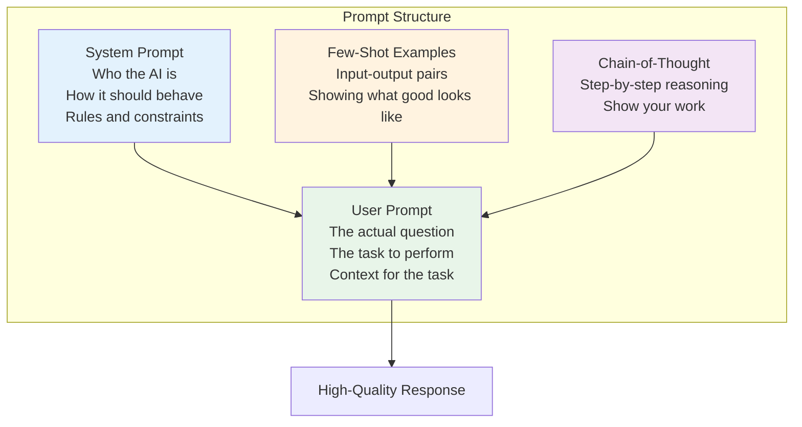

# Phase 2: Prompt Engineering & Model APIs

# Part 6: Prompt Engineering Fundamentals

**Learning to communicate effectively with LLMs—the art and science of crafting prompts that get consistent, high-quality results.**

---

## The Target: What We're Building Right Now

In this part, we're building seven interconnected tools:

1. **A Prompt Template Engine** — Dynamic template generation with variables
2. **A System Prompt Designer** — Create and test different system personas
3. **A Chain-of-Thought Demonstrator** — Visualize step-by-step reasoning
4. **A Few-Shot Learning Tool** — Compare zero-shot vs few-shot performance
5. **A Self-Consistency Engine** — Generate multiple responses and find consensus
6. **A Prompt Optimizer** — Iteratively improve prompts based on results
7. **An Interactive Prompt Playground** — Experiment with all techniques live

**Why this matters:** Prompt engineering is the single most important skill for AI developers. A well-crafted prompt can transform a mediocre model into an excellent assistant. Poor prompts make even the best models useless.

---

## The Concept: Communicating with LLMs

### The Interviewer Analogy

Imagine you're interviewing a highly intelligent but literal-minded expert:

- **System prompt** = The job description and instructions you give before the interview
- **User prompt** = The specific question you ask
- **Assistant message** = The expert's response
- **Few-shot examples** = Showing the expert examples of good answers before asking
- **Chain-of-Thought** = Asking the expert to "think out loud" step by step
- **Self-consistency** = Asking the same question multiple times and looking for consensus

**The key insight:** LLMs are like literal-minded experts. They need clear instructions, examples, and structured reasoning to perform at their best.



### The Four Types of Prompts

| Type | What It Is | Example |
|------|------------|---------|
| **System** | Instructions about how to behave | "You are a helpful assistant. Be concise." |
| **User** | The actual question or task | "What is the capital of France?" |
| **Assistant** | Previous responses (for context) | "The capital of France is Paris." |
| **Tool** | Function definitions (for function calling) | `{"name": "get_weather", ...}` |

### Prompt Engineering Techniques

#### 1. Role Prompting

Give the AI a specific persona to embody:

```python
system_prompt = """
You are an expert data scientist with 15 years of experience.
You communicate clearly and concisely.
You always explain complex concepts using simple analogies.
You never use jargon without explaining it.
"""
```

#### 2. Chain-of-Thought (CoT)

Ask the AI to show its reasoning step by step:

```python
prompt = """
Question: If I have 3 apples and I buy 2 more, then I give away 1, 
how many apples do I have?

Think through this step by step:
1. Start with: 3 apples
2. Buy 2 more: 3 + 2 = 5 apples
3. Give away 1: 5 - 1 = 4 apples

Answer: 4 apples
"""
```

#### 3. Few-Shot Learning

Provide examples of the desired output format:

```python
prompt = """
Extract the name, age, and job from each sentence.

Example 1:
Input: "John, 32, works as a software engineer in New York"
Output: {"name": "John", "age": 32, "job": "software engineer"}

Example 2:
Input: "Sarah is a 28-year-old doctor living in Chicago"
Output: {"name": "Sarah", "age": 28, "job": "doctor"}

Now extract:
Input: "Mike, a 45-year-old teacher from Boston"
Output:
"""
```

#### 4. Self-Consistency

Generate multiple responses and take the most consistent one:

```python
# Generate 3 responses to the same question
responses = [
    generate("What is the capital of France?"),
    generate("What is the capital of France?"),
    generate("What is the capital of France?")
]
# All should say "Paris"
# If one says something else, it's likely wrong
```

#### 5. Prompt Templates

Create reusable prompt structures:

```python
template = """
You are a {role} with {years} years of experience.
Your task is to {task}.
Here is the context: {context}
Question: {question}
Provide your answer in the following format: {format}
"""
```

---

## The Implementation: Building Our Prompt Engineering Tools

### Target File Structure

```
phase-2-prompt-engineering/
└── module-6-prompt-engineering/
    ├── 01_prompt_template_engine.py
    ├── 02_system_prompt_designer.py
    ├── 03_chain_of_thought.py
    ├── 04_few_shot_learning.py
    ├── 05_self_consistency.py
    ├── 06_prompt_optimizer.py
    ├── 07_prompt_playground.py
    ├── requirements.txt
    └── README.md
```

### Step 1: Prompt Template Engine

Create `01_prompt_template_engine.py`:

```python
#!/usr/bin/env python3
"""
Module 6: Prompt Template Engine

A flexible template engine for creating dynamic prompts with variables,
conditions, and loops.
"""

import os
import sys
from pathlib import Path
import json
import re
from typing import Dict, Any, List, Optional, Union
from datetime import datetime

sys.path.insert(0, str(Path(__file__).parent.parent.parent.parent))

from shared.utils.config import load_config
from shared.utils.logging import setup_logging

setup_logging(debug=False)
config = load_config()

class PromptTemplate:
    """
    A flexible prompt template with variables and logic.
    
    Features:
    - Variable substitution with {{variable}}
    - Conditionals: content
    - Loops: content
    - Filters: {{variable|upper}}, {{variable|truncate:100}}
    - Default values: {{variable|default:'default value'}}
    """
    
    def __init__(self, template: str, name: str = None):
        """
        Initialize a prompt template.
        
        Args:
            template: The template string
            name: Optional name for the template
        """
        self.template = template
        self.name = name or "Unnamed Template"
        self.variables = {}
        self.version = 1
        self.metadata = {
            "created_at": datetime.now().isoformat(),
            "version": self.version,
            "name": self.name
        }
    
    def render(self, context: Dict[str, Any]) -> str:
        """
        Render the template with the given context.
        
        Args:
            context: Dictionary of variables to substitute
            
        Returns:
            Rendered template string
        """
        result = self.template
        
        # Step 1: Handle variables with filters
        # Pattern: {{variable|filter:arg}}
        def replace_variable(match):
            var_path = match.group(1)
            filters_str = match.group(2) if match.group(2) else ""
            
            # Get the value
            value = self._get_nested_value(context, var_path)
            
            # Apply filters
            if filters_str:
                filters = [f.strip() for f in filters_str.split('|')]
                for filter_str in filters:
                    if ':' in filter_str:
                        filter_name, filter_arg = filter_str.split(':', 1)
                        value = self._apply_filter(value, filter_name, filter_arg)
                    else:
                        value = self._apply_filter(value, filter_str)
            
            return str(value) if value is not None else ""
        
        # Find and replace variables with filters
        var_pattern = r'\{\{\s*([\w.]+)(?:\s*\|\s*([^}]+))?\s*\}\}'
        result = re.sub(var_pattern, replace_variable, result)
        
        # Step 2: Handle conditionals
        # Pattern: content
        def replace_conditional(match):
            condition = match.group(1)
            content = match.group(2)
            else_content = match.group(3) if match.group(3) else ""
            
            # Evaluate condition
            if self._evaluate_condition(context, condition):
                return content
            else:
                return else_content
        
        if_pattern = r'\{%\s*if\s+([^%]+)\s*%\}(.*?)(?:\{%\s*else\s*%\}(.*?))?\{%\s*endif\s*%\}'
        result = re.sub(if_pattern, replace_conditional, result, flags=re.DOTALL)
        
        # Step 3: Handle loops
        # Pattern: content
        def replace_loop(match):
            loop_var = match.group(1)
            iterable_path = match.group(2)
            content = match.group(3)
            
            # Get the iterable
            iterable = self._get_nested_value(context, iterable_path)
            
            if not isinstance(iterable, list):
                return ""
            
            # Render for each item
            result_parts = []
            for item in iterable:
                # Create a new context with the loop variable
                loop_context = context.copy()
                loop_context[loop_var] = item
                # Recursively render the content
                result_parts.append(self.render_with_context(content, loop_context))
            
            return "".join(result_parts)
        
        loop_pattern = r'\{%\s*for\s+(\w+)\s+in\s+([\w.]+)\s*%\}(.*?)\{%\s*endfor\s*%\}'
        result = re.sub(loop_pattern, replace_loop, result, flags=re.DOTALL)
        
        return result
    
    def render_with_context(self, template: str, context: Dict[str, Any]) -> str:
        """
        Render a sub-template with the given context.
        
        Args:
            template: Template string to render
            context: Context dictionary
            
        Returns:
            Rendered string
        """
        temp_template = PromptTemplate(template)
        return temp_template.render(context)
    
    def _get_nested_value(self, context: Dict[str, Any], path: str) -> Any:
        """
        Get a nested value from a dictionary using dot notation.
        
        Args:
            context: Dictionary to search
            path: Dot-separated path (e.g., "user.name")
            
        Returns:
            Value or None if not found
        """
        if not path:
            return None
        
        parts = path.split('.')
        value = context
        
        for part in parts:
            if isinstance(value, dict):
                value = value.get(part)
            elif isinstance(value, list) and part.isdigit():
                try:
                    value = value[int(part)]
                except (IndexError, ValueError):
                    return None
            else:
                return None
        
        return value
    
    def _evaluate_condition(self, context: Dict[str, Any], condition: str) -> bool:
        """
        Evaluate a condition string.
        
        Args:
            context: Context dictionary
            condition: Condition string
            
        Returns:
            Boolean result
        """
        # Simple condition: variable exists and is truthy
        if condition.strip() in context:
            return bool(context[condition.strip()])
        
        # Handle comparisons
        if ' == ' in condition:
            var, value = condition.split(' == ', 1)
            var = var.strip()
            value = value.strip().strip("'\"")
            return str(self._get_nested_value(context, var)) == value
        
        if ' != ' in condition:
            var, value = condition.split(' != ', 1)
            var = var.strip()
            value = value.strip().strip("'\"")
            return str(self._get_nested_value(context, var)) != value
        
        # Handle not
        if condition.startswith('not '):
            var = condition[4:].strip()
            return not bool(self._get_nested_value(context, var))
        
        # Default: check if variable exists and is truthy
        return False
    
    def _apply_filter(self, value: Any, filter_name: str, arg: str = None) -> Any:
        """
        Apply a filter to a value.
        
        Args:
            value: Value to filter
            filter_name: Name of the filter
            arg: Optional argument
            
        Returns:
            Filtered value
        """
        if value is None:
            return ""
        
        if filter_name == 'upper':
            return str(value).upper()
        
        elif filter_name == 'lower':
            return str(value).lower()
        
        elif filter_name == 'capitalize':
            return str(value).capitalize()
        
        elif filter_name == 'title':
            return str(value).title()
        
        elif filter_name == 'truncate':
            try:
                length = int(arg) if arg else 100
                text = str(value)
                if len(text) <= length:
                    return text
                return text[:length] + "..."
            except:
                return str(value)
        
        elif filter_name == 'default':
            if value is None or value == "":
                return arg or ""
            return value
        
        elif filter_name == 'join':
            if isinstance(value, list):
                separator = arg or ", "
                return separator.join(str(v) for v in value)
            return str(value)
        
        elif filter_name == 'len':
            return len(value) if hasattr(value, '__len__') else 0
        
        elif filter_name == 'json':
            return json.dumps(value, indent=2)
        
        else:
            return value
    
    def save(self, filepath: str) -> None:
        """Save the template to a file."""
        data = {
            "name": self.name,
            "template": self.template,
            "metadata": self.metadata,
            "version": self.version
        }
        with open(filepath, 'w') as f:
            json.dump(data, f, indent=2)
    
    @classmethod
    def load(cls, filepath: str) -> 'PromptTemplate':
        """Load a template from a file."""
        with open(filepath, 'r') as f:
            data = json.load(f)
        
        template = cls(data["template"], data.get("name"))
        template.metadata = data.get("metadata", {})
        template.version = data.get("version", 1)
        return template

class PromptTemplateLibrary:
    """
    A library of prompt templates for common use cases.
    """
    
    @staticmethod
    def chat_template() -> PromptTemplate:
        """Template for general chat."""
        return PromptTemplate("""
You are {{role|default:'a helpful AI assistant'}}.
{{#if expertise}}
You have expertise in {{expertise}}.
{{/if}}
{{#if tone}}
You communicate in a {{tone}} tone.
{{/if}}


Context:
{{context}}


User: {{question}}
Assistant:""", name="chat_template")
    
    @staticmethod
    def code_review_template() -> PromptTemplate:
        """Template for code review."""
        return PromptTemplate("""
You are an expert software engineer with {{experience|default:'10'}} years of experience.
Your task is to review code and provide constructive feedback.

Review Guidelines:
1. Check for bugs and logical errors
2. Suggest performance improvements
3. Identify potential security issues
4. Recommend better design patterns
5. Be specific and actionable

Code to Review:
```
{{code}}
```


Language: {{language}}



Focus Areas:
{{focus_areas|join:", "}}


Provide your review in the following format:

## Summary
[Brief overview of the code]

## Issues Found
[List issues with severity and suggestions]

## Improvements
[Specific recommendations]

## Overall Assessment
[Final verdict]""", name="code_review_template")
    
    @staticmethod
    def data_extraction_template() -> PromptTemplate:
        """Template for data extraction."""
        return PromptTemplate("""
You are a data extraction specialist.
Your task is to extract structured data from unstructured text.

Extract the following fields:

- {{field.name}} ({{field.type}}): {{field.description}}


Text to Extract From:
```
{{text}}
```


Examples:

Input: "{{example.input}}"
Output: {{example.output|json}}



Output as JSON object with the extracted fields.
Output:""", name="data_extraction_template")

def demonstrate_templates():
    """Demonstrate the prompt template engine."""
    print("\n" + "="*80)
    print("📝 PROMPT TEMPLATE ENGINE DEMONSTRATION")
    print("="*80)
    
    # Example 1: Chat template with variables
    print("\n📋 Example 1: Chat Template")
    print("-"*40)
    
    chat_template = PromptTemplateLibrary.chat_template()
    context = {
        "role": "expert Python developer",
        "expertise": "web development and API design",
        "tone": "friendly and educational",
        "question": "How do I create a REST API with FastAPI?"
    }
    
    rendered = chat_template.render(context)
    print(rendered)
    
    # Example 2: Code review template
    print("\n📋 Example 2: Code Review Template")
    print("-"*40)
    
    code_template = PromptTemplateLibrary.code_review_template()
    context = {
        "experience": "15",
        "code": """
def calculate_average(numbers):
    total = 0
    for i in range(len(numbers)):
        total += numbers[i]
    return total / len(numbers)
""",
        "language": "Python",
        "focus_areas": ["Performance", "Error Handling", "Code Style"]
    }
    
    rendered = code_template.render(context)
    print(rendered[:500] + "...")
    
    # Example 3: Data extraction template
    print("\n📋 Example 3: Data Extraction Template")
    print("-"*40)
    
    extraction_template = PromptTemplateLibrary.data_extraction_template()
    context = {
        "fields": [
            {"name": "name", "type": "string", "description": "Full name"},
            {"name": "age", "type": "integer", "description": "Age in years"},
            {"name": "occupation", "type": "string", "description": "Job title"}
        ],
        "text": "John Smith, 32, works as a software engineer in San Francisco.",
        "examples": [
            {
                "input": "Sarah Jones, 28, is a data scientist in New York",
                "output": {"name": "Sarah Jones", "age": 28, "occupation": "data scientist"}
            }
        ]
    }
    
    rendered = extraction_template.render(context)
    print(rendered)

def main():
    """Run the prompt template demonstrations."""
    print("\n" + "="*80)
    print("AI TUTORIAL SERIES - PROMPT TEMPLATE ENGINE")
    print("="*80)
    
    demonstrate_templates()

if __name__ == "__main__":
    main()
```

### Step 2: System Prompt Designer

Create `02_system_prompt_designer.py`:

```python
#!/usr/bin/env python3
"""
Module 6: System Prompt Designer

Design and test system prompts for different use cases.
"""

import os
import sys
from pathlib import Path
import json
from typing import List, Dict, Any, Optional
from datetime import datetime

sys.path.insert(0, str(Path(__file__).parent.parent.parent.parent))

from shared.utils.config import load_config
from shared.utils.logging import setup_logging
from multi_provider_client import Message, ChatCompletion, AIClientFactory, Provider

setup_logging(debug=False)
config = load_config()

class SystemPromptDesigner:
    """
    Design and test system prompts for AI applications.
    
    This class provides:
    - System prompt templates
    - Testing with different personas
    - Performance comparison
    - Best practice recommendations
    """
    
    def __init__(self, provider: str = "openai", model: str = "gpt-4o-mini"):
        """
        Initialize the system prompt designer.
        
        Args:
            provider: Provider to use
            model: Model to use
        """
        self.provider = provider
        self.model = model
        self.client = AIClientFactory.create(provider)
        self.results = {}
    
    def test_system_prompt(
        self,
        system_prompt: str,
        user_prompt: str,
        name: str = None
    ) -> Dict[str, Any]:
        """
        Test a system prompt on a specific user prompt.
        
        Args:
            system_prompt: The system prompt to test
            user_prompt: The user prompt to use
            name: Name for this test
            
        Returns:
            Test results
        """
        messages = [
            Message(role="system", content=system_prompt),
            Message(role="user", content=user_prompt)
        ]
        
        try:
            response = self.client.chat(
                messages=messages,
                model=self.model,
                temperature=0.7,
                max_tokens=500
            )
            
            result = {
                "name": name or "Unnamed Test",
                "system_prompt": system_prompt,
                "user_prompt": user_prompt,
                "response": response.content,
                "tokens": response.usage,
                "success": True,
                "timestamp": datetime.now().isoformat()
            }
            
            self.results[name or "unnamed"] = result
            return result
            
        except Exception as e:
            result = {
                "name": name or "Unnamed Test",
                "system_prompt": system_prompt,
                "user_prompt": user_prompt,
                "error": str(e),
                "success": False,
                "timestamp": datetime.now().isoformat()
            }
            
            self.results[name or "unnamed"] = result
            return result
    
    def compare_prompts(
        self,
        system_prompts: Dict[str, str],
        user_prompt: str
    ) -> List[Dict[str, Any]]:
        """
        Compare multiple system prompts.
        
        Args:
            system_prompts: Dictionary of {name: prompt}
            user_prompt: User prompt to test with
            
        Returns:
            List of test results
        """
        results = []
        
        for name, prompt in system_prompts.items():
            result = self.test_system_prompt(prompt, user_prompt, name)
            results.append(result)
        
        return results
    
    def get_persona_templates(self) -> Dict[str, str]:
        """
        Get pre-defined persona templates.
        
        Returns:
            Dictionary of {persona_name: system_prompt}
        """
        return {
            "helpful_assistant": """You are a helpful, friendly AI assistant. 
            You provide clear, accurate, and helpful responses. 
            If you don't know something, say so honestly.
            You are always respectful and professional.""",
            
            "expert_consultant": """You are an expert consultant with 20 years of experience.
            You provide strategic advice and deep insights.
            You are direct, confident, and concise.
            You back up your advice with clear reasoning.""",
            
            "creative_writer": """You are a creative writer with a flair for storytelling.
            You write vivid, engaging, and imaginative content.
            You use descriptive language and creative metaphors.
            You adapt your style to match the requested tone.""",
            
            "technical_expert": """You are a senior software engineer and technical expert.
            You provide precise, technical, and accurate information.
            You include code examples when relevant.
            You explain complex concepts clearly and systematically.""",
            
            "teacher": """You are a patient and knowledgeable teacher.
            You explain concepts clearly and simply.
            You use analogies and examples to aid understanding.
            You encourage learning and curiosity.""",
            
            "critic": """You are a constructive critic with high standards.
            You provide detailed, thoughtful, and actionable feedback.
            You identify strengths and weaknesses.
            You offer specific suggestions for improvement."""
        }
    
    def analyze_effectiveness(self, results: List[Dict[str, Any]]) -> Dict[str, Any]:
        """
        Analyze the effectiveness of different system prompts.
        
        Args:
            results: List of test results
            
        Returns:
            Analysis results
        """
        analysis = {
            "total_tested": len(results),
            "successful": sum(1 for r in results if r.get("success", False)),
            "failed": sum(1 for r in results if not r.get("success", False)),
            "average_tokens": 0,
            "best_performer": None,
            "worst_performer": None
        }
        
        if results:
            # Calculate average tokens
            token_counts = [
                r.get("tokens", {}).get("total_tokens", 0)
                for r in results
                if r.get("success", False)
            ]
            if token_counts:
                analysis["average_tokens"] = sum(token_counts) / len(token_counts)
            
            # Find best and worst performers (by response length as a proxy)
            successful = [r for r in results if r.get("success", False)]
            if successful:
                successful.sort(key=lambda x: len(x.get("response", "")), reverse=True)
                analysis["best_performer"] = {
                    "name": successful[0].get("name"),
                    "response_length": len(successful[0].get("response", ""))
                }
                analysis["worst_performer"] = {
                    "name": successful[-1].get("name"),
                    "response_length": len(successful[-1].get("response", ""))
                }
        
        return analysis
    
    def get_recommendations(self, use_case: str) -> Dict[str, Any]:
        """
        Get system prompt recommendations for a use case.
        
        Args:
            use_case: The use case
            
        Returns:
            Recommendations
        """
        recommendations = {
            "chatbot": {
                "system_prompt": self.get_persona_templates()["helpful_assistant"],
                "tone": "friendly and helpful",
                "temperature": 0.7,
                "reasoning": "Friendly and helpful personas work best for general chat"
            },
            "code_review": {
                "system_prompt": self.get_persona_templates()["technical_expert"],
                "tone": "professional and precise",
                "temperature": 0.3,
                "reasoning": "Technical experts provide more accurate code review"
            },
            "creative_writing": {
                "system_prompt": self.get_persona_templates()["creative_writer"],
                "tone": "imaginative and engaging",
                "temperature": 0.9,
                "reasoning": "Creative personas with higher temperature produce more original content"
            },
            "data_extraction": {
                "system_prompt": "You are a data extraction specialist. You extract structured data from unstructured text accurately and consistently.",
                "tone": "precise and consistent",
                "temperature": 0.0,
                "reasoning": "Extraction requires consistency and accuracy, use low temperature"
            },
            "consulting": {
                "system_prompt": self.get_persona_templates()["expert_consultant"],
                "tone": "professional and insightful",
                "temperature": 0.5,
                "reasoning": "Expert consultants provide strategic advice with balanced creativity"
            }
        }
        
        return recommendations.get(use_case, recommendations["chatbot"])

def demonstrate_system_prompt_designer():
    """Demonstrate the system prompt designer."""
    print("\n" + "="*80)
    print("🎭 SYSTEM PROMPT DESIGNER DEMONSTRATION")
    print("="*80)
    
    # Check if OpenAI is available
    if not config.get("openai_api_key"):
        print("❌ OpenAI API key not available")
        return
    
    designer = SystemPromptDesigner()
    
    print("\n📋 Available Persona Templates:")
    print("-"*40)
    personas = designer.get_persona_templates()
    for name, prompt in personas.items():
        print(f"\n🎭 {name.replace('_', ' ').title()}:")
        print(f"   {prompt[:100]}...")
    
    # Compare system prompts
    print("\n📊 Comparing System Prompts:")
    print("-"*40)
    
    user_prompt = "What are the best practices for writing clean Python code?"
    
    system_prompts = {
        "helpful_assistant": personas["helpful_assistant"],
        "technical_expert": personas["technical_expert"],
        "teacher": personas["teacher"]
    }
    
    results = designer.compare_prompts(system_prompts, user_prompt)
    
    for result in results:
        if result.get("success"):
            print(f"\n✅ {result['name']}:")
            print(f"   Response: {result['response'][:150]}...")
            print(f"   Tokens: {result['tokens'].get('total_tokens', 'N/A')}")
        else:
            print(f"\n❌ {result['name']}: {result.get('error')}")
    
    # Analyze results
    analysis = designer.analyze_effectiveness(results)
    print("\n📊 Analysis:")
    print(f"   Successful: {analysis['successful']}/{analysis['total_tested']}")
    print(f"   Average Tokens: {analysis['average_tokens']:.0f}")
    if analysis['best_performer']:
        print(f"   Best: {analysis['best_performer']['name']}")
    
    # Show recommendations
    print("\n💡 Recommendations:")
    for use_case, rec in designer.get_recommendations("chatbot").items():
        if isinstance(rec, dict):
            print(f"   {use_case}: {rec.get('tone', 'N/A')}")

def main():
    """Run the system prompt designer."""
    print("\n" + "="*80)
    print("AI TUTORIAL SERIES - SYSTEM PROMPT DESIGNER")
    print("="*80)
    
    demonstrate_system_prompt_designer()

if __name__ == "__main__":
    main()
```

### Step 3: Chain-of-Thought Demonstrator

Create `03_chain_of_thought.py`:

```python
#!/usr/bin/env python3
"""
Module 6: Chain-of-Thought Demonstrator

Demonstrates how step-by-step reasoning improves AI performance.
"""

import os
import sys
from pathlib import Path
import json
import time
from typing import List, Dict, Any, Optional

sys.path.insert(0, str(Path(__file__).parent.parent.parent.parent))

from shared.utils.config import load_config
from shared.utils.logging import setup_logging
from multi_provider_client import Message, AIClientFactory, Provider

setup_logging(debug=False)
config = load_config()

class ChainOfThoughtDemonstrator:
    """
    Demonstrate the benefits of Chain-of-Thought reasoning.
    
    This class provides:
    - Comparison of standard vs CoT prompts
    - Visualization of reasoning steps
    - Effectiveness analysis
    """
    
    def __init__(self, provider: str = "openai", model: str = "gpt-4o-mini"):
        """
        Initialize the demonstrator.
        
        Args:
            provider: Provider to use
            model: Model to use
        """
        self.provider = provider
        self.model = model
        self.client = AIClientFactory.create(provider)
    
    def generate(self, prompt: str, system: str = None, temperature: float = 0.3) -> Dict[str, Any]:
        """
        Generate a response.
        
        Args:
            prompt: User prompt
            system: System prompt
            temperature: Temperature
            
        Returns:
            Response dictionary
        """
        messages = []
        if system:
            messages.append(Message(role="system", content=system))
        messages.append(Message(role="user", content=prompt))
        
        try:
            response = self.client.chat(
                messages=messages,
                model=self.model,
                temperature=temperature,
                max_tokens=1000
            )
            
            return {
                "success": True,
                "content": response.content,
                "tokens": response.usage
            }
        except Exception as e:
            return {
                "success": False,
                "error": str(e)
            }
    
    def compare_standard_vs_cot(self, question: str, system: str = None) -> Dict[str, Any]:
        """
        Compare standard prompt vs Chain-of-Thought prompt.
        
        Args:
            question: The question to ask
            system: Optional system prompt
            
        Returns:
            Comparison results
        """
        # Standard prompt
        standard_prompt = f"Question: {question}\n\nAnswer:"
        
        # Chain-of-Thought prompt
        cot_prompt = f"""Question: {question}

Let's solve this step by step:

Step 1: [Analyze the question]
Step 2: [Break down the problem]
Step 3: [Apply reasoning]
Step 4: [Calculate or deduce]
Step 5: [Formulate the answer]

Answer:"""
        
        print("\n" + "="*60)
        print(f"📝 Question: {question}")
        print("="*60)
        
        # Generate standard response
        print("\n📋 Standard Prompt:")
        print("-"*40)
        print(standard_prompt)
        print("\n" + "-"*40)
        
        start = time.time()
        std_result = self.generate(standard_prompt, system, temperature=0.3)
        std_time = time.time() - start
        
        if std_result["success"]:
            print("\n🤖 Standard Response:")
            print("-"*40)
            print(std_result["content"])
            print("-"*40)
            print(f"⏱️ Time: {std_time:.2f}s")
            print(f"📊 Tokens: {std_result['tokens'].get('total_tokens', 'N/A')}")
        else:
            print(f"❌ Error: {std_result.get('error')}")
        
        # Generate CoT response
        print("\n📋 Chain-of-Thought Prompt:")
        print("-"*40)
        print(cot_prompt[:200] + "...")
        print("\n" + "-"*40)
        
        start = time.time()
        cot_result = self.generate(cot_prompt, system, temperature=0.3)
        cot_time = time.time() - start
        
        if cot_result["success"]:
            print("\n🤖 Chain-of-Thought Response:")
            print("-"*40)
            print(cot_result["content"])
            print("-"*40)
            print(f"⏱️ Time: {cot_time:.2f}s")
            print(f"📊 Tokens: {cot_result['tokens'].get('total_tokens', 'N/A')}")
        else:
            print(f"❌ Error: {cot_result.get('error')}")
        
        # Analyze effectiveness
        analysis = {
            "standard": {
                "success": std_result["success"],
                "time": std_time,
                "tokens": std_result.get("tokens", {}).get("total_tokens", 0) if std_result.get("success") else 0,
                "length": len(std_result.get("content", "")) if std_result.get("success") else 0
            },
            "cot": {
                "success": cot_result["success"],
                "time": cot_time,
                "tokens": cot_result.get("tokens", {}).get("total_tokens", 0) if cot_result.get("success") else 0,
                "length": len(cot_result.get("content", "")) if cot_result.get("success") else 0
            }
        }
        
        return analysis
    
    def demonstrate_math_problems(self):
        """Demonstrate CoT on math problems."""
        print("\n" + "="*80)
        print("🧮 CHAIN-OF-THOUGHT: MATH PROBLEMS")
        print("="*80)
        
        problems = [
            "A store has 150 apples. They sell 30% on Monday and 25% of the remaining on Tuesday. How many apples are left?",
            "If a train travels at 60 mph for 2.5 hours, then at 45 mph for 1.5 hours, what is the total distance traveled?",
            "A rectangle has a length that is 3 times its width. If the perimeter is 48, what is the area?"
        ]
        
        for i, problem in enumerate(problems, 1):
            print(f"\n📚 Problem {i}:")
            self.compare_standard_vs_cot(problem)
    
    def demonstrate_logical_reasoning(self):
        """Demonstrate CoT on logical reasoning."""
        print("\n" + "="*80)
        print("🧠 CHAIN-OF-THOUGHT: LOGICAL REASONING")
        print("="*80)
        
        problems = [
            "All humans are mortal. Socrates is a human. What conclusion can we draw?",
            "If it rains, the ground gets wet. The ground is wet. Does that mean it rained? Why or why not?",
            "A, B, and C are playing a game. A always lies, B always tells the truth, and C sometimes lies. If A says 'B is lying', what can we conclude?"
        ]
        
        for i, problem in enumerate(problems, 1):
            print(f"\n📚 Problem {i}:")
            self.compare_standard_vs_cot(problem)
    
    def analyze_effectiveness(self):
        """Analyze the overall effectiveness of CoT."""
        print("\n" + "="*80)
        print("📊 CHAIN-OF-THOUGHT EFFECTIVENESS ANALYSIS")
        print("="*80)
        
        # Test on multiple questions
        questions = [
            "What is 23 * 47?",
            "If I have $100 and spend 35% on food, 25% on rent, and save the rest, how much do I save?",
            "A car travels 240 miles in 4 hours. What is the average speed?"
        ]
        
        results = []
        for q in questions:
            result = self.compare_standard_vs_cot(q)
            results.append(result)
        
        # Calculate averages
        std_success = sum(1 for r in results if r["standard"]["success"])
        cot_success = sum(1 for r in results if r["cot"]["success"])
        
        avg_std_time = sum(r["standard"]["time"] for r in results if r["standard"]["success"]) / max(1, std_success)
        avg_cot_time = sum(r["cot"]["time"] for r in results if r["cot"]["success"]) / max(1, cot_success)
        
        avg_std_length = sum(r["standard"]["length"] for r in results if r["standard"]["success"]) / max(1, std_success)
        avg_cot_length = sum(r["cot"]["length"] for r in results if r["cot"]["success"]) / max(1, cot_success)
        
        print(f"\n📊 Results Summary:")
        print(f"   Standard Success Rate: {std_success}/{len(results)} ({std_success/len(results)*100:.1f}%)")
        print(f"   CoT Success Rate: {cot_success}/{len(results)} ({cot_success/len(results)*100:.1f}%)")
        print(f"   Average Standard Time: {avg_std_time:.2f}s")
        print(f"   Average CoT Time: {avg_cot_time:.2f}s")
        print(f"   Average Standard Length: {avg_std_length:.0f} chars")
        print(f"   Average CoT Length: {avg_cot_length:.0f} chars")
        
        print("\n💡 Conclusion:")
        if cot_success > std_success:
            print("   ✅ Chain-of-Thought improves accuracy on reasoning tasks")
        if avg_cot_time > avg_std_time:
            print("   ⏱️ CoT takes longer but produces more accurate results")
        if avg_cot_length > avg_std_length:
            print("   📝 CoT produces more detailed responses")

def main():
    """Run the Chain-of-Thought demonstrations."""
    print("\n" + "="*80)
    print("AI TUTORIAL SERIES - CHAIN-OF-THOUGHT DEMONSTRATOR")
    print("="*80)
    
    if not config.get("openai_api_key"):
        print("❌ OpenAI API key not available")
        return
    
    demonstrator = ChainOfThoughtDemonstrator()
    
    demonstrator.demonstrate_math_problems()
    demonstrator.demonstrate_logical_reasoning()
    demonstrator.analyze_effectiveness()

if __name__ == "__main__":
    main()
```

### Step 4: Few-Shot Learning Tool

Create `04_few_shot_learning.py`:

```python
#!/usr/bin/env python3
"""
Module 6: Few-Shot Learning Tool

Demonstrate how providing examples in the prompt improves performance.
"""

import os
import sys
from pathlib import Path
import json
from typing import List, Dict, Any, Optional

sys.path.insert(0, str(Path(__file__).parent.parent.parent.parent))

from shared.utils.config import load_config
from shared.utils.logging import setup_logging
from multi_provider_client import Message, AIClientFactory, Provider

setup_logging(debug=False)
config = load_config()

class FewShotLearningTool:
    """
    Demonstrate and compare zero-shot vs few-shot learning.
    
    This class provides:
    - Zero-shot prompting
    - Few-shot prompting with examples
    - Performance comparison
    - Example generation
    """
    
    def __init__(self, provider: str = "openai", model: str = "gpt-4o-mini"):
        """
        Initialize the tool.
        
        Args:
            provider: Provider to use
            model: Model to use
        """
        self.provider = provider
        self.model = model
        self.client = AIClientFactory.create(provider)
    
    def generate(self, prompt: str, system: str = None, temperature: float = 0.3) -> Dict[str, Any]:
        """
        Generate a response.
        
        Args:
            prompt: User prompt
            system: System prompt
            temperature: Temperature
            
        Returns:
            Response dictionary
        """
        messages = []
        if system:
            messages.append(Message(role="system", content=system))
        messages.append(Message(role="user", content=prompt))
        
        try:
            response = self.client.chat(
                messages=messages,
                model=self.model,
                temperature=temperature,
                max_tokens=500
            )
            
            return {
                "success": True,
                "content": response.content,
                "tokens": response.usage
            }
        except Exception as e:
            return {
                "success": False,
                "error": str(e)
            }
    
    def zero_shot(self, task: str, data: str) -> Dict[str, Any]:
        """
        Perform zero-shot learning.
        
        Args:
            task: Task description
            data: Input data
            
        Returns:
            Response
        """
        prompt = f"""Task: {task}

Input: {data}

Output:"""
        
        return self.generate(prompt, temperature=0.3)
    
    def few_shot(
        self,
        task: str,
        data: str,
        examples: List[Dict[str, str]],
        num_examples: int = 3
    ) -> Dict[str, Any]:
        """
        Perform few-shot learning.
        
        Args:
            task: Task description
            data: Input data
            examples: List of example pairs
            num_examples: Number of examples to use
            
        Returns:
            Response
        """
        prompt = f"""Task: {task}

Examples:
"""
        
        # Add examples
        for i, example in enumerate(examples[:num_examples], 1):
            prompt += f"""
Example {i}:
Input: {example['input']}
Output: {example['output']}
"""
        
        prompt += f"""
Now process this input:
Input: {data}
Output:"""
        
        return self.generate(prompt, temperature=0.3)
    
    def compare_zero_vs_few_shot(
        self,
        task: str,
        data: str,
        examples: List[Dict[str, str]],
        description: str = None
    ) -> Dict[str, Any]:
        """
        Compare zero-shot vs few-shot performance.
        
        Args:
            task: Task description
            data: Input data
            examples: List of example pairs
            description: Description of the test
            
        Returns:
            Comparison results
        """
        print("\n" + "="*60)
        if description:
            print(f"📝 Test: {description}")
        print("="*60)
        
        print(f"\n📋 Task: {task}")
        print(f"📊 Input: {data[:100]}...")
        
        # Zero-shot
        print("\n🔍 Zero-Shot:")
        print("-"*40)
        zero_result = self.zero_shot(task, data)
        
        if zero_result["success"]:
            print(zero_result["content"][:200] + "...")
            print(f"📊 Tokens: {zero_result['tokens'].get('total_tokens', 'N/A')}")
        else:
            print(f"❌ Error: {zero_result.get('error')}")
        
        # Few-shot
        print("\n🔍 Few-Shot (with examples):")
        print("-"*40)
        few_result = self.few_shot(task, data, examples)
        
        if few_result["success"]:
            print(few_result["content"][:200] + "...")
            print(f"📊 Tokens: {few_result['tokens'].get('total_tokens', 'N/A')}")
        else:
            print(f"❌ Error: {few_result.get('error')}")
        
        return {
            "zero": zero_result,
            "few": few_result
        }
    
    def get_example_tasks(self) -> Dict[str, Any]:
        """
        Get example tasks for few-shot learning.
        
        Returns:
            Dictionary of tasks with examples
        """
        return {
            "sentiment_analysis": {
                "task": "Classify the sentiment of the text as positive, negative, or neutral.",
                "examples": [
                    {"input": "I love this product! It's amazing.", "output": "positive"},
                    {"input": "This is the worst experience ever.", "output": "negative"},
                    {"input": "The weather is okay today.", "output": "neutral"},
                    {"input": "I'm so happy with the results!", "output": "positive"},
                    {"input": "I'm disappointed with the service.", "output": "negative"}
                ]
            },
            "text_classification": {
                "task": "Classify the text into one of these categories: sports, technology, politics, entertainment, business.",
                "examples": [
                    {"input": "The team scored a goal in the final minute.", "output": "sports"},
                    {"input": "The new iPhone has an amazing camera.", "output": "technology"},
                    {"input": "The president announced new policies today.", "output": "politics"},
                    {"input": "The movie was a box office hit.", "output": "entertainment"},
                    {"input": "The stock market is up 2% today.", "output": "business"}
                ]
            },
            "entity_extraction": {
                "task": "Extract the person's name, age, and job from the text.",
                "examples": [
                    {"input": "John Smith, 32, works as a software engineer in New York.", 
                     "output": "Name: John Smith, Age: 32, Job: software engineer"},
                    {"input": "Sarah Jones, 28, is a data scientist at Google.", 
                     "output": "Name: Sarah Jones, Age: 28, Job: data scientist"},
                    {"input": "Mike Johnson, 45, is a teacher in Boston.", 
                     "output": "Name: Mike Johnson, Age: 45, Job: teacher"}
                ]
            }
        }

def demonstrate_few_shot():
    """Demonstrate few-shot learning."""
    print("\n" + "="*80)
    print("🎯 FEW-SHOT LEARNING DEMONSTRATION")
    print("="*80)
    
    if not config.get("openai_api_key"):
        print("❌ OpenAI API key not available")
        return
    
    tool = FewShotLearningTool()
    example_tasks = tool.get_example_tasks()
    
    # Test each task
    for task_name, task_data in example_tasks.items():
        print(f"\n📚 Task: {task_name.replace('_', ' ').title()}")
        print("-"*40)
        
        # Get a test input
        test_data = task_data["examples"][-1]["input"]
        
        # Compare zero vs few-shot
        tool.compare_zero_vs_few_shot(
            task=task_data["task"],
            data=test_data,
            examples=task_data["examples"][:3],
            description=task_name.replace('_', ' ').title()
        )

def main():
    """Run the few-shot learning demonstration."""
    print("\n" + "="*80)
    print("AI TUTORIAL SERIES - FEW-SHOT LEARNING TOOL")
    print("="*80)
    
    demonstrate_few_shot()

if __name__ == "__main__":
    main()
```

### Step 5: Self-Consistency Engine

Create `05_self_consistency.py`:

```python
#!/usr/bin/env python3
"""
Module 6: Self-Consistency Engine

Generate multiple responses and find the most consistent one.
"""

import os
import sys
from pathlib import Path
import json
from typing import List, Dict, Any, Optional
import time
from collections import Counter

sys.path.insert(0, str(Path(__file__).parent.parent.parent.parent))

from shared.utils.config import load_config
from shared.utils.logging import setup_logging
from multi_provider_client import Message, AIClientFactory, Provider

setup_logging(debug=False)
config = load_config()

class SelfConsistencyEngine:
    """
    Implement self-consistency by generating multiple responses.
    
    This class provides:
    - Multiple response generation
    - Answer extraction
    - Consensus finding
    - Confidence scoring
    """
    
    def __init__(self, provider: str = "openai", model: str = "gpt-4o-mini"):
        """
        Initialize the engine.
        
        Args:
            provider: Provider to use
            model: Model to use
        """
        self.provider = provider
        self.model = model
        self.client = AIClientFactory.create(provider)
    
    def generate_multiple(
        self,
        prompt: str,
        n: int = 3,
        temperature: float = 0.7,
        system: str = None
    ) -> List[Dict[str, Any]]:
        """
        Generate multiple responses to the same prompt.
        
        Args:
            prompt: User prompt
            n: Number of responses to generate
            temperature: Temperature for generation
            system: System prompt
            
        Returns:
            List of responses
        """
        responses = []
        
        for i in range(n):
            try:
                messages = []
                if system:
                    messages.append(Message(role="system", content=system))
                messages.append(Message(role="user", content=prompt))
                
                response = self.client.chat(
                    messages=messages,
                    model=self.model,
                    temperature=temperature,
                    max_tokens=500
                )
                
                responses.append({
                    "sample": i + 1,
                    "content": response.content,
                    "success": True,
                    "tokens": response.usage
                })
            except Exception as e:
                responses.append({
                    "sample": i + 1,
                    "content": None,
                    "success": False,
                    "error": str(e)
                })
        
        return responses
    
    def extract_answer(self, response: str) -> str:
        """
        Extract the key answer from a response.
        
        Args:
            response: Full response text
            
        Returns:
            Extracted answer
        """
        # Simple extraction: look for common patterns
        lines = response.strip().split('\n')
        
        # Check if there's a clear answer line
        for line in reversed(lines):
            line = line.strip()
            if line and any(keyword in line.lower() for keyword in ['answer:', 'result:', 'therefore', 'conclusion']):
                return line
        
        # If no clear answer, return the last non-empty line
        for line in reversed(lines):
            if line.strip():
                return line.strip()
        
        return response
    
    def find_consensus(self, responses: List[Dict[str, Any]]) -> Dict[str, Any]:
        """
        Find consensus among multiple responses.
        
        Args:
            responses: List of responses
            
        Returns:
            Consensus analysis
        """
        valid_responses = [r for r in responses if r.get("success")]
        
        if not valid_responses:
            return {
                "consensus": None,
                "agreement": 0,
                "total": len(responses),
                "valid": 0
            }
        
        # Extract answers
        answers = [self.extract_answer(r["content"]) for r in valid_responses]
        
        # Find most common answer
        answer_counts = Counter(answers)
        most_common = answer_counts.most_common(1)
        
        if most_common:
            consensus_answer = most_common[0][0]
            agreement = most_common[0][1] / len(valid_responses)
        else:
            consensus_answer = None
            agreement = 0
        
        return {
            "consensus": consensus_answer,
            "agreement": agreement,
            "total": len(responses),
            "valid": len(valid_responses),
            "answers": answers,
            "answer_counts": dict(answer_counts),
            "confidence": "high" if agreement >= 0.8 else "medium" if agreement >= 0.6 else "low"
        }
    
    def self_consistency(
        self,
        prompt: str,
        n: int = 3,
        temperature: float = 0.7,
        system: str = None
    ) -> Dict[str, Any]:
        """
        Perform self-consistency reasoning.
        
        Args:
            prompt: User prompt
            n: Number of responses
            temperature: Temperature
            system: System prompt
            
        Returns:
            Results with consensus
        """
        print("\n" + "="*60)
        print(f"🔍 Self-Consistency: {n} Responses")
        print("="*60)
        
        print(f"\n📝 Prompt: {prompt}")
        
        # Generate responses
        responses = self.generate_multiple(prompt, n, temperature, system)
        
        # Show each response
        for response in responses:
            print(f"\n📋 Sample {response['sample']}:")
            print("-"*40)
            if response["success"]:
                print(response["content"][:200] + "...")
            else:
                print(f"❌ Error: {response.get('error')}")
        
        # Find consensus
        consensus = self.find_consensus(responses)
        
        print("\n" + "="*60)
        print("📊 Consensus Analysis:")
        print("="*60)
        print(f"   Valid Responses: {consensus['valid']}/{consensus['total']}")
        print(f"   Agreement: {consensus['agreement']:.1%}")
        print(f"   Confidence: {consensus['confidence']}")
        
        if consensus["consensus"]:
            print(f"\n✅ Consensus Answer:")
            print(f"   {consensus['consensus']}")
        
        return {
            "responses": responses,
            "consensus": consensus
        }
    
    def demonstrate_questions(self):
        """Demonstrate self-consistency on various questions."""
        print("\n" + "="*80)
        print("🔍 SELF-CONSISTENCY DEMONSTRATION")
        print("="*80)
        
        questions = [
            "What is the capital of France?",
            "What is 15 * 12?",
            "What is the square root of 144?",
            "Who wrote 'Romeo and Juliet'?",
            "What is the chemical symbol for gold?"
        ]
        
        for question in questions:
            self.self_consistency(
                prompt=question,
                n=3,
                temperature=0.5,
                system="You are a helpful assistant. Keep your answers brief and accurate."
            )

def main():
    """Run the self-consistency demonstration."""
    print("\n" + "="*80)
    print("AI TUTORIAL SERIES - SELF-CONSISTENCY ENGINE")
    print("="*80)
    
    if not config.get("openai_api_key"):
        print("❌ OpenAI API key not available")
        return
    
    engine = SelfConsistencyEngine()
    engine.demonstrate_questions()

if __name__ == "__main__":
    main()
```

### Step 6: Prompt Optimizer

Create `06_prompt_optimizer.py`:

```python
#!/usr/bin/env python3
"""
Module 6: Prompt Optimizer

Iteratively improve prompts based on performance metrics.
"""

import os
import sys
from pathlib import Path
import json
from typing import List, Dict, Any, Optional
import time
import random

sys.path.insert(0, str(Path(__file__).parent.parent.parent.parent))

from shared.utils.config import load_config
from shared.utils.logging import setup_logging
from multi_provider_client import Message, AIClientFactory, Provider
from prompt_template_engine import PromptTemplate

setup_logging(debug=False)
config = load_config()

class PromptOptimizer:
    """
    Optimize prompts through iterative improvement.
    
    This class provides:
    - Prompt scoring
    - Iterative improvement
    - A/B testing
    - Best prompt selection
    """
    
    def __init__(self, provider: str = "openai", model: str = "gpt-4o-mini"):
        """
        Initialize the optimizer.
        
        Args:
            provider: Provider to use
            model: Model to use
        """
        self.provider = provider
        self.model = model
        self.client = AIClientFactory.create(provider)
        self.history = []
    
    def score_prompt(
        self,
        prompt: str,
        expected: str,
        system: str = None
    ) -> Dict[str, Any]:
        """
        Score a prompt based on its response.
        
        Args:
            prompt: User prompt
            expected: Expected response
            system: System prompt
            
        Returns:
            Score dictionary
        """
        messages = []
        if system:
            messages.append(Message(role="system", content=system))
        messages.append(Message(role="user", content=prompt))
        
        try:
            response = self.client.chat(
                messages=messages,
                model=self.model,
                temperature=0.3,
                max_tokens=500
            )
            
            content = response.content
            
            # Calculate score based on multiple factors
            score = 0
            feedback = []
            
            # Factor 1: Response length (not too short, not too long)
            length = len(content)
            if 50 <= length <= 500:
                score += 20
                feedback.append("✅ Good response length")
            elif length < 50:
                score += 5
                feedback.append("⚠️ Response too short")
            else:
                score += 10
                feedback.append("⚠️ Response very long")
            
            # Factor 2: Contains key elements from expected
            if expected:
                expected_words = set(expected.lower().split())
                response_words = set(content.lower().split())
                overlap = len(expected_words & response_words) / len(expected_words) if expected_words else 0
                
                if overlap > 0.5:
                    score += 30
                    feedback.append(f"✅ Contains {overlap:.1%} of expected content")
                else:
                    score += 10
                    feedback.append(f"⚠️ Low overlap with expected ({overlap:.1%})")
            
            # Factor 3: Response structure
            if '\n' in content:
                score += 15
                feedback.append("✅ Well-structured response")
            
            # Factor 4: Specificity (use of examples, numbers)
            if any(char.isdigit() for char in content):
                score += 15
                feedback.append("✅ Contains specific details")
            
            # Factor 5: Clarity and conciseness
            word_count = len(content.split())
            if 20 <= word_count <= 100:
                score += 20
                feedback.append("✅ Concise and clear")
            else:
                score += 10
                feedback.append(f"⚠️ Response has {word_count} words")
            
            result = {
                "score": score,
                "feedback": feedback,
                "response": content,
                "tokens": response.usage,
                "success": True
            }
            
            return result
            
        except Exception as e:
            return {
                "score": 0,
                "feedback": [f"❌ Error: {e}"],
                "success": False,
                "error": str(e)
            }
    
    def generate_prompt_variants(
        self,
        base_prompt: str,
        num_variants: int = 3
    ) -> List[str]:
        """
        Generate variants of a prompt.
        
        Args:
            base_prompt: Base prompt
            num_variants: Number of variants to generate
            
        Returns:
            List of prompt variants
        """
        variants = [base_prompt]
        
        # Different prompt styles
        styles = [
            "Be more direct and concise.",
            "Ask for step-by-step reasoning.",
            "Provide more context and background.",
            "Request a structured format (list, bullets, etc.).",
            "Ask for examples and evidence.",
            "Be more specific and detailed."
        ]
        
        # Randomly select styles for variants
        selected_styles = random.sample(styles, min(num_variants, len(styles)))
        
        for style in selected_styles:
            variant = f"{base_prompt}\n\nInstructions: {style}"
            variants.append(variant)
        
        return variants[:num_variants + 1]
    
    def optimize_prompt(
        self,
        base_prompt: str,
        expected_response: str,
        system: str = None,
        iterations: int = 3,
        num_variants: int = 3
    ) -> Dict[str, Any]:
        """
        Optimize a prompt through iterative improvement.
        
        Args:
            base_prompt: Initial prompt
            expected_response: Expected response
            system: System prompt
            iterations: Number of optimization iterations
            num_variants: Number of variants per iteration
            
        Returns:
            Optimization results
        """
        print("\n" + "="*80)
        print("🧪 PROMPT OPTIMIZATION")
        print("="*80)
        
        print(f"\n📝 Base Prompt: {base_prompt}")
        print(f"🎯 Expected: {expected_response[:100]}...")
        
        best_prompt = base_prompt
        best_score = 0
        best_response = None
        
        history = []
        
        for iteration in range(iterations):
            print(f"\n📊 Iteration {iteration + 1}/{iterations}")
            print("-"*40)
            
            # Generate variants
            variants = self.generate_prompt_variants(best_prompt, num_variants)
            
            # Score each variant
            scores = []
            for variant in variants:
                print(f"\n   Testing variant: {variant[:50]}...")
                result = self.score_prompt(variant, expected_response, system)
                
                if result["success"]:
                    scores.append({
                        "prompt": variant,
                        "score": result["score"],
                        "feedback": result["feedback"],
                        "response": result["response"]
                    })
                    print(f"   Score: {result['score']}")
                    for fb in result["feedback"]:
                        print(f"     {fb}")
                else:
                    print(f"   ❌ Error: {result.get('error')}")
            
            # Find the best variant
            if scores:
                best_variant = max(scores, key=lambda x: x["score"])
                
                if best_variant["score"] > best_score:
                    best_score = best_variant["score"]
                    best_prompt = best_variant["prompt"]
                    best_response = best_variant["response"]
                    print(f"\n   ✅ New best prompt (score: {best_score})")
                    print(f"   Prompt: {best_prompt}")
                else:
                    print(f"\n   ℹ️ No improvement (best score: {best_score})")
                
                history.append({
                    "iteration": iteration + 1,
                    "best_score": best_score,
                    "best_prompt": best_prompt,
                    "scores": scores
                })
        
        return {
            "best_prompt": best_prompt,
            "best_score": best_score,
            "best_response": best_response,
            "history": history,
            "iterations": iterations,
            "started_at": time.time()
        }
    
    def demonstrate_optimization(self):
        """Demonstrate prompt optimization."""
        print("\n" + "="*80)
        print("🧪 PROMPT OPTIMIZATION DEMONSTRATION")
        print("="*80)
        
        # Example 1: Data extraction
        print("\n📚 Example 1: Data Extraction")
        print("-"*40)
        
        base_prompt = "Extract the name and age from this text: 'John is 32 years old.'"
        expected = "Name: John, Age: 32"
        
        result = self.optimize_prompt(
            base_prompt=base_prompt,
            expected_response=expected,
            iterations=2,
            num_variants=2
        )
        
        print("\n📊 Optimization Results:")
        print(f"   Best Score: {result['best_score']}")
        print(f"   Best Prompt: {result['best_prompt']}")
        print(f"   Best Response: {result['best_response'][:100]}...")

def main():
    """Run the prompt optimizer."""
    print("\n" + "="*80)
    print("AI TUTORIAL SERIES - PROMPT OPTIMIZER")
    print("="*80)
    
    if not config.get("openai_api_key"):
        print("❌ OpenAI API key not available")
        return
    
    optimizer = PromptOptimizer()
    optimizer.demonstrate_optimization()

if __name__ == "__main__":
    main()
```

### Step 7: Prompt Playground

Create `07_prompt_playground.py`:

```python
#!/usr/bin/env python3
"""
Module 6: Prompt Playground

Interactive playground for experimenting with all prompt engineering techniques.
"""

import os
import sys
from pathlib import Path
import json
from typing import Dict, Any, Optional
import time

sys.path.insert(0, str(Path(__file__).parent.parent.parent.parent))

from shared.utils.config import load_config
from shared.utils.logging import setup_logging
from multi_provider_client import Message, AIClientFactory, Provider
from prompt_template_engine import PromptTemplate, PromptTemplateLibrary

setup_logging(debug=False)
config = load_config()

class PromptPlayground:
    """
    Interactive playground for prompt engineering.
    
    This class provides:
    - Live prompt testing
    - Template rendering
    - System prompt selection
    - Response comparison
    """
    
    def __init__(self, provider: str = "openai", model: str = "gpt-4o-mini"):
        """
        Initialize the playground.
        
        Args:
            provider: Provider to use
            model: Model to use
        """
        self.provider = provider
        self.model = model
        self.client = AIClientFactory.create(provider)
        self.history = []
        
        # Available system prompts
        self.system_prompts = {
            "default": "You are a helpful AI assistant.",
            "expert": "You are an expert consultant with deep knowledge in your field.",
            "creative": "You are a creative writer with a flair for vivid descriptions.",
            "technical": "You are a senior software engineer providing technical guidance.",
            "teacher": "You are a patient teacher explaining concepts clearly and simply."
        }
    
    def generate(self, prompt: str, system: str = None, temperature: float = 0.7) -> Dict[str, Any]:
        """
        Generate a response.
        
        Args:
            prompt: User prompt
            system: System prompt
            temperature: Temperature
            
        Returns:
            Response dictionary
        """
        messages = []
        if system:
            messages.append(Message(role="system", content=system))
        messages.append(Message(role="user", content=prompt))
        
        start_time = time.time()
        
        try:
            response = self.client.chat(
                messages=messages,
                model=self.model,
                temperature=temperature,
                max_tokens=500
            )
            
            elapsed = time.time() - start_time
            
            result = {
                "success": True,
                "prompt": prompt,
                "system": system,
                "response": response.content,
                "tokens": response.usage,
                "temperature": temperature,
                "elapsed": elapsed
            }
            
            self.history.append(result)
            return result
            
        except Exception as e:
            result = {
                "success": False,
                "prompt": prompt,
                "system": system,
                "error": str(e),
                "temperature": temperature
            }
            
            self.history.append(result)
            return result
    
    def run_playground(self):
        """Run the interactive playground."""
        print("\n" + "="*80)
        print("🎮 PROMPT PLAYGROUND")
        print("="*80)
        
        print("\nWelcome to the Prompt Engineering Playground!")
        print("\nCommands:")
        print("  - Enter a prompt to test it")
        print("  - /system <name> - Change system prompt")
        print("  - /temp <value> - Change temperature")
        print("  - /template <name> - Use a template")
        print("  - /history - Show conversation history")
        print("  - /clear - Clear history")
        print("  - /help - Show this help")
        print("  - /quit - Exit")
        
        print("\n📋 Available System Prompts:")
        for name, prompt in self.system_prompts.items():
            print(f"   /system {name}: {prompt[:50]}...")
        
        print("\n📋 Available Templates:")
        print("   /template chat")
        print("   /template code_review")
        print("   /template data_extraction")
        
        # Current settings
        current_system = self.system_prompts["default"]
        current_temperature = 0.7
        
        print(f"\n⚙️ Current Settings:")
        print(f"   System: {current_system[:50]}...")
        print(f"   Temperature: {current_temperature}")
        
        print("\n" + "="*80)
        
        while True:
            try:
                user_input = input("\n🔍 Prompt: ").strip()
                
                if not user_input:
                    continue
                
                # Handle commands
                if user_input.startswith('/'):
                    parts = user_input.split()
                    command = parts[0].lower()
                    
                    if command == '/quit':
                        print("\n👋 Goodbye!")
                        break
                    
                    elif command == '/help':
                        continue
                    
                    elif command == '/system':
                        if len(parts) > 1:
                            name = parts[1]
                            if name in self.system_prompts:
                                current_system = self.system_prompts[name]
                                print(f"✅ System prompt changed to: {name}")
                                print(f"   {current_system}")
                            else:
                                print(f"❌ Unknown system prompt: {name}")
                                print(f"   Available: {', '.join(self.system_prompts.keys())}")
                        else:
                            print("📋 Available system prompts:")
                            for name, prompt in self.system_prompts.items():
                                print(f"   /system {name}: {prompt[:50]}...")
                        continue
                    
                    elif command == '/temp':
                        if len(parts) > 1:
                            try:
                                current_temperature = float(parts[1])
                                current_temperature = max(0.0, min(2.0, current_temperature))
                                print(f"✅ Temperature set to: {current_temperature}")
                            except ValueError:
                                print("❌ Invalid temperature. Please enter a number (0.0-2.0)")
                        else:
                            print(f"🌡️ Current temperature: {current_temperature}")
                        continue
                    
                    elif command == '/template':
                        if len(parts) > 1:
                            template_name = parts[1]
                            templates = {
                                'chat': PromptTemplateLibrary.chat_template(),
                                'code_review': PromptTemplateLibrary.code_review_template(),
                                'data_extraction': PromptTemplateLibrary.data_extraction_template()
                            }
                            
                            if template_name in templates:
                                template = templates[template_name]
                                print(f"📋 Using template: {template_name}")
                                print(f"   Template: {template.template[:100]}...")
                                continue
                            else:
                                print(f"❌ Unknown template: {template_name}")
                                print(f"   Available: {', '.join(templates.keys())}")
                        else:
                            print("📋 Available templates:")
                            print("   /template chat")
                            print("   /template code_review")
                            print("   /template data_extraction")
                        continue
                    
                    elif command == '/history':
                        if self.history:
                            print(f"\n📜 History ({len(self.history)} entries):")
                            print("-"*40)
                            for i, entry in enumerate(self.history[-10:], 1):
                                if entry.get("success"):
                                    print(f"{i}. Prompt: {entry['prompt'][:50]}...")
                                    print(f"   Response: {entry['response'][:50]}...")
                                    print(f"   Tokens: {entry['tokens'].get('total_tokens', 'N/A')}")
                                    print(f"   Temp: {entry.get('temperature', 'N/A')}")
                                else:
                                    print(f"{i}. Prompt: {entry['prompt'][:50]}...")
                                    print(f"   ❌ Error: {entry.get('error')}")
                                print()
                        else:
                            print("📭 No history yet")
                        continue
                    
                    elif command == '/clear':
                        self.history = []
                        print("🧹 History cleared")
                        continue
                    
                    else:
                        print(f"❌ Unknown command: {command}")
                        continue
                
                # Generate response
                result = self.generate(
                    prompt=user_input,
                    system=current_system,
                    temperature=current_temperature
                )
                
                if result["success"]:
                    print(f"\n🤖 Response:")
                    print("-"*40)
                    print(result["response"])
                    print("-"*40)
                    print(f"📊 Tokens: {result['tokens'].get('total_tokens', 'N/A')}")
                    print(f"⏱️ Time: {result['elapsed']:.2f}s")
                else:
                    print(f"\n❌ Error: {result.get('error')}")
                
            except KeyboardInterrupt:
                print("\n\n👋 Goodbye!")
                break
            except Exception as e:
                print(f"❌ Error: {e}")

def main():
    """Run the prompt playground."""
    print("\n" + "="*80)
    print("AI TUTORIAL SERIES - PROMPT PLAYGROUND")
    print("="*80)
    
    if not config.get("openai_api_key"):
        print("❌ OpenAI API key not available")
        return
    
    playground = PromptPlayground()
    playground.run_playground()

if __name__ == "__main__":
    main()
```

---

## The Verification: Testing Your Implementation

### Step 1: Install Dependencies

Create `requirements.txt`:

```txt
# Module 6 dependencies
openai>=1.0.0
anthropic>=0.18.0
python-dotenv>=1.0.0
```

Install them:

```bash
cd ~/ai-tutorial-series/phase-2-prompt-engineering/module-6-prompt-engineering
pip install -r requirements.txt
```

### Step 2: Test the Prompt Template Engine

```bash
python 01_prompt_template_engine.py
```

**Expected Output:**
- Rendered chat template
- Rendered code review template
- Rendered data extraction template
- Variables and filters working correctly

### Step 3: Test the System Prompt Designer

```bash
python 02_system_prompt_designer.py
```

**Expected Output:**
- Available persona templates
- Comparison of different system prompts
- Analysis of effectiveness
- Recommendations for use cases

### Step 4: Test the Chain-of-Thought Demonstrator

```bash
python 03_chain_of_thought.py
```

**Expected Output:**
- Math problems solved with and without CoT
- Logical reasoning examples
- Effectiveness analysis showing CoT improves accuracy

### Step 5: Test the Few-Shot Learning Tool

```bash
python 04_few_shot_learning.py
```

**Expected Output:**
- Zero-shot vs few-shot comparison
- Examples for different tasks
- Performance comparison

### Step 6: Test the Self-Consistency Engine

```bash
python 05_self_consistency.py
```

**Expected Output:**
- Multiple responses to same question
- Consensus finding
- Agreement and confidence scoring

### Step 7: Test the Prompt Optimizer

```bash
python 06_prompt_optimizer.py
```

**Expected Output:**
- Iterative prompt improvement
- Scoring of different variants
- Best prompt selection

### Step 8: Test the Prompt Playground

```bash
python 07_prompt_playground.py
```

**Expected Output:**
- Interactive prompt testing
- System prompt switching
- Temperature adjustment
- Template usage
- History viewing

---

## Key Takeaways

By completing this module, you've:

✅ **Built a prompt template engine** with variables and logic
✅ **Designed and tested system prompts** for different personas
✅ **Implemented Chain-of-Thought** reasoning
✅ **Compared zero-shot vs few-shot** learning
✅ **Built a self-consistency engine** for reliable answers
✅ **Created a prompt optimizer** for iterative improvement
✅ **Built an interactive prompt playground** for experimentation

### The Mental Model to Carry Forward

```
┌─────────────────────────────────────────────────────────────────┐
│                 PROMPT ENGINEERING MENTAL MODEL               │
├─────────────────────────────────────────────────────────────────┤
│                                                                 │
│  1. System prompts set the AI's persona and behavior          │
│  2. User prompts are the actual questions/tasks               │
│  3. Chain-of-Thought forces step-by-step reasoning            │
│  4. Few-shot examples improve performance                     │
│  5. Self-consistency finds consensus across responses         │
│  6. Templates make prompts reusable and maintainable          │
│  7. Optimize prompts through iterative testing                │
│  8. Different tasks need different prompt strategies           │
│                                                                 │
└─────────────────────────────────────────────────────────────────┘
```

### Prompt Engineering Best Practices

| Technique | When to Use | Example |
|-----------|-------------|---------|
| **Role Prompting** | When you need consistent persona | "You are an expert consultant..." |
| **Chain-of-Thought** | For reasoning, math, logic problems | "Think step by step..." |
| **Few-Shot Learning** | For structured output, classification | Provide 3-5 examples |
| **Self-Consistency** | For critical decisions | Generate 3+ responses |
| **Templates** | For reusable prompts | Use variables and logic |
| **System Prompts** | For setting behavior | "Be concise and professional" |

---

## What's Next

**In Part 7: Structured Outputs**, you'll learn:
- JSON mode and schema validation
- Typed outputs and parsing
- Function-safe responses
- Building parsers for email, resumes, invoices
- Error handling in structured extraction
