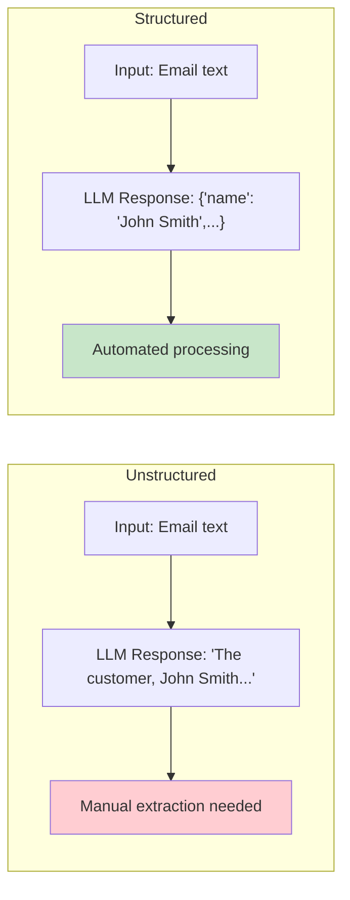

# Phase 2: Prompt Engineering & Model APIs

# Part 7: Structured Outputs

**Getting LLMs to produce reliable, parseable data—not just text—with JSON schemas, validation, and robust parsing strategies.**

---

## The Target: What We're Building Right Now

In this part, we're building five powerful tools:

1. **A JSON Mode Handler** — Enforce valid JSON output with schema validation
2. **A Schema Validator** — Validate outputs against JSON Schema
3. **An Email Parser** — Extract structured data from emails
4. **A Resume Parser** — Parse resumes into structured profiles
5. **An Invoice Extractor** — Extract invoice data with validation

**Why this matters:** Chatting is fun, but production AI is about data. Structured outputs turn LLMs into reliable data processing pipelines. This is how you build AI that integrates with your existing systems.

---

## The Concept: Getting Structured Data from LLMs

### The Data Entry Clerk Analogy

Imagine you're a manager with a team of data entry clerks. You need them to enter information into a database:

- **Without structure:** They write paragraphs of text. You have to manually extract what you need.
- **With structure:** They fill out a form with labeled fields. You get clean, consistent data every time.

**LLMs are the same.** If you just ask for information, you get text. If you give them a structure (a form to fill out), you get reliable, parseable data.



### Why Structured Outputs Matter

| Benefit | Description | Impact |
|---------|-------------|--------|
| **Reliability** | Consistent format every time | No parsing errors |
| **Automation** | Direct integration with databases | No manual processing |
| **Validation** | Type checking and schema validation | Data quality |
| **Cost** | Shorter, more precise prompts | Lower token usage |
| **Debugging** | Clear, parseable errors | Easier troubleshooting |

### Common Structured Output Formats

#### 1. JSON (Most Common)

```json
{
    "name": "John Smith",
    "age": 32,
    "email": "john@example.com",
    "occupation": "Software Engineer"
}
```

#### 2. JSON Schema

```json
{
    "type": "object",
    "properties": {
        "name": {"type": "string"},
        "age": {"type": "integer", "minimum": 0},
        "email": {"type": "string", "format": "email"},
        "occupation": {"type": "string"}
    },
    "required": ["name", "age"]
}
```

#### 3. XML

```xml
<person>
    <name>John Smith</name>
    <age>32</age>
    <email>john@example.com</email>
    <occupation>Software Engineer</occupation>
</person>
```

### Techniques for Structured Outputs

| Technique | How It Works | Pros | Cons |
|-----------|--------------|------|------|
| **JSON Mode** | API enforces JSON output | Reliable, fast | Limited to supported models |
| **Prompt Engineering** | Ask for JSON explicitly | Works with any model | Sometimes fails |
| **Schema Validation** | Validate after generation | Ensures quality | Requires extra processing |
| **Function Calling** | Use tool definitions | Structured and typed | Requires API support |
| **Two-Pass Extraction** | Generate, then parse | Robust | More expensive |

---

## The Implementation: Building Our Structured Output Tools

### Target File Structure

```
phase-2-prompt-engineering/
└── module-7-structured-outputs/
    ├── 01_json_mode_handler.py
    ├── 02_schema_validator.py
    ├── 03_email_parser.py
    ├── 04_resume_parser.py
    ├── 05_invoice_extractor.py
    ├── requirements.txt
    └── README.md
```

### Step 1: JSON Mode Handler

Create `01_json_mode_handler.py`:

```python
#!/usr/bin/env python3
"""
Module 7: JSON Mode Handler

Enforce valid JSON output from LLMs with schema validation.
"""

import os
import sys
from pathlib import Path
import json
from typing import Dict, Any, Optional, List, Union
from datetime import datetime

sys.path.insert(0, str(Path(__file__).parent.parent.parent.parent))

from shared.utils.config import load_config
from shared.utils.logging import setup_logging
from multi_provider_client import Message, AIClientFactory, Provider

setup_logging(debug=False)
config = load_config()

class JSONModeHandler:
    """
    Handle structured JSON outputs from LLMs.
    
    This class provides:
    - JSON mode enforcement
    - Schema validation
    - Error recovery
    - Type conversion
    """
    
    def __init__(self, provider: str = "openai", model: str = "gpt-4o-mini"):
        """
        Initialize the JSON handler.
        
        Args:
            provider: Provider to use
            model: Model to use
        """
        self.provider = provider
        self.model = model
        self.client = AIClientFactory.create(provider)
    
    def generate_json(
        self,
        prompt: str,
        schema: Optional[Dict[str, Any]] = None,
        system: Optional[str] = None,
        temperature: float = 0.1,
        max_tokens: int = 1000
    ) -> Dict[str, Any]:
        """
        Generate a JSON response with optional schema validation.
        
        Args:
            prompt: User prompt
            schema: JSON Schema to validate against
            system: System prompt
            temperature: Temperature (low for consistency)
            max_tokens: Maximum tokens
            
        Returns:
            Parsed JSON object
        """
        # Build the system prompt to enforce JSON
        json_system = system or "You are a data extraction assistant."
        
        if schema:
            # Add schema enforcement to system prompt
            schema_str = json.dumps(schema, indent=2)
            json_system = f"""{json_system}

You must respond with valid JSON that conforms to this schema:
{schema_str}

Your response must be ONLY the JSON object, no additional text.
"""
        
        # Add JSON format instruction
        enhanced_prompt = f"""{prompt}

IMPORTANT: Respond with ONLY valid JSON. Do not include any other text, explanations, or markdown formatting.

"""
        
        messages = [
            Message(role="system", content=json_system),
            Message(role="user", content=enhanced_prompt)
        ]
        
        try:
            response = self.client.chat(
                messages=messages,
                model=self.model,
                temperature=temperature,
                max_tokens=max_tokens
            )
            
            content = response.content.strip()
            
            # Extract JSON from potential markdown
            content = self._extract_json(content)
            
            # Parse JSON
            try:
                parsed = json.loads(content)
            except json.JSONDecodeError as e:
                # Try to fix common issues
                parsed = self._attempt_recovery(content)
            
            # Validate against schema if provided
            if schema:
                self._validate_schema(parsed, schema)
            
            return {
                "success": True,
                "data": parsed,
                "raw": content,
                "usage": response.usage
            }
            
        except Exception as e:
            return {
                "success": False,
                "error": str(e),
                "raw": content if 'content' in locals() else None
            }
    
    def _extract_json(self, text: str) -> str:
        """
        Extract JSON from text that might contain markdown or explanations.
        
        Args:
            text: Raw text
            
        Returns:
            Extracted JSON string
        """
        # Remove markdown code blocks
        text = text.strip()
        
        # Check for JSON code blocks
        if text.startswith('```json'):
            text = text[7:]  # Remove ```json
            if text.endswith('```'):
                text = text[:-3]  # Remove ```
        elif text.startswith('```'):
            text = text[3:]  # Remove ```
            if text.endswith('```'):
                text = text[:-3]  # Remove ```
        
        # Remove any trailing explanations
        lines = text.split('\n')
        json_lines = []
        brace_count = 0
        bracket_count = 0
        in_json = False
        
        for line in lines:
            # Check for start of JSON
            if not in_json:
                if '{' in line or '[' in line:
                    in_json = True
                    brace_count = line.count('{') - line.count('}')
                    bracket_count = line.count('[') - line.count(']')
            
            if in_json:
                json_lines.append(line)
                brace_count += line.count('{') - line.count('}')
                bracket_count += line.count('[') - line.count(']')
                
                # Check for end of JSON (all braces closed)
                if brace_count == 0 and bracket_count == 0:
                    break
        
        return '\n'.join(json_lines).strip()
    
    def _attempt_recovery(self, text: str) -> Dict[str, Any]:
        """
        Attempt to recover from JSON parsing errors.
        
        Args:
            text: Raw text
            
        Returns:
            Parsed JSON
        """
        # Try common fixes
        text = text.strip()
        
        # Remove trailing commas
        import re
        text = re.sub(r',\s*}', '}', text)
        text = re.sub(r',\s*\]', ']', text)
        
        # Add missing quotes around keys
        text = re.sub(r'(\w+):', r'"\1":', text)
        
        # Fix single quotes to double quotes
        text = re.sub(r"'([^']*)'", r'"\1"', text)
        
        try:
            return json.loads(text)
        except:
            # If all else fails, return empty dict
            return {}
    
    def _validate_schema(self, data: Dict[str, Any], schema: Dict[str, Any]) -> None:
        """
        Validate data against a JSON Schema.
        
        Args:
            data: Data to validate
            schema: JSON Schema
            
        Raises:
            ValueError: If validation fails
        """
        # Simple schema validation
        # In production, use a library like jsonschema
        
        required = schema.get('required', [])
        for field in required:
            if field not in data:
                raise ValueError(f"Missing required field: {field}")
        
        # Type validation
        properties = schema.get('properties', {})
        for field, field_schema in properties.items():
            if field in data:
                field_type = field_schema.get('type')
                value = data[field]
                
                if field_type == 'string' and not isinstance(value, str):
                    raise ValueError(f"Field '{field}' should be string, got {type(value).__name__}")
                elif field_type == 'integer' and not isinstance(value, int):
                    # Try to convert
                    try:
                        data[field] = int(value)
                    except:
                        raise ValueError(f"Field '{field}' should be integer")
                elif field_type == 'number' and not isinstance(value, (int, float)):
                    try:
                        data[field] = float(value)
                    except:
                        raise ValueError(f"Field '{field}' should be number")
                elif field_type == 'boolean' and not isinstance(value, bool):
                    # Try to convert
                    if value in ['true', 'True', '1', 'yes']:
                        data[field] = True
                    elif value in ['false', 'False', '0', 'no']:
                        data[field] = False
                    else:
                        raise ValueError(f"Field '{field}' should be boolean")
                elif field_type == 'array' and not isinstance(value, list):
                    raise ValueError(f"Field '{field}' should be array")
                elif field_type == 'object' and not isinstance(value, dict):
                    raise ValueError(f"Field '{field}' should be object")
    
    def generate_batch_json(
        self,
        items: List[str],
        schema: Dict[str, Any],
        batch_size: int = 5
    ) -> List[Dict[str, Any]]:
        """
        Generate JSON for a batch of items.
        
        Args:
            items: List of input strings
            schema: JSON Schema
            batch_size: Number of items per batch
            
        Returns:
            List of parsed JSON objects
        """
        results = []
        
        for i in range(0, len(items), batch_size):
            batch = items[i:i + batch_size]
            batch_prompt = self._create_batch_prompt(batch)
            
            result = self.generate_json(batch_prompt, schema)
            
            if result["success"]:
                data = result["data"]
                # Handle both single and batch responses
                if isinstance(data, list):
                    results.extend(data)
                else:
                    results.append(data)
        
        return results
    
    def _create_batch_prompt(self, items: List[str]) -> str:
        """
        Create a prompt for batch processing.
        
        Args:
            items: List of items to process
            
        Returns:
            Prompt string
        """
        prompt = "Process the following items and return a JSON array:\n\n"
        
        for i, item in enumerate(items, 1):
            prompt += f"Item {i}: {item}\n"
        
        prompt += "\nReturn a JSON array with one object per item."
        
        return prompt

def demonstrate_json_mode():
    """Demonstrate JSON mode handling."""
    print("\n" + "="*80)
    print("📊 JSON MODE HANDLER DEMONSTRATION")
    print("="*80)
    
    if not config.get("openai_api_key"):
        print("❌ OpenAI API key not available")
        return
    
    handler = JSONModeHandler()
    
    # Example 1: Simple JSON extraction
    print("\n📋 Example 1: Simple JSON Extraction")
    print("-"*40)
    
    schema = {
        "type": "object",
        "properties": {
            "name": {"type": "string"},
            "age": {"type": "integer"},
            "occupation": {"type": "string"}
        },
        "required": ["name", "age"]
    }
    
    result = handler.generate_json(
        prompt="Extract the person's name, age, and occupation: 'John Smith is a 32-year-old software engineer'",
        schema=schema
    )
    
    if result["success"]:
        print("✅ Success!")
        print(f"Data: {json.dumps(result['data'], indent=2)}")
        print(f"Tokens: {result['usage'].get('total_tokens', 'N/A')}")
    else:
        print(f"❌ Error: {result.get('error')}")
    
    # Example 2: Batch processing
    print("\n📋 Example 2: Batch Processing")
    print("-"*40)
    
    items = [
        "Sarah is 28 and works as a data scientist",
        "Mike is 45 and is a teacher",
        "Emma is 31 and is a product manager"
    ]
    
    results = handler.generate_batch_json(items, schema)
    
    print(f"✅ Processed {len(results)} items:")
    for i, data in enumerate(results, 1):
        print(f"  {i}. {json.dumps(data)}")

def main():
    """Run the JSON mode demonstration."""
    print("\n" + "="*80)
    print("AI TUTORIAL SERIES - JSON MODE HANDLER")
    print("="*80)
    
    demonstrate_json_mode()

if __name__ == "__main__":
    main()
```

### Step 2: Schema Validator

Create `02_schema_validator.py`:

```python
#!/usr/bin/env python3
"""
Module 7: Schema Validator

Validate JSON outputs against JSON Schema with comprehensive error reporting.
"""

import os
import sys
from pathlib import Path
import json
from typing import Dict, Any, List, Optional, Union
from datetime import datetime

sys.path.insert(0, str(Path(__file__).parent.parent.parent.parent))

from shared.utils.config import load_config
from shared.utils.logging import setup_logging

setup_logging(debug=False)
config = load_config()

class SchemaValidator:
    """
    Validate data against JSON Schema with detailed error reporting.
    
    Features:
    - Full JSON Schema validation
    - Type checking and coercion
    - Required field validation
    - Enum validation
    - Nested object validation
    - Array item validation
    - Custom validators
    """
    
    def __init__(self):
        """Initialize the schema validator."""
        self.errors = []
        self.warnings = []
    
    def validate(self, data: Any, schema: Dict[str, Any]) -> Dict[str, Any]:
        """
        Validate data against a JSON Schema.
        
        Args:
            data: Data to validate
            schema: JSON Schema
            
        Returns:
            Validation result with errors and warnings
        """
        self.errors = []
        self.warnings = []
        
        self._validate_value(data, schema, "$")
        
        return {
            "valid": len(self.errors) == 0,
            "errors": self.errors,
            "warnings": self.warnings,
            "data": data
        }
    
    def _validate_value(self, value: Any, schema: Dict[str, Any], path: str) -> None:
        """
        Validate a value against a schema.
        
        Args:
            value: Value to validate
            schema: Schema for this value
            path: Current JSON path
        """
        if not schema:
            return
        
        # Check type
        schema_type = schema.get('type')
        if schema_type:
            if not self._check_type(value, schema_type):
                self.errors.append({
                    "path": path,
                    "message": f"Expected type {schema_type}, got {type(value).__name__}",
                    "value": str(value)[:50]
                })
                return
        
        # Check enum
        enum_values = schema.get('enum')
        if enum_values and value not in enum_values:
            self.errors.append({
                "path": path,
                "message": f"Value must be one of {enum_values}",
                "value": str(value)[:50]
            })
        
        # Check format
        format_type = schema.get('format')
        if format_type:
            self._validate_format(value, format_type, path)
        
        # Check object
        if schema_type == 'object' or schema.get('properties'):
            self._validate_object(value, schema, path)
        
        # Check array
        if schema_type == 'array':
            self._validate_array(value, schema, path)
        
        # Check number constraints
        if schema_type in ['integer', 'number']:
            self._validate_number(value, schema, path)
        
        # Check string constraints
        if schema_type == 'string':
            self._validate_string(value, schema, path)
    
    def _check_type(self, value: Any, expected_type: str) -> bool:
        """
        Check if a value matches an expected type.
        
        Args:
            value: Value to check
            expected_type: Expected type
            
        Returns:
            True if type matches
        """
        type_map = {
            'string': str,
            'number': (int, float),
            'integer': int,
            'boolean': bool,
            'object': dict,
            'array': list,
            'null': type(None)
        }
        
        expected = type_map.get(expected_type)
        if not expected:
            return True
        
        return isinstance(value, expected)
    
    def _validate_object(self, value: Any, schema: Dict[str, Any], path: str) -> None:
        """
        Validate an object against schema.
        
        Args:
            value: Object to validate
            schema: Schema for the object
            path: Current JSON path
        """
        if not isinstance(value, dict):
            return
        
        # Check required fields
        required = schema.get('required', [])
        for field in required:
            if field not in value:
                self.errors.append({
                    "path": f"{path}.{field}",
                    "message": f"Required field '{field}' missing",
                    "value": None
                })
        
        # Check properties
        properties = schema.get('properties', {})
        for prop, prop_schema in properties.items():
            if prop in value:
                self._validate_value(value[prop], prop_schema, f"{path}.{prop}")
        
        # Check pattern properties
        pattern_properties = schema.get('patternProperties', {})
        for prop in value:
            if prop in properties:
                continue
            if prop in pattern_properties:
                self._validate_value(value[prop], pattern_properties[prop], f"{path}.{prop}")
        
        # Check additional properties
        additional = schema.get('additionalProperties', True)
        if not additional:
            extra = [prop for prop in value if prop not in properties]
            if extra:
                self.errors.append({
                    "path": path,
                    "message": f"Additional properties not allowed: {extra}",
                    "value": None
                })
    
    def _validate_array(self, value: Any, schema: Dict[str, Any], path: str) -> None:
        """
        Validate an array against schema.
        
        Args:
            value: Array to validate
            schema: Schema for the array
            path: Current JSON path
        """
        if not isinstance(value, list):
            return
        
        # Check min items
        min_items = schema.get('minItems')
        if min_items is not None and len(value) < min_items:
            self.errors.append({
                "path": path,
                "message": f"Array has {len(value)} items, minimum {min_items}",
                "value": None
            })
        
        # Check max items
        max_items = schema.get('maxItems')
        if max_items is not None and len(value) > max_items:
            self.errors.append({
                "path": path,
                "message": f"Array has {len(value)} items, maximum {max_items}",
                "value": None
            })
        
        # Check items
        items_schema = schema.get('items')
        if items_schema:
            for i, item in enumerate(value):
                self._validate_value(item, items_schema, f"{path}[{i}]")
    
    def _validate_number(self, value: Any, schema: Dict[str, Any], path: str) -> None:
        """
        Validate a number against schema constraints.
        
        Args:
            value: Number to validate
            schema: Schema for the number
            path: Current JSON path
        """
        if not isinstance(value, (int, float)):
            return
        
        minimum = schema.get('minimum')
        if minimum is not None and value < minimum:
            self.errors.append({
                "path": path,
                "message": f"Value {value} must be >= {minimum}",
                "value": value
            })
        
        maximum = schema.get('maximum')
        if maximum is not None and value > maximum:
            self.errors.append({
                "path": path,
                "message": f"Value {value} must be <= {maximum}",
                "value": value
            })
    
    def _validate_string(self, value: Any, schema: Dict[str, Any], path: str) -> None:
        """
        Validate a string against schema constraints.
        
        Args:
            value: String to validate
            schema: Schema for the string
            path: Current JSON path
        """
        if not isinstance(value, str):
            return
        
        min_length = schema.get('minLength')
        if min_length is not None and len(value) < min_length:
            self.errors.append({
                "path": path,
                "message": f"String length {len(value)} must be >= {min_length}",
                "value": value
            })
        
        max_length = schema.get('maxLength')
        if max_length is not None and len(value) > max_length:
            self.errors.append({
                "path": path,
                "message": f"String length {len(value)} must be <= {max_length}",
                "value": value
            })
        
        pattern = schema.get('pattern')
        if pattern:
            import re
            if not re.match(pattern, value):
                self.errors.append({
                    "path": path,
                    "message": f"String must match pattern: {pattern}",
                    "value": value
                })
    
    def _validate_format(self, value: Any, format_type: str, path: str) -> None:
        """
        Validate a string format.
        
        Args:
            value: String to validate
            format_type: Format type
            path: Current JSON path
        """
        if not isinstance(value, str):
            return
        
        if format_type == 'email':
            import re
            pattern = r'^[a-zA-Z0-9._%+-]+@[a-zA-Z0-9.-]+\.[a-zA-Z]{2,}$'
            if not re.match(pattern, value):
                self.errors.append({
                    "path": path,
                    "message": f"Invalid email format: {value}",
                    "value": value
                })
        
        elif format_type == 'uri':
            import re
            pattern = r'^https?://[^\s/$.?#].[^\s]*$'
            if not re.match(pattern, value):
                self.errors.append({
                    "path": path,
                    "message": f"Invalid URI format: {value}",
                    "value": value
                })
        
        elif format_type == 'date':
            try:
                datetime.strptime(value, '%Y-%m-%d')
            except:
                self.errors.append({
                    "path": path,
                    "message": f"Invalid date format (YYYY-MM-DD): {value}",
                    "value": value
                })

def demonstrate_schema_validator():
    """Demonstrate the schema validator."""
    print("\n" + "="*80)
    print("✅ SCHEMA VALIDATOR DEMONSTRATION")
    print("="*80)
    
    validator = SchemaValidator()
    
    # Schema for a person
    schema = {
        "type": "object",
        "properties": {
            "name": {"type": "string", "minLength": 2, "maxLength": 50},
            "age": {"type": "integer", "minimum": 0, "maximum": 150},
            "email": {"type": "string", "format": "email"},
            "occupation": {"type": "string"},
            "hobbies": {"type": "array", "minItems": 1, "maxItems": 10, "items": {"type": "string"}},
            "address": {
                "type": "object",
                "properties": {
                    "street": {"type": "string"},
                    "city": {"type": "string"},
                    "country": {"type": "string"}
                },
                "required": ["city", "country"]
            }
        },
        "required": ["name", "age"]
    }
    
    # Test 1: Valid data
    print("\n📋 Test 1: Valid Data")
    print("-"*40)
    
    valid_data = {
        "name": "John Smith",
        "age": 32,
        "email": "john@example.com",
        "occupation": "Software Engineer",
        "hobbies": ["reading", "coding", "hiking"],
        "address": {
            "street": "123 Main St",
            "city": "New York",
            "country": "USA"
        }
    }
    
    result = validator.validate(valid_data, schema)
    print(f"Valid: {result['valid']}")
    print(f"Errors: {len(result['errors'])}")
    print(f"Warnings: {len(result['warnings'])}")
    
    # Test 2: Invalid data
    print("\n📋 Test 2: Invalid Data")
    print("-"*40)
    
    invalid_data = {
        "name": "J",  # Too short
        "age": 200,   # Too high
        "email": "not-a-valid-email",  # Invalid email
        "hobbies": [],  # Min items: 1
        "address": {
            "street": "456 Oak Ave"
            # Missing city and country
        }
    }
    
    result = validator.validate(invalid_data, schema)
    print(f"Valid: {result['valid']}")
    print(f"Errors ({len(result['errors'])}):")
    for error in result['errors']:
        print(f"  • {error['path']}: {error['message']}")
    
    # Test 3: Data with warnings
    print("\n📋 Test 3: Data with Warnings")
    print("-"*40)
    
    # This demonstrates how to add warnings
    # For simplicity, we'll just show that validation passes
    
    warning_data = {
        "name": "Jane Doe",
        "age": 25,
        "email": "jane@example.com",
        "hobbies": ["painting", "reading"]
    }
    
    # Add a custom validation that produces a warning
    # (In production, you'd implement this in _validate_value)
    
    result = validator.validate(warning_data, schema)
    print(f"Valid: {result['valid']}")
    print(f"Errors: {len(result['errors'])}")
    print(f"Warnings: {len(result['warnings'])}")

def main():
    """Run the schema validator demonstration."""
    print("\n" + "="*80)
    print("AI TUTORIAL SERIES - SCHEMA VALIDATOR")
    print("="*80)
    
    demonstrate_schema_validator()

if __name__ == "__main__":
    main()
```

### Step 3: Email Parser

Create `03_email_parser.py`:

```python
#!/usr/bin/env python3
"""
Module 7: Email Parser

Extract structured information from emails including sender, recipient,
subject, body, attachments, and actions.
"""

import os
import sys
from pathlib import Path
import json
from typing import Dict, Any, List, Optional
from datetime import datetime

sys.path.insert(0, str(Path(__file__).parent.parent.parent.parent))

from shared.utils.config import load_config
from shared.utils.logging import setup_logging
from json_mode_handler import JSONModeHandler

setup_logging(debug=False)
config = load_config()

class EmailParser:
    """
    Parse emails and extract structured information.
    
    Extracts:
    - Sender and recipient information
    - Subject and body
    - Dates and times
    - Actions and tasks
    - Key entities (people, companies, etc.)
    - Sentiment and urgency
    """
    
    def __init__(self, provider: str = "openai", model: str = "gpt-4o-mini"):
        """
        Initialize the email parser.
        
        Args:
            provider: Provider to use
            model: Model to use
        """
        self.provider = provider
        self.model = model
        self.handler = JSONModeHandler(provider, model)
        
        # Schema for email parsing
        self.schema = {
            "type": "object",
            "properties": {
                "from": {"type": "string", "format": "email"},
                "to": {"type": "array", "items": {"type": "string", "format": "email"}},
                "cc": {"type": "array", "items": {"type": "string", "format": "email"}},
                "bcc": {"type": "array", "items": {"type": "string", "format": "email"}},
                "subject": {"type": "string"},
                "body": {"type": "string"},
                "date": {"type": "string", "format": "date"},
                "actions": {
                    "type": "array",
                    "items": {
                        "type": "object",
                        "properties": {
                            "action": {"type": "string"},
                            "details": {"type": "string"},
                            "deadline": {"type": "string", "format": "date"}
                        }
                    }
                },
                "entities": {
                    "type": "array",
                    "items": {
                        "type": "object",
                        "properties": {
                            "type": {"type": "string", "enum": ["person", "company", "date", "number", "location"]},
                            "value": {"type": "string"}
                        }
                    }
                },
                "sentiment": {"type": "string", "enum": ["positive", "negative", "neutral"]},
                "urgency": {"type": "string", "enum": ["low", "medium", "high"]},
                "summary": {"type": "string"}
            },
            "required": ["subject", "body", "sentiment"]
        }
    
    def parse_email(self, email_text: str) -> Dict[str, Any]:
        """
        Parse an email and extract structured information.
        
        Args:
            email_text: Raw email text
            
        Returns:
            Parsed email data
        """
        prompt = f"""Extract structured information from this email:

Email:
{email_text}

Extract:
1. Sender (from) and recipients (to, cc, bcc)
2. Subject and body
3. Date
4. Actions required (what needs to be done)
5. Key entities (people, companies, dates, numbers, locations)
6. Sentiment (positive/negative/neutral)
7. Urgency (low/medium/high)
8. Brief summary

Return the information as a JSON object."""
        
        result = self.handler.generate_json(
            prompt=prompt,
            schema=self.schema,
            temperature=0.1,
            max_tokens=1000
        )
        
        if result["success"]:
            return {
                "success": True,
                "data": result["data"],
                "usage": result.get("usage", {})
            }
        else:
            return {
                "success": False,
                "error": result.get("error"),
                "raw": result.get("raw")
            }
    
    def parse_batch_emails(self, emails: List[str]) -> List[Dict[str, Any]]:
        """
        Parse a batch of emails.
        
        Args:
            emails: List of email texts
            
        Returns:
            List of parsed email data
        """
        results = []
        
        for email in emails:
            result = self.parse_email(email)
            results.append(result)
        
        return results

def demonstrate_email_parser():
    """Demonstrate the email parser."""
    print("\n" + "="*80)
    print("📧 EMAIL PARSER DEMONSTRATION")
    print("="*80)
    
    if not config.get("openai_api_key"):
        print("❌ OpenAI API key not available")
        return
    
    parser = EmailParser()
    
    # Example 1: Simple email
    print("\n📋 Example 1: Simple Email")
    print("-"*40)
    
    email1 = """
From: john.smith@company.com
To: support@company.com
Subject: Issue with login

Dear Support Team,

I'm having trouble logging into my account. I've tried resetting my password
but I'm not receiving the reset email. This has been happening since yesterday.

Could you please investigate this issue?

Best regards,
John Smith
Account ID: 12345
"""
    
    result = parser.parse_email(email1)
    
    if result["success"]:
        print("✅ Success!")
        print(f"Data: {json.dumps(result['data'], indent=2)}")
    else:
        print(f"❌ Error: {result.get('error')}")
    
    # Example 2: Email with actions
    print("\n📋 Example 2: Email with Actions")
    print("-"*40)
    
    email2 = """
From: manager@company.com
To: team@company.com
Subject: Project Deadline Extension

Team,

I'm pleased to inform you that the project deadline has been extended by one week.
The new deadline is December 15th.

Here are the new tasks:
1. Complete the documentation by December 5th (Sarah)
2. Run final testing by December 8th (Mike)
3. Prepare the presentation by December 12th (Emma)

Let me know if you have any questions.

Best,
Manager
"""
    
    result = parser.parse_email(email2)
    
    if result["success"]:
        print("✅ Success!")
        print(f"Data: {json.dumps(result['data'], indent=2)}")
    else:
        print(f"❌ Error: {result.get('error')}")

def main():
    """Run the email parser demonstration."""
    print("\n" + "="*80)
    print("AI TUTORIAL SERIES - EMAIL PARSER")
    print("="*80)
    
    demonstrate_email_parser()

if __name__ == "__main__":
    main()
```

### Step 4: Resume Parser

Create `04_resume_parser.py`:

```python
#!/usr/bin/env python3
"""
Module 7: Resume Parser

Extract structured information from resumes including personal info,
experience, education, skills, and more.
"""

import os
import sys
from pathlib import Path
import json
from typing import Dict, Any, List, Optional
from datetime import datetime

sys.path.insert(0, str(Path(__file__).parent.parent.parent.parent))

from shared.utils.config import load_config
from shared.utils.logging import setup_logging
from json_mode_handler import JSONModeHandler

setup_logging(debug=False)
config = load_config()

class ResumeParser:
    """
    Parse resumes and extract structured information.
    
    Extracts:
    - Personal information (name, email, phone, location)
    - Professional summary
    - Work experience (company, role, dates, responsibilities)
    - Education (school, degree, dates, GPA)
    - Skills (technical, soft, languages)
    - Certifications
    - Projects
    - Awards and achievements
    """
    
    def __init__(self, provider: str = "openai", model: str = "gpt-4o-mini"):
        """
        Initialize the resume parser.
        
        Args:
            provider: Provider to use
            model: Model to use
        """
        self.provider = provider
        self.model = model
        self.handler = JSONModeHandler(provider, model)
        
        # Schema for resume parsing
        self.schema = {
            "type": "object",
            "properties": {
                "personal_info": {
                    "type": "object",
                    "properties": {
                        "name": {"type": "string"},
                        "email": {"type": "string", "format": "email"},
                        "phone": {"type": "string"},
                        "location": {"type": "string"},
                        "linkedin": {"type": "string", "format": "uri"},
                        "portfolio": {"type": "string", "format": "uri"}
                    }
                },
                "summary": {"type": "string"},
                "experience": {
                    "type": "array",
                    "items": {
                        "type": "object",
                        "properties": {
                            "company": {"type": "string"},
                            "role": {"type": "string"},
                            "start_date": {"type": "string"},
                            "end_date": {"type": "string"},
                            "current": {"type": "boolean"},
                            "responsibilities": {"type": "array", "items": {"type": "string"}},
                            "achievements": {"type": "array", "items": {"type": "string"}}
                        }
                    }
                },
                "education": {
                    "type": "array",
                    "items": {
                        "type": "object",
                        "properties": {
                            "institution": {"type": "string"},
                            "degree": {"type": "string"},
                            "field": {"type": "string"},
                            "start_date": {"type": "string"},
                            "end_date": {"type": "string"},
                            "gpa": {"type": "number"},
                            "current": {"type": "boolean"}
                        }
                    }
                },
                "skills": {
                    "type": "object",
                    "properties": {
                        "technical": {"type": "array", "items": {"type": "string"}},
                        "soft": {"type": "array", "items": {"type": "string"}},
                        "languages": {"type": "array", "items": {"type": "string"}}
                    }
                },
                "certifications": {
                    "type": "array",
                    "items": {
                        "type": "object",
                        "properties": {
                            "name": {"type": "string"},
                            "issuer": {"type": "string"},
                            "date": {"type": "string"}
                        }
                    }
                },
                "projects": {
                    "type": "array",
                    "items": {
                        "type": "object",
                        "properties": {
                            "name": {"type": "string"},
                            "description": {"type": "string"},
                            "technologies": {"type": "array", "items": {"type": "string"}}
                        }
                    }
                }
            },
            "required": ["personal_info", "summary"]
        }
    
    def parse_resume(self, resume_text: str) -> Dict[str, Any]:
        """
        Parse a resume and extract structured information.
        
        Args:
            resume_text: Raw resume text
            
        Returns:
            Parsed resume data
        """
        prompt = f"""Extract structured information from this resume:

Resume:
{resume_text}

Extract:
1. Personal information (name, email, phone, location, LinkedIn, portfolio)
2. Professional summary
3. Work experience (company, role, dates, responsibilities, achievements)
4. Education (institution, degree, field, dates, GPA)
5. Skills (technical, soft, languages)
6. Certifications
7. Projects

Return the information as a JSON object."""
        
        result = self.handler.generate_json(
            prompt=prompt,
            schema=self.schema,
            temperature=0.1,
            max_tokens=1500
        )
        
        if result["success"]:
            return {
                "success": True,
                "data": result["data"],
                "usage": result.get("usage", {})
            }
        else:
            return {
                "success": False,
                "error": result.get("error"),
                "raw": result.get("raw")
            }

def demonstrate_resume_parser():
    """Demonstrate the resume parser."""
    print("\n" + "="*80)
    print("📄 RESUME PARSER DEMONSTRATION")
    print("="*80)
    
    if not config.get("openai_api_key"):
        print("❌ OpenAI API key not available")
        return
    
    parser = ResumeParser()
    
    # Sample resume
    print("\n📋 Sample Resume")
    print("-"*40)
    
    resume = """
JOHN SMITH
john.smith@email.com | (555) 123-4567 | San Francisco, CA
linkedin.com/in/johnsmith | github.com/johnsmith

PROFESSIONAL SUMMARY
Senior Software Engineer with 8+ years of experience in full-stack development.
Specialized in Python, React, and cloud architecture. Led teams of 5-10 engineers
and delivered products used by 1M+ users.

WORK EXPERIENCE

Senior Software Engineer | TechCorp Inc. | 2020 - Present
- Led development of a microservices architecture serving 1M+ daily active users
- Architected and implemented a real-time analytics pipeline using Kafka and Spark
- Mentored 8 junior engineers and conducted code reviews
- Reduced API latency by 40% through optimization and caching

Software Engineer | StartupCo | 2018 - 2020
- Developed a React-based dashboard for data visualization
- Implemented RESTful APIs with Python and Flask
- Deployed applications on AWS using Docker and Kubernetes

EDUCATION

Stanford University | 2014 - 2018
Bachelor of Science in Computer Science
GPA: 3.8/4.0
Relevant Coursework: Data Structures, Algorithms, Database Systems, AI

SKILLS
Technical: Python, React, Node.js, TypeScript, SQL, MongoDB, AWS, Docker, Kubernetes
Soft: Leadership, Communication, Problem Solving, Agile, Scrum
Languages: English (Native), Spanish (Fluent)

CERTIFICATIONS
AWS Solutions Architect - Professional
Certified Kubernetes Administrator
"""
    
    result = parser.parse_resume(resume)
    
    if result["success"]:
        print("✅ Success!")
        print(f"Data: {json.dumps(result['data'], indent=2)}")
    else:
        print(f"❌ Error: {result.get('error')}")

def main():
    """Run the resume parser demonstration."""
    print("\n" + "="*80)
    print("AI TUTORIAL SERIES - RESUME PARSER")
    print("="*80)
    
    demonstrate_resume_parser()

if __name__ == "__main__":
    main()
```

### Step 5: Invoice Extractor

Create `05_invoice_extractor.py`:

```python
#!/usr/bin/env python3
"""
Module 7: Invoice Extractor

Extract structured information from invoices including totals, line items,
dates, and vendor information.
"""

import os
import sys
from pathlib import Path
import json
from typing import Dict, Any, List, Optional
from datetime import datetime

sys.path.insert(0, str(Path(__file__).parent.parent.parent.parent))

from shared.utils.config import load_config
from shared.utils.logging import setup_logging
from json_mode_handler import JSONModeHandler

setup_logging(debug=False)
config = load_config()

class InvoiceExtractor:
    """
    Extract structured information from invoices.
    
    Extracts:
    - Invoice number, date, due date
    - Vendor information (name, address, tax ID)
    - Customer information (name, address)
    - Line items (description, quantity, unit price, total)
    - Subtotal, tax, discount, total
    - Payment terms and method
    """
    
    def __init__(self, provider: str = "openai", model: str = "gpt-4o-mini"):
        """
        Initialize the invoice extractor.
        
        Args:
            provider: Provider to use
            model: Model to use
        """
        self.provider = provider
        self.model = model
        self.handler = JSONModeHandler(provider, model)
        
        # Schema for invoice extraction
        self.schema = {
            "type": "object",
            "properties": {
                "invoice": {
                    "type": "object",
                    "properties": {
                        "number": {"type": "string"},
                        "date": {"type": "string", "format": "date"},
                        "due_date": {"type": "string", "format": "date"},
                        "currency": {"type": "string", "pattern": "^[A-Z]{3}$"}
                    }
                },
                "vendor": {
                    "type": "object",
                    "properties": {
                        "name": {"type": "string"},
                        "address": {"type": "string"},
                        "tax_id": {"type": "string"},
                        "email": {"type": "string", "format": "email"}
                    }
                },
                "customer": {
                    "type": "object",
                    "properties": {
                        "name": {"type": "string"},
                        "address": {"type": "string"},
                        "email": {"type": "string", "format": "email"}
                    }
                },
                "line_items": {
                    "type": "array",
                    "items": {
                        "type": "object",
                        "properties": {
                            "description": {"type": "string"},
                            "quantity": {"type": "number"},
                            "unit_price": {"type": "number"},
                            "total": {"type": "number"},
                            "tax_rate": {"type": "number"},
                            "tax_amount": {"type": "number"}
                        }
                    }
                },
                "totals": {
                    "type": "object",
                    "properties": {
                        "subtotal": {"type": "number"},
                        "tax": {"type": "number"},
                        "discount": {"type": "number"},
                        "total": {"type": "number"}
                    }
                },
                "payment": {
                    "type": "object",
                    "properties": {
                        "terms": {"type": "string"},
                        "method": {"type": "string"},
                        "bank_details": {"type": "string"}
                    }
                }
            },
            "required": ["invoice", "totals"]
        }
    
    def extract_invoice(self, invoice_text: str) -> Dict[str, Any]:
        """
        Extract structured information from an invoice.
        
        Args:
            invoice_text: Raw invoice text
            
        Returns:
            Extracted invoice data
        """
        prompt = f"""Extract structured information from this invoice:

Invoice:
{invoice_text}

Extract:
1. Invoice number, date, due date, currency
2. Vendor information (name, address, tax ID, email)
3. Customer information (name, address, email)
4. Line items (description, quantity, unit price, total)
5. Totals (subtotal, tax, discount, total)
6. Payment terms and method

Return the information as a JSON object."""
        
        result = self.handler.generate_json(
            prompt=prompt,
            schema=self.schema,
            temperature=0.1,
            max_tokens=1500
        )
        
        if result["success"]:
            return {
                "success": True,
                "data": result["data"],
                "usage": result.get("usage", {})
            }
        else:
            return {
                "success": False,
                "error": result.get("error"),
                "raw": result.get("raw")
            }

def demonstrate_invoice_extractor():
    """Demonstrate the invoice extractor."""
    print("\n" + "="*80)
    print("🧾 INVOICE EXTRACTOR DEMONSTRATION")
    print("="*80)
    
    if not config.get("openai_api_key"):
        print("❌ OpenAI API key not available")
        return
    
    extractor = InvoiceExtractor()
    
    # Sample invoice
    print("\n📋 Sample Invoice")
    print("-"*40)
    
    invoice = """
INVOICE #INV-2024-001

Date: 2024-01-15
Due Date: 2024-02-14

Vendor:
Tech Solutions Inc.
123 Tech Park Drive
San Francisco, CA 94105
Tax ID: 12-3456789
Email: billing@techsolutions.com

Customer:
ABC Corporation
456 Business Ave
New York, NY 10001
Email: accounts@abccorp.com

Line Items:
--------------------------------------------------
Item | Description | Qty | Unit Price | Total
--------------------------------------------------
A-101 | Software License | 5 | $100.00 | $500.00
B-202 | Consulting Services | 10 | $150.00 | $1,500.00
C-303 | Support Package | 3 | $200.00 | $600.00
--------------------------------------------------

Subtotal: $2,600.00
Tax (8%): $208.00
Discount (5%): -$130.00
Total Due: $2,678.00

Payment Terms: Net 30
Payment Method: Bank Transfer
Bank Details: Wells Fargo, Account #1234567890
"""
    
    result = extractor.extract_invoice(invoice)
    
    if result["success"]:
        print("✅ Success!")
        print(f"Data: {json.dumps(result['data'], indent=2)}")
        
        # Show totals in a nice format
        data = result["data"]
        print("\n📊 Invoice Summary:")
        print(f"  Number: {data.get('invoice', {}).get('number')}")
        print(f"  Date: {data.get('invoice', {}).get('date')}")
        print(f"  Total: ${data.get('totals', {}).get('total', 0):.2f}")
        print(f"  Items: {len(data.get('line_items', []))}")
        
        if data.get('line_items'):
            print("\n  Line Items:")
            for item in data['line_items']:
                print(f"    • {item.get('description')}: {item.get('quantity')} x ${item.get('unit_price', 0):.2f} = ${item.get('total', 0):.2f}")
        
    else:
        print(f"❌ Error: {result.get('error')}")

def main():
    """Run the invoice extractor demonstration."""
    print("\n" + "="*80)
    print("AI TUTORIAL SERIES - INVOICE EXTRACTOR")
    print("="*80)
    
    demonstrate_invoice_extractor()

if __name__ == "__main__":
    main()
```

---

## The Verification: Testing Your Implementation

### Step 1: Install Dependencies

Create `requirements.txt`:

```txt
# Module 7 dependencies
openai>=1.0.0
python-dotenv>=1.0.0
```

Install them:

```bash
cd ~/ai-tutorial-series/phase-2-prompt-engineering/module-7-structured-outputs
pip install -r requirements.txt
```

### Step 2: Test the JSON Mode Handler

```bash
python 01_json_mode_handler.py
```

**Expected Output:**
- JSON extraction with schema
- Batch processing
- Schema validation

### Step 3: Test the Schema Validator

```bash
python 02_schema_validator.py
```

**Expected Output:**
- Valid data passes validation
- Invalid data shows detailed errors
- Type checking and format validation

### Step 4: Test the Email Parser

```bash
python 03_email_parser.py
```

**Expected Output:**
- Structured email data
- Sender, recipients, subject, body
- Actions, entities, sentiment, urgency

### Step 5: Test the Resume Parser

```bash
python 04_resume_parser.py
```

**Expected Output:**
- Structured resume data
- Personal info, experience, education
- Skills, certifications, projects

### Step 6: Test the Invoice Extractor

```bash
python 05_invoice_extractor.py
```

**Expected Output:**
- Structured invoice data
- Invoice details, vendor, customer
- Line items, totals, payment terms

---

## Key Takeaways

By completing this module, you've:

✅ **Built a JSON mode handler** with schema validation
✅ **Created a comprehensive schema validator** with detailed error reporting
✅ **Built an email parser** for structured email extraction
✅ **Created a resume parser** for candidate data extraction
✅ **Built an invoice extractor** for financial document processing

### The Mental Model to Carry Forward

```
┌─────────────────────────────────────────────────────────────────┐
│               STRUCTURED OUTPUTS MENTAL MODEL                  │
├─────────────────────────────────────────────────────────────────┤
│                                                                 │
│  1. Structured outputs turn LLMs into data processing          │
│  2. JSON is the most common structured format                  │
│  3. JSON Schema validates data quality                         │
│  4. Schemas define required fields and types                   │
│  5. Type coercion handles common conversion issues             │
│  6. Format validation ensures data quality (email, date)       │
│  7. Error reporting helps debug parsing issues                 │
│  8. Batch processing improves efficiency                       │
│                                                                 │
└─────────────────────────────────────────────────────────────────┘
```

### Structured Output Best Practices

| Practice | Why | How |
|----------|-----|-----|
| **Define Schemas** | Ensures data quality | Use JSON Schema |
| **Use Low Temperature** | Reduces variability | 0.1-0.3 for extraction |
| **Validate Outputs** | Catches errors | Validate after generation |
| **Handle Errors Gracefully** | Prevents crashes | Try/except with fallbacks |
| **Coerce Types** | Handles common issues | Convert strings to numbers |
| **Batch Process** | Improves efficiency | Group similar items |
| **Test with Edge Cases** | Ensures robustness | Test with malformed input |

---

## What's Next

**In Part 8: Multimodal AI**, you'll learn:
- Vision models and image understanding
- OCR and PDF processing
- Audio transcription and speech-to-text
- Text-to-speech
- Image generation
- Building multimodal applications
