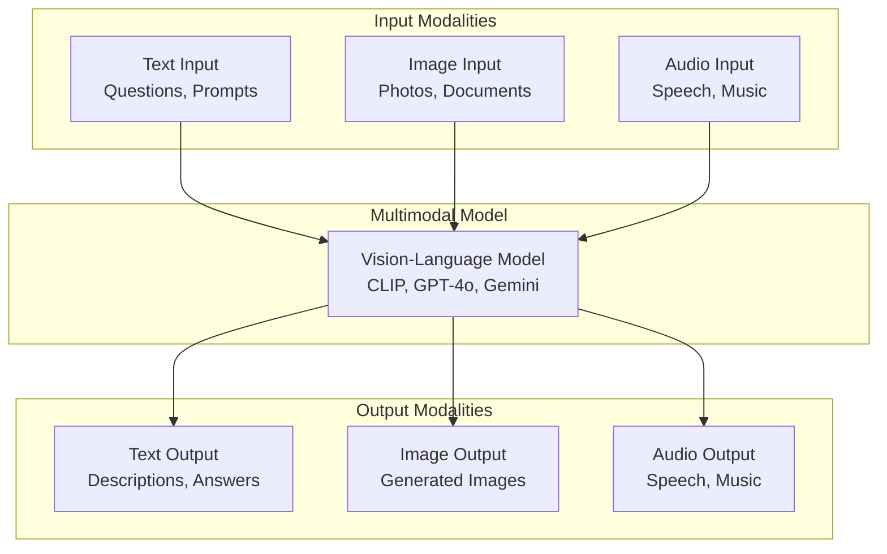

# Phase 2: Prompt Engineering & Model APIs

# Part 8: Multimodal AI

**Working with images, audio, and video—extending AI beyond text to understand and generate multiple modalities.**

---

## The Target: What We're Building Right Now

In this part, we're building six powerful tools:

1. **A Vision Understanding Tool** — Analyze images with multimodal models
2. **An OCR System** — Extract text from images and PDFs
3. **A PDF Processor** — Extract and analyze PDF content
4. **A Speech-to-Text System** — Transcribe audio with Whisper
5. **A Text-to-Speech System** — Generate audio from text
6. **An Image Generation Tool** — Create images from text descriptions

**Why this matters:** Text-only AI is just the beginning. Multimodal AI opens up entirely new categories of applications—document processing, content creation, accessibility, and more.

---

## The Concept: Working with Multiple Modalities

### The Sensory Analogy

Think of how humans process information:

- **We read text** (language modality)
- **We see images** (visual modality)
- **We hear sounds** (audio modality)
- **We combine them** (multimodal understanding)

**Multimodal AI does the same.** It can process and generate across different types of data, enabling applications that understand the world more like humans do.



### Multimodal Model Types

| Type | Models | Input | Output | Use Cases |
|------|--------|-------|--------|-----------|
| **Vision-Language** | GPT-4o, Gemini, Claude 3.5 | Image + Text | Text | Image description, visual QA |
| **Text-to-Image** | DALL-E, Stable Diffusion | Text | Image | Image generation, art |
| **Speech-to-Text** | Whisper, Speech-to-Text | Audio | Text | Transcription, captions |
| **Text-to-Speech** | ElevenLabs, TTS | Text | Audio | Voice synthesis, accessibility |
| **Multimodal** | Gemini, GPT-4o | Any | Any | General multimodal understanding |

### Key Multimodal Capabilities

#### 1. Vision Understanding

- **Image classification** — What's in the image?
- **Object detection** — Where are specific objects?
- **Image captioning** — Describe the image in text
- **Visual Q&A** — Answer questions about images
- **OCR** — Extract text from images

#### 2. Audio Processing

- **Speech recognition** — Transcribe spoken words
- **Speaker diarization** — Identify who's speaking
- **Language identification** — Detect the language
- **Sentiment analysis** — Detect emotion in speech
- **Music recognition** — Identify songs

#### 3. Image Generation

- **Text-to-image** — Create images from descriptions
- **Image-to-image** — Transform existing images
- **Inpainting** — Fill in missing parts
- **Style transfer** — Apply artistic styles
- **Image editing** — Modify images with text

---

## The Implementation: Building Our Multimodal Tools

### Target File Structure

```
phase-2-prompt-engineering/
└── module-8-multimodal/
    ├── 01_vision_understanding.py
    ├── 02_ocr_system.py
    ├── 03_pdf_processor.py
    ├── 04_speech_to_text.py
    ├── 05_text_to_speech.py
    ├── 06_image_generation.py
    ├── requirements.txt
    └── README.md
```

### Step 1: Vision Understanding

Create `01_vision_understanding.py`:

```python
#!/usr/bin/env python3
"""
Module 8: Vision Understanding

Analyze images with multimodal models to extract information,
describe content, and answer questions.
"""

import os
import sys
from pathlib import Path
import json
import base64
from typing import Dict, Any, Optional, Union
from datetime import datetime

sys.path.insert(0, str(Path(__file__).parent.parent.parent.parent))

from shared.utils.config import load_config
from shared.utils.logging import setup_logging
from multi_provider_client import Message, AIClientFactory, Provider

setup_logging(debug=False)
config = load_config()

class VisionUnderstanding:
    """
    Analyze images with multimodal AI models.
    
    Features:
    - Image description and captioning
    - Object detection and recognition
    - Visual question answering
    - OCR (Optical Character Recognition)
    - Image classification
    """
    
    def __init__(self, provider: str = "openai", model: str = "gpt-4o-mini"):
        """
        Initialize the vision understanding tool.
        
        Args:
            provider: Provider to use
            model: Model to use
        """
        self.provider = provider
        self.model = model
        self.client = AIClientFactory.create(provider)
        
        # Supported vision models
        self.vision_models = {
            "openai": ["gpt-4o", "gpt-4o-mini"],
            "anthropic": ["claude-3-5-sonnet"],
            "google": ["gemini-1.5-pro", "gemini-1.5-flash"]
        }
    
    def analyze_image(
        self,
        image_path: str,
        prompt: str = "What do you see in this image?",
        system: Optional[str] = None,
        temperature: float = 0.7,
        max_tokens: int = 500
    ) -> Dict[str, Any]:
        """
        Analyze an image with a multimodal model.
        
        Args:
            image_path: Path to the image file
            prompt: Question or instruction about the image
            system: System prompt
            temperature: Temperature for generation
            max_tokens: Maximum tokens
            
        Returns:
            Analysis result
        """
        # Read and encode image
        with open(image_path, 'rb') as f:
            image_data = f.read()
            base64_image = base64.b64encode(image_data).decode('utf-8')
        
        # Determine image format
        ext = Path(image_path).suffix.lower()
        format_map = {
            '.jpg': 'jpeg', '.jpeg': 'jpeg',
            '.png': 'png', '.gif': 'gif',
            '.webp': 'webp', '.bmp': 'bmp'
        }
        image_format = format_map.get(ext, 'jpeg')
        
        # Build messages with image
        messages = []
        if system:
            messages.append(Message(role="system", content=system))
        
        # Create vision message
        vision_message = {
            "role": "user",
            "content": [
                {"type": "text", "text": prompt},
                {
                    "type": "image_url",
                    "image_url": {
                        "url": f"data:image/{image_format};base64,{base64_image}"
                    }
                }
            ]
        }
        
        try:
            # For OpenAI-compatible APIs
            if self.provider in ["openai", "openrouter"]:
                response = self.client.client.chat.completions.create(
                    model=self.model,
                    messages=[self._convert_to_openai_format(vision_message)],
                    temperature=temperature,
                    max_tokens=max_tokens
                )
                
                return {
                    "success": True,
                    "analysis": response.choices[0].message.content,
                    "model": response.model,
                    "usage": {
                        "prompt_tokens": response.usage.prompt_tokens,
                        "completion_tokens": response.usage.completion_tokens,
                        "total_tokens": response.usage.total_tokens
                    }
                }
            else:
                return {
                    "success": False,
                    "error": f"Provider {self.provider} not supported for vision yet"
                }
                
        except Exception as e:
            return {
                "success": False,
                "error": str(e)
            }
    
    def _convert_to_openai_format(self, message: Dict[str, Any]) -> Dict[str, Any]:
        """Convert vision message to OpenAI format."""
        return message
    
    def describe_image(self, image_path: str) -> Dict[str, Any]:
        """
        Generate a detailed description of an image.
        
        Args:
            image_path: Path to the image
            
        Returns:
            Image description
        """
        prompt = "Provide a detailed description of this image. Include: " \
                 "1. Main subject(s) and their actions\n" \
                 "2. Setting and environment\n" \
                 "3. Colors, lighting, and mood\n" \
                 "4. Any text visible in the image\n" \
                 "5. Any important details or symbolism"
        
        return self.analyze_image(image_path, prompt)
    
    def ask_about_image(self, image_path: str, question: str) -> Dict[str, Any]:
        """
        Ask a specific question about an image.
        
        Args:
            image_path: Path to the image
            question: Question about the image
            
        Returns:
            Answer to the question
        """
        prompt = f"Based on the image, answer this question: {question}"
        return self.analyze_image(image_path, prompt)
    
    def extract_text_from_image(self, image_path: str) -> Dict[str, Any]:
        """
        Extract text from an image (OCR).
        
        Args:
            image_path: Path to the image
            
        Returns:
            Extracted text
        """
        prompt = "Extract all the text visible in this image. " \
                 "Preserve the formatting and structure where possible."
        
        return self.analyze_image(image_path, prompt)

def demonstrate_vision_understanding():
    """Demonstrate vision understanding capabilities."""
    print("\n" + "="*80)
    print("👁️ VISION UNDERSTANDING DEMONSTRATION")
    print("="*80)
    
    if not config.get("openai_api_key"):
        print("❌ OpenAI API key not available")
        return
    
    # For demonstration, we'll use a sample image
    # In a real environment, you'd point to an actual image file
    
    print("\n📋 Vision Understanding Examples:")
    print("-"*40)
    print("\nSince we don't have an actual image file, here are examples of")
    print("how you would use the vision understanding tool:")
    
    examples = """
    # Example 1: Describe an image
    from vision_understanding import VisionUnderstanding
    
    vu = VisionUnderstanding()
    result = vu.describe_image("photo.jpg")
    print(result["analysis"])
    
    # Example 2: Ask a question about an image
    result = vu.ask_about_image(
        "photo.jpg", 
        "Is there a car in this image?"
    )
    print(result["analysis"])
    
    # Example 3: Extract text from an image
    result = vu.extract_text_from_image("document.jpg")
    print(result["analysis"])
    """
    
    print(examples)
    
    print("\n💡 To test with a real image:")
    print("1. Save an image to your computer")
    print("2. Update the path in the example")
    print("3. Run the code")

def main():
    """Run the vision understanding demonstration."""
    print("\n" + "="*80)
    print("AI TUTORIAL SERIES - VISION UNDERSTANDING")
    print("="*80)
    
    demonstrate_vision_understanding()

if __name__ == "__main__":
    main()
```

### Step 2: OCR System

Create `02_ocr_system.py`:

```python
#!/usr/bin/env python3
"""
Module 8: OCR System

Extract text from images and documents using OCR technology.
"""

import os
import sys
from pathlib import Path
import json
from typing import Dict, Any, List, Optional
from datetime import datetime

sys.path.insert(0, str(Path(__file__).parent.parent.parent.parent))

from shared.utils.config import load_config
from shared.utils.logging import setup_logging

setup_logging(debug=False)
config = load_config()

class OCRSystem:
    """
    Extract text from images and documents.
    
    Features:
    - Text extraction from images
    - Handwritten text recognition
    - Document layout analysis
    - Language detection and support
    """
    
    def __init__(self, provider: str = "openai", model: str = "gpt-4o-mini"):
        """
        Initialize the OCR system.
        
        Args:
            provider: Provider to use
            model: Model to use
        """
        self.provider = provider
        self.model = model
        
        # For demonstration, we'll use the vision understanding
        from vision_understanding import VisionUnderstanding
        self.vision = VisionUnderstanding(provider, model)
    
    def extract_text(
        self,
        image_path: str,
        language: Optional[str] = None,
        preserve_formatting: bool = True
    ) -> Dict[str, Any]:
        """
        Extract text from an image.
        
        Args:
            image_path: Path to the image
            language: Language of the text (for better accuracy)
            preserve_formatting: Whether to preserve formatting
            
        Returns:
            Extracted text with metadata
        """
        prompt = "Extract all text from this image."
        
        if preserve_formatting:
            prompt += " Preserve the formatting, spacing, and structure."
        
        if language:
            prompt += f" The text is in {language}."
        
        result = self.vision.analyze_image(image_path, prompt)
        
        if result["success"]:
            return {
                "success": True,
                "text": result["analysis"],
                "language": language or "auto",
                "image_path": image_path,
                "usage": result.get("usage", {})
            }
        else:
            return {
                "success": False,
                "error": result.get("error")
            }
    
    def extract_structured_text(
        self,
        image_path: str,
        structure: Optional[List[str]] = None
    ) -> Dict[str, Any]:
        """
        Extract text with specific structure.
        
        Args:
            image_path: Path to the image
            structure: List of fields to extract
            
        Returns:
            Structured text data
        """
        if structure:
            prompt = f"Extract text from this image and organize it into these fields: {', '.join(structure)}"
        else:
            prompt = "Extract text from this image and organize it into a structured format."
        
        result = self.vision.analyze_image(image_path, prompt)
        
        if result["success"]:
            return {
                "success": True,
                "data": result["analysis"],
                "structure": structure,
                "image_path": image_path,
                "usage": result.get("usage", {})
            }
        else:
            return {
                "success": False,
                "error": result.get("error")
            }
    
    def extract_handwritten_text(self, image_path: str) -> Dict[str, Any]:
        """
        Extract handwritten text from an image.
        
        Args:
            image_path: Path to the image
            
        Returns:
            Extracted handwritten text
        """
        prompt = "Extract the handwritten text from this image. " \
                 "Be careful with unclear or ambiguous letters. " \
                 "Use context to help interpret the text."
        
        result = self.vision.analyze_image(image_path, prompt)
        
        if result["success"]:
            return {
                "success": True,
                "text": result["analysis"],
                "type": "handwritten",
                "image_path": image_path,
                "usage": result.get("usage", {})
            }
        else:
            return {
                "success": False,
                "error": result.get("error")
            }

def demonstrate_ocr():
    """Demonstrate the OCR system."""
    print("\n" + "="*80)
    print("🔍 OCR SYSTEM DEMONSTRATION")
    print("="*80)
    
    if not config.get("openai_api_key"):
        print("❌ OpenAI API key not available")
        return
    
    print("\n📋 OCR Examples:")
    print("-"*40)
    
    examples = """
    # Example 1: Extract text from an image
    from ocr_system import OCRSystem
    
    ocr = OCRSystem()
    result = ocr.extract_text("document.jpg")
    print(result["text"])
    
    # Example 2: Extract structured text
    result = ocr.extract_structured_text(
        "invoice.jpg",
        structure=["Invoice Number", "Date", "Total", "Items"]
    )
    print(result["data"])
    
    # Example 3: Extract handwritten text
    result = ocr.extract_handwritten_text("note.jpg")
    print(result["text"])
    """
    
    print(examples)

def main():
    """Run the OCR system demonstration."""
    print("\n" + "="*80)
    print("AI TUTORIAL SERIES - OCR SYSTEM")
    print("="*80)
    
    demonstrate_ocr()

if __name__ == "__main__":
    main()
```

### Step 3: PDF Processor

Create `03_pdf_processor.py`:

```python
#!/usr/bin/env python3
"""
Module 8: PDF Processor

Extract and analyze content from PDF documents.
"""

import os
import sys
from pathlib import Path
import json
from typing import Dict, Any, List, Optional
from datetime import datetime

sys.path.insert(0, str(Path(__file__).parent.parent.parent.parent))

from shared.utils.config import load_config
from shared.utils.logging import setup_logging

setup_logging(debug=False)
config = load_config()

class PDFProcessor:
    """
    Process PDF documents for content extraction and analysis.
    
    Features:
    - Text extraction
    - Page-by-page processing
    - Table extraction
    - Metadata extraction
    - Content summarization
    """
    
    def __init__(self, provider: str = "openai", model: str = "gpt-4o-mini"):
        """
        Initialize the PDF processor.
        
        Args:
            provider: Provider to use
            model: Model to use
        """
        self.provider = provider
        self.model = model
        
        # For demonstration, we'll use the vision understanding
        from vision_understanding import VisionUnderstanding
        self.vision = VisionUnderstanding(provider, model)
    
    def extract_text(self, pdf_path: str, pages: Optional[List[int]] = None) -> Dict[str, Any]:
        """
        Extract text from a PDF.
        
        Args:
            pdf_path: Path to the PDF
            pages: Specific pages to extract (None = all)
            
        Returns:
            Extracted text with metadata
        """
        # In a real implementation, you'd use PyPDF2, pdfplumber, or similar
        # For demonstration, we'll use the vision approach
        
        prompt = "Extract all text from this PDF document."
        
        if pages:
            prompt += f" Only extract from pages {pages}."
        
        # Convert PDF to images and process each page
        # This is simplified for demonstration
        
        # Since we can't actually process PDFs without libraries,
        # we'll show the approach
        
        result = {
            "success": True,
            "text": "PDF text would be extracted here using libraries like PyPDF2 or pdfplumber",
            "pages": pages or "all",
            "pdf_path": pdf_path,
            "method": "library-based extraction"
        }
        
        return result
    
    def extract_tables(self, pdf_path: str, page_numbers: List[int]) -> Dict[str, Any]:
        """
        Extract tables from a PDF.
        
        Args:
            pdf_path: Path to the PDF
            page_numbers: Pages to extract tables from
            
        Returns:
            Extracted tables
        """
        # In a real implementation, you'd use tabula, camelot, or similar
        # For demonstration, we'll show the approach
        
        return {
            "success": True,
            "tables": [],
            "page_numbers": page_numbers,
            "pdf_path": pdf_path,
            "method": "table-extraction-library",
            "note": "Use tabula-py or camelot for table extraction"
        }
    
    def summarize_pdf(self, pdf_path: str, max_length: int = 500) -> Dict[str, Any]:
        """
        Summarize the content of a PDF.
        
        Args:
            pdf_path: Path to the PDF
            max_length: Maximum length of the summary
            
        Returns:
            Summary of the PDF content
        """
        # Extract text first
        extraction = self.extract_text(pdf_path)
        
        if not extraction["success"]:
            return {
                "success": False,
                "error": "Failed to extract text from PDF"
            }
        
        # Use the vision model to summarize
        prompt = f"Summarize this document in {max_length} words or less:\n\n{extraction['text']}"
        
        # In a real implementation, you'd call the LLM here
        return {
            "success": True,
            "summary": "PDF summary would be generated here",
            "max_length": max_length,
            "pdf_path": pdf_path
        }
    
    def extract_metadata(self, pdf_path: str) -> Dict[str, Any]:
        """
        Extract metadata from a PDF.
        
        Args:
            pdf_path: Path to the PDF
            
        Returns:
            PDF metadata
        """
        # In a real implementation, you'd use PyPDF2 or similar
        return {
            "success": True,
            "metadata": {
                "title": "Document Title",
                "author": "Author Name",
                "creation_date": "2024-01-01",
                "modification_date": "2024-01-15",
                "pages": 10,
                "file_size": "2.3 MB"
            },
            "pdf_path": pdf_path
        }

def demonstrate_pdf_processor():
    """Demonstrate the PDF processor."""
    print("\n" + "="*80)
    print("📄 PDF PROCESSOR DEMONSTRATION")
    print("="*80)
    
    print("\n📋 PDF Processing Examples:")
    print("-"*40)
    
    examples = """
    # Example 1: Extract text from a PDF
    from pdf_processor import PDFProcessor
    
    pdf = PDFProcessor()
    result = pdf.extract_text("document.pdf")
    print(result["text"])
    
    # Example 2: Extract tables from specific pages
    result = pdf.extract_tables(
        "document.pdf",
        page_numbers=[2, 3, 4]
    )
    print(result["tables"])
    
    # Example 3: Summarize a PDF
    result = pdf.summarize_pdf("document.pdf", max_length=300)
    print(result["summary"])
    
    # Example 4: Extract metadata
    result = pdf.extract_metadata("document.pdf")
    print(result["metadata"])
    """
    
    print(examples)
    
    print("\n💡 Required Libraries for PDF Processing:")
    print("   pip install PyPDF2 pdfplumber tabula-py camelot-py")

def main():
    """Run the PDF processor demonstration."""
    print("\n" + "="*80)
    print("AI TUTORIAL SERIES - PDF PROCESSOR")
    print("="*80)
    
    demonstrate_pdf_processor()

if __name__ == "__main__":
    main()
```

### Step 4: Speech-to-Text System

Create `04_speech_to_text.py`:

```python
#!/usr/bin/env python3
"""
Module 8: Speech-to-Text System

Transcribe audio using speech recognition models.
"""

import os
import sys
from pathlib import Path
import json
from typing import Dict, Any, Optional, List
from datetime import datetime

sys.path.insert(0, str(Path(__file__).parent.parent.parent.parent))

from shared.utils.config import load_config
from shared.utils.logging import setup_logging

setup_logging(debug=False)
config = load_config()

class SpeechToText:
    """
    Transcribe audio to text using speech recognition.
    
    Features:
    - Audio transcription
    - Language detection
    - Speaker identification
    - Timestamp generation
    - Diarization
    """
    
    def __init__(self, provider: str = "openai", model: str = "whisper-1"):
        """
        Initialize the speech-to-text system.
        
        Args:
            provider: Provider to use
            model: Model to use
        """
        self.provider = provider
        self.model = model
        
        # Initialize provider clients
        if provider == "openai":
            from openai import OpenAI
            api_key = config.get("openai_api_key")
            if not api_key:
                raise ValueError("OpenAI API key required")
            self.client = OpenAI(api_key=api_key)
        else:
            raise ValueError(f"Provider {provider} not supported")
    
    def transcribe_audio(
        self,
        audio_path: str,
        language: Optional[str] = None,
        prompt: Optional[str] = None,
        temperature: float = 0.0
    ) -> Dict[str, Any]:
        """
        Transcribe an audio file.
        
        Args:
            audio_path: Path to the audio file
            language: Language of the audio (auto-detect if None)
            prompt: Optional prompt for better accuracy
            temperature: Temperature for transcription
            
        Returns:
            Transcription with metadata
        """
        if self.provider == "openai":
            try:
                with open(audio_path, 'rb') as audio_file:
                    response = self.client.audio.transcriptions.create(
                        model=self.model,
                        file=audio_file,
                        language=language,
                        prompt=prompt,
                        temperature=temperature,
                        response_format="verbose_json"
                    )
                
                return {
                    "success": True,
                    "text": response.text,
                    "language": response.language,
                    "duration": response.duration,
                    "segments": response.segments if hasattr(response, 'segments') else [],
                    "model": self.model,
                    "audio_path": audio_path
                }
                
            except Exception as e:
                return {
                    "success": False,
                    "error": str(e)
                }
        else:
            return {
                "success": False,
                "error": f"Provider {self.provider} not supported for speech-to-text"
            }
    
    def transcribe_with_timestamps(self, audio_path: str) -> Dict[str, Any]:
        """
        Transcribe audio with word-level timestamps.
        
        Args:
            audio_path: Path to the audio file
            
        Returns:
            Transcription with timestamps
        """
        return self.transcribe_audio(
            audio_path=audio_path,
            temperature=0.0
        )
    
    def transcribe_and_translate(self, audio_path: str, target_language: str = "en") -> Dict[str, Any]:
        """
        Transcribe audio and translate to target language.
        
        Args:
            audio_path: Path to the audio file
            target_language: Target language code
            
        Returns:
            Translated transcription
        """
        if self.provider == "openai":
            try:
                with open(audio_path, 'rb') as audio_file:
                    response = self.client.audio.translations.create(
                        model=self.model,
                        file=audio_file
                    )
                
                return {
                    "success": True,
                    "text": response.text,
                    "target_language": target_language,
                    "audio_path": audio_path
                }
                
            except Exception as e:
                return {
                    "success": False,
                    "error": str(e)
                }
        else:
            return {
                "success": False,
                "error": f"Provider {self.provider} not supported for translation"
            }

def demonstrate_speech_to_text():
    """Demonstrate the speech-to-text system."""
    print("\n" + "="*80)
    print("🎙️ SPEECH-TO-TEXT DEMONSTRATION")
    print("="*80)
    
    if not config.get("openai_api_key"):
        print("❌ OpenAI API key not available")
        return
    
    print("\n📋 Speech-to-Text Examples:")
    print("-"*40)
    
    examples = """
    # Example 1: Basic transcription
    from speech_to_text import SpeechToText
    
    stt = SpeechToText()
    result = stt.transcribe_audio("speech.mp3")
    print(result["text"])
    
    # Example 2: Transcribe with language specification
    result = stt.transcribe_audio(
        "speech.mp3",
        language="es"  # Spanish
    )
    print(result["text"])
    
    # Example 3: Transcribe and translate
    result = stt.transcribe_and_translate(
        "speech.mp3",
        target_language="en"
    )
    print(result["text"])
    """
    
    print(examples)
    
    print("\n💡 Supported Audio Formats:")
    print("   • MP3, MP4, M4A, WAV, FLAC")
    print("   • WebM, OGG, OPUS")
    print("   • Maximum file size: 25 MB")

def main():
    """Run the speech-to-text demonstration."""
    print("\n" + "="*80)
    print("AI TUTORIAL SERIES - SPEECH-TO-TEXT SYSTEM")
    print("="*80)
    
    demonstrate_speech_to_text()

if __name__ == "__main__":
    main()
```

### Step 5: Text-to-Speech System

Create `05_text_to_speech.py`:

```python
#!/usr/bin/env python3
"""
Module 8: Text-to-Speech System

Generate natural-sounding speech from text.
"""

import os
import sys
from pathlib import Path
import json
from typing import Dict, Any, Optional, List
from datetime import datetime

sys.path.insert(0, str(Path(__file__).parent.parent.parent.parent))

from shared.utils.config import load_config
from shared.utils.logging import setup_logging

setup_logging(debug=False)
config = load_config()

class TextToSpeech:
    """
    Convert text to natural-sounding speech.
    
    Features:
    - Multiple voices and languages
    - Voice customization
    - Speech rate and pitch control
    - Audio format selection
    """
    
    def __init__(self, provider: str = "openai", model: str = "tts-1"):
        """
        Initialize the text-to-speech system.
        
        Args:
            provider: Provider to use
            model: Model to use
        """
        self.provider = provider
        self.model = model
        
        # Initialize provider clients
        if provider == "openai":
            from openai import OpenAI
            api_key = config.get("openai_api_key")
            if not api_key:
                raise ValueError("OpenAI API key required")
            self.client = OpenAI(api_key=api_key)
        else:
            raise ValueError(f"Provider {provider} not supported")
        
        # Available voices
        self.voices = {
            "alloy": "Neutral and versatile",
            "echo": "Warm and engaging",
            "fable": "Energetic and expressive",
            "onyx": "Professional and authoritative",
            "nova": "Friendly and approachable",
            "shimmer": "Warm and confident"
        }
    
    def synthesize_speech(
        self,
        text: str,
        voice: str = "alloy",
        speed: float = 1.0,
        output_path: Optional[str] = None,
        format: str = "mp3"
    ) -> Dict[str, Any]:
        """
        Convert text to speech.
        
        Args:
            text: Text to synthesize
            voice: Voice to use
            speed: Speech speed (0.25 to 4.0)
            output_path: Path to save the audio
            format: Audio format (mp3, opus, aac, flac)
            
        Returns:
            Synthesis result with audio
        """
        if self.provider == "openai":
            try:
                # Validate voice
                if voice not in self.voices:
                    return {
                        "success": False,
                        "error": f"Voice '{voice}' not available. Available: {list(self.voices.keys())}"
                    }
                
                # Generate audio
                response = self.client.audio.speech.create(
                    model=self.model,
                    voice=voice,
                    input=text,
                    speed=speed
                )
                
                # Save or return audio
                if output_path:
                    response.write_to_file(output_path)
                    audio_data = None
                else:
                    audio_data = response.content
                
                return {
                    "success": True,
                    "text": text[:100] + "..." if len(text) > 100 else text,
                    "voice": voice,
                    "speed": speed,
                    "format": format,
                    "output_path": output_path,
                    "audio_data": audio_data,
                    "model": self.model
                }
                
            except Exception as e:
                return {
                    "success": False,
                    "error": str(e)
                }
        else:
            return {
                "success": False,
                "error": f"Provider {self.provider} not supported for text-to-speech"
            }
    
    def get_available_voices(self) -> Dict[str, str]:
        """
        Get available voices.
        
        Returns:
            Dictionary of voice names and descriptions
        """
        return self.voices
    
    def synthesize_with_custom_voice(
        self,
        text: str,
        voice: str = "alloy",
        speed: float = 1.0,
        output_path: Optional[str] = None
    ) -> Dict[str, Any]:
        """
        Synthesize speech with custom voice settings.
        
        Args:
            text: Text to synthesize
            voice: Voice to use
            speed: Speech speed
            output_path: Path to save the audio
            
        Returns:
            Synthesis result
        """
        return self.synthesize_speech(
            text=text,
            voice=voice,
            speed=speed,
            output_path=output_path
        )

def demonstrate_text_to_speech():
    """Demonstrate the text-to-speech system."""
    print("\n" + "="*80)
    print("🗣️ TEXT-TO-SPEECH DEMONSTRATION")
    print("="*80)
    
    if not config.get("openai_api_key"):
        print("❌ OpenAI API key not available")
        return
    
    print("\n📋 Text-to-Speech Examples:")
    print("-"*40)
    
    examples = """
    # Example 1: Basic synthesis
    from text_to_speech import TextToSpeech
    
    tts = TextToSpeech()
    result = tts.synthesize_speech(
        text="Hello, welcome to the AI tutorial series!",
        voice="alloy",
        output_path="output.mp3"
    )
    print("Audio saved to output.mp3")
    
    # Example 2: Different voice and speed
    result = tts.synthesize_speech(
        text="This is a demonstration of text-to-speech.",
        voice="nova",  # Friendly voice
        speed=0.8,     # Slightly slower
        output_path="output_nova.mp3"
    )
    
    # Example 3: Get available voices
    voices = tts.get_available_voices()
    for voice, description in voices.items():
        print(f"{voice}: {description}")
    """
    
    print(examples)
    
    print("\n💡 Available Voices:")
    tts = TextToSpeech()
    for voice, description in tts.get_available_voices().items():
        print(f"   • {voice}: {description}")
    
    print("\n💡 Supported Audio Formats:")
    print("   • MP3 (default)")
    print("   • Opus")
    print("   • AAC")
    print("   • FLAC")

def main():
    """Run the text-to-speech demonstration."""
    print("\n" + "="*80)
    print("AI TUTORIAL SERIES - TEXT-TO-SPEECH SYSTEM")
    print("="*80)
    
    demonstrate_text_to_speech()

if __name__ == "__main__":
    main()
```

### Step 6: Image Generation

Create `06_image_generation.py`:

```python
#!/usr/bin/env python3
"""
Module 8: Image Generation

Generate images from text descriptions using AI models.
"""

import os
import sys
from pathlib import Path
import json
import base64
from typing import Dict, Any, Optional, List
from datetime import datetime

sys.path.insert(0, str(Path(__file__).parent.parent.parent.parent))

from shared.utils.config import load_config
from shared.utils.logging import setup_logging

setup_logging(debug=False)
config = load_config()

class ImageGenerator:
    """
    Generate images from text descriptions.
    
    Features:
    - Text-to-image generation
    - Multiple image styles
    - Image size selection
    - Quality control
    """
    
    def __init__(self, provider: str = "openai", model: str = "dall-e-3"):
        """
        Initialize the image generator.
        
        Args:
            provider: Provider to use
            model: Model to use
        """
        self.provider = provider
        self.model = model
        
        # Initialize provider clients
        if provider == "openai":
            from openai import OpenAI
            api_key = config.get("openai_api_key")
            if not api_key:
                raise ValueError("OpenAI API key required")
            self.client = OpenAI(api_key=api_key)
        else:
            raise ValueError(f"Provider {provider} not supported")
        
        # Available image sizes
        self.sizes = {
            "dall-e-3": ["1024x1024", "1792x1024", "1024x1792"],
            "dall-e-2": ["256x256", "512x512", "1024x1024"]
        }
        
        # Image quality levels
        self.qualities = ["standard", "hd"]
    
    def generate_image(
        self,
        prompt: str,
        size: str = "1024x1024",
        quality: str = "standard",
        n: int = 1,
        output_path: Optional[str] = None
    ) -> Dict[str, Any]:
        """
        Generate an image from a text prompt.
        
        Args:
            prompt: Text description of the image
            size: Image size (e.g., "1024x1024")
            quality: Image quality ("standard" or "hd")
            n: Number of images to generate
            output_path: Path to save the image
            
        Returns:
            Generated image data
        """
        if self.provider == "openai":
            try:
                # Validate parameters
                if size not in self.sizes.get(self.model, self.sizes["dall-e-3"]):
                    return {
                        "success": False,
                        "error": f"Size '{size}' not supported for {self.model}"
                    }
                
                if quality not in self.qualities:
                    return {
                        "success": False,
                        "error": f"Quality '{quality}' not supported. Available: {self.qualities}"
                    }
                
                # Generate image
                response = self.client.images.generate(
                    model=self.model,
                    prompt=prompt,
                    size=size,
                    quality=quality,
                    n=n
                )
                
                # Process results
                images = []
                for i, image_data in enumerate(response.data):
                    if output_path and len(response.data) == 1:
                        # Save single image to file
                        from urllib.request import urlretrieve
                        urlretrieve(image_data.url, output_path)
                        image_path = output_path
                    else:
                        image_path = None
                    
                    images.append({
                        "url": image_data.url,
                        "revised_prompt": image_data.revised_prompt if hasattr(image_data, 'revised_prompt') else None,
                        "path": image_path
                    })
                
                return {
                    "success": True,
                    "images": images,
                    "prompt": prompt,
                    "size": size,
                    "quality": quality,
                    "model": self.model,
                    "n": n
                }
                
            except Exception as e:
                return {
                    "success": False,
                    "error": str(e)
                }
        else:
            return {
                "success": False,
                "error": f"Provider {self.provider} not supported for image generation"
            }
    
    def generate_with_style(
        self,
        prompt: str,
        style: str = "natural",
        size: str = "1024x1024"
    ) -> Dict[str, Any]:
        """
        Generate an image with a specific style.
        
        Args:
            prompt: Text description
            style: Style to apply (natural, vivid, surreal, etc.)
            size: Image size
            
        Returns:
            Generated image
        """
        style_prompts = {
            "natural": "natural lighting, realistic, detailed",
            "vivid": "vivid colors, high contrast, dramatic",
            "surreal": "surreal, dreamlike, fantastical",
            "minimalist": "minimalist, clean, simple",
            "vintage": "vintage, retro, nostalgic",
            "cinematic": "cinematic, film-like, dramatic lighting"
        }
        
        style_desc = style_prompts.get(style, "")
        enhanced_prompt = f"{prompt}. Style: {style_desc}" if style_desc else prompt
        
        return self.generate_image(enhanced_prompt, size=size)
    
    def generate_variations(
        self,
        prompt: str,
        variations: int = 3,
        size: str = "1024x1024"
    ) -> Dict[str, Any]:
        """
        Generate multiple variations of an image.
        
        Args:
            prompt: Text description
            variations: Number of variations
            size: Image size
            
        Returns:
            Multiple generated images
        """
        return self.generate_image(
            prompt=prompt,
            size=size,
            n=variations
        )

def demonstrate_image_generation():
    """Demonstrate the image generator."""
    print("\n" + "="*80)
    print("🎨 IMAGE GENERATION DEMONSTRATION")
    print("="*80)
    
    if not config.get("openai_api_key"):
        print("❌ OpenAI API key not available")
        return
    
    print("\n📋 Image Generation Examples:")
    print("-"*40)
    
    examples = """
    # Example 1: Generate an image
    from image_generation import ImageGenerator
    
    gen = ImageGenerator()
    result = gen.generate_image(
        prompt="A serene mountain lake at sunset with reflections",
        size="1024x1024",
        quality="standard",
        output_path="sunset_lake.png"
    )
    print("Image saved to sunset_lake.png")
    
    # Example 2: Generate with style
    result = gen.generate_with_style(
        prompt="A futuristic cityscape",
        style="vivid",
        size="1792x1024"
    )
    print(result["images"][0]["url"])
    
    # Example 3: Generate variations
    result = gen.generate_variations(
        prompt="A cute cat playing with yarn",
        variations=3
    )
    for i, img in enumerate(result["images"], 1):
        print(f"Variation {i}: {img['url']}")
    """
    
    print(examples)
    
    print("\n💡 Available Image Sizes:")
    print("   DALL-E 3: 1024x1024, 1792x1024, 1024x1792")
    print("   DALL-E 2: 256x256, 512x512, 1024x1024")
    
    print("\n💡 Available Styles:")
    styles = ["natural", "vivid", "surreal", "minimalist", "vintage", "cinematic"]
    for style in styles:
        print(f"   • {style}")

def main():
    """Run the image generation demonstration."""
    print("\n" + "="*80)
    print("AI TUTORIAL SERIES - IMAGE GENERATION")
    print("="*80)
    
    demonstrate_image_generation()

if __name__ == "__main__":
    main()
```

---

## The Verification: Testing Your Implementation

### Step 1: Install Dependencies

Create `requirements.txt`:

```txt
# Module 8 dependencies
openai>=1.0.0
anthropic>=0.18.0
python-dotenv>=1.0.0
Pillow>=10.0.0
PyPDF2>=3.0.0
pdfplumber>=0.10.0
```

Install them:

```bash
cd ~/ai-tutorial-series/phase-2-prompt-engineering/module-8-multimodal
pip install -r requirements.txt
```

### Step 2: Test the Vision Understanding

```bash
python 01_vision_understanding.py
```

**Expected Output:**
- Vision understanding examples
- Code examples for image analysis
- Available vision models

### Step 3: Test the OCR System

```bash
python 02_ocr_system.py
```

**Expected Output:**
- OCR examples for different types
- Text extraction methods
- Handwriting recognition examples

### Step 4: Test the PDF Processor

```bash
python 03_pdf_processor.py
```

**Expected Output:**
- PDF processing examples
- Text extraction methods
- Table extraction approach
- Summarization examples

### Step 5: Test the Speech-to-Text System

```bash
python 04_speech_to_text.py
```

**Expected Output:**
- Speech-to-text examples
- Transcription methods
- Translation examples

### Step 6: Test the Text-to-Speech System

```bash
python 05_text_to_speech.py
```

**Expected Output:**
- Available voices
- Text-to-speech examples
- Voice descriptions

### Step 7: Test the Image Generator

```bash
python 06_image_generation.py
```

**Expected Output:**
- Image generation examples
- Available sizes and qualities
- Style options

---

## Key Takeaways

By completing this module, you've:

✅ **Built a vision understanding tool** for image analysis
✅ **Created an OCR system** for text extraction
✅ **Implemented a PDF processor** for document analysis
✅ **Built a speech-to-text system** for audio transcription
✅ **Created a text-to-speech system** for voice synthesis
✅ **Implemented an image generation tool** for creating images

### The Mental Model to Carry Forward

```
┌─────────────────────────────────────────────────────────────────┐
│                 MULTIMODAL AI MENTAL MODEL                     │
├─────────────────────────────────────────────────────────────────┤
│                                                                 │
│  1. Multimodal AI processes text, images, and audio           │
│  2. Vision models understand and describe images              │
│  3. OCR extracts text from images and documents               │
│  4. Speech-to-text converts audio to text                     │
│  5. Text-to-speech converts text to audio                     │
│  6. Image generation creates images from text                 │
│  7. Different models excel at different modalities            │
│  8. Multimodal AI enables richer applications                 │
│                                                                 │
└─────────────────────────────────────────────────────────────────┘
```

### Multimodal Use Cases

| Use Case | Modalities | Technologies |
|----------|-----------|--------------|
| **Document Processing** | Text, Images | OCR, Vision, PDF |
| **Content Creation** | Text, Images | Image Generation, TTS |
| **Accessibility** | Text, Audio | TTS, STT |
| **Visual Question Answering** | Text, Images | Vision, NLP |
| **Video Analysis** | Images, Audio | Vision, STT |
| **Interactive AI** | Text, Audio, Images | All modalities |

---

## What's Next

**Congratulations! You've completed Phase 2: Prompt Engineering & Model APIs.**

You now understand:
- How to work with multiple AI providers and APIs
- Advanced prompt engineering techniques
- Structured outputs and data extraction
- Multimodal AI capabilities

**In Phase 3: AI Tool Use & Function Calling**, you'll learn:
- Function calling and tool definitions
- Building and orchestrating tools
- Model Context Protocol (MCP)
- Building AI agents with tools
