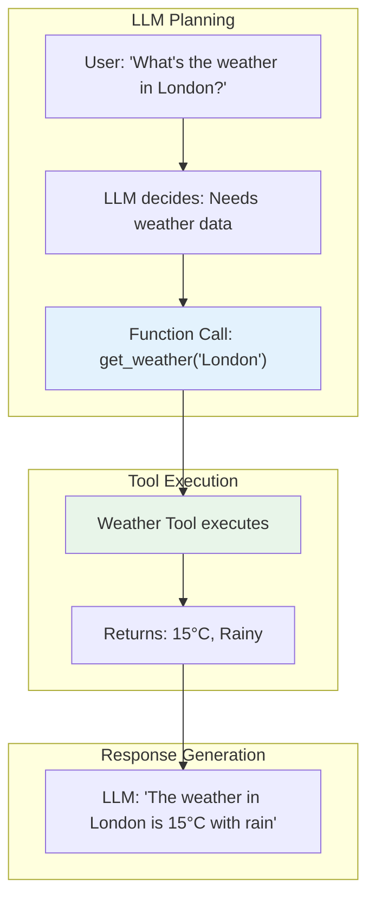

# Phase 3: AI Tool Use & Function Calling

> **Objective:** Move beyond chatting with LLMs by enabling them to interact with software and external systems.

---

# Part 9: Function Calling

**Giving LLMs superpowers—enabling them to call functions, execute code, and interact with the real world.**

---

## The Target: What We're Building Right Now

In this part, we're building six powerful tools:

1. **A Function Definition System** — Define tools with JSON schemas
2. **A Tool Execution Engine** — Execute functions called by the LLM
3. **A Weather Tool** — Get weather data for any location
4. **A Calculator Tool** — Perform mathematical calculations
5. **A SQL Query Tool** — Query databases safely
6. **An Email Sender Tool** — Send emails through the AI

**Why this matters:** LLMs are powerful, but they're trapped in a text-only world. Function calling breaks them out—letting them access data, perform actions, and integrate with your existing systems.

---

## The Concept: Giving LLMs Tools

### The Chef Analogy

Imagine you're a master chef who can create amazing recipes, but you can't actually cook. You need assistants to handle the physical tasks:

- **Assistant 1 (Weather Tool)** — Checks if it's raining so you plan indoor cooking
- **Assistant 2 (Calculator Tool)** — Scales recipes up and down
- **Assistant 3 (Database Tool)** — Looks up ingredient prices
- **Assistant 4 (Email Tool)** — Sends the final recipe to customers

**Function calling is the same.** The LLM (the chef) decides what needs to be done and calls the appropriate tools (assistants) to execute the work.



### What is Function Calling?

**Function calling** is a feature that allows LLMs to:

1. **Recognize** when a function needs to be called
2. **Generate** a properly formatted function call
3. **Parse** the function's response
4. **Incorporate** the result into the conversation

**Key benefits:**

| Benefit | Description | Impact |
|---------|-------------|--------|
| **Access to Data** | Connect to databases, APIs, files | Real-time information |
| **Actions** | Perform tasks (send email, book appointment) | Automation |
| **Computation** | Use tools for precise calculations | Accuracy |
| **Integration** | Connect to existing systems | Enterprise ready |
| **Validation** | Enforce structured inputs | Reliability |

### Function Calling Flow

```python
# 1. Define the functions
def get_weather(location: str) -> dict:
    # Fetch weather for location
    return {"temp": 22, "condition": "sunny"}

# 2. Define the tool schemas
tools = [
    {
        "type": "function",
        "function": {
            "name": "get_weather",
            "description": "Get current weather for a location",
            "parameters": {
                "type": "object",
                "properties": {
                    "location": {"type": "string"}
                },
                "required": ["location"]
            }
        }
    }
]

# 3. User asks a question
user_query = "What's the weather in Paris?"

# 4. LLM decides to call the function
# The LLM generates: {"name": "get_weather", "arguments": {"location": "Paris"}}

# 5. Execute the function
result = get_weather("Paris")

# 6. Return the result to the LLM
# The LLM generates a natural language response
```

---

## The Implementation: Building Our Function Calling Tools

### Target File Structure

```
phase-3-tool-use/
└── module-9-function-calling/
    ├── 01_function_definition.py
    ├── 02_tool_execution_engine.py
    ├── 03_weather_tool.py
    ├── 04_calculator_tool.py
    ├── 05_sql_query_tool.py
    ├── 06_email_sender_tool.py
    ├── requirements.txt
    └── README.md
```

### Step 1: Function Definition System

Create `01_function_definition.py`:

```python
#!/usr/bin/env python3
"""
Module 9: Function Definition System

Define functions and their schemas for LLM function calling.
"""

import os
import sys
from pathlib import Path
import json
from typing import Dict, Any, List, Optional, Callable
from dataclasses import dataclass, field
from enum import Enum

sys.path.insert(0, str(Path(__file__).parent.parent.parent.parent))

from shared.utils.config import load_config
from shared.utils.logging import setup_logging

setup_logging(debug=False)
config = load_config()

class ParameterType(Enum):
    """Parameter types for function schemas."""
    STRING = "string"
    NUMBER = "number"
    INTEGER = "integer"
    BOOLEAN = "boolean"
    ARRAY = "array"
    OBJECT = "object"

@dataclass
class Parameter:
    """A parameter definition for a function."""
    name: str
    type: ParameterType
    description: str = ""
    required: bool = False
    enum: Optional[List[Any]] = None
    default: Optional[Any] = None
    items: Optional[Dict[str, Any]] = None  # For array types
    properties: Optional[Dict[str, Any]] = None  # For object types

@dataclass
class FunctionDefinition:
    """A function definition for LLM tool calling."""
    name: str
    description: str
    parameters: List[Parameter] = field(default_factory=list)
    handler: Optional[Callable] = None
    
    def to_schema(self) -> Dict[str, Any]:
        """
        Convert the function definition to a JSON schema.
        
        Returns:
            JSON schema for function calling
        """
        properties = {}
        required = []
        
        for param in self.parameters:
            # Build property schema
            prop_schema = {
                "type": param.type.value,
                "description": param.description
            }
            
            # Add enum if provided
            if param.enum:
                prop_schema["enum"] = param.enum
            
            # Add default if provided
            if param.default is not None:
                prop_schema["default"] = param.default
            
            # Add items for arrays
            if param.type == ParameterType.ARRAY and param.items:
                prop_schema["items"] = param.items
            
            # Add properties for objects
            if param.type == ParameterType.OBJECT and param.properties:
                prop_schema["properties"] = param.properties
            
            properties[param.name] = prop_schema
            
            if param.required:
                required.append(param.name)
        
        return {
            "type": "function",
            "function": {
                "name": self.name,
                "description": self.description,
                "parameters": {
                    "type": "object",
                    "properties": properties,
                    "required": required
                }
            }
        }
    
    def validate_args(self, args: Dict[str, Any]) -> bool:
        """
        Validate arguments against the parameter schema.
        
        Args:
            args: Arguments to validate
            
        Returns:
            True if valid, raises ValueError if not
        """
        for param in self.parameters:
            if param.required and param.name not in args:
                raise ValueError(f"Missing required parameter: {param.name}")
            
            if param.name in args:
                value = args[param.name]
                
                # Type validation
                if param.type == ParameterType.STRING and not isinstance(value, str):
                    raise ValueError(f"Parameter {param.name} must be a string")
                elif param.type == ParameterType.INTEGER and not isinstance(value, int):
                    try:
                        args[param.name] = int(value)
                    except:
                        raise ValueError(f"Parameter {param.name} must be an integer")
                elif param.type == ParameterType.NUMBER and not isinstance(value, (int, float)):
                    try:
                        args[param.name] = float(value)
                    except:
                        raise ValueError(f"Parameter {param.name} must be a number")
                elif param.type == ParameterType.BOOLEAN and not isinstance(value, bool):
                    if value in ['true', 'True', '1', 'yes']:
                        args[param.name] = True
                    elif value in ['false', 'False', '0', 'no']:
                        args[param.name] = False
                    else:
                        raise ValueError(f"Parameter {param.name} must be a boolean")
                elif param.type == ParameterType.ARRAY and not isinstance(value, list):
                    raise ValueError(f"Parameter {param.name} must be an array")
                elif param.type == ParameterType.OBJECT and not isinstance(value, dict):
                    raise ValueError(f"Parameter {param.name} must be an object")
                
                # Enum validation
                if param.enum and args[param.name] not in param.enum:
                    raise ValueError(f"Parameter {param.name} must be one of {param.enum}")
        
        return True
    
    def execute(self, args: Dict[str, Any]) -> Any:
        """
        Execute the function with the given arguments.
        
        Args:
            args: Arguments for the function
            
        Returns:
            Function result
        """
        if not self.handler:
            raise ValueError(f"No handler defined for function: {self.name}")
        
        self.validate_args(args)
        return self.handler(**args)

class FunctionRegistry:
    """
    Registry for managing function definitions.
    
    Features:
    - Register and unregister functions
    - List available functions
    - Get function schemas
    - Execute functions
    """
    
    def __init__(self):
        """Initialize the function registry."""
        self.functions: Dict[str, FunctionDefinition] = {}
    
    def register(self, function: FunctionDefinition) -> None:
        """
        Register a function.
        
        Args:
            function: Function definition to register
        """
        self.functions[function.name] = function
        print(f"✅ Registered function: {function.name}")
    
    def register_multiple(self, functions: List[FunctionDefinition]) -> None:
        """
        Register multiple functions.
        
        Args:
            functions: List of function definitions
        """
        for function in functions:
            self.register(function)
    
    def unregister(self, name: str) -> None:
        """
        Unregister a function.
        
        Args:
            name: Name of the function
        """
        if name in self.functions:
            del self.functions[name]
            print(f"🗑️ Unregistered function: {name}")
    
    def get_function(self, name: str) -> Optional[FunctionDefinition]:
        """
        Get a function by name.
        
        Args:
            name: Name of the function
            
        Returns:
            Function definition or None
        """
        return self.functions.get(name)
    
    def get_schemas(self) -> List[Dict[str, Any]]:
        """
        Get all function schemas.
        
        Returns:
            List of function schemas
        """
        return [f.to_schema() for f in self.functions.values()]
    
    def execute(self, name: str, args: Dict[str, Any]) -> Any:
        """
        Execute a function by name.
        
        Args:
            name: Name of the function
            args: Arguments for the function
            
        Returns:
            Function result
        """
        function = self.get_function(name)
        if not function:
            raise ValueError(f"Function not found: {name}")
        
        return function.execute(args)
    
    def list_functions(self) -> List[str]:
        """
        List registered functions.
        
        Returns:
            List of function names
        """
        return list(self.functions.keys())

def demonstrate_function_registry():
    """Demonstrate the function registry."""
    print("\n" + "="*80)
    print("🔧 FUNCTION DEFINITION SYSTEM")
    print("="*80)
    
    # Create registry
    registry = FunctionRegistry()
    
    # Define a sample function
    def get_weather(location: str, unit: str = "celsius") -> dict:
        """Get weather for a location."""
        return {
            "location": location,
            "temperature": 22 if unit == "celsius" else 72,
            "condition": "sunny",
            "unit": unit
        }
    
    # Define the function
    weather_func = FunctionDefinition(
        name="get_weather",
        description="Get current weather for a location",
        parameters=[
            Parameter(
                name="location",
                type=ParameterType.STRING,
                description="City name or location",
                required=True
            ),
            Parameter(
                name="unit",
                type=ParameterType.STRING,
                description="Temperature unit",
                enum=["celsius", "fahrenheit"],
                default="celsius"
            )
        ],
        handler=get_weather
    )
    
    # Register the function
    registry.register(weather_func)
    
    # Show schemas
    print("\n📋 Function Schemas:")
    print("-"*40)
    schemas = registry.get_schemas()
    for schema in schemas:
        print(json.dumps(schema, indent=2))
    
    # Execute the function
    print("\n🔍 Executing Function:")
    print("-"*40)
    result = registry.execute("get_weather", {"location": "London"})
    print(f"Result: {json.dumps(result, indent=2)}")
    
    # Test validation
    print("\n✅ Validation:")
    print("-"*40)
    try:
        registry.execute("get_weather", {"location": "London", "unit": "kelvin"})
    except Exception as e:
        print(f"❌ Validation caught: {e}")

def main():
    """Run the function definition demonstration."""
    print("\n" + "="*80)
    print("AI TUTORIAL SERIES - FUNCTION DEFINITION SYSTEM")
    print("="*80)
    
    demonstrate_function_registry()

if __name__ == "__main__":
    main()
```

### Step 2: Tool Execution Engine

Create `02_tool_execution_engine.py`:

```python
#!/usr/bin/env python3
"""
Module 9: Tool Execution Engine

Execute function calls from LLMs with error handling and result processing.
"""

import os
import sys
from pathlib import Path
import json
from typing import Dict, Any, List, Optional, Union
from datetime import datetime

sys.path.insert(0, str(Path(__file__).parent.parent.parent.parent))

from shared.utils.config import load_config
from shared.utils.logging import setup_logging
from function_definition import FunctionRegistry, FunctionDefinition, Parameter, ParameterType
from multi_provider_client import Message, AIClientFactory, Provider

setup_logging(debug=False)
config = load_config()

class ToolExecutionEngine:
    """
    Execute tool calls from LLMs with full error handling.
    
    Features:
    - Function registry management
    - Argument parsing and validation
    - Sequential and parallel execution
    - Error handling and recovery
    - Result formatting
    """
    
    def __init__(self, provider: str = "openai", model: str = "gpt-4o-mini"):
        """
        Initialize the tool execution engine.
        
        Args:
            provider: Provider to use
            model: Model to use
        """
        self.provider = provider
        self.model = model
        self.registry = FunctionRegistry()
        self.client = AIClientFactory.create(provider)
        
        # Track execution history
        self.history = []
    
    def register_tool(self, function: FunctionDefinition) -> None:
        """
        Register a tool function.
        
        Args:
            function: Function definition to register
        """
        self.registry.register(function)
    
    def register_tools(self, functions: List[FunctionDefinition]) -> None:
        """
        Register multiple tools.
        
        Args:
            functions: List of function definitions
        """
        self.registry.register_multiple(functions)
    
    def get_tool_schemas(self) -> List[Dict[str, Any]]:
        """
        Get all tool schemas for the LLM.
        
        Returns:
            List of tool schemas
        """
        return self.registry.get_schemas()
    
    def process_tool_calls(
        self,
        tool_calls: List[Dict[str, Any]]
    ) -> List[Dict[str, Any]]:
        """
        Process tool calls from the LLM.
        
        Args:
            tool_calls: List of tool calls from the LLM
            
        Returns:
            List of tool execution results
        """
        results = []
        
        for tool_call in tool_calls:
            try:
                # Extract function name and arguments
                function_name = tool_call["function"]["name"]
                arguments = json.loads(tool_call["function"]["arguments"])
                
                # Execute the function
                result = self.registry.execute(function_name, arguments)
                
                results.append({
                    "tool_call_id": tool_call.get("id"),
                    "role": "tool",
                    "content": json.dumps(result),
                    "success": True
                })
                
                # Record history
                self.history.append({
                    "tool_call": tool_call,
                    "result": result,
                    "timestamp": datetime.now().isoformat()
                })
                
            except Exception as e:
                # Handle errors
                results.append({
                    "tool_call_id": tool_call.get("id"),
                    "role": "tool",
                    "content": json.dumps({"error": str(e)}),
                    "success": False
                })
                
                self.history.append({
                    "tool_call": tool_call,
                    "error": str(e),
                    "timestamp": datetime.now().isoformat()
                })
        
        return results
    
    def chat_with_tools(
        self,
        messages: List[Dict[str, str]],
        temperature: float = 0.7,
        max_tokens: int = 1000
    ) -> Dict[str, Any]:
        """
        Chat with tool support.
        
        Args:
            messages: List of messages
            temperature: Temperature
            max_tokens: Maximum tokens
            
        Returns:
            Response with tool calls if any
        """
        # Get tool schemas
        tools = self.get_tool_schemas()
        
        # Convert messages to Message objects
        msg_objects = [Message(**m) for m in messages]
        
        try:
            # Make the API call with tools
            # This is simplified - in a real implementation, you'd use the provider's tool-calling API
            response = self.client.chat(
                messages=msg_objects,
                model=self.model,
                temperature=temperature,
                max_tokens=max_tokens
            )
            
            # For demonstration, we'll simulate tool calls
            # In production, you'd parse the response for tool calls
            
            return {
                "success": True,
                "content": response.content,
                "tool_calls": [],  # Would be parsed from the response
                "usage": response.usage
            }
            
        except Exception as e:
            return {
                "success": False,
                "error": str(e)
            }
    
    def execute_tool_loop(
        self,
        user_query: str,
        max_iterations: int = 3
    ) -> Dict[str, Any]:
        """
        Execute a tool loop with the LLM.
        
        Args:
            user_query: User query
            max_iterations: Maximum tool iterations
            
        Returns:
            Final response
        """
        messages = [
            {"role": "system", "content": "You are a helpful assistant with access to tools."},
            {"role": "user", "content": user_query}
        ]
        
        iteration = 0
        
        while iteration < max_iterations:
            iteration += 1
            
            # Get response from LLM
            response = self.chat_with_tools(messages)
            
            if not response["success"]:
                return {
                    "success": False,
                    "error": response.get("error"),
                    "iterations": iteration
                }
            
            # Check for tool calls
            if not response.get("tool_calls"):
                # No more tools to call
                return {
                    "success": True,
                    "response": response["content"],
                    "iterations": iteration
                }
            
            # Process tool calls
            tool_results = self.process_tool_calls(response["tool_calls"])
            
            # Add tool results to messages
            messages.append({"role": "assistant", "content": response["content"]})
            for result in tool_results:
                messages.append(result)
        
        return {
            "success": False,
            "error": "Maximum iterations reached",
            "iterations": max_iterations
        }

def demonstrate_tool_execution():
    """Demonstrate the tool execution engine."""
    print("\n" + "="*80)
    print("⚙️ TOOL EXECUTION ENGINE DEMONSTRATION")
    print("="*80)
    
    # Create engine
    engine = ToolExecutionEngine()
    
    # Define a simple tool
    def calculate(expression: str) -> float:
        """Calculate a mathematical expression."""
        # Safe evaluation (in production, use a proper evaluator)
        try:
            return eval(expression, {"__builtins__": {}})
        except:
            raise ValueError(f"Invalid expression: {expression}")
    
    calc_func = FunctionDefinition(
        name="calculate",
        description="Calculate a mathematical expression",
        parameters=[
            Parameter(
                name="expression",
                type=ParameterType.STRING,
                description="Mathematical expression to evaluate",
                required=True
            )
        ],
        handler=calculate
    )
    
    # Register the tool
    engine.register_tool(calc_func)
    
    # Execute a tool call
    print("\n📋 Executing Tool Call:")
    print("-"*40)
    
    tool_calls = [
        {
            "id": "call_1",
            "function": {
                "name": "calculate",
                "arguments": json.dumps({"expression": "2 + 3 * 4"})
            }
        }
    ]
    
    results = engine.process_tool_calls(tool_calls)
    
    for result in results:
        print(f"Result: {result['content']}")
        print(f"Success: {result['success']}")
    
    # Show tool schemas
    print("\n📋 Tool Schemas:")
    print("-"*40)
    schemas = engine.get_tool_schemas()
    for schema in schemas:
        print(f"  • {schema['function']['name']}: {schema['function']['description']}")

def main():
    """Run the tool execution engine demonstration."""
    print("\n" + "="*80)
    print("AI TUTORIAL SERIES - TOOL EXECUTION ENGINE")
    print("="*80)
    
    demonstrate_tool_execution()

if __name__ == "__main__":
    main()
```

### Step 3: Weather Tool

Create `03_weather_tool.py`:

```python
#!/usr/bin/env python3
"""
Module 9: Weather Tool

Get weather data for locations using function calling.
"""

import os
import sys
from pathlib import Path
import json
import requests
from typing import Dict, Any, Optional
from datetime import datetime

sys.path.insert(0, str(Path(__file__).parent.parent.parent.parent))

from shared.utils.config import load_config
from shared.utils.logging import setup_logging
from function_definition import FunctionDefinition, Parameter, ParameterType
from tool_execution_engine import ToolExecutionEngine

setup_logging(debug=False)
config = load_config()

class WeatherTool:
    """
    Weather tool for function calling.
    
    Features:
    - Current weather for any location
    - Multiple temperature units
    - Weather conditions
    - Forecast (coming soon)
    """
    
    def __init__(self):
        """Initialize the weather tool."""
        self.api_key = config.get("openweather_api_key")
        self.base_url = "https://api.openweathermap.org/data/2.5/weather"
        
        # Create the function definition
        self.function = FunctionDefinition(
            name="get_weather",
            description="Get current weather for a location",
            parameters=[
                Parameter(
                    name="location",
                    type=ParameterType.STRING,
                    description="City name, e.g., 'London', 'New York', 'Tokyo'",
                    required=True
                ),
                Parameter(
                    name="unit",
                    type=ParameterType.STRING,
                    description="Temperature unit",
                    enum=["celsius", "fahrenheit"],
                    default="celsius"
                )
            ],
            handler=self.get_weather
        )
    
    def get_weather(self, location: str, unit: str = "celsius") -> Dict[str, Any]:
        """
        Get weather for a location.
        
        Args:
            location: City name
            unit: Temperature unit
            
        Returns:
            Weather data
        """
        try:
            # Check for API key
            if not self.api_key:
                # Fallback: simulated weather data
                return self._simulate_weather(location, unit)
            
            # Make API call
            params = {
                "q": location,
                "appid": self.api_key,
                "units": "metric" if unit == "celsius" else "imperial"
            }
            
            response = requests.get(self.base_url, params=params)
            response.raise_for_status()
            
            data = response.json()
            
            # Parse weather data
            weather = {
                "location": data["name"],
                "country": data["sys"]["country"],
                "temperature": data["main"]["temp"],
                "unit": unit,
                "condition": data["weather"][0]["description"],
                "humidity": data["main"]["humidity"],
                "wind_speed": data["wind"]["speed"],
                "feels_like": data["main"]["feels_like"],
                "timestamp": datetime.now().isoformat()
            }
            
            return weather
            
        except Exception as e:
            # Return simulated data on error
            return self._simulate_weather(location, unit, error=str(e))
    
    def _simulate_weather(self, location: str, unit: str, error: str = None) -> Dict[str, Any]:
        """
        Generate simulated weather data.
        
        Args:
            location: City name
            unit: Temperature unit
            error: Error message if any
            
        Returns:
            Simulated weather data
        """
        import random
        
        # Simulate realistic weather
        temp_celsius = random.randint(-5, 35)
        temp_fahrenheit = (temp_celsius * 9/5) + 32
        
        conditions = [
            "clear sky", "few clouds", "scattered clouds", "broken clouds",
            "light rain", "moderate rain", "heavy rain", "thunderstorm",
            "light snow", "heavy snow", "mist", "fog", "haze"
        ]
        
        weather = {
            "location": location,
            "country": "Unknown",
            "temperature": temp_celsius if unit == "celsius" else temp_fahrenheit,
            "unit": unit,
            "condition": random.choice(conditions),
            "humidity": random.randint(20, 90),
            "wind_speed": random.randint(0, 30),
            "feels_like": temp_celsius - random.randint(0, 5) if unit == "celsius" else temp_fahrenheit - random.randint(0, 10),
            "timestamp": datetime.now().isoformat(),
            "simulated": True
        }
        
        if error:
            weather["error"] = error
        
        return weather

def demonstrate_weather_tool():
    """Demonstrate the weather tool."""
    print("\n" + "="*80)
    print("🌤️ WEATHER TOOL DEMONSTRATION")
    print("="*80)
    
    # Create the weather tool
    weather = WeatherTool()
    
    # Create engine and register the tool
    engine = ToolExecutionEngine()
    engine.register_tool(weather.function)
    
    # Test the tool
    print("\n📋 Testing Weather Tool:")
    print("-"*40)
    
    test_cases = [
        {"location": "London", "unit": "celsius"},
        {"location": "New York", "unit": "fahrenheit"},
        {"location": "Tokyo", "unit": "celsius"}
    ]
    
    for case in test_cases:
        print(f"\n📍 Location: {case['location']} ({case['unit']})")
        result = weather.get_weather(case['location'], case['unit'])
        print(f"   Temperature: {result['temperature']}°{result['unit'][0].upper()}")
        print(f"   Condition: {result['condition']}")
        print(f"   Humidity: {result['humidity']}%")
        print(f"   Wind: {result['wind_speed']} m/s")
        if result.get('simulated'):
            print("   (Simulated data)")

def main():
    """Run the weather tool demonstration."""
    print("\n" + "="*80)
    print("AI TUTORIAL SERIES - WEATHER TOOL")
    print("="*80)
    
    demonstrate_weather_tool()

if __name__ == "__main__":
    main()
```

### Step 4: Calculator Tool

Create `04_calculator_tool.py`:

```python
#!/usr/bin/env python3
"""
Module 9: Calculator Tool

Perform mathematical calculations through function calling.
"""

import os
import sys
from pathlib import Path
import json
import math
import ast
import operator
from typing import Dict, Any, Union

sys.path.insert(0, str(Path(__file__).parent.parent.parent.parent))

from shared.utils.config import load_config
from shared.utils.logging import setup_logging
from function_definition import FunctionDefinition, Parameter, ParameterType
from tool_execution_engine import ToolExecutionEngine

setup_logging(debug=False)
config = load_config()

class CalculatorTool:
    """
    Calculator tool for function calling.
    
    Features:
    - Basic arithmetic (+, -, *, /)
    - Advanced operations (power, sqrt, trig, log)
    - Expression evaluation
    - Safe evaluation environment
    """
    
    def __init__(self):
        """Initialize the calculator tool."""
        # Safe operations
        self.safe_ops = {
            '+': operator.add,
            '-': operator.sub,
            '*': operator.mul,
            '/': operator.truediv,
            '**': operator.pow,
            '//': operator.floordiv,
            '%': operator.mod,
        }
        
        # Safe functions
        self.safe_funcs = {
            'abs': abs,
            'round': round,
            'min': min,
            'max': max,
            'sum': sum,
            'sqrt': math.sqrt,
            'sin': math.sin,
            'cos': math.cos,
            'tan': math.tan,
            'log': math.log,
            'log10': math.log10,
            'exp': math.exp,
            'pi': math.pi,
            'e': math.e,
        }
        
        # Create the function definition
        self.function = FunctionDefinition(
            name="calculate",
            description="Perform mathematical calculations",
            parameters=[
                Parameter(
                    name="expression",
                    type=ParameterType.STRING,
                    description="Mathematical expression to evaluate",
                    required=True
                ),
                Parameter(
                    name="precision",
                    type=ParameterType.INTEGER,
                    description="Number of decimal places to round to",
                    default=2
                )
            ],
            handler=self.calculate
        )
    
    def calculate(self, expression: str, precision: int = 2) -> Dict[str, Any]:
        """
        Calculate a mathematical expression.
        
        Args:
            expression: Mathematical expression
            precision: Rounding precision
            
        Returns:
            Calculation result
        """
        try:
            # Parse and evaluate safely
            result = self._safe_evaluate(expression)
            
            # Round to precision
            if isinstance(result, float):
                result = round(result, precision)
            
            return {
                "expression": expression,
                "result": result,
                "precision": precision,
                "success": True
            }
            
        except Exception as e:
            return {
                "expression": expression,
                "error": str(e),
                "success": False
            }
    
    def _safe_evaluate(self, expression: str) -> Union[int, float]:
        """
        Safely evaluate a mathematical expression.
        
        Args:
            expression: Expression to evaluate
            
        Returns:
            Evaluation result
        """
        # Clean the expression
        expr = expression.strip()
        
        # Replace common math functions
        for func in self.safe_funcs:
            expr = expr.replace(func, f"safe_funcs['{func}']")
        
        # Parse the expression
        tree = ast.parse(expr, mode='eval')
        
        # Check for unsafe operations
        self._check_safety(tree)
        
        # Compile and evaluate
        code = compile(tree, '<string>', 'eval')
        
        # Create safe environment
        safe_env = {
            '__builtins__': {},
            'safe_ops': self.safe_ops,
            'safe_funcs': self.safe_funcs,
        }
        
        return eval(code, safe_env)
    
    def _check_safety(self, node: ast.AST) -> None:
        """
        Check for unsafe operations in the AST.
        
        Args:
            node: AST node
            
        Raises:
            ValueError: If unsafe operation is found
        """
        # Check for unsafe nodes
        unsafe_types = (
            ast.Import, ast.ImportFrom, ast.Call, ast.Attribute,
            ast.ClassDef, ast.FunctionDef, ast.Global, ast.Nonlocal
        )
        
        if isinstance(node, unsafe_types):
            # Allow specific safe calls
            if isinstance(node, ast.Call):
                # Check if it's a safe function
                if hasattr(node.func, 'id'):
                    func_name = node.func.id
                    if func_name not in self.safe_funcs:
                        raise ValueError(f"Function '{func_name}' not allowed")
                elif hasattr(node.func, 'attr'):
                    attr = node.func.attr
                    if attr not in self.safe_ops:
                        raise ValueError(f"Attribute '{attr}' not allowed")
            else:
                raise ValueError(f"Unsafe operation: {type(node).__name__}")
        
        # Recursively check child nodes
        for child in ast.iter_child_nodes(node):
            self._check_safety(child)

def demonstrate_calculator_tool():
    """Demonstrate the calculator tool."""
    print("\n" + "="*80)
    print("🧮 CALCULATOR TOOL DEMONSTRATION")
    print("="*80)
    
    # Create the calculator tool
    calc = CalculatorTool()
    
    # Create engine and register the tool
    engine = ToolExecutionEngine()
    engine.register_tool(calc.function)
    
    # Test the tool
    print("\n📋 Testing Calculator Tool:")
    print("-"*40)
    
    test_expressions = [
        "2 + 3 * 4",
        "(5 + 3) * 2",
        "sqrt(16) + 4",
        "sin(pi/2)",
        "2 ** 10",
        "log10(1000)",
        "round(3.14159, 2)",
        "max(1, 5, 3, 9, 2)"
    ]
    
    for expr in test_expressions:
        print(f"\n📝 Expression: {expr}")
        result = calc.calculate(expr)
        if result["success"]:
            print(f"   Result: {result['result']}")
        else:
            print(f"   Error: {result['error']}")

def main():
    """Run the calculator tool demonstration."""
    print("\n" + "="*80)
    print("AI TUTORIAL SERIES - CALCULATOR TOOL")
    print("="*80)
    
    demonstrate_calculator_tool()

if __name__ == "__main__":
    main()
```

### Step 5: SQL Query Tool

Create `05_sql_query_tool.py`:

```python
#!/usr/bin/env python3
"""
Module 9: SQL Query Tool

Query databases safely through function calling.
"""

import os
import sys
from pathlib import Path
import json
import sqlite3
from typing import Dict, Any, List, Optional
from datetime import datetime

sys.path.insert(0, str(Path(__file__).parent.parent.parent.parent))

from shared.utils.config import load_config
from shared.utils.logging import setup_logging
from function_definition import FunctionDefinition, Parameter, ParameterType
from tool_execution_engine import ToolExecutionEngine

setup_logging(debug=False)
config = load_config()

class SQLQueryTool:
    """
    SQL query tool for function calling.
    
    Features:
    - Safe SQL execution
    - Query validation
    - Result formatting
    - Connection management
    """
    
    def __init__(self, db_path: Optional[str] = None):
        """
        Initialize the SQL query tool.
        
        Args:
            db_path: Path to the database file
        """
        self.db_path = db_path or "example.db"
        self.connection = None
        
        # Create the function definition
        self.function = FunctionDefinition(
            name="query_database",
            description="Execute a SQL query on the database",
            parameters=[
                Parameter(
                    name="query",
                    type=ParameterType.STRING,
                    description="SQL query to execute (SELECT, INSERT, UPDATE, DELETE)",
                    required=True
                ),
                Parameter(
                    name="limit",
                    type=ParameterType.INTEGER,
                    description="Maximum number of rows to return",
                    default=100
                )
            ],
            handler=self.execute_query
        )
        
        # Initialize database
        self._init_database()
    
    def _init_database(self) -> None:
        """Initialize the example database."""
        try:
            conn = self._get_connection()
            cursor = conn.cursor()
            
            # Create sample table
            cursor.execute('''
                CREATE TABLE IF NOT EXISTS users (
                    id INTEGER PRIMARY KEY AUTOINCREMENT,
                    name TEXT NOT NULL,
                    email TEXT UNIQUE NOT NULL,
                    age INTEGER,
                    city TEXT,
                    created_at TIMESTAMP DEFAULT CURRENT_TIMESTAMP
                )
            ''')
            
            # Insert sample data if empty
            cursor.execute("SELECT COUNT(*) FROM users")
            if cursor.fetchone()[0] == 0:
                sample_users = [
                    ("Alice Johnson", "alice@example.com", 28, "New York"),
                    ("Bob Smith", "bob@example.com", 35, "Los Angeles"),
                    ("Charlie Brown", "charlie@example.com", 42, "Chicago"),
                    ("Diana Prince", "diana@example.com", 31, "San Francisco"),
                    ("Eve Wilson", "eve@example.com", 26, "Boston")
                ]
                cursor.executemany(
                    "INSERT INTO users (name, email, age, city) VALUES (?, ?, ?, ?)",
                    sample_users
                )
            
            conn.commit()
            cursor.close()
            
        except Exception as e:
            print(f"⚠️ Database init error: {e}")
    
    def _get_connection(self) -> sqlite3.Connection:
        """
        Get a database connection.
        
        Returns:
            SQLite connection
        """
        if self.connection is None:
            self.connection = sqlite3.connect(self.db_path)
            self.connection.row_factory = sqlite3.Row
        return self.connection
    
    def execute_query(self, query: str, limit: int = 100) -> Dict[str, Any]:
        """
        Execute a SQL query.
        
        Args:
            query: SQL query
            limit: Maximum rows to return
            
        Returns:
            Query results
        """
        try:
            # Validate query (basic safety)
            query_lower = query.lower().strip()
            
            # Only allow certain operations
            allowed_ops = ['select', 'insert', 'update', 'delete', 'create', 'alter', 'drop']
            if not any(query_lower.startswith(op) for op in allowed_ops):
                return {
                    "success": False,
                    "error": f"Query must start with one of: {', '.join(allowed_ops)}"
                }
            
            # Block dangerous operations
            dangerous = ['drop database', 'truncate', 'alter table']
            if any(danger in query_lower for danger in dangerous):
                return {
                    "success": False,
                    "error": "Dangerous operation blocked"
                }
            
            # Add limit to SELECT queries if not present
            if query_lower.startswith('select') and 'limit' not in query_lower:
                query = f"{query} LIMIT {limit}"
            
            # Execute the query
            conn = self._get_connection()
            cursor = conn.cursor()
            cursor.execute(query)
            
            # Handle different query types
            if query_lower.startswith('select'):
                rows = cursor.fetchall()
                results = [dict(row) for row in rows]
                
                return {
                    "success": True,
                    "results": results,
                    "row_count": len(results),
                    "limit": limit,
                    "query": query
                }
            else:
                # INSERT, UPDATE, DELETE
                conn.commit()
                affected = cursor.rowcount
                cursor.close()
                
                return {
                    "success": True,
                    "affected_rows": affected,
                    "query": query
                }
            
        except Exception as e:
            return {
                "success": False,
                "error": str(e),
                "query": query
            }
    
    def get_table_schema(self, table_name: str) -> Dict[str, Any]:
        """
        Get the schema of a table.
        
        Args:
            table_name: Name of the table
            
        Returns:
            Table schema
        """
        try:
            conn = self._get_connection()
            cursor = conn.cursor()
            
            cursor.execute(f"PRAGMA table_info({table_name})")
            columns = cursor.fetchall()
            
            return {
                "success": True,
                "table": table_name,
                "columns": [dict(col) for col in columns]
            }
            
        except Exception as e:
            return {
                "success": False,
                "error": str(e)
            }

def demonstrate_sql_query_tool():
    """Demonstrate the SQL query tool."""
    print("\n" + "="*80)
    print("🗄️ SQL QUERY TOOL DEMONSTRATION")
    print("="*80)
    
    # Create the SQL tool
    sql = SQLQueryTool()
    
    # Create engine and register the tool
    engine = ToolExecutionEngine()
    engine.register_tool(sql.function)
    
    # Test the tool
    print("\n📋 Testing SQL Query Tool:")
    print("-"*40)
    
    # Test SELECT query
    result = sql.execute_query("SELECT * FROM users")
    if result["success"]:
        print(f"\n✅ SELECT query successful:")
        print(f"   Row count: {result['row_count']}")
        for row in result["results"]:
            print(f"   • {row['name']} ({row['age']}) - {row['city']}")
    
    # Test parameterized query
    result = sql.execute_query("SELECT * FROM users WHERE age > 30")
    if result["success"]:
        print(f"\n✅ Parameterized query successful:")
        print(f"   Row count: {result['row_count']}")
        for row in result["results"]:
            print(f"   • {row['name']} ({row['age']}) - {row['city']}")
    
    # Test INSERT
    result = sql.execute_query(
        "INSERT INTO users (name, email, age, city) VALUES ('Frank Miller', 'frank@example.com', 37, 'Miami')"
    )
    if result["success"]:
        print(f"\n✅ INSERT successful:")
        print(f"   Affected rows: {result['affected_rows']}")
    
    # Show table schema
    schema = sql.get_table_schema("users")
    if schema["success"]:
        print(f"\n📊 Table Schema:")
        for col in schema["columns"]:
            print(f"   • {col['name']}: {col['type']}")

def main():
    """Run the SQL query tool demonstration."""
    print("\n" + "="*80)
    print("AI TUTORIAL SERIES - SQL QUERY TOOL")
    print("="*80)
    
    demonstrate_sql_query_tool()

if __name__ == "__main__":
    main()
```

### Step 6: Email Sender Tool

Create `06_email_sender_tool.py`:

```python
#!/usr/bin/env python3
"""
Module 9: Email Sender Tool

Send emails through function calling.
"""

import os
import sys
from pathlib import Path
import json
import smtplib
from email.mime.text import MIMEText
from email.mime.multipart import MIMEMultipart
from typing import Dict, Any, List, Optional
from datetime import datetime

sys.path.insert(0, str(Path(__file__).parent.parent.parent.parent))

from shared.utils.config import load_config
from shared.utils.logging import setup_logging
from function_definition import FunctionDefinition, Parameter, ParameterType
from tool_execution_engine import ToolExecutionEngine

setup_logging(debug=False)
config = load_config()

class EmailSenderTool:
    """
    Email sender tool for function calling.
    
    Features:
    - Send emails via SMTP
    - Support for multiple recipients
    - CC and BCC support
    - HTML and plain text
    - Attachments (coming soon)
    """
    
    def __init__(self):
        """Initialize the email sender tool."""
        # Email configuration
        self.smtp_host = config.get("smtp_host", "smtp.gmail.com")
        self.smtp_port = int(config.get("smtp_port", 587))
        self.smtp_user = config.get("smtp_user")
        self.smtp_password = config.get("smtp_password")
        self.from_email = config.get("from_email", self.smtp_user)
        
        # Create the function definition
        self.function = FunctionDefinition(
            name="send_email",
            description="Send an email to one or more recipients",
            parameters=[
                Parameter(
                    name="to",
                    type=ParameterType.ARRAY,
                    description="List of recipient email addresses",
                    required=True,
                    items={"type": "string", "format": "email"}
                ),
                Parameter(
                    name="subject",
                    type=ParameterType.STRING,
                    description="Email subject line",
                    required=True
                ),
                Parameter(
                    name="body",
                    type=ParameterType.STRING,
                    description="Email body content",
                    required=True
                ),
                Parameter(
                    name="cc",
                    type=ParameterType.ARRAY,
                    description="List of CC recipients",
                    items={"type": "string", "format": "email"},
                    default=[]
                ),
                Parameter(
                    name="bcc",
                    type=ParameterType.ARRAY,
                    description="List of BCC recipients",
                    items={"type": "string", "format": "email"},
                    default=[]
                ),
                Parameter(
                    name="is_html",
                    type=ParameterType.BOOLEAN,
                    description="Whether the body is HTML",
                    default=False
                )
            ],
            handler=self.send_email
        )
    
    def send_email(
        self,
        to: List[str],
        subject: str,
        body: str,
        cc: List[str] = None,
        bcc: List[str] = None,
        is_html: bool = False
    ) -> Dict[str, Any]:
        """
        Send an email.
        
        Args:
            to: List of recipients
            subject: Email subject
            body: Email body
            cc: List of CC recipients
            bcc: List of BCC recipients
            is_html: Whether body is HTML
            
        Returns:
            Email sending result
        """
        try:
            # Validate configuration
            if not self.smtp_user or not self.smtp_password:
                return {
                    "success": False,
                    "error": "SMTP configuration missing. Set SMTP_USER and SMTP_PASSWORD"
                }
            
            # Create message
            msg = MIMEMultipart()
            msg["From"] = self.from_email
            msg["To"] = ", ".join(to)
            msg["Subject"] = subject
            
            if cc:
                msg["Cc"] = ", ".join(cc)
            
            # Add body
            if is_html:
                msg.attach(MIMEText(body, "html"))
            else:
                msg.attach(MIMEText(body, "plain"))
            
            # Combine all recipients
            all_recipients = to.copy()
            if cc:
                all_recipients.extend(cc)
            if bcc:
                all_recipients.extend(bcc)
            
            # Connect and send
            with smtplib.SMTP(self.smtp_host, self.smtp_port) as server:
                server.starttls()
                server.login(self.smtp_user, self.smtp_password)
                server.sendmail(self.from_email, all_recipients, msg.as_string())
            
            return {
                "success": True,
                "to": to,
                "cc": cc or [],
                "bcc": bcc or [],
                "subject": subject,
                "timestamp": datetime.now().isoformat()
            }
            
        except Exception as e:
            return {
                "success": False,
                "error": str(e)
            }
    
    def send_test_email(self, test_email: str = None) -> Dict[str, Any]:
        """
        Send a test email.
        
        Args:
            test_email: Email to send the test to
            
        Returns:
            Test result
        """
        to = [test_email or self.from_email or "test@example.com"]
        
        return self.send_email(
            to=to,
            subject="Test Email from AI Assistant",
            body="This is a test email sent from the AI assistant.\n\nIf you're reading this, the email tool is working properly!",
            is_html=False
        )

def demonstrate_email_sender():
    """Demonstrate the email sender tool."""
    print("\n" + "="*80)
    print("📧 EMAIL SENDER TOOL DEMONSTRATION")
    print("="*80)
    
    # Check for SMTP configuration
    smtp_user = config.get("smtp_user")
    smtp_password = config.get("smtp_password")
    
    if not smtp_user or not smtp_password:
        print("\n⚠️ SMTP configuration not found. Set SMTP_USER and SMTP_PASSWORD in .env")
        print("   Email sending will be simulated.")
        
        print("\n📋 Example Configuration:")
        print("   SMTP_HOST=smtp.gmail.com")
        print("   SMTP_PORT=587")
        print("   SMTP_USER=your_email@gmail.com")
        print("   SMTP_PASSWORD=your_app_password")
        print("   FROM_EMAIL=your_email@gmail.com")
    
    # Create the email tool
    email = EmailSenderTool()
    
    # Create engine and register the tool
    engine = ToolExecutionEngine()
    engine.register_tool(email.function)
    
    # Test the tool
    print("\n📋 Testing Email Tool:")
    print("-"*40)
    
    # Show the function schema
    print("\n🔧 Function Schema:")
    print(json.dumps(email.function.to_schema(), indent=2))
    
    # Simulate a send
    result = email.send_email(
        to=["test@example.com"],
        subject="Test Email",
        body="This is a test email sent from the AI assistant.",
        cc=["cc@example.com"],
        is_html=False
    )
    
    if result["success"]:
        print(f"\n✅ Email sent successfully!")
        print(f"   To: {result['to']}")
        print(f"   CC: {result['cc']}")
        print(f"   Subject: {result['subject']}")
        print(f"   Timestamp: {result['timestamp']}")
    else:
        print(f"\n❌ Email failed: {result.get('error')}")

def main():
    """Run the email sender tool demonstration."""
    print("\n" + "="*80)
    print("AI TUTORIAL SERIES - EMAIL SENDER TOOL")
    print("="*80)
    
    demonstrate_email_sender()

if __name__ == "__main__":
    main()
```

---

## The Verification: Testing Your Implementation

### Step 1: Install Dependencies

Create `requirements.txt`:

```txt
# Module 9 dependencies
openai>=1.0.0
anthropic>=0.18.0
requests>=2.31.0
python-dotenv>=1.0.0
```

Install them:

```bash
cd ~/ai-tutorial-series/phase-3-tool-use/module-9-function-calling
pip install -r requirements.txt
```

### Step 2: Test the Function Definition System

```bash
python 01_function_definition.py
```

**Expected Output:**
- Function registration
- Schema generation
- Argument validation
- Function execution

### Step 3: Test the Tool Execution Engine

```bash
python 02_tool_execution_engine.py
```

**Expected Output:**
- Tool registration
- Tool execution
- Error handling
- Tool schemas

### Step 4: Test the Weather Tool

```bash
python 03_weather_tool.py
```

**Expected Output:**
- Weather data for multiple locations
- Temperature conversion
- Weather conditions
- Simulated data if no API key

### Step 5: Test the Calculator Tool

```bash
python 04_calculator_tool.py
```

**Expected Output:**
- Mathematical expressions evaluated
- Safe evaluation environment
- Error handling for invalid expressions
- Precision control

### Step 6: Test the SQL Query Tool

```bash
python 05_sql_query_tool.py
```

**Expected Output:**
- Database creation
- Sample data insertion
- SELECT queries with results
- INSERT/UPDATE/DELETE operations
- Table schema inspection

### Step 7: Test the Email Sender Tool

```bash
python 06_email_sender_tool.py
```

**Expected Output:**
- Email tool schema
- Test email configuration
- Simulated email sending
- Email validation

---

## Key Takeaways

By completing this module, you've:

✅ **Built a function definition system** with JSON schemas
✅ **Created a tool execution engine** with error handling
✅ **Implemented a weather tool** with API integration
✅ **Built a calculator tool** with safe evaluation
✅ **Created a SQL query tool** with safety features
✅ **Implemented an email sender tool** with SMTP

### The Mental Model to Carry Forward

```
┌─────────────────────────────────────────────────────────────────┐
│               FUNCTION CALLING MENTAL MODEL                    │
├─────────────────────────────────────────────────────────────────┤
│                                                                 │
│  1. Function calling gives LLMs real-world capabilities       │
│  2. Functions are defined with JSON schemas                   │
│  3. LLMs generate function calls based on user queries        │
│  4. Tools execute functions and return results                │
│  5. Results are incorporated into the conversation             │
│  6. Error handling is crucial for reliability                 │
│  7. Tools can be combined for complex tasks                   │
│  8. Safety and validation protect your systems                │
│                                                                 │
└─────────────────────────────────────────────────────────────────┘
```

### Function Calling Best Practices

| Practice | Why | How |
|----------|-----|-----|
| **Define Clear Schemas** | LLMs need precise descriptions | Use detailed parameter descriptions |
| **Validate Arguments** | Prevents errors | Check types, ranges, enums |
| **Handle Errors Gracefully** | Prevents crashes | Try/except with fallbacks |
| **Return Structured Data** | LLM can use it effectively | Use JSON responses |
| **Limit Tool Access** | Security | Use permissions and validation |
| **Monitor Usage** | Cost control | Track token usage |
| **Test Thoroughly** | Reliability | Test with various inputs |

---

## What's Next

**In Part 10: Tool Orchestration**, you'll learn:
- Managing multiple tools
- Sequential and parallel execution
- Error recovery strategies
- Tool retries and timeouts
- Building complex workflows
