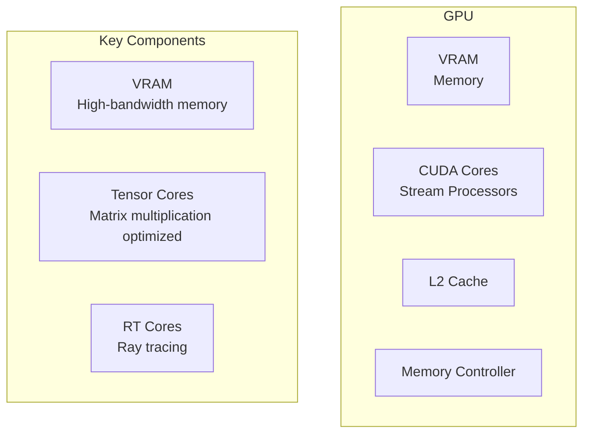

# AI Tutorial Series: Developer Edition
# Primer 2: AI Hardware & Infrastructure

**Understanding the hardware and infrastructure that powers AI—from GPUs to cloud platforms, and how to choose what you need.**

---

## Table of Contents

1. [Introduction](#introduction)
2. [CPUs vs. GPUs vs. TPUs](#cpus-vs-gpus-vs-tpus)
3. [GPU Architecture](#gpu-architecture)
4. [Memory & Storage](#memory--storage)
5. [Cloud Platforms](#cloud-platforms)
6. [Local vs. Cloud](#local-vs-cloud)
7. [Cost Optimization](#cost-optimization)
8. [Quick Reference](#quick-reference)

---

## Introduction

### Why Hardware Matters

The hardware you choose affects:
- **Training speed** — How fast models learn
- **Inference speed** — How fast responses are
- **Cost** — Hardware and cloud bills
- **Capabilities** — What models you can run
- **Scalability** — How many users you can serve

### The Hardware Hierarchy

```mermaid
graph TB
    subgraph "Consumer"
        CPU["CPU<br>General Purpose"]
        GPU["GPU<br>Parallel Processing"]
    end
    
    subgraph "Professional"
        DG["Data Center GPU<br>High Performance"]
        TPU["TPU<br>Custom AI Chip"]
    end
    
    subgraph "Cloud"
        Cloud["Cloud Platforms<br>AWS, GCP, Azure"]
        Managed["Managed Services<br>No Hardware Management"]
    end
    
    CPU --> GPU
    GPU --> DG
    DG --> TPU
    DG --> Cloud
    Cloud --> Managed
```

---

## CPUs vs. GPUs vs. TPUs

### CPU (Central Processing Unit)

**The Generalist**

CPUs are designed for general-purpose computing with:
- Few powerful cores (4-64)
- High clock speeds (3-5 GHz)
- Complex instruction sets
- Excellent for sequential tasks

**When to use CPUs for AI:**
- Small models (under 1B parameters)
- Inference for small workloads
- Development and testing
- Simple batch processing
- When GPUs aren't available

**Examples:**
- Intel Xeon, AMD EPYC
- AWS EC2 compute-optimized instances
- Google Cloud N2 instances

### GPU (Graphics Processing Unit)

**The Parallel Processor**

GPUs are designed for massive parallel computation:
- Thousands of smaller cores
- High memory bandwidth
- Optimized for matrix operations
- Perfect for neural networks

**When to use GPUs for AI:**
- Training large models
- Inference at scale
- Batch processing
- Real-time applications
- Any intensive AI workload

**Examples:**
- NVIDIA A100, H100, V100
- NVIDIA RTX 4090, A6000
- AWS EC2 G4, G5, P4 instances
- Google Cloud A2, G2 instances

### TPU (Tensor Processing Unit)

**The AI Specialist**

Google's custom AI chips designed specifically for neural networks:
- Optimized for matrix multiplication
- Very high throughput
- Excellent for training
- TensorFlow/PyTorch optimized

**When to use TPUs:**
- Large-scale training
- When using Google Cloud
- TensorFlow workloads
- Batch inference

**Examples:**
- Google Cloud TPU v2-v5e
- Google Cloud TPU Pods

---

## GPU Architecture

### Anatomy of a GPU



### Key GPU Specifications

| Specification | What It Means | Why It Matters |
|---------------|---------------|----------------|
| **CUDA Cores** | Number of processing units | More = faster computation |
| **VRAM** | Video memory capacity | Determines max model size |
| **Memory Bandwidth** | Speed of memory access | Affects speed of large models |
| **Tensor Cores** | Specialized matrix units | Faster training/inference |
| **FP16/FP32** | Floating point precision | Tradeoff speed vs accuracy |

### VRAM Requirements by Model Size

| Model Size | VRAM Required | Example Models |
|------------|---------------|----------------|
| **< 1B** | 2-4 GB | Small BERT, DistilBERT |
| **1B-7B** | 8-24 GB | Llama 7B, Mistral 7B |
| **7B-13B** | 24-48 GB | Llama 13B, Falcon |
| **13B-70B** | 48-200 GB | Llama 70B, GPT-3 |
| **> 70B** | 200+ GB | GPT-4, Claude |

### Quantization for Memory Reduction

**Quantization** reduces the precision of model weights to save memory.

| Precision | Memory Saved | Quality Impact |
|-----------|--------------|----------------|
| **FP32** | 1x (baseline) | Full quality |
| **FP16** | 2x | Minor impact |
| **INT8** | 4x | Small impact |
| **INT4** | 8x | Medium impact |

```python
# Example: Loading a model with quantization (Hugging Face)
from transformers import AutoModelForCausalLM, AutoTokenizer

model = AutoModelForCausalLM.from_pretrained(
    "meta-llama/Llama-2-7b-hf",
    load_in_8bit=True,  # INT8 quantization
    device_map="auto"
)
```

---

## Memory & Storage

### Types of Memory

| Type | Speed | Capacity | Use in AI |
|------|-------|----------|-----------|
| **VRAM** | Very Fast | Limited (8-80GB) | Model weights, activations |
| **RAM** | Fast | Moderate (16-512GB) | Data loading, preprocessing |
| **SSD** | Moderate | Large (1-4TB) | Dataset storage |
| **HDD** | Slow | Very Large | Archival storage |

### Model Loading Patterns

**1. Full Loading**
```python
# Load entire model into memory
model = AutoModel.from_pretrained("model_name")
```

**2. Layer-by-Layer**
```python
# Load layers as needed
for layer in model.layers:
    process(layer)
    del layer  # Free memory
```

**3. Offloading**
```python
# Load only what's needed
model = AutoModel.from_pretrained("model_name", device_map="auto")
# Automatically distributes across GPU/CPU
```

---

## Cloud Platforms

### AWS (Amazon Web Services)

**Key AI Services:**

| Service | Purpose | Best For |
|---------|---------|----------|
| **SageMaker** | ML Platform | Full ML lifecycle |
| **EC2 (GPU)** | Virtual Machines | Custom infrastructure |
| **Bedrock** | Managed LLMs | LLM API access |
| **Lambda** | Serverless | Event-driven AI |

**Popular GPU Instances:**

| Instance | GPU | VRAM | Use Case |
|----------|-----|------|----------|
| **g4dn.xlarge** | NVIDIA T4 | 16GB | Inference, small models |
| **g5.xlarge** | NVIDIA A10G | 24GB | Training, inference |
| **p4d.24xlarge** | NVIDIA A100 | 40GB × 8 | Large-scale training |

### GCP (Google Cloud)

**Key AI Services:**

| Service | Purpose | Best For |
|---------|---------|----------|
| **Vertex AI** | ML Platform | Full ML lifecycle |
| **Compute Engine (GPU)** | VMs | Custom infrastructure |
| **TPU** | AI Chips | Large-scale training |
| **Cloud AI** | Managed AI | Pre-trained models |

**Popular GPU/TPU Instances:**

| Instance | Accelerator | Use Case |
|----------|-------------|----------|
| **n1-standard-8** | NVIDIA V100 | General AI |
| **a2-highgpu-1g** | NVIDIA A100 | Large models |
| **tpu-v4** | TPU v4 | Large-scale training |

### Azure (Microsoft)

**Key AI Services:**

| Service | Purpose | Best For |
|---------|---------|----------|
| **Azure Machine Learning** | ML Platform | Full ML lifecycle |
| **OpenAI Service** | GPT Access | Managed LLMs |
| **Virtual Machines** | Custom VMs | Infrastructure |

**Popular GPU Instances:**

| Instance | GPU | Use Case |
|----------|-----|----------|
| **Standard_NC6** | NVIDIA K80 | Small models |
| **Standard_NC24** | NVIDIA V100 | Training |
| **Standard_NC24rs_v3** | NVIDIA V100 | Large models |

### Serverless AI Platforms

| Platform | Purpose | Best For |
|----------|---------|----------|
| **Replicate** | Model hosting | Easy deployment |
| **Hugging Face Inference** | Model hosting | Open models |
| **Banana** | GPU serverless | Cost-effective inference |
| **Modal** | GPU compute | Dynamic workloads |

---

## Local vs. Cloud

### Local Development

**Pros:**
- No cloud costs during development
- Full control over hardware
- Immediate feedback
- Privacy (data stays local)

**Cons:**
- Limited by hardware
- Upfront costs for hardware
- Limited scalability
- Maintenance overhead

**Recommended Setup:**
```yaml
# Minimal Local Setup
CPU: 8+ cores
RAM: 32GB+
Storage: 1TB SSD
GPU: NVIDIA RTX 4060+ (8GB+)
```

### Cloud Development

**Pros:**
- Unlimited scalability
- No upfront costs
- Access to latest hardware
- Managed services reduce overhead

**Cons:**
- Ongoing costs
- Data privacy concerns
- Network latency
- Vendor lock-in

**Recommended Setup:**
```yaml
# Typical Cloud Setup
Provider: AWS, GCP, or Azure
Instance: g4dn.xlarge (T4 GPU) or equivalent
Storage: S3/GCS/Blob Storage
Orchestration: Kubernetes or managed service
```

---

## Cost Optimization

### Cost Saving Strategies

**1. Use Spot/Preemptible Instances**
```bash
# AWS Spot Instance
# 60-90% cheaper than on-demand

# GCP Preemptible Instance
# 60-80% cheaper than on-demand
```

**2. Auto-scaling**
```yaml
# Kubernetes HPA
apiVersion: autoscaling/v2
kind: HorizontalPodAutoscaler
spec:
  minReplicas: 0  # Scale to zero when idle
  maxReplicas: 10
```

**3. Right-Size Instances**
```bash
# Choose the smallest instance that works
# Monitor utilization and adjust

# Example: g4dn.xlarge vs g5.xlarge
# 1 T4 vs 1 A10G - 50-100% faster
```

**4. Use Serverless for Sporadic Workloads**
```yaml
# Serverless architecture
lambda:
  timeout: 300  # 5 minutes max
  memorySize: 10240  # 10GB RAM
  # Pay only when used
```

**5. Model Optimization**
```python
# Use smaller models when possible
model = "gpt-4o-mini"  # 20x cheaper than gpt-4o

# Use quantization
model = load_in_8bit(model)

# Cache responses
if query in cache:
    return cache[query]
```

### Cost Comparison

| Workload | Local Cost | Cloud Cost (monthly) |
|----------|------------|---------------------|
| **Development** | $2,000 (one-time) | $200-500 |
| **Training** | $5,000 (hardware) | $1,000-10,000 |
| **Small Inference** | Free (local) | $50-200 |
| **Large Inference** | $10,000 (hardware) | $500-5,000 |

---

## Quick Reference

### Hardware Checklist

| Question | Check |
|----------|-------|
| Do you need to train? | GPU with 16GB+ VRAM |
| Do you need inference? | GPU with 8GB+ VRAM |
| Do you need to handle many users? | Scale horizontally |
| Do you have budget constraints? | Consider cloud spot instances |

### Instance Selection Guide

| Workload | AWS | GCP | Azure |
|----------|-----|-----|-------|
| **Small Inference** | g4dn.xlarge | n1-standard-8 | Standard_NC6 |
| **Large Inference** | g5.12xlarge | a2-highgpu-1g | Standard_NC24 |
| **Training** | p4d.24xlarge | tpu-v4 | Standard_NC24rs_v3 |

### Memory Requirements

| Model | Training VRAM | Inference VRAM |
|-------|---------------|----------------|
| **BERT-base** | 8-16 GB | 4-8 GB |
| **GPT-2** | 8-16 GB | 4-8 GB |
| **Llama 7B** | 48-80 GB | 16-24 GB |
| **Llama 13B** | 80-160 GB | 24-48 GB |
| **GPT-4** | 500+ GB | 200+ GB |

---

**End of Primer 2**
