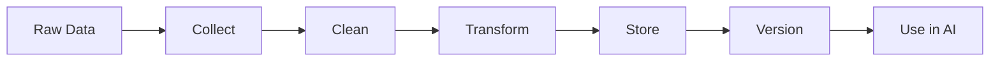

# AI Tutorial Series: Developer Edition
# Primer 3: Data Engineering for AI

**A practical guide to data preparation, management, and pipelines for AI applications—from raw data to production-ready datasets.**

---

## Table of Contents

1. [Introduction](#introduction)
2. [Data Sources & Types](#data-sources--types)
3. [Data Collection](#data-collection)
4. [Data Cleaning & Preprocessing](#data-cleaning--preprocessing)
5. [Data Transformation](#data-transformation)
6. [Data Storage](#data-storage)
7. [Data Pipelines](#data-pipelines)
8. [Data Quality & Monitoring](#data-quality--monitoring)
9. [Quick Reference](#quick-reference)

---

## Introduction

### Why Data Engineering Matters for AI

The quality of your AI system depends entirely on the quality of your data. Data engineering is the foundation:

- **Garbage in, garbage out** — Bad data = bad models
- **Scale matters** — More data (usually) = better models
- **Structure matters** — Organization affects usability
- **Pipeline matters** — Automation ensures consistency

### The Data Pipeline



---

## Data Sources & Types

### Common Data Sources

| Source Type | Examples | Format | Use Case |
|-------------|----------|--------|----------|
| **APIs** | Twitter, News APIs | JSON, XML | Real-time data |
| **Databases** | SQL, NoSQL | Tables, Documents | Structured data |
| **Files** | CSV, JSON, Parquet | Flat files | Batch processing |
| **Web** | Scraping, PDFs | HTML, Text | Unstructured data |
| **Streaming** | Kafka, WebSockets | Events | Real-time AI |
| **User** | Logs, Feedback | Various | Personalization |

### Data Types

| Type | Description | Examples |
|------|-------------|----------|
| **Structured** | Tabular, schema-defined | SQL databases, CSVs |
| **Semi-structured** | Flexible schema | JSON, XML, Parquet |
| **Unstructured** | No fixed format | Text, images, audio |
| **Time-series** | Timestamped data | Logs, sensor data |

---

## Data Collection

### Collecting Data

**1. API Collection**

```python
import requests
import time
from typing import List, Dict

class APICollector:
    def __init__(self, base_url: str, api_key: str):
        self.base_url = base_url
        self.api_key = api_key
        self.session = requests.Session()
        self.session.headers.update({"Authorization": f"Bearer {api_key}"})
    
    def collect(self, endpoint: str, params: Dict = None) -> List[Dict]:
        response = self.session.get(f"{self.base_url}/{endpoint}", params=params)
        response.raise_for_status()
        return response.json()
    
    def collect_with_pagination(self, endpoint: str, params: Dict = None) -> List[Dict]:
        all_data = []
        page = 1
        
        while True:
            params = params or {}
            params["page"] = page
            data = self.collect(endpoint, params)
            
            if not data:
                break
            
            all_data.extend(data)
            page += 1
            
            # Rate limit
            time.sleep(0.1)
        
        return all_data
```

**2. Web Scraping**

```python
from bs4 import BeautifulSoup
import requests
from typing import List, Dict

class WebScraper:
    def __init__(self):
        self.session = requests.Session()
        self.session.headers.update({
            "User-Agent": "Mozilla/5.0 (compatible; AIBot/1.0)"
        })
    
    def scrape_page(self, url: str) -> Dict:
        response = self.session.get(url)
        response.raise_for_status()
        
        soup = BeautifulSoup(response.text, "html.parser")
        
        return {
            "title": soup.title.string if soup.title else None,
            "text": soup.get_text(),
            "links": [a.get("href") for a in soup.find_all("a")],
            "images": [img.get("src") for img in soup.find_all("img")]
        }
    
    def scrape_site(self, base_url: str, max_pages: int = 100) -> List[Dict]:
        pages = []
        visited = set()
        queue = [base_url]
        
        while queue and len(pages) < max_pages:
            url = queue.pop()
            if url in visited:
                continue
            
            visited.add(url)
            page_data = self.scrape_page(url)
            pages.append(page_data)
            
            # Add links to queue
            for link in page_data["links"]:
                if link and link.startswith(base_url) and link not in visited:
                    queue.append(link)
        
        return pages
```

**3. File Collection**

```python
import pandas as pd
import json
from pathlib import Path
from typing import List, Dict

class FileCollector:
    @staticmethod
    def read_csv(file_path: str) -> pd.DataFrame:
        return pd.read_csv(file_path)
    
    @staticmethod
    def read_json(file_path: str) -> Dict:
        with open(file_path, 'r') as f:
            return json.load(f)
    
    @staticmethod
    def read_jsonl(file_path: str) -> List[Dict]:
        data = []
        with open(file_path, 'r') as f:
            for line in f:
                data.append(json.loads(line))
        return data
    
    @staticmethod
    def read_directory(directory: str, pattern: str = "*") -> List[Dict]:
        files = Path(directory).glob(pattern)
        data = []
        
        for file in files:
            if file.suffix == '.csv':
                data.append(FileCollector.read_csv(file))
            elif file.suffix == '.json':
                data.append(FileCollector.read_json(file))
        
        return data
```

---

## Data Cleaning & Preprocessing

### Common Data Issues

| Issue | Example | Solution |
|-------|---------|----------|
| **Missing Values** | Empty fields | Fill, drop, or impute |
| **Duplicates** | Duplicate records | Deduplicate |
| **Outliers** | Extreme values | Cap, remove, or transform |
| **Inconsistent Formats** | "NY" vs "New York" | Normalize |
| **Invalid Values** | Negative age | Validate |
| **Encoding Issues** | Unicode errors | Fix encoding |

### Data Cleaning Code

```python
import pandas as pd
import numpy as np

class DataCleaner:
    @staticmethod
    def handle_missing(df: pd.DataFrame, strategy: str = "drop") -> pd.DataFrame:
        if strategy == "drop":
            return df.dropna()
        elif strategy == "fill_mean":
            return df.fillna(df.mean())
        elif strategy == "fill_median":
            return df.fillna(df.median())
        else:
            return df
    
    @staticmethod
    def remove_duplicates(df: pd.DataFrame) -> pd.DataFrame:
        return df.drop_duplicates()
    
    @staticmethod
    def handle_outliers(df: pd.DataFrame, columns: List[str], method: str = "iqr") -> pd.DataFrame:
        for col in columns:
            if method == "iqr":
                Q1 = df[col].quantile(0.25)
                Q3 = df[col].quantile(0.75)
                IQR = Q3 - Q1
                
                lower_bound = Q1 - 1.5 * IQR
                upper_bound = Q3 + 1.5 * IQR
                
                df = df[(df[col] >= lower_bound) & (df[col] <= upper_bound)]
            elif method == "zscore":
                zscore = np.abs((df[col] - df[col].mean()) / df[col].std())
                df = df[zscore < 3]
        
        return df
    
    @staticmethod
    def normalize_text(text: str) -> str:
        # Convert to lowercase
        text = text.lower()
        
        # Remove extra whitespace
        text = ' '.join(text.split())
        
        # Remove special characters (keep alphanumeric and spaces)
        import re
        text = re.sub(r'[^a-zA-Z0-9\s]', '', text)
        
        return text
    
    @staticmethod
    def standardize_dates(df: pd.DataFrame, column: str) -> pd.DataFrame:
        df[column] = pd.to_datetime(df[column], errors='coerce')
        return df
```

### Text Preprocessing for NLP

```python
import re
from typing import List, Optional

class TextPreprocessor:
    @staticmethod
    def clean_text(text: str) -> str:
        # Lowercase
        text = text.lower()
        
        # Remove HTML tags
        text = re.sub(r'<[^>]+>', '', text)
        
        # Remove URLs
        text = re.sub(r'https?://\S+|www\.\S+', '', text)
        
        # Remove emails
        text = re.sub(r'\S+@\S+', '', text)
        
        # Remove extra whitespace
        text = ' '.join(text.split())
        
        return text
    
    @staticmethod
    def tokenize(text: str, method: str = "word") -> List[str]:
        if method == "word":
            return text.split()
        elif method == "sentence":
            import nltk
            nltk.download('punkt')
            return nltk.sent_tokenize(text)
        else:
            return []
    
    @staticmethod
    def remove_stopwords(tokens: List[str]) -> List[str]:
        stopwords = set([
            'the', 'a', 'an', 'and', 'or', 'but', 'in', 'on', 'at',
            'to', 'for', 'of', 'with', 'without', 'by', 'from',
            'up', 'down', 'off', 'over', 'under', 'between'
        ])
        
        return [t for t in tokens if t not in stopwords]
    
    @staticmethod
    def stem(tokens: List[str]) -> List[str]:
        from nltk.stem import PorterStemmer
        stemmer = PorterStemmer()
        return [stemmer.stem(t) for t in tokens]
    
    @staticmethod
    def lemmatize(tokens: List[str]) -> List[str]:
        from nltk.stem import WordNetLemmatizer
        lemmatizer = WordNetLemmatizer()
        return [lemmatizer.lemmatize(t) for t in tokens]
```

---

## Data Transformation

### Feature Engineering

```python
class FeatureEngineer:
    @staticmethod
    def create_text_features(text: str) -> Dict:
        words = text.split()
        
        return {
            "length": len(text),
            "word_count": len(words),
            "avg_word_length": sum(len(w) for w in words) / len(words) if words else 0,
            "unique_words": len(set(words)),
            "has_numbers": any(char.isdigit() for char in text),
            "has_special": any(not char.isalnum() and not char.isspace() for char in text)
        }
    
    @staticmethod
    def create_date_features(date) -> Dict:
        import datetime
        
        if isinstance(date, str):
            date = datetime.datetime.fromisoformat(date)
        
        return {
            "year": date.year,
            "month": date.month,
            "day": date.day,
            "day_of_week": date.weekday(),
            "hour": date.hour if hasattr(date, 'hour') else 0,
            "minute": date.minute if hasattr(date, 'minute') else 0
        }
    
    @staticmethod
    def create_categorical_features(df: pd.DataFrame, column: str) -> pd.DataFrame:
        # One-hot encoding
        one_hot = pd.get_dummies(df[column], prefix=column)
        df = df.drop(column, axis=1)
        df = pd.concat([df, one_hot], axis=1)
        
        return df
```

### Data Normalization

```python
from sklearn.preprocessing import StandardScaler, MinMaxScaler

class DataNormalizer:
    @staticmethod
    def standardize(df: pd.DataFrame, columns: List[str]) -> pd.DataFrame:
        scaler = StandardScaler()
        df[columns] = scaler.fit_transform(df[columns])
        return df
    
    @staticmethod
    def normalize(df: pd.DataFrame, columns: List[str]) -> pd.DataFrame:
        scaler = MinMaxScaler()
        df[columns] = scaler.fit_transform(df[columns])
        return df
    
    @staticmethod
    def robust_scale(df: pd.DataFrame, columns: List[str]) -> pd.DataFrame:
        from sklearn.preprocessing import RobustScaler
        scaler = RobustScaler()
        df[columns] = scaler.fit_transform(df[columns])
        return df
```

---

## Data Storage

### Storage Options

| Storage Type | Best For | Format | Performance |
|--------------|----------|--------|-------------|
| **Database** | Structured data | SQL, NoSQL | Good |
| **Data Lake** | Raw data | Parquet, ORC | Good |
| **Object Storage** | Unstructured | Any | Medium |
| **Vector Database** | Embeddings | Vectors | Excellent |

### Recommended Formats

| Format | Use Case | Pros | Cons |
|--------|----------|------|------|
| **CSV** | Small datasets | Simple, portable | No schema, slow |
| **JSON** | APIs, web data | Flexible, readable | Verbose, slow |
| **Parquet** | Large datasets | Fast, compressed | Complex |
| **Feather** | ML pipelines | Very fast | Less common |

```python
# Save data in different formats
def save_data(data, filepath):
    if filepath.endswith('.csv'):
        data.to_csv(filepath, index=False)
    elif filepath.endswith('.json'):
        data.to_json(filepath, orient='records')
    elif filepath.endswith('.parquet'):
        data.to_parquet(filepath)
    elif filepath.endswith('.feather'):
        data.to_feather(filepath)

def load_data(filepath):
    if filepath.endswith('.csv'):
        return pd.read_csv(filepath)
    elif filepath.endswith('.json'):
        return pd.read_json(filepath)
    elif filepath.endswith('.parquet'):
        return pd.read_parquet(filepath)
    elif filepath.endswith('.feather'):
        return pd.read_feather(filepath)
```

---

## Data Pipelines

### Building a Data Pipeline

```python
import pandas as pd
from typing import Callable, List, Dict

class DataPipeline:
    def __init__(self):
        self.steps = []
    
    def add_step(self, name: str, func: Callable) -> 'DataPipeline':
        self.steps.append({"name": name, "func": func})
        return self
    
    def run(self, data: pd.DataFrame) -> pd.DataFrame:
        for step in self.steps:
            print(f"Running step: {step['name']}")
            data = step["func"](data)
        return data

# Example pipeline
def create_pipeline():
    pipeline = DataPipeline()
    
    pipeline.add_step("clean", lambda df: df.dropna())
    pipeline.add_step("deduplicate", lambda df: df.drop_duplicates())
    pipeline.add_step("normalize", lambda df: standardize_text(df))
    pipeline.add_step("validate", lambda df: validate_schema(df))
    
    return pipeline

# Usage
pipeline = create_pipeline()
cleaned_data = pipeline.run(raw_data)
```

### ETL (Extract, Transform, Load)

```python
class ETL:
    def __init__(self):
        self.extractors = {}
        self.transformers = {}
        self.loaders = {}
    
    def register_extractor(self, name: str, func: Callable):
        self.extractors[name] = func
    
    def register_transformer(self, name: str, func: Callable):
        self.transformers[name] = func
    
    def register_loader(self, name: str, func: Callable):
        self.loaders[name] = func
    
    def run(self, source: str, extractor: str, transformer: str, loader: str):
        # Extract
        data = self.extractors[extractor](source)
        
        # Transform
        data = self.transformers[transformer](data)
        
        # Load
        self.loaders[loader](data)
        
        return data
```

---

## Data Quality & Monitoring

### Data Quality Checks

```python
class DataQualityChecker:
    @staticmethod
    def check_missing(df: pd.DataFrame) -> Dict:
        return {
            "total_missing": df.isnull().sum().sum(),
            "columns_with_missing": df.isnull().any().sum(),
            "missing_by_column": df.isnull().sum().to_dict()
        }
    
    @staticmethod
    def check_duplicates(df: pd.DataFrame) -> Dict:
        return {
            "total_duplicates": df.duplicated().sum(),
            "duplicate_rate": df.duplicated().sum() / len(df)
        }
    
    @staticmethod
    def check_outliers(df: pd.DataFrame, columns: List[str]) -> Dict:
        outliers = {}
        
        for col in columns:
            Q1 = df[col].quantile(0.25)
            Q3 = df[col].quantile(0.75)
            IQR = Q3 - Q1
            
            lower = Q1 - 1.5 * IQR
            upper = Q3 + 1.5 * IQR
            
            outliers[col] = {
                "count": ((df[col] < lower) | (df[col] > upper)).sum(),
                "lower_bound": lower,
                "upper_bound": upper
            }
        
        return outliers
    
    @staticmethod
    def check_schema(df: pd.DataFrame, expected_schema: Dict) -> Dict:
        issues = []
        
        for col, expected_type in expected_schema.items():
            if col not in df.columns:
                issues.append(f"Missing column: {col}")
            else:
                actual_type = str(df[col].dtype)
                if expected_type not in actual_type:
                    issues.append(f"Column {col}: expected {expected_type}, got {actual_type}")
        
        return {
            "valid": len(issues) == 0,
            "issues": issues
        }
    
    @staticmethod
    def generate_report(df: pd.DataFrame) -> Dict:
        return {
            "shape": df.shape,
            "columns": list(df.columns),
            "dtypes": df.dtypes.to_dict(),
            "missing": DataQualityChecker.check_missing(df),
            "duplicates": DataQualityChecker.check_duplicates(df),
            "summary": df.describe().to_dict()
        }
```

### Data Monitoring

```python
class DataMonitor:
    def __init__(self, baseline: pd.DataFrame):
        self.baseline = baseline
        self.thresholds = {
            "missing_rate": 0.05,
            "duplicate_rate": 0.02,
            "drift_threshold": 0.1
        }
    
    def check_drift(self, new_data: pd.DataFrame) -> Dict:
        drift = {}
        
        for col in new_data.columns:
            if col in self.baseline.columns:
                baseline_mean = self.baseline[col].mean()
                new_mean = new_data[col].mean()
                
                relative_change = abs((new_mean - baseline_mean) / baseline_mean) if baseline_mean != 0 else 0
                
                drift[col] = {
                    "baseline_mean": baseline_mean,
                    "new_mean": new_mean,
                    "relative_change": relative_change,
                    "drift_detected": relative_change > self.thresholds["drift_threshold"]
                }
        
        return drift
    
    def alert_on_issues(self, issues: Dict) -> None:
        if issues.get("missing_rate", 0) > self.thresholds["missing_rate"]:
            print("⚠️ High missing rate detected!")
        
        if issues.get("duplicate_rate", 0) > self.thresholds["duplicate_rate"]:
            print("⚠️ High duplicate rate detected!")
        
        if issues.get("drift", {}).get("detected", False):
            print("⚠️ Data drift detected!")
```

---

## Quick Reference

### Data Pipeline Checklist

- [ ] Define data sources
- [ ] Design extraction method
- [ ] Plan cleaning steps
- [ ] Define transformation rules
- [ ] Choose storage format
- [ ] Set up pipeline automation
- [ ] Implement quality checks
- [ ] Monitor data drift

### Common Data Formats

| Format | Use | Pros | Cons |
|--------|-----|------|------|
| **CSV** | Small data | Human-readable | Slow, no schema |
| **JSON** | APIs | Flexible | Verbose |
| **Parquet** | Big data | Fast, compressed | Complex |
| **Feather** | ML pipelines | Very fast | Less common |

### Data Quality Metrics

| Metric | Target | Alert Threshold |
|--------|--------|-----------------|
| **Missing Rate** | < 5% | > 10% |
| **Duplicate Rate** | < 1% | > 5% |
| **Data Drift** | < 10% | > 20% |
| **Outlier Rate** | < 5% | > 10% |
| **Schema Changes** | 0 | Any |

---

**End of Primer 3**
