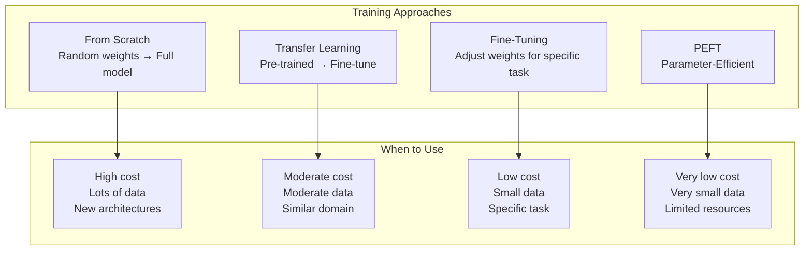
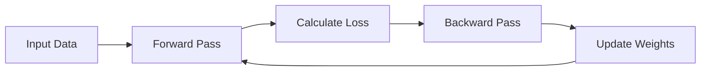
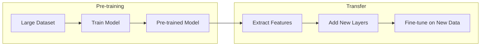
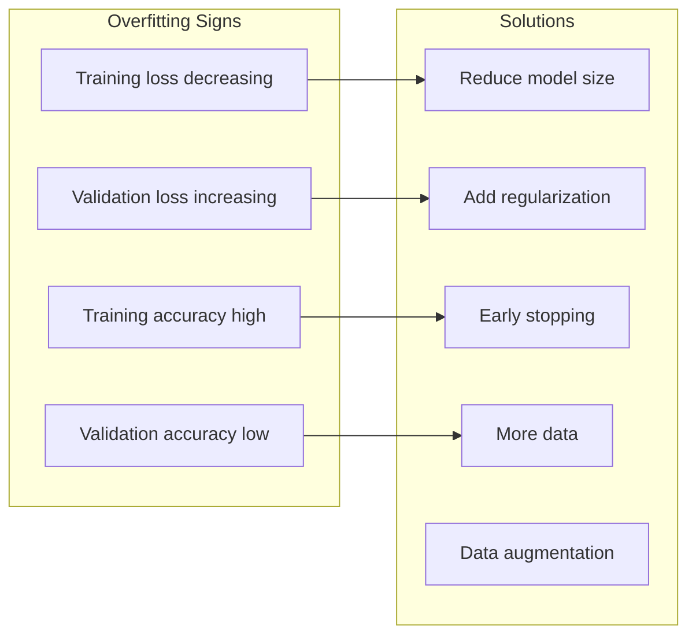

# AI Tutorial Series: Developer Edition
# Primer 4: Model Training & Fine-Tuning

**Understanding how models learn—from training from scratch to fine-tuning existing models for your specific use case.**

---

## Table of Contents

1. [Introduction](#introduction)
2. [How Models Learn](#how-models-learn)
3. [Training from Scratch](#training-from-scratch)
4. [Transfer Learning](#transfer-learning)
5. [Fine-Tuning](#fine-tuning)
6. [Parameter-Efficient Fine-Tuning](#parameter-efficient-fine-tuning)
7. [Evaluation & Validation](#evaluation--validation)
8. [Quick Reference](#quick-reference)

---

## Introduction

### Why Training & Fine-Tuning Matter

Understanding how models learn helps you:
- **Choose the right approach** — Fine-tune vs. use as-is
- **Debug issues** — Recognize training problems
- **Optimize performance** — Get better results
- **Build specialized models** — Domain-specific AI
- **Save costs** — Avoid unnecessary training

### Training Approaches



---

## How Models Learn

### The Learning Process



### Key Concepts

**1. Forward Pass**

Data flows through the model to produce a prediction.

```
Input → Layer 1 → Layer 2 → ... → Output
```

**2. Loss Function**

Measures how wrong the prediction is.

```python
# Mean Squared Error (Regression)
def mse_loss(pred, target):
    return ((pred - target) ** 2).mean()

# Cross-Entropy (Classification)
def cross_entropy_loss(pred, target):
    return - (target * log(pred)).mean()
```

**3. Backward Pass**

Calculates how much each weight contributed to the loss.

**4. Gradient Descent**

Updates weights to minimize loss.

```
weight = weight - learning_rate × gradient
```

**5. Epochs & Batches**

| Term | Meaning | Impact |
|------|---------|--------|
| **Epoch** | One full pass through training data | More epochs = more learning |
| **Batch** | A subset of data | Batch size affects stability |
| **Iteration** | One batch processed | Faster updates = faster learning |

---

## Training from Scratch

### When to Train from Scratch

✅ **Use from scratch when:**
- You have a very large dataset (millions+ samples)
- You're exploring new architectures
- Your problem is very different from existing tasks
- You have significant compute resources

❌ **Avoid from scratch when:**
- You have limited data
- Your task is similar to existing models
- You have limited compute
- You need results quickly

### Code Example: Training from Scratch

```python
import torch
import torch.nn as nn
import torch.optim as optim

class SimpleModel(nn.Module):
    def __init__(self, input_size, hidden_size, output_size):
        super(SimpleModel, self).__init__()
        self.fc1 = nn.Linear(input_size, hidden_size)
        self.fc2 = nn.Linear(hidden_size, output_size)
        self.relu = nn.ReLU()
    
    def forward(self, x):
        x = self.relu(self.fc1(x))
        x = self.fc2(x)
        return x

# Training loop
def train_model(model, train_loader, val_loader, epochs=10):
    criterion = nn.CrossEntropyLoss()
    optimizer = optim.Adam(model.parameters(), lr=0.001)
    
    for epoch in range(epochs):
        # Training phase
        model.train()
        train_loss = 0.0
        
        for batch_idx, (data, target) in enumerate(train_loader):
            optimizer.zero_grad()
            output = model(data)
            loss = criterion(output, target)
            loss.backward()
            optimizer.step()
            
            train_loss += loss.item()
        
        # Validation phase
        model.eval()
        val_loss = 0.0
        correct = 0
        
        with torch.no_grad():
            for data, target in val_loader:
                output = model(data)
                loss = criterion(output, target)
                val_loss += loss.item()
                
                pred = output.argmax(dim=1)
                correct += (pred == target).sum().item()
        
        accuracy = correct / len(val_loader.dataset)
        
        print(f"Epoch {epoch+1}/{epochs}:")
        print(f"  Train Loss: {train_loss/len(train_loader):.4f}")
        print(f"  Val Loss: {val_loss/len(val_loader):.4f}")
        print(f"  Accuracy: {accuracy:.4f}")
```

---

## Transfer Learning

### What is Transfer Learning?

Transfer learning uses knowledge learned from one task (e.g., image classification) and applies it to a different but related task (e.g., medical image diagnosis).



### Why Transfer Learning Works

- **Knowledge transfer** — Models learn general features
- **Faster training** — Less data needed
- **Better performance** — Leverage large pre-training datasets
- **Lower cost** — Less compute required

### Popular Pre-trained Models

| Model | Pre-trained On | Use Case |
|-------|----------------|----------|
| **BERT** | Books, Wikipedia | NLP, text classification |
| **GPT** | Internet text | Text generation |
| **ResNet** | ImageNet | Image classification |
| **CLIP** | Image-text pairs | Multimodal |
| **Whisper** | Audio | Speech recognition |

---

## Fine-Tuning

### What is Fine-Tuning?

Fine-tuning takes a pre-trained model and continues training it on your specific dataset.

```python
from transformers import AutoModelForSequenceClassification, AutoTokenizer

# Load pre-trained model
model_name = "bert-base-uncased"
model = AutoModelForSequenceClassification.from_pretrained(
    model_name,
    num_labels=2  # Your number of classes
)
tokenizer = AutoTokenizer.from_pretrained(model_name)

# Fine-tune the model
def fine_tune_model(model, train_dataset, val_dataset, epochs=3):
    from transformers import TrainingArguments, Trainer
    
    training_args = TrainingArguments(
        output_dir="./results",
        num_train_epochs=epochs,
        per_device_train_batch_size=16,
        per_device_eval_batch_size=64,
        warmup_steps=500,
        weight_decay=0.01,
        logging_dir="./logs",
        evaluation_strategy="epoch",
        save_strategy="epoch",
        load_best_model_at_end=True,
        metric_for_best_model="accuracy"
    )
    
    trainer = Trainer(
        model=model,
        args=training_args,
        train_dataset=train_dataset,
        eval_dataset=val_dataset,
        tokenizer=tokenizer,
    )
    
    trainer.train()
    return trainer
```

### Fine-Tuning Best Practices

| Practice | Why | How |
|----------|-----|-----|
| **Start small** | Minimize overfitting | Low learning rate (1e-5 to 3e-5) |
| **Monitor loss** | Detect overfitting | Validation after each epoch |
| **Freeze early layers** | Preserve general features | Layer freezing |
| **Use early stopping** | Prevent overfitting | Stop when validation loss increases |
| **Use appropriate batch size** | Balance speed/stability | 16-32 for transformer models |

---

## Parameter-Efficient Fine-Tuning (PEFT)

### Why PEFT?

| Method | Trainable Parameters | Memory | Speed |
|--------|---------------------|--------|-------|
| **Full Fine-Tuning** | 100% | High | Slow |
| **Adapter** | 2-5% | Medium | Medium |
| **LoRA** | 0.1-1% | Low | Fast |
| **Prefix Tuning** | 0.1-0.5% | Low | Fast |
| **BitFit** | 0.1% | Very Low | Very Fast |

### LoRA (Low-Rank Adaptation)

LoRA freezes the original weights and adds small trainable rank-decomposition matrices.

```python
# Using LoRA with Hugging Face
from peft import LoraConfig, get_peft_model, TaskType

# Configure LoRA
lora_config = LoraConfig(
    task_type=TaskType.CAUSAL_LM,
    r=8,  # Rank (small = less parameters)
    lora_alpha=32,
    lora_dropout=0.1,
    target_modules=["q_proj", "v_proj"]  # Which layers to adapt
)

# Apply LoRA to model
model = AutoModelForCausalLM.from_pretrained("meta-llama/Llama-2-7b-hf")
peft_model = get_peft_model(model, lora_config)

# Check trainable parameters
peft_model.print_trainable_parameters()
# Trainable params: 4.2M (0.03% of total)
```

### Adapter Training

Adapters add small trainable modules between layers.

```python
from adapters import AdapterConfig

# Add adapter
model.add_adapter("task_adapter", AdapterConfig.load("pfeiffer"))
model.train_adapter("task_adapter")

# Training is now efficient
trainer = Trainer(...)
trainer.train()
```

---

## Evaluation & Validation

### Training Metrics

| Metric | What It Measures | Target |
|--------|------------------|--------|
| **Loss** | Error magnitude | Decreasing |
| **Accuracy** | Correct predictions | > 90% |
| **F1 Score** | Precision + Recall | > 0.8 |
| **Perplexity** | Language model confidence | Decreasing |

### Cross-Validation

```python
from sklearn.model_selection import KFold
from sklearn.metrics import accuracy_score

def cross_validate(model_class, data, labels, n_folds=5):
    kf = KFold(n_splits=n_folds, shuffle=True, random_state=42)
    scores = []
    
    for fold, (train_idx, val_idx) in enumerate(kf.split(data)):
        print(f"Fold {fold+1}/{n_folds}")
        
        X_train, X_val = data[train_idx], data[val_idx]
        y_train, y_val = labels[train_idx], labels[val_idx]
        
        model = model_class()
        model.fit(X_train, y_train)
        
        pred = model.predict(X_val)
        score = accuracy_score(y_val, pred)
        scores.append(score)
    
    return {
        "mean_score": np.mean(scores),
        "std_score": np.std(scores),
        "scores": scores
    }
```

### Preventing Overfitting



---

## Quick Reference

### Training Checklist

- [ ] Define problem and metrics
- [ ] Prepare dataset (clean, split, augment)
- [ ] Choose pre-trained model
- [ ] Configure training (batch size, learning rate)
- [ ] Set up monitoring (logging, metrics)
- [ ] Train with validation
- [ ] Evaluate on test set
- [ ] Save best model

### Hyperparameter Ranges

| Hyperparameter | Range | Impact |
|----------------|-------|--------|
| **Learning Rate** | 1e-6 to 1e-3 | Training speed/stability |
| **Batch Size** | 8 to 128 | Training stability |
| **Epochs** | 3 to 30 | Training completeness |
| **Weight Decay** | 0.0 to 0.1 | Regularization |

### Resource Requirements

| Model Size | VRAM | Time (GPU) |
|------------|------|------------|
| **BERT-base** | 8-16 GB | 2-4 hours |
| **Llama 7B** | 48-80 GB | 1-3 days |
| **Llama 13B** | 80-160 GB | 3-7 days |
| **GPT-4** | 500+ GB | Weeks |

---

**End of Primer 4**
