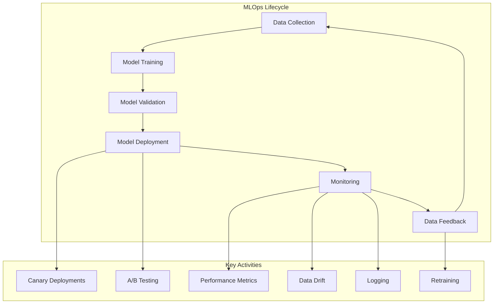
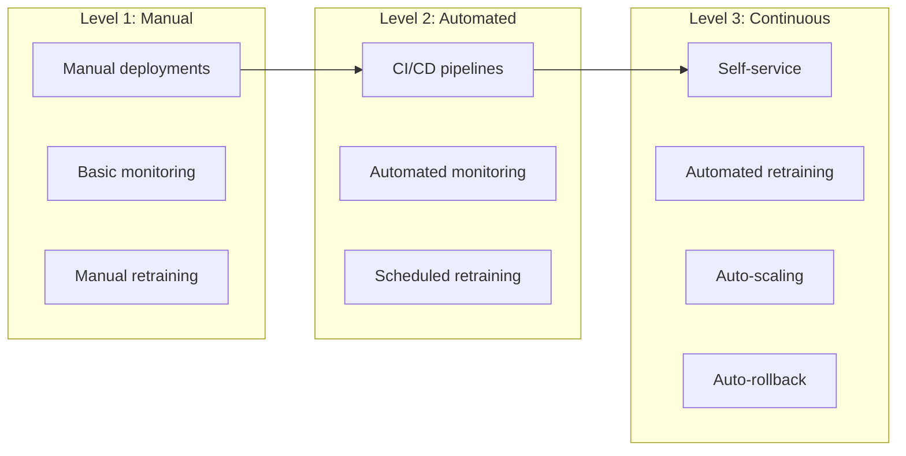

# AI Tutorial Series: Developer Edition
# Primer 5: Production AI Operations

**A practical guide to running AI systems in production—monitoring, scaling, reliability, and continuous improvement.**

---

## Table of Contents

1. [Introduction](#introduction)
2. [MLOps Overview](#mlops-overview)
3. [Model Deployment](#model-deployment)
4. [Model Monitoring](#model-monitoring)
5. [Model Performance Management](#model-performance-management)
6. [Scalability & Reliability](#scalability--reliability)
7. [Continuous Improvement](#continuous-improvement)
8. [Quick Reference](#quick-reference)

---

## Introduction

### What is Production AI Operations?

Production AI Operations (MLOps) is the practice of:
- **Deploying** models to production
- **Monitoring** model performance
- **Scaling** to handle traffic
- **Maintaining** reliability
- **Improving** continuously

### The MLOps Lifecycle



---

## MLOps Overview

### Key MLOps Pillars

| Pillar | Description | Key Activities |
|--------|-------------|----------------|
| **Deployment** | Getting models to production | Containerization, orchestration |
| **Monitoring** | Tracking model health | Metrics, logging, alerts |
| **Governance** | Ensuring compliance | Versioning, auditing |
| **Infrastructure** | Supporting operations | Scaling, reliability |
| **Continuous Improvement** | Iterative enhancement | Feedback loops, retraining |

### MLOps Maturity Levels



---

## Model Deployment

### Deployment Strategies

| Strategy | Description | Pros | Cons |
|----------|-------------|------|------|
| **Canary** | Gradual rollout | Low risk | Complex |
| **Blue-Green** | Two environments | Zero downtime | Resource-heavy |
| **A/B** | Compare versions | Data-driven | Complex |
| **Shadow** | Run alongside | Safe | Expensive |
| **Rolling** | Gradual replacement | Simple | Potential downtime |

### Canary Deployment

```yaml
# Kubernetes canary deployment
apiVersion: apps/v1
kind: Deployment
metadata:
  name: ai-service-canary
spec:
  replicas: 1  # 10% of traffic
  selector:
    matchLabels:
      app: ai-service
      version: canary
  template:
    metadata:
      labels:
        app: ai-service
        version: canary
    spec:
      containers:
      - name: ai-service
        image: ai-service:canary
---
# Service with weighted routing
apiVersion: v1
kind: Service
metadata:
  name: ai-service
spec:
  selector:
    app: ai-service
  ports:
  - port: 80
    targetPort: 8000
---
# Ingress with traffic splitting
apiVersion: networking.k8s.io/v1
kind: Ingress
metadata:
  name: ai-service
  annotations:
    nginx.ingress.kubernetes.io/canary: "true"
    nginx.ingress.kubernetes.io/canary-weight: "10"  # 10% traffic to canary
spec:
  rules:
  - host: ai-service.example.com
    http:
      paths:
      - path: /
        backend:
          serviceName: ai-service
          servicePort: 80
```

### Deployment Checklist

- [ ] **Model Artifacts** — Model files are versioned
- [ ] **Dependencies** — All dependencies are specified
- [ ] **Environment Variables** — All required env vars are set
- [ ] **Health Checks** — Liveness and readiness probes
- [ ] **Logging** — Application logs are configured
- [ ] **Metrics** — Prometheus metrics are exposed
- [ ] **Rollback Plan** — Strategy for failed deployments

---

## Model Monitoring

### What to Monitor

| Metric | What It Measures | Alert Threshold |
|--------|------------------|-----------------|
| **Latency** | Response time | > 1000ms (95th percentile) |
| **Error Rate** | Failed requests | > 5% |
| **Throughput** | Requests/second | Scale when > 80% capacity |
| **Model Performance** | Accuracy/Quality | Dropping > 5% |
| **Data Drift** | Input distribution changes | > 10% |
| **Resource Usage** | CPU, Memory, GPU | > 80% |

### Monitoring Implementation

```python
# Production monitoring system
class ModelMonitor:
    def __init__(self, model_name: str):
        self.model_name = model_name
        self.metrics = {}
        
    def log_prediction(self, input_data: Dict, output: Dict, latency_ms: float):
        # Log metrics
        self.metrics["total_predictions"] = self.metrics.get("total_predictions", 0) + 1
        self.metrics["total_latency"] = self.metrics.get("total_latency", 0) + latency_ms
        
        # Log to monitoring system
        self._send_to_metrics({
            "model": self.model_name,
            "input": input_data,
            "output": output,
            "latency_ms": latency_ms,
            "timestamp": time.time()
        })
        
        # Check for data drift
        self._check_drift(input_data)
    
    def _check_drift(self, input_data: Dict):
        # Compare with baseline distribution
        if self.baseline:
            drift_score = self._calculate_drift(input_data, self.baseline)
            
            if drift_score > self.drift_threshold:
                self._send_alert("Data drift detected", drift_score)
    
    def _send_alert(self, message: str, severity: str):
        # Send to alerting system (e.g., Slack, PagerDuty)
        print(f"Alert: {message} (severity: {severity})")
```

### Drift Detection

```python
import numpy as np
from scipy.stats import ks_2samp

class DriftDetector:
    @staticmethod
    def detect_drift(reference_data, current_data, threshold=0.05):
        drift_results = {}
        
        for feature in reference_data.columns:
            # Kolmogorov-Smirnov test
            ks_stat, p_value = ks_2samp(
                reference_data[feature].dropna(),
                current_data[feature].dropna()
            )
            
            drift_results[feature] = {
                "drift_detected": p_value < threshold,
                "p_value": p_value,
                "ks_stat": ks_stat
            }
        
        return drift_results
    
    @staticmethod
    def detect_drift_continuous(reference_data, current_data, window_size=1000):
        # Streaming drift detection
        if len(reference_data) < window_size:
            return {"status": "insufficient_data"}
        
        # Use moving average comparison
        reference_mean = reference_data.mean()
        current_mean = current_data.mean()
        
        relative_change = abs((current_mean - reference_mean) / reference_mean)
        
        return {
            "drift_detected": relative_change > 0.1,
            "relative_change": relative_change,
            "reference_mean": reference_mean,
            "current_mean": current_mean
        }
```

---

## Model Performance Management

### Performance Metrics

```python
class ModelPerformance:
    def __init__(self):
        self.metrics = {
            "accuracy": [],
            "latency": [],
            "throughput": []
        }
    
    def record_accuracy(self, accuracy: float):
        self.metrics["accuracy"].append(accuracy)
        self._check_degradation("accuracy", accuracy)
    
    def record_latency(self, latency_ms: float):
        self.metrics["latency"].append(latency_ms)
        self._check_degradation("latency", latency_ms)
    
    def _check_degradation(self, metric: str, value: float):
        if len(self.metrics[metric]) < 10:
            return
        
        # Check recent trend
        recent = self.metrics[metric][-10:]
        avg_recent = sum(recent) / len(recent)
        
        # Compare with historical average
        historical = self.metrics[metric][:-10]
        avg_historical = sum(historical) / len(historical) if historical else avg_recent
        
        if metric == "accuracy":
            # Check for significant drop
            if avg_recent < avg_historical * 0.95:
                self._alert(f"Accuracy dropped from {avg_historical:.3f} to {avg_recent:.3f}")
        else:
            # Check for significant increase (latency)
            if avg_recent > avg_historical * 1.2:
                self._alert(f"Latency increased from {avg_historical:.2f}ms to {avg_recent:.2f}ms")
```

### Performance Dashboard

```yaml
# Grafana dashboard configuration (simplified)
dashboard:
  title: "AI Service Performance"
  panels:
    - title: "Response Latency"
      type: "graph"
      metrics:
        - "ai_response_latency_p95"
        - "ai_response_latency_p99"
    
    - title: "Request Rate"
      type: "stat"
      metrics:
        - "ai_requests_total"
    
    - title: "Error Rate"
      type: "graph"
      metrics:
        - "ai_error_rate"
    
    - title: "Model Accuracy"
      type: "graph"
      metrics:
        - "ai_model_accuracy"
```

---

## Scalability & Reliability

### Scaling Strategies

```yaml
# Kubernetes Horizontal Pod Autoscaler
apiVersion: autoscaling/v2
kind: HorizontalPodAutoscaler
metadata:
  name: ai-service-hpa
spec:
  scaleTargetRef:
    apiVersion: apps/v1
    kind: Deployment
    name: ai-service
  minReplicas: 3
  maxReplicas: 20
  metrics:
  - type: Resource
    resource:
      name: cpu
      target:
        type: Utilization
        averageUtilization: 70
  - type: Pods
    pods:
      metric:
        name: requests_per_second
      target:
        type: AverageValue
        averageValue: "100"
```

### Reliability Patterns

```python
class ResilienceManager:
    def __init__(self):
        self.circuit_breaker = CircuitBreaker()
        self.retry_policy = RetryPolicy()
    
    def execute_safe(self, func, *args, **kwargs):
        try:
            # Circuit breaker
            if self.circuit_breaker.is_open():
                raise Exception("Circuit breaker is open")
            
            # Retry with backoff
            for attempt in range(self.retry_policy.max_retries):
                try:
                    result = func(*args, **kwargs)
                    self.circuit_breaker.record_success()
                    return result
                except Exception as e:
                    if attempt == self.retry_policy.max_retries - 1:
                        raise e
                    
                    # Exponential backoff
                    time.sleep(self.retry_policy.get_delay(attempt))
            
        except Exception as e:
            # Fallback response
            return self.get_fallback_response(e)
    
    def get_fallback_response(self, error):
        return {
            "success": False,
            "error": str(error),
            "fallback": True,
            "message": "Service temporarily degraded"
        }
```

---

## Continuous Improvement

### Feedback Loops

```python
class ContinuousImprovement:
    def __init__(self):
        self.feedback_data = []
        self.performance_data = []
    
    def collect_feedback(self, prediction_id: str, feedback: Dict):
        self.feedback_data.append({
            "prediction_id": prediction_id,
            "feedback": feedback,
            "timestamp": time.time()
        })
    
    def analyze_feedback(self):
        # Analyze feedback patterns
        positive_feedback = [f for f in self.feedback_data if f["feedback"].get("quality", 0) > 0.7]
        negative_feedback = [f for f in self.feedback_data if f["feedback"].get("quality", 0) <= 0.7]
        
        return {
            "total_feedback": len(self.feedback_data),
            "positive_rate": len(positive_feedback) / len(self.feedback_data) if self.feedback_data else 0,
            "negative_rate": len(negative_feedback) / len(self.feedback_data) if self.feedback_data else 0,
            "common_issues": self._find_common_issues(negative_feedback)
        }
    
    def decide_retraining(self):
        # Decision logic for retraining
        if self.should_retrain():
            self.trigger_retraining()
    
    def should_retrain(self):
        # Check if model needs retraining
        if len(self.feedback_data) < 1000:
            return False
        
        positive_rate = self.analyze_feedback()["positive_rate"]
        
        # Retrain if quality drops below threshold
        if positive_rate < 0.8:
            return True
        
        # Retrain if performance metrics degrade
        if self.performance_degraded():
            return True
        
        return False
```

### Model Versioning

```python
class ModelVersionManager:
    def __init__(self, model_registry_url):
        self.model_registry_url = model_registry_url
    
    def register_model(self, model, version: str, metadata: Dict):
        # Save model with version
        model.save(f"models/{version}.pkl")
        
        # Register in model registry
        registry_data = {
            "version": version,
            "metadata": metadata,
            "created_at": time.time(),
            "path": f"models/{version}.pkl"
        }
        
        self._save_registry(registry_data)
    
    def get_model(self, version: str = "latest"):
        if version == "latest":
            version = self._get_latest_version()
        
        return self._load_model(f"models/{version}.pkl")
    
    def get_models(self):
        return self._get_all_versions()
    
    def rollback(self, target_version: str):
        # Rollback to specific version
        self._deploy_version(target_version)
```

---

## Quick Reference

### MLOps Checklist

| Phase | Activity | Tool |
|-------|----------|------|
| **Deploy** | Containerization | Docker |
| | Orchestration | Kubernetes |
| | CI/CD | GitHub Actions, Jenkins |
| **Monitor** | Metrics | Prometheus |
| | Logging | ELK Stack |
| | Tracing | Jaeger |
| **Manage** | Versioning | MLflow, DVC |
| | Governance | Custom |
| **Improve** | Feedback | User signals |
| | Retraining | Scheduled pipelines |

### Common Alerts

| Alert | Cause | Action |
|-------|-------|--------|
| **High Latency** | Overloaded model | Scale up |
| **High Error Rate** | Model issues | Rollback |
| **Data Drift** | Input distribution changed | Retrain |
| **Model Degradation** | Performance decline | Retrain |
| **Resource Exhaustion** | Memory/CPU full | Scale up |

### Tools Reference

| Category | Tools |
|----------|-------|
| **Deployment** | Docker, Kubernetes, Helm |
| **Monitoring** | Prometheus, Grafana, ELK |
| **Logging** | ELK Stack, Datadog, Splunk |
| **Tracing** | Jaeger, Zipkin |
| **Versioning** | MLflow, DVC, Weights & Biases |
| **CI/CD** | GitHub Actions, Jenkins, GitLab CI |

---

**End of Primer 5**
