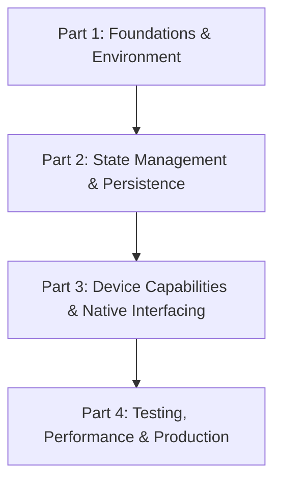

# Mobile Development with React Native: From Blueprint to Production

## Part 0: Introduction - The Journey Ahead

Welcome to the comprehensive, hands-on journey into React Native mobile development. This tutorial series is designed to transform you from a developer who may be familiar with web technologies into a confident mobile developer capable of building, testing, and deploying production-ready cross-platform applications.

Before we write a single line of code, let's establish exactly what you'll build, what technologies you'll master, and how this journey will unfold. This introduction serves as your roadmap, ensuring you understand the destination before taking the first step.

---

### The Ultimate Architecture: What You'll Build

By the end of this series, you will have built a fully functional mobile application called **"TaskFlow"** —a sophisticated task management and productivity tool. TaskFlow isn't just another todo list; it's a comprehensive mobile application that demonstrates every critical concept you'll need in real-world mobile development.

Here's what TaskFlow will do:

| Feature | Description |
|---------|-------------|
| **Secure Authentication** | Email/password login with JWT tokens, persistent sessions, and biometric support |
| **Task Management** | Create, read, update, delete tasks with rich metadata (due dates, priority levels, categories) |
| **Offline-First Architecture** | Full functionality without internet connectivity, with automatic synchronization |
| **Real-Time Collaboration** | Share tasks and receive real-time updates from team members |
| **Rich Media Attachments** | Attach photos, documents, and voice notes to tasks |
| **Advanced Search & Filters** | Search tasks by title, category, priority, and date range |
| **Push Notifications** | Customizable reminders and due-date alerts |
| **Dark Mode & Theming** | Full dark/light theme support with system preference detection |
| **Performance Metrics** | Built-in monitoring for app performance and error tracking |

### The Technology Stack

Let's look at the complete technology stack you'll master:

```
┌─────────────────────────────────────────────────────────────┐
│                     TASKFLOW APPLICATION                    │
├─────────────────────────────────────────────────────────────┤
│                                                             │
│  ┌─────────────┐  ┌─────────────┐  ┌──────────────────┐   │
│  │   UI Layer  │  │ Navigation  │  │  State Management │   │
│  │ React Native│  │    React    │  │      Zustand      │   │
│  │ Components  │  │ Navigation  │  │   & React Query  │   │
│  └─────────────┘  └─────────────┘  └──────────────────┘   │
│                                                             │
│  ┌─────────────┐  ┌─────────────┐  ┌──────────────────┐   │
│  │ Animations  │  │   Device    │  │     Forms &      │   │
│  │ Reanimated  │  │   APIs      │  │   Validation     │   │
│  │ Gesture     │  │ Camera, GPS │  │ React Hook Form │   │
│  │ Handler     │  │ Notifications│  │    + Zod        │   │
│  └─────────────┘  └─────────────┘  └──────────────────┘   │
│                                                             │
│  ┌──────────────────────────────────────────────────┐      │
│  │            Persistence Layer                     │      │
│  │  MMKV (Fast Key-Value) + SQLite (Complex Data)  │      │
│  └──────────────────────────────────────────────────┘      │
│                                                             │
│  ┌──────────────────────────────────────────────────┐      │
│  │              Network Layer                      │      │
│  │    Axios + React Query + Offline Sync           │      │
│  └──────────────────────────────────────────────────┘      │
│                                                             │
└─────────────────────────────────────────────────────────────┘
```

### Who This Series Is For

This tutorial series is designed for developers at various stages of their journey:

**You'll thrive here if you:**
- Have 1+ years of experience with JavaScript/TypeScript
- Understand basic React concepts (components, props, state)
- Are comfortable with the command line and version control (Git)
- Want to transition from web development to mobile
- Are excited by the idea of building truly native-feeling applications

**We'll briefly cover prerequisites, but you should know:**
- Basic HTML/CSS concepts (Flexbox, box model)
- JavaScript ES6+ features (arrow functions, destructuring, async/await)
- How to use npm or yarn for package management
- Familiarity with RESTful API concepts

**What this series is NOT:**
- A substitute for learning JavaScript fundamentals
- A comprehensive React Native API reference
- A deep dive into native language development (Swift/Kotlin)—though we'll touch on bridging

### What Makes This Series Different

This isn't a typical tutorial that just shows you snippets and hopes you'll connect the dots. Here's what sets this series apart:

#### 1. Production-Ready Code, Not Toys
Every line of code you'll write is designed to be deployable to the App Store and Google Play. We'll implement proper error handling, security practices, and performance optimizations that real production applications require.

#### 2. Complete, Copy-Pasteable Code Blocks
You'll never see `// implement the rest here` or `// TODO: add validation`. Every file, every function, every configuration is provided in its entirety. You can copy and paste these blocks into your project and they'll work.

#### 3. Verification at Every Step
Every implementation section includes explicit verification steps. You'll test your work immediately, catching issues early and building confidence as you progress.

#### 4. Explanation Without Abstraction
We use real-world analogies to make complex concepts accessible, but we never sacrifice technical accuracy. When we explain the React Native bridge architecture, you'll understand it thoroughly enough to debug bridge-related issues in production.

#### 5. Progressive Complexity
Each phase builds directly on the previous one. We never introduce a concept without explaining why it's needed right now and how it relates to what you've already built.

### Series Structure Overview

The series is divided into four main phases, each focusing on a critical aspect of mobile development:



#### Part 1: Foundations & Environment Architecture
**Duration:** 6-8 hours of hands-on work

In this phase, you'll:
- Understand the React Native architecture and how it differs from web development
- Set up your development environment for both iOS and Android
- Master Flexbox layout and responsive design in the mobile context
- Build the initial app structure with proper navigation

**Key Deliverables:**
- Fully configured development environment
- Working iOS and Android emulators/simulators
- App skeleton with navigation (Stack, Tab, Drawer)
- Responsive UI components

#### Part 2: State Management & Local Persistence
**Duration:** 8-10 hours of hands-on work

This phase focuses on data management:
- Implement local state with React hooks
- Build global state management with Zustand
- Set up local persistence with MMKV and SQLite
- Connect to a backend API with proper caching

**Key Deliverables:**
- Complete authentication flow (login, register, logout)
- Offline-capable task storage
- API integration with error handling and retry logic
- Real-time data synchronization

#### Part 3: Device Capabilities & Native Interfacing
**Duration:** 6-8 hours of hands-on work

You'll tap into the device's full potential:
- Access camera, photo library, and geolocation
- Build fluid, gesture-driven interfaces
- Create custom native modules for platform-specific features
- Implement forms with real-time validation

**Key Deliverables:**
- Image and file attachment functionality
- Gesture-based UI interactions
- Push notification system
- Complete form handling with validation

#### Part 4: Testing, Performance & Production Deployment
**Duration:** 4-6 hours of hands-on work

The final phase ensures your app is ready for the world:
- Optimize performance and fix bottlenecks
- Write comprehensive tests
- Set up CI/CD automation
- Deploy to app stores

**Key Deliverables:**
- Production-optimized app bundle
- Complete test suite
- Automated build pipeline
- Deployed application on TestFlight/Google Play Console

### Prerequisites and Setup Expectations

Before we begin, let's set clear expectations about the setup process:

**Development Machine Requirements:**

| Requirement | Minimum | Recommended |
|-------------|---------|-------------|
| **RAM** | 8GB | 16GB+ |
| **Storage** | 50GB free | 100GB+ SSD |
| **OS (macOS)** | macOS 11 (Big Sur) | macOS 13+ (Ventura) |
| **OS (Windows)** | Windows 10 64-bit | Windows 11 |
| **OS (Linux)** | Ubuntu 20.04 | Ubuntu 22.04 |

**Software You'll Need:**

- **Node.js** (v18 or newer) and npm/yarn/pnpm
- **Git** for version control
- **Xcode** (macOS only, for iOS development)
- **Android Studio** (for Android development)
- **VSCode** (recommended) or your preferred editor
- **Expo CLI** (we'll install this during setup)

**Important Note:** While we'll develop for both platforms, we recommend having access to a macOS machine for iOS development. Android development is possible on all platforms.

### What Success Looks Like

By the end of this series, you should be able to:

1. **Build any React Native application** from scratch with confidence
2. **Debug production issues** in both JavaScript and native code
3. **Implement complex features** (offline sync, animations, device APIs)
4. **Write clean, maintainable code** with proper testing
5. **Deploy to app stores** with confidence

### How to Get the Most From This Series

To maximize your learning and success:

1. **Code Along, Don't Just Read**
   - Create a new project and build it step by step
   - Make mistakes—they're learning opportunities
   - Experiment by modifying the code as you go

2. **Complete Every Verification Step**
   - Test at each milestone, even if it feels repetitive
   - Understanding WHY something works is as important as knowing HOW
   - Take screenshots of your successes (and failures!)

3. **Ask Questions (and Answer Them)**
   - Engage with the community in the comments
   - Try to answer others' questions—it deepens understanding
   - Document your own discoveries and share them

4. **Build in Small, Focused Sessions**
   - Each phase is broken into digestible parts
   - Take breaks between major sections
   - Reflect on what you've learned before moving on

5. **Create Your Own Extensions**
   - After completing TaskFlow, think about what you'd add
   - Experiment with different state management approaches
   - Try building a different app using the same patterns

### The Road Ahead: Your First Steps

Now that you understand the journey ahead, here's what happens next:

1. **Immediate Next Step:** Part 1, Phase 1 begins the technical journey. You'll:
   - Understand the React Native architecture
   - Set up your development environment
   - Create your first project

2. **What to Have Ready:** Before starting Part 1:
   - Ensure your development machine meets the requirements
   - Install Node.js and Git if you haven't already
   - Register for a GitHub account (optional but recommended)
   - Prepare to install platform-specific tools (Xcode/Android Studio)

3. **Success Indicators:** You'll know you're ready to proceed when:
   - You can run a new React Native project
   - You understand the role of the bridge architecture
   - Your development environment is stable on your chosen platform

### Series Terminology Glossary

Before we move on, let's define some key terms you'll encounter throughout the series:

| Term | Definition |
|------|------------|
| **React Native** | A framework that allows building mobile apps using React and JavaScript |
| **Bridge** | React Native's communication layer between JavaScript and native code |
| **Native Modules** | Platform-specific code (Swift/Objective-C for iOS, Kotlin/Java for Android) |
| **Expo** | A toolset that simplifies React Native development with managed workflows |
| **Bare Workflow** | Direct React Native development without Expo's managed layer |
| **Metro** | React Native's JavaScript bundler |
| **Hermes** | A JavaScript engine optimized for React Native |
| **JSI (JavaScript Interface)** | A modern, faster alternative to the bridge architecture |
| **Component** | A reusable piece of UI in React Native |
| **State** | Data that determines a component's behavior and rendering |
| **Store** | A container for application state in state management libraries |
| **Reconciliation** | React's process of updating the DOM (or native views) |
| **Virtual DOM** | React's in-memory representation of the UI |
| **Shadow Tree** | React Native's layout engine that runs on a separate thread |
| **UI Thread** | The thread responsible for rendering the user interface |
| **JS Thread** | The thread where JavaScript code executes in React Native |

### Ready? Let's Build Something Amazing

You're about to embark on a journey that will take you from mobile development novice to confident app builder. This isn't just about learning syntax or APIs—it's about developing a mental model for thinking about mobile development as a craft.

The path ahead will challenge you. You'll encounter build errors, configuration issues, and moments where something just doesn't work as expected. This is normal, and it's how we all learn. The verification steps and troubleshooting sections will help you navigate these obstacles.

Remember: every expert mobile developer started exactly where you are now—with a desire to build something meaningful and the willingness to learn. The only difference is that they kept going when things got difficult.

So let's get started. Open your terminal, clear your mind, and prepare to build something extraordinary.


---

*Next up: Part 1, Phase 1 - Understanding React Native Architecture & Setting Up Your Environment.*

**What We'll Cover Next:**
- The React Native paradigm shift: why mobile development is fundamentally different from the web
- Deep dive into the bridge architecture and JavaScript execution context
- Step-by-step environment configuration for Expo and bare React Native CLI
- Initial project creation and first run

Ready? Open your terminal and let's begin.

---

*This concludes Part 0 of the Mobile Development with React Native series. Please proceed to Part 1 for the hands-on environment setup and architecture fundamentals.*
